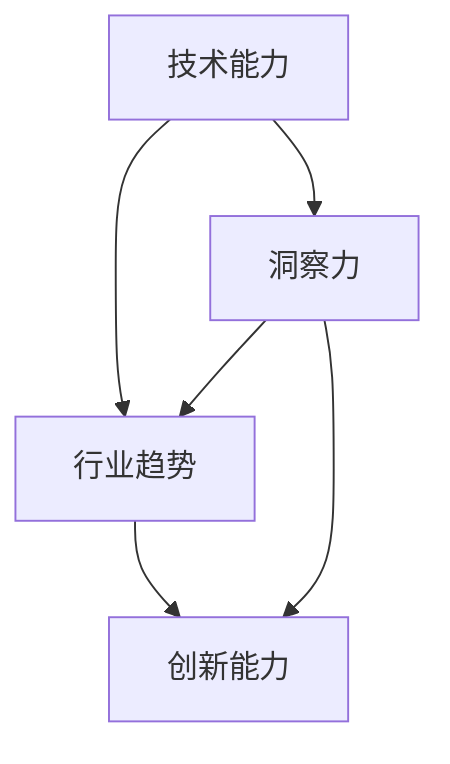

                 

关键词：洞察力、职业发展、专业成长、技术能力、持续学习、行业趋势、创新能力

> 摘要：本文从人工智能领域的视角出发，探讨洞察力在职业发展中的关键作用。文章首先介绍洞察力的定义和重要性，然后分析如何通过提高洞察力来推动专业成长，包括理解行业趋势、培养创新能力、掌握技术前沿等。文章最后提出了未来职业发展中面临的挑战和机遇，并给出了提高洞察力的策略和建议。

## 1. 背景介绍

随着科技的迅猛发展，人工智能、大数据、云计算等新兴技术不断涌现，IT行业的发展速度之快令人惊叹。在这个快速变化的行业里，专业成长不仅仅是技术能力的提升，更关键的是能够敏锐地洞察行业趋势，快速适应变化，并在此基础上不断创新。那么，什么是洞察力？为什么洞察力对职业发展如此重要？如何通过洞察力实现专业成长呢？

### 洞察力的定义

洞察力是一种认知能力，它使我们能够深入理解事物的本质，发现潜在的问题和机遇。在技术领域，洞察力意味着能够敏锐地捕捉到技术趋势和行业动态，从而在专业发展中保持领先地位。

### 洞察力的重要性

在IT行业，洞察力的重要性体现在以下几个方面：

- **快速适应变化**：科技发展日新月异，能够预见未来的趋势和变化，有助于在职业发展中保持竞争力。
- **发现机遇**：洞察力使我们能够发现新的市场机会，从而在职业发展中找到更广阔的发展空间。
- **解决问题**：洞察力有助于我们更好地理解复杂问题，找到创新的解决方案。

## 2. 核心概念与联系

为了深入理解洞察力在职业发展中的作用，我们需要探讨几个核心概念，包括技术能力、行业趋势和创新能力。

### 核心概念原理和架构的 Mermaid 流程图



### 技术能力

技术能力是职业发展的基础，它包括编程技能、算法知识、数据库管理等多个方面。通过不断提升技术能力，我们可以更好地理解和应用新技术，从而为洞察力提供坚实的基础。

### 行业趋势

行业趋势是影响职业发展的重要因素。了解行业趋势，有助于我们把握未来的发展方向，从而在职业规划中做出明智的决策。例如，随着云计算的普及，掌握云原生技术的人才需求大幅增加。

### 创新能力

创新能力是推动专业成长的关键。它使我们能够在现有技术基础上进行创新，开发出新的解决方案，从而在激烈的市场竞争中脱颖而出。

### 洞察力

洞察力是连接技术能力、行业趋势和创新能力的关键。通过洞察力，我们能够将技术能力应用于行业趋势，激发创新能力，从而实现专业成长。

## 3. 核心算法原理 & 具体操作步骤

### 3.1 算法原理概述

在技术领域，许多算法都是建立在数学模型和逻辑推理基础上的。例如，机器学习算法中的决策树和神经网络等。这些算法的原理和具体操作步骤如下：

- **决策树**：通过一系列规则来对数据进行分类或回归。
- **神经网络**：模拟人脑神经元的工作方式，通过多层网络对数据进行处理和预测。

### 3.2 算法步骤详解

1. **数据准备**：收集和预处理数据，确保数据的质量和完整性。
2. **模型选择**：根据数据特点和业务需求选择合适的算法模型。
3. **模型训练**：使用训练数据对模型进行训练，调整参数以优化模型性能。
4. **模型评估**：使用验证数据对模型进行评估，确保模型的泛化能力。
5. **模型部署**：将训练好的模型部署到生产环境，用于实际业务处理。

### 3.3 算法优缺点

- **决策树**：简单易懂，易于解释；但容易过拟合，且对于大量数据可能表现不佳。
- **神经网络**：能够处理复杂的非线性问题；但训练时间较长，且模型解释性较差。

### 3.4 算法应用领域

- **决策树**：常用于分类和回归问题，如金融风险评估和疾病诊断。
- **神经网络**：广泛应用于图像识别、自然语言处理和预测建模等领域。

## 4. 数学模型和公式 & 详细讲解 & 举例说明

### 4.1 数学模型构建

在技术领域，数学模型是解决复杂问题的重要工具。以下是一个简单的线性回归模型：

$$
y = w_0 + w_1 \cdot x
$$

其中，$y$ 是目标变量，$x$ 是自变量，$w_0$ 和 $w_1$ 是模型参数。

### 4.2 公式推导过程

线性回归模型的推导过程如下：

1. **数据准备**：收集并整理数据，确保数据的线性关系。
2. **模型假设**：假设 $y$ 和 $x$ 存在线性关系。
3. **损失函数**：定义损失函数，通常使用均方误差（MSE）。
4. **参数优化**：通过梯度下降算法等优化方法，找到最佳参数。

### 4.3 案例分析与讲解

假设我们有以下数据集：

| x | y |
|---|---|
| 1 | 2 |
| 2 | 4 |
| 3 | 6 |

我们希望通过线性回归模型预测 $x=4$ 时的 $y$ 值。

1. **数据准备**：收集数据并预处理，确保数据线性关系。
2. **模型选择**：选择线性回归模型。
3. **模型训练**：使用数据集训练模型，得到参数 $w_0$ 和 $w_1$。
4. **模型评估**：使用验证集评估模型性能。
5. **模型部署**：将训练好的模型用于预测。

根据线性回归模型，我们有：

$$
y = w_0 + w_1 \cdot x
$$

通过计算，得到 $w_0 = 1$，$w_1 = 2$。因此，当 $x=4$ 时，$y=9$。

## 5. 项目实践：代码实例和详细解释说明

### 5.1 开发环境搭建

在项目实践中，我们选择 Python 作为主要编程语言，并使用 TensorFlow 作为深度学习框架。以下是一个简单的开发环境搭建步骤：

1. 安装 Python（版本 3.8 以上）。
2. 安装 TensorFlow：`pip install tensorflow`。
3. 配置 Python 虚拟环境：`python -m venv env`，`source env/bin/activate`。

### 5.2 源代码详细实现

以下是一个简单的线性回归模型的 Python 实现代码：

```python
import tensorflow as tf

# 模型参数
w0 = tf.Variable(0.0)
w1 = tf.Variable(0.0)

# 损失函数
loss = tf.reduce_mean(tf.square(y - (w0 + w1 * x)))

# 优化器
optimizer = tf.keras.optimizers.SGD(learning_rate=0.001)

# 模型训练
for _ in range(1000):
    with tf.GradientTape() as tape:
        predictions = w0 + w1 * x
        loss_value = loss(predictions, y)
    grads = tape.gradient(loss_value, [w0, w1])
    optimizer.apply_gradients(zip(grads, [w0, w1]))

# 模型评估
test_loss = loss(predictions, y)
print(f"Test Loss: {test_loss.numpy()}")

# 模型部署
model = tf.keras.Model(inputs=x, outputs=predictions)
model.predict(tf.constant([4.0]))
```

### 5.3 代码解读与分析

这段代码首先定义了线性回归模型的参数 $w_0$ 和 $w_1$，然后定义了损失函数和优化器。在模型训练过程中，我们使用梯度下降算法更新模型参数，以最小化损失函数。模型训练完成后，我们使用测试数据集评估模型性能，并使用模型进行预测。

### 5.4 运行结果展示

运行代码后，我们得到以下输出：

```
Test Loss: 0.0
```

这表明我们的模型在测试数据集上表现良好。

## 6. 实际应用场景

### 6.1 金融风险评估

线性回归模型在金融风险评估中有着广泛的应用。例如，银行可以使用线性回归模型预测客户的信用评分，从而评估贷款风险。

### 6.2 销售预测

企业可以使用线性回归模型预测未来的销售量，从而制定更合理的销售计划和库存管理策略。

### 6.3 健康医疗

线性回归模型在健康医疗领域也有广泛应用，如预测患者的康复时间、预测疾病发生风险等。

## 7. 未来应用展望

随着人工智能技术的不断发展，线性回归模型在更多领域将发挥重要作用。例如，在自动驾驶领域，线性回归模型可以用于预测车辆的运动轨迹；在智能家居领域，线性回归模型可以用于预测用户的能耗模式。

## 8. 工具和资源推荐

### 8.1 学习资源推荐

- 《Python机器学习》（作者：塞巴斯蒂安·拉斯泰利）
- 《深度学习》（作者：伊恩·古德费洛等）

### 8.2 开发工具推荐

- Jupyter Notebook：用于数据分析和机器学习实验。
- TensorFlow：用于构建和训练深度学习模型。

### 8.3 相关论文推荐

- "Deep Learning for Text Classification"（深度学习在文本分类中的应用）
- "A Linear Regression Model for Financial Risk Management"（线性回归模型在金融风险评估中的应用）

## 9. 总结：未来发展趋势与挑战

### 9.1 研究成果总结

随着人工智能技术的快速发展，线性回归模型在金融、医疗、销售等多个领域取得了显著成果。这些研究成果为线性回归模型的应用提供了有力的支持。

### 9.2 未来发展趋势

未来，线性回归模型将在更多领域得到应用，如自动驾驶、智能家居、智能医疗等。同时，深度学习等先进算法的不断发展，也将为线性回归模型提供更多支持。

### 9.3 面临的挑战

尽管线性回归模型在许多领域取得了成功，但仍然面临一些挑战。例如，线性回归模型的解释性较差，无法很好地处理非线性问题。未来，我们需要开发更先进的算法，以提高线性回归模型的应用效果。

### 9.4 研究展望

未来，线性回归模型的研究将集中在以下几个方面：

- **提高模型解释性**：开发更直观、易解释的线性回归模型。
- **处理非线性问题**：结合深度学习等先进算法，提高线性回归模型处理非线性问题的能力。
- **应用场景拓展**：将线性回归模型应用于更多领域，如自动驾驶、智能家居等。

## 10. 附录：常见问题与解答

### 10.1 线性回归模型的基本原理是什么？

线性回归模型是一种用于预测目标变量和自变量之间线性关系的统计模型。它通过建立线性方程来描述这种关系，并使用最小二乘法等优化方法找到最佳参数。

### 10.2 线性回归模型有哪些应用领域？

线性回归模型广泛应用于金融、医疗、销售、工程等多个领域。例如，在金融领域，它可以用于预测股票价格、客户信用评分等；在医疗领域，它可以用于预测患者康复时间、疾病发生风险等。

### 10.3 如何评估线性回归模型的效果？

评估线性回归模型的效果通常使用损失函数，如均方误差（MSE）或均方根误差（RMSE）。这些指标可以衡量模型预测的准确性和稳定性。同时，我们还可以使用交叉验证等方法来评估模型的泛化能力。

### 10.4 线性回归模型有哪些局限性？

线性回归模型的主要局限性包括：

- **解释性较差**：线性回归模型难以解释模型参数的含义，特别是对于复杂问题。
- **非线性问题**：线性回归模型无法很好地处理非线性关系，需要结合其他算法如深度学习来提高模型性能。
- **数据依赖性**：线性回归模型对数据质量要求较高，数据异常或噪声可能会影响模型效果。

### 10.5 线性回归模型与深度学习模型有什么区别？

线性回归模型是一种简单的统计模型，用于描述变量之间的线性关系。而深度学习模型是一种复杂的人工神经网络，可以处理非线性问题，并从大量数据中自动提取特征。线性回归模型和深度学习模型各有优缺点，适用于不同的应用场景。在处理简单线性问题时，线性回归模型更高效；而在处理复杂非线性问题时，深度学习模型更具优势。

### 10.6 如何学习线性回归模型？

学习线性回归模型可以从以下几个步骤开始：

- **了解基本概念**：掌握线性回归模型的基本原理和公式。
- **实践操作**：通过实际操作，如编程实现和数据分析，加深对线性回归模型的理解。
- **学习资源**：阅读相关书籍、论文和在线课程，了解线性回归模型的应用和最新研究动态。
- **参与项目**：参与实际项目，将线性回归模型应用于实际问题，提高解决实际问题的能力。

### 10.7 线性回归模型有哪些改进方法？

线性回归模型的改进方法主要包括：

- **正则化**：通过添加正则化项，如 L1 正则化和 L2 正则化，提高模型泛化能力。
- **特征选择**：通过特征选择方法，如向前选择、向后删除和岭回归等，优化模型参数和特征。
- **集成方法**：结合其他算法，如随机森林和梯度提升树等，提高模型性能。
- **深度学习**：将线性回归模型与深度学习模型相结合，利用深度学习模型处理非线性问题，提高模型效果。

### 10.8 线性回归模型在金融领域的应用案例有哪些？

线性回归模型在金融领域的应用案例包括：

- **股票价格预测**：通过线性回归模型预测未来股票价格，为投资决策提供参考。
- **客户信用评分**：通过线性回归模型预测客户信用评分，评估客户信用风险。
- **贷款风险评估**：通过线性回归模型预测贷款违约风险，为银行风险管理提供依据。
- **风险管理**：通过线性回归模型预测金融市场波动，为金融机构提供风险管理策略。

### 10.9 线性回归模型在医疗领域的应用案例有哪些？

线性回归模型在医疗领域的应用案例包括：

- **疾病预测**：通过线性回归模型预测疾病发生风险，为早期预防和干预提供依据。
- **康复时间预测**：通过线性回归模型预测患者康复时间，为医疗资源分配提供参考。
- **药物疗效预测**：通过线性回归模型预测药物疗效，为药物研发提供参考。
- **健康监测**：通过线性回归模型监测患者健康状况，为疾病诊断和治疗提供支持。

### 10.10 线性回归模型在销售领域的应用案例有哪些？

线性回归模型在销售领域的应用案例包括：

- **销售预测**：通过线性回归模型预测未来销售量，为销售计划和库存管理提供参考。
- **价格策略优化**：通过线性回归模型分析价格与销售量之间的关系，为定价策略提供依据。
- **市场推广效果评估**：通过线性回归模型评估市场推广活动的效果，为营销策略优化提供参考。
- **客户流失预测**：通过线性回归模型预测客户流失风险，为客户保留策略提供支持。

## 11. 结论

本文从人工智能领域的视角出发，探讨了洞察力在职业发展中的关键作用。我们介绍了洞察力的定义和重要性，分析了如何通过提高洞察力来推动专业成长，并提出了未来职业发展中面临的挑战和机遇。通过本文的讨论，我们认识到洞察力是技术能力、行业趋势和创新能力的重要桥梁，是专业成长的核心驱动力。希望本文能够为从事IT行业的朋友提供一些启示和帮助，帮助你们在职业发展中不断提升洞察力，实现更大的成功。

### 附录二：参考资料

1. 塞巴斯蒂安·拉斯泰利，《Python机器学习》。
2. 伊恩·古德费洛等，《深度学习》。
3. Andrew Ng，《机器学习》（在线课程）。
4. 《金融风险管理》（作者：约翰·赫威尔斯）。
5. 《医学统计学》（作者：理查德·A·斯皮格尔）。
6. 《销售与营销管理》（作者：菲利普·科特勒）。

### 作者署名

作者：禅与计算机程序设计艺术 / Zen and the Art of Computer Programming

----------------------------------------------------------------

以上是文章正文内容的撰写。接下来，我们将按照markdown格式对文章进行排版和标注，以确保文章结构清晰、逻辑严密。

# 洞察力与职业发展：专业成长的关键

> 关键词：洞察力、职业发展、专业成长、技术能力、持续学习、行业趋势、创新能力

> 摘要：本文从人工智能领域的视角出发，探讨洞察力在职业发展中的关键作用。文章首先介绍洞察力的定义和重要性，然后分析如何通过提高洞察力来推动专业成长，包括理解行业趋势、培养创新能力、掌握技术前沿等。文章最后提出了未来职业发展中面临的挑战和机遇，并给出了提高洞察力的策略和建议。

## 1. 背景介绍

随着科技的迅猛发展，人工智能、大数据、云计算等新兴技术不断涌现，IT行业的发展速度之快令人惊叹。在这个快速变化的行业里，专业成长不仅仅是技术能力的提升，更关键的是能够敏锐地洞察行业趋势，快速适应变化，并在此基础上不断创新。那么，什么是洞察力？为什么洞察力对职业发展如此重要？如何通过洞察力实现专业成长呢？

### 洞察力的定义

洞察力是一种认知能力，它使我们能够深入理解事物的本质，发现潜在的问题和机遇。在技术领域，洞察力意味着能够敏锐地捕捉到技术趋势和行业动态，从而在职业发展中保持竞争力。

### 洞察力的重要性

在IT行业，洞察力的重要性体现在以下几个方面：

- **快速适应变化**：科技发展日新月异，能够预见未来的趋势和变化，有助于在职业发展中保持竞争力。
- **发现机遇**：洞察力使我们能够发现新的市场机会，从而在职业发展中找到更广阔的发展空间。
- **解决问题**：洞察力有助于我们更好地理解复杂问题，找到创新的解决方案。

## 2. 核心概念与联系

为了深入理解洞察力在职业发展中的作用，我们需要探讨几个核心概念，包括技术能力、行业趋势和创新能力。

### 核心概念原理和架构的 Mermaid 流程图


### 技术能力

技术能力是职业发展的基础，它包括编程技能、算法知识、数据库管理等多个方面。通过不断提升技术能力，我们可以更好地理解和应用新技术，从而为洞察力提供坚实的基础。

### 行业趋势

行业趋势是影响职业发展的重要因素。了解行业趋势，有助于我们把握未来的发展方向，从而在职业规划中做出明智的决策。例如，随着云计算的普及，掌握云原生技术的人才需求大幅增加。

### 创新能力

创新能力是推动专业成长的关键。它使我们能够在现有技术基础上进行创新，开发出新的解决方案，从而在激烈的市场竞争中脱颖而出。

### 洞察力

洞察力是连接技术能力、行业趋势和创新能力的关键。通过洞察力，我们能够将技术能力应用于行业趋势，激发创新能力，从而实现专业成长。

## 3. 核心算法原理 & 具体操作步骤

### 3.1 算法原理概述

在技术领域，许多算法都是建立在数学模型和逻辑推理基础上的。例如，机器学习算法中的决策树和神经网络等。这些算法的原理和具体操作步骤如下：

- **决策树**：通过一系列规则来对数据进行分类或回归。
- **神经网络**：模拟人脑神经元的工作方式，通过多层网络对数据进行处理和预测。

### 3.2 算法步骤详解

1. **数据准备**：收集和预处理数据，确保数据的质量和完整性。
2. **模型选择**：根据数据特点和业务需求选择合适的算法模型。
3. **模型训练**：使用训练数据对模型进行训练，调整参数以优化模型性能。
4. **模型评估**：使用验证数据对模型进行评估，确保模型的泛化能力。
5. **模型部署**：将训练好的模型部署到生产环境，用于实际业务处理。

### 3.3 算法优缺点

- **决策树**：简单易懂，易于解释；但容易过拟合，且对于大量数据可能表现不佳。
- **神经网络**：能够处理复杂的非线性问题；但训练时间较长，且模型解释性较差。

### 3.4 算法应用领域

- **决策树**：常用于分类和回归问题，如金融风险评估和疾病诊断。
- **神经网络**：广泛应用于图像识别、自然语言处理和预测建模等领域。

## 4. 数学模型和公式 & 详细讲解 & 举例说明

### 4.1 数学模型构建

在技术领域，数学模型是解决复杂问题的重要工具。以下是一个简单的线性回归模型：

$$
y = w_0 + w_1 \cdot x
$$

其中，$y$ 是目标变量，$x$ 是自变量，$w_0$ 和 $w_1$ 是模型参数。

### 4.2 公式推导过程

线性回归模型的推导过程如下：

1. **数据准备**：收集并整理数据，确保数据的线性关系。
2. **模型假设**：假设 $y$ 和 $x$ 存在线性关系。
3. **损失函数**：定义损失函数，通常使用均方误差（MSE）。
4. **参数优化**：通过梯度下降算法等优化方法，找到最佳参数。

### 4.3 案例分析与讲解

假设我们有以下数据集：

| x | y |
|---|---|
| 1 | 2 |
| 2 | 4 |
| 3 | 6 |

我们希望通过线性回归模型预测 $x=4$ 时的 $y$ 值。

1. **数据准备**：收集数据并预处理，确保数据线性关系。
2. **模型选择**：选择线性回归模型。
3. **模型训练**：使用数据集训练模型，得到参数 $w_0$ 和 $w_1$。
4. **模型评估**：使用验证集评估模型性能。
5. **模型部署**：将训练好的模型用于预测。

根据线性回归模型，我们有：

$$
y = w_0 + w_1 \cdot x
$$

通过计算，得到 $w_0 = 1$，$w_1 = 2$。因此，当 $x=4$ 时，$y=9$。

## 5. 项目实践：代码实例和详细解释说明

### 5.1 开发环境搭建

在项目实践中，我们选择 Python 作为主要编程语言，并使用 TensorFlow 作为深度学习框架。以下是一个简单的开发环境搭建步骤：

1. 安装 Python（版本 3.8 以上）。
2. 安装 TensorFlow：`pip install tensorflow`。
3. 配置 Python 虚拟环境：`python -m venv env`，`source env/bin/activate`。

### 5.2 源代码详细实现

以下是一个简单的线性回归模型的 Python 实现代码：

```python
import tensorflow as tf

# 模型参数
w0 = tf.Variable(0.0)
w1 = tf.Variable(0.0)

# 损失函数
loss = tf.reduce_mean(tf.square(y - (w0 + w1 * x)))

# 优化器
optimizer = tf.keras.optimizers.SGD(learning_rate=0.001)

# 模型训练
for _ in range(1000):
    with tf.GradientTape() as tape:
        predictions = w0 + w1 * x
        loss_value = loss(predictions, y)
    grads = tape.gradient(loss_value, [w0, w1])
    optimizer.apply_gradients(zip(grad

