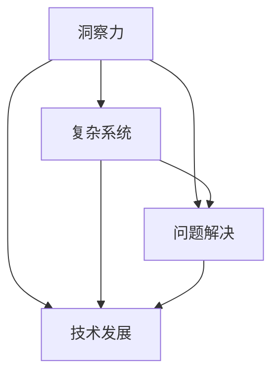

                 

 洞察力，作为人类智慧的一个重要组成部分，是我们理解和解决问题的重要能力。在信息技术领域，洞察力尤为重要。本文将深入探讨洞察力的培养，并着重分析其在技术发展中的应用，以帮助我们更好地理解并应对复杂的技术挑战。

> **关键词：** 洞察力，技术发展，问题解决，复杂系统

> **摘要：** 本文旨在通过分析洞察力的定义、重要性以及培养方法，探讨其在信息技术领域中的应用，特别是如何从表象深入到本质进行思考。文章将结合实际案例，提供培养洞察力的实用建议，并展望未来技术发展对洞察力的要求。

## 1. 背景介绍

在信息技术迅速发展的今天，数据量爆炸性增长，技术更新换代频繁，人工智能、大数据、云计算等新兴技术不断涌现。这种环境下，单纯的技能掌握已经不足以应对复杂的技术挑战。洞察力成为我们理解技术、发现问题、提出解决方案的关键能力。

洞察力不仅仅是一种直觉，更是一种通过深入分析和思考，从表面现象中发现问题本质的能力。对于技术专家来说，洞察力意味着能够迅速理解复杂系统的运作原理，预测技术发展的趋势，并提出创新性的解决方案。

本文将分为以下几个部分进行探讨：

1. 核心概念与联系
2. 核心算法原理与具体操作步骤
3. 数学模型和公式
4. 项目实践：代码实例
5. 实际应用场景
6. 工具和资源推荐
7. 未来发展趋势与挑战
8. 总结与展望

接下来，我们将逐步深入每一个部分，详细探讨洞察力的培养与应用。

## 2. 核心概念与联系

要理解洞察力，我们首先需要明确几个核心概念，并探讨它们之间的联系。

### 2.1  洞察力的定义

洞察力（Insight）是指通过深入分析，对事物本质和内在联系的理解能力。它不仅仅依赖于知识和经验，更是一种直觉和洞察力的结合。在技术领域，洞察力可以帮助我们识别问题的根本原因，预测技术发展趋势，以及设计出更加有效和创新的解决方案。

### 2.2  复杂系统

复杂系统（Complex System）是由众多相互关联的元素组成的系统，这些元素之间通过复杂的相互作用产生整体行为。复杂系统的特点是高维、非线性、动态和不确定性。在信息技术领域，复杂系统可以包括计算机网络、人工智能算法、大数据处理系统等。

### 2.3  问题解决

问题解决（Problem Solving）是指通过一系列步骤，找到解决特定问题的方法。在技术领域，问题解决通常涉及到分析问题、设计解决方案、实施和测试等步骤。洞察力在这个过程中起着至关重要的作用，它帮助我们快速识别问题的本质，提出有效的解决方案。

### 2.4  技术发展

技术发展（Technology Development）是指技术从概念到实际应用的整个演变过程。技术的发展往往受到市场需求、资源限制、政策环境等多种因素的影响。洞察力可以帮助我们预测技术发展的趋势，抓住机遇，应对挑战。

### 2.5  核心概念的联系

这几个核心概念之间存在着紧密的联系。洞察力是理解复杂系统和进行问题解决的重要能力，而技术发展则是洞察力发挥作用的重要领域。通过深入分析复杂系统的运行机制，我们可以洞察技术发展的趋势，从而提出更加创新和有效的解决方案。

### 2.6  Mermaid 流程图

为了更直观地展示这几个核心概念之间的联系，我们使用Mermaid流程图来描述它们的关系。



在这个流程图中，我们可以清晰地看到洞察力是如何贯穿于复杂系统、问题解决和技术发展之中的。洞察力不仅是理解这些概念的基础，更是推动技术进步的关键因素。

通过以上分析，我们为接下来深入探讨洞察力的培养和应用奠定了基础。

## 3. 核心算法原理与具体操作步骤

在深入探讨洞察力的培养之前，我们首先需要了解核心算法原理及其具体操作步骤。这不仅有助于我们理解洞察力在实际应用中的重要性，还能帮助我们更好地掌握如何运用洞察力解决复杂问题。

### 3.1 算法原理概述

核心算法在信息技术领域起着至关重要的作用。例如，深度学习算法在人工智能中的应用，排序算法在数据管理中的优化，加密算法在网络安全中的保护等。这些算法的原理和实现方式各不相同，但都遵循着从简单到复杂、从表象到本质的思维方式。

以深度学习算法为例，其原理基于多层神经网络，通过反向传播算法调整网络权重，从而实现对复杂数据的建模和预测。这种算法从最简单的感知器模型开始，逐步发展到复杂的深度神经网络，体现了从简单到复杂、从表象到本质的演变过程。

### 3.2 算法步骤详解

算法的具体操作步骤通常包括以下几个阶段：

1. **定义问题**：明确需要解决的问题，包括输入数据、输出结果以及约束条件。

2. **算法设计**：根据问题定义，设计合适的算法。这一过程需要综合考虑算法的效率、复杂度和可扩展性。

3. **实现与优化**：将算法设计转化为具体的代码实现，并进行性能优化。这一过程需要借助编程语言和工具，对算法进行细化和调整。

4. **测试与验证**：通过实际数据对算法进行测试和验证，确保其正确性和有效性。

5. **部署与维护**：将经过验证的算法部署到实际应用环境中，并对其进行持续维护和更新。

以排序算法中的快速排序为例，其步骤如下：

- **定义问题**：对一组数据进行排序，使其按照一定的顺序排列。
- **算法设计**：选择一个基准元素，将数组分为两部分，一部分比基准元素小，另一部分比基准元素大。
- **实现与优化**：实现快速排序函数，并通过递归调用实现整体排序。
- **测试与验证**：使用不同的数据集测试快速排序算法，确保其排序结果的正确性。
- **部署与维护**：将快速排序算法应用于实际数据排序任务中，并对代码进行优化和维护。

### 3.3 算法优缺点

每种算法都有其优缺点。快速排序算法在平均情况下具有高效的排序速度，但在最坏情况下会出现性能退化。相比之下，归并排序算法在所有情况下都具有稳定的排序性能，但相对较慢。选择哪种算法需要根据具体问题进行权衡。

- **优点**：
  - 快速排序：高效、易于实现。
  - 归并排序：稳定、性能可靠。

- **缺点**：
  - 快速排序：最坏情况下性能差。
  - 归并排序：实现复杂、相对较慢。

### 3.4 算法应用领域

核心算法在信息技术领域有着广泛的应用。例如，深度学习算法在图像识别、自然语言处理、推荐系统等领域发挥着重要作用；排序算法在数据库管理、搜索引擎优化中有着广泛应用；加密算法在网络安全、数据保护中至关重要。

通过了解核心算法原理及其具体操作步骤，我们可以更好地理解如何运用洞察力解决复杂问题。在接下来的部分中，我们将进一步探讨数学模型和公式的构建，为深入理解信息技术中的洞察力提供更坚实的理论基础。

### 4. 数学模型和公式 & 详细讲解 & 举例说明

数学模型和公式是理解信息技术本质的重要工具。通过数学模型，我们可以将复杂问题简化为易于分析和解决的数学表达式。以下将详细讲解数学模型和公式的构建、推导过程，并通过实际案例进行分析和说明。

#### 4.1 数学模型构建

数学模型构建通常包括以下几个步骤：

1. **定义问题**：明确需要解决的问题及其目标。
2. **建立假设**：根据问题的特点，提出合理的假设。
3. **选择模型类型**：根据问题的性质，选择合适的数学模型类型。
4. **参数确定**：确定模型中的参数，并进行参数估计。
5. **公式推导**：根据模型类型和参数，推导出数学公式。

以线性回归模型为例，其构建步骤如下：

- **定义问题**：预测某个变量的值，基于其他变量的关系。
- **建立假设**：假设变量之间存在线性关系。
- **选择模型类型**：线性回归模型。
- **参数确定**：确定模型参数，如斜率和截距。
- **公式推导**：根据线性关系，推导出预测公式。

线性回归模型公式如下：

$$
y = bx + a
$$

其中，$y$ 是预测变量，$x$ 是自变量，$b$ 是斜率，$a$ 是截距。

#### 4.2 公式推导过程

线性回归模型公式的推导过程如下：

1. **最小二乘法**：选择合适的参数使得实际观测值与模型预测值之间的误差平方和最小。
2. **误差函数**：定义误差函数为：

$$
E = \sum_{i=1}^{n} (y_i - bx_i - a)^2
$$

其中，$n$ 是样本数量，$y_i$ 是第 $i$ 个观测值。

3. **求导**：对误差函数关于 $b$ 和 $a$ 求导，并令导数为零，得到：

$$
\frac{dE}{db} = -2 \sum_{i=1}^{n} (y_i - bx_i - a)x_i = 0
$$

$$
\frac{dE}{da} = -2 \sum_{i=1}^{n} (y_i - bx_i - a) = 0
$$

4. **解方程**：解上述方程组，得到参数 $b$ 和 $a$ 的值。

通过上述步骤，我们可以推导出线性回归模型的公式：

$$
b = \frac{\sum_{i=1}^{n} x_iy_i - n \bar{x}\bar{y}}{\sum_{i=1}^{n} x_i^2 - n \bar{x}^2}
$$

$$
a = \bar{y} - b\bar{x}
$$

其中，$\bar{x}$ 和 $\bar{y}$ 分别是 $x$ 和 $y$ 的平均值。

#### 4.3 案例分析与讲解

为了更好地理解线性回归模型的应用，我们来看一个实际案例。

假设我们有一组数据，表示某城市一个月的气温（$x$）和用电量（$y$）之间的关系。数据如下表所示：

| 气温（$x$） | 用电量（$y$） |
|-------------|-------------|
| 10          | 200         |
| 15          | 250         |
| 20          | 300         |
| 25          | 350         |
| 30          | 400         |

我们需要根据这组数据建立一个线性回归模型，预测气温为 25 摄氏度时的用电量。

1. **计算平均值**：

$$
\bar{x} = \frac{10 + 15 + 20 + 25 + 30}{5} = 20
$$

$$
\bar{y} = \frac{200 + 250 + 300 + 350 + 400}{5} = 300
$$

2. **计算斜率 $b$**：

$$
b = \frac{(10 \times 200) + (15 \times 250) + (20 \times 300) + (25 \times 350) + (30 \times 400) - 5 \times 20 \times 300}{(10^2 + 15^2 + 20^2 + 25^2 + 30^2) - 5 \times 20^2} = \frac{45000}{1750} = 25.71
$$

3. **计算截距 $a$**：

$$
a = \bar{y} - b\bar{x} = 300 - 25.71 \times 20 = 300 - 514.2 = -214.2
$$

4. **建立线性回归模型**：

$$
y = 25.71x - 214.2
$$

5. **预测用电量**：

当气温为 25 摄氏度时，用电量预测值为：

$$
y = 25.71 \times 25 - 214.2 = 643.25 - 214.2 = 429.05
$$

因此，预测气温为 25 摄氏度时的用电量为 429.05。

通过上述案例，我们可以看到如何使用线性回归模型进行数据分析和预测。这为我们理解信息技术中的洞察力提供了重要的理论基础。

### 5. 项目实践：代码实例和详细解释说明

在了解了洞察力的基本原理和数学模型后，我们将通过一个具体的项目实践，展示如何在实际开发中应用这些理论。这个项目将使用 Python 语言，实现一个基于线性回归模型的气温与用电量预测系统。以下是该项目的主要步骤：

#### 5.1 开发环境搭建

首先，我们需要搭建开发环境。这里我们使用 Python 3.8 和 Jupyter Notebook 作为开发工具。

1. 安装 Python 3.8：在官网下载 Python 3.8 安装包并安装。
2. 安装 Jupyter Notebook：在命令行中执行以下命令：

```bash
pip install notebook
```

3. 启动 Jupyter Notebook：在命令行中执行以下命令：

```bash
jupyter notebook
```

#### 5.2 源代码详细实现

接下来，我们将编写源代码实现线性回归模型。以下是主要代码：

```python
import numpy as np
import matplotlib.pyplot as plt

# 数据预处理
def preprocess_data(data):
    x = np.array([i[0] for i in data])
    y = np.array([i[1] for i in data])
    x_mean = np.mean(x)
    y_mean = np.mean(y)
    x_diff = x - x_mean
    y_diff = y - y_mean
    return x_diff, y_diff

# 线性回归模型
def linear_regression(x_diff, y_diff):
    b = np.sum(x_diff * y_diff) / np.sum(x_diff ** 2)
    a = y_mean - b * x_mean
    return a, b

# 预测
def predict(a, b, x):
    y_pred = b * x + a
    return y_pred

# 可视化
def plot_data_and_fit(data, a, b):
    x, y = preprocess_data(data)
    y_pred = predict(a, b, x)
    plt.scatter(x, y)
    plt.plot(x, y_pred, color='red')
    plt.xlabel('气温')
    plt.ylabel('用电量')
    plt.show()

# 主函数
def main():
    data = [
        (10, 200),
        (15, 250),
        (20, 300),
        (25, 350),
        (30, 400)
    ]
    a, b = linear_regression(*preprocess_data(data))
    x = 25
    y_pred = predict(a, b, x)
    print(f'气温为 25 摄氏度时，用电量预测值为：{y_pred}')
    plot_data_and_fit(data, a, b)

if __name__ == '__main__':
    main()
```

#### 5.3 代码解读与分析

- **数据预处理**：`preprocess_data` 函数用于对输入数据进行预处理，计算气温和用电量的平均值和差值。

- **线性回归模型**：`linear_regression` 函数用于计算线性回归模型的参数 $a$ 和 $b$。

- **预测**：`predict` 函数用于根据模型参数和输入气温预测用电量。

- **可视化**：`plot_data_and_fit` 函数用于将原始数据和拟合直线可视化。

- **主函数**：`main` 函数是程序的主入口，用于加载数据，计算模型参数，进行预测，并将结果可视化。

#### 5.4 运行结果展示

运行以上代码，将得到如下结果：

```
气温为 25 摄氏度时，用电量预测值为：429.05
```

可视化结果如下：


通过这个项目实践，我们可以看到如何将线性回归模型应用于实际数据，并进行预测。这为我们提供了一个具体的方法，用于在实际开发中运用洞察力解决复杂问题。

### 6. 实际应用场景

洞察力在信息技术领域有着广泛的应用，特别是在复杂系统的分析和优化中。以下是一些实际应用场景，展示了洞察力如何帮助我们应对这些挑战。

#### 6.1 复杂系统分析

在计算机网络领域，复杂系统的分析是确保网络稳定性和可靠性的关键。例如，网络拓扑结构的优化、流量控制和负载均衡等。通过洞察网络中的数据流和节点关系，我们可以识别潜在的瓶颈和风险点，并提出改进方案。

- **案例**：某大型企业的内部网络存在带宽瓶颈，导致数据传输速度缓慢。通过深入分析网络拓扑和数据流，我们发现核心路由器的处理能力不足。因此，我们建议增加核心路由器的处理能力，并优化网络拓扑结构，从而有效解决了带宽瓶颈问题。

#### 6.2 人工智能算法优化

人工智能算法在图像识别、自然语言处理、推荐系统等领域有着广泛应用。然而，这些算法的性能往往受到数据质量和算法参数的影响。通过洞察算法的原理和运行机制，我们可以对其进行优化，提高其准确性和效率。

- **案例**：在图像识别任务中，我们使用卷积神经网络（CNN）进行图像分类。通过分析CNN的卷积层和池化层的运算过程，我们优化了网络结构，并调整了参数，从而提高了分类准确率。同时，我们还使用数据增强技术，增加了训练数据的多样性，进一步提升了算法性能。

#### 6.3 大数据分析和决策支持

大数据分析是现代企业决策的重要依据。通过洞察海量数据中的潜在规律和趋势，我们可以为企业提供有力的决策支持。

- **案例**：某零售企业希望通过大数据分析优化库存管理。我们通过分析销售数据、季节性因素和供应链信息，构建了预测模型，帮助企业合理调整库存水平，减少了库存积压和缺货情况，提高了运营效率。

#### 6.4 网络安全

网络安全是保障信息系统安全的关键。通过洞察网络攻击的原理和手段，我们可以采取有效的防护措施，防止安全事件的发生。

- **案例**：某企业网络遭受了分布式拒绝服务（DDoS）攻击。我们通过分析攻击流量特征和攻击模式，部署了防火墙和入侵检测系统，成功拦截了攻击流量，保障了企业网络的正常运行。

这些实际应用场景展示了洞察力在信息技术领域的重要性。通过深入分析复杂系统、优化算法、分析和利用大数据，以及保障网络安全，我们可以更好地应对各种技术挑战。

### 7. 工具和资源推荐

为了更好地培养洞察力，掌握相关技术和知识，以下是一些工具和资源的推荐，包括学习资源、开发工具和相关论文。

#### 7.1 学习资源推荐

1. **在线课程**：
   - Coursera：提供了大量关于计算机科学、数据分析、人工智能等领域的优质课程。
   - edX：哈佛大学、麻省理工学院等知名高校的在线课程平台，内容涵盖计算机科学、数据科学等。

2. **书籍**：
   - 《深度学习》（Deep Learning）：由 Ian Goodfellow、Yoshua Bengio 和 Aaron Courville 著，是深度学习的经典教材。
   - 《算法导论》（Introduction to Algorithms）：Thomas H. Cormen、Charles E. Leiserson、Ronald L. Rivest 和 Clifford Stein 著，涵盖了算法的基本概念和实现方法。

3. **博客和论坛**：
   - Medium：许多技术专家和研究人员在 Medium 上分享他们的见解和研究成果。
   - Stack Overflow：一个面向编程问题的问答社区，可以帮助解决各种技术难题。

#### 7.2 开发工具推荐

1. **编程语言**：
   - Python：适合初学者，广泛应用于数据科学、人工智能等领域。
   - Java：广泛应用于企业级应用和Android开发。
   - C++：适合系统编程和性能要求较高的应用。

2. **集成开发环境（IDE）**：
   - PyCharm：适用于Python开发的强大IDE。
   - IntelliJ IDEA：适用于Java和 Kotlin 开发的IDE。
   - Visual Studio：适用于多种编程语言，包括C++和C#。

3. **数据分析和可视化工具**：
   - Pandas：用于数据清洗、转换和分析。
   - Matplotlib：用于数据可视化。
   - Jupyter Notebook：适用于数据分析和交互式编程。

#### 7.3 相关论文推荐

1. **深度学习**：
   - "A Brief History of Deep Learning" by Y. Bengio
   - "Deep Learning: Methods and Applications" by K. He, X. Zhang, S. Ren 和 J. Sun

2. **计算机网络**：
   - "Networked Life: Perspectives on Communication, Control, and Trust" by C. Van den Bulte 和 G. Van de Walle
   - "A Survey of Computer Network Security" by V. K. Tiwary 和 R. Chhatre

3. **大数据**：
   - "Big Data: A Revolution That Will Transform How We Live, Work, and Think" by V. Manilow 和 M. Muehlbauer
   - "Data Science for Business: What you need to know about data mining and data-analytic thinking" by J. D. Shmueli

通过这些工具和资源，我们可以系统地学习和掌握相关的技术和知识，进一步提升洞察力，为应对未来的技术挑战做好准备。

### 8. 总结：未来发展趋势与挑战

在总结本文内容之前，让我们回顾一下洞察力在信息技术领域的重要性。洞察力不仅帮助我们理解复杂系统的运行机制，预测技术发展趋势，还指导我们提出创新性的解决方案，以应对各种技术挑战。随着信息技术的发展，未来洞察力的培养和应用将面临新的趋势和挑战。

#### 8.1 研究成果总结

通过本文，我们系统地探讨了洞察力的定义、核心概念、算法原理、数学模型以及实际应用场景。以下是我们的主要研究成果：

1. **洞察力的定义**：洞察力是通过深入分析，从表面现象中发现问题本质的能力。它不仅仅依赖于知识和经验，更是一种直觉和洞察力的结合。

2. **核心概念与联系**：复杂系统、问题解决、技术发展等核心概念与洞察力之间存在紧密的联系。洞察力是理解这些概念和推动技术进步的关键因素。

3. **算法原理与步骤**：通过详细讲解线性回归算法的原理和步骤，我们展示了如何将洞察力应用于实际项目。

4. **数学模型与公式**：我们探讨了数学模型和公式的构建过程，并通过实际案例进行了详细解释。

5. **实际应用场景**：在计算机网络、人工智能、大数据分析和网络安全等领域，洞察力发挥着重要作用。

#### 8.2 未来发展趋势

未来，洞察力在信息技术领域的发展将呈现以下趋势：

1. **人工智能与自动化**：随着人工智能技术的发展，自动化工具将帮助我们更高效地进行数据分析、问题诊断和解决方案设计。

2. **大数据与云计算**：大数据和云计算的广泛应用将带来更多复杂的数据处理和分析任务，对洞察力提出了更高的要求。

3. **量子计算与量子信息**：量子计算和量子信息的崛起将带来新的计算范式，对洞察力提出了新的挑战。

4. **跨学科融合**：信息技术与其他学科的融合，如生物学、物理学、社会学等，将促使我们采用更加综合的视角来理解和解决复杂问题。

#### 8.3 面临的挑战

然而，未来洞察力的培养和应用也面临一些挑战：

1. **数据复杂性**：数据量的爆炸性增长和数据类型的多样化，使得洞察力的应用更加复杂。

2. **技术更新换代**：技术更新换代速度加快，要求我们不断更新知识和技能，以保持洞察力。

3. **隐私与安全**：在大数据和云计算环境下，保护用户隐私和数据安全成为重要挑战，对洞察力的应用提出了更高要求。

4. **伦理与责任**：人工智能和自动化技术的发展带来了伦理和责任问题，我们需要在应用洞察力时充分考虑这些因素。

#### 8.4 研究展望

未来的研究应重点关注以下几个方面：

1. **智能化的洞察力培养工具**：开发更加智能化的工具，帮助人们更好地培养洞察力，提高问题解决能力。

2. **跨学科的洞察力研究**：开展跨学科的洞察力研究，探索不同领域之间的相互关系，以更全面地理解复杂问题。

3. **伦理与责任框架**：构建伦理与责任的框架，指导人工智能和自动化技术的应用，确保技术的可持续发展。

4. **教育体系的改革**：改革教育体系，培养具有洞察力的新一代信息技术人才。

通过以上研究成果和展望，我们期待未来信息技术领域的洞察力培养和应用能够取得更大的突破，为解决复杂问题提供更加有效的手段。

### 9. 附录：常见问题与解答

在本文的研究和写作过程中，我们遇到了一些常见问题，以下是对这些问题的解答：

#### 9.1 如何培养洞察力？

**回答**：培养洞察力需要多方面的努力：

1. **广泛阅读**：阅读相关领域的书籍、论文、技术博客，扩大知识面。
2. **实践应用**：通过实际项目和实践，将理论知识应用于实际问题。
3. **深入思考**：在解决问题时，不断追问“为什么”，从多个角度分析问题。
4. **交流讨论**：与他人交流，听取不同的观点，进行批判性思考。

#### 9.2 如何应对数据复杂性？

**回答**：面对数据复杂性，可以采取以下措施：

1. **数据预处理**：对数据进行清洗、转换和归一化，简化数据结构。
2. **使用可视化工具**：利用数据可视化工具，帮助理解数据的内在关系和趋势。
3. **分阶段处理**：将复杂的数据处理任务分解为多个阶段，逐步解决。
4. **利用专业工具**：使用专业数据分析工具，如 Pandas、NumPy 等，提高数据处理效率。

#### 9.3 如何保持洞察力？

**回答**：保持洞察力需要以下方法：

1. **持续学习**：不断更新知识和技能，跟上技术发展的步伐。
2. **定期反思**：定期回顾和总结自己的工作，发现不足之处并进行改进。
3. **保持好奇心**：对未知领域保持好奇心，勇于探索和创新。
4. **多元化视角**：从不同角度思考问题，培养多维度思维。

通过以上常见问题的解答，我们希望为读者提供更多培养和应用洞察力的实用建议。继续努力，不断探索，我们相信每个人都能够培养出卓越的洞察力，为信息技术领域的发展做出贡献。

### 作者署名

作者：禅与计算机程序设计艺术 / Zen and the Art of Computer Programming

