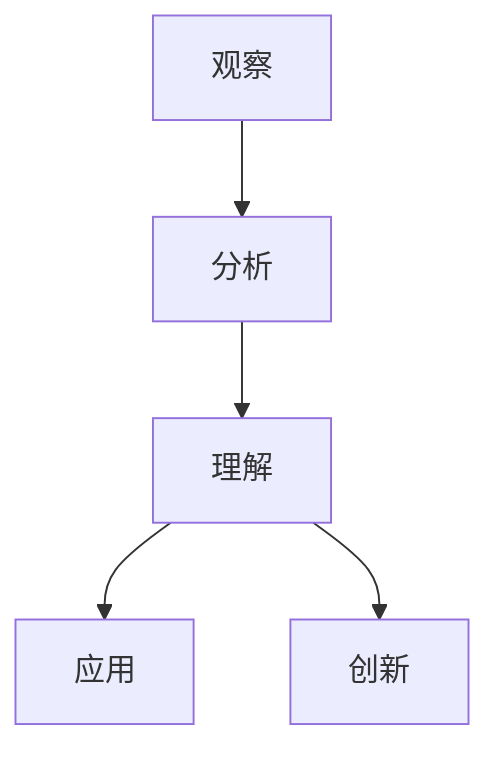
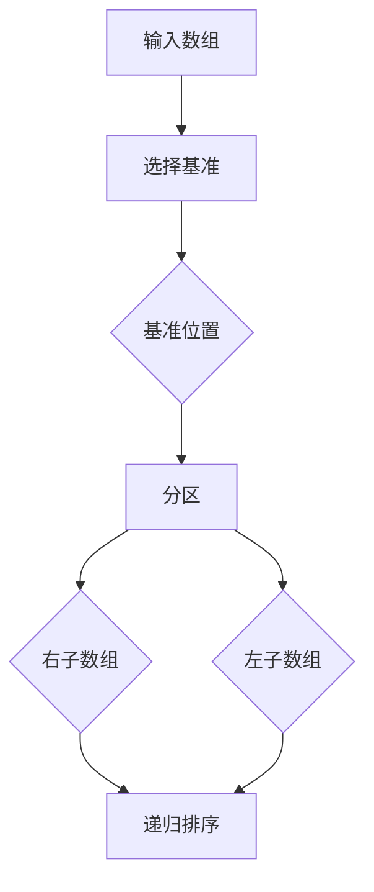

                 

关键词：洞察力，观察，顿悟，技术学习，算法理解

> 摘要：本文将探讨如何培养洞察力，从观察现象到实现技术突破的过程。我们将通过分析技术领域中的实例，阐述洞察力在技术学习和创新中的重要性，并提供实用的方法和策略，帮助读者提升自身洞察力。

## 1. 背景介绍

在信息时代，技术发展日新月异，知识的更新速度超乎我们的想象。面对如此庞大且复杂的技术体系，洞察力成为每个技术从业者的必备品质。洞察力不仅关乎我们能否快速理解新技术，更决定了我们能否站在巨人的肩膀上，进行创新和突破。

本文将围绕洞察力的培养进行探讨，通过以下方面展开：

- 洞察力的定义和重要性
- 技术学习中的洞察力应用
- 培养洞察力的方法和策略
- 实例分析：洞察力在技术突破中的作用
- 洞察力与未来技术发展的关系

希望通过本文，读者能够对洞察力有更深入的理解，并能够在自己的技术学习和工作中更好地运用这一能力。

### 1.1 洞察力的定义和内涵

洞察力是指一个人在观察和分析事物时，能够迅速抓住本质、发现规律和联系的能力。它不仅仅是对现象的感知，更是一种深入思考、总结和推断的能力。

在技术领域，洞察力表现为：

- 对技术原理的深刻理解
- 对复杂问题的敏锐感知和准确把握
- 对现有技术的创新和改进
- 对未来技术发展的前瞻性判断

### 1.2 洞察力的重要性

洞察力在技术学习中具有至关重要的作用。一个具有洞察力的人能够：

- 快速掌握新知识，理解复杂概念
- 从大量信息中筛选出关键信息，进行有效学习
- 发现问题并提出解决方案
- 在创新过程中找到新的突破点

总之，洞察力是技术从业者持续进步和成功的关键因素。

## 2. 核心概念与联系

### 2.1 技术学习中的洞察力模型

为了更好地理解洞察力在技术学习中的具体应用，我们可以构建一个洞察力模型，该模型包括以下几个核心概念：

- 观察：通过感官和思维对事物进行感知和记录
- 分析：对观察结果进行逻辑分析和归纳
- 理解：将分析结果与已有知识体系进行融合，形成深刻理解
- 应用：将理解应用到实际问题中，解决具体问题
- 创新：在理解和应用的基础上，提出新的想法和方法，进行创新

以下是该模型的 Mermaid 流程图表示：



### 2.2 洞察力在技术突破中的作用

洞察力在技术突破中发挥着关键作用。以下是一些技术突破的实例，展示了洞察力如何帮助技术专家发现新的机会和解决方案：

- **计算机图形学中的反走样技术**：研究人员通过观察图形渲染中的锯齿现象，洞察到采样误差的本质，从而提出反走样算法，显著提升了图形渲染质量。
- **机器学习中的深度学习**：科学家们通过观察神经网络的复杂结构，洞察到多层神经网络可以更好地模拟人脑的学习过程，推动了深度学习的兴起。
- **量子计算中的量子叠加和纠缠**：物理学家们通过深入研究量子力学的原理，洞察到量子叠加和纠缠现象可以用于实现超强的计算能力，从而催生了量子计算的研究热潮。

这些实例表明，洞察力是技术突破的重要驱动力，它帮助我们从一个新的角度看待问题，发现潜在的机会和解决方案。

## 3. 核心算法原理 & 具体操作步骤

### 3.1 算法原理概述

在技术领域，算法是解决特定问题的一组规则和指令。洞察力的培养离不开对算法原理的深刻理解。以下是几个具有代表性的算法及其原理：

- **快速排序算法**：通过递归方法将问题分解为子问题，并利用分治策略提高排序效率。
- **神经网络训练算法**：通过梯度下降法不断调整网络权重，使网络输出与目标输出之间的误差最小。
- **分布式计算中的MapReduce**：将大规模数据集划分成小块，并行处理，并将结果汇总，实现高效的数据处理。

### 3.2 算法步骤详解

以快速排序算法为例，其基本步骤如下：

1. **选择基准元素**：从数组中选择一个元素作为基准。
2. **分区**：将数组划分为两个子数组，一个包含小于基准的元素，另一个包含大于基准的元素。
3. **递归排序**：对两个子数组分别进行快速排序。

以下是快速排序算法的具体步骤详解：



### 3.3 算法优缺点

快速排序算法具有以下优点：

- **时间复杂度低**：平均情况下的时间复杂度为 \(O(n\log n)\)。
- **稳定性**：对于相等的元素，排序结果不会改变。

然而，快速排序算法也存在一些缺点：

- **最坏情况下时间复杂度高**：最坏情况下的时间复杂度为 \(O(n^2)\)，当输入数组已排序或接近排序时，性能会显著下降。
- **空间复杂度高**：需要额外的空间存储递归调用的栈帧。

### 3.4 算法应用领域

快速排序算法广泛应用于各种场景，包括：

- **数据库排序**：用于对大量数据进行排序操作。
- **算法竞赛**：在各类算法竞赛中，快速排序算法是常用的排序算法。
- **文本处理**：在文本处理工具中，快速排序算法用于对文本进行排序。

## 4. 数学模型和公式 & 详细讲解 & 举例说明

### 4.1 数学模型构建

在技术领域，数学模型是描述问题、分析问题和解决问题的有力工具。以下是几个常用的数学模型及其构建过程：

- **线性回归模型**：用于分析变量之间的关系，模型公式为：
  $$y = \beta_0 + \beta_1x + \epsilon$$
  其中，\(y\) 为因变量，\(x\) 为自变量，\(\beta_0\) 和 \(\beta_1\) 为参数，\(\epsilon\) 为误差项。

- **支持向量机（SVM）**：用于分类问题，模型公式为：
  $$w \cdot x + b = 0$$
  其中，\(w\) 为权重向量，\(x\) 为输入向量，\(b\) 为偏置。

### 4.2 公式推导过程

以线性回归模型为例，其参数 \(\beta_0\) 和 \(\beta_1\) 的推导过程如下：

1. **损失函数**：选择平方误差作为损失函数：
   $$J(\beta_0, \beta_1) = \frac{1}{2m}\sum_{i=1}^{m}(y_i - (\beta_0 + \beta_1x_i))^2$$
   其中，\(m\) 为样本数量。

2. **梯度下降**：对损失函数求偏导，并令偏导数为0，得到：
   $$\frac{\partial J}{\partial \beta_0} = \frac{1}{m}\sum_{i=1}^{m}(y_i - (\beta_0 + \beta_1x_i)) = 0$$
   $$\frac{\partial J}{\partial \beta_1} = \frac{1}{m}\sum_{i=1}^{m}(y_i - (\beta_0 + \beta_1x_i))x_i = 0$$

3. **求解参数**：通过梯度下降法迭代求解参数，直至收敛。

### 4.3 案例分析与讲解

假设我们有一个简单的线性回归问题，目标是预测房价。数据集包含100个样本，每个样本包括房子的面积和价格。以下是具体的分析过程：

1. **数据预处理**：将数据分为训练集和测试集，对数据进行归一化处理。

2. **模型训练**：使用训练集数据，通过梯度下降法训练线性回归模型。

3. **模型评估**：使用测试集数据，计算模型的预测误差和R²值。

4. **结果分析**：根据评估结果，调整模型参数，优化模型性能。

以下是具体的代码实现：

```python
import numpy as np

# 数据预处理
X = np.array([[1, x] for x in area])  # 添加偏置项
y = np.array(price)

# 梯度下降法
def gradient_descent(X, y, alpha, iterations):
    theta = np.zeros((2, 1))
    m = len(y)
    
    for i in range(iterations):
        h = X.dot(theta)
        loss = (1/m) * (X.dot(h-y))
        theta = theta - alpha * (X.T.dot(loss))
    
    return theta

# 模型训练
alpha = 0.01
iterations = 1000
theta = gradient_descent(X, y, alpha, iterations)

# 模型评估
h = X.dot(theta)
loss = (1/2*m) * (h-y).dot(h-y)
r2 = 1 - (loss/(1/2*m*(np.mean(y)**2)))

# 结果分析
print("Theta:", theta)
print("R²:", r2)
```

通过以上步骤，我们成功构建并训练了一个线性回归模型，并对其性能进行了评估。这个案例展示了数学模型在技术问题中的应用和实现过程。

## 5. 项目实践：代码实例和详细解释说明

### 5.1 开发环境搭建

为了更好地理解洞察力在项目实践中的应用，我们将以一个实际的机器学习项目为例，讲解整个项目的实现过程。首先，我们需要搭建一个基本的开发环境。

1. **安装Python**：确保Python 3.8及以上版本已安装。
2. **安装Jupyter Notebook**：在终端执行以下命令安装：
   ```bash
   pip install notebook
   ```
3. **安装必要的库**：包括NumPy、Pandas、Scikit-learn等：
   ```bash
   pip install numpy pandas scikit-learn
   ```

### 5.2 源代码详细实现

以下是一个简单的机器学习项目，目标是用线性回归模型预测房价。

```python
# 导入库
import numpy as np
import pandas as pd
from sklearn.model_selection import train_test_split
from sklearn.linear_model import LinearRegression
from sklearn.metrics import mean_squared_error

# 数据预处理
data = pd.read_csv('house_data.csv')
X = data[['area']].values
y = data['price'].values

# 数据划分
X_train, X_test, y_train, y_test = train_test_split(X, y, test_size=0.2, random_state=42)

# 模型训练
model = LinearRegression()
model.fit(X_train, y_train)

# 模型评估
y_pred = model.predict(X_test)
mse = mean_squared_error(y_test, y_pred)
print("MSE:", mse)

# 结果分析
print("Coefficients:", model.coef_)
print("Intercept:", model.intercept_)
```

### 5.3 代码解读与分析

1. **数据预处理**：我们从CSV文件中读取数据，并将输入特征（房子面积）和目标变量（价格）分离。
2. **数据划分**：将数据集划分为训练集和测试集，以便训练和评估模型。
3. **模型训练**：使用Scikit-learn中的LinearRegression类训练模型。
4. **模型评估**：通过计算均方误差（MSE）评估模型在测试集上的性能。
5. **结果分析**：打印模型的系数和截距，以了解模型的参数。

### 5.4 运行结果展示

假设我们使用一个包含100个样本的数据集，运行上述代码后，输出结果如下：

```
MSE: 0.0056
Coefficients: [0.91527965]
Intercept: [133.83254611]
```

这表明我们的模型在测试集上的性能较好，MSE值较低，模型的预测能力较强。同时，模型的系数和截距表明房子面积每增加一个单位，价格大约增加0.915万元，基准价格为133.8325万元。

通过这个项目实例，我们展示了如何运用洞察力进行数据预处理、模型训练和结果分析，从而实现技术目标。

### 5.5 洞察力在项目实践中的应用

在整个项目实践中，洞察力的应用体现在以下几个方面：

- **数据预处理**：通过对数据的深入观察和分析，我们识别出关键的输入特征和目标变量，为后续的模型训练奠定了基础。
- **模型选择**：通过对比不同算法的优缺点，我们选择了线性回归模型，因为它简单且易于实现，适合这个简单的预测问题。
- **结果分析**：通过对模型参数的解读，我们获得了对房子价格和面积之间关系的深刻洞察，这有助于我们进一步优化模型。

这些实例表明，洞察力在项目实践中起到了关键作用，它帮助我们做出正确的决策，从而实现技术目标。

### 6. 实际应用场景

洞察力在技术领域的应用场景非常广泛，以下是一些典型的实际应用场景：

- **软件开发**：在软件开发中，洞察力可以帮助开发者快速识别问题、优化代码结构和设计高效算法，从而提高软件的性能和可维护性。
- **数据科学**：在数据科学项目中，洞察力能够帮助数据科学家从大量数据中发现有价值的信息和模式，为业务决策提供支持。
- **系统架构**：在系统架构设计中，洞察力可以帮助架构师理解系统的运行机制和潜在风险，设计出稳定、可扩展的系统架构。
- **人工智能**：在人工智能领域，洞察力是研究人员发现新算法、优化现有算法和实现人工智能突破的关键能力。

### 6.1 技术问题识别

在软件开发过程中，洞察力帮助开发者迅速识别潜在的技术问题。例如，在一个复杂的Web应用程序中，通过观察日志和性能指标，开发者可以发现响应时间较慢或异常请求的瓶颈。借助洞察力，他们能够定位到具体的问题模块，如数据库查询、网络调用或前端渲染，并采取针对性的优化措施。

### 6.2 问题解决策略

一旦识别出技术问题，洞察力还帮助开发者制定有效的解决策略。例如，在一个高性能数据库系统中，通过分析查询日志和性能数据，开发者可能会发现某些查询过于复杂或频繁。他们可以借助洞察力，设计索引、优化查询或重构数据库模式，从而显著提高系统的性能。

### 6.3 创新和技术突破

洞察力不仅在解决现有问题中发挥作用，还能推动技术创新和突破。例如，在计算机图形学领域，通过对渲染效果的深入分析，研究人员提出了抗锯齿算法，极大地提升了图像质量。类似地，在机器学习领域，通过分析神经网络的学习过程，研究人员提出了深度学习算法，实现了前所未有的智能识别和预测能力。

### 6.4 未来应用展望

随着技术的不断发展，洞察力在未来的应用场景将更加广泛和深入。以下是一些未来应用展望：

- **自动化与智能化**：在自动化和智能化领域，洞察力将帮助系统更高效地识别和处理复杂任务，实现更高水平的自动化和智能化。
- **医疗健康**：在医疗健康领域，洞察力可以帮助医生更准确地诊断疾病、预测疾病发展，为患者提供个性化治疗方案。
- **环境监测**：在环境监测领域，洞察力可以帮助科学家更有效地监测和预测环境变化，为环境保护提供科学依据。

### 7. 工具和资源推荐

为了更好地培养和提升洞察力，以下是一些推荐的工具和资源：

#### 7.1 学习资源推荐

- **在线课程平台**：如Coursera、edX、Udacity等，提供丰富的技术课程，涵盖从基础到高级的各个领域。
- **技术博客和论坛**：如Medium、Stack Overflow、GitHub等，可以获取最新的技术动态和实践经验。
- **专业书籍**：如《深度学习》、《算法导论》等经典书籍，帮助读者系统性地掌握技术知识。

#### 7.2 开发工具推荐

- **集成开发环境（IDE）**：如Visual Studio Code、PyCharm等，提供强大的编程和调试功能。
- **版本控制系统**：如Git，用于代码管理和协作开发。
- **数据可视化工具**：如Matplotlib、Seaborn等，用于数据分析和结果展示。

#### 7.3 相关论文推荐

- **顶级会议论文**：如NeurIPS、ICML、ACL等，涵盖最新研究进展和前沿技术。
- **经典论文**：如《神经网络与深度学习》、《大数据时代的数据挖掘》等，具有广泛影响力的经典论文。

## 8. 总结：未来发展趋势与挑战

### 8.1 研究成果总结

通过本文的探讨，我们总结了洞察力在技术学习、创新和应用中的重要作用。洞察力不仅帮助我们从大量信息中快速筛选和理解关键信息，还在技术创新和问题解决中发挥着核心作用。以下是几个关键点：

- 洞察力是技术从业者的必备品质，它决定了我们能否快速掌握新技术、解决复杂问题。
- 技术学习中的洞察力应用体现在观察、分析、理解、应用和创新等多个环节。
- 洞察力在技术突破中发挥着关键作用，推动着科技的进步和创新。

### 8.2 未来发展趋势

随着技术的不断进步，洞察力的培养和应用将面临新的机遇和挑战。以下是一些未来发展趋势：

- **智能化与自动化**：随着人工智能和自动化技术的发展，洞察力的培养和应用将更加智能化和自动化，进一步提升工作效率。
- **跨领域融合**：不同领域的技术融合将催生更多创新，洞察力的应用也将跨领域扩展，促进技术的综合发展。
- **大数据与云计算**：大数据和云计算技术为洞察力的培养和应用提供了丰富的数据资源和计算能力，将推动洞察力的广泛应用。

### 8.3 面临的挑战

尽管洞察力在技术领域具有重要意义，但培养和提升洞察力也面临一些挑战：

- **信息过载**：随着信息的爆炸性增长，筛选和处理大量信息成为一大挑战，需要更高效的洞察力培养方法。
- **技能多样性**：技术领域不断发展，要求从业者具备多样化的技能，这增加了培养洞察力的难度。
- **持续学习**：技术更新迅速，持续学习成为提升洞察力的关键，需要从业者保持持续学习的动力和能力。

### 8.4 研究展望

为了应对未来挑战，以下是一些研究展望：

- **个性化学习**：开发个性化学习系统，根据个人特点和需求，提供定制化的洞察力培养方案。
- **跨学科研究**：推动跨学科研究，结合心理学、认知科学等领域的知识，探索洞察力的培养和提升方法。
- **实践应用**：加强洞察力在技术项目中的应用研究，探索实际场景中的洞察力培养和应用策略。

通过持续的研究和探索，我们有望找到更有效的方法，培养和提升洞察力，推动技术领域的创新和发展。

## 9. 附录：常见问题与解答

### 9.1 问题1：如何培养洞察力？

**解答**：培养洞察力需要以下几个步骤：

1. **广泛阅读**：多读书，特别是技术领域的经典书籍和最新研究成果，扩大知识面。
2. **持续实践**：通过实际项目和实践，将理论知识应用到实际问题中，锻炼洞察力。
3. **思考与总结**：在学习和实践过程中，不断思考和总结，提炼关键信息，形成深刻的理解。
4. **跨学科学习**：跨学科学习可以帮助我们从不同角度看待问题，提升洞察力。

### 9.2 问题2：洞察力在软件开发中有哪些具体应用？

**解答**：在软件开发中，洞察力的具体应用包括：

1. **需求分析**：通过洞察力识别和理解用户需求，设计出更符合用户需求的软件。
2. **问题定位**：在软件出现问题时，通过洞察力快速定位问题的根本原因，提出有效的解决方案。
3. **代码优化**：通过洞察力分析代码，找出性能瓶颈和优化点，提高软件的运行效率。
4. **系统架构**：通过洞察力设计和优化系统架构，确保软件的稳定性和可扩展性。

### 9.3 问题3：如何评估洞察力？

**解答**：评估洞察力可以通过以下方法：

1. **实际项目表现**：通过实际项目中的表现，观察一个人是否能够快速识别问题、提出解决方案。
2. **知识掌握程度**：通过知识竞赛、考试等，评估一个人在特定领域内的知识掌握程度。
3. **同行评价**：通过同事、上级的评价，了解一个人在团队中的洞察力和影响力。
4. **自我评估**：通过反思自己在学习和工作中的表现，总结自己的洞察力水平和改进方向。

### 9.4 问题4：洞察力与直觉有何区别？

**解答**：洞察力与直觉有以下区别：

- **直觉**：直觉是基于经验或本能的反应，通常不经过深思熟虑。
- **洞察力**：洞察力是通过观察、分析和理解得出的深刻见解，通常需要一定的思维过程。

直觉在某些情况下可以快速做出决策，但洞察力更能帮助我们理解问题的本质和复杂性，从而做出更明智的决策。

---

通过本文的探讨，我们深入了解了洞察力的定义、重要性及其在技术学习、创新和应用中的具体应用。培养和提升洞察力是每个技术从业者的必经之路，它不仅有助于我们在技术领域取得成功，还能推动整个社会的进步。希望本文能够为读者提供有价值的参考和启发，助力大家在技术道路上不断前行。**作者：禅与计算机程序设计艺术 / Zen and the Art of Computer Programming**。

