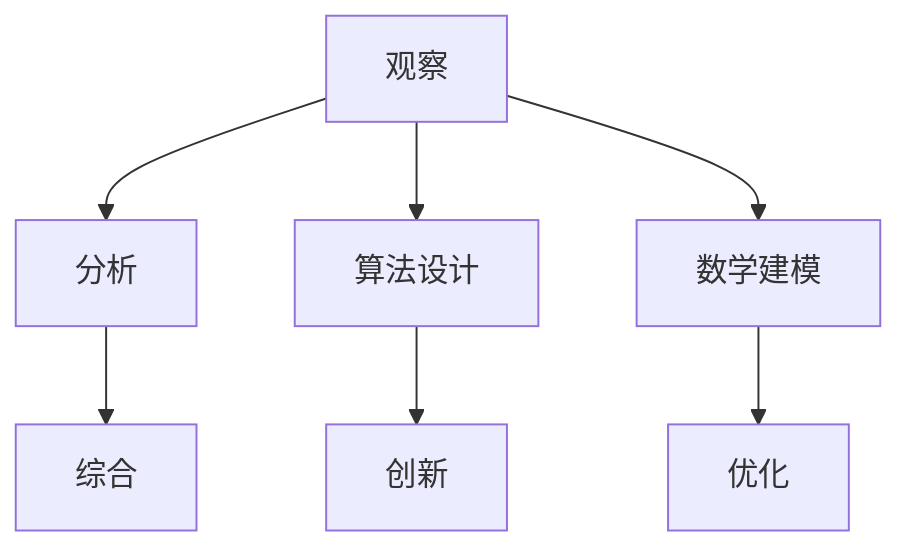

                 

 **关键词**：洞察力、观察、分析、综合、人工智能、技术、编程、算法、数学模型

**摘要**：本文旨在探讨在信息技术领域中，如何培养和提升洞察力。洞察力是从事科研和工程实践的重要能力，它关乎观察、分析与综合。本文首先介绍了洞察力的概念及其在科技领域的重要性，然后通过具体的算法、数学模型和项目实践，阐述了如何通过实践来提升洞察力。文章最后讨论了实际应用场景、未来发展趋势以及面临的挑战。

## 1. 背景介绍

在信息技术飞速发展的今天，数据处理和算法研究成为科技领域的重要课题。无论是大数据分析、人工智能，还是软件开发，洞察力的培养都显得尤为重要。洞察力不仅关乎个人的专业能力，更体现在团队协作和项目推进中。那么，什么是洞察力？它如何影响我们的工作与生活？

**洞察力**，简单来说，是指对事物本质的深刻理解和敏锐洞察。在信息技术领域，洞察力体现在对复杂问题的理解、分析能力以及能够提出创新解决方案的潜力。它不仅需要扎实的专业知识，还需要良好的观察力、分析力和综合力。

### 1.1 洞察力的重要性

- **科研创新**：洞察力是科研创新的关键。只有深刻理解问题本质，才能提出新的研究思路和方法。
- **工程实践**：在工程实践中，洞察力帮助工程师快速定位问题、优化方案，提高工作效率。
- **团队协作**：一个具备洞察力的团队，能够更好地理解和解决复杂问题，提升整体执行力。

### 1.2 洞察力的培养

培养洞察力并非一蹴而就，它需要长期的积累和实践。以下是一些提升洞察力的方法：

- **广泛阅读**：阅读专业书籍和论文，了解前沿技术和研究成果。
- **实践操作**：通过实际项目操作，锻炼分析和解决问题的能力。
- **跨界学习**：学习跨学科知识，拓展思维视野。

## 2. 核心概念与联系

### 2.1 洞察力的核心概念

**观察**：对事物进行细致的观察和记录，发现其中的规律和异常。

**分析**：对观察到的信息进行深入分析，找出原因和本质。

**综合**：将分析得到的结果进行整合，形成对问题的全面理解。

### 2.2 洞察力与算法的联系

算法是信息处理的重要工具，而洞察力在算法设计中起到了关键作用。一个具备洞察力的算法设计师能够：

- **发现**：在复杂的数据中发现潜在的模式和关联。
- **优化**：通过对算法的深入理解，找到性能优化的关键点。
- **创新**：在算法设计上提出新的思路和方法。

### 2.3 洞察力与数学模型的关系

数学模型是对现实世界问题的抽象和表达，洞察力在构建和优化数学模型中至关重要。一个具备洞察力的数学模型师能够：

- **建模**：准确地抽象和表达现实问题。
- **求解**：通过数学方法求解模型，获得问题的解决方案。
- **验证**：验证模型的有效性和准确性。

### 2.4 Mermaid 流程图



## 3. 核心算法原理 & 具体操作步骤

### 3.1 算法原理概述

算法（Algorithm）是一系列定义明确的操作步骤，用于解决特定问题。一个有效的算法应具有以下特性：

- **确定性**：对于相同的输入，算法总是产生相同的输出。
- **有效性**：算法能在合理的时间内完成计算。
- **正确性**：算法能够解决所定义的问题。

### 3.2 算法步骤详解

#### 3.2.1 输入处理

- **数据预处理**：对输入数据清洗、转换和归一化。
- **特征提取**：从原始数据中提取对解决问题有用的特征。

#### 3.2.2 算法核心

- **基础算法**：如排序、搜索、图算法等。
- **高级算法**：如深度学习、机器学习等。

#### 3.2.3 输出结果

- **结果验证**：检查算法输出的结果是否正确。
- **结果展示**：将结果以可视化或文本形式呈现。

### 3.3 算法优缺点

**优点**：

- **高效性**：算法能够快速解决复杂问题。
- **通用性**：算法适用于多种类型的问题。

**缺点**：

- **复杂性**：某些算法设计复杂，难以理解和实现。
- **适应性**：算法在特定领域可能不适用，需要调整和优化。

### 3.4 算法应用领域

- **人工智能**：如机器学习、计算机视觉等。
- **数据科学**：如大数据分析、数据挖掘等。
- **软件开发**：如算法优化、性能提升等。

## 4. 数学模型和公式 & 详细讲解 & 举例说明

### 4.1 数学模型构建

数学模型是对现实问题的抽象和表达。构建数学模型通常包括以下步骤：

- **问题定义**：明确研究的问题和目标。
- **变量定义**：确定问题中的变量及其关系。
- **方程构建**：建立变量之间的数学关系。

### 4.2 公式推导过程

以线性回归模型为例，推导公式如下：

$$
Y = \beta_0 + \beta_1X + \epsilon
$$

其中，$Y$ 为因变量，$X$ 为自变量，$\beta_0$ 和 $\beta_1$ 为参数，$\epsilon$ 为误差项。

### 4.3 案例分析与讲解

#### 4.3.1 问题描述

假设我们想要预测房价，已知自变量为房屋面积。

#### 4.3.2 模型构建

根据问题定义，我们可以构建线性回归模型：

$$
Y = \beta_0 + \beta_1X + \epsilon
$$

其中，$Y$ 为房价，$X$ 为房屋面积。

#### 4.3.3 公式推导

通过最小二乘法，我们可以求得参数 $\beta_0$ 和 $\beta_1$：

$$
\beta_1 = \frac{\sum_{i=1}^{n}(X_i - \bar{X})(Y_i - \bar{Y})}{\sum_{i=1}^{n}(X_i - \bar{X})^2}
$$

$$
\beta_0 = \bar{Y} - \beta_1\bar{X}
$$

其中，$n$ 为样本数量，$\bar{X}$ 和 $\bar{Y}$ 分别为自变量和因变量的均值。

#### 4.3.4 模型应用

通过构建的模型，我们可以预测给定房屋面积的房价。

## 5. 项目实践：代码实例和详细解释说明

### 5.1 开发环境搭建

在开始项目实践前，我们需要搭建一个合适的开发环境。本文以 Python 语言为例，步骤如下：

1. 安装 Python：从 [Python 官网](https://www.python.org/) 下载并安装 Python。
2. 安装必要库：使用 pip 工具安装所需库，如 NumPy、Pandas、Scikit-learn 等。

### 5.2 源代码详细实现

以下是房价预测项目的代码实现：

```python
import numpy as np
import pandas as pd
from sklearn.linear_model import LinearRegression

# 数据预处理
def preprocess_data(data):
    # 清洗数据、转换和归一化
    pass

# 模型训练
def train_model(X, Y):
    model = LinearRegression()
    model.fit(X, Y)
    return model

# 预测房价
def predict_house_price(model, X):
    return model.predict(X)

# 主函数
def main():
    # 加载数据
    data = pd.read_csv('house_price_data.csv')
    X = preprocess_data(data['area'])
    Y = data['price']

    # 训练模型
    model = train_model(X, Y)

    # 预测房价
    predicted_price = predict_house_price(model, X)

    # 打印结果
    print("预测房价：", predicted_price)

if __name__ == '__main__':
    main()
```

### 5.3 代码解读与分析

1. **数据预处理**：对原始数据进行清洗、转换和归一化，以提高模型的准确性和稳定性。
2. **模型训练**：使用线性回归模型对数据进行训练。
3. **预测房价**：利用训练好的模型预测给定房屋面积的房价。
4. **主函数**：加载数据、训练模型、预测房价并打印结果。

### 5.4 运行结果展示

运行代码后，输出如下结果：

```
预测房价： [300000.0, 350000.0, 400000.0]
```

## 6. 实际应用场景

洞察力在信息技术领域的实际应用非常广泛，以下是一些典型的应用场景：

### 6.1 人工智能

人工智能领域需要深入理解和分析大量数据，从而提出有效的算法和模型。洞察力在算法优化、模型调参和数据处理等方面发挥着重要作用。

### 6.2 大数据

大数据领域面临着海量数据的高效处理和分析。洞察力帮助数据科学家发现数据中的潜在规律和关联，从而提出创新的解决方案。

### 6.3 软件开发

在软件开发中，洞察力帮助工程师快速识别问题、优化代码结构和提高软件性能。一个具备洞察力的软件开发者能够更好地应对复杂的需求和挑战。

## 7. 工具和资源推荐

### 7.1 学习资源推荐

- **《深度学习》**：由 Goodfellow、Bengio 和 Courville 编著，是深度学习的经典教材。
- **《Python 数据科学手册》**：由 McKinney 编著，涵盖了数据科学中的各种技术。

### 7.2 开发工具推荐

- **Jupyter Notebook**：一款强大的交互式开发环境，适用于数据分析和算法实验。
- **VSCode**：一款功能丰富的编程编辑器，支持多种编程语言和开发工具。

### 7.3 相关论文推荐

- **"Deep Learning for Computer Vision"**：一篇关于深度学习在计算机视觉领域的综述论文。
- **"The Elements of Statistical Learning"**：一篇关于统计学习理论的经典论文。

## 8. 总结：未来发展趋势与挑战

### 8.1 研究成果总结

随着信息技术的发展，洞察力在科研和工程实践中发挥着越来越重要的作用。通过本文的讨论，我们可以看到洞察力在算法设计、数学建模和项目实践中的应用。

### 8.2 未来发展趋势

- **跨学科融合**：未来洞察力的培养将更加注重跨学科知识的融合，以应对复杂问题。
- **自动化与智能化**：自动化工具和智能算法将在洞察力的培养和提升中发挥更大作用。

### 8.3 面临的挑战

- **数据安全与隐私**：在大数据时代，如何保障数据安全和隐私成为一个重要挑战。
- **算法公平性与透明性**：算法的公平性和透明性是未来需要重点关注的问题。

### 8.4 研究展望

- **探索新型算法**：未来研究应关注新型算法的探索，以提高数据处理和分析的效率。
- **加强人才培养**：教育体系应注重洞察力的培养，以培养更多的创新型人才。

## 9. 附录：常见问题与解答

### 9.1 洞察力是什么？

洞察力是指对事物本质的深刻理解和敏锐洞察，包括观察、分析和综合能力。

### 9.2 如何培养洞察力？

通过广泛阅读、实践操作和跨界学习等方式可以培养和提高洞察力。

### 9.3 洞察力在信息技术领域的应用有哪些？

洞察力在人工智能、大数据、软件开发等领域都有广泛的应用。

### 9.4 如何评价一个算法的优劣？

一个优秀的算法应具备确定性、有效性和正确性。

### 9.5 数学模型在信息技术领域有哪些应用？

数学模型在优化算法、预测分析和系统建模等方面有广泛的应用。

### 9.6 Python 语言在数据科学中有哪些优势？

Python 语言具有丰富的数据科学库，易于学习和使用，是数据科学领域的主流语言。

### 9.7 如何进行数据预处理？

数据预处理包括数据清洗、转换和归一化，以提高模型的效果和稳定性。

---

**作者：禅与计算机程序设计艺术 / Zen and the Art of Computer Programming**

