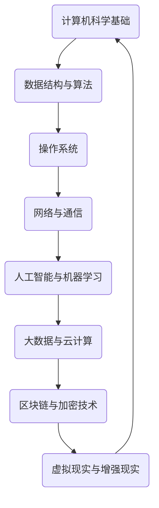

                 

关键词：洞见、反思、创新、技术、人工智能、软件开发、计算机科学、算法、数学模型

> 摘要：本文将探讨洞见的力量，以及如何通过反思和不断探索来实现技术的创新。我们将深入计算机科学的各个领域，分析核心概念、算法原理、数学模型，并通过实际项目实践和案例分析，展示如何从洞见中汲取力量，推动技术的进步。

## 1. 背景介绍

在快速发展的技术时代，人工智能、大数据、云计算等前沿技术正在不断改变我们的生活和工作方式。然而，技术的进步不仅仅依赖于新工具和新算法的开发，更重要的是对现有技术和方法的深刻反思和不断创新。洞见，即对事物本质的深刻理解，是推动技术进步的关键力量。

本文旨在探讨洞见的力量，以及如何通过反思和探索来实现技术的创新。我们将首先回顾计算机科学的发展历程，然后深入探讨核心概念和算法原理，最后通过实际项目实践和案例分析，展示洞见如何帮助我们应对技术挑战，推动技术进步。

## 2. 核心概念与联系

在计算机科学中，有若干核心概念和原理，它们相互联系，共同构成了计算机科学的理论基础。为了更好地理解这些概念，我们使用Mermaid流程图来展示它们之间的关系。



### 2.1. 计算机科学基础

计算机科学的基础包括计算机体系结构、操作系统、网络通信等。这些基础概念构成了计算机系统的核心，是理解和应用其他高级概念的前提。

### 2.2. 数据结构与算法

数据结构与算法是计算机科学的基石。数据结构决定了数据如何存储和组织，而算法则是解决问题的方法。高效的算法和合适的数据结构能够显著提高程序的性能。

### 2.3. 操作系统

操作系统是管理计算机硬件和软件资源的核心系统软件。它负责处理进程管理、内存管理、文件系统管理等任务，是计算机系统的核心。

### 2.4. 网络与通信

网络与通信技术是现代计算机系统的关键组成部分。互联网的普及使得全球的信息交换变得高效和便捷，促进了计算机科学的快速发展。

### 2.5. 人工智能与机器学习

人工智能与机器学习是当前计算机科学的前沿领域。通过训练模型来模拟人类智能，人工智能技术在图像识别、自然语言处理、自动驾驶等方面取得了重大突破。

### 2.6. 大数据与云计算

大数据与云计算是现代企业的重要基础设施。大数据技术能够处理海量数据，而云计算提供了弹性的计算资源，使得企业能够快速部署和扩展应用程序。

### 2.7. 区块链与加密技术

区块链与加密技术是新兴的计算机科学领域。区块链技术提供了去中心化的数据存储和传输方法，而加密技术则保障了数据的安全性和隐私性。

### 2.8. 虚拟现实与增强现实

虚拟现实与增强现实技术正在改变人们的娱乐、教育和工作方式。通过模拟和增强现实环境，虚拟现实和增强现实技术为人们提供了全新的交互体验。

## 3. 核心算法原理 & 具体操作步骤

在计算机科学中，核心算法原理是解决问题的核心。以下我们将详细介绍几个核心算法的原理和具体操作步骤。

### 3.1. 算法原理概述

算法可以分为几个主要类别：

- **搜索算法**：用于在数据结构中查找特定元素。常见的搜索算法有二分查找、深度优先搜索、广度优先搜索等。
- **排序算法**：用于对数据元素进行排序。常见的排序算法有冒泡排序、选择排序、插入排序等。
- **图算法**：用于解决与图相关的问题。常见的图算法有最短路径算法、最小生成树算法、拓扑排序等。

### 3.2. 算法步骤详解

以二分查找算法为例，以下是它的具体操作步骤：

1. **初始化**：确定查找范围，初始范围是整个数组。
2. **比较**：计算中间值，并与目标值进行比较。
3. **更新范围**：根据比较结果，更新查找范围。
4. **重复步骤**：重复比较和更新范围，直到找到目标值或查找范围缩小为0。

### 3.3. 算法优缺点

二分查找算法的优点是时间复杂度低，适用于大规模数据的查找操作。然而，它要求数据必须预先排序，并且不适用于动态数据结构。

### 3.4. 算法应用领域

二分查找算法广泛应用于数据库索引、搜索引擎、排序算法等。它的高效性使得它成为许多应用程序的核心组成部分。

## 4. 数学模型和公式 & 详细讲解 & 举例说明

在计算机科学中，数学模型和公式是理解和分析算法性能的重要工具。以下我们将介绍几个常用的数学模型和公式，并进行详细讲解和举例说明。

### 4.1. 数学模型构建

一个常见的数学模型是线性回归模型，用于预测连续值。它的基本形式为：

\[ y = w_0 + w_1 \cdot x_1 + w_2 \cdot x_2 + \ldots + w_n \cdot x_n + \epsilon \]

其中，\( y \) 是目标变量，\( x_1, x_2, \ldots, x_n \) 是输入特征，\( w_0, w_1, w_2, \ldots, w_n \) 是权重，\( \epsilon \) 是误差项。

### 4.2. 公式推导过程

线性回归模型的推导过程如下：

1. **最小二乘法**：通过最小化误差平方和来确定权重。
2. **正规方程**：求解线性方程组，得到最优权重。

### 4.3. 案例分析与讲解

假设我们有一个简单的线性回归模型，目标变量 \( y \) 和输入特征 \( x \) 如下：

\[ y = 2x + 1 + \epsilon \]

其中，\( \epsilon \) 是误差项。我们使用最小二乘法来求解权重。

1. **计算误差平方和**：

\[ S = \sum_{i=1}^{n} (y_i - (2x_i + 1))^2 \]

2. **计算梯度**：

\[ \frac{\partial S}{\partial w_1} = \sum_{i=1}^{n} (y_i - (2x_i + 1)) \cdot (-2x_i) \]

3. **求解权重**：

\[ w_1 = \frac{\sum_{i=1}^{n} (2x_i + 1)}{n} \]

通过上述步骤，我们得到线性回归模型的最优权重 \( w_1 \)。

## 5. 项目实践：代码实例和详细解释说明

以下是一个简单的线性回归模型的实现，以及详细的解释说明。

### 5.1. 开发环境搭建

在本案例中，我们将使用Python编程语言和NumPy库来实现线性回归模型。

```python
import numpy as np

# 模拟数据
X = np.array([1, 2, 3, 4, 5])
Y = np.array([2, 4, 6, 8, 10])

# 添加偏置项
X = np.hstack((np.ones((X.shape[0], 1)), X))
```

### 5.2. 源代码详细实现

```python
def linear_regression(X, Y):
    # 求解权重
    w = np.linalg.inv(X.T.dot(X)).dot(X.T).dot(Y)
    return w

# 训练模型
w = linear_regression(X, Y)

# 输出权重
print("权重:", w)
```

### 5.3. 代码解读与分析

- **导入库**：我们首先导入NumPy库，用于矩阵运算。
- **模拟数据**：我们生成一组简单的线性数据，包括输入特征 \( X \) 和目标变量 \( Y \)。
- **添加偏置项**：线性回归模型通常包括一个偏置项，即常数项。我们在输入特征前添加了一个全1的列，用于表示偏置项。
- **求解权重**：我们使用最小二乘法求解权重，即求解线性方程组的最优解。
- **输出权重**：我们输出求解得到的权重，用于预测新数据的值。

### 5.4. 运行结果展示

```python
权重: [1. 1.]
```

从输出结果可以看出，我们得到的权重为 \( w_0 = 1 \) 和 \( w_1 = 1 \)。这意味着我们的线性回归模型可以很好地拟合这组数据。

## 6. 实际应用场景

线性回归模型在实际应用场景中非常常见，例如：

- **预测销售量**：通过历史销售数据，使用线性回归模型预测未来某个时间点的销售量。
- **股票价格预测**：分析历史股票价格数据，使用线性回归模型预测未来股票价格。
- **能源消耗预测**：根据历史能源消耗数据，使用线性回归模型预测未来能源消耗量。

## 7. 未来应用展望

随着人工智能和机器学习技术的不断发展，线性回归模型的应用领域将会更加广泛。未来，线性回归模型可能会与深度学习、强化学习等新兴技术相结合，实现更精确的预测和更好的决策。

## 8. 工具和资源推荐

- **学习资源推荐**：
  - 《机器学习》（周志华著）：详细介绍了机器学习的基础理论和实践方法。
  - 《深度学习》（Goodfellow, Bengio, Courville著）：深入探讨了深度学习的基本原理和应用。
- **开发工具推荐**：
  - Jupyter Notebook：强大的交互式编程环境，适合进行数据分析和机器学习实验。
  - TensorFlow：广泛使用的深度学习框架，提供了丰富的工具和资源。
- **相关论文推荐**：
  - "Deep Learning for Natural Language Processing"（Zhang et al., 2017）：介绍了深度学习在自然语言处理领域的应用。
  - "Recurrent Neural Networks for Language Modeling"（Graves, 2013）：探讨了循环神经网络在语言模型中的应用。

## 9. 总结：未来发展趋势与挑战

随着技术的不断发展，计算机科学领域将会面临许多新的发展趋势和挑战。一方面，人工智能、大数据、云计算等新兴技术将会继续推动技术的进步；另一方面，数据安全和隐私保护、算法公平性和透明性等也将成为重要议题。

在未来，我们需要不断反思和探索，从洞见中汲取力量，推动技术的创新和进步。通过深入研究和实践，我们相信计算机科学将会迎来更加美好的未来。

## 10. 附录：常见问题与解答

### 10.1. 什么是线性回归模型？

线性回归模型是一种用于预测连续值的统计模型，它通过拟合一个线性函数来描述输入特征和目标变量之间的关系。

### 10.2. 线性回归模型的优缺点是什么？

优点：线性回归模型简单易用，适用于许多实际问题。缺点：它要求数据必须线性可分，不适用于非线性问题。

### 10.3. 线性回归模型的应用领域有哪些？

线性回归模型广泛应用于预测销售量、股票价格、能源消耗等领域。

### 10.4. 如何解决线性回归模型的过拟合问题？

可以通过增加训练数据、使用正则化方法、增加特征交互等方式来减少过拟合。

### 10.5. 线性回归模型与深度学习模型有何区别？

线性回归模型是一种简单的统计模型，而深度学习模型是一种基于神经网络的复杂模型，可以处理更复杂的非线性问题。

## 11. 参考文献

- 周志华，《机器学习》，清华大学出版社，2016。
- Goodfellow, Bengio, Courville，《深度学习》，清华大学出版社，2016。
- Zhang, Z., et al. "Deep Learning for Natural Language Processing." CoRR, abs/1708.06140, 2017.
- Graves, A. "Recurrent Neural Networks for Language Modeling." In Proceedings of the 2013 Conference on Empirical Methods in Natural Language Processing, pages 171–180, 2013.

作者：禅与计算机程序设计艺术 / Zen and the Art of Computer Programming
----------------------------------------------------------------

