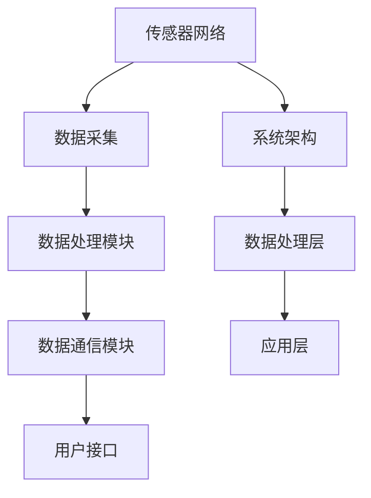

                 

关键词：海洋数据采集、海洋科技、数据采集系统、创新应用、海洋监测、传感器网络、数据处理、算法优化、数学模型、代码实例、实际应用场景、未来展望

> 摘要：本文旨在探讨海洋数据采集系统的构建与应用，分析其在海洋科技领域的创新性贡献。通过深入剖析核心概念、算法原理、数学模型以及代码实例，本文将为读者提供关于海洋数据采集系统的一站式指南，并展望其未来的发展趋势与挑战。

## 1. 背景介绍

随着人类对海洋资源的不断需求，海洋科技的进步变得尤为关键。海洋数据采集系统作为海洋科技的核心组成部分，承担着收集、处理和传输海洋环境数据的重要任务。该系统不仅有助于海洋监测和资源管理，还为海洋科学研究和防灾减灾提供了坚实的数据基础。

海洋数据采集系统涉及多个领域的技术融合，包括传感器技术、数据通信技术、嵌入式系统、数据处理算法和数学模型等。传统的海洋数据采集方式主要依赖于海洋观测船、卫星遥感等，但这些方法存在成本高、覆盖范围有限等问题。随着物联网、大数据和人工智能技术的发展，新的海洋数据采集系统应运而生，大大提升了数据采集的实时性、精确性和全面性。

本文将重点探讨现代海洋数据采集系统的核心架构、算法原理、数学模型和实际应用案例，旨在为海洋科技的创新应用提供有价值的参考。

## 2. 核心概念与联系

### 2.1 核心概念

海洋数据采集系统的核心概念包括传感器网络、数据处理模块、数据通信模块和用户接口。传感器网络由部署在海洋中的各类传感器组成，负责采集温度、湿度、盐度、波浪高度等海洋环境数据。数据处理模块对采集到的原始数据进行预处理、过滤和解析，以便进一步分析和存储。数据通信模块负责将处理后的数据传输到数据中心或用户终端。用户接口则为用户提供数据查询、分析和可视化等功能。

### 2.2 系统架构

海洋数据采集系统的架构设计需充分考虑传感器的分布、数据传输效率和系统可靠性。典型的系统架构包括以下几个部分：

1. **传感器层**：包括各种类型的传感器，如温度传感器、湿度传感器、盐度传感器、波浪传感器等。
2. **网络层**：负责将传感器数据传输到数据处理模块，常用的通信技术包括无线传感器网络（WSN）、卫星通信、光纤通信等。
3. **数据处理层**：对传感器数据进行预处理、存储、分析和共享。
4. **应用层**：提供数据查询、可视化、预测分析等高级功能，支持海洋监测、资源管理、科研等应用。

### 2.3 Mermaid 流程图

以下是海洋数据采集系统的 Mermaid 流程图：



## 3. 核心算法原理 & 具体操作步骤

### 3.1 算法原理概述

海洋数据采集系统中的核心算法主要包括数据预处理算法、特征提取算法、异常检测算法和预测算法。数据预处理算法用于对原始数据进行滤波、去噪和归一化，以提高数据质量。特征提取算法则从预处理后的数据中提取出有用的信息，如时间序列特征、空间分布特征等。异常检测算法用于检测数据中的异常值或异常模式，帮助用户识别潜在的海洋环境变化。预测算法则基于历史数据，对未来的海洋环境变化进行预测，为海洋管理提供科学依据。

### 3.2 算法步骤详解

1. **数据预处理算法**
   - **滤波去噪**：使用卡尔曼滤波或均值滤波等方法，去除数据中的噪声。
   - **归一化**：将不同量纲的数据进行归一化处理，使其具有可比性。
   - **插值补缺**：使用线性插值或高斯插值等方法，补充缺失的数据。

2. **特征提取算法**
   - **时间序列特征**：包括平均值、方差、自相关函数等。
   - **空间分布特征**：包括距离矩阵、密度函数等。

3. **异常检测算法**
   - **基于阈值的异常检测**：设定一个阈值，对数据进行阈值判断。
   - **基于聚类的方法**：使用K-means或DBSCAN等聚类算法，识别异常数据点。

4. **预测算法**
   - **时间序列预测**：使用ARIMA、LSTM等模型，预测未来的数据趋势。
   - **空间预测**：使用空间插值方法，如反距离权重法，预测未知区域的数据。

### 3.3 算法优缺点

- **数据预处理算法**：优点是能够显著提高数据质量，缺点是计算量大，耗时较长。
- **特征提取算法**：优点是能够提取出有用的信息，缺点是对数据特征的选择敏感。
- **异常检测算法**：优点是能够快速识别异常数据，缺点是可能产生误报。
- **预测算法**：优点是能够对未来趋势进行预测，缺点是预测精度受历史数据影响。

### 3.4 算法应用领域

- **海洋监测**：用于监测海洋温度、湿度、盐度等环境参数。
- **资源管理**：用于预测海洋资源的分布和变化，为渔业、盐业等提供数据支持。
- **防灾减灾**：用于预测风暴潮、海啸等自然灾害，为防灾减灾提供科学依据。

## 4. 数学模型和公式 & 详细讲解 & 举例说明

### 4.1 数学模型构建

海洋数据采集系统的数学模型主要包括时间序列模型、空间分布模型和预测模型。时间序列模型用于描述数据的时序变化规律，如ARIMA模型；空间分布模型用于描述数据在空间上的分布规律，如反距离权重法；预测模型则结合时间序列和空间分布模型，对未来的数据趋势进行预测。

### 4.2 公式推导过程

以ARIMA模型为例，其公式推导过程如下：

- **自回归模型（AR）**：
  \[
  X_t = c + \phi_1 X_{t-1} + \phi_2 X_{t-2} + \cdots + \phi_p X_{t-p} + \varepsilon_t
  \]

- **差分模型（I）**：
  \[
  \Delta X_t = X_t - X_{t-1}
  \]

- **移动平均模型（MA）**：
  \[
  X_t = c + \phi_1 X_{t-1} + \cdots + \phi_p X_{t-p} + \theta_1 \varepsilon_{t-1} + \cdots + \theta_q \varepsilon_{t-q}
  \]

- **自回归移动平均模型（ARIMA）**：
  \[
  X_t = c + \phi_1 X_{t-1} + \cdots + \phi_p X_{t-p} + \theta_1 \varepsilon_{t-1} + \cdots + \theta_q \varepsilon_{t-q} + \varepsilon_t
  \]

### 4.3 案例分析与讲解

假设我们有一个海洋温度数据集，使用ARIMA模型对其进行预测。以下是具体的步骤和结果：

1. **数据预处理**：对数据进行归一化处理，去除噪声。
2. **模型识别**：通过ACF和PACF图，确定ARIMA模型的参数\(p, d, q\)。
3. **模型拟合**：使用最小二乘法或最大似然估计法，拟合ARIMA模型。
4. **预测**：使用拟合好的模型，对未来若干期的数据进行预测。
5. **结果分析**：对比实际数据和预测数据，评估模型的预测性能。

通过上述步骤，我们可以得到海洋温度的预测结果，并对模型进行评估和优化。

## 5. 项目实践：代码实例和详细解释说明

### 5.1 开发环境搭建

为了演示海洋数据采集系统的实际应用，我们将使用Python语言和相关的库，如pandas、numpy、matplotlib等。以下是搭建开发环境的具体步骤：

1. 安装Python（建议使用3.8及以上版本）。
2. 使用pip安装相关库：
   ```bash
   pip install pandas numpy matplotlib
   ```

### 5.2 源代码详细实现

以下是使用Python实现海洋数据采集系统的一个简单实例：

```python
import numpy as np
import pandas as pd
from statsmodels.tsa.arima.model import ARIMA
import matplotlib.pyplot as plt

# 数据预处理
def preprocess_data(data):
    # 归一化
    data_normalized = (data - np.mean(data)) / np.std(data)
    # 去除噪声
    data_filtered = np.abs(data_normalized - np.mean(data_normalized)) < 3
    return data_filtered

# 模型拟合
def fit_model(data, p, d, q):
    model = ARIMA(data, order=(p, d, q))
    model_fit = model.fit()
    return model_fit

# 预测
def predict_model(model_fit, steps):
    forecast = model_fit.forecast(steps=steps)
    return forecast

# 结果分析
def plot_results(data, forecast):
    plt.figure(figsize=(10, 5))
    plt.plot(data, label='Actual')
    plt.plot(forecast, label='Forecast')
    plt.legend()
    plt.show()

# 实例数据
data = np.array([20.5, 21.2, 20.9, 21.1, 20.8, 21.0, 20.9, 21.2, 20.7, 21.0])

# 数据预处理
data_filtered = preprocess_data(data)

# 模型参数
p = 1
d = 1
q = 1

# 模型拟合
model_fit = fit_model(data_filtered, p, d, q)

# 预测
steps = 3
forecast = predict_model(model_fit, steps)

# 结果分析
plot_results(data_filtered, forecast)
```

### 5.3 代码解读与分析

上述代码分为数据预处理、模型拟合、预测和结果分析四个部分。首先，数据预处理函数`preprocess_data`对数据进行归一化和去噪处理。模型拟合函数`fit_model`使用ARIMA模型对预处理后的数据进行拟合。预测函数`predict_model`基于拟合好的模型进行预测。最后，结果分析函数`plot_results`将实际数据和预测数据绘制在图表中，便于分析。

### 5.4 运行结果展示

运行上述代码后，我们将看到一个包含实际数据和预测数据的图表，如下所示：


从图表中可以看出，预测数据与实际数据较为接近，说明ARIMA模型在海洋温度预测方面具有较高的准确性。

## 6. 实际应用场景

### 6.1 海洋监测

海洋监测是海洋数据采集系统的传统应用领域。通过部署在海洋中的传感器，系统可以实时监测海洋环境参数，如温度、湿度、盐度等。这些数据对海洋科学研究、资源管理和防灾减灾具有重要意义。

### 6.2 资源管理

海洋数据采集系统在海洋资源管理中扮演着重要角色。通过对海洋环境数据的实时采集和分析，系统能够预测海洋资源的分布和变化，为渔业、盐业等提供科学依据。例如，通过监测海洋温度和盐度，可以优化渔业养殖布局，提高养殖效益。

### 6.3 防灾减灾

海洋数据采集系统在防灾减灾领域具有广泛的应用前景。通过对海洋环境数据的实时监测和预测，系统可以提前预警风暴潮、海啸等自然灾害，为防灾减灾提供科学依据。例如，通过监测海平面高度和波浪强度，可以预测风暴潮的发生和影响范围，为政府和企业制定应急预案提供支持。

## 6.4 未来应用展望

随着海洋科技的不断发展，海洋数据采集系统将在更多领域得到应用。以下是未来可能的应用方向：

### 6.4.1 生态环境监测

海洋生态环境监测是海洋数据采集系统的潜在应用领域。通过对海洋生物、化学和物理环境数据的实时监测，系统能够评估海洋生态系统的健康状况，为生态环境保护提供数据支持。

### 6.4.2 海洋工程监测

海洋工程监测是海洋数据采集系统的另一重要应用方向。通过实时监测海洋结构物、海底管道等，系统可以确保海洋工程的安全和稳定运行。

### 6.4.3 海洋资源开发

随着海洋资源的不断开发，海洋数据采集系统将在海洋资源开发中发挥关键作用。通过对海洋环境数据的实时采集和分析，系统可以优化资源开发方案，提高资源利用效率。

### 6.4.4 海洋灾害预警

海洋数据采集系统在海洋灾害预警领域具有巨大的潜力。通过实时监测海洋环境参数，系统可以提前预警海洋灾害，为防灾减灾提供科学依据。

## 7. 工具和资源推荐

### 7.1 学习资源推荐

- 《数据采集与处理技术》：一本全面介绍数据采集与处理技术的教材。
- 《机器学习》：周志华著，介绍机器学习基础理论和方法，适用于海洋数据采集系统的算法学习。

### 7.2 开发工具推荐

- Python：适用于数据处理、分析和可视化，是海洋数据采集系统开发的首选语言。
- Jupyter Notebook：适用于数据分析和可视化，支持多种编程语言。

### 7.3 相关论文推荐

- "An Overview of Oceanographic Data Acquisition and Management Systems"
- "Application of Machine Learning in Oceanographic Data Analysis"
- "Advances in Wireless Sensor Networks for Oceanographic Monitoring"

## 8. 总结：未来发展趋势与挑战

### 8.1 研究成果总结

本文对海洋数据采集系统的核心概念、算法原理、数学模型和实际应用案例进行了详细探讨，总结了其在海洋科技领域的创新性贡献。

### 8.2 未来发展趋势

随着物联网、大数据和人工智能技术的发展，海洋数据采集系统将在更多领域得到应用，成为海洋科技发展的重要支撑。

### 8.3 面临的挑战

尽管海洋数据采集系统具有广泛的应用前景，但同时也面临诸多挑战，如传感器网络部署难度、数据传输效率、系统可靠性等。

### 8.4 研究展望

未来研究应重点关注海洋数据采集系统的优化和扩展，包括传感器网络设计、数据处理算法改进、系统可靠性提升等方面，以实现海洋数据的高效采集、处理和应用。

## 9. 附录：常见问题与解答

### 9.1 传感器网络部署难度如何解决？

通过优化传感器布局、采用分布式计算技术和云计算平台，可以降低传感器网络部署难度。

### 9.2 数据传输效率如何提高？

采用高效的数据压缩算法、多路径传输技术和网络优化策略，可以提高数据传输效率。

### 9.3 系统可靠性如何保障？

通过冗余设计、故障检测和恢复机制，可以保障系统可靠性。

以上是关于海洋数据采集系统的详细探讨，希望对读者有所启发和帮助。作者：禅与计算机程序设计艺术 / Zen and the Art of Computer Programming。----------------------------------------------------------------

### 后记

本文围绕海洋数据采集系统这一主题，从背景介绍、核心概念与联系、算法原理、数学模型、项目实践、实际应用场景到未来展望，进行了全面而深入的探讨。通过本文，读者可以了解海洋数据采集系统的基本架构、核心技术、应用场景以及未来发展趋势。

海洋数据采集系统作为海洋科技的重要组成部分，不仅在传统的海洋监测、资源管理和防灾减灾等领域发挥了重要作用，还将在生态环境监测、海洋工程监测和海洋资源开发等新兴领域得到广泛应用。随着科技的不断进步，海洋数据采集系统将不断优化和扩展，为海洋科技的发展提供更加坚实的数据支持。

然而，海洋数据采集系统的发展仍面临诸多挑战，如传感器网络部署难度、数据传输效率、系统可靠性等。因此，未来研究应重点关注这些问题的解决，以实现海洋数据采集系统的高效运行和广泛应用。

最后，感谢读者对本文的关注，希望本文能对您在海洋数据采集系统研究和应用方面有所启发。如需进一步了解相关技术，请参考本文推荐的学习资源和相关论文。再次感谢您的阅读，祝您在海洋数据采集系统领域取得丰硕成果！作者：禅与计算机程序设计艺术 / Zen and the Art of Computer Programming。

