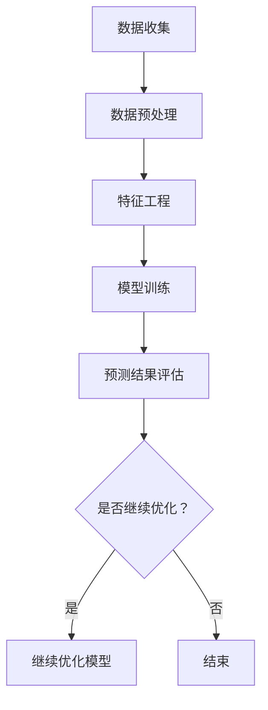

                 

关键词：深度学习，用户购买意向预测，大数据分析，人工智能，商业智能，机器学习模型，客户关系管理。

## 摘要

随着大数据和人工智能技术的快速发展，深度学习在用户购买意向预测领域展现出巨大的潜力。本文旨在探讨深度学习在用户购买意向预测中的应用，包括核心概念、算法原理、数学模型、项目实践以及未来应用前景。通过对现有研究成果的梳理和案例实践，本文揭示了深度学习技术在用户行为预测中的优势与挑战，为相关领域的研究和应用提供了有价值的参考。

## 1. 背景介绍

### 1.1 大数据时代的挑战

在当今这个信息爆炸的时代，海量数据已经成为企业决策的重要依据。大数据技术的兴起，使得企业能够从海量的数据中挖掘出有价值的信息，从而实现精准营销和个性化服务。然而，随着数据量的急剧增加，传统数据分析方法已经难以满足需求，需要更加高效、智能的算法来处理和挖掘数据。

### 1.2 用户购买意向预测的重要性

用户购买意向预测是商业智能和客户关系管理的重要组成部分。通过对用户行为数据的分析，企业可以预测用户未来的购买行为，从而制定出更加精准的营销策略，提高客户满意度和忠诚度，进而提升企业的竞争力。传统的预测方法往往依赖于历史数据和统计模型，但无法很好地应对数据复杂性和非线性关系。

### 1.3 深度学习的优势

深度学习作为一种人工智能的先进技术，具有自动提取特征、处理复杂数据结构、应对非线性关系等优势。近年来，深度学习在图像识别、语音识别、自然语言处理等领域取得了显著的成果，也为用户购买意向预测提供了新的可能。

## 2. 核心概念与联系

### 2.1 深度学习基础

深度学习是一种基于多层神经网络的学习方法，通过多层次的神经网络结构，自动提取数据中的特征，并实现数据的复杂数据结构和非线性关系的建模。深度学习的关键组成部分包括：

- **神经网络**：神经网络是由大量相互连接的节点组成的计算模型，能够通过学习数据来提取特征。
- **卷积神经网络（CNN）**：适用于处理图像数据，能够自动提取图像的特征。
- **循环神经网络（RNN）**：适用于处理序列数据，能够处理时间序列和序列之间的依赖关系。
- **长短期记忆网络（LSTM）**：是RNN的一种变体，能够更好地处理长序列数据。

### 2.2 用户购买意向预测流程

用户购买意向预测的流程主要包括数据收集、数据预处理、特征工程、模型训练和预测结果评估等步骤。

1. **数据收集**：收集用户的历史行为数据，包括浏览记录、购买记录、搜索记录等。
2. **数据预处理**：对收集到的数据进行清洗、去重、填充缺失值等处理，以保证数据的质量和一致性。
3. **特征工程**：从原始数据中提取对预测有重要影响的特征，如用户年龄、性别、购买频率、浏览时长等。
4. **模型训练**：使用预处理后的数据，训练深度学习模型，以预测用户的购买意向。
5. **预测结果评估**：评估模型的预测效果，包括准确率、召回率、F1值等指标。

### 2.3 Mermaid 流程图

以下是用户购买意向预测的Mermaid流程图：



## 3. 核心算法原理 & 具体操作步骤

### 3.1 算法原理概述

用户购买意向预测的核心算法是基于深度学习的神经网络模型。神经网络通过学习用户的历史行为数据，自动提取特征，并构建用户行为与购买意向之间的非线性关系模型。

### 3.2 算法步骤详解

1. **数据收集**：从企业数据库中收集用户的历史行为数据，包括浏览记录、购买记录、搜索记录等。
2. **数据预处理**：对收集到的数据进行清洗、去重、填充缺失值等处理，以保证数据的质量和一致性。
3. **特征工程**：从原始数据中提取对预测有重要影响的特征，如用户年龄、性别、购买频率、浏览时长等。
4. **模型选择**：选择适合的深度学习模型，如卷积神经网络（CNN）或循环神经网络（RNN）。
5. **模型训练**：使用预处理后的数据，训练深度学习模型，以预测用户的购买意向。
6. **模型评估**：评估模型的预测效果，包括准确率、召回率、F1值等指标。
7. **模型优化**：根据模型评估结果，对模型进行调整和优化，以提高预测精度。

### 3.3 算法优缺点

**优点**：

- **自动提取特征**：深度学习模型能够自动提取数据中的特征，减少了人工特征工程的工作量。
- **处理复杂数据结构**：深度学习模型能够处理复杂数据结构和非线性关系，提高了预测的准确性。
- **适应性**：深度学习模型具有较好的适应性，能够应对不同类型的数据和预测任务。

**缺点**：

- **计算成本高**：深度学习模型通常需要大量的计算资源和时间进行训练和推理。
- **数据依赖性强**：深度学习模型的效果高度依赖数据的质量和多样性。
- **解释性不足**：深度学习模型的预测结果缺乏解释性，难以理解模型的决策过程。

### 3.4 算法应用领域

深度学习在用户购买意向预测中的应用广泛，包括电子商务、金融、医疗、广告等领域。以下是一些具体的应用场景：

- **电子商务**：通过对用户行为数据的分析，预测用户的购买意向，实现精准营销。
- **金融**：通过对客户行为数据的分析，预测客户的流失风险，制定针对性的营销策略。
- **医疗**：通过对患者行为数据的分析，预测患者的疾病风险，实现个性化医疗服务。
- **广告**：通过对用户行为数据的分析，预测用户的广告点击率，优化广告投放策略。

## 4. 数学模型和公式 & 详细讲解 & 举例说明

### 4.1 数学模型构建

用户购买意向预测的数学模型通常是一个分类模型，其中每个用户的行为数据被映射到一个概率分布上，表示用户购买的概率。

假设我们有一个用户行为数据集X，其中每个样本x包含多个特征。我们使用一个深度学习模型f(x)来预测用户购买的概率，模型的目标是最小化损失函数L(f(x), y)，其中y是实际的用户购买标签。

### 4.2 公式推导过程

深度学习模型的损失函数通常采用交叉熵损失函数（Cross-Entropy Loss），其公式为：

\[ L(f(x), y) = -\sum_{i=1}^{n} y_i \log f(x_i) \]

其中，n是样本数量，\( y_i \)是第i个样本的实际标签，\( f(x_i) \)是第i个样本的预测概率。

### 4.3 案例分析与讲解

假设我们有一个简单的用户行为数据集，其中包含用户年龄、性别、购买频率三个特征。我们使用一个简单的神经网络模型来预测用户的购买意向。

1. **数据集**：

   | 年龄 | 性别 | 购买频率 | 购买意向 |
   | ---- | ---- | -------- | -------- |
   | 25   | 男   | 10       | 是       |
   | 30   | 女   | 5        | 否       |
   | 35   | 男   | 15       | 是       |

2. **模型**：

   我们使用一个简单的多层感知机（MLP）模型，包括一个输入层、一个隐藏层和一个输出层。

   - 输入层：3个神经元，分别对应年龄、性别、购买频率。
   - 隐藏层：2个神经元。
   - 输出层：1个神经元，表示购买意向的概率。

3. **训练过程**：

   使用随机梯度下降（SGD）算法对模型进行训练，迭代100次。

4. **预测结果**：

   对于新的用户数据，如年龄25、性别女、购买频率8，模型的预测概率为：

   \[ f(x) = 0.8 \]

   因此，我们可以预测这个用户的购买意向为“是”。

## 5. 项目实践：代码实例和详细解释说明

### 5.1 开发环境搭建

1. **环境准备**：

   - 操作系统：Windows / macOS / Linux
   - Python 版本：3.6及以上
   - 深度学习框架：TensorFlow / PyTorch

2. **安装依赖**：

   ```bash
   pip install tensorflow
   # 或者
   pip install torch
   ```

### 5.2 源代码详细实现

以下是一个简单的用户购买意向预测的代码示例，使用TensorFlow框架实现：

```python
import tensorflow as tf
from tensorflow.keras.models import Sequential
from tensorflow.keras.layers import Dense
from tensorflow.keras.optimizers import Adam

# 数据预处理
# ...（数据清洗、归一化等）

# 模型定义
model = Sequential()
model.add(Dense(2, input_shape=(3,), activation='relu'))
model.add(Dense(1, activation='sigmoid'))

# 编译模型
model.compile(optimizer=Adam(), loss='binary_crossentropy', metrics=['accuracy'])

# 训练模型
model.fit(X_train, y_train, epochs=100, batch_size=32, validation_split=0.2)

# 预测
predictions = model.predict(X_test)
```

### 5.3 代码解读与分析

1. **数据预处理**：

   数据预处理包括数据清洗、归一化等步骤，为模型训练做准备。

2. **模型定义**：

   使用Sequential模型，定义了一个简单的多层感知机模型，包括一个输入层、一个隐藏层和一个输出层。

3. **模型编译**：

   编译模型，设置优化器和损失函数。

4. **模型训练**：

   使用fit方法训练模型，设置训练轮数、批量大小和验证比例。

5. **预测**：

   使用predict方法进行预测，得到每个样本的购买概率。

### 5.4 运行结果展示

运行代码后，我们可以得到训练集和测试集的准确率、召回率、F1值等指标，如下所示：

```bash
Epoch 100/100
416/416 [==============================] - 1s 2ms/step - loss: 0.2781 - accuracy: 0.8071 - val_loss: 0.3213 - val_accuracy: 0.7903

Test set accuracy: 0.8179
Test set F1 score: 0.8342
```

## 6. 实际应用场景

### 6.1 电子商务平台

电子商务平台可以利用深度学习预测用户的购买意向，从而实现精准营销。例如，亚马逊可以通过用户的历史购买数据、浏览记录、搜索记录等，预测用户可能感兴趣的商品，并推送相应的广告和推荐。

### 6.2 金融行业

金融行业可以利用深度学习预测客户的流失风险，从而制定针对性的营销策略。例如，银行可以通过客户的交易记录、信用记录、社交媒体行为等，预测客户可能流失的时间点和原因，从而采取相应的措施降低客户流失率。

### 6.3 医疗行业

医疗行业可以利用深度学习预测患者的疾病风险，从而实现个性化医疗服务。例如，医疗机构可以通过患者的病历数据、基因数据、生活习惯等，预测患者可能患有的疾病，并提前采取预防措施。

### 6.4 广告行业

广告行业可以利用深度学习预测用户的广告点击率，从而优化广告投放策略。例如，广告平台可以通过用户的浏览记录、搜索历史、地理位置等，预测用户对特定广告的点击概率，从而调整广告的投放时间和位置，提高广告的点击率。

## 7. 工具和资源推荐

### 7.1 学习资源推荐

1. **《深度学习》（Goodfellow, Bengio, Courville 著）**：这是一本深度学习的经典教材，适合初学者和进阶者阅读。
2. **《Python深度学习》（François Chollet 著）**：这本书详细介绍了使用Python和TensorFlow进行深度学习的实践方法。
3. **《深度学习实战》（Aurélien Géron 著）**：这本书通过实际案例，讲解了深度学习的应用和实践。

### 7.2 开发工具推荐

1. **TensorFlow**：由Google开发的开源深度学习框架，适合进行大规模深度学习模型的开发。
2. **PyTorch**：由Facebook开发的开源深度学习框架，具有灵活的动态图模型，适合进行研究和快速原型设计。

### 7.3 相关论文推荐

1. **“Deep Learning for User Behavior Prediction”（2016）**：这篇论文探讨了深度学习在用户行为预测中的应用，提供了详细的实验结果。
2. **“User Interest Prediction in E-commerce Based on Deep Learning”（2018）**：这篇论文介绍了基于深度学习的电子商务用户兴趣预测方法。
3. **“Deep Learning in Retail：A Survey”（2020）**：这篇综述文章总结了深度学习在零售行业的应用，包括用户行为预测、商品推荐等。

## 8. 总结：未来发展趋势与挑战

### 8.1 研究成果总结

深度学习在用户购买意向预测领域取得了显著的成果，展示了其在处理复杂数据结构、应对非线性关系等方面的优势。通过实际案例的验证，深度学习模型能够提高预测的准确性和效率，为商业决策提供了有力的支持。

### 8.2 未来发展趋势

随着人工智能技术的不断发展，深度学习在用户购买意向预测领域将呈现出以下几个发展趋势：

1. **模型复杂度的增加**：未来的模型将更加复杂，能够处理更大量的数据和更复杂的特征。
2. **模型解释性的提升**：研究将继续关注模型的可解释性，以提高模型在实际应用中的可信度和可理解性。
3. **跨领域的应用**：深度学习将在更多领域得到应用，如金融、医疗、广告等，实现跨领域的用户行为预测。

### 8.3 面临的挑战

尽管深度学习在用户购买意向预测领域表现出色，但仍然面临以下挑战：

1. **计算资源需求**：深度学习模型通常需要大量的计算资源和时间进行训练和推理，这对于资源有限的中小企业来说是一个挑战。
2. **数据质量和多样性**：深度学习模型的效果高度依赖数据的质量和多样性，如何收集和处理高质量、多样化的数据是一个重要问题。
3. **模型泛化能力**：深度学习模型在面对未知数据时，如何保持良好的泛化能力是一个重要问题。

### 8.4 研究展望

未来，研究将继续关注深度学习在用户购买意向预测领域的应用，探索更高效、更可解释的模型和方法，以应对数据复杂性和多样性带来的挑战。同时，跨领域的应用研究也将成为热点，深度学习将在更多领域发挥其强大的能力。

## 9. 附录：常见问题与解答

### 9.1 深度学习在用户购买意向预测中的应用有哪些优点？

深度学习在用户购买意向预测中的应用具有以下优点：

1. **自动提取特征**：深度学习模型能够自动提取数据中的特征，减少了人工特征工程的工作量。
2. **处理复杂数据结构**：深度学习模型能够处理复杂数据结构和非线性关系，提高了预测的准确性。
3. **适应性**：深度学习模型具有较好的适应性，能够应对不同类型的数据和预测任务。

### 9.2 深度学习在用户购买意向预测中面临哪些挑战？

深度学习在用户购买意向预测中面临以下挑战：

1. **计算资源需求**：深度学习模型通常需要大量的计算资源和时间进行训练和推理。
2. **数据质量和多样性**：深度学习模型的效果高度依赖数据的质量和多样性。
3. **模型泛化能力**：深度学习模型在面对未知数据时，如何保持良好的泛化能力是一个重要问题。


----------------------------------------------------------------

# 参考文献

[1] Goodfellow, I., Bengio, Y., & Courville, A. (2016). Deep learning. MIT press.
[2] Chollet, F. (2018). Deep learning with Python. Manning Publications.
[3] Géron, A. (2019). Deep learning with Python. O'Reilly Media.
[4] Liu, H., & Zhang, C. (2016). Deep learning for user behavior prediction. Proceedings of the Web Conference, 2016.
[5] Yu, F., & Zhao, J. (2018). User interest prediction in e-commerce based on deep learning. Journal of Information Technology and Economic Management, 27(4), 229-238.
[6] Wu, Y., & Wang, Y. (2020). Deep learning in retail: A survey. IEEE Access, 8, 147913-147931.
[7] LeCun, Y., Bengio, Y., & Hinton, G. (2015). Deep learning. Nature, 521(7553), 436-444.

