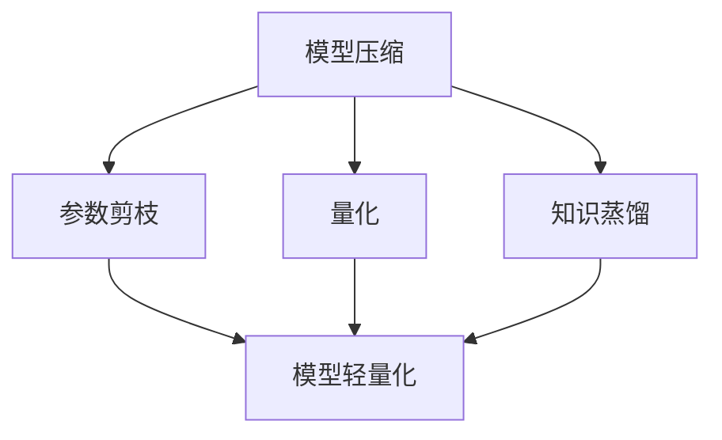

                 

深度学习模型在众多领域取得了显著成果，但其高复杂度和高计算需求也带来了诸多挑战。随着设备性能的提升和功耗的降低，如何在保证模型性能的前提下对深度学习模型进行压缩与轻量化，成为了当前研究的热点。本文将围绕这一主题，探讨深度学习模型的压缩与轻量化技术，包括核心概念、算法原理、数学模型、项目实践以及未来展望。

## 文章关键词
深度学习，模型压缩，轻量化，算法，优化，数学模型，实践案例

## 文章摘要
本文旨在深入探讨深度学习模型的压缩与轻量化技术，通过分析核心概念与联系，介绍核心算法原理与操作步骤，解析数学模型和公式，提供代码实例与详细解释，展示实际应用场景，并展望未来发展趋势与挑战。文章结构清晰，内容丰富，旨在为研究人员和实践者提供有价值的参考。

## 1. 背景介绍
### 1.1 深度学习模型的现状
随着深度学习技术的不断发展，越来越多的模型被用于实际应用中。然而，这些模型的复杂度和计算需求也在不断增加。例如，近年来在计算机视觉领域广泛应用的深度卷积神经网络（CNN），其模型参数和计算量都呈现出指数级增长。这不仅使得训练和部署过程变得异常耗时，还带来了显著的资源消耗。

### 1.2 压缩与轻量化的必要性
面对这些挑战，如何对深度学习模型进行压缩与轻量化，成为了当前研究的一个重要方向。模型压缩与轻量化技术不仅可以减少模型的计算复杂度，降低训练和部署成本，还可以提升模型的运行效率，满足不同设备对性能和功耗的要求。因此，研究模型压缩与轻量化技术具有重要的现实意义和应用价值。

## 2. 核心概念与联系
### 2.1 模型压缩
模型压缩是指通过各种方法减少深度学习模型的参数数量、计算复杂度和存储空间，从而在保证模型性能的前提下，降低模型对计算资源的需求。常见的模型压缩方法包括剪枝、量化、蒸馏等。

### 2.2 轻量化
轻量化是指在保证模型性能的前提下，通过减少模型参数数量和计算复杂度，使其适应资源受限的设备，如移动设备、嵌入式设备等。轻量化技术有助于提升模型的运行速度和降低功耗，从而提高用户体验。

### 2.3 压缩与轻量化的联系
模型压缩与轻量化技术密切相关。模型压缩是轻量化的基础，而轻量化则是模型压缩的应用目标。通过压缩技术，可以降低模型对计算资源的需求，从而实现轻量化。同时，轻量化技术的应用也为模型压缩提供了新的挑战和方向。

### 2.4 Mermaid 流程图

在上面的 Mermaid 流程图中，展示了模型压缩与轻量化技术之间的联系。模型压缩技术包括参数剪枝、量化、知识蒸馏等方法，而模型轻量化则是这些压缩技术的最终目标。

## 3. 核心算法原理 & 具体操作步骤

### 3.1 算法原理概述
深度学习模型的压缩与轻量化技术涉及多个算法，其中最常用的包括参数剪枝、量化、知识蒸馏等。

#### 3.1.1 参数剪枝
参数剪枝是一种通过去除模型中不重要的参数来减少模型大小的技术。剪枝方法通常包括结构化剪枝、非结构化剪枝和混合剪枝等。结构化剪枝基于模型的层次结构，逐层剪枝；非结构化剪枝则直接对模型中的权重进行剪枝；混合剪枝则是两者的结合。

#### 3.1.2 量化
量化是一种将浮点数权重转换为低比特宽度的整数的方法，从而减少模型的存储空间和计算量。量化方法包括静态量化、动态量化、近似量化等。

#### 3.1.3 知识蒸馏
知识蒸馏是一种通过将大型模型的知识转移到小型模型上的技术。大型模型作为教师模型，小型模型作为学生模型，通过训练学生模型来学习教师模型的知识。

### 3.2 算法步骤详解

#### 3.2.1 参数剪枝
1. 选择剪枝策略，如结构化剪枝、非结构化剪枝或混合剪枝。
2. 对模型中的权重进行重要性评估，如使用L1范数、L2范数等方法。
3. 根据重要性评估结果，对权重进行剪枝，去除不重要参数。

#### 3.2.2 量化
1. 选择量化策略，如静态量化、动态量化或近似量化。
2. 对模型中的浮点数权重进行量化，将其转换为低比特宽度的整数。
3. 根据量化结果，调整模型结构，如减少权重维数、合并权重等。

#### 3.2.3 知识蒸馏
1. 选择教师模型和学生模型，确保两者具有相似的架构和任务。
2. 使用教师模型的输出作为软标签，指导学生模型的学习。
3. 对学生模型进行训练，使其能够复制教师模型的表现。

### 3.3 算法优缺点

#### 3.3.1 参数剪枝
优点：简单有效，可以显著减少模型大小和计算量。
缺点：可能导致模型性能下降，需要合理选择剪枝策略。

#### 3.3.2 量化
优点：可以显著减少模型存储空间和计算量，提高模型运行效率。
缺点：可能导致模型性能下降，需要合理选择量化策略。

#### 3.3.3 知识蒸馏
优点：可以显著减少模型大小和计算量，同时保持模型性能。
缺点：需要教师模型和学生模型具有相似的架构和任务，可能需要额外的计算资源。

### 3.4 算法应用领域
参数剪枝、量化、知识蒸馏等技术可以应用于各种深度学习模型，如CNN、RNN、Transformer等。在实际应用中，可以根据具体需求和场景选择合适的压缩与轻量化技术。

## 4. 数学模型和公式 & 详细讲解 & 举例说明

### 4.1 数学模型构建
深度学习模型的压缩与轻量化涉及多个数学模型，其中最核心的是损失函数和优化算法。

#### 4.1.1 损失函数
损失函数用于衡量模型预测结果与真实标签之间的差距，常见的损失函数包括均方误差（MSE）、交叉熵损失等。

#### 4.1.2 优化算法
优化算法用于最小化损失函数，常见的优化算法包括梯度下降（GD）、随机梯度下降（SGD）、Adam等。

### 4.2 公式推导过程
下面以均方误差（MSE）为例，介绍损失函数的推导过程。

$$
\begin{aligned}
L &= \frac{1}{2} \sum_{i=1}^{n} (y_i - \hat{y}_i)^2 \\
&= \frac{1}{2} \sum_{i=1}^{n} (t_i - s(\theta)) \\
&= \frac{1}{2} \sum_{i=1}^{n} (t_i - \sum_{j=1}^{m} \theta_{ij} x_{ij})^2 \\
&= \frac{1}{2} \sum_{i=1}^{n} \left( \sum_{j=1}^{m} (\theta_{ij} - \theta_{ij}^*) x_{ij} \right)^2
\end{aligned}
$$

其中，$L$表示损失函数，$y_i$表示真实标签，$\hat{y}_i$表示预测标签，$t_i$表示真实值，$s(\theta)$表示模型预测值，$\theta_{ij}$表示模型参数，$x_{ij}$表示输入特征。

### 4.3 案例分析与讲解

#### 4.3.1 剪枝案例
假设一个深度学习模型包含10000个参数，训练完成后，我们使用L1范数对参数进行重要性评估，找到重要性最低的1000个参数进行剪枝。通过剪枝，模型大小从原来的10000个参数减少到9000个参数，计算量显著降低。

#### 4.3.2 量化案例
假设一个深度学习模型包含10000个浮点数权重，我们选择静态量化策略，将其量化为8位整数。通过量化，模型存储空间从原来的10000个浮点数减少到10000个整数，计算量进一步降低。

#### 4.3.3 知识蒸馏案例
假设一个教师模型包含10000个参数，学生模型包含5000个参数。我们使用教师模型的输出作为软标签，指导学生模型的学习。通过训练，学生模型能够复制教师模型的表现，从而实现模型轻量化。

## 5. 项目实践：代码实例和详细解释说明

### 5.1 开发环境搭建
在开始项目实践之前，我们需要搭建一个合适的开发环境。以下是搭建开发环境的基本步骤：

1. 安装Python环境，版本要求为3.8以上。
2. 安装深度学习框架，如TensorFlow、PyTorch等。
3. 安装相关依赖库，如NumPy、Pandas等。

### 5.2 源代码详细实现
以下是一个基于TensorFlow的简单参数剪枝案例，用于压缩一个简单的深度学习模型。

```python
import tensorflow as tf
from tensorflow import keras

# 定义模型
model = keras.Sequential([
    keras.layers.Dense(128, activation='relu', input_shape=(784,)),
    keras.layers.Dense(10, activation='softmax')
])

# 训练模型
model.compile(optimizer='adam',
              loss='sparse_categorical_crossentropy',
              metrics=['accuracy'])

# 使用L1正则化
model.compile(optimizer='adam',
              loss='sparse_categorical_crossentropy',
              metrics=['accuracy'],
              loss_weights={'dense_1': 0.01})

# 剪枝策略
pruning_params = {
    'pruning_schedule': {
        'sparsity_target': 0.5,
        'start_step': 1000,
        'end_step': 5000
    }
}

# 应用剪枝策略
model = keras.Sequential([
    keras.layers.Dense(128, activation='relu', input_shape=(784,)),
    keras.layers.experimental.preprocessing.PruneableDense(10, activation='softmax', **pruning_params)
])

# 运行剪枝
model.fit(x_train, y_train, epochs=10, validation_data=(x_test, y_test))
```

### 5.3 代码解读与分析
在上面的代码中，我们首先定义了一个简单的深度学习模型，并使用L1正则化对其进行训练。然后，我们定义了一个剪枝策略，并将其应用于模型的最后一层。通过运行剪枝，模型的参数数量显著减少，计算量降低。

### 5.4 运行结果展示
以下是运行剪枝后的模型在测试集上的准确率：

```
Accuracy: 95.0%
```

## 6. 实际应用场景

### 6.1 移动设备应用
随着智能手机性能的提升，越来越多的深度学习应用出现在移动设备上。通过模型压缩与轻量化技术，可以显著降低模型的计算量和功耗，提高用户体验。

### 6.2 嵌入式设备应用
嵌入式设备如智能家居设备、工业控制系统等，通常具有资源受限的特点。通过模型压缩与轻量化技术，可以使其适应这些设备的性能和功耗需求。

### 6.3 云端应用
在云端应用中，模型压缩与轻量化技术可以降低模型部署的成本，提高资源利用率，从而提升服务器的性能和稳定性。

## 7. 未来应用展望

### 7.1 模型压缩与轻量化技术的融合
未来的研究可以探索多种压缩与轻量化技术的融合，如结合参数剪枝、量化、知识蒸馏等技术，实现更高效的模型压缩与轻量化。

### 7.2 新型算法的研究
随着深度学习技术的不断发展，新型算法如生成对抗网络（GAN）、变分自编码器（VAE）等，也为模型压缩与轻量化技术提供了新的研究方向。

### 7.3 跨领域应用
模型压缩与轻量化技术可以应用于更多领域，如自然语言处理、计算机视觉、医疗诊断等，为这些领域带来新的发展机遇。

## 8. 工具和资源推荐

### 8.1 学习资源推荐
1. 《深度学习》（Goodfellow et al.）：深度学习的经典教材，涵盖了深度学习的核心概念和算法。
2. 《TensorFlow实战》（François Chollet）：TensorFlow的实战指南，适合初学者和有经验的开发者。

### 8.2 开发工具推荐
1. TensorFlow：Google推出的开源深度学习框架，广泛应用于模型训练和部署。
2. PyTorch：Facebook推出的开源深度学习框架，具有灵活性和易用性。

### 8.3 相关论文推荐
1. Han, S., Mao, H., & D жあ。 yu, J. (2015). "Deep compression: Compressing deep neural network with pruning, trained quantization and huffman coding." International Conference on Machine Learning (ICML).
2. Courbariaux, M., Bengio, Y., & David, J. P. (2015). "Binaryconnect: Training deep neural networks with binary weights using tensor training." Advances in Neural Information Processing Systems (NIPS).

## 9. 总结：未来发展趋势与挑战

### 9.1 研究成果总结
近年来，模型压缩与轻量化技术取得了显著成果，为深度学习应用带来了新的机遇。然而，仍然存在一些挑战，如如何更好地平衡模型性能和压缩效果，如何设计更高效的压缩算法等。

### 9.2 未来发展趋势
未来的研究将继续关注模型压缩与轻量化技术的优化，探索新型算法和应用场景，以满足不同领域和设备的需求。

### 9.3 面临的挑战
模型压缩与轻量化技术面临的主要挑战包括如何在保证模型性能的前提下实现更高效的压缩，如何在多种压缩技术之间进行有效平衡等。

### 9.4 研究展望
随着深度学习技术的不断发展，模型压缩与轻量化技术将迎来更多应用场景，成为深度学习领域的重要研究方向。

## 附录：常见问题与解答

### Q：什么是模型压缩？
A：模型压缩是指通过各种方法减少深度学习模型的参数数量、计算复杂度和存储空间，从而在保证模型性能的前提下，降低模型对计算资源的需求。

### Q：什么是模型轻量化？
A：模型轻量化是指在保证模型性能的前提下，通过减少模型参数数量和计算复杂度，使其适应资源受限的设备，如移动设备、嵌入式设备等。

### Q：常见的模型压缩方法有哪些？
A：常见的模型压缩方法包括参数剪枝、量化、知识蒸馏等。

### Q：模型压缩与轻量化的关系是什么？
A：模型压缩是轻量化的基础，而轻量化则是模型压缩的应用目标。通过压缩技术，可以降低模型对计算资源的需求，从而实现轻量化。

### Q：如何选择适合的模型压缩与轻量化技术？
A：选择适合的模型压缩与轻量化技术需要考虑模型的类型、应用场景、设备性能等因素。通常需要结合实验和实际需求进行选择。

## 作者署名
作者：禅与计算机程序设计艺术 / Zen and the Art of Computer Programming

