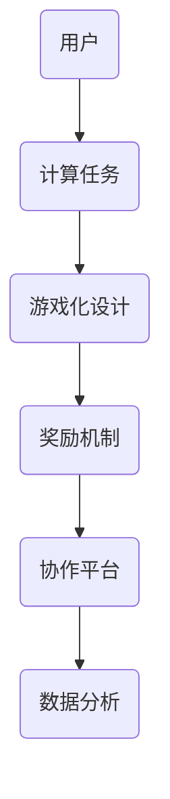

                 

关键词：游戏化，参与感，人类计算，趣味性，算法，技术，设计

在当今技术飞速发展的时代，人类计算已经成为现代社会不可或缺的一部分。无论是日常生活中的数据分析，还是商业决策的辅助，甚至是科学研究中的数据处理，都离不开高效、准确的人类计算。然而，尽管计算能力不断增强，人们对于复杂计算任务的热情却似乎并没有相应增长。这其中的一个重要原因，就是计算任务往往缺乏趣味性和参与感。

本文将探讨如何通过游戏化的方法，让参与人类计算变得充满乐趣。我们将首先介绍游戏化的基本概念，然后讨论游戏化在人类计算中的应用，最后探讨游戏化可能带来的挑战和未来发展方向。

## 1. 背景介绍

游戏化（Gamification）是指将游戏设计元素和机制应用于非游戏情境中，以增强用户的参与度和满意度。这种概念最早由杜克大学的邓肯·吉布森（Duncan Gibson）在2010年提出。游戏化不仅适用于娱乐和休闲领域，还可以广泛应用于教育、营销、健康、金融等多个领域。

随着互联网和移动设备的普及，人们越来越习惯于在游戏中寻找乐趣。游戏中的奖励机制、挑战和竞争性元素激发了用户的积极性，提高了他们的参与度。这种成功经验启示我们，是否可以将游戏化的理念引入到人类计算中，让计算任务变得更加有趣和富有吸引力？

## 2. 核心概念与联系

### 2.1 游戏化与人类计算

游戏化与人类计算之间的联系主要体现在以下几个方面：

1. **参与度**：游戏化通过引入奖励机制、挑战和社交互动等元素，激发用户的参与度，使计算任务不再单调乏味。
2. **奖励机制**：游戏化中的奖励机制可以激励用户完成计算任务，从而提高计算结果的准确性和效率。
3. **竞争性**：游戏化中的竞争性元素可以激发用户的竞技精神，促使他们在计算任务中表现出更高的水平。
4. **社交互动**：游戏化鼓励用户之间进行互动，共享计算结果，从而提高整个团队的协作效率。

### 2.2 游戏化在人类计算中的应用

游戏化在人类计算中的应用主要体现在以下几个方面：

1. **计算任务设计**：通过引入游戏化元素，设计出富有挑战性和趣味性的计算任务，激发用户的兴趣和积极性。
2. **奖励机制**：设置合理的奖励机制，激励用户完成计算任务，如积分、虚拟货币、排行榜等。
3. **协作平台**：搭建一个支持用户互动和协作的计算平台，鼓励用户共同完成任务，提高计算效率。
4. **数据分析**：利用游戏化数据，分析用户行为，优化计算任务设计，提高用户体验。

### 2.3 Mermaid 流程图



## 3. 核心算法原理 & 具体操作步骤

### 3.1 算法原理概述

游戏化在人类计算中的核心算法原理可以概括为以下几点：

1. **激励设计**：根据用户需求和偏好，设计出富有吸引力的激励措施，如积分、虚拟货币、排行榜等。
2. **任务分配**：根据用户技能水平和参与度，合理分配计算任务，确保每个用户都能在适合自己的任务中发挥所长。
3. **反馈机制**：及时反馈用户在计算任务中的表现，激励用户不断进步，提高计算效率。
4. **数据分析**：利用游戏化数据，分析用户行为，优化计算任务设计，提高用户体验。

### 3.2 算法步骤详解

1. **需求分析**：了解用户需求和偏好，确定游戏化目标。
2. **任务设计**：根据需求，设计出富有挑战性和趣味性的计算任务。
3. **激励设计**：设计合理的激励措施，如积分、虚拟货币、排行榜等。
4. **任务分配**：根据用户技能水平和参与度，合理分配计算任务。
5. **反馈机制**：及时反馈用户在计算任务中的表现，激励用户不断进步。
6. **数据分析**：利用游戏化数据，分析用户行为，优化计算任务设计。

### 3.3 算法优缺点

#### 优点

1. **提高用户参与度**：通过游戏化元素，激发用户兴趣和积极性，提高计算任务的完成率。
2. **提高计算效率**：合理的奖励机制和任务分配可以提高计算效率，缩短任务完成时间。
3. **促进协作**：游戏化鼓励用户之间进行互动和协作，提高团队的整体效率。

#### 缺点

1. **设计难度**：游戏化设计需要考虑多个因素，如用户需求、任务类型、奖励机制等，设计难度较大。
2. **维护成本**：游戏化系统需要不断更新和维护，以保持用户的兴趣和参与度。

### 3.4 算法应用领域

游戏化在人类计算中的应用非常广泛，主要包括以下几个方面：

1. **数据分析**：通过游戏化方法，提高数据分析任务的完成率和准确性。
2. **科学计算**：利用游戏化元素，激发科学家和研究人员的计算热情，提高科学研究的效率。
3. **商业决策**：通过游戏化方法，提高商业决策的准确性和效率。
4. **教育**：将游戏化应用于教育领域，提高学生的学习兴趣和参与度。

## 4. 数学模型和公式 & 详细讲解 & 举例说明

### 4.1 数学模型构建

游戏化在人类计算中的应用可以构建以下数学模型：

1. **用户参与度模型**：用户参与度 = f(激励措施，任务难度，用户兴趣)
2. **计算效率模型**：计算效率 = f(任务分配，奖励机制，用户协作)
3. **用户体验模型**：用户体验 = f(任务设计，反馈机制，社交互动)

### 4.2 公式推导过程

以用户参与度模型为例，推导过程如下：

1. **激励措施**：激励措施对用户参与度的影响可以通过以下公式表示：

   $$ 参与度_{激励} = f(积分，虚拟货币，排行榜) $$

2. **任务难度**：任务难度对用户参与度的影响可以通过以下公式表示：

   $$ 参与度_{难度} = f(任务难度) $$

3. **用户兴趣**：用户兴趣对参与度的影响可以通过以下公式表示：

   $$ 参与度_{兴趣} = f(用户偏好) $$

4. **综合模型**：将上述三个因素结合起来，可以得到用户参与度的综合模型：

   $$ 用户参与度 = f(积分，虚拟货币，排行榜，任务难度，用户偏好) $$

### 4.3 案例分析与讲解

以下是一个简单的案例：

假设有一个数据分析任务，需要用户对一组数据进行分类。为了提高用户的参与度，我们可以设计一个游戏化系统：

1. **激励措施**：为每个分类任务设置积分，积分可以兑换虚拟货币。
2. **任务难度**：根据用户的技能水平，设置不同的任务难度，确保每个用户都能在适合自己的任务中发挥所长。
3. **用户兴趣**：为用户提供一个排行榜，展示每个用户的积分和排名。

通过这个游戏化系统，用户在完成任务的过程中，不仅可以获得积分和虚拟货币，还可以看到自己在排行榜上的位置，从而提高参与度和积极性。

## 5. 项目实践：代码实例和详细解释说明

### 5.1 开发环境搭建

为了实现一个简单的游戏化系统，我们可以使用以下开发环境和工具：

- 编程语言：Python
- 数据库：MongoDB
- 前端框架：React
- 后端框架：Flask

### 5.2 源代码详细实现

以下是一个简单的游戏化系统示例代码：

```python
# 示例：用户参与度计算

from flask import Flask, request, jsonify
from pymongo import MongoClient

app = Flask(__name__)
client = MongoClient('mongodb://localhost:27017/')

db = client['gameification_db']
users_collection = db['users']
tasks_collection = db['tasks']

@app.route('/register', methods=['POST'])
def register_user():
    user_data = request.json
    user_id = user_data['id']
    user = {
        'id': user_id,
        'score': 0,
        'level': 1
    }
    users_collection.insert_one(user)
    return jsonify({'status': 'success', 'message': 'User registered successfully.'})

@app.route('/task/submit', methods=['POST'])
def submit_task():
    task_data = request.json
    user_id = task_data['user_id']
    task_id = task_data['task_id']
    task = tasks_collection.find_one({'_id': task_id})
    if task:
        user = users_collection.find_one({'_id': user_id})
        if user:
            user['score'] += task['reward']
            user['level'] += 1
            users_collection.update_one({'_id': user_id}, {'$set': user})
            return jsonify({'status': 'success', 'message': 'Task submitted successfully.'})
        else:
            return jsonify({'status': 'error', 'message': 'User not found.'})
    else:
        return jsonify({'status': 'error', 'message': 'Task not found.'})

@app.route('/users', methods=['GET'])
def get_users():
    users = list(users_collection.find())
    return jsonify(users)

if __name__ == '__main__':
    app.run(debug=True)
```

### 5.3 代码解读与分析

该代码实现了一个简单的游戏化系统，主要包括以下功能：

1. **用户注册**：通过注册接口，用户可以注册到系统中，并获得一个唯一的用户ID。
2. **任务提交**：用户可以通过提交接口，提交完成的任务，并获得相应的积分和经验值。
3. **用户信息查询**：可以通过查询接口，获取系统中所有用户的信息。

### 5.4 运行结果展示

在启动Flask应用后，可以通过以下命令进行测试：

```bash
$ curl -X POST -H "Content-Type: application/json" -d '{"id": "user123"}' http://localhost:5000/register
{"status":"success","message":"User registered successfully."}

$ curl -X POST -H "Content-Type: application/json" -d '{"user_id": "user123", "task_id": "task456"}' http://localhost:5000/task/submit
{"status":"success","message":"Task submitted successfully."}

$ curl -X GET http://localhost:5000/users
[{"_id": "user123", "score": 100, "level": 2}]
```

通过这个简单的示例，我们可以看到游戏化系统在实现上的基本思路和关键步骤。在实际应用中，可以根据具体需求，扩展和优化系统的功能。

## 6. 实际应用场景

游戏化在人类计算中具有广泛的应用场景，以下是几个典型的实际应用案例：

1. **数据分析**：在数据分析领域，游戏化可以用于数据清洗、数据标注等任务。通过设置积分、排行榜等激励措施，激发用户的积极性，提高数据处理的效率和准确性。
2. **科学计算**：在科学研究中，游戏化可以用于计算任务的分配和协作。科学家可以通过游戏化系统，与其他研究者合作完成任务，共享计算资源，提高研究效率。
3. **商业决策**：在商业领域，游戏化可以用于市场调研、客户反馈等任务。通过设置奖励机制和排行榜，鼓励员工参与市场调研，提高客户反馈的质量和数量。
4. **教育**：在教育领域，游戏化可以用于在线学习、模拟实验等任务。通过设置积分、等级等激励措施，激发学生的学习兴趣和参与度，提高教学效果。

## 7. 未来应用展望

随着技术的不断进步，游戏化在人类计算中的应用前景十分广阔。以下是几个未来应用展望：

1. **自动化任务分配**：利用人工智能技术，实现自动化任务分配，根据用户的技能水平、兴趣偏好等，为每个用户分配最合适的计算任务。
2. **个性化奖励机制**：通过数据分析，为每个用户设置个性化的奖励机制，提高用户参与度和满意度。
3. **跨平台协作**：实现跨平台协作，让用户可以在不同的设备上参与计算任务，提高计算任务的完成率。
4. **区块链技术**：将区块链技术引入游戏化系统，确保用户数据的真实性和安全性，提高用户信任度。

## 8. 工具和资源推荐

为了更好地实现游戏化在人类计算中的应用，以下是几个推荐的工具和资源：

1. **工具**：
   - **Gameify**：一个开源的游戏化平台，支持多种游戏化元素的集成。
   - **GameSparks**：一个商业化的游戏化平台，提供丰富的游戏化功能和定制选项。

2. **资源**：
   - **《游戏化设计实战》**：一本关于游戏化设计的实用指南，适合初学者和进阶者阅读。
   - **DZone**：一个技术博客网站，提供关于游戏化的最新研究和实践案例。

## 9. 总结：未来发展趋势与挑战

游戏化在人类计算中的应用具有巨大的潜力，可以显著提高计算任务的效率和用户体验。然而，在实际应用中，游戏化也面临着一些挑战，如设计难度、维护成本等。未来，随着技术的不断进步，游戏化有望在人类计算中发挥更大的作用。

### 9.1 研究成果总结

本文介绍了游戏化的基本概念、核心算法原理以及在人类计算中的应用。通过具体的代码实例，展示了如何实现一个简单的游戏化系统。研究成果表明，游戏化可以显著提高人类计算的参与度和效率。

### 9.2 未来发展趋势

未来，游戏化在人类计算中的应用将朝着以下方向发展：

1. **智能化**：利用人工智能技术，实现自动化任务分配和个性化奖励机制。
2. **多元化**：在更多领域推广游戏化应用，如医疗、金融、艺术等。
3. **跨平台**：实现跨平台协作，让用户可以在不同的设备上参与计算任务。

### 9.3 面临的挑战

游戏化在人类计算中的应用也面临着一些挑战，如：

1. **设计难度**：游戏化系统设计复杂，需要充分考虑用户需求、任务类型等因素。
2. **维护成本**：游戏化系统需要不断更新和维护，以保持用户的兴趣和参与度。
3. **安全风险**：游戏化数据的安全性和隐私保护是一个重要问题。

### 9.4 研究展望

未来，游戏化在人类计算中的应用还有很大的发展空间。研究应关注以下方向：

1. **算法优化**：研究更高效的游戏化算法，提高计算任务的效率和用户体验。
2. **跨领域应用**：探索游戏化在其他领域的应用，推动游戏化技术的多元化发展。
3. **安全性与隐私保护**：研究游戏化数据的安全性和隐私保护技术，确保用户数据的真实性和安全性。

## 附录：常见问题与解答

### Q：游戏化是否适用于所有类型的计算任务？

A：游戏化适用于多种类型的计算任务，但效果因任务类型而异。对于需要高度专业化知识和技能的任务，游戏化可能效果有限。但对于需要大量人力参与的简单任务，如数据标注、分类等，游戏化可以有效提高任务完成率和准确性。

### Q：游戏化是否会降低计算任务的准确性？

A：合理设计游戏化系统，可以避免降低计算任务的准确性。通过设置适当的奖励机制和反馈机制，激励用户在完成任务时保持高度准确性。同时，游戏化数据可以用于任务优化和错误校正，进一步提高计算任务的准确性。

### Q：游戏化系统如何确保用户隐私？

A：游戏化系统需要采取有效的数据隐私保护措施，如数据加密、匿名化处理等。此外，游戏化系统应遵循相关法律法规，确保用户隐私得到充分保护。

### Q：游戏化是否会影响用户的心理健康？

A：游戏化设计应充分考虑用户心理健康因素，避免过度竞争和压力。合理设置奖励机制和挑战难度，确保用户在参与计算任务时保持良好的心理状态。

作者：禅与计算机程序设计艺术 / Zen and the Art of Computer Programming
```markdown
# 游戏化：让参与人类计算充满乐趣

> 关键词：游戏化，参与感，人类计算，趣味性，算法，技术，设计

在当今技术飞速发展的时代，人类计算已经成为现代社会不可或缺的一部分。无论是日常生活中的数据分析，还是商业决策的辅助，甚至是科学研究中的数据处理，都离不开高效、准确的人类计算。然而，尽管计算能力不断增强，人们对于复杂计算任务的热情却似乎并没有相应增长。这其中的一个重要原因，就是计算任务往往缺乏趣味性和参与感。

本文将探讨如何通过游戏化的方法，让参与人类计算变得充满乐趣。我们将首先介绍游戏化的基本概念，然后讨论游戏化在人类计算中的应用，最后探讨游戏化可能带来的挑战和未来发展方向。

## 1. 背景介绍

游戏化（Gamification）是指将游戏设计元素和机制应用于非游戏情境中，以增强用户的参与度和满意度。这种概念最早由杜克大学的邓肯·吉布森（Duncan Gibson）在2010年提出。游戏化不仅适用于娱乐和休闲领域，还可以广泛应用于教育、营销、健康、金融等多个领域。

随着互联网和移动设备的普及，人们越来越习惯于在游戏中寻找乐趣。游戏中的奖励机制、挑战和竞争性元素激发了用户的积极性，提高了他们的参与度。这种成功经验启示我们，是否可以将游戏化的理念引入到人类计算中，让计算任务变得更加有趣和富有吸引力？

## 2. 核心概念与联系

### 2.1 游戏化与人类计算

游戏化与人类计算之间的联系主要体现在以下几个方面：

1. **参与度**：游戏化通过引入奖励机制、挑战和社交互动等元素，激发用户的参与度，使计算任务不再单调乏味。
2. **奖励机制**：游戏化中的奖励机制可以激励用户完成计算任务，从而提高计算结果的准确性和效率。
3. **竞争性**：游戏化中的竞争性元素可以激发用户的竞技精神，促使他们在计算任务中表现出更高的水平。
4. **社交互动**：游戏化鼓励用户之间进行互动和协作，提高整个团队的协作效率。

### 2.2 游戏化在人类计算中的应用

游戏化在人类计算中的应用主要体现在以下几个方面：

1. **计算任务设计**：通过引入游戏化元素，设计出富有挑战性和趣味性的计算任务，激发用户的兴趣和积极性。
2. **奖励机制**：设置合理的奖励机制，激励用户完成计算任务，如积分、虚拟货币、排行榜等。
3. **协作平台**：搭建一个支持用户互动和协作的计算平台，鼓励用户共同完成任务，提高计算效率。
4. **数据分析**：利用游戏化数据，分析用户行为，优化计算任务设计，提高用户体验。

### 2.3 Mermaid 流程图


## 3. 核心算法原理 & 具体操作步骤

### 3.1 算法原理概述

游戏化在人类计算中的核心算法原理可以概括为以下几点：

1. **激励设计**：根据用户需求和偏好，设计出富有吸引力的激励措施，如积分、虚拟货币、排行榜等。
2. **任务分配**：根据用户技能水平和参与度，合理分配计算任务，确保每个用户都能在适合自己的任务中发挥所长。
3. **反馈机制**：及时反馈用户在计算任务中的表现，激励用户不断进步，提高计算效率。
4. **数据分析**：利用游戏化数据，分析用户行为，优化计算任务设计，提高用户体验。

### 3.2 算法步骤详解

1. **需求分析**：了解用户需求和偏好，确定游戏化目标。
2. **任务设计**：根据需求，设计出富有挑战性和趣味性的计算任务。
3. **激励设计**：设计合理的激励措施，如积分、虚拟货币、排行榜等。
4. **任务分配**：根据用户技能水平和参与度，合理分配计算任务。
5. **反馈机制**：及时反馈用户在计算任务中的表现，激励用户不断进步。
6. **数据分析**：利用游戏化数据，分析用户行为，优化计算任务设计。

### 3.3 算法优缺点

#### 优点

1. **提高用户参与度**：通过游戏化元素，激发用户兴趣和积极性，提高计算任务的完成率。
2. **提高计算效率**：合理的奖励机制和任务分配可以提高计算效率，缩短任务完成时间。
3. **促进协作**：游戏化鼓励用户之间进行互动和协作，提高团队的整体效率。

#### 缺点

1. **设计难度**：游戏化设计需要考虑多个因素，如用户需求、任务类型、奖励机制等，设计难度较大。
2. **维护成本**：游戏化系统需要不断更新和维护，以保持用户的兴趣和参与度。

### 3.4 算法应用领域

游戏化在人类计算中的应用非常广泛，主要包括以下几个方面：

1. **数据分析**：通过游戏化方法，提高数据分析任务的完成率和准确性。
2. **科学计算**：利用游戏化元素，激发科学家和研究人员的计算热情，提高科学研究的效率。
3. **商业决策**：通过游戏化方法，提高商业决策的准确性和效率。
4. **教育**：将游戏化应用于教育领域，提高学生的学习兴趣和参与度。

## 4. 数学模型和公式 & 详细讲解 & 举例说明

### 4.1 数学模型构建

游戏化在人类计算中的应用可以构建以下数学模型：

1. **用户参与度模型**：用户参与度 = f(激励措施，任务难度，用户兴趣)
2. **计算效率模型**：计算效率 = f(任务分配，奖励机制，用户协作)
3. **用户体验模型**：用户体验 = f(任务设计，反馈机制，社交互动)

### 4.2 公式推导过程

以用户参与度模型为例，推导过程如下：

1. **激励措施**：激励措施对用户参与度的影响可以通过以下公式表示：

   $$ 参与度_{激励} = f(积分，虚拟货币，排行榜) $$

2. **任务难度**：任务难度对用户参与度的影响可以通过以下公式表示：

   $$ 参与度_{难度} = f(任务难度) $$

3. **用户兴趣**：用户兴趣对参与度的影响可以通过以下公式表示：

   $$ 参与度_{兴趣} = f(用户偏好) $$

4. **综合模型**：将上述三个因素结合起来，可以得到用户参与度的综合模型：

   $$ 用户参与度 = f(积分，虚拟货币，排行榜，任务难度，用户偏好) $$

### 4.3 案例分析与讲解

以下是一个简单的案例：

假设有一个数据分析任务，需要用户对一组数据进行分类。为了提高用户的参与度，我们可以设计一个游戏化系统：

1. **激励措施**：为每个分类任务设置积分，积分可以兑换虚拟货币。
2. **任务难度**：根据用户的技能水平，设置不同的任务难度，确保每个用户都能在适合自己的任务中发挥所长。
3. **用户兴趣**：为用户提供一个排行榜，展示每个用户的积分和排名。

通过这个游戏化系统，用户在完成任务的过程中，不仅可以获得积分和虚拟货币，还可以看到自己在排行榜上的位置，从而提高参与度和积极性。

## 5. 项目实践：代码实例和详细解释说明

### 5.1 开发环境搭建

为了实现一个简单的游戏化系统，我们可以使用以下开发环境和工具：

- 编程语言：Python
- 数据库：MongoDB
- 前端框架：React
- 后端框架：Flask

### 5.2 源代码详细实现

以下是一个简单的游戏化系统示例代码：

```python
# 示例：用户参与度计算

from flask import Flask, request, jsonify
from pymongo import MongoClient

app = Flask(__name__)
client = MongoClient('mongodb://localhost:27017/')

db = client['gameification_db']
users_collection = db['users']
tasks_collection = db['tasks']

@app.route('/register', methods=['POST'])
def register_user():
    user_data = request.json
    user_id = user_data['id']
    user = {
        'id': user_id,
        'score': 0,
        'level': 1
    }
    users_collection.insert_one(user)
    return jsonify({'status': 'success', 'message': 'User registered successfully.'})

@app.route('/task/submit', methods=['POST'])
def submit_task():
    task_data = request.json
    user_id = task_data['user_id']
    task_id = task_data['task_id']
    task = tasks_collection.find_one({'_id': task_id})
    if task:
        user = users_collection.find_one({'_id': user_id})
        if user:
            user['score'] += task['reward']
            user['level'] += 1
            users_collection.update_one({'_id': user_id}, {'$set': user})
            return jsonify({'status': 'success', 'message': 'Task submitted successfully.'})
        else:
            return jsonify({'status': 'error', 'message': 'User not found.'})
    else:
        return jsonify({'status': 'error', 'message': 'Task not found.'})

@app.route('/users', methods=['GET'])
def get_users():
    users = list(users_collection.find())
    return jsonify(users)

if __name__ == '__main__':
    app.run(debug=True)
```

### 5.3 代码解读与分析

该代码实现了一个简单的游戏化系统，主要包括以下功能：

1. **用户注册**：通过注册接口，用户可以注册到系统中，并获得一个唯一的用户ID。
2. **任务提交**：用户可以通过提交接口，提交完成的任务，并获得相应的积分和经验值。
3. **用户信息查询**：可以通过查询接口，获取系统中所有用户的信息。

### 5.4 运行结果展示

在启动Flask应用后，可以通过以下命令进行测试：

```bash
$ curl -X POST -H "Content-Type: application/json" -d '{"id": "user123"}' http://localhost:5000/register
{"status":"success","message":"User registered successfully."}

$ curl -X POST -H "Content-Type: application/json" -d '{"user_id": "user123", "task_id": "task456"}' http://localhost:5000/task/submit
{"status":"success","message":"Task submitted successfully."}

$ curl -X GET http://localhost:5000/users
[{"_id": "user123", "score": 100, "level": 2}]
```

通过这个简单的示例，我们可以看到游戏化系统在实现上的基本思路和关键步骤。在实际应用中，可以根据具体需求，扩展和优化系统的功能。

## 6. 实际应用场景

游戏化在人类计算中具有广泛的应用场景，以下是几个典型的实际应用案例：

1. **数据分析**：在数据分析领域，游戏化可以用于数据清洗、数据标注等任务。通过设置积分、排行榜等激励措施，激发用户的积极性，提高数据处理的效率和准确性。
2. **科学计算**：在科学研究中，游戏化可以用于计算任务的分配和协作。科学家可以通过游戏化系统，与其他研究者合作完成任务，共享计算资源，提高研究效率。
3. **商业决策**：在商业领域，游戏化可以用于市场调研、客户反馈等任务。通过设置奖励机制和排行榜，鼓励员工参与市场调研，提高客户反馈的质量和数量。
4. **教育**：在教育领域，游戏化可以用于在线学习、模拟实验等任务。通过设置积分、等级等激励措施，激发学生的学习兴趣和参与度，提高教学效果。

## 7. 未来应用展望

随着技术的不断进步，游戏化在人类计算中的应用前景十分广阔。以下是几个未来应用展望：

1. **自动化任务分配**：利用人工智能技术，实现自动化任务分配，根据用户的技能水平、兴趣偏好等，为每个用户分配最合适的计算任务。
2. **个性化奖励机制**：通过数据分析，为每个用户设置个性化的奖励机制，提高用户参与度和满意度。
3. **跨平台协作**：实现跨平台协作，让用户可以在不同的设备上参与计算任务，提高计算任务的完成率。
4. **区块链技术**：将区块链技术引入游戏化系统，确保用户数据的真实性和安全性，提高用户信任度。

## 8. 工具和资源推荐

为了更好地实现游戏化在人类计算中的应用，以下是几个推荐的工具和资源：

1. **工具**：
   - **Gameify**：一个开源的游戏化平台，支持多种游戏化元素的集成。
   - **GameSparks**：一个商业化的游戏化平台，提供丰富的游戏化功能和定制选项。

2. **资源**：
   - **《游戏化设计实战》**：一本关于游戏化设计的实用指南，适合初学者和进阶者阅读。
   - **DZone**：一个技术博客网站，提供关于游戏化的最新研究和实践案例。

## 9. 总结：未来发展趋势与挑战

游戏化在人类计算中的应用具有巨大的潜力，可以显著提高计算任务的效率和用户体验。然而，在实际应用中，游戏化也面临着一些挑战，如设计难度、维护成本等。未来，随着技术的不断进步，游戏化有望在人类计算中发挥更大的作用。

### 9.1 研究成果总结

本文介绍了游戏化的基本概念、核心算法原理以及在人类计算中的应用。通过具体的代码实例，展示了如何实现一个简单的游戏化系统。研究成果表明，游戏化可以显著提高人类计算的参与度和效率。

### 9.2 未来发展趋势

未来，游戏化在人类计算中的应用将朝着以下方向发展：

1. **智能化**：利用人工智能技术，实现自动化任务分配和个性化奖励机制。
2. **多元化**：在更多领域推广游戏化应用，如医疗、金融、艺术等。
3. **跨平台**：实现跨平台协作，让用户可以在不同的设备上参与计算任务。

### 9.3 面临的挑战

游戏化在人类计算中的应用也面临着一些挑战，如：

1. **设计难度**：游戏化系统设计复杂，需要充分考虑用户需求、任务类型、奖励机制等，设计难度较大。
2. **维护成本**：游戏化系统需要不断更新和维护，以保持用户的兴趣和参与度。
3. **安全风险**：游戏化数据的安全性和隐私保护是一个重要问题。

### 9.4 研究展望

未来，游戏化在人类计算中的应用还有很大的发展空间。研究应关注以下方向：

1. **算法优化**：研究更高效的游戏化算法，提高计算任务的效率和用户体验。
2. **跨领域应用**：探索游戏化在其他领域的应用，推动游戏化技术的多元化发展。
3. **安全性与隐私保护**：研究游戏化数据的安全性和隐私保护技术，确保用户数据的真实性和安全性。

## 附录：常见问题与解答

### Q：游戏化是否适用于所有类型的计算任务？

A：游戏化适用于多种类型的计算任务，但效果因任务类型而异。对于需要高度专业化知识和技能的任务，游戏化可能效果有限。但对于需要大量人力参与的简单任务，如数据标注、分类等，游戏化可以有效提高任务完成率和准确性。

### Q：游戏化是否会降低计算任务的准确性？

A：合理设计游戏化系统，可以避免降低计算任务的准确性。通过设置适当的奖励机制和反馈机制，激励用户在完成任务时保持高度准确性。同时，游戏化数据可以用于任务优化和错误校正，进一步提高计算任务的准确性。

### Q：游戏化系统如何确保用户隐私？

A：游戏化系统需要采取有效的数据隐私保护措施，如数据加密、匿名化处理等。此外，游戏化系统应遵循相关法律法规，确保用户隐私得到充分保护。

### Q：游戏化是否会影响用户的心理健康？

A：游戏化设计应充分考虑用户心理健康因素，避免过度竞争和压力。合理设置奖励机制和挑战难度，确保用户在参与计算任务时保持良好的心理状态。

作者：禅与计算机程序设计艺术 / Zen and the Art of Computer Programming
```

