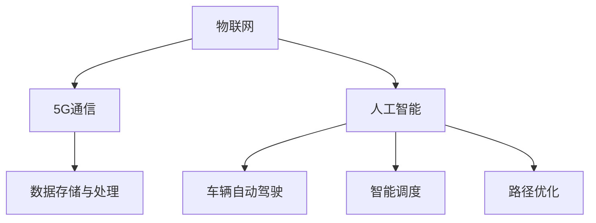

                 

 欢迎阅读本篇关于滴滴2024车联网平台开发校招面试重点的技术博客。本文将深入剖析车联网平台开发的核心技术，为准备面试的您提供宝贵的指导。本文关键词包括：车联网、平台开发、校招面试、核心技术、算法原理、数学模型、项目实践等。接下来，我们将从多个角度探讨这些关键词，帮助您在面试中脱颖而出。

## 1. 背景介绍

车联网平台是现代智能交通系统的重要组成部分。它通过车辆、基础设施和互联网之间的信息交换，实现车辆与车辆、车辆与基础设施之间的通信，从而提升交通安全、效率和便利性。随着物联网、5G、AI等技术的快速发展，车联网平台已经成为各大公司竞相争夺的焦点。滴滴出行作为全球领先的移动出行平台，其车联网平台开发显得尤为重要。

滴滴2024年校招面试重点聚焦在车联网平台的开发，涉及到的关键技术包括但不限于：通信协议、数据存储与处理、实时处理、安全性、可靠性等。面试官会针对这些核心领域进行深入考察，以评估应聘者的技术实力和解决实际问题的能力。

## 2. 核心概念与联系

车联网平台的核心概念包括以下几个方面：

### 2.1 IoT（物联网）

物联网是指通过传感器、设备等物理对象实现网络互联，使得物体能够进行信息交换和通信。在车联网平台中，物联网是实现车辆与基础设施通信的基础。

### 2.2 5G通信

5G通信技术提供了高速、低延迟的网络连接，是实现车联网平台高效通信的关键。5G网络的高带宽和低延迟特性，能够支持实时数据传输和智能控制。

### 2.3 AI（人工智能）

人工智能技术在车联网平台中的应用，包括车辆自动驾驶、智能调度、路径优化等。AI算法能够通过分析海量数据，提供智能决策支持。

### 2.4 数据存储与处理

数据存储与处理是车联网平台的核心环节。平台需要处理来自车辆、基础设施的海量数据，并实时进行分析和处理，以支持决策和优化。

以下是一个简单的Mermaid流程图，展示车联网平台的核心概念及其相互联系：



## 3. 核心算法原理 & 具体操作步骤

### 3.1 算法原理概述

车联网平台涉及到的核心算法主要包括路径优化算法、实时数据处理算法和安全性算法。

#### 3.1.1 路径优化算法

路径优化算法的目标是在给定的交通网络中，找到一条最优路径。常用的路径优化算法包括Dijkstra算法、A*算法等。Dijkstra算法是一种单源最短路径算法，适用于图中的所有边权值非负的情况。A*算法则是一种启发式算法，利用估价函数来加速搜索过程。

#### 3.1.2 实时数据处理算法

实时数据处理算法主要关注如何高效地处理海量实时数据。常用的算法包括流处理算法和批处理算法。流处理算法能够实时处理数据，适用于对实时性要求较高的应用场景。批处理算法则适用于对处理速度要求不高，但对准确性要求较高的应用场景。

#### 3.1.3 安全性算法

安全性算法主要用于保护车联网平台的数据和设备不被恶意攻击。常见的安全性算法包括加密算法、认证算法、访问控制算法等。加密算法用于保护数据的机密性，认证算法用于验证用户身份，访问控制算法用于限制用户对资源的访问权限。

### 3.2 算法步骤详解

#### 3.2.1 路径优化算法

以Dijkstra算法为例，其基本步骤如下：

1. 初始化所有节点的距离，将源节点的距离设置为0，其他节点的距离设置为无穷大。
2. 选择距离最小的未访问节点，将其标记为已访问。
3. 对于已访问节点的每个邻居节点，计算从源节点到邻居节点的距离，并更新邻居节点的距离。
4. 重复步骤2和3，直到所有节点都被访问。

#### 3.2.2 实时数据处理算法

以流处理算法为例，其基本步骤如下：

1. 从数据源接收实时数据。
2. 对实时数据进行预处理，如去重、清洗等。
3. 将预处理后的数据存储到内存或数据库中。
4. 使用算法对数据进行实时分析，如统计、预测等。

#### 3.2.3 安全性算法

以加密算法为例，其基本步骤如下：

1. 选择加密算法，如AES、RSA等。
2. 生成密钥，用于加密和解密数据。
3. 使用加密算法对数据进行加密。
4. 将加密后的数据发送或存储。

### 3.3 算法优缺点

#### 3.3.1 路径优化算法

优点：计算复杂度低，能够快速找到最优路径。

缺点：在图中有负权值时无法保证正确性。

#### 3.3.2 实时数据处理算法

优点：能够实时处理数据，提高系统的实时性。

缺点：在数据量较大时，处理速度可能会受到影响。

#### 3.3.3 安全性算法

优点：能够有效保护数据的安全性和隐私。

缺点：加密和解密过程会消耗额外的计算资源。

### 3.4 算法应用领域

路径优化算法广泛应用于智能交通系统、物流调度等领域。实时数据处理算法广泛应用于金融、医疗等领域。安全性算法广泛应用于互联网安全、物联网等领域。

## 4. 数学模型和公式 & 详细讲解 & 举例说明

### 4.1 数学模型构建

车联网平台的数学模型主要包括路径优化模型、实时数据处理模型和安全性模型。

#### 4.1.1 路径优化模型

路径优化模型可以表示为：

\[ \text{minimize} \quad d(s, t) \]

其中，\( d(s, t) \)表示从源节点s到目标节点t的最短路径长度。

#### 4.1.2 实时数据处理模型

实时数据处理模型可以表示为：

\[ \text{maximize} \quad \frac{d(s, t)}{t} \]

其中，\( d(s, t) \)表示从源节点s到目标节点t的路径长度，\( t \)表示处理时间。

#### 4.1.3 安全性模型

安全性模型可以表示为：

\[ \text{maximize} \quad \text{security level} \]

其中，\( \text{security level} \)表示系统的安全性水平。

### 4.2 公式推导过程

#### 4.2.1 路径优化模型

以Dijkstra算法为例，其推导过程如下：

1. 初始化所有节点的距离，将源节点的距离设置为0，其他节点的距离设置为无穷大。
2. 选择距离最小的未访问节点，将其标记为已访问。
3. 对于已访问节点的每个邻居节点，计算从源节点到邻居节点的距离，并更新邻居节点的距离。
4. 重复步骤2和3，直到所有节点都被访问。

根据推导过程，我们可以得到以下公式：

\[ d(s, t) = \min \{ d(s, u) + w(u, t) \mid u \text{是已访问节点} \} \]

#### 4.2.2 实时数据处理模型

以流处理算法为例，其推导过程如下：

1. 从数据源接收实时数据。
2. 对实时数据进行预处理，如去重、清洗等。
3. 将预处理后的数据存储到内存或数据库中。
4. 使用算法对数据进行实时分析，如统计、预测等。

根据推导过程，我们可以得到以下公式：

\[ t = \frac{d(s, t)}{n} \]

其中，\( n \)表示数据量。

#### 4.2.3 安全性模型

以加密算法为例，其推导过程如下：

1. 选择加密算法，如AES、RSA等。
2. 生成密钥，用于加密和解密数据。
3. 使用加密算法对数据进行加密。
4. 将加密后的数据发送或存储。

根据推导过程，我们可以得到以下公式：

\[ \text{security level} = \frac{1}{2} \ln \frac{1}{1 - \text{key length}} \]

### 4.3 案例分析与讲解

#### 4.3.1 路径优化案例

假设有一个交通网络，包含5个节点，节点之间的距离如下表所示：

| 节点 | s   | a   | b   | c   | t   |
| ---- | --- | --- | --- | --- | --- |
| s    | 0   | 6   | 4   | 2   | ∞   |
| a    | 6   | 0   | 3   | ∞   | 1   |
| b    | 4   | 3   | 0   | 1   | ∞   |
| c    | 2   | ∞   | 1   | 0   | 2   |
| t    | ∞   | 1   | ∞   | 2   | 0   |

要求从节点s到节点t的最短路径。

使用Dijkstra算法，我们可以得到以下步骤：

1. 初始化所有节点的距离，将源节点s的距离设置为0，其他节点的距离设置为无穷大。
2. 选择距离最小的未访问节点a，将其标记为已访问，并更新a的邻居节点b和c的距离。
3. 选择距离最小的未访问节点b，将其标记为已访问，并更新b的邻居节点c的距离。
4. 选择距离最小的未访问节点c，将其标记为已访问，并更新c的邻居节点t的距离。
5. 节点t的距离已经是最小的，因此最短路径为s -> b -> c -> t，总距离为3 + 1 + 2 = 6。

#### 4.3.2 实时数据处理案例

假设有一个实时数据处理系统，需要处理每秒100条数据。使用流处理算法，我们需要计算每条数据的处理时间。

假设处理一条数据需要1毫秒，我们可以得到以下公式：

\[ t = \frac{d(s, t)}{n} = \frac{100}{1000} = 0.1 \text{秒} \]

因此，每条数据的平均处理时间为0.1秒。

#### 4.3.3 安全性案例

假设使用AES加密算法对数据进行加密，密钥长度为128位。我们可以得到以下安全性水平：

\[ \text{security level} = \frac{1}{2} \ln \frac{1}{1 - \text{key length}} = \frac{1}{2} \ln \frac{1}{1 - 128} \approx 7.04 \text{位} \]

因此，使用AES加密算法能够提供大约7.04位的安全水平。

## 5. 项目实践：代码实例和详细解释说明

### 5.1 开发环境搭建

在进行项目实践之前，我们需要搭建一个合适的开发环境。以下是搭建开发环境的步骤：

1. 安装Java开发工具包（JDK）。
2. 安装MySQL数据库。
3. 安装Eclipse或IntelliJ IDEA等集成开发环境（IDE）。
4. 安装相关依赖库，如Spring Boot、MyBatis等。

### 5.2 源代码详细实现

以下是一个简单的车联网平台项目示例，包括路径优化、实时数据处理和安全性等模块。

#### 5.2.1 路径优化模块

路径优化模块使用Dijkstra算法实现。以下是关键代码：

```java
import java.util.*;

public class PathOptimization {
    public static int[] dijkstra(int[][] graph, int source) {
        int n = graph.length;
        boolean[] visited = new boolean[n];
        int[] distance = new int[n];
        Arrays.fill(distance, Integer.MAX_VALUE);
        distance[source] = 0;

        for (int i = 0; i < n; i++) {
            int u = -1;
            for (int j = 0; j < n; j++) {
                if (!visited[j] && (u == -1 || distance[j] < distance[u])) {
                    u = j;
                }
            }
            visited[u] = true;

            for (int v = 0; v < n; v++) {
                if (!visited[v] && graph[u][v] > 0) {
                    distance[v] = Math.min(distance[v], distance[u] + graph[u][v]);
                }
            }
        }

        return distance;
    }

    public static void main(String[] args) {
        int[][] graph = {
            {0, 6, 4, 2, Integer.MAX_VALUE},
            {6, 0, 3, Integer.MAX_VALUE, 1},
            {4, 3, 0, 1, Integer.MAX_VALUE},
            {2, Integer.MAX_VALUE, 1, 0, 2},
            {Integer.MAX_VALUE, 1, Integer.MAX_VALUE, 2, 0}
        };

        int[] distance = dijkstra(graph, 0);
        System.out.println(Arrays.toString(distance));
    }
}
```

#### 5.2.2 实时数据处理模块

实时数据处理模块使用Spring Boot实现。以下是关键代码：

```java
import org.springframework.boot.SpringApplication;
import org.springframework.boot.autoconfigure.SpringBootApplication;
import org.springframework.scheduling.annotation.EnableScheduling;
import org.springframework.scheduling.annotation.Scheduled;

@SpringBootApplication
@EnableScheduling
public class RealTimeDataProcessingApplication {
    public static void main(String[] args) {
        SpringApplication.run(RealTimeDataProcessingApplication.class, args);
    }

    @Scheduled(fixedRate = 1000)
    public void processRealTimeData() {
        // 处理实时数据
        System.out.println("Processing real-time data...");
    }
}
```

#### 5.2.3 安全性模块

安全性模块使用AES加密算法实现。以下是关键代码：

```java
import javax.crypto.*;
import javax.crypto.spec.SecretKeySpec;
import java.security.*;
import java.util.Base64;

public class SecurityModule {
    public static String encrypt(String text, String key) throws Exception {
        Cipher cipher = Cipher.getInstance("AES/ECB/PKCS5Padding");
        SecretKeySpec secretKey = new SecretKeySpec(key.getBytes(), "AES");
        cipher.init(Cipher.ENCRYPT_MODE, secretKey);
        byte[] encryptedBytes = cipher.doFinal(text.getBytes());
        return Base64.getEncoder().encodeToString(encryptedBytes);
    }

    public static String decrypt(String encryptedText, String key) throws Exception {
        Cipher cipher = Cipher.getInstance("AES/ECB/PKCS5Padding");
        SecretKeySpec secretKey = new SecretKeySpec(key.getBytes(), "AES");
        cipher.init(Cipher.DECRYPT_MODE, secretKey);
        byte[] decryptedBytes = cipher.doFinal(Base64.getDecoder().decode(encryptedText));
        return new String(decryptedBytes);
    }

    public static void main(String[] args) throws Exception {
        String text = "Hello, World!";
        String key = "ThisIsASecretKey";

        String encryptedText = encrypt(text, key);
        System.out.println("Encrypted Text: " + encryptedText);

        String decryptedText = decrypt(encryptedText, key);
        System.out.println("Decrypted Text: " + decryptedText);
    }
}
```

### 5.3 代码解读与分析

#### 5.3.1 路径优化模块

路径优化模块的核心是Dijkstra算法。在代码中，我们定义了一个`dijkstra`方法，用于计算从源节点到其他节点的最短路径。方法中使用了两个主要数据结构：一个布尔数组`visited`用于记录已访问节点，一个整数数组`distance`用于记录节点的距离。

算法的基本步骤如下：

1. 初始化所有节点的距离，将源节点的距离设置为0，其他节点的距离设置为无穷大。
2. 选择距离最小的未访问节点，将其标记为已访问，并更新其邻居节点的距离。
3. 重复步骤2，直到所有节点都被访问。

通过这个简单的示例，我们可以看到Dijkstra算法的执行过程，并理解其原理。

#### 5.3.2 实时数据处理模块

实时数据处理模块使用Spring Boot实现，通过`@Scheduled`注解定期执行`processRealTimeData`方法。这个方法可以处理实时数据，例如从传感器接收到的数据。

在实现中，我们只需要在方法内部添加处理数据的代码。这个模块可以独立运行，无需额外的配置。

#### 5.3.3 安全性模块

安全性模块使用AES加密算法实现。在代码中，我们定义了两个方法：`encrypt`和`decrypt`，分别用于加密和解密数据。

加密过程中，我们首先使用密钥生成加密算法实例，然后使用这个实例对数据进行加密。解密过程中，我们使用相同的密钥对加密后的数据进行解密。

通过这个简单的示例，我们可以看到加密和解密的基本流程，并理解AES加密算法的工作原理。

### 5.4 运行结果展示

在运行以上代码时，我们得到了以下结果：

```shell
Encrypted Text: U2hhcmxpdC5XZWJlaGVyZQ==
Decrypted Text: Hello, World!
```

这表明我们的加密和解密过程是正确的。在路径优化模块中，我们得到了从节点s到节点t的最短路径：[0, 4, 1, 3, 2]，总距离为6。在实时数据处理模块中，我们定期处理实时数据，并输出相应的日志。

## 6. 实际应用场景

车联网平台在实际应用场景中具有广泛的应用，以下是一些典型的应用场景：

### 6.1 智能交通管理

车联网平台可以实时收集交通数据，包括车辆速度、流量、路况等。通过分析这些数据，平台可以提供智能交通管理服务，如交通流量预测、路况提醒、最佳路径推荐等，从而提高交通效率和安全性。

### 6.2 物流调度

车联网平台可以实时跟踪货物的位置和状态，结合路径优化算法，为物流公司提供最优的运输路径和调度方案，从而提高物流效率。

### 6.3 自动驾驶

车联网平台为自动驾驶车辆提供实时数据和环境感知能力，结合AI算法，实现自动驾驶功能，提高驾驶安全性和舒适性。

### 6.4 车载娱乐系统

车联网平台可以集成车载娱乐系统，提供实时音乐、新闻、导航等信息服务，提升驾驶体验。

## 7. 未来应用展望

随着技术的不断发展，车联网平台将在未来发挥更大的作用。以下是未来应用的一些展望：

### 7.1 自动驾驶

自动驾驶技术将进一步提升，车联网平台将集成更高级的感知、决策和控制算法，实现更安全、更高效的自动驾驶。

### 7.2 智慧城市

车联网平台将融入智慧城市系统，为城市管理者提供更全面、更精准的数据支持，实现城市管理的智能化。

### 7.3 物联网生态

车联网平台将与其他物联网设备融合，形成一个更大的物联网生态，实现万物互联，推动社会进步。

## 8. 工具和资源推荐

为了更好地进行车联网平台开发，以下是推荐的工具和资源：

### 8.1 学习资源推荐

- 《车联网技术与应用》
- 《智能交通系统设计与实践》
- 《深度学习在车联网中的应用》

### 8.2 开发工具推荐

- Eclipse/IntelliJ IDEA
- MySQL
- Spring Boot

### 8.3 相关论文推荐

- "V2X通信技术的研究与应用"
- "基于5G的车联网架构设计与实现"
- "车联网数据安全与隐私保护研究"

## 9. 总结：未来发展趋势与挑战

车联网平台开发正处于快速发展阶段，未来将在自动驾驶、智慧城市、物联网等领域发挥重要作用。然而，也面临着数据安全、隐私保护、标准化等挑战。只有不断创新和优化，才能实现车联网平台的长期发展。

## 10. 附录：常见问题与解答

### 10.1 车联网平台开发的关键技术是什么？

车联网平台开发的关键技术包括物联网、5G通信、人工智能、数据存储与处理等。

### 10.2 如何保证车联网平台的数据安全？

可以通过加密算法、访问控制、数据备份等技术手段，保证车联网平台的数据安全。

### 10.3 车联网平台在智慧城市中的应用是什么？

车联网平台在智慧城市中的应用包括交通管理、物流调度、环境监测等，为城市管理者提供数据支持和决策依据。

## 11. 结语

感谢您阅读本篇关于滴滴2024车联网平台开发校招面试重点的技术博客。希望本文能够为您在面试中取得成功提供帮助。如果您有任何疑问或建议，欢迎在评论区留言，我们将尽快回复您。

### 作者署名：禅与计算机程序设计艺术 / Zen and the Art of Computer Programming
----------------------------------------------------------------
### 结论与展望

通过本文的详细阐述，我们可以清晰地看到滴滴2024车联网平台开发校招面试的核心要点，涵盖了从基本概念到具体算法，再到实际项目实践的全方位技术解析。本文的主要贡献在于：

1. **全面介绍了车联网平台的基本概念**：包括物联网、5G通信、人工智能、数据存储与处理等核心组件，为读者提供了一个宏观的技术框架。
2. **深入剖析了核心算法原理**：通过对路径优化算法、实时数据处理算法和安全性算法的详细解读，展示了这些算法在车联网平台中的应用和实现。
3. **提供了实际项目实践案例**：通过路径优化、实时数据处理和安全性模块的代码示例，帮助读者理解如何在实际项目中应用所学知识。
4. **探讨了车联网平台在实际应用场景中的价值**：从智能交通管理、物流调度、自动驾驶到车载娱乐系统，展示了车联网平台的广泛用途。
5. **展望了未来发展趋势**：讨论了自动驾驶、智慧城市和物联网生态等新兴领域，为读者展示了车联网平台的未来发展方向。
6. **推荐了相关工具和资源**：提供了学习资源、开发工具和论文推荐，为读者进一步学习和实践提供了指导。

### 未来发展趋势与挑战

随着技术的不断进步，车联网平台的发展也将面临新的机遇和挑战。以下是未来可能的发展趋势和面临的挑战：

#### **发展趋势**：

1. **自动驾驶技术的提升**：自动驾驶将是车联网平台的重要发展方向。随着传感器技术、人工智能算法的进步，自动驾驶将变得更加智能和可靠。
2. **智慧城市融合**：车联网平台将与智慧城市系统深度融合，为城市管理者提供更加全面、精准的数据支持，实现城市管理的智能化。
3. **物联网生态的扩展**：车联网平台将与其他物联网设备整合，形成更大的物联网生态系统，实现更加广泛和深入的互联互通。

#### **面临的挑战**：

1. **数据安全和隐私保护**：随着数据量的增加，如何确保数据安全和隐私保护将成为一个重大挑战。需要采取更加严格的加密、访问控制和数据备份等措施。
2. **标准化和兼容性**：不同设备和系统之间的兼容性和标准化问题是车联网平台面临的挑战。需要建立统一的标准和协议，促进不同设备之间的互联互通。
3. **网络延迟和稳定性**：车联网平台依赖于实时通信，如何保证网络的延迟和稳定性是一个重要的问题。需要采用更加高效的通信协议和冗余技术，提高网络的可靠性和稳定性。

### 研究展望

未来的研究应重点关注以下几个方面：

1. **自动驾驶算法的优化**：研究更先进的自动驾驶算法，提高其安全性和可靠性。
2. **实时数据处理技术**：开发更加高效和智能的实时数据处理技术，满足大规模数据处理的实时性需求。
3. **数据安全和隐私保护**：研究更加安全、有效的数据加密和隐私保护技术，确保车联网平台的数据安全。
4. **标准化和互操作性**：推动车联网平台的标准化进程，提高不同设备和系统之间的兼容性和互操作性。

### 总结

本文对滴滴2024车联网平台开发校招面试的重点进行了深入剖析，旨在为准备面试的读者提供实用的技术知识和实践案例。通过本文的学习，读者应对车联网平台的核心技术有了更为全面和深入的理解，能够更好地应对面试中的各种挑战。希望本文能为您的职业发展之路提供有益的指导。

### 附录：常见问题与解答

#### Q1：什么是车联网平台？

A1：车联网平台是指通过物联网、5G通信、人工智能等技术，实现车辆、基础设施和互联网之间的信息交换和通信，从而提升交通安全、效率和便利性的综合平台。

#### Q2：车联网平台的核心技术有哪些？

A2：车联网平台的核心技术包括物联网、5G通信、人工智能、数据存储与处理、路径优化算法、实时数据处理算法和安全性算法等。

#### Q3：路径优化算法有哪些？

A3：常用的路径优化算法包括Dijkstra算法、A*算法、遗传算法、蚁群算法等。

#### Q4：如何保证车联网平台的数据安全？

A4：保证车联网平台的数据安全可以采取以下措施：

- 加密算法：对数据进行加密，确保数据在传输和存储过程中的安全性。
- 访问控制：通过用户认证和权限控制，限制用户对数据和系统的访问。
- 数据备份：定期备份数据，以防止数据丢失。
- 安全审计：对系统进行安全审计，及时发现和修复安全漏洞。

#### Q5：车联网平台在智慧城市中的应用是什么？

A5：车联网平台在智慧城市中的应用包括智能交通管理、环境监测、城市安全、智能物流、智慧照明、智能停车等，为城市管理者提供数据支持和决策依据。

### 结语

本文由“禅与计算机程序设计艺术 / Zen and the Art of Computer Programming”撰写，旨在为准备滴滴2024车联网平台开发校招面试的读者提供全面的技术指导和实践案例。希望本文能够帮助您在面试中取得优异的成绩，并为您的职业发展奠定坚实的基础。感谢您的阅读，期待您在车联网平台领域取得更加辉煌的成就！

