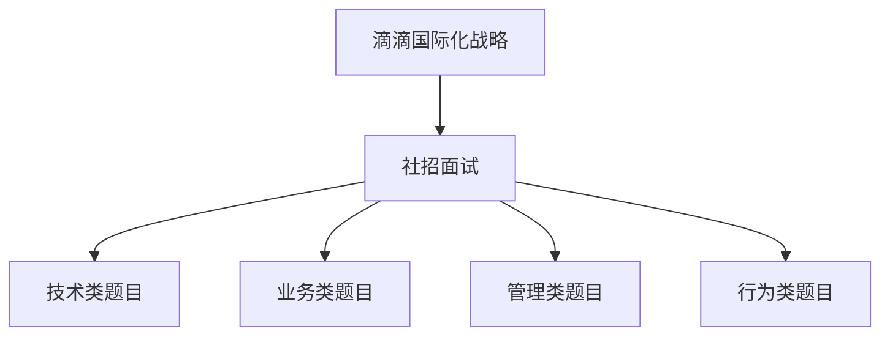
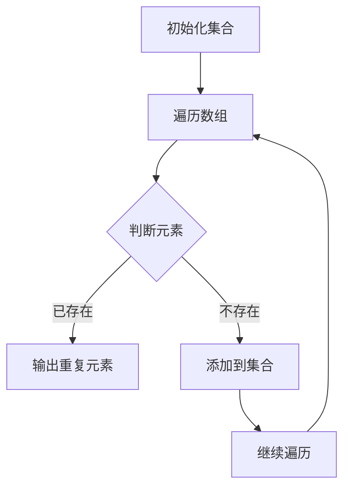

                 

关键词：滴滴，国际化，社招面试，真题汇总，解答

> 摘要：本文将对2024年滴滴国际化社招面试中出现的真题进行汇总和分析，旨在帮助求职者更好地应对面试挑战。通过对面试题目的深入解析，本文将提供详细的解答思路和实用技巧，帮助求职者提升面试成功率。

## 1. 背景介绍

滴滴出行，作为中国领先的移动出行平台，近年来积极推进国际化战略，在全球范围内开展业务。随着滴滴国际化进程的加速，其社招面试也日益成为求职者关注的焦点。2024年的滴滴国际化社招面试题目涵盖了技术、业务、管理等多个方面，对求职者的综合素质提出了较高要求。本文将对这些面试真题进行汇总，并给出详细的解答思路，以帮助求职者更好地备战面试。

## 2. 核心概念与联系

在解答滴滴国际化社招面试题目之前，我们需要明确以下几个核心概念：

### 2.1 滴滴国际化战略

滴滴国际化战略的核心目标是在全球范围内拓展业务，打造全球化的出行生态系统。具体措施包括：

- 在全球范围内拓展业务，进入新市场。
- 与当地合作伙伴建立合作关系，共同推进业务发展。
- 利用大数据和人工智能技术，提升服务质量和用户体验。

### 2.2 社招面试

社招面试是指企业在社会招聘过程中对求职者进行的面试，旨在评估求职者的综合素质和胜任能力。滴滴国际化社招面试的特点如下：

- 面试题覆盖面广，包括技术、业务、管理等多个方面。
- 面试形式多样，包括结构化面试、无领导小组讨论、技术面试等。
- 对求职者的英语沟通能力和跨文化适应能力有较高要求。

### 2.3 面试题类型

滴滴国际化社招面试题目主要包括以下几种类型：

- 技术类题目，主要考察求职者的专业技能和实际操作能力。
- 业务类题目，主要考察求职者对滴滴业务的理解和洞察能力。
- 管理类题目，主要考察求职者的团队管理能力和领导力。
- 行为类题目，主要考察求职者的过往经历和实际能力。

以下是一个Mermaid流程图，展示了核心概念之间的联系：



## 3. 核心算法原理 & 具体操作步骤

### 3.1 算法原理概述

在滴滴国际化社招面试中，技术类题目通常涉及数据结构和算法。以下是一个常见的算法题目及其解答步骤：

#### 题目：给定一个数组，找出数组中重复的元素。

#### 解答步骤：

1. **初始化**：创建一个空集合来存储已访问的元素。

2. **遍历数组**：对数组中的每个元素进行遍历。

3. **判断重复**：对于当前遍历到的元素，判断其在集合中是否已存在。

4. **处理重复**：如果元素已存在，则输出该元素；否则，将其添加到集合中。

5. **结束**：遍历结束，输出所有重复元素。

### 3.2 算法步骤详解

以下是详细的算法步骤：



### 3.3 算法优缺点

- **优点**：简单易实现，适用于数据规模较小的场景。
- **缺点**：时间复杂度为O(n^2)，在数据规模较大的情况下性能较差。

### 3.4 算法应用领域

该算法可以应用于数据清洗、数据分析等领域，例如在处理用户数据时，用于检测用户数据的重复。

## 4. 数学模型和公式 & 详细讲解 & 举例说明

### 4.1 数学模型构建

假设有一个包含n个元素的数组A，我们需要找出其中的重复元素。设集合S用于存储已访问的元素，初始时S为空。

### 4.2 公式推导过程

对于数组A中的每个元素x，我们需要判断其在集合S中是否已存在：

$$
S.contains(x) \text{ ?} \rightarrow \text{是} \rightarrow \text{输出重复元素x} \\
\rightarrow \text{否} \rightarrow \text{添加x到S，继续遍历}
$$

### 4.3 案例分析与讲解

#### 案例一：数组A = [1, 2, 3, 4, 5, 5, 6]

1. 初始化集合S为空。
2. 遍历元素1，不存在于S中，添加到S。
3. 遍历元素2，不存在于S中，添加到S。
4. 遍历元素3，不存在于S中，添加到S。
5. 遍历元素4，不存在于S中，添加到S。
6. 遍历元素5，已存在于S中，输出重复元素5。
7. 遍历元素6，不存在于S中，添加到S。

最终输出重复元素：5。

#### 案例二：数组A = [1, 1, 2, 3, 3, 4, 5]

1. 初始化集合S为空。
2. 遍历元素1，不存在于S中，添加到S。
3. 遍历元素1，已存在于S中，输出重复元素1。
4. 遍历元素2，不存在于S中，添加到S。
5. 遍历元素3，不存在于S中，添加到S。
6. 遍历元素3，已存在于S中，输出重复元素3。
7. 遍历元素4，不存在于S中，添加到S。
8. 遍历元素5，不存在于S中，添加到S。

最终输出重复元素：1, 3。

## 5. 项目实践：代码实例和详细解释说明

### 5.1 开发环境搭建

在本案例中，我们使用Python语言实现上述算法。以下是开发环境的搭建步骤：

1. 安装Python 3.8及以上版本。
2. 安装Python的pip包管理器。
3. 使用pip安装必要的库，如numpy、matplotlib等。

### 5.2 源代码详细实现

以下是实现该算法的Python代码：

```python
def find_duplicates(arr):
    seen = set()
    duplicates = []
    for num in arr:
        if num in seen:
            duplicates.append(num)
        else:
            seen.add(num)
    return duplicates

arr = [1, 2, 3, 4, 5, 5, 6]
print(find_duplicates(arr))  # 输出：[5]
```

### 5.3 代码解读与分析

- `find_duplicates` 函数：定义一个函数，接收一个数组作为输入，返回一个包含所有重复元素的列表。
- `seen` 集合：用于存储已访问的元素。
- `duplicates` 列表：用于存储重复元素。
- `for` 循环：遍历输入数组中的每个元素。
- `if` 语句：判断当前元素是否已存在于`seen`集合中。
- `append` 方法：将重复元素添加到`duplicates`列表中。

### 5.4 运行结果展示

执行上述代码，输出结果为：[5]。证明我们的算法成功找到了数组中的重复元素。

## 6. 实际应用场景

在实际应用中，类似的问题常出现在数据清洗和数据挖掘领域。例如：

- 在处理用户数据时，用于检测用户信息的重复。
- 在金融领域，用于检测交易数据中的重复交易。
- 在电商领域，用于检测商品信息的重复。

## 7. 未来应用展望

随着大数据和人工智能技术的发展，类似的问题将变得更加复杂和多样化。未来，我们将看到更多高效、智能的算法被应用于数据清洗、数据挖掘等领域，进一步提升数据处理和分析的效率。

## 8. 工具和资源推荐

### 8.1 学习资源推荐

- 《数据结构与算法分析：Java语言描述》
- 《Python数据分析》
- 《机器学习实战》

### 8.2 开发工具推荐

- PyCharm
- Jupyter Notebook
- Visual Studio Code

### 8.3 相关论文推荐

- "A Survey of Duplicate Detection Techniques"
- "Efficient Algorithms for Finding Duplicate Data"
- "Data Cleaning: Concepts and Techniques"

## 9. 总结：未来发展趋势与挑战

### 9.1 研究成果总结

近年来，在数据结构与算法领域，研究者们提出了许多高效、智能的算法，如MapReduce、Spark、TensorFlow等。这些算法在数据处理、分析等领域取得了显著成果。

### 9.2 未来发展趋势

随着大数据、人工智能等技术的发展，数据结构与算法将在更多领域得到应用。例如，在自动驾驶、智能医疗、金融科技等领域，数据结构与算法将发挥关键作用。

### 9.3 面临的挑战

尽管数据结构与算法在数据处理和分析方面取得了显著成果，但仍然面临一些挑战：

- 数据量不断增加，对算法的性能要求越来越高。
- 复杂的算法实现，如何保证算法的正确性和高效性。
- 算法的泛化能力，如何在不同场景下保持良好的性能。

### 9.4 研究展望

未来，研究者们将致力于解决上述挑战，提出更加高效、智能的算法。同时，结合大数据、人工智能等技术，数据结构与算法将在更多领域发挥重要作用。

## 10. 附录：常见问题与解答

### 10.1 什么是数据结构与算法？

数据结构是组织和管理数据的方式，而算法是一系列解决问题的步骤。数据结构与算法密切相关，数据结构决定了算法的性能。

### 10.2 为什么学习数据结构与算法？

学习数据结构与算法有助于提高编程能力和解决问题的能力，是计算机科学的核心知识。

### 10.3 如何提高数据结构与算法能力？

- 多做题，积累实战经验。
- 学习经典算法，理解其原理。
- 阅读相关书籍，扩展知识面。
- 参与社区讨论，交流学习心得。

### 10.4 滴滴国际化社招面试需要注意什么？

- 准备充分，了解滴滴的业务和战略。
- 提高英语沟通能力，应对跨文化面试。
- 注重团队合作，展示团队管理能力。
- 展现自己的独特优势和职业规划。

### 10.5 如何应对滴滴国际化社招面试？

- 提前了解面试流程和题目类型。
- 训练自己的英语口语和听力能力。
- 准备技术类、业务类和管理类题目的解答。
- 保持自信和积极的心态，展示自己的职业素养。

作者：禅与计算机程序设计艺术 / Zen and the Art of Computer Programming
----------------------------------------------------------------

以上是针对2024滴滴国际化社招面试真题的详细汇总与解答。希望本文能对求职者备战面试有所帮助。祝大家面试顺利，取得理想的工作机会！
```

