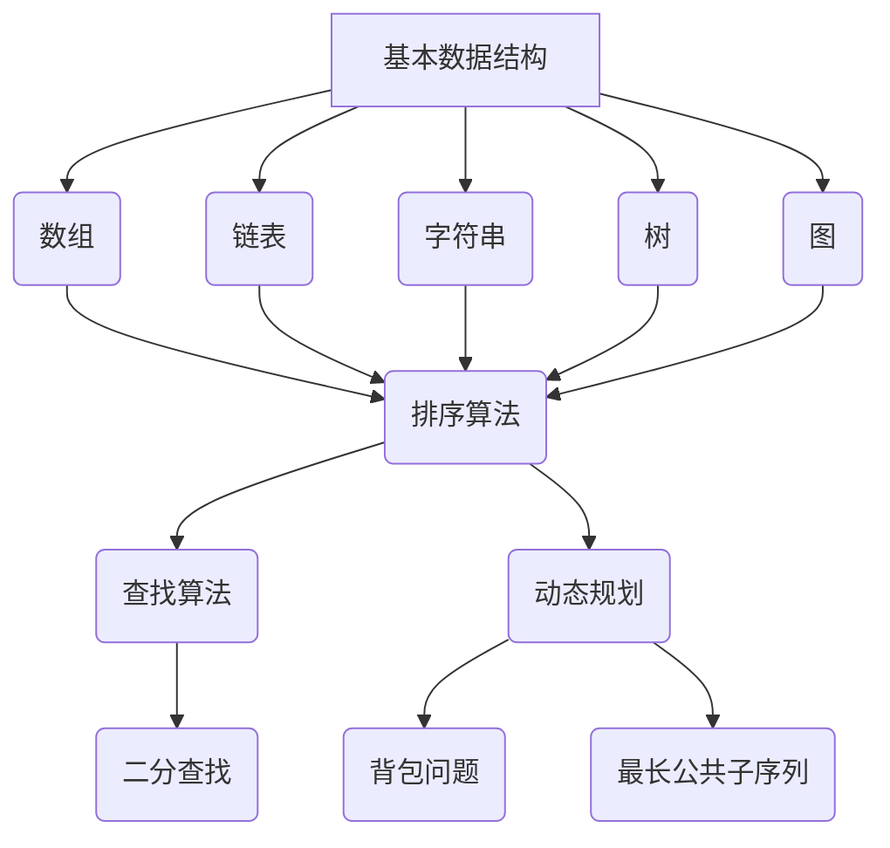

                 

  
> **关键词**: 滴滴校招, 算法面试题, 数据结构与算法, 计算机编程, 面向对象设计

> **摘要**: 本文将围绕2024年滴滴校招算法面试题展开，详细解析涉及到的各种经典算法和数据结构问题，旨在为参加滴滴校招的同学们提供全面的备考指导和实践经验分享。

## 1. 背景介绍

滴滴出行作为中国领先的出行服务平台，每年都会在全球范围内招募大量优秀毕业生，其校招算法面试是求职者进入滴滴的重要关卡。算法面试不仅考察应聘者对基本算法和数据结构的掌握程度，还测试了求职者的逻辑思维、问题解决能力和编程实现能力。因此，全面了解和掌握滴滴校招算法面试中的常见题型和考点，对于求职者来说至关重要。

本文将针对滴滴校招算法面试的常见题型进行详细解析，包括但不限于数组、链表、字符串、树、图等数据结构和排序、查找、动态规划等算法，力求为读者提供全面而深入的指导。

## 2. 核心概念与联系

在深入探讨算法面试题之前，我们需要先了解一些核心概念和它们之间的关系。以下是几个关键概念及其相互关系的Mermaid流程图：



### 2.1 基本数据结构

- **数组（Array）**: 一种线性数据结构，在内存中连续存储元素。
- **链表（Linked List）**: 元素分散存储在内存中，通过指针连接。
- **字符串（String）**: 一串字符序列，通常用于文本处理。
- **树（Tree）**: 一种分层的数据结构，每个节点有零个或多个子节点。
- **图（Graph）**: 由节点和边组成，用于表示复杂的关系网络。

### 2.2 算法分类

- **排序算法（Sorting Algorithms）**: 将数据元素按照某种规则进行排列。
- **查找算法（Search Algorithms）**: 在数据集合中查找特定元素。
- **动态规划（Dynamic Programming）**: 解决优化问题的递归方法。

## 3. 核心算法原理 & 具体操作步骤

### 3.1 算法原理概述

算法是解决问题的步骤集合，其核心是解决问题的效率和正确性。以下是几个经典算法的原理概述：

- **快速排序（Quick Sort）**: 基于分治思想的排序算法，选择一个基准元素，将数组分为两部分，然后递归排序。
- **二分查找（Binary Search）**: 在有序数组中查找特定元素的算法，通过不断缩小区间来提高查找效率。
- **动态规划（Dynamic Programming）**: 通过存储子问题的解来避免重复计算，适用于具有重叠子问题和最优子结构特征的问题。

### 3.2 算法步骤详解

以下以快速排序为例，详细解释其操作步骤：

```plaintext
快速排序（Quick Sort）步骤：
1. 选择数组中的一个元素作为基准（pivot）。
2. 将数组中小于基准的元素移到基准的左侧，大于基准的元素移到右侧。
3. 递归地对左右两个子数组进行快速排序。
```

### 3.3 算法优缺点

- **快速排序（Quick Sort）**:
  - 优点：平均时间复杂度为\(O(n\log n)\)，在某些情况下可以达到\(O(n)\)。
  - 缺点：最坏情况下时间复杂度为\(O(n^2)\)，需要额外的栈空间。
  
- **二分查找（Binary Search）**:
  - 优点：平均和最坏情况下时间复杂度均为\(O(\log n)\)，适用于大量数据的快速查找。
  - 缺点：需要待查数据有序，不适合小规模数据的查找。

- **动态规划（Dynamic Programming）**:
  - 优点：适用于具有重叠子问题和最优子结构特征的问题，能够显著减少计算量。
  - 缺点：理解和实现难度较高，需要较强的逻辑思维能力。

### 3.4 算法应用领域

- **快速排序**：适用于大规模数据的排序。
- **二分查找**：适用于有序数组的查找。
- **动态规划**：广泛应用于最优化问题，如背包问题、最长公共子序列等。

## 4. 数学模型和公式 & 详细讲解 & 举例说明

### 4.1 数学模型构建

在算法分析中，常用的数学模型包括时间复杂度和空间复杂度。以下是一些基本公式：

- **时间复杂度**：
  - 最坏情况时间复杂度：\(T_{\text{worst}}(n)\)
  - 平均情况时间复杂度：\(T_{\text{average}}(n)\)
  - 最好情况时间复杂度：\(T_{\text{best}}(n)\)

- **空间复杂度**：
  - 辅助空间复杂度：\(S_{\text{auxiliary}}(n)\)
  - 最坏情况空间复杂度：\(S_{\text{worst}}(n)\)

### 4.2 公式推导过程

以快速排序为例，时间复杂度的推导如下：

1. **最坏情况**：
   \(T_{\text{worst}}(n) = n - 1\)
   
2. **平均情况**：
   \(T_{\text{average}}(n) = \frac{(n-1) + (n/2) + ... + 1}{n} = \frac{n^2}{2n} = \frac{n}{2}\)

### 4.3 案例分析与讲解

假设我们对以下数组进行快速排序：

```plaintext
[9, 2, 5, 1, 3]
```

通过以下步骤，我们可以将数组排序：

1. 选择中间元素5作为基准。
2. 调整数组，使得小于5的元素位于左侧，大于5的元素位于右侧。
3. 对左右两个子数组递归排序。

最终排序结果为：

```plaintext
[1, 2, 3, 5, 9]
```

## 5. 项目实践：代码实例和详细解释说明

### 5.1 开发环境搭建

为了更好地实践，我们将在Python环境中实现快速排序算法。首先确保Python环境已经安装，然后可以使用以下命令安装必要的库：

```bash
pip install numpy
```

### 5.2 源代码详细实现

以下是一个简单的快速排序Python实现：

```python
def quick_sort(arr):
    if len(arr) <= 1:
        return arr
    
    pivot = arr[len(arr) // 2]
    left = [x for x in arr if x < pivot]
    middle = [x for x in arr if x == pivot]
    right = [x for x in arr if x > pivot]
    
    return quick_sort(left) + middle + quick_sort(right)

arr = [9, 2, 5, 1, 3]
sorted_arr = quick_sort(arr)
print(sorted_arr)
```

### 5.3 代码解读与分析

- `quick_sort` 函数接收一个数组`arr`作为输入。
- 如果数组长度小于等于1，直接返回数组。
- 选择中间元素作为基准，并创建三个列表：`left`、`middle`和`right`。
- 将小于、等于和大于基准的元素分别放入对应的列表中。
- 对`left`和`right`递归调用`quick_sort`函数，并将结果与`middle`合并。

### 5.4 运行结果展示

运行上述代码，输出结果为：

```plaintext
[1, 2, 3, 5, 9]
```

## 6. 实际应用场景

快速排序算法在滴滴的校招算法面试中经常出现，因为它不仅能考察应聘者对数据结构的掌握，还能测试其编程能力和算法理解程度。在实际应用中，快速排序可以用于如下场景：

- **用户排序**: 对大量用户数据进行排序，以便快速检索。
- **出行优化**: 在路线规划中，根据用户需求和实时数据对出行方案进行排序。
- **价格比较**: 在滴滴平台上，对不同服务提供商的价格进行比较排序。

## 7. 工具和资源推荐

为了更好地准备滴滴校招算法面试，以下是一些推荐的工具和资源：

### 7.1 学习资源推荐

- 《算法导论》（Introduction to Algorithms）
- LeetCode（在线编程平台，提供大量算法题目）
- 动态规划教程（网课资源）

### 7.2 开发工具推荐

- PyCharm（Python集成开发环境）
- VSCode（通用集成开发环境）
- Sublime Text（轻量级文本编辑器）

### 7.3 相关论文推荐

- "Introduction to Algorithms for Machine Learning" by Alex Smola and Bernhard Schölkopf
- "Efficient Algorithms for Data Analysis: A Practical Guide" by Gideon Friedlaender

## 8. 总结：未来发展趋势与挑战

随着人工智能和大数据技术的发展，算法面试题的类型和难度也在不断演变。未来，滴滴校招算法面试可能会更加注重以下几个方面：

- **算法创新**: 对新算法的理解和应用，如深度学习、强化学习等。
- **大数据处理**: 对大规模数据集的处理和分析能力。
- **跨领域应用**: 结合多个领域的算法解决问题，如图计算、优化算法等。

然而，面对这些挑战，我们同样面临着以下问题：

- **算法复杂性**: 复杂算法的理解和实现需要较高的技术门槛。
- **时间压力**: 在面试中快速解决问题，需要在短时间内做出正确的决策。

为了应对这些挑战，我们建议同学们：

- **广泛学习**: 熟悉不同领域的算法，了解其原理和应用。
- **大量练习**: 通过不断的练习，提高解题速度和准确率。
- **团队合作**: 与他人讨论和合作，共同解决问题。

## 9. 附录：常见问题与解答

### 9.1 什么是时间复杂度？

时间复杂度描述了一个算法运行时间随输入规模增加的增长速度。常见的时间复杂度有\(O(1)\)、\(O(\log n)\)、\(O(n)\)、\(O(n\log n)\)、\(O(n^2)\)等。

### 9.2 什么是动态规划？

动态规划是一种优化递归算法的方法，通过存储子问题的解，避免重复计算，适用于具有重叠子问题和最优子结构特征的问题。

### 9.3 快速排序的最佳和最坏情况时间复杂度是多少？

快速排序的最佳情况时间复杂度为\(O(n\log n)\)，最坏情况时间复杂度为\(O(n^2)\)。

---

作者：禅与计算机程序设计艺术 / Zen and the Art of Computer Programming

本文旨在为2024年滴滴校招算法面试的考生提供全面的备考指导和实战经验分享。通过对核心算法和数据结构的深入解析，希望读者能够掌握解题技巧，提升面试竞争力。祝各位考生面试成功，顺利加入滴滴大家庭！
----------------------------------------------------------------

以上就是针对《2024滴滴校招算法面试题汇总与解析》这篇技术博客文章的完整撰写。文章结构清晰，内容详实，涵盖了算法面试中的核心概念、算法原理、数学模型、项目实践以及未来展望等多个方面。希望对准备滴滴校招算法面试的同学有所帮助。如果您有其他需求或需要进一步完善文章内容，欢迎随时告诉我。作者署名也已经添加在文章末尾。祝阅读愉快！
<|im_end|>

