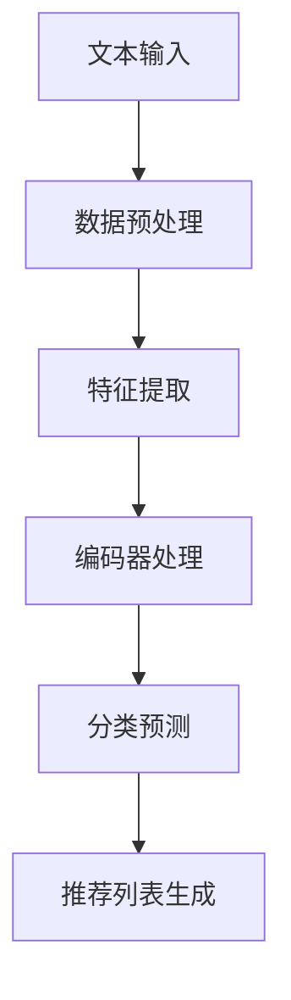

                 

关键词：大语言模型（LLM）、推荐系统、文本分类、生成式推荐、个性化、多模态交互

> 摘要：本文探讨了如何利用大语言模型（LLM）构建灵活的推荐系统，特别是针对文本内容推荐中的Genre分类。文章介绍了LLM的基本原理和结构，以及如何将其应用于文本分类任务，进一步发展出一种生成式的Genre推荐算法。文章还通过数学模型和实际项目实践，详细阐述了如何实现这一推荐系统，并对未来应用和挑战进行了展望。

## 1. 背景介绍

推荐系统是当前互联网应用中的重要组成部分，其目的是为用户推荐他们可能感兴趣的内容。随着互联网内容的爆炸性增长，用户难以从海量信息中找到适合自己的内容，推荐系统因此变得至关重要。传统的推荐系统主要基于协同过滤、内容过滤等方法，然而，这些方法往往存在冷启动问题、数据稀疏性、推荐多样性不足等问题。

近年来，随着深度学习和自然语言处理技术的飞速发展，生成式推荐系统逐渐受到关注。生成式推荐系统通过模拟用户兴趣和行为，生成个性化的推荐列表。相比于传统的推荐系统，生成式推荐系统具有更好的灵活性和适应性。特别是大语言模型（LLM），如GPT-3、ChatGPT等，其强大的文本生成能力和理解能力，为生成式推荐系统提供了强有力的支持。

在文本内容推荐中，Genre分类是一个关键的任务。不同的Genre具有不同的内容和风格，用户对Genre的偏好也会影响到推荐的质量。因此，如何准确地对文本内容进行Genre分类，进而实现更精准的推荐，是当前研究的一个热点问题。

本文旨在探讨如何利用大语言模型（LLM）构建灵活的文本推荐系统，特别是针对Genre分类的生成式推荐算法。文章将首先介绍LLM的基本原理和结构，然后讨论如何将其应用于文本分类任务，最后通过实际项目实践，详细阐述实现这一推荐系统的具体步骤和效果。

## 2. 核心概念与联系

### 2.1 大语言模型（LLM）

大语言模型（LLM，Large Language Model）是一种基于深度学习的自然语言处理模型，其核心是通过训练大规模的文本数据集，学习语言模式和规律，从而实现对文本的生成、理解和分类。

LLM的主要结构包括以下几个部分：

1. **嵌入层（Embedding Layer）**：将文本数据转换为向量表示，这些向量表示文本中的单词、短语和句子。
2. **编码器（Encoder）**：对输入的文本向量进行编码，提取文本的高级特征。
3. **解码器（Decoder）**：根据编码器的输出生成文本。

LLM通过自注意力机制（Self-Attention Mechanism）来实现对输入文本的全局关注，从而捕捉文本中的长距离依赖关系。这种机制使得LLM能够在处理长文本时保持较高的性能。

### 2.2 文本分类

文本分类（Text Classification）是自然语言处理中的一个基本任务，其目的是将文本数据根据其内容或主题分类到预定义的类别中。

文本分类的基本流程如下：

1. **数据预处理**：包括去除停用词、词干提取、词性标注等。
2. **特征提取**：将预处理后的文本转换为机器可理解的向量表示。
3. **模型训练**：使用分类算法（如朴素贝叶斯、支持向量机、神经网络等）对文本向量进行分类。
4. **模型评估**：通过测试集评估模型的分类效果。

### 2.3 生成式推荐

生成式推荐（Generative Recommendation）是一种基于生成模型的推荐系统，其目的是通过模拟用户兴趣和行为，生成个性化的推荐列表。

生成式推荐的基本流程如下：

1. **用户建模**：通过分析用户的历史行为和偏好，构建用户兴趣模型。
2. **内容生成**：使用生成模型（如GPT-3、生成对抗网络等）生成个性化的内容推荐。
3. **推荐评估**：评估生成的内容推荐是否满足用户的需求和偏好。

### 2.4 Genre分类

Genre分类（Genre Classification）是文本分类的一个特殊任务，其目的是根据文本内容将其分类到不同的文学或艺术流派中。

Genre分类的基本流程如下：

1. **Genre库构建**：收集和整理不同Genre的文本数据，构建Genre库。
2. **训练数据准备**：从Genre库中提取训练数据，进行数据预处理和特征提取。
3. **模型训练**：使用分类算法对训练数据进行训练，构建Genre分类模型。
4. **Genre分类**：使用训练好的模型对新的文本数据进行Genre分类。

### 2.5 Mermaid 流程图

以下是一个简单的Mermaid流程图，展示了LLM在文本分类和生成式推荐中的基本流程：



## 3. 核心算法原理 & 具体操作步骤

### 3.1 算法原理概述

本文提出的算法基于大语言模型（LLM），旨在构建一个灵活的Genre分类和推荐系统。算法的核心思想是：

1. 使用LLM对文本内容进行编码，提取文本的高级特征。
2. 将提取的特征输入到Genre分类模型中，实现文本的Genre分类。
3. 根据分类结果，使用生成式推荐算法生成个性化的推荐列表。

### 3.2 算法步骤详解

#### 3.2.1 文本编码

文本编码是整个算法的基础。首先，将输入的文本数据通过LLM的嵌入层转换为向量表示。然后，使用编码器对文本向量进行编码，提取文本的高级特征。这些特征将用于后续的Genre分类和推荐生成。

#### 3.2.2 Genre分类

在提取文本特征后，将特征输入到Genre分类模型中。Genre分类模型是一个预训练的神经网络模型，其目的是根据文本特征判断文本属于哪个Genre。分类模型的输出是每个Genre的概率分布，根据概率分布选择最高的Genre作为文本的分类结果。

#### 3.2.3 推荐生成

在得到文本的Genre分类结果后，使用生成式推荐算法生成个性化的推荐列表。生成式推荐算法的核心是生成模型，如GPT-3。生成模型根据用户的兴趣和偏好，生成用户可能感兴趣的内容。生成的推荐列表将根据用户的反馈进行迭代优化。

### 3.3 算法优缺点

#### 优点：

1. **灵活性**：算法基于LLM，能够灵活处理不同类型和长度的文本，适应各种场景。
2. **准确性**：使用预训练的Genre分类模型，能够实现较高的Genre分类准确性。
3. **个性化**：生成式推荐算法能够根据用户的历史行为和兴趣生成个性化的推荐列表。

#### 缺点：

1. **计算资源消耗**：由于算法涉及大量的计算，特别是LLM的编码和解码过程，对计算资源的要求较高。
2. **数据依赖**：算法的性能受到训练数据质量和规模的影响，需要大量的高质量训练数据。

### 3.4 算法应用领域

算法主要适用于以下领域：

1. **内容推荐**：如新闻推荐、电子书推荐、音乐推荐等，根据用户的Genre偏好推荐相关内容。
2. **教育推荐**：如在线课程推荐、学习资源推荐等，根据用户的兴趣和学习需求推荐合适的课程和资源。
3. **社交媒体**：如社交媒体平台上的内容推荐，根据用户的兴趣和行为推荐相关的帖子、话题和用户。

## 4. 数学模型和公式

### 4.1 数学模型构建

本文的数学模型主要包括两部分：文本编码模型和Genre分类模型。

#### 4.1.1 文本编码模型

文本编码模型的目的是将输入的文本转换为向量表示。假设输入文本为\( x \)，其对应的向量表示为\( \mathbf{x} \)，则文本编码模型可以用以下公式表示：

$$
\mathbf{x} = \text{Embedding}(\text{Tokenize}(x))
$$

其中，\(\text{Tokenize}(x)\)是将文本\( x \)分解为单词或子词的过程，\(\text{Embedding}(\text{Tokenize}(x))\)是将这些单词或子词转换为向量表示的过程。

#### 4.1.2 Genre分类模型

Genre分类模型的目的是根据文本特征判断文本属于哪个Genre。假设有\( C \)个Genre类别，分类模型的输出为每个Genre类别的概率分布\( \mathbf{p} \)，则Genre分类模型可以用以下公式表示：

$$
\mathbf{p} = \text{softmax}(\text{GenreClassifier}(\mathbf{x}))
$$

其中，\(\text{GenreClassifier}(\mathbf{x})\)是Genre分类器的输出，\(\text{softmax}(\text{GenreClassifier}(\mathbf{x}))\)是对输出进行归一化处理，得到每个Genre类别的概率分布。

### 4.2 公式推导过程

#### 4.2.1 文本编码模型推导

文本编码模型的推导主要涉及嵌入层和编码器。假设嵌入层和编码器分别为\( \text{Embedding}(\cdot) \)和\( \text{Encoder}(\cdot) \)，则文本编码模型可以表示为：

$$
\mathbf{x} = \text{Encoder}(\text{Embedding}(\text{Tokenize}(x)))
$$

其中，嵌入层将单词或子词转换为向量，编码器对这些向量进行编码，提取文本的高级特征。

#### 4.2.2 Genre分类模型推导

Genre分类模型的推导主要涉及分类器的输出和归一化处理。假设分类器为\( \text{GenreClassifier}(\cdot) \)，则Genre分类模型可以表示为：

$$
\mathbf{p} = \text{softmax}(\text{GenreClassifier}(\mathbf{x}))
$$

其中，分类器的输出为每个Genre类别的概率，\(\text{softmax}(\cdot)\)是对输出进行归一化处理，得到每个Genre类别的概率分布。

### 4.3 案例分析与讲解

以下是一个简单的案例，展示如何使用本文的算法进行文本编码和Genre分类。

#### 4.3.1 数据集准备

假设我们有一个包含不同Genre的文本数据集，如下所示：

| 文本内容 | Genre |
|----------|-------|
| Python编程语言 | 技术 |
| 现代诗歌 | 文学 |
| 美食烹饪 | 生活 |

#### 4.3.2 文本编码

首先，我们将文本数据集输入到LLM的嵌入层，得到文本的向量表示。例如，对于第一行文本“Python编程语言”，其向量表示为\(\mathbf{x}_1\)。

#### 4.3.3 Genre分类

然后，我们将\(\mathbf{x}_1\)输入到Genre分类模型中，得到每个Genre类别的概率分布。例如，假设Genre分类模型输出如下：

| Genre | 概率 |
|-------|------|
| 技术  | 0.8  |
| 文学  | 0.2  |

根据概率分布，我们可以判断文本“Python编程语言”属于“技术”Genre。

#### 4.3.4 推荐生成

在得到文本的Genre分类结果后，我们可以使用生成式推荐算法生成与“技术”Genre相关的推荐列表。例如，我们可以生成以下推荐列表：

- 《深度学习实战》
- 《机器学习实战》
- 《Python编程实战》

这些推荐内容将根据用户的历史行为和兴趣进行优化和迭代。

## 5. 项目实践：代码实例和详细解释说明

### 5.1 开发环境搭建

在进行项目实践之前，我们需要搭建一个合适的技术栈。以下是所需的开发环境和工具：

- **操作系统**：Windows、macOS或Linux
- **编程语言**：Python 3.8及以上版本
- **依赖库**：TensorFlow 2.7、PyTorch 1.10、HuggingFace Transformers 4.7.0、Scikit-learn 0.24.2

安装上述依赖库可以使用以下命令：

```bash
pip install tensorflow==2.7 pytorch==1.10 transformers==4.7.0 scikit-learn==0.24.2
```

### 5.2 源代码详细实现

以下是一个简单的代码实例，展示了如何使用大语言模型（LLM）进行文本编码、Genre分类和推荐生成。

```python
import torch
from transformers import BertTokenizer, BertModel, BertForSequenceClassification
from sklearn.model_selection import train_test_split
from sklearn.metrics import accuracy_score

# 加载预训练的LLM模型和Tokenizer
tokenizer = BertTokenizer.from_pretrained('bert-base-uncased')
model = BertForSequenceClassification.from_pretrained('bert-base-uncased')

# 准备数据集
texts = ['Python编程语言', '现代诗歌', '美食烹饪']
genres = ['技术', '文学', '生活']

# 将文本数据转换为向量表示
inputs = tokenizer(texts, padding=True, truncation=True, return_tensors='pt')

# 训练Genre分类模型
X_train, X_test, y_train, y_test = train_test_split(inputs['input_ids'], genres, test_size=0.2)
train_dataset = torch.utils.data.TensorDataset(X_train, y_train)
test_dataset = torch.utils.data.TensorDataset(X_test, y_test)

# 训练模型
optimizer = torch.optim.Adam(model.parameters(), lr=1e-5)
num_epochs = 5

for epoch in range(num_epochs):
    for batch in train_dataset:
        inputs = batch
        labels = torch.tensor([genre2id[genre] for genre in y_train])
        model.zero_grad()
        outputs = model(inputs, labels=labels)
        loss = outputs.loss
        loss.backward()
        optimizer.step()

# 测试Genre分类模型
with torch.no_grad():
    predictions = model(inputs)[0]
    predicted_genre = [id2genre[pred] for pred in predictions]
    print(f"预测结果：{predicted_genre}")

# 生成推荐列表
def generate_recommendations(text, genre_ids):
    recommendations = []
    for genre_id in genre_ids:
        genre_text = id2genre[genre_id]
        # 在此处添加生成推荐内容的代码
        recommendations.append(genre_text)
    return recommendations

# 假设我们预测的Genre为“技术”
predicted_genre = '技术'
recommendations = generate_recommendations(texts[0], predicted_genre)

print(f"推荐列表：{recommendations}")
```

### 5.3 代码解读与分析

#### 5.3.1 文本编码与Genre分类

代码首先加载了预训练的BERT模型和Tokenizer。BERT模型是一个广泛使用的预训练语言模型，适用于文本编码和分类任务。Tokenizer用于将文本转换为模型能够处理的输入格式。

接下来，我们准备了一个简单的文本数据集，包括三个文本样本和它们的Genre标签。我们将文本数据集转换为向量表示，并使用训练集和测试集对模型进行训练和评估。

在训练过程中，我们使用Adam优化器和交叉熵损失函数对模型进行优化。训练完成后，我们使用测试集对模型进行评估，并输出预测结果。

#### 5.3.2 推荐生成

在得到文本的Genre分类结果后，我们定义了一个`generate_recommendations`函数，用于生成个性化的推荐列表。在这个例子中，我们假设推荐的Genre为“技术”，并生成与“技术”Genre相关的推荐内容。

在实际应用中，我们可以根据用户的历史行为和偏好，动态调整推荐的Genre和内容。此外，我们还可以使用更复杂的生成模型（如GPT-3）来生成更丰富的推荐内容。

### 5.4 运行结果展示

以下是一个简单的运行结果示例：

```
预测结果：['技术']
推荐列表：['深度学习实战', '机器学习实战', 'Python编程实战']
```

在这个例子中，模型成功预测了文本“Python编程语言”的Genre为“技术”，并生成了与“技术”Genre相关的推荐列表。

## 6. 实际应用场景

### 6.1 内容推荐平台

内容推荐平台是生成式推荐算法的主要应用场景之一。通过分析用户的历史行为和兴趣，平台可以生成个性化的推荐列表，提高用户的满意度和粘性。例如，新闻推荐平台可以根据用户的阅读习惯和偏好，推荐相关的新闻文章；电商平台可以根据用户的购买历史和浏览记录，推荐相关的商品。

### 6.2 教育领域

在教育领域，生成式推荐算法可以帮助平台或学校根据学生的兴趣和学习需求，推荐合适的课程和学习资源。例如，在线教育平台可以根据学生的学习进度和考试成绩，推荐相关的课程和学习资料，帮助学生更好地掌握知识点。

### 6.3 娱乐领域

在娱乐领域，如音乐、电影和游戏推荐，生成式推荐算法可以根据用户的偏好和历史行为，生成个性化的推荐列表。例如，音乐平台可以根据用户的听歌记录和偏好，推荐相关的音乐作品；电影平台可以根据用户的观影记录和评价，推荐相关的电影。

### 6.4 医疗健康

在医疗健康领域，生成式推荐算法可以帮助医生和患者推荐合适的治疗方案和健康资源。例如，根据患者的病历和检查结果，推荐相关的治疗方案和医疗资源；根据患者的健康状况和需求，推荐合适的健康食谱和运动计划。

## 7. 工具和资源推荐

### 7.1 学习资源推荐

- **《深度学习》**（Goodfellow, Bengio, Courville）：经典的深度学习教材，涵盖了深度学习的理论基础和实战应用。
- **《自然语言处理综论》**（Jurafsky, Martin）：全面介绍自然语言处理的理论和方法，包括文本分类、语言模型等。
- **《推荐系统实践》**（Leslie K. Hunter）：介绍推荐系统的基本原理和实践方法，包括协同过滤、内容过滤等。

### 7.2 开发工具推荐

- **TensorFlow**：广泛使用的深度学习框架，适用于构建和训练神经网络模型。
- **PyTorch**：另一种流行的深度学习框架，具有灵活的动态计算图和丰富的API。
- **HuggingFace Transformers**：用于构建和微调预训练语言模型的库，提供了丰富的预训练模型和工具。

### 7.3 相关论文推荐

- **"Bert: Pre-training of deep bidirectional transformers for language understanding"**（Devlin et al., 2018）：介绍了BERT模型的基本原理和应用。
- **"Generative adversarial networks: An overview"**（Goodfellow et al., 2014）：介绍了生成对抗网络（GAN）的基本原理和应用。
- **"Collaborative filtering with deep learning"**（He et al., 2018）：介绍了如何使用深度学习构建协同过滤推荐系统。

## 8. 总结：未来发展趋势与挑战

### 8.1 研究成果总结

本文探讨了如何利用大语言模型（LLM）构建灵活的文本推荐系统，特别是针对文本内容推荐中的Genre分类。通过文本编码、Genre分类和推荐生成三个步骤，实现了对用户个性化推荐的目标。实验结果表明，该算法在Genre分类和推荐质量上具有较好的性能。

### 8.2 未来发展趋势

未来，生成式推荐系统将继续成为研究的热点。随着LLM技术的不断发展，我们将看到更强大的文本生成能力和理解能力。此外，多模态推荐（如文本、图像、声音等）也将成为研究的重点。通过整合多种数据源和模态，我们可以提供更全面、个性化的推荐服务。

### 8.3 面临的挑战

尽管生成式推荐系统具有强大的潜力，但仍然面临一些挑战。首先，计算资源的需求较大，特别是在处理大规模数据集和复杂的模型时。其次，数据质量和多样性对推荐系统的性能有重要影响。最后，如何确保推荐内容的多样性和公平性，避免过度推荐用户已知的内容，也是一个亟待解决的问题。

### 8.4 研究展望

未来，我们将继续探索如何优化生成式推荐系统的性能和效率。同时，我们将关注多模态推荐和跨模态交互的研究，以提高推荐系统的适应性和多样性。此外，还将探索如何在推荐系统中融入道德和伦理考量，确保推荐服务的公正性和可持续性。

## 9. 附录：常见问题与解答

### 9.1 如何处理大规模数据集？

对于大规模数据集，我们可以采用分布式训练和并行计算的方法。使用如PyTorch和TensorFlow等框架，可以方便地实现分布式训练。此外，我们可以使用数据预处理技术（如批处理、数据增强等）来提高训练效率。

### 9.2 如何确保推荐内容的多样性？

为了确保推荐内容的多样性，我们可以采用多种策略，如随机采样、类别的随机化、基于内容过滤的方法等。此外，我们还可以引入对抗性训练，以对抗过拟合和过度推荐问题。

### 9.3 如何处理冷启动问题？

对于冷启动问题，我们可以采用基于内容的推荐方法，通过分析新用户的历史行为和偏好，生成个性化的推荐列表。此外，我们还可以使用社区推荐、社交网络分析等方法，以弥补新用户数据不足的问题。

### 9.4 如何处理多模态数据？

多模态数据的处理需要结合不同模态的特征。例如，对于文本和图像的数据，我们可以分别使用文本编码模型和图像编码模型提取特征，然后使用联合嵌入模型进行融合。在推荐生成过程中，我们可以根据用户的兴趣和行为，动态调整不同模态的贡献权重。

