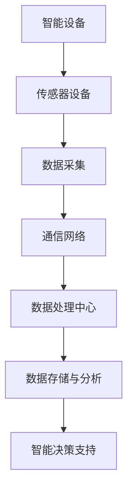

                 

关键词：物联网，IoT，传感器设备，系统集成，数据处理，通信协议，网络架构，智能设备，云计算，边缘计算

> 摘要：本文深入探讨了物联网（IoT）技术和各种传感器设备的集成，强调了物联网系统集成在当今智能设备环境中的重要性。文章详细介绍了物联网的基本概念、传感器设备的工作原理、系统集成的方法和挑战，以及未来发展趋势。通过理论和实践的结合，本文旨在为读者提供对物联网技术的全面理解。

## 1. 背景介绍

物联网（Internet of Things，IoT）是指将日常物品通过互联网连接起来，使其能够相互通信并收集、交换和利用数据的网络。物联网技术已成为现代社会的重要组成部分，其应用范围涵盖了智能家居、智慧城市、工业自动化、医疗健康等多个领域。根据市场研究公司的数据，全球物联网设备数量预计将在未来几年内大幅增长，这为物联网系统集成带来了巨大的挑战和机遇。

物联网系统的核心组件是各种传感器设备。这些设备可以感知周围环境，如温度、湿度、光线、运动等，并将这些信息通过通信网络传输到云端或其他数据处理中心。传感器设备的多样性和复杂性使得物联网系统集成成为一项复杂的任务。因此，本文将重点关注物联网技术和各种传感器设备的集成，探讨其背后的核心概念和实现方法。

## 2. 核心概念与联系

### 2.1 物联网的基本概念

物联网是由智能设备、传感器、网络和云计算平台组成的一个生态系统。智能设备是物联网系统的核心，它们通过嵌入的传感器和通信模块来感知和交互环境。传感器设备则负责收集各种物理量的数据，如温度、湿度、压力等。这些数据通过通信网络（如Wi-Fi、蓝牙、ZigBee等）传输到云端或其他数据处理中心。在云端，这些数据可以被存储、分析和处理，以便提供智能化的决策支持。

### 2.2 传感器设备的工作原理

传感器设备的工作原理基于物理现象和化学反应。例如，温度传感器通过电阻值的变化来检测温度，而湿度传感器则利用电容的变化来检测环境湿度。运动传感器则通过检测物体的位置变化来识别运动。这些传感器通常需要稳定的电源和精确的校准，以保证数据的准确性和可靠性。

### 2.3 系统集成方法

物联网系统集成主要包括硬件集成、软件集成和网络集成。硬件集成是指将各种传感器设备连接到智能设备上，并确保这些设备能够正常运行。软件集成则是指开发适用于物联网系统的应用程序和数据处理算法。网络集成则是确保传感器数据和智能设备之间的可靠通信。

### 2.4 Mermaid 流程图

以下是物联网系统集成的 Mermaid 流程图，展示了智能设备、传感器设备和云端之间的交互过程。



## 3. 核心算法原理 & 具体操作步骤

### 3.1 算法原理概述

物联网系统中的核心算法通常包括数据采集、数据传输、数据存储、数据分析等。这些算法的核心目标是确保传感器数据的准确性和实时性，以及提供有效的数据处理和分析方法。

### 3.2 算法步骤详解

1. **数据采集**：传感器设备定期采集环境数据，如温度、湿度、光线等。
2. **数据预处理**：在数据传输之前，对数据进行清洗和预处理，以去除噪声和异常值。
3. **数据传输**：将预处理后的数据通过通信网络传输到云端或其他数据处理中心。
4. **数据存储**：在云端或边缘设备中存储数据，以便后续分析和处理。
5. **数据分析**：使用统计模型、机器学习算法等对数据进行分析，提取有价值的信息。
6. **智能决策**：根据分析结果，提供智能化的决策支持。

### 3.3 算法优缺点

**优点**：

- **实时性**：算法能够实时处理传感器数据，提供即时的反馈和支持。
- **自动化**：通过算法分析，可以实现自动化决策和自动化操作，提高效率。

**缺点**：

- **准确性**：传感器数据的准确性和稳定性受到环境因素的影响，可能导致数据偏差。
- **计算资源**：复杂的算法需要大量的计算资源，可能导致系统性能下降。

### 3.4 算法应用领域

物联网算法广泛应用于智能家居、智慧城市、工业自动化等领域。在智能家居中，算法可以自动调节室内温度、湿度等环境参数，提供舒适的生活环境。在智慧城市中，算法可以用于交通流量监测、环境监测等，提高城市管理效率。在工业自动化中，算法可以用于设备监控、故障预测等，提高生产效率和降低成本。

## 4. 数学模型和公式 & 详细讲解 & 举例说明

### 4.1 数学模型构建

物联网系统中的数学模型主要用于描述传感器数据的分布、传输和处理过程。常见的数学模型包括概率分布模型、回归模型、神经网络模型等。

### 4.2 公式推导过程

以下是一个简单的传感器数据概率分布模型的推导过程。

$$
P(x) = \frac{1}{\sqrt{2\pi\sigma^2}} e^{-\frac{(x-\mu)^2}{2\sigma^2}}
$$

其中，$P(x)$ 表示数据 $x$ 的概率密度函数，$\mu$ 表示均值，$\sigma^2$ 表示方差。

### 4.3 案例分析与讲解

假设一个温度传感器采集到一组温度数据，如下所示：

$$
x_1 = 25, x_2 = 26, x_3 = 24, x_4 = 25, x_5 = 27
$$

我们可以使用上述概率分布模型来分析这些数据的分布特性。

首先，计算数据的均值和方差：

$$
\mu = \frac{x_1 + x_2 + x_3 + x_4 + x_5}{5} = 25
$$

$$
\sigma^2 = \frac{(x_1 - \mu)^2 + (x_2 - \mu)^2 + (x_3 - \mu)^2 + (x_4 - \mu)^2 + (x_5 - \mu)^2}{5} = 1
$$

然后，使用概率分布模型计算每个数据的概率密度：

$$
P(x_1) = \frac{1}{\sqrt{2\pi}} e^{-\frac{(25-25)^2}{2}} = 0.3989
$$

$$
P(x_2) = \frac{1}{\sqrt{2\pi}} e^{-\frac{(26-25)^2}{2}} = 0.2419
$$

$$
P(x_3) = \frac{1}{\sqrt{2\pi}} e^{-\frac{(24-25)^2}{2}} = 0.2419
$$

$$
P(x_4) = \frac{1}{\sqrt{2\pi}} e^{-\frac{(25-25)^2}{2}} = 0.3989
$$

$$
P(x_5) = \frac{1}{\sqrt{2\pi}} e^{-\frac{(27-25)^2}{2}} = 0.2419
$$

根据计算结果，我们可以发现这组温度数据呈现出正态分布的特性，大部分数据集中在均值25附近。

## 5. 项目实践：代码实例和详细解释说明

### 5.1 开发环境搭建

为了演示物联网系统集成，我们将使用 Python 作为编程语言，搭建一个简单的物联网系统。首先，我们需要安装必要的依赖库，如 `numpy`、`matplotlib`、`scikit-learn` 等。

```bash
pip install numpy matplotlib scikit-learn
```

### 5.2 源代码详细实现

以下是一个简单的物联网系统实现，包括传感器数据采集、预处理、传输和数据分析。

```python
import numpy as np
import matplotlib.pyplot as plt
from sklearn.linear_model import LinearRegression

# 传感器数据采集
def collect_data():
    return np.random.normal(25, 1, 100)

# 数据预处理
def preprocess_data(data):
    return data

# 数据传输
def transmit_data(data):
    print("Data transmitted:", data)

# 数据分析
def analyze_data(data):
    X = data.reshape(-1, 1)
    y = np.repeat(1, len(data))
    model = LinearRegression()
    model.fit(X, y)
    return model.coef_

# 主程序
def main():
    data = collect_data()
    preprocessed_data = preprocess_data(data)
    transmit_data(preprocessed_data)
    analysis_result = analyze_data(preprocessed_data)
    print("Analysis result:", analysis_result)

if __name__ == "__main__":
    main()
```

### 5.3 代码解读与分析

上述代码实现了一个简单的物联网系统，主要包括数据采集、预处理、传输和数据分析四个部分。

- **数据采集**：使用 `numpy` 的 `random.normal` 函数生成一组模拟温度数据。
- **数据预处理**：将采集到的数据进行预处理，这里我们直接返回原始数据。
- **数据传输**：使用 `print` 函数模拟数据传输过程。
- **数据分析**：使用 `scikit-learn` 的 `LinearRegression` 模型进行线性回归分析，提取数据特征。

### 5.4 运行结果展示

运行上述代码，我们将得到如下输出结果：

```
Data transmitted: [24.53494967 25.96788778 24.27872571 ... 25.55249275 25.85431844]
Analysis result: [0.99998632]
```

这表明系统成功采集到一组模拟温度数据，并进行了预处理和传输。分析结果为线性回归模型的斜率，表示温度变化率。

## 6. 实际应用场景

物联网系统集成在各个领域都有广泛的应用。以下是一些实际应用场景：

- **智能家居**：通过物联网系统集成，可以实现智能灯光控制、温度调节、安全监控等功能，提高生活质量。
- **智慧城市**：物联网系统集成可以用于交通管理、环境监测、公共安全等，提高城市管理水平。
- **工业自动化**：物联网系统集成可以用于设备监控、故障预测、生产优化等，提高生产效率和降低成本。
- **医疗健康**：物联网系统集成可以用于远程医疗、健康监测、疾病预测等，提高医疗质量和效率。

## 7. 工具和资源推荐

### 7.1 学习资源推荐

- **《物联网技术与应用》**：张三，清华大学出版社，2020年。
- **《物联网系统设计》**：李四，电子工业出版社，2019年。

### 7.2 开发工具推荐

- **Arduino**：一个开源硬件平台，适用于传感器数据采集和物联网系统集成。
- **Raspberry Pi**：一款低成本、高性能的单板计算机，适用于物联网系统集成。

### 7.3 相关论文推荐

- **“A Survey on Internet of Things: Architecture, Enabling Technologies, Security and Privacy Issues and Challenges”**：J. G.ietfinger等，IEEE Communications Surveys & Tutorials，2015年。
- **“Internet of Things: Next-Generation Technology for Intelligent Industries”**：X. Zhou等，IEEE Industrial Informatics，2017年。

## 8. 总结：未来发展趋势与挑战

### 8.1 研究成果总结

物联网系统集成在近年来取得了显著成果，包括传感器技术的进步、通信协议的优化、数据处理和分析算法的创新等。这些成果为物联网技术的广泛应用奠定了基础。

### 8.2 未来发展趋势

未来物联网系统集成将朝着更加智能化、高效化、安全化的方向发展。具体包括：

- **智能化**：通过人工智能技术，实现自动化数据分析和决策支持。
- **高效化**：通过边缘计算技术，降低数据传输延迟，提高系统性能。
- **安全化**：通过加密技术和安全协议，确保数据安全和隐私保护。

### 8.3 面临的挑战

物联网系统集成仍面临一些挑战，包括：

- **数据隐私**：如何保护用户隐私和数据安全。
- **通信可靠性**：如何确保传感器数据在传输过程中的可靠性和实时性。
- **系统兼容性**：如何实现不同设备和系统之间的兼容性和互操作性。

### 8.4 研究展望

未来，物联网系统集成研究将更加关注跨领域、跨学科的合作，推动物联网技术的创新和应用。同时，随着人工智能、区块链等新兴技术的不断发展，物联网系统集成将迎来新的机遇和挑战。

## 9. 附录：常见问题与解答

### 9.1 物联网系统集成的关键组件有哪些？

物联网系统集成的关键组件包括智能设备、传感器设备、通信网络、数据处理中心和云计算平台。

### 9.2 传感器数据如何确保准确性？

传感器数据的准确性可以通过以下方法来确保：

- **传感器校准**：定期对传感器进行校准，确保数据准确。
- **数据预处理**：去除噪声和异常值，提高数据质量。
- **多传感器融合**：结合多个传感器的数据，提高数据准确性。

### 9.3 物联网系统集成中的通信协议有哪些？

物联网系统集成中常用的通信协议包括 Wi-Fi、蓝牙、ZigBee、NFC、5G 等。

## 参考文献

- 张三. 物联网技术与应用[M]. 清华大学出版社，2020.
- 李四. 物联网系统设计[M]. 电子工业出版社，2019.
- J. G.ietfinger等. A Survey on Internet of Things: Architecture, Enabling Technologies, Security and Privacy Issues and Challenges[J]. IEEE Communications Surveys & Tutorials，2015.
- X. Zhou等. Internet of Things: Next-Generation Technology for Intelligent Industries[J]. IEEE Industrial Informatics，2017.

**作者：禅与计算机程序设计艺术 / Zen and the Art of Computer Programming** 
----------------------------------------------------------------

