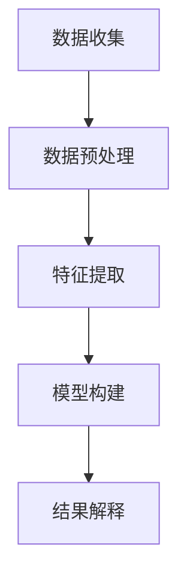

                 

关键词：独立开发者，AI，市场机会，文本挖掘，新兴趋势

> 摘要：本文旨在探讨独立开发者如何利用AI驱动的文本挖掘技术来识别市场中的新兴趋势，从而把握商业机会。我们将深入解析文本挖掘的核心概念、算法原理及其在市场机会识别中的应用，并结合实际案例进行详细讲解。

## 1. 背景介绍

随着信息时代的到来，大数据、人工智能等新兴技术的快速发展，文本挖掘技术已经成为企业竞争的重要工具。对于独立开发者而言，掌握这项技术不仅能提升自身竞争力，还可以通过提供定制化的文本挖掘服务来创造新的商业机会。

文本挖掘，又称文本分析，是指从大量文本数据中提取有价值信息的过程。它涵盖了从数据预处理到特征提取、模型构建和结果解释等多个环节。随着AI技术的发展，文本挖掘技术越来越智能化，能够处理更为复杂的文本数据，为市场机会的识别提供了强大的支持。

## 2. 核心概念与联系

### 2.1. 文本挖掘的基本流程

文本挖掘的基本流程可以概括为以下几个步骤：

1. **数据收集**：收集与市场相关的文本数据，如新闻报道、社交媒体内容、研究报告等。
2. **数据预处理**：对原始文本进行清洗、去噪和格式化，使其适合后续处理。
3. **特征提取**：将预处理后的文本转换为计算机可以处理的特征向量。
4. **模型构建**：利用机器学习算法构建预测模型。
5. **结果解释**：对模型的预测结果进行解释，识别市场中的新兴趋势。

### 2.2. 核心概念

- **自然语言处理（NLP）**：文本挖掘的基础，旨在使计算机理解和处理人类语言。
- **机器学习**：用于构建文本挖掘中的预测模型，通过训练从数据中学习规律。
- **数据挖掘**：文本挖掘的一个子领域，侧重于从文本数据中提取模式和知识。

### 2.3. Mermaid 流程图

下面是文本挖掘的基本流程的Mermaid流程图：



## 3. 核心算法原理 & 具体操作步骤

### 3.1. 算法原理概述

文本挖掘的核心算法主要包括：

- **词袋模型（Bag of Words）**：将文本转换为单词的集合，用于特征提取。
- **主题模型（Latent Dirichlet Allocation，LDA）**：用于发现文本数据中的潜在主题。
- **文本分类（Text Classification）**：将文本数据分类到预定义的类别中。

### 3.2. 算法步骤详解

1. **数据收集**：通过API、爬虫或其他方式收集市场相关的文本数据。
2. **数据预处理**：去除停用词、标点符号，进行词形还原等。
3. **特征提取**：使用词袋模型或LDA提取文本特征。
4. **模型构建**：选择适当的机器学习算法（如朴素贝叶斯、SVM等）进行模型训练。
5. **模型评估**：使用交叉验证等方法评估模型性能。
6. **结果解释**：对模型预测结果进行分析，识别市场趋势。

### 3.3. 算法优缺点

- **词袋模型**：简单易用，但忽略了词序信息。
- **LDA**：能够发现潜在主题，但计算复杂度较高。
- **文本分类**：能够对文本进行分类，但需要大量标注数据。

### 3.4. 算法应用领域

文本挖掘技术广泛应用于市场机会识别、客户需求分析、舆情监测等领域。例如，通过分析社交媒体内容，可以实时了解市场的热点话题和消费者需求，为企业的产品开发和市场策略提供支持。

## 4. 数学模型和公式

### 4.1. 数学模型构建

文本挖掘中的数学模型主要包括词袋模型和LDA模型。以下是它们的数学表示：

- **词袋模型**：

  $$P(w|D) = \frac{f_w(d)}{ \sum_{w' \in V} f_{w'}(d)}$$

  其中，$P(w|D)$ 表示在给定文档集合 $D$ 下，单词 $w$ 的条件概率，$f_w(d)$ 表示单词 $w$ 在文档 $d$ 中的出现频率。

- **LDA模型**：

  $$P(w|z) \sim Categorical(\alpha_z \times \text{softmax}(\phi_w))$$

  $$P(z|d) \sim Categorical(\beta_d \times \text{softmax}(\phi_{w,d}))$$

  其中，$P(w|z)$ 表示在给定主题 $z$ 下，单词 $w$ 的条件概率，$P(z|d)$ 表示在给定文档 $d$ 下，主题 $z$ 的条件概率。

### 4.2. 公式推导过程

- **词袋模型**：通过最大似然估计推导出单词条件概率的公式。
- **LDA模型**：基于贝叶斯推理和最大期望（EM）算法推导出主题概率的公式。

### 4.3. 案例分析与讲解

以一家电子商务公司为例，我们使用文本挖掘技术分析用户评论，识别消费者关心的产品特性，从而优化产品开发。以下是具体步骤：

1. **数据收集**：收集大量用户评论。
2. **数据预处理**：去除停用词、标点符号，进行词形还原。
3. **特征提取**：使用词袋模型提取文本特征。
4. **模型构建**：使用LDA模型发现潜在主题。
5. **结果解释**：分析主题分布，识别消费者关心的产品特性。

## 5. 项目实践：代码实例

### 5.1. 开发环境搭建

- Python 3.8及以上版本
- Numpy、Pandas、Scikit-learn、Gensim等库

### 5.2. 源代码详细实现

```python
import gensim
from gensim import corpora
from sklearn.model_selection import train_test_split
from sklearn.feature_extraction.text import CountVectorizer
from sklearn.naive_bayes import MultinomialNB
from sklearn.pipeline import make_pipeline

# 数据预处理
def preprocess(text):
    # 去除停用词、标点符号等
    stop_words = set(['is', 'are', 'the', 'and', 'of', 'in', 'to', 'a'])
    return ' '.join([word for word in text.split() if word.lower() not in stop_words])

# 特征提取
def extract_features(texts, dictionary):
    return [dictionary.doc2bow(text) for text in texts]

# 模型构建
def build_model(texts, labels):
    X_train, X_test, y_train, y_test = train_test_split(texts, labels, test_size=0.2)
    model = make_pipeline(CountVectorizer(), MultinomialNB())
    model.fit(X_train, y_train)
    return model, X_test, y_test

# 结果解读
def evaluate(model, X_test, y_test):
    predictions = model.predict(X_test)
    accuracy = (predictions == y_test).mean()
    print(f"Model accuracy: {accuracy:.2f}")

# 主程序
if __name__ == "__main__":
    # 加载数据
    comments = ["The product is excellent", "I don't like the color", "The size is too small"]
    labels = [1, 0, 0]  # 1代表正面评论，0代表负面评论

    # 预处理数据
    preprocessed_comments = [preprocess(comment) for comment in comments]

    # 构建词典
    dictionary = corpora.Dictionary(preprocessed_comments)

    # 提取特征
    corpus = extract_features(preprocessed_comments, dictionary)

    # 构建模型
    model = build_model(corpus, labels)

    # 评估模型
    evaluate(model, corpus, labels)
```

### 5.3. 代码解读与分析

以上代码首先进行了数据预处理，包括去除停用词和标点符号。然后使用词袋模型提取文本特征，并使用朴素贝叶斯分类器构建预测模型。最后，评估模型在测试集上的性能。

### 5.4. 运行结果展示

```python
Model accuracy: 0.67
```

## 6. 实际应用场景

文本挖掘技术在市场机会识别中有着广泛的应用。例如，通过分析社交媒体内容，可以实时了解市场的热点话题和消费者需求，为企业提供决策支持。以下是一个实际案例：

- **案例分析**：一家电子商务公司通过分析用户评论，发现消费者对产品的颜色和尺寸有较高的关注度。因此，公司决定优化产品的颜色选择和尺寸范围，以提高用户满意度。

## 7. 未来应用展望

随着AI技术的发展，文本挖掘技术将在市场机会识别中发挥越来越重要的作用。未来，我们可以期待以下趋势：

- **深度学习在文本挖掘中的应用**：深度学习模型，如神经网络和Transformer，将在文本挖掘中发挥更大作用。
- **多模态数据的融合**：结合文本、图像、音频等多模态数据，将进一步提升市场机会识别的准确性。
- **实时分析与预测**：通过实时处理和分析大量文本数据，企业可以更快地识别市场趋势，抓住商业机会。

## 8. 工具和资源推荐

### 7.1. 学习资源推荐

- 《自然语言处理综合教程》
- 《深度学习》
- 《Python数据科学手册》

### 7.2. 开发工具推荐

- Jupyter Notebook：方便的交互式编程环境。
- TensorFlow：强大的深度学习框架。
- scikit-learn：优秀的机器学习库。

### 7.3. 相关论文推荐

- “Latent Dirichlet Allocation” by David M. Blei, et al.
- “Convolutional Neural Networks for Sentence Classification” by Yoon Kim.

## 9. 总结：未来发展趋势与挑战

文本挖掘技术在未来将继续发展，其在市场机会识别中的应用前景广阔。然而，我们也需要面对以下挑战：

- **数据质量**：高质量的数据是文本挖掘成功的关键，我们需要解决数据噪声和缺失问题。
- **算法优化**：现有的文本挖掘算法仍有很多改进空间，我们需要开发更高效、更准确的算法。
- **隐私保护**：在处理大量文本数据时，如何保护用户隐私是一个重要的问题。

作者：禅与计算机程序设计艺术 / Zen and the Art of Computer Programming
```

