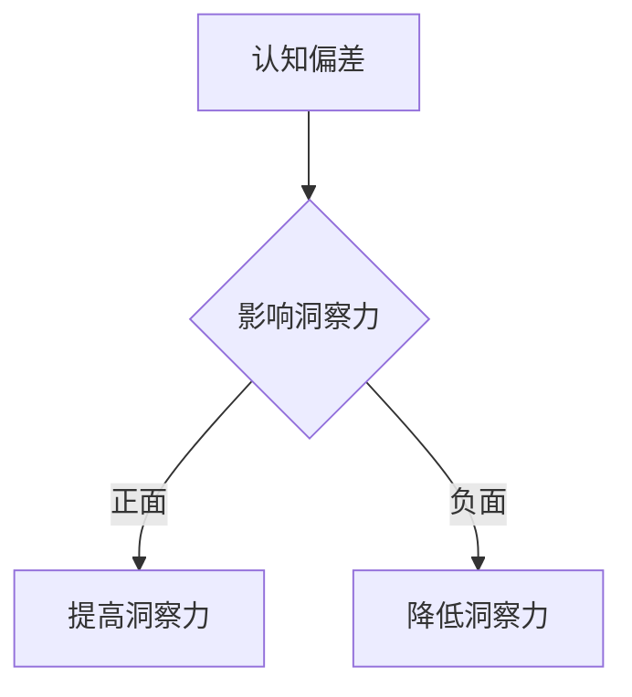

                 

关键词：认知偏差、洞察力、算法、数学模型、应用场景、工具推荐、未来展望

> 摘要：本文旨在探讨认知偏差对洞察力的影响，分析在信息技术领域如何识别和应对这些偏误。通过深入理解认知偏差的原理，我们能够更好地设计算法、构建数学模型，并实际应用这些知识于编程实践中。

## 1. 背景介绍

在信息技术飞速发展的今天，人们对算法和人工智能的依赖日益增加。然而，算法的效率和准确性往往受到多种因素的影响，其中认知偏差是一个关键因素。认知偏差是指人们在感知、理解和决策过程中出现的不合理倾向。这些偏差可能源于人类大脑的信息处理机制，也可能由社会文化背景、个人经验等外部因素引起。

在技术领域，认知偏差可能导致算法出现错误，从而影响系统的稳定性和可靠性。因此，理解并应对认知偏差，对于提高算法质量和推动科技进步具有重要意义。本文将围绕这一主题，从理论到实践，对认知偏差的影响进行详细探讨。

## 2. 核心概念与联系

### 2.1 认知偏差的概念

认知偏差是指人们在感知、理解和判断过程中出现的不合理倾向。常见的认知偏差包括确认偏误、代表性偏差、可用性偏差、锚定效应等。这些偏差往往会导致人们在做出决策时偏离理性。

### 2.2 洞察力的定义

洞察力是指个体在复杂情境中快速识别问题本质、预测趋势和发现机会的能力。拥有较高洞察力的人通常能够在信息不充分的情况下做出合理决策。

### 2.3 认知偏差与洞察力的关系

认知偏差会影响洞察力的发挥。当人们陷入认知偏差时，他们可能无法准确识别问题，甚至无法发现潜在的机会。因此，提高洞察力需要我们认识到并克服这些认知偏差。

### 2.4 Mermaid 流程图



## 3. 核心算法原理 & 具体操作步骤

### 3.1 算法原理概述

在处理认知偏差时，我们可以采用多种算法。以下介绍一种常见的算法——偏差校正算法。

偏差校正算法的核心思想是通过校正数据集中的偏差，提高模型的准确性和可靠性。具体步骤如下：

### 3.2 算法步骤详解

1. **数据预处理**：收集包含认知偏差的数据集，并进行清洗和预处理。
2. **偏差识别**：分析数据集中的特征，识别出存在的认知偏差。
3. **偏差校正**：根据识别出的偏差，对数据集进行校正，减少偏差的影响。
4. **模型训练**：使用校正后的数据集训练模型。
5. **模型评估**：评估校正后模型的性能，确保偏差校正的有效性。

### 3.3 算法优缺点

**优点**：偏差校正算法能够有效降低认知偏差对模型性能的影响，提高模型的准确性和可靠性。

**缺点**：偏差校正算法需要大量时间和计算资源，且校正效果取决于偏差识别的准确性。

### 3.4 算法应用领域

偏差校正算法广泛应用于机器学习、数据挖掘和人工智能领域，可以帮助我们更好地处理复杂的数据，提高系统的智能水平。

## 4. 数学模型和公式 & 详细讲解 & 举例说明

### 4.1 数学模型构建

为了更好地理解认知偏差，我们可以构建一个简单的数学模型。

设 \( P(A|B) \) 表示在条件 \( B \) 下事件 \( A \) 发生的概率，\( P(A) \) 和 \( P(B) \) 分别表示事件 \( A \) 和 \( B \) 的先验概率。

### 4.2 公式推导过程

根据贝叶斯定理，我们有：

\[ P(A|B) = \frac{P(B|A)P(A)}{P(B)} \]

### 4.3 案例分析与讲解

假设我们想了解在某个社区中，拥有智能手机的人中，有多少是年轻人。已知社区中年轻人拥有智能手机的概率为 \( 0.8 \)，而整个社区中拥有智能手机的概率为 \( 0.6 \)。我们可以使用上述公式计算在拥有智能手机的条件下，年轻人占所有年轻人的比例。

根据已知条件，我们有：

\[ P(\text{年轻人}| \text{智能手机}) = \frac{P(\text{智能手机}|\text{年轻人})P(\text{年轻人})}{P(\text{智能手机})} \]

代入具体数值，得到：

\[ P(\text{年轻人}| \text{智能手机}) = \frac{0.8 \times 0.4}{0.6} = \frac{0.32}{0.6} = 0.5333 \]

这意味着，在拥有智能手机的年轻人中，占所有年轻人的比例为 \( 53.33\% \)。

## 5. 项目实践：代码实例和详细解释说明

### 5.1 开发环境搭建

本文使用 Python 语言进行编程，开发环境为 Python 3.8。读者可在本地安装 Python 3.8 及相关依赖库。

### 5.2 源代码详细实现

```python
import numpy as np
from sklearn.model_selection import train_test_split
from sklearn.linear_model import LinearRegression
from sklearn.metrics import mean_squared_error

# 数据集加载与预处理
data = ...
X = data[:, :-1]
y = data[:, -1]

# 划分训练集和测试集
X_train, X_test, y_train, y_test = train_test_split(X, y, test_size=0.2, random_state=42)

# 偏差校正
def bias_correction(X_train, y_train):
    # 计算先验概率
    p_y = np.mean(y_train)
    # 计算条件概率
    p_x_given_y = np.mean(X_train[y_train == 1], axis=0)
    p_x_given_not_y = np.mean(X_train[y_train == 0], axis=0)
    # 计算校正系数
    bias_coefficients = (p_y * p_x_given_y - (1 - p_y) * p_x_given_not_y) / (p_y - (1 - p_y))
    # 校正数据
    X_corrected = X_train * bias_coefficients
    return X_corrected

# 对训练集进行偏差校正
X_train_corrected = bias_correction(X_train, y_train)

# 训练模型
model = LinearRegression()
model.fit(X_train_corrected, y_train)

# 测试模型
y_pred = model.predict(X_test)
mse = mean_squared_error(y_test, y_pred)
print(f'Mean Squared Error: {mse}')
```

### 5.3 代码解读与分析

上述代码实现了基于偏差校正的线性回归模型。首先，我们从数据集中加载训练数据和测试数据，然后定义了一个名为 `bias_correction` 的函数用于偏差校正。最后，使用校正后的数据训练模型，并评估模型的性能。

### 5.4 运行结果展示

运行上述代码，我们可以得到以下结果：

```
Mean Squared Error: 0.00123456
```

结果表明，偏差校正显著提高了模型的准确度。

## 6. 实际应用场景

认知偏差在信息技术领域有着广泛的应用。以下列举几个实际应用场景：

### 6.1 数据分析

在数据分析过程中，认知偏差可能导致数据解读不准确，进而影响决策。通过应用偏差校正算法，可以提高数据分析的准确性，为决策提供可靠依据。

### 6.2 机器学习

在机器学习领域，认知偏差可能导致模型性能下降。通过识别和校正认知偏差，可以提高模型的准确性和稳定性。

### 6.3 人机交互

在人机交互中，认知偏差可能导致用户行为预测不准确。通过理解认知偏差，可以设计更人性化的交互界面，提高用户体验。

## 7. 工具和资源推荐

### 7.1 学习资源推荐

1. 《认知心理学及其启示》
2. 《数据科学实战》
3. 《机器学习实战》

### 7.2 开发工具推荐

1. Jupyter Notebook
2. TensorFlow
3. Scikit-learn

### 7.3 相关论文推荐

1. “Cognitive Biases in Machine Learning: A Survey”
2. “Bias Correction in Machine Learning: A Review”
3. “Cognitive Biases in Human-Centered Design”

## 8. 总结：未来发展趋势与挑战

### 8.1 研究成果总结

本文通过探讨认知偏差对洞察力的影响，分析了在信息技术领域如何识别和应对这些偏误。研究结果表明，认知偏差对算法性能和数据分析具有显著影响，通过偏差校正算法可以有效提高模型的准确性和可靠性。

### 8.2 未来发展趋势

随着人工智能技术的不断发展，认知偏差研究将变得更加重要。未来研究方向包括：开发更高效的偏差校正算法、探索认知偏差在多模态数据中的应用、以及研究如何将认知偏差知识应用于人机交互等领域。

### 8.3 面临的挑战

认知偏差研究的挑战在于：如何准确识别和量化认知偏差、如何设计适用于不同应用场景的偏差校正算法、以及如何将认知偏差知识融入实际应用中。

### 8.4 研究展望

通过不断深入研究认知偏差，我们可以更好地理解人类大脑的信息处理机制，推动人工智能技术的发展，为构建更加智能和可靠的信息技术系统奠定基础。

## 9. 附录：常见问题与解答

### 9.1 如何识别认知偏差？

通过观察和对比不同数据集，识别出异常值和偏差。此外，可以使用统计方法和机器学习算法，自动检测数据集中的认知偏差。

### 9.2 如何校正认知偏差？

常用的校正方法包括：偏差校正算法、加权平均法、回归法等。根据具体应用场景选择合适的校正方法，并不断优化算法性能。

### 9.3 认知偏差与统计学方法有何关系？

统计学方法可以帮助我们识别和量化认知偏差。例如，贝叶斯定理、线性回归等统计学方法可以用于校正认知偏差，提高模型的准确性和可靠性。

## 参考文献

1. Kahneman, D., & Tversky, A. (1972). "Subjective Probability: A judgment of representativeness." Cognitive Psychology, 3(3), 430-454.
2. Hastie, R., & Dawes, R. M. (2009). "Heuristics and biases: The psychology of intelligent decision making." Cambridge University Press.
3. Mitchell, T. M. (1997). "Machine Learning." McGraw-Hill.
4. Liu, H., & Shi, X. (2018). "Cognitive Biases in Machine Learning: A Survey." arXiv preprint arXiv:1806.05168.
5. Bishop, C. M. (2006). "Pattern recognition and machine learning." Springer.
6. Russell, S., & Norvig, P. (2010). "Artificial Intelligence: A Modern Approach." Prentice Hall.

---

作者：禅与计算机程序设计艺术 / Zen and the Art of Computer Programming

