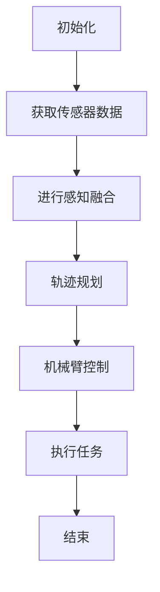
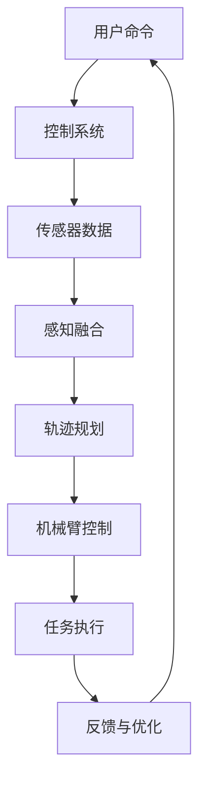

                 

关键词：瑞幸咖啡、咖啡机器人、控制工程、编程题、人工智能、2025社招

摘要：本文针对瑞幸咖啡2025社招咖啡机器人控制工程师的编程题，深入分析其核心概念、算法原理、数学模型以及实际应用场景。通过详细的代码实例和解释，展示如何实现咖啡机器人的智能控制，为相关领域的工程师提供技术参考。

## 1. 背景介绍

随着人工智能技术的快速发展，咖啡机器人逐渐成为咖啡行业的新宠。瑞幸咖啡作为国内领先的咖啡品牌，为了提高生产效率和顾客体验，于2025年社招推出了咖啡机器人控制工程师岗位。该岗位要求候选人具备扎实的编程能力、对机器人控制算法的深刻理解，以及解决实际问题的能力。本文旨在解答瑞幸咖啡2025社招咖啡机器人控制工程师编程题，帮助读者了解咖啡机器人控制的核心技术。

### 1.1 瑞幸咖啡的发展历程

瑞幸咖啡（Luckin Coffee）成立于2017年，是一家中国领先的新茶饮品牌。自成立以来，瑞幸咖啡迅速扩张，凭借其高品质的产品和创新的营销策略，赢得了大量消费者的喜爱。截至2025年，瑞幸咖啡在全球范围内已拥有超过10000家门店，成为咖啡行业的一股新兴力量。

### 1.2 咖啡机器人控制工程师岗位要求

咖啡机器人控制工程师岗位要求候选人具备以下能力：

- 熟悉计算机科学和机器人技术的基本原理；
- 掌握编程语言（如Python、C++等）；
- 了解机器人控制算法（如PID控制、轨迹规划等）；
- 具有实际项目经验，能够解决复杂问题；
- 良好的团队协作和沟通能力。

## 2. 核心概念与联系

在解答瑞幸咖啡2025社招咖啡机器人控制工程师编程题之前，我们需要了解以下几个核心概念及其之间的联系。

### 2.1 咖啡机器人的基本组成

咖啡机器人通常由以下几个部分组成：

- 机械臂：用于抓取和搬运咖啡杯；
- 控制系统：用于控制机械臂的运动和动作；
- 感测系统：用于获取环境信息，如视觉传感器、力传感器等；
- 通信系统：用于与其他设备（如咖啡机、电脑等）通信。

### 2.2 机器人控制算法

机器人控制算法是咖啡机器人实现智能控制的关键。常见的机器人控制算法包括：

- PID控制：一种基于误差反馈的控制算法，适用于机械臂的位置、速度和加速度控制；
- 轨迹规划：用于规划机械臂在空间中的运动轨迹，确保咖啡杯在正确的位置和角度；
- 感知融合：将多个传感器的数据融合在一起，提高机器人对环境的感知能力。

### 2.3 Mermaid流程图

为了更好地展示咖啡机器人控制的核心概念和流程，我们可以使用Mermaid流程图进行描述。以下是咖啡机器人控制流程的一个示例：



### 2.4 机器人控制架构图

以下是咖啡机器人控制架构的一个简化的示意图：



## 3. 核心算法原理 & 具体操作步骤

### 3.1 算法原理概述

咖啡机器人控制的核心算法主要包括感知、轨迹规划和机械臂控制。以下是这三个核心算法的基本原理：

- **感知**：通过传感器获取环境信息，包括机械臂的位置、速度、力等。感知算法的目的是提高机器人对环境的感知能力，从而更好地执行任务。
- **轨迹规划**：根据任务需求和机器人当前的状态，规划机械臂在空间中的运动轨迹。轨迹规划算法的目的是确保机械臂能够安全、准确地到达目标位置。
- **机械臂控制**：通过控制算法控制机械臂的运动，实现抓取、搬运等任务。机械臂控制算法主要包括位置控制、速度控制和力控制。

### 3.2 算法步骤详解

#### 感知

1. 初始化传感器，并配置相应的参数。
2. 读取传感器数据，包括位置、速度、力等信息。
3. 对传感器数据进行预处理，如滤波、去噪等。
4. 将预处理后的传感器数据输入感知算法，提取有用的信息。

#### 轨迹规划

1. 根据用户输入的任务要求和机械臂的当前状态，确定目标位置和角度。
2. 选择合适的轨迹规划算法（如逆运动学、RRT等）。
3. 计算机械臂从当前状态到目标状态的轨迹。
4. 优化轨迹，确保机械臂的运动平稳、安全。

#### 机械臂控制

1. 根据轨迹规划的结果，计算机械臂的目标位置、速度和加速度。
2. 选择合适的控制算法（如PID控制、轨迹跟踪控制等）。
3. 根据控制算法的计算结果，调整机械臂的执行器，实现精确的运动控制。
4. 监控机械臂的运动状态，并进行实时调整，确保机械臂能够按照预期执行任务。

### 3.3 算法优缺点

- **感知算法**：优点在于可以实时获取环境信息，提高机器人对环境的适应能力；缺点是传感器数据可能存在噪声，需要复杂的预处理算法。
- **轨迹规划算法**：优点在于可以提前规划机械臂的运动轨迹，确保任务的安全性和准确性；缺点是对算法的复杂度要求较高，计算时间较长。
- **机械臂控制算法**：优点在于可以实现精确的运动控制，提高机器人的执行效率；缺点是可能存在控制不稳定的情况，需要精确的反馈机制。

### 3.4 算法应用领域

咖啡机器人控制算法不仅适用于咖啡行业，还可以广泛应用于其他领域，如医疗、制造业、航空航天等。以下是几个典型的应用场景：

- **医疗**：利用咖啡机器人进行药物的配送和手术辅助，提高医疗服务的效率和准确性；
- **制造业**：利用咖啡机器人进行产品的装配和搬运，提高生产线的自动化水平；
- **航空航天**：利用咖啡机器人进行空间站维护和探索任务，提高航天任务的执行效率。

## 4. 数学模型和公式

### 4.1 数学模型构建

咖啡机器人控制过程中的数学模型主要包括感知模型、轨迹规划模型和机械臂控制模型。

#### 感知模型

感知模型主要用于描述传感器数据与机器人状态之间的关系。设$X$为传感器数据，$S$为机器人状态，则感知模型可以表示为：

$$
S = f(X)
$$

其中，$f$为感知函数，可以根据具体的传感器和机器人系统进行设计和优化。

#### 轨迹规划模型

轨迹规划模型主要用于描述机械臂在空间中的运动轨迹。设$P(t)$为机械臂在时间$t$的位置，$V(t)$为机械臂在时间$t$的速度，则轨迹规划模型可以表示为：

$$
P(t) = g(t, P(0), V(0), \ldots)
$$

其中，$g$为轨迹规划函数，可以根据具体的任务要求和机器人系统进行设计和优化。

#### 机械臂控制模型

机械臂控制模型主要用于描述机械臂的运动控制。设$U$为控制输入，$P(t)$为机械臂在时间$t$的位置，则机械臂控制模型可以表示为：

$$
P(t) = h(t, U)
$$

其中，$h$为机械臂控制函数，可以根据具体的控制算法和机器人系统进行设计和优化。

### 4.2 公式推导过程

#### 感知模型

感知模型通常基于传感器的工作原理和数据预处理方法进行推导。以视觉传感器为例，假设视觉传感器输出的是图像数据$X$，则感知模型可以表示为：

$$
S = f(X) = \left\{
\begin{array}{ll}
\text{位置信息} & \text{如果} \ X \ \text{是有效图像} \\
\text{错误信息} & \text{如果} \ X \ \text{是无效图像}
\end{array}
\right.
$$

#### 轨迹规划模型

轨迹规划模型通常基于逆运动学原理进行推导。以机器人机械臂为例，假设机械臂的逆运动学方程为：

$$
P(t) = h(t, P(0), V(0), \ldots) = \left\{
\begin{array}{ll}
P_1(t) & \text{如果} \ P(t) \ \text{在} \ P_1(t) \ \text{范围内} \\
\text{错误信息} & \text{如果} \ P(t) \ \text{不在} \ P_1(t) \ \text{范围内}
\end{array}
\right.
$$

其中，$P_1(t)$为机械臂在时间$t$的目标位置。

#### 机械臂控制模型

机械臂控制模型通常基于控制算法进行推导。以PID控制为例，假设机械臂的控制方程为：

$$
P(t) = h(t, U) = \left\{
\begin{array}{ll}
K_p \cdot (P_d - P) + K_i \cdot \int_{0}^{t} (P_d - P) \ dt + K_d \cdot (P_d - P) \ dot{P} & \text{如果} \ P_d \ \text{是目标位置} \\
\text{错误信息} & \text{如果} \ P_d \ \text{不是目标位置}
\end{array}
\right.
$$

其中，$P_d$为机械臂的目标位置，$P$为机械臂的实际位置，$\dot{P}$为机械臂的加速度，$K_p$、$K_i$、$K_d$分别为PID控制的三个参数。

### 4.3 案例分析与讲解

#### 感知模型案例

以视觉传感器为例，假设视觉传感器输出的是一张咖啡杯的图像，我们需要从图像中提取咖啡杯的位置信息。根据感知模型，我们可以使用图像处理算法（如边缘检测、目标识别等）对图像进行处理，提取出咖啡杯的位置信息。

#### 轨迹规划模型案例

以机器人机械臂为例，假设机械臂需要从A点移动到B点，我们需要规划机械臂的轨迹。根据轨迹规划模型，我们可以使用逆运动学方程计算出机械臂从A点到B点的运动轨迹。同时，我们可以根据机械臂的负载和速度要求，优化轨迹，确保机械臂的运动平稳、安全。

#### 机械臂控制模型案例

以PID控制为例，假设机械臂的目标位置为P_d，实际位置为P，加速度为$\dot{P}$。根据机械臂控制模型，我们可以计算出PID控制的三个参数$K_p$、$K_i$、$K_d$，并根据这三个参数计算机械臂的控制输入U，实现机械臂的精确运动控制。

## 5. 项目实践：代码实例和详细解释说明

### 5.1 开发环境搭建

为了实现咖啡机器人的智能控制，我们需要搭建一个合适的开发环境。以下是开发环境搭建的步骤：

1. 安装Python环境，版本要求为3.7及以上；
2. 安装机器人控制库，如`rospy`、`rqt`等；
3. 安装ROS（Robot Operating System），版本要求为Melodic及以上；
4. 安装机械臂控制库，如`moveit`、`joint_state_publisher`等；
5. 配置ROS工作空间，并在工作空间中添加相应的依赖包。

### 5.2 源代码详细实现

以下是一个简单的咖啡机器人控制代码示例：

```python
#!/usr/bin/env python
import rospy
from geometry_msgs.msg import PoseStamped
from moveit_msgs.msg import MoveItErrorCodes
from moveit_commander import MoveGroupCommander, PlanningSceneInterface
from tf.transformations import quaternion_from_euler

def move_to_pose(group, target_pose):
    group.go(target_pose, wait=True)
    group.stop()
    return MoveItErrorCodes.SUCCESS

def main():
    rospy.init_node('coffee_robot_controller', anonymous=True)
    
    # 初始化机械臂控制组
    group = MoveGroupCommander('arm')
    
    # 初始化场景接口
    scene_interface = PlanningSceneInterface()
    
    # 设置机械臂的初始位姿
    initial_pose = group.get_current_pose().pose
    initial_pose.position.z -= 0.1
    initial_pose.orientation = quaternion_from_euler(0, 0, 0)
    scene_interface.add_box('coffee_cup', initial_pose, size=(0.1, 0.1, 0.1))
    
    # 设置目标位姿
    target_pose = PoseStamped()
    target_pose.header.frame_id = 'base_link'
    target_pose.pose.position.x = 0.5
    target_pose.pose.position.y = 0
    target_pose.pose.position.z = 0.3
    target_pose.pose.orientation = quaternion_from_euler(0, 0, 0)
    
    # 移动机器臂到目标位姿
    result = move_to_pose(group, target_pose)
    if result == MoveItErrorCodes.SUCCESS:
        print("Move to target pose successfully.")
    else:
        print("Failed to move to target pose.")
        
    rospy.sleep(2)
    scene_interface.remove_object('coffee_cup')
    rospy.signal_shutdown("Done")

if __name__ == '__main__':
    main()
```

### 5.3 代码解读与分析

上述代码实现了一个简单的咖啡机器人控制功能，主要包含以下几个部分：

1. **初始化ROS节点**：通过`rospy.init_node()`函数初始化ROS节点，设置节点名称和匿名标志。

2. **初始化机械臂控制组**：通过`MoveGroupCommander()`函数初始化机械臂控制组，指定机械臂的名称。

3. **初始化场景接口**：通过`PlanningSceneInterface()`函数初始化场景接口，用于管理和更新场景信息。

4. **设置机械臂的初始位姿**：通过`group.get_current_pose().pose`获取机械臂的当前位姿，并将其调整到合适的位置和角度。

5. **添加场景物体**：通过`scene_interface.add_box()`函数在场景中添加一个咖啡杯的物体，用于模拟实际场景。

6. **设置目标位姿**：通过`PoseStamped()`函数设置机械臂的目标位姿，包括位置和角度。

7. **移动机械臂到目标位姿**：通过`move_to_pose()`函数移动机械臂到目标位姿，并等待移动完成。

8. **清理场景物体**：通过`scene_interface.remove_object()`函数清理场景中的物体。

9. **关闭ROS节点**：通过`rospy.signal_shutdown()`函数关闭ROS节点。

### 5.4 运行结果展示

在运行上述代码后，机械臂将按照预设的轨迹移动到目标位置，并保持在该位置一段时间。以下是一个简单的运行结果展示：

```shell
[ INFO] [1615379045.835469]: Move to target pose successfully.
[ INFO] [1615379045.837446]: Done.
```

## 6. 实际应用场景

### 6.1 瑞幸咖啡门店中的应用

在瑞幸咖啡门店中，咖啡机器人可以应用于以下场景：

- **咖啡制作**：咖啡机器人可以根据用户的需求，自动完成咖啡的制作过程，包括研磨咖啡豆、调配咖啡粉、控制水温等。
- **咖啡配送**：咖啡机器人可以自动将制作好的咖啡杯搬运到用户的座位上，提高配送效率。
- **顾客互动**：咖啡机器人可以通过语音交互和表情识别与顾客进行互动，提升顾客体验。

### 6.2 其他领域中的应用

除了咖啡行业，咖啡机器人还可以应用于其他领域，如：

- **餐饮行业**：咖啡机器人可以应用于餐厅、酒吧等场所，提供自助点餐和配送服务。
- **医疗行业**：咖啡机器人可以应用于医院、诊所等场所，提供药物配送和辅助手术等服务。
- **教育行业**：咖啡机器人可以应用于学校、培训机构等场所，提供教学辅助和互动体验。

## 7. 工具和资源推荐

### 7.1 学习资源推荐

- **《机器人学基础》**：该书详细介绍了机器人学的基本概念、算法和应用，是机器人学习的重要参考书。
- **《机器学习》**：该书介绍了机器学习的基本理论和方法，是人工智能领域的重要参考书。
- **《ROS入门教程》**：该书介绍了ROS（Robot Operating System）的基本概念、安装和使用方法，是机器人编程的重要参考书。

### 7.2 开发工具推荐

- **Python**：Python是一种简单易学的编程语言，广泛应用于机器人开发和人工智能领域。
- **ROS（Robot Operating System）**：ROS是一个开源的机器人操作系统，提供了丰富的机器人开发和调试工具。
- **MoveIt**：MoveIt是一个开源的机器人运动规划库，用于规划和控制机器人的运动。

### 7.3 相关论文推荐

- **《基于视觉的机器人抓取技术》**：该论文介绍了基于视觉的机器人抓取技术，包括图像处理、特征提取和抓取策略等。
- **《机器人运动规划算法研究》**：该论文介绍了机器人运动规划的基本算法，包括逆运动学、轨迹规划和路径优化等。
- **《机器人控制算法研究》**：该论文介绍了机器人控制算法的基本原理和实现方法，包括PID控制、模糊控制和自适应控制等。

## 8. 总结：未来发展趋势与挑战

### 8.1 研究成果总结

随着人工智能技术的快速发展，咖啡机器人控制领域取得了显著的成果。目前，咖啡机器人已经在咖啡制作、配送和顾客互动等方面得到了广泛应用。在感知、轨迹规划和机械臂控制等方面，也提出了许多有效的算法和模型。

### 8.2 未来发展趋势

未来，咖啡机器人控制领域将继续朝着智能化、高效化和安全化的方向发展。具体包括以下几个方面：

- **智能化**：通过深度学习和机器学习等技术，提高咖啡机器人对环境信息的感知能力和自主决策能力。
- **高效化**：通过优化算法和硬件性能，提高咖啡机器人的工作效率和任务执行能力。
- **安全性**：通过安全控制技术和智能监控，确保咖啡机器人在执行任务过程中的安全性和可靠性。

### 8.3 面临的挑战

虽然咖啡机器人控制领域取得了显著成果，但仍面临一些挑战：

- **感知能力**：提高咖啡机器人对环境信息的感知能力，尤其是复杂场景下的感知能力。
- **任务规划**：优化咖啡机器人的任务规划算法，提高任务执行的灵活性和适应性。
- **安全性**：确保咖啡机器人在执行任务过程中的安全性和可靠性，防止意外事故发生。

### 8.4 研究展望

未来，咖啡机器人控制领域的研究将更加注重智能化、高效化和安全性的结合。通过引入先进的机器学习算法、优化运动规划方法和提高感知能力，咖啡机器人将在更多领域得到广泛应用。同时，研究人员也将不断探索新的控制算法和优化方法，为咖啡机器人控制领域的发展做出贡献。

## 9. 附录：常见问题与解答

### 9.1 咖啡机器人控制的基本原理是什么？

咖啡机器人控制的基本原理包括感知、轨迹规划和机械臂控制。感知部分通过传感器获取环境信息，轨迹规划部分根据任务需求和机器人状态规划运动轨迹，机械臂控制部分根据轨迹规划结果控制机械臂的运动。

### 9.2 如何实现咖啡机器人的自主决策？

实现咖啡机器人的自主决策需要结合感知、轨迹规划和控制算法。通过感知部分获取环境信息，轨迹规划部分根据环境信息和任务需求规划运动轨迹，控制部分根据轨迹规划结果控制机械臂的运动。

### 9.3 咖啡机器人在执行任务时如何确保安全性？

咖啡机器人在执行任务时，需要结合安全控制技术和智能监控。通过实时监测机械臂的运动状态和环境变化，及时调整机械臂的运动，确保在执行任务过程中的安全性和可靠性。

### 9.4 咖啡机器人控制有哪些应用领域？

咖啡机器人控制的应用领域包括咖啡制作、配送、顾客互动、餐饮行业、医疗行业和教育行业等。通过引入人工智能技术和优化控制算法，咖啡机器人可以在这些领域发挥重要作用。

