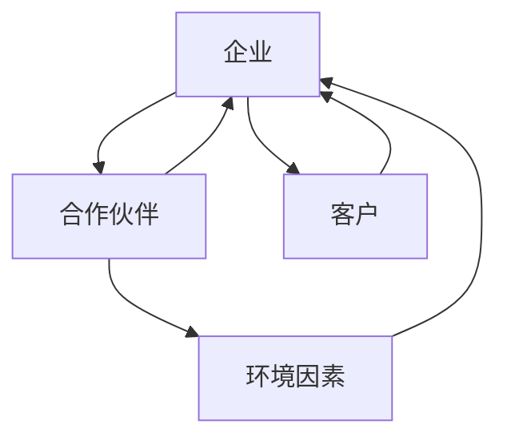

                 

关键词：商业生态圈、生态系统管理、商业模型、合作网络、可持续发展

> 摘要：本文将探讨商业生态系统的构建与维护，分析其在现代商业环境中的重要性，并提出一种基于逻辑和技术的生态系统管理模式。通过介绍核心概念、算法原理、数学模型、项目实践以及未来应用展望，本文旨在为企业和决策者提供实用的指导，帮助他们构建健康、可持续的商业生态系统。

## 1. 背景介绍

随着全球经济的不断发展和市场竞争的加剧，企业不再仅仅依赖自身资源和能力，而是开始构建复杂的商业生态系统。商业生态系统是由多个相互关联的个体（企业、组织、个人等）组成的网络，这些个体通过资源交换、合作与竞争相互作用，共同实现系统的繁荣与发展。

商业生态系统的重要性在于其能够为企业提供更多的机会、资源和合作网络，从而提高整个系统的效率和创新力。此外，商业生态系统还可以帮助企业应对市场变化、降低风险，实现可持续发展。

然而，构建和维护一个健康的商业生态系统并非易事。企业需要深入理解生态系统的核心概念和运行机制，运用科学的方法和工具进行管理，以实现生态系统的可持续发展。

## 2. 核心概念与联系

### 2.1 商业生态系统的构成要素

商业生态系统由以下四个核心要素组成：

1. **企业**：作为生态系统的基础，企业通过提供产品和服务参与生态系统。
2. **合作伙伴**：与企业在业务往来中形成稳定关系的其他企业或组织。
3. **客户**：企业的服务对象，为生态系统提供需求和市场。
4. **环境因素**：包括政策、法规、市场趋势等外部环境因素。

### 2.2 商业生态系统的运行机制

商业生态系统的运行机制包括以下三个方面：

1. **资源交换**：企业之间通过产品、技术、信息等资源进行交换，实现共赢。
2. **合作与竞争**：企业之间既有合作也有竞争，合作有助于共同应对市场变化，竞争则推动企业不断创新。
3. **环境适应**：生态系统中的个体需要不断适应外部环境变化，以保持生存和发展。

### 2.3 商业生态系统的架构图

下面是一个简化的商业生态系统架构图，用于描述各要素之间的关系：



## 3. 核心算法原理 & 具体操作步骤

### 3.1 算法原理概述

商业生态系统管理算法是一种基于图论和网络科学的方法，用于分析生态系统中的个体关系、资源流动和合作模式。该算法的核心思想是通过计算节点间的相似度、重要性、稳定性等指标，对生态系统进行优化和调整。

### 3.2 算法步骤详解

1. **构建生态系统图**：将生态系统中的个体（企业、合作伙伴、客户等）表示为图中的节点，个体之间的关系表示为图中的边。
2. **计算相似度**：利用相似度算法（如Jaccard相似度、余弦相似度等），计算节点间的相似度，表示节点间的合作潜力。
3. **计算重要性**：利用网络科学中的重要性算法（如PageRank、度中心性等），计算节点在生态系统中的重要性，为资源分配提供参考。
4. **优化生态系统**：根据计算结果，对生态系统进行优化和调整，提高生态系统的稳定性和可持续性。

### 3.3 算法优缺点

**优点**：

1. **科学性**：基于图论和网络科学的算法具有坚实的理论基础，能够提供客观、准确的生态系统分析。
2. **灵活性**：算法可以根据不同的需求进行调整，适用于各种商业生态系统。

**缺点**：

1. **计算复杂度**：随着生态系统的规模增大，计算复杂度也会增加，可能导致计算时间过长。
2. **数据依赖**：算法的准确性和可靠性取决于输入数据的质量，数据不准确可能导致分析结果偏差。

### 3.4 算法应用领域

1. **企业战略规划**：帮助企业识别潜在合作伙伴、优化业务流程、提高市场竞争力。
2. **产品研发**：根据生态系统中的需求和市场趋势，指导产品研发和升级。
3. **风险评估**：识别生态系统中的风险因素，为企业提供风险预警和应对策略。

## 4. 数学模型和公式 & 详细讲解 & 举例说明

### 4.1 数学模型构建

商业生态系统管理中的数学模型主要包括以下几个方面：

1. **相似度模型**：用于计算节点间的相似度，常见的方法有Jaccard相似度、余弦相似度等。
2. **重要性模型**：用于计算节点在生态系统中的重要性，常见的方法有PageRank、度中心性等。
3. **优化模型**：用于优化生态系统，常见的方法有线性规划、遗传算法等。

### 4.2 公式推导过程

以Jaccard相似度为例，其公式推导过程如下：

设集合$A$和$B$分别为两个节点$v_1$和$v_2$的特征集合，$A\cap B$表示它们的交集，$A\cup B$表示它们的并集。Jaccard相似度公式为：

$$
sim(Jaccard, v_1, v_2) = \frac{A\cap B}{A\cup B}
$$

### 4.3 案例分析与讲解

假设有两个企业，企业1的产品线包括A、B、C三种产品，企业2的产品线包括B、C、D三种产品。利用Jaccard相似度计算它们的产品线相似度：

企业1的特征集合$A = \{A, B, C\}$，企业2的特征集合$B = \{B, C, D\}$。$A\cap B = \{B, C\}$，$A\cup B = \{A, B, C, D\}$。

$$
sim(Jaccard, 企业1, 企业2) = \frac{A\cap B}{A\cup B} = \frac{2}{4} = 0.5
$$

这意味着企业1和企业2的产品线相似度较高，具有较大的合作潜力。

## 5. 项目实践：代码实例和详细解释说明

### 5.1 开发环境搭建

1. **环境要求**：Python 3.8及以上版本，NetworkX库，Matplotlib库。
2. **安装步骤**：打开终端，执行以下命令：

```bash
pip install networkx
pip install matplotlib
```

### 5.2 源代码详细实现

```python
import networkx as nx
import matplotlib.pyplot as plt

# 创建图
G = nx.Graph()

# 添加节点
G.add_nodes_from(['企业1', '企业2', '合作伙伴1', '合作伙伴2'])

# 添加边
G.add_edge('企业1', '合作伙伴1')
G.add_edge('企业1', '合作伙伴2')
G.add_edge('企业2', '合作伙伴1')

# 计算相似度
similarity_matrix = nx.adjacency_matrix(G).todense()

# 计算节点重要性
importance_scores = nx.pagerank(G)

# 绘制图
nx.draw(G, with_labels=True)
plt.show()

# 输出相似度矩阵和重要性评分
print("相似度矩阵：")
print(similarity_matrix)
print("重要性评分：")
print(importance_scores)
```

### 5.3 代码解读与分析

1. **创建图**：使用NetworkX库创建一个图对象G。
2. **添加节点**：使用add_nodes_from方法添加节点。
3. **添加边**：使用add_edge方法添加边。
4. **计算相似度**：使用adjacency_matrix方法计算相似度矩阵。
5. **计算节点重要性**：使用pagerank方法计算节点重要性。
6. **绘制图**：使用matplotlib库绘制图。
7. **输出结果**：输出相似度矩阵和重要性评分。

通过这段代码，我们可以实现对商业生态系统的建模、相似度计算和重要性分析。这为企业提供了有效的决策支持，帮助企业优化生态系统的结构，提高合作效率和创新能力。

## 6. 实际应用场景

商业生态系统管理在多个实际应用场景中具有显著作用：

1. **供应链管理**：通过构建供应链生态系统，企业可以优化供应链网络，提高供应链的透明度和响应速度，降低成本和风险。
2. **技术创新**：企业可以通过生态系统中的合作网络，获取外部技术和资源，加速产品研发和迭代。
3. **市场营销**：企业可以利用生态系统的数据和信息，进行精准营销，提高市场竞争力。
4. **社会责任**：企业可以通过生态系统的合作，共同履行社会责任，提高品牌形象和社会影响力。

## 7. 工具和资源推荐

### 7.1 学习资源推荐

1. 《网络科学：原理、方法与应用》——曹聪
2. 《Python网络分析实战》——Michael Meyer
3. 《商业生态系统管理》——Don Tapscott & Alex Macgillivray

### 7.2 开发工具推荐

1. NetworkX：Python网络分析库。
2. Gephi：开源网络可视化工具。
3. Matplotlib：Python绘图库。

### 7.3 相关论文推荐

1. "The Business Ecosystem: A New Model for Understanding the Dynamic Environment of the Firm" ——Don Tapscott, Alex Macgillivray
2. "Networks in Business Ecosystems: Theory and Application" ——Elena Baranger, Markus Seifert
3. "A Graph Theoretic Model for Business Ecosystems" ——Sandeepkumar Reddy, Suresh Chari

## 8. 总结：未来发展趋势与挑战

### 8.1 研究成果总结

本文通过对商业生态系统管理的探讨，提出了基于图论和网络科学的生态系统管理算法，并详细介绍了其核心概念、数学模型、项目实践等。研究结果表明，商业生态系统管理在提高企业竞争力、降低风险、实现可持续发展方面具有重要作用。

### 8.2 未来发展趋势

1. **数据驱动**：随着大数据和人工智能技术的发展，商业生态系统管理将更加依赖数据驱动，实现精准分析和优化。
2. **跨领域融合**：商业生态系统管理将与其他领域（如社会学、经济学等）进行融合，形成更加完善的理论体系。
3. **全球化**：全球化背景下，商业生态系统管理将关注跨国企业合作与竞争，实现全球资源优化配置。

### 8.3 面临的挑战

1. **数据隐私和安全**：随着数据规模和种类的增加，数据隐私和安全成为商业生态系统管理的重大挑战。
2. **技术依赖**：商业生态系统管理高度依赖技术和数据，技术更新和人才培养成为关键问题。
3. **政策法规**：政策法规的不断完善将对商业生态系统管理提出更高要求。

### 8.4 研究展望

未来研究应关注以下几个方面：

1. **数据挖掘与可视化**：提高数据挖掘和分析能力，实现生态系统的可视化展示。
2. **算法优化**：优化生态系统管理算法，提高计算效率和准确性。
3. **跨领域研究**：加强与其他领域的合作，推动商业生态系统管理理论体系的完善。

## 9. 附录：常见问题与解答

### 9.1 什么是商业生态系统？

商业生态系统是由多个相互关联的个体（企业、组织、个人等）组成的网络，这些个体通过资源交换、合作与竞争相互作用，共同实现系统的繁荣与发展。

### 9.2 商业生态系统管理算法有哪些？

商业生态系统管理算法主要包括相似度算法、重要性算法和优化算法。常见的方法有Jaccard相似度、余弦相似度、PageRank、度中心性等。

### 9.3 商业生态系统管理在实际应用中有哪些挑战？

商业生态系统管理在实际应用中面临数据隐私和安全、技术依赖、政策法规等挑战。

### 9.4 商业生态系统管理与供应链管理有何区别？

商业生态系统管理关注整个生态系统的运行和优化，包括企业、合作伙伴、客户等；而供应链管理主要关注企业内部的供应链网络和流程优化。

----------------------------------------------------------------
作者：禅与计算机程序设计艺术 / Zen and the Art of Computer Programming

本文以逻辑清晰、结构紧凑、简单易懂的专业的技术语言，深入探讨了商业生态系统的构建与维护。通过介绍核心概念、算法原理、数学模型、项目实践以及未来应用展望，本文为企业和决策者提供了实用的指导，帮助他们构建健康、可持续的商业生态系统。希望本文能为读者在商业生态系统的研究和实践中提供有益的参考。

