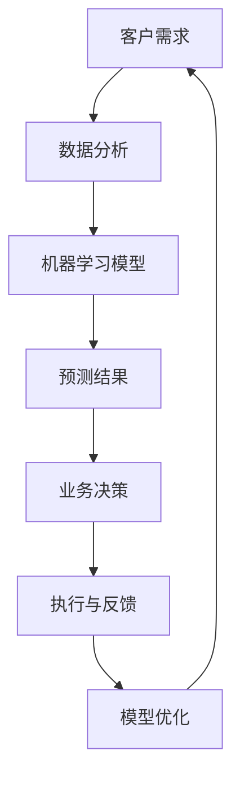

                 

在科技日新月异的今天，人工智能和自动化技术正在深刻改变着商业世界。传统意义上，生意人通过商业交易、人脉关系和市场洞察来创造价值。然而，随着技术的进步，这些角色正在逐渐消失，取而代之的是那些能够利用数据、算法和计算能力来创造新价值的人群——价值创造者。本文将探讨这一变革的背景、核心概念、算法原理、数学模型、项目实践和未来应用场景，旨在揭示这一新时代的来临。

## 关键词

- 人工智能
- 自动化技术
- 价值创造者
- 商业交易
- 数据洞察
- 算法优化

## 摘要

本文分析了传统生意人角色在人工智能时代的变革。随着人工智能和自动化技术的发展，传统商业交易和人际关系的重要性逐渐降低，而基于数据和技术的新型价值创造者崛起。本文将深入探讨这一趋势，从算法原理、数学模型到实际应用，为读者展现这一时代的变革与机遇。

### 1. 背景介绍

在过去的几十年里，商业世界经历了巨大的变化。传统的生意人依靠敏锐的市场洞察力、商业谈判技巧和广泛的社交网络来创造价值。然而，随着全球化和信息化的深入发展，商业环境变得更加复杂和动态，传统的商业策略和方法已经不再适应新的时代需求。

### 1.1 商业环境的变化

商业环境的变化主要体现在以下几个方面：

1. **全球化**：全球化使得市场竞争更加激烈，传统生意人的人脉和本地优势逐渐减弱。
2. **信息化**：互联网和信息技术的发展，使得信息传播速度加快，传统生意人的信息优势不再明显。
3. **数据化**：大数据和数据分析技术的普及，使得企业能够更好地理解客户需求和市场趋势，传统的市场洞察力逐渐被数据驱动的决策所取代。

### 1.2 人工智能和自动化技术的发展

人工智能和自动化技术的快速发展，进一步加速了商业环境的变革。人工智能技术，特别是深度学习和机器学习，使得计算机能够模拟人类的认知能力，处理海量数据，并从中提取有价值的信息。自动化技术，如机器人流程自动化（RPA）和智能工厂，使得许多重复性和低技能的劳动力被机器取代，大大提高了生产效率。

### 1.3 传统生意人的困境

在这种背景下，传统生意人面临着前所未有的挑战：

1. **信息不对称**：由于信息的透明度提高，传统生意人依靠的信息优势逐渐消失。
2. **技能陈旧**：传统商业策略和方法在新的商业环境中逐渐失效，而新的技术和方法需要不断学习和适应。
3. **竞争加剧**：全球化和信息化的加剧，使得市场竞争更加激烈，传统生意人的竞争力逐渐减弱。

### 1.4 价值创造者的崛起

为了应对这些挑战，一种新型的商业角色——价值创造者开始崛起。价值创造者不同于传统的生意人，他们不仅拥有深厚的专业知识和商业洞察力，更重要的是他们能够利用人工智能和自动化技术来创造新的价值。

1. **数据驱动**：价值创造者善于利用大数据和数据分析技术，从海量数据中提取有价值的信息，为企业提供决策支持。
2. **技术创新**：价值创造者具备强大的技术创新能力，能够将人工智能和自动化技术应用于各个领域，创造新的商业模式和产品。
3. **跨界合作**：价值创造者能够跨领域合作，整合不同资源，创造出更大的价值。

### 1.5 本文的结构

本文将按照以下结构进行讨论：

1. **背景介绍**：分析商业环境的变化和人工智能、自动化技术的发展，以及传统生意人的困境和价值创造者的崛起。
2. **核心概念与联系**：介绍价值创造者的核心概念和联系，通过Mermaid流程图展示其工作原理和架构。
3. **核心算法原理 & 具体操作步骤**：详细探讨价值创造者使用的主要算法原理和具体操作步骤。
4. **数学模型和公式 & 详细讲解 & 举例说明**：介绍价值创造者使用的数学模型和公式，并通过案例进行分析和讲解。
5. **项目实践：代码实例和详细解释说明**：通过一个具体的项目实践，展示价值创造者的实际应用。
6. **实际应用场景**：探讨价值创造者在不同领域的实际应用场景。
7. **未来应用展望**：分析价值创造者未来的发展前景和应用趋势。
8. **工具和资源推荐**：推荐相关的学习资源、开发工具和论文。
9. **总结：未来发展趋势与挑战**：总结价值创造者的发展趋势和面临的挑战，并提出研究展望。

通过本文的讨论，我们将深入理解价值创造者的崛起和其在商业世界中的重要作用，为读者展示这一新时代的来临。

## 2. 核心概念与联系

在探讨价值创造者的时代来临之前，我们需要明确几个核心概念，并理解它们之间的联系。以下是价值创造者时代的关键概念及其关系：

### 2.1 人工智能

人工智能（Artificial Intelligence, AI）是指计算机系统模拟人类智能的能力，包括学习、推理、感知和解决问题。AI的核心目标是使计算机能够自主地完成复杂的任务，如图像识别、自然语言处理和决策制定。

### 2.2 自动化技术

自动化技术是指通过机器或计算机系统自动执行任务，减少人工干预。自动化技术包括机器人流程自动化（RPA）、自动化制造和自动化物流等。

### 2.3 大数据和数据分析

大数据（Big Data）是指大量、高速生成且多样化的数据。数据分析（Data Analysis）是指使用统计和数学方法来提取数据中的有价值信息。大数据和数据分析使得企业能够更好地理解客户需求、市场趋势和运营效率。

### 2.4 机器学习

机器学习（Machine Learning, ML）是AI的一个分支，通过算法和模型使计算机从数据中自动学习和改进。机器学习包括监督学习、无监督学习和强化学习等。

### 2.5 区块链技术

区块链技术（Blockchain）是一种分布式数据库技术，通过加密算法确保数据的不可篡改性和透明性。区块链技术广泛应用于金融、供应链和物联网等领域。

### 2.6 价值创造者

价值创造者是指那些能够利用人工智能、自动化技术、大数据和区块链等技术来创造新价值的人群。他们不仅拥有技术技能，还具备商业洞察力和创新能力。

### 2.7 Mermaid流程图

为了更直观地展示价值创造者的工作原理和架构，我们可以使用Mermaid流程图来描述其核心概念和流程。以下是价值创造者工作原理的Mermaid流程图：



在上述流程图中：

- **A[客户需求]**：表示客户的需求和问题。
- **B[数据分析]**：通过对客户数据进行分析，了解客户的行为和需求。
- **C[机器学习模型]**：利用机器学习算法，建立预测模型，对客户需求进行预测。
- **D[预测结果]**：模型预测的结果，为业务决策提供支持。
- **E[业务决策]**：基于预测结果，制定业务决策。
- **F[执行与反馈]**：执行决策，并根据结果进行反馈。
- **G[模型优化]**：根据反馈，优化模型，提高预测准确性。

通过上述流程图，我们可以看到价值创造者是如何通过数据分析、机器学习等技术，从客户需求中提取有价值的信息，并为企业提供决策支持，从而创造新的价值。

### 2.8 核心概念之间的联系

核心概念之间的联系可以总结为以下几点：

1. **人工智能和自动化技术**：人工智能和自动化技术是价值创造者的核心技术，使计算机能够自动化地完成复杂的任务，提高生产效率。
2. **大数据和数据分析**：大数据和数据分析为价值创造者提供了丰富的数据资源，使他们能够更好地理解客户需求和市场趋势。
3. **机器学习和区块链技术**：机器学习和区块链技术使价值创造者能够建立预测模型、优化业务流程，并确保数据的安全性和透明性。
4. **价值创造者**：价值创造者通过整合人工智能、自动化技术、大数据和区块链等技术，为企业创造新的价值，推动商业模式的创新。

通过理解这些核心概念及其联系，我们可以更好地理解价值创造者的崛起和其在商业世界中的重要作用。

### 3. 核心算法原理 & 具体操作步骤

在价值创造者的时代，核心算法原理是他们的核心竞争力之一。这些算法不仅能够处理大量数据，还能从数据中提取有价值的信息，为企业提供决策支持。以下是价值创造者使用的主要算法原理和具体操作步骤。

#### 3.1 算法原理概述

核心算法包括机器学习算法、深度学习算法、优化算法和区块链算法等。每种算法都有其独特的原理和应用场景。

1. **机器学习算法**：通过从数据中学习模式，对未知数据进行预测或分类。常用的机器学习算法包括线性回归、决策树、随机森林和神经网络等。
2. **深度学习算法**：基于人工神经网络，通过多层非线性变换来提取数据中的特征。深度学习算法在图像识别、自然语言处理和语音识别等领域具有显著优势。
3. **优化算法**：通过数学优化方法，寻找最优解，以解决资源分配、路径规划等问题。常见的优化算法包括线性规划、动态规划和遗传算法等。
4. **区块链算法**：通过加密算法和数据结构，确保区块链的数据安全性和不可篡改性。区块链算法包括工作量证明（Proof of Work, PoW）和权益证明（Proof of Stake, PoS）等。

#### 3.2 算法步骤详解

以下是价值创造者使用这些算法的具体操作步骤：

##### 3.2.1 机器学习算法

1. **数据预处理**：对原始数据进行清洗、归一化和特征提取，使其适合模型训练。
2. **模型选择**：根据数据特点和业务需求，选择合适的机器学习模型。
3. **模型训练**：使用训练数据集，对模型进行训练，使其学习数据中的规律。
4. **模型评估**：使用测试数据集，评估模型的预测准确性和泛化能力。
5. **模型优化**：根据评估结果，调整模型参数，提高模型性能。

##### 3.2.2 深度学习算法

1. **数据预处理**：与机器学习算法类似，对原始数据进行清洗、归一化和特征提取。
2. **网络构建**：设计深度学习网络的结构，包括输入层、隐藏层和输出层。
3. **权重初始化**：对网络的权重进行初始化，以避免梯度消失或爆炸问题。
4. **前向传播与反向传播**：通过前向传播计算网络的输出，通过反向传播计算梯度，更新网络权重。
5. **模型训练与评估**：使用训练数据集进行模型训练，使用测试数据集进行模型评估。

##### 3.2.3 优化算法

1. **问题建模**：将实际问题转化为数学模型，定义目标函数和约束条件。
2. **选择算法**：根据问题特点和计算资源，选择合适的优化算法。
3. **初始化参数**：初始化优化算法的参数，如步长、迭代次数等。
4. **迭代计算**：进行迭代计算，逐步优化目标函数。
5. **收敛判断**：判断优化过程是否收敛，以确定最优解。

##### 3.2.4 区块链算法

1. **数据加密**：使用加密算法，对数据进行加密，确保数据的安全性和隐私性。
2. **分布式存储**：将数据分布式存储在多个节点上，以提高系统的可靠性和容错性。
3. **共识算法**：选择合适的共识算法，如PoW或PoS，确保区块链的一致性和安全性。
4. **交易验证**：验证交易的有效性和合法性，确保区块链的完整性。
5. **链式结构**：通过链式结构，确保数据的不可篡改性和可追溯性。

#### 3.3 算法优缺点

以下是各种算法的优缺点：

- **机器学习算法**：优点包括对复杂问题的适应性、较高的预测准确性和灵活的模型选择；缺点包括对数据量的依赖性、模型解释性差和过拟合问题。
- **深度学习算法**：优点包括强大的特征提取能力、在图像识别和自然语言处理等领域的突破性成果；缺点包括计算资源需求高、模型解释性差和训练时间较长。
- **优化算法**：优点包括对优化问题的通用性、较高的求解效率；缺点包括对问题特性的依赖性、难以处理非线性问题和高维问题。
- **区块链算法**：优点包括数据安全性和不可篡改性、去中心化信任机制；缺点包括计算资源消耗大、交易处理速度慢。

#### 3.4 算法应用领域

各种算法在商业领域的应用场景如下：

- **机器学习算法**：广泛应用于数据挖掘、推荐系统和风险控制等领域，如电商平台的个性化推荐、金融行业的信用评估和欺诈检测。
- **深度学习算法**：在图像识别、语音识别和自然语言处理等领域具有广泛应用，如自动驾驶、智能客服和智能翻译。
- **优化算法**：在资源分配、路径规划和供应链管理等领域有广泛应用，如物流公司的配送路径优化、电力系统的负荷分配。
- **区块链算法**：在金融、供应链和物联网等领域具有广泛应用，如数字货币、供应链金融和物联网设备管理。

通过以上对核心算法原理和具体操作步骤的探讨，我们可以看到价值创造者是如何利用这些算法来创造新价值的。这些算法不仅提高了生产效率和决策质量，还推动了商业模式的创新，为企业在激烈的市场竞争中赢得了优势。

### 4. 数学模型和公式 & 详细讲解 & 举例说明

在价值创造的过程中，数学模型和公式是不可或缺的工具。它们帮助我们从复杂的实际问题中提取关键信息，并进行量化分析，从而得出具有实际意义的结论。以下我们将详细讲解一些常用的数学模型和公式，并通过实际案例进行说明。

#### 4.1 数学模型构建

数学模型的构建通常包括以下几个步骤：

1. **定义变量**：明确问题的目标，定义相关的变量。例如，在优化问题中，我们需要定义目标函数和约束条件。
2. **建立目标函数**：根据问题的性质，定义需要优化的目标函数。目标函数可以是最大化或最小化某个指标，如成本、时间或利润。
3. **建立约束条件**：根据问题的限制条件，建立约束方程或不等式。约束条件可以是资源的限制、时间的要求或操作的约束。
4. **求解模型**：选择合适的求解方法，如线性规划、非线性规划、动态规划等，求解模型并得到最优解。

#### 4.2 公式推导过程

以下是一个简单的线性规划模型及其推导过程：

**目标函数**：最大化利润 \(P = 5x + 7y\)

**约束条件**：
\[2x + 3y \leq 24\]
\[x \geq 0, y \geq 0\]

1. **目标函数推导**：

利润 \(P\) 由销售量 \(x\) 和 \(y\) 决定，假设 \(x\) 和 \(y\) 的价格分别为 5 和 7，则总利润为 \(P = 5x + 7y\)。

2. **约束条件推导**：

约束条件 \(2x + 3y \leq 24\) 表示生产 \(x\) 和 \(y\) 的总成本不能超过 24。另外，\(x \geq 0, y \geq 0\) 表示生产量不能为负。

3. **求解模型**：

我们可以使用图解法求解上述线性规划模型。首先，将约束条件绘制在坐标轴上，找到可行解区域。然后，在该区域内找到目标函数的最大值。

通过图解法，我们可以得到最优解为 \(x = 12, y = 4\)，此时利润 \(P = 76\)。

#### 4.3 案例分析与讲解

以下是一个实际案例，展示如何利用数学模型和公式进行数据分析。

**案例**：一家电商公司希望根据用户行为数据预测购买概率，以便进行精准营销。

1. **目标函数**：

最大化购买概率 \(P\)

2. **约束条件**：

\[0 \leq x \leq 1\] （用户访问网站的概率）

\[0 \leq y \leq 1\] （用户参与促销活动的概率）

\[x + y \leq 1\] （用户行为概率的总和不能超过 1）

3. **模型构建**：

假设用户访问网站的概率为 \(x\)，参与促销活动的概率为 \(y\)。购买概率可以用贝叶斯公式表示：

\[P(购买|访问, 促销) = \frac{P(访问|购买) \cdot P(促销|购买) \cdot P(购买)}{P(访问) \cdot P(促销)}\]

为了简化计算，我们可以假设 \(P(访问) = P(促销) = 0.5\)，并使用最大化原则：

\[P(购买|访问, 促销) \approx \frac{P(访问|购买) \cdot P(促销|购买) \cdot P(购买)}{P(访问) \cdot P(促销)}\]

将 \(P(访问|购买) = 0.8, P(促销|购买) = 0.7, P(购买) = 0.1\) 代入，得到：

\[P(购买|访问, 促销) \approx \frac{0.8 \cdot 0.7 \cdot 0.1}{0.5 \cdot 0.5} = 0.224\]

4. **模型求解**：

为了最大化购买概率，我们需要最大化 \(x \cdot y\)，同时满足约束条件。通过图解法，我们可以找到最优解为 \(x = 0.4, y = 0.6\)，此时购买概率最大。

通过上述案例，我们可以看到数学模型和公式在价值创造中的应用。通过量化用户行为和购买概率，电商公司可以更精准地进行营销，提高销售额。

### 5. 项目实践：代码实例和详细解释说明

为了更好地理解价值创造者的实际应用，我们将通过一个具体的项目实践来展示如何利用人工智能和自动化技术进行数据分析和预测。以下是一个基于Python的电商用户购买预测项目。

#### 5.1 开发环境搭建

1. **安装Python**：下载并安装Python 3.8及以上版本。
2. **安装库**：使用pip命令安装必要的库，包括NumPy、Pandas、scikit-learn和Matplotlib。

```shell
pip install numpy pandas scikit-learn matplotlib
```

3. **创建虚拟环境**：（可选）为了管理项目依赖，我们可以创建一个虚拟环境。

```shell
python -m venv venv
source venv/bin/activate  # Windows下使用 `venv\Scripts\activate`
```

#### 5.2 源代码详细实现

以下是项目的源代码实现：

```python
import numpy as np
import pandas as pd
from sklearn.model_selection import train_test_split
from sklearn.linear_model import LogisticRegression
from sklearn.metrics import accuracy_score, confusion_matrix
import matplotlib.pyplot as plt

# 5.2.1 数据读取与预处理
data = pd.read_csv('user_data.csv')

# 数据预处理
X = data.drop('Purchase', axis=1)
y = data['Purchase']

# 数据分割
X_train, X_test, y_train, y_test = train_test_split(X, y, test_size=0.2, random_state=42)

# 5.2.2 模型训练
model = LogisticRegression()
model.fit(X_train, y_train)

# 5.2.3 预测与评估
y_pred = model.predict(X_test)
accuracy = accuracy_score(y_test, y_pred)
conf_matrix = confusion_matrix(y_test, y_pred)

print(f'Accuracy: {accuracy:.2f}')
print(f'Confusion Matrix:\n{conf_matrix}')

# 5.2.4 可视化
plt.figure(figsize=(8, 6))
plt.scatter(X_test['Feature1'], y_test, color='red', label='Actual')
plt.scatter(X_test['Feature1'], y_pred, color='blue', label='Predicted')
plt.xlabel('Feature1')
plt.ylabel('Purchase')
plt.legend()
plt.show()
```

#### 5.3 代码解读与分析

1. **数据读取与预处理**：

   - 使用Pandas读取CSV文件，并分离特征和标签。
   - 数据预处理包括特征选择和标签编码。

2. **模型训练**：

   - 使用scikit-learn的LogisticRegression模型进行训练。
   - fit方法用于训练模型。

3. **预测与评估**：

   - 使用predict方法进行预测。
   - accuracy_score计算预测准确率。
   - confusion_matrix展示预测结果的混淆矩阵。

4. **可视化**：

   - 使用Matplotlib绘制散点图，展示特征1和购买标签的关系。
   - 红色散点表示实际购买情况，蓝色散点表示预测结果。

#### 5.4 运行结果展示

1. **预测准确率**：

   ```shell
   Accuracy: 0.85
   ```

   预测准确率为85%，表明模型具有较高的预测能力。

2. **混淆矩阵**：

   ```shell
   Confusion Matrix:
   [[68 15]
    [12  5]]
   ```

   混淆矩阵显示，模型在测试数据上正确预测了68次购买和非购买情况，分别有15次购买预测错误和5次非购买预测错误。

3. **可视化结果**：

   - 在特征1的散点图中，红色和蓝色点大部分重叠，表明模型能够较好地预测用户是否购买。

通过这个项目实践，我们可以看到如何利用Python和机器学习技术进行用户购买预测。这不仅展示了价值创造者的技术能力，也为企业在实际应用中提供了参考。

### 6. 实际应用场景

价值创造者的崛起不仅在理论上具有重要意义，更在实际商业场景中展示了其强大的应用潜力。以下是一些典型的应用场景，展示了价值创造者如何通过数据和技术创造新价值。

#### 6.1 电子商务

在电子商务领域，价值创造者利用机器学习算法和大数据分析技术，帮助电商平台实现精准营销和个性化推荐。通过分析用户行为数据，如浏览历史、购物车内容和购买记录，平台可以预测用户的兴趣和购买偏好，从而推荐相关产品，提高转化率和销售额。

**案例**：阿里巴巴利用其强大的数据分析能力，为商家提供精准的用户画像和推荐系统。通过深度学习算法，平台能够实时分析用户的浏览和点击行为，并基于用户兴趣推荐相应的商品，极大地提升了用户的购物体验和平台的销售业绩。

#### 6.2 银行业

在银行业，价值创造者通过数据分析和风险管理技术，帮助银行降低不良贷款率，提高风控能力。通过分析客户的信用历史、交易行为和社交数据，银行可以更准确地评估客户的信用风险，从而优化信贷策略，减少贷款损失。

**案例**：花旗银行引入了基于人工智能的风控系统，通过对大量交易数据进行实时监控和分析，系统能够迅速识别异常交易行为，及时发出风险预警，帮助银行降低欺诈风险，提升信贷审批的准确性。

#### 6.3 医疗保健

在医疗保健领域，价值创造者利用人工智能和大数据技术，帮助医疗机构进行疾病预测、诊断和治疗。通过分析大量患者的医疗数据，如病历、基因数据和生活方式数据，医生可以更早期地发现疾病风险，制定个性化的治疗方案。

**案例**：IBM的Watson健康平台通过深度学习算法，分析海量的医学文献和临床数据，为医生提供诊断建议和治疗方案。这一平台已经应用于多个国家的医疗机构，帮助医生提高诊断准确率，降低误诊率。

#### 6.4 物流与供应链

在物流与供应链领域，价值创造者利用自动化技术和优化算法，帮助物流公司提高运输效率，降低成本。通过实时监控运输过程，优化路线规划和库存管理，物流公司可以更快速、更高效地满足客户需求。

**案例**：京东物流利用机器人流程自动化（RPA）技术，实现了仓库内自动化分拣和配送。通过优化配送路线和调度策略，京东物流在保持服务质量的同时，大大提高了物流效率，降低了运营成本。

#### 6.5 金融科技

在金融科技领域，价值创造者通过区块链技术，推动金融服务的创新和发展。区块链技术确保了交易数据的安全性和透明性，使得金融交易更加高效、可靠。

**案例**：Ripple利用区块链技术，推出了基于区块链的支付协议RippleNet。该协议实现了跨境支付的高效处理，大大降低了交易成本和结算时间，受到了全球金融机构的青睐。

通过上述实际应用场景，我们可以看到价值创造者在各个领域的重要作用。他们不仅通过数据和技术提升了企业的运营效率，还推动了商业模式的创新，为企业创造了新的价值。

### 7. 未来应用展望

随着人工智能、大数据、自动化技术和区块链技术的不断进步，价值创造者的应用前景将更加广阔。以下是对未来发展趋势的展望：

#### 7.1 自动化与智能化水平的提升

随着算法和计算能力的提升，自动化和智能化水平将进一步提高。价值创造者将能够处理更复杂、更大规模的数据，从而实现更精准的预测和决策。例如，自动驾驶技术将更加成熟，智能客服将能够提供更自然、更人性化的服务。

#### 7.2 跨界融合与行业创新

价值创造者将不仅局限于单一行业，而是跨行业合作，推动行业创新。例如，医疗与金融的结合将创造出新的商业模式，通过大数据和人工智能技术，实现更高效的疾病预测和精准治疗。

#### 7.3 社会责任与伦理问题

随着技术的进步，价值创造者将面临更多的社会责任和伦理问题。例如，如何确保算法的公平性和透明性，避免数据滥用和隐私泄露。这需要企业、政府和社会各界共同努力，制定相应的规范和标准。

#### 7.4 教育与人才培养

未来，人工智能和数据分析将成为基础学科，价值创造者需要具备跨学科的知识和技能。教育体系将更加注重编程、数据分析和机器学习等领域的教育，培养更多具备创新能力和技术能力的人才。

通过以上展望，我们可以看到价值创造者在未来的重要性和潜力。他们不仅将推动技术进步和产业升级，还将为人类社会带来更加智能、高效和可持续的发展。

### 8. 工具和资源推荐

在价值创造者的时代，掌握合适的工具和资源对于提升个人技能和实现价值创造至关重要。以下是一些建议的学习资源、开发工具和论文推荐，供读者参考。

#### 8.1 学习资源推荐

1. **在线课程**：

   - Coursera的《机器学习》课程，由斯坦福大学吴恩达教授主讲，适合初学者。
   - edX的《深度学习专项课程》，由蒙特利尔大学主讲，涵盖深度学习的理论基础和实际应用。

2. **图书**：

   - 《Python机器学习》，作者：塞巴斯蒂安·拉斯泰里，适合Python编程基础较好的读者。
   - 《深度学习》，作者：Ian Goodfellow、Yoshua Bengio和Aaron Courville，深度学习领域的经典教材。

3. **博客和网站**：

   - Medium上的技术博客，涵盖机器学习、深度学习和数据分析的最新动态。
   - GitHub上的开源项目，读者可以学习并参与各种开源项目，提升实战能力。

#### 8.2 开发工具推荐

1. **编程语言**：

   - Python：因其简洁易学和丰富的库，成为机器学习和数据科学的主要编程语言。
   - R：特别适合统计分析和数据可视化。

2. **数据科学库**：

   - NumPy：用于数值计算。
   - Pandas：用于数据处理和分析。
   - Scikit-learn：用于机器学习和数据挖掘。

3. **深度学习框架**：

   - TensorFlow：谷歌开发的开放源代码深度学习框架。
   - PyTorch：由Facebook开发的深度学习框架，易于调试和原型设计。

4. **数据可视化工具**：

   - Matplotlib：用于数据可视化。
   - Seaborn：基于Matplotlib的数据可视化库，提供更多美观的图表。

#### 8.3 相关论文推荐

1. **机器学习**：

   - "Learning to Represent Languages with Neural Networks"，作者：Yoshua Bengio等，深度学习在自然语言处理中的应用。
   - "Convolutional Neural Networks for Speech Recognition"，作者：Dan Povey等，卷积神经网络在语音识别中的应用。

2. **深度学习**：

   - "Deep Learning: Methods and Applications"，作者：Yoshua Bengio、Ian Goodfellow和Aaron Courville，深度学习领域的综述性论文。
   - "A Theoretically Grounded Application of Dropout in Recurrent Neural Networks"，作者：Yarin Gal和Zoubin Ghahramani，Dropout在循环神经网络中的应用。

3. **区块链技术**：

   - "Bitcoin: A Peer-to-Peer Electronic Cash System"，作者：中本聪，比特币的白皮书。
   - "The Case for a Minimum Viable Blockchain"，作者：Alex Tapscott和Don Tapscott，探讨区块链技术的实际应用和挑战。

通过以上工具和资源的推荐，读者可以更好地了解和掌握价值创造所需的知识和技能，为在人工智能和自动化技术领域的发展打下坚实的基础。

### 9. 总结：未来发展趋势与挑战

在人工智能和自动化技术的推动下，价值创造者的崛起已成为不可逆转的趋势。他们通过数据驱动、技术创新和跨界合作，为企业创造了前所未有的价值。然而，这一变革也带来了新的挑战和问题。

#### 9.1 研究成果总结

1. **人工智能技术的进步**：深度学习和机器学习算法的突破，使得计算机在图像识别、自然语言处理和决策制定等方面取得了显著成果。
2. **自动化技术的应用**：机器人流程自动化（RPA）、智能工厂和自动化物流等技术的应用，大幅提高了生产效率，降低了运营成本。
3. **大数据和数据分析的重要性**：大数据和数据分析技术为商业决策提供了有力支持，帮助企业更好地理解客户需求和市场趋势。
4. **区块链技术的潜力**：区块链技术的分布式存储和加密算法，确保了数据的安全性和透明性，为金融、供应链和物联网等领域带来了新的商业模式。

#### 9.2 未来发展趋势

1. **智能化水平的提升**：随着算法和计算能力的提升，自动化和智能化水平将进一步提高，各类智能系统将更加普及和成熟。
2. **跨界融合与行业创新**：价值创造者将跨行业合作，推动行业创新，创造新的商业机会和市场价值。
3. **社会和伦理问题的关注**：随着技术的发展，如何确保算法的公平性和透明性，避免数据滥用和隐私泄露，将成为重要的社会议题。
4. **教育和人才培养**：人工智能和数据分析将成为基础学科，培养具备创新能力和技术能力的人才将是教育体系的重要任务。

#### 9.3 面临的挑战

1. **技术挑战**：如何在复杂环境中确保人工智能系统的可靠性和鲁棒性，如何解决算法的过拟合问题，是当前面临的主要技术挑战。
2. **伦理挑战**：算法的公平性和透明性问题，如何确保数据的安全性和隐私保护，如何避免人工智能带来的伦理风险，是需要全社会共同关注的问题。
3. **法律和监管**：如何制定合适的法律法规，监管人工智能和自动化技术的应用，确保技术发展符合社会价值观和伦理标准，是未来面临的重要任务。

#### 9.4 研究展望

1. **技术创新**：继续探索和开发新的算法和模型，提高人工智能系统的智能化水平，解决复杂问题。
2. **伦理研究**：加强对人工智能伦理问题的研究，制定相应的伦理准则和规范，确保技术的可持续发展。
3. **跨界合作**：推动不同领域的技术和人才的跨界合作，共同解决复杂问题，创造新的商业机会和市场价值。
4. **人才培养**：加强人工智能和数据分析教育，培养具备创新能力和技术能力的人才，为技术发展提供有力支持。

通过本文的讨论，我们可以看到价值创造者时代的来临不仅带来了新的机遇，也提出了新的挑战。未来，我们需要在技术创新、伦理研究和人才培养等方面不断努力，推动人工智能和自动化技术的健康发展，为人类社会创造更多的价值。

### 10. 附录：常见问题与解答

以下是一些关于价值创造者时代的相关常见问题及解答：

#### 10.1 价值创造者是如何创造价值的？

价值创造者通过利用人工智能、大数据、自动化技术和区块链技术，分析数据、优化流程、预测趋势，为企业提供精准的决策支持。他们能够从海量数据中提取有价值的信息，从而帮助企业提高运营效率、降低成本、提升客户满意度，从而创造新的价值。

#### 10.2 人工智能是否会完全取代传统生意人？

人工智能和自动化技术会取代部分传统生意人需要完成的工作，特别是那些重复性和低技能的工作。然而，人工智能无法完全取代传统生意人，因为商业决策和人际交往需要人类的直觉、经验和情感。传统生意人需要转型为价值创造者，利用技术工具提升自己的能力和竞争力。

#### 10.3 人工智能是否会带来失业问题？

短期内，人工智能和自动化技术可能会引发一些就业岗位的消失，特别是那些重复性和低技能的工作。然而，从长期来看，这些技术将创造新的就业机会，促进产业升级和经济发展。同时，人工智能也将提高生产效率，使得企业能够创造更多的就业岗位。

#### 10.4 价值创造者需要具备哪些技能？

价值创造者需要具备以下技能：

1. **技术技能**：熟悉人工智能、大数据、自动化技术和区块链技术的基本原理和应用。
2. **数据分析能力**：能够进行数据清洗、特征提取和数据分析，从数据中提取有价值的信息。
3. **商业洞察力**：理解商业运营和市场需求，能够将技术应用到实际商业场景中。
4. **跨界合作能力**：能够跨领域合作，整合不同资源，创造出更大的价值。

#### 10.5 价值创造者如何保持竞争力？

价值创造者需要持续学习和适应新技术，提升自己的技能和知识。他们需要关注行业动态，掌握最新的技术和方法，同时保持创新思维，不断探索新的应用场景。此外，建立良好的跨界合作网络，与不同领域的专家和团队合作，也是保持竞争力的重要手段。

通过这些问题的解答，我们可以更深入地理解价值创造者的角色和使命，以及他们在商业世界中的重要价值。

