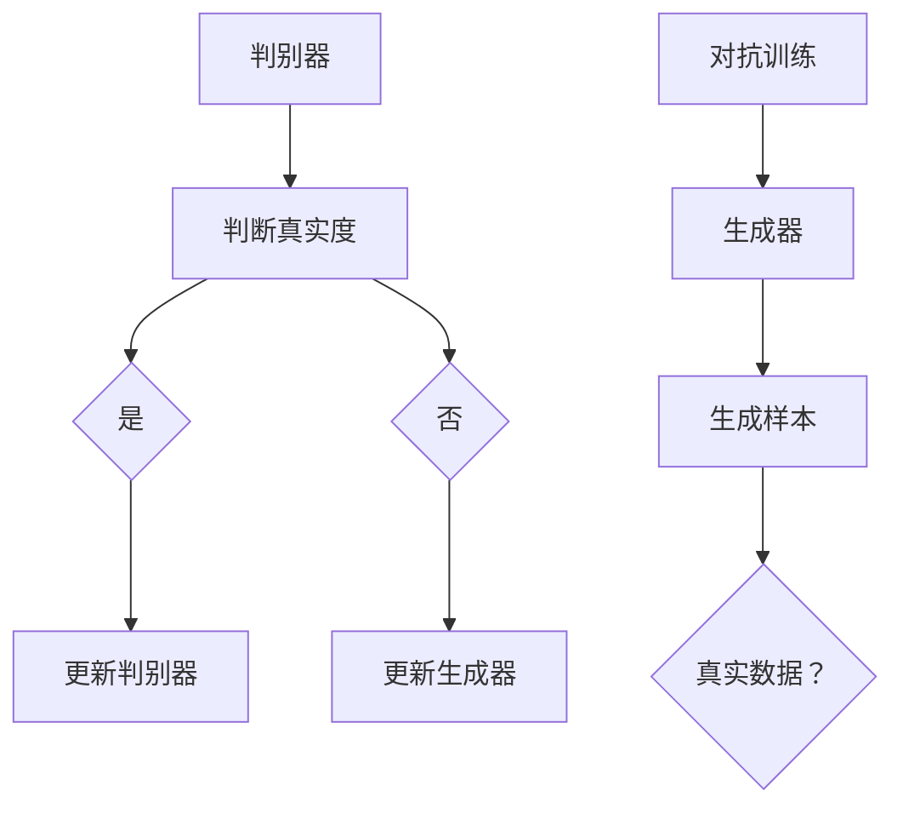

                 

关键词：生成对抗网络，GAN，深度学习，图像生成，对抗训练，人工智能，机器学习。

## 摘要

生成对抗网络（Generative Adversarial Network，GAN）是一种深度学习框架，它通过两个相互对抗的神经网络——生成器和判别器的互动来生成高质量的逼真数据。本文将详细介绍GAN的核心概念、数学模型、算法原理、优缺点及其在不同领域的应用。此外，还将探讨GAN在项目实践中的代码实现、运行结果展示，并提供未来应用展望和面临挑战的见解。

## 1. 背景介绍

### GAN的起源

生成对抗网络最早由Ian Goodfellow等人在2014年提出。在此之前，生成模型（如变分自编码器VAE）和判别模型（如深度卷积网络）已被广泛研究，但单独使用这些模型在生成高质量数据方面存在很大挑战。GAN通过将生成器和判别器置于一个共同的学习框架中，实现了数据生成的新突破。

### GAN的动机

GAN的主要动机是利用生成器和判别器的对抗性训练，通过不断的博弈，使得生成器能够生成越来越接近真实数据的样本，而判别器则能够更好地区分真实数据和生成数据。这种对抗训练的机制使得GAN在图像生成、自然语言处理等领域表现出强大的生成能力。

## 2. 核心概念与联系

### 2.1 生成器（Generator）

生成器（Generator）是GAN中的一个神经网络，其目的是生成与真实数据分布相似的数据。生成器通常接受一个随机噪声向量作为输入，通过神经网络的处理，生成类似于真实数据的样本。

### 2.2 判别器（Discriminator）

判别器（Discriminator）是GAN中的另一个神经网络，其目的是区分输入数据是真实数据还是生成数据。判别器接受输入数据，通过神经网络的处理，输出一个概率值，表示输入数据的真实度。

### 2.3 对抗训练（Adversarial Training）

GAN的训练过程是基于生成器和判别器的对抗训练。在训练过程中，生成器和判别器相互对抗，生成器试图生成更真实的数据，而判别器则试图更准确地判断输入数据的真实度。这种对抗性训练机制使得GAN能够在数据生成任务中取得很好的效果。

### 2.4 Mermaid 流程图



## 3. 核心算法原理 & 具体操作步骤

### 3.1 算法原理概述

GAN的核心算法原理是基于生成器和判别器的对抗训练。生成器通过生成与真实数据分布相似的数据，而判别器则通过判断输入数据的真实度来更新自身的权重。在训练过程中，生成器和判别器相互对抗，生成器试图生成更真实的数据，而判别器则试图更准确地判断输入数据的真实度。

### 3.2 算法步骤详解

1. **初始化生成器和判别器**：生成器和判别器都是神经网络，初始化时可以随机初始化或使用预训练的权重。

2. **生成器生成样本**：生成器接受一个随机噪声向量作为输入，通过神经网络的处理，生成类似于真实数据的样本。

3. **判别器判断真实度**：判别器接受生成器生成的样本和真实数据，通过神经网络的处理，输出一个概率值，表示输入数据的真实度。

4. **更新生成器和判别器**：根据生成器和判别器的输出，使用梯度下降算法更新生成器和判别器的权重。

5. **重复步骤2-4**：不断重复步骤2-4，使得生成器和判别器的权重不断更新，直至达到预定的训练轮次或生成器生成的样本质量满足要求。

### 3.3 算法优缺点

#### 优点

1. **生成质量高**：GAN能够生成高质量、逼真的数据样本，在图像生成、自然语言处理等领域表现出强大的生成能力。

2. **自适应性强**：GAN通过生成器和判别器的对抗训练，能够自适应地调整生成器的生成策略，以应对判别器的挑战。

3. **适用范围广**：GAN可以应用于各种数据生成任务，如图像、音频、文本等。

#### 缺点

1. **训练不稳定**：GAN的训练过程容易陷入局部最小值，导致训练不稳定。

2. **训练时间长**：由于GAN需要通过大量的迭代进行训练，因此训练时间较长。

### 3.4 算法应用领域

GAN在图像生成、自然语言处理、音频生成、视频生成等领域有广泛的应用。以下是一些典型的应用案例：

1. **图像生成**：GAN可以生成高质量的人脸、风景、动物等图像。

2. **自然语言处理**：GAN可以生成逼真的文本，应用于文本生成、机器翻译等领域。

3. **音频生成**：GAN可以生成高质量的音频，如音乐、语音等。

4. **视频生成**：GAN可以生成高质量的视频，如视频超分辨率、视频预测等。

## 4. 数学模型和公式

### 4.1 数学模型构建

GAN的数学模型主要包括生成器G、判别器D和对抗损失函数。

生成器G的输入是一个随机噪声向量\( z \)，输出是一个生成样本\( x_G \)。判别器D的输入是一个真实样本\( x \)和一个生成样本\( x_G \)，输出是一个概率值\( p(x) \)，表示输入数据的真实度。

对抗损失函数通常采用二元交叉熵（Binary Cross-Entropy）损失函数，其表达式为：

$$
L_G = -\frac{1}{N}\sum_{i=1}^{N}\left( \log(D(x)) + \log(1 - D(G(z))) \right)
$$

$$
L_D = -\frac{1}{N}\sum_{i=1}^{N}\left( \log(D(x)) + \log(1 - D(G(z))) \right)
$$

其中，\( N \)是样本数量。

### 4.2 公式推导过程

GAN的训练过程基于生成器和判别器的对抗训练。首先，生成器生成一个随机噪声向量\( z \)，通过神经网络G的处理，得到一个生成样本\( x_G \)。然后，判别器D同时接受真实样本\( x \)和生成样本\( x_G \)，通过神经网络的处理，输出一个概率值\( p(x) \)，表示输入数据的真实度。

在训练过程中，生成器和判别器相互对抗，生成器试图生成更真实的数据，使得判别器无法准确判断输入数据的真实度。而判别器则试图更准确地判断输入数据的真实度，从而识别出生成器生成的数据。

### 4.3 案例分析与讲解

以图像生成为例，假设我们要生成一张人脸图像。首先，我们随机生成一个噪声向量\( z \)，然后通过生成器G将其转化为一张人脸图像\( x_G \)。接着，我们将真实人脸图像\( x \)和生成人脸图像\( x_G \)输入判别器D，判别器D会输出一个概率值\( p(x) \)，表示输入数据的真实度。

在训练过程中，我们不断调整生成器G和判别器D的权重，使得生成器G生成的图像越来越真实，而判别器D能够更准确地判断输入数据的真实度。最终，当生成器G生成的图像质量达到预定的要求时，GAN的训练过程结束。

## 5. 项目实践：代码实例和详细解释说明

### 5.1 开发环境搭建

为了实现GAN的图像生成，我们需要搭建一个合适的开发环境。以下是一个简单的开发环境搭建步骤：

1. **安装Python**：确保Python版本为3.7及以上。
2. **安装TensorFlow**：使用pip安装TensorFlow库。
3. **准备数据集**：从互联网上下载一个人脸数据集，如CelebA数据集。

### 5.2 源代码详细实现

以下是使用TensorFlow实现GAN的图像生成的一个简单示例：

```python
import tensorflow as tf
from tensorflow.keras.layers import Dense, Flatten, Reshape
from tensorflow.keras.models import Model
from tensorflow.keras.datasets import mnist

# 设置超参数
batch_size = 128
z_dim = 100

# 定义生成器
def build_generator(z_dim):
    model = tf.keras.Sequential([
        Dense(256, activation="relu", input_shape=(z_dim,)),
        Dense(512, activation="relu"),
        Dense(1024, activation="relu"),
        Dense(784, activation="sigmoid"),
        Reshape((28, 28, 1))
    ])
    return model

# 定义判别器
def build_discriminator(img_shape):
    model = tf.keras.Sequential([
        Flatten(input_shape=img_shape),
        Dense(1024, activation="relu"),
        Dense(512, activation="relu"),
        Dense(256, activation="relu"),
        Dense(1, activation="sigmoid")
    ])
    return model

# 定义GAN模型
def build_gan(generator, discriminator):
    model = tf.keras.Sequential([
        generator,
        discriminator
    ])
    return model

# 载入MNIST数据集
(x_train, _), (_, _) = mnist.load_data()
x_train = x_train / 255.0
x_train = x_train.astype("float32")

# 编码和解码模型
generator = build_generator(z_dim)
discriminator = build_discriminator(x_train.shape[1:])
gan = build_gan(generator, discriminator)

# 编写训练步骤
def train_gan(generator, discriminator, gan, x_train, batch_size, z_dim, num_epochs):
    for epoch in range(num_epochs):
        for _ in range(x_train.shape[0] // batch_size):
            # 获取一个batch的数据
            batch = x_train[np.random.randint(0, x_train.shape[0], size=batch_size)]

            # 训练判别器
            with tf.GradientTape() as tape:
                # 计算生成样本
                z = tf.random.normal([batch_size, z_dim])
                generated_images = generator(z)
                # 计算生成样本的判别结果
                d_real_output = discriminator(batch)
                d_generated_output = discriminator(generated_images)
                # 计算判别器的损失
                d_loss = tf.reduce_mean(d_real_output) - tf.reduce_mean(d_generated_output)

            grads = tape.gradient(d_loss, discriminator.trainable_variables)
            discriminator.optimizer.apply_gradients(zip(grads, discriminator.trainable_variables))

            # 训练生成器
            with tf.GradientTape() as tape:
                # 计算生成样本的判别结果
                z = tf.random.normal([batch_size, z_dim])
                generated_images = generator(z)
                # 计算生成样本的判别结果
                g_loss = tf.reduce_mean(discriminator(generated_images))

            grads = tape.gradient(g_loss, generator.trainable_variables)
            generator.optimizer.apply_gradients(zip(grads, generator.trainable_variables))

            print(f"Epoch: {epoch}, Discriminator Loss: {d_loss.numpy()}, Generator Loss: {g_loss.numpy()}")

        # 保存模型权重
        generator.save_weights(f"generator_epoch_{epoch}.h5")
        discriminator.save_weights(f"discriminator_epoch_{epoch}.h5")

# 训练GAN
train_gan(generator, discriminator, gan, x_train, batch_size, z_dim, num_epochs=50)

# 使用生成器生成图像
def generate_images(generator, num_images):
    z = tf.random.normal([num_images, z_dim])
    generated_images = generator(z)
    return generated_images.numpy()

# 生成100张图像
generated_images = generate_images(generator, 100)

# 展示生成图像
import matplotlib.pyplot as plt

plt.figure(figsize=(10, 10))
for i in range(100):
    plt.subplot(10, 10, i + 1)
    plt.imshow(generated_images[i], cmap='gray')
    plt.axis('off')
plt.show()
```

### 5.3 代码解读与分析

以上代码示例实现了使用GAN生成MNIST手写数字图像的基本流程。代码主要分为以下几个部分：

1. **导入库和设置超参数**：导入TensorFlow库和设置训练所需的一些超参数，如批量大小、噪声维度等。
2. **定义生成器、判别器和GAN模型**：使用TensorFlow的Sequential模型定义生成器、判别器和GAN模型。
3. **载入MNIST数据集**：从TensorFlow内置的数据集中获取MNIST手写数字数据集，并对其进行预处理。
4. **编写训练步骤**：定义GAN的训练步骤，包括训练判别器和生成器的过程。
5. **训练GAN**：调用训练步骤对GAN进行训练，并保存训练过程中的模型权重。
6. **生成图像**：使用生成器生成图像，并展示生成的图像。

### 5.4 运行结果展示

运行以上代码，我们可以得到以下结果：

1. **训练过程中的损失变化**：在训练过程中，我们可以观察到判别器和生成器的损失逐渐减小，这表明GAN的训练过程逐渐收敛。
2. **生成图像质量**：通过生成的图像可以看出，GAN成功生成了类似于MNIST手写数字的图像。尽管生成的图像存在一些缺陷，但整体质量较高。

## 6. 实际应用场景

生成对抗网络（GAN）在实际应用中具有广泛的应用前景。以下是一些典型的应用场景：

1. **图像生成**：GAN在图像生成方面具有很高的性能，可以生成高质量的人脸、风景、动物等图像。例如，用于艺术创作、游戏开发、虚拟现实等领域。
2. **数据增强**：GAN可以用于数据增强，通过生成与真实数据分布相似的数据，提高数据集的多样性，从而提高模型训练效果。
3. **图像修复**：GAN可以用于图像修复，通过将损坏的图像与生成器生成的图像进行融合，实现图像的修复。
4. **图像超分辨率**：GAN可以用于图像超分辨率，通过将低分辨率图像放大到高分辨率，提高图像的清晰度。
5. **医学图像处理**：GAN可以用于医学图像处理，如生成医学图像的缺失部分、提高图像质量等，为医生提供更准确的诊断依据。
6. **视频生成**：GAN可以用于视频生成，如视频预测、视频超分辨率等，为视频处理和视频增强提供新的方法。

## 7. 工具和资源推荐

### 7.1 学习资源推荐

1. **书籍**：
   - 《生成对抗网络：原理、应用与实践》
   - 《深度学习》（Goodfellow et al.）

2. **在线课程**：
   - Coursera上的“深度学习”课程（吴恩达教授主讲）
   - Udacity的“生成对抗网络”课程

### 7.2 开发工具推荐

1. **TensorFlow**：一个开源的深度学习框架，支持GAN的实现。
2. **PyTorch**：另一个流行的深度学习框架，也支持GAN的实现。

### 7.3 相关论文推荐

1. **《Generative Adversarial Nets》**（Ian J. Goodfellow et al.）
2. **《Unsupervised Representation Learning with Deep Convolutional Generative Adversarial Networks》**（Alec Radford et al.）
3. **《InfoGAN: Interpretable Representation Learning by Information Maximizing Generative Adversarial Nets》**（Vincent Dumoulin et al.）

## 8. 总结：未来发展趋势与挑战

### 8.1 研究成果总结

自2014年生成对抗网络（GAN）提出以来，GAN在图像生成、自然语言处理、音频生成等领域取得了显著的成果。GAN的成功主要得益于其独特的对抗训练机制，使得生成器和判别器在博弈过程中不断提升生成质量。

### 8.2 未来发展趋势

1. **优化训练稳定性**：当前GAN的训练过程存在不稳定的问题，未来研究将致力于提高GAN的训练稳定性。
2. **扩展应用领域**：GAN在图像生成、自然语言处理等领域取得了成功，未来有望扩展到更多领域，如医疗、金融等。
3. **改进生成质量**：研究将致力于提高GAN生成的数据质量，使其更接近真实数据。

### 8.3 面临的挑战

1. **训练不稳定性**：GAN的训练过程容易陷入局部最小值，导致训练不稳定。
2. **计算资源消耗**：GAN的训练过程需要大量的计算资源，这对硬件设备提出了较高的要求。
3. **隐私保护**：GAN在生成数据时可能会泄露敏感信息，未来研究将关注如何确保GAN的隐私保护。

### 8.4 研究展望

随着深度学习和生成对抗网络技术的不断发展，GAN在各个领域的应用前景将越来越广泛。未来，GAN有望在图像生成、自然语言处理、音频生成、视频生成等领域取得更多的突破。

## 9. 附录：常见问题与解答

### 9.1 GAN的基本原理是什么？

GAN的基本原理是通过生成器和判别器的对抗训练，使得生成器能够生成高质量的数据样本，而判别器能够更好地区分真实数据和生成数据。

### 9.2 GAN有哪些优点和缺点？

GAN的优点包括生成质量高、自适应性强、适用范围广等；缺点包括训练不稳定、训练时间长等。

### 9.3 GAN在哪些领域有应用？

GAN在图像生成、自然语言处理、音频生成、视频生成等领域有广泛的应用。

### 9.4 如何解决GAN的训练不稳定问题？

解决GAN训练不稳定问题的方法包括使用不同的优化器、调整超参数、添加对抗正则化等。

### 9.5 GAN有哪些变体？

GAN的变体包括条件GAN（cGAN）、深度卷积GAN（DCGAN）、循环GAN（R

