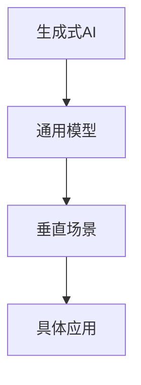

                 

关键词：生成式AI，GPT，AIGC，垂直场景，通用模型，创业价值，泡沫

摘要：在人工智能（AI）领域，生成式人工智能（AIGC）成为了当前的热门话题。然而，是否所有的AIGC项目都是金矿，还是仅仅是一时的泡沫？本文将深入探讨AIGC的现状，分析其潜在价值，以及创业公司应该如何定位才能在这个领域取得成功。

## 1. 背景介绍

随着深度学习技术的进步，人工智能（AI）已经从简单的规则系统演变为能够自主学习和优化的大规模模型。生成式人工智能（AIGC）作为AI的一个分支，它能够生成新的内容，如文本、图像、音频等。这种能力在娱乐、教育、医疗、设计等多个领域都展现出了巨大的潜力。

然而，随着GPT、DALL-E等模型的推出，AIGC也引发了一场关于其是否是“金矿”还是“泡沫”的讨论。许多人认为，AIGC是未来AI发展的方向，拥有巨大的商业价值。但也有观点认为，AIGC目前还处于早期阶段，许多项目可能只是短暂的潮流，缺乏实际的应用价值。

## 2. 核心概念与联系

在深入探讨AIGC之前，我们需要理解几个核心概念：生成式AI、通用模型和垂直场景。

### 2.1 生成式AI

生成式AI是指能够生成新数据的人工智能系统。与判别式AI（如分类、预测）不同，生成式AI的目标是生成与输入数据相似的新数据。例如，GPT-3可以生成新的文本，而DALL-E可以生成新的图像。

### 2.2 通用模型

通用模型是指能够适用于多种任务和场景的AI模型。例如，Transformer模型在自然语言处理、图像识别等多个领域都展现出了强大的性能。

### 2.3 垂直场景

垂直场景是指特定领域或行业内的应用场景。例如，医疗AI、金融AI等都是垂直场景的例子。

### 2.4 Mermaid 流程图



在这个流程图中，生成式AI通过通用模型应用于垂直场景，最终实现具体的应用。

## 3. 核心算法原理 & 具体操作步骤

### 3.1 算法原理概述

AIGC的核心算法是生成模型，如变分自编码器（VAE）、生成对抗网络（GAN）等。这些模型通过学习输入数据的分布，生成新的数据。

### 3.2 算法步骤详解

1. 数据收集与预处理：收集大量的训练数据，并进行数据清洗和格式化。
2. 模型训练：使用训练数据训练生成模型。
3. 模型评估：使用验证数据评估模型的性能。
4. 模型部署：将模型部署到生产环境中。

### 3.3 算法优缺点

**优点：**
- 能够生成高质量的新数据。
- 适用于多种任务和场景。

**缺点：**
- 训练过程复杂，需要大量计算资源。
- 模型可能存在模式偏移。

### 3.4 算法应用领域

AIGC在图像生成、文本生成、音频生成等领域都有广泛应用。例如，DALL-E可以生成新的图像，GPT-3可以生成新的文本。

## 4. 数学模型和公式

### 4.1 数学模型构建

生成式AI通常基于概率模型，如贝叶斯网络、马尔可夫模型等。

### 4.2 公式推导过程

假设我们有一个生成模型G，它能够生成新的数据x。我们定义概率分布P(x)来表示G生成x的概率。

### 4.3 案例分析与讲解

以GPT-3为例，它是一个基于Transformer的生成模型，能够生成高质量的文本。我们可以通过以下公式来描述GPT-3的生成过程：

```latex
P(text|context) = \sum_{text} P(text) P(context|text)
```

其中，text表示生成的文本，context表示上下文。

## 5. 项目实践：代码实例

### 5.1 开发环境搭建

安装Python、TensorFlow等工具。

### 5.2 源代码详细实现

以下是一个简单的GPT-3生成文本的Python代码实例：

```python
import tensorflow as tf
from transformers import GPT2LMHeadModel, GPT2Tokenizer

tokenizer = GPT2Tokenizer.from_pretrained("gpt2")
model = GPT2LMHeadModel.from_pretrained("gpt2")

input_text = "我是一个"
output_text = model.generate(input_text, max_length=20)

print(tokenizer.decode(output_text, skip_special_tokens=True))
```

### 5.3 代码解读与分析

这段代码首先加载了GPT-3模型和相应的分词器，然后生成一个以“我是一个”为输入的新文本。

### 5.4 运行结果展示

运行结果可能生成如“我是一个程序员”这样的新文本。

## 6. 实际应用场景

### 6.1 娱乐

AIGC可以用于生成新的故事、音乐、电影等娱乐内容。

### 6.2 教育

AIGC可以用于生成新的教学材料、作业和测试。

### 6.3 医疗

AIGC可以用于生成新的医疗报告、诊断建议等。

### 6.4 金融

AIGC可以用于生成新的金融报告、分析预测等。

### 6.5 设计

AIGC可以用于生成新的设计图案、建筑模型等。

### 6.4 未来应用展望

随着技术的进步，AIGC将在更多领域得到应用。例如，智能制造、自动驾驶、智能家居等。

## 7. 工具和资源推荐

### 7.1 学习资源推荐

- 《生成式AI：从入门到实践》
- 《深度学习：周志华》

### 7.2 开发工具推荐

- TensorFlow
- PyTorch

### 7.3 相关论文推荐

- "An Image Generation Approach Based on GAN for 3D Point Cloud Data"
- "A Generative Adversarial Model for 3D Shape Generation"

## 8. 总结：未来发展趋势与挑战

### 8.1 研究成果总结

生成式AI在图像、文本、音频等领域的应用已经取得了显著成果。

### 8.2 未来发展趋势

随着计算能力的提升，生成式AI将应用于更多领域。

### 8.3 面临的挑战

生成式AI在数据质量、模型解释性等方面仍面临挑战。

### 8.4 研究展望

未来，生成式AI将在更多领域得到应用，并推动AI技术的发展。

## 9. 附录：常见问题与解答

### 9.1 生成式AI是什么？

生成式AI是一种能够生成新数据的人工智能系统，与判别式AI相对。

### 9.2 AIGC有哪些应用领域？

AIGC在图像生成、文本生成、音频生成等领域都有广泛应用。

### 9.3 如何训练生成模型？

通常使用大量的训练数据进行训练，并使用损失函数来优化模型。

## 作者署名

作者：禅与计算机程序设计艺术 / Zen and the Art of Computer Programming
----------------------------------------------------------------

以上就是本文的完整内容，希望对您在AIGC领域的研究有所帮助。如有任何问题，欢迎在评论区留言讨论。再次感谢您的阅读！

