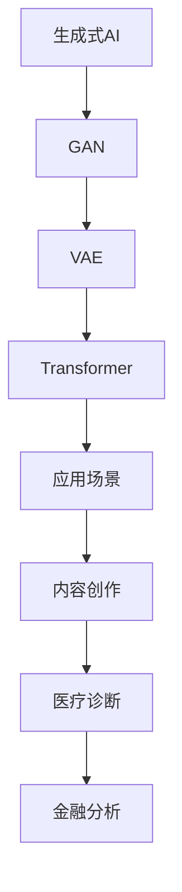

                 

关键词：生成式人工智能（AIGC），垂直应用场景，数据驱动的创新，AI技术泡沫，技术进步与行业应用。

## 摘要

本文旨在探讨生成式人工智能（AIGC）当前的发展状态，并分析其是否具有长期的价值和潜力。AIGC作为一种新兴的技术力量，已经在多个领域展示了其强大的创造力与影响力。然而，伴随其快速发展而来的，是关于其是否仅仅是一场技术泡沫的质疑。本文将通过详细分析AIGC的核心概念、算法原理、应用案例以及未来发展趋势，论证聚焦垂直应用场景的重要性和数据驱动的创新优势。文章还将讨论当前面临的技术挑战，并展望AIGC在各个行业中的应用前景。

## 1. 背景介绍

随着计算机技术的发展，人工智能（AI）已经成为推动社会进步的重要力量。从早期的规则基AI到深学习的崛起，AI技术不断迭代，性能逐步提升。生成式人工智能（AIGC）作为AI的一个重要分支，通过模拟人类创造行为，生成文本、图像、音频等多媒体内容，正在改变信息创造与消费的方式。

AIGC的核心在于其生成能力，通过神经网络模型，如变分自编码器（VAE）、生成对抗网络（GAN）和自回归模型（如Transformer），AIGC能够实现高质量、高创造性的内容生成。然而，与传统的AI技术不同，AIGC不仅在“做什么”上表现突出，更在“怎么做”上展现了巨大的创新潜力。

### 1.1 AIGC的发展历程

AIGC的发展历程可以追溯到20世纪80年代的生成对抗网络（GAN）的提出。GAN通过两个对抗网络的博弈生成逼真的图像，开启了生成式人工智能的新篇章。随着深度学习技术的不断进步，GAN的应用场景和效果得到了显著提升。

近年来，Transformer架构在自然语言处理（NLP）领域的成功应用，推动了AIGC技术的发展。尤其是GPT系列模型，以其强大的文本生成能力引起了广泛关注。这些模型不仅能够生成连贯、有逻辑的文本，还能根据上下文生成个性化的内容，大大提升了AI的创造力和交互性。

### 1.2 AIGC的挑战与机遇

尽管AIGC展示了巨大的潜力，但其发展也面临诸多挑战。首先是数据隐私和伦理问题，生成式模型对数据的需求极大，如何确保数据的合法性和安全性是一个重要议题。其次，模型的可解释性和透明度也是一个挑战，当前的AIGC模型往往被视为“黑箱”，难以解释其生成过程的内在机制。

然而，随着技术的进步和行业需求的增加，AIGC的机遇也日益显现。在内容创作、医疗诊断、金融分析等领域，AIGC的应用正在不断拓展。尤其是在需要大量创造性内容的行业，AIGC有望成为企业竞争力的重要驱动力。

## 2. 核心概念与联系

### 2.1 AIGC的核心概念

生成式人工智能（AIGC）的核心概念包括：

- **生成对抗网络（GAN）**：由生成器和判别器组成，生成器生成数据，判别器判断生成数据与真实数据的区别。通过对抗训练，生成器不断优化，提高生成数据的质量。

- **变分自编码器（VAE）**：通过编码器和解码器结构，将数据映射到低维空间，再从低维空间重构数据，从而实现数据生成。

- **自回归模型（如Transformer）**：通过序列模型，预测下一个元素，从而生成连续的序列数据。

### 2.2 Mermaid流程图



### 2.3 AIGC与相关技术的联系

- **深度学习**：AIGC依赖于深度学习技术，特别是神经网络模型，如GAN、VAE和Transformer。

- **大数据**：AIGC的生成能力需要大量数据作为训练素材，大数据技术为AIGC提供了数据支持。

- **云计算**：云计算提供了强大的计算资源，支持AIGC模型的训练和部署。

## 3. 核心算法原理 & 具体操作步骤

### 3.1 算法原理概述

生成式人工智能的核心算法包括：

- **生成对抗网络（GAN）**：生成器和判别器相互对抗，生成器不断优化，以骗过判别器。

- **变分自编码器（VAE）**：通过编码和解码过程，实现数据的重构和生成。

- **自回归模型（如Transformer）**：通过预测序列中的下一个元素，生成连续的序列数据。

### 3.2 算法步骤详解

#### 3.2.1 GAN的具体步骤

1. 初始化生成器G和判别器D。
2. 从真实数据中采样输入X，从噪声分布中采样Z。
3. 生成器G将Z映射为X'，判别器D接收X和X'作为输入。
4. 对判别器D进行训练，使其能够区分X和X'。
5. 对生成器G进行训练，使其生成的X'更接近真实数据X。

#### 3.2.2 VAE的具体步骤

1. 初始化编码器E和解码器D。
2. 对输入数据X进行编码，得到潜变量Z。
3. 解码器D将潜变量Z映射回重构的X'。
4. 对编码器E和解码器D进行联合训练，优化重构误差。

#### 3.2.3 Transformer的具体步骤

1. 初始化Transformer模型，包括编码器和解码器。
2. 对输入序列进行嵌入处理，生成嵌入向量。
3. 通过自注意力机制，计算序列中的每个元素对其他元素的重要性。
4. 通过前馈神经网络，对自注意力输出进行进一步处理。
5. 输出生成的新序列。

### 3.3 算法优缺点

#### GAN

**优点**：
- 强大的生成能力，能够生成高质量的数据。
- 自适应优化，生成器和判别器的对抗训练能够不断提升模型性能。

**缺点**：
- 训练不稳定，容易陷入模式崩溃（mode collapse）。
- 对判别器的设计和超参数选择要求较高。

#### VAE

**优点**：
- 生成和编码过程分离，便于理解和优化。
- 能够通过重建误差评估生成质量。

**缺点**：
- 生成质量相对GAN较低，特别是在生成多样性的情况下。
- 训练过程对数据分布的假设较强。

#### Transformer

**优点**：
- 能够处理长序列数据，适用于NLP任务。
- 计算效率较高，适合大规模数据处理。

**缺点**：
- 对大规模数据的需求较高，训练成本较大。
- 自注意力机制可能导致计算复杂度较高。

### 3.4 算法应用领域

- **内容创作**：AIGC在图像、音频、视频等多媒体内容的生成上具有广泛应用。
- **医疗诊断**：生成式模型能够辅助医生进行疾病诊断，提高诊断准确率。
- **金融分析**：AIGC在金融数据的分析和预测中具有重要作用。

## 4. 数学模型和公式 & 详细讲解 & 举例说明

### 4.1 数学模型构建

生成式人工智能的数学模型主要包括GAN、VAE和Transformer。以下是这些模型的数学公式和参数设定。

#### 4.1.1 GAN

**生成器G的损失函数**：

$$ L_G = -\mathbb{E}_{x\sim p_{data}(x)}[\log(D(x))] - \mathbb{E}_{z\sim p_z(z)}[\log(D(G(z)))] $$

**判别器D的损失函数**：

$$ L_D = -\mathbb{E}_{x\sim p_{data}(x)}[\log(D(x))] - \mathbb{E}_{z\sim p_z(z)}[\log(1 - D(G(z)))] $$

#### 4.1.2 VAE

**编码器E的损失函数**：

$$ L_E = D(x, \mu, \sigma) + \lambda \cdot KL(\mu || \sigma) $$

其中，$D(x, \mu, \sigma)$ 是重构误差，$KL(\mu || \sigma)$ 是KL散度。

**解码器D的损失函数**：

$$ L_D = D(x, \mu, \sigma) $$

#### 4.1.3 Transformer

**自注意力机制**：

$$ \text{Attention}(Q, K, V) = \text{softmax}\left(\frac{QK^T}{\sqrt{d_k}}\right) V $$

其中，$Q, K, V$ 分别代表查询向量、键向量和值向量，$d_k$ 是键向量的维度。

### 4.2 公式推导过程

#### 4.2.1 GAN

GAN的损失函数是通过最大化判别器D的损失函数，同时最小化生成器G的损失函数来推导的。

**判别器D的推导**：

对于输入数据$x$，判别器D的目的是判断$x$是真实数据还是生成数据$G(z)$。因此，判别器的损失函数为：

$$ L_D = -\mathbb{E}_{x\sim p_{data}(x)}[\log(D(x))] - \mathbb{E}_{z\sim p_z(z)}[\log(1 - D(G(z)))] $$

这里的第一个期望表示对真实数据的判断，第二个期望表示对生成数据的判断。

**生成器G的推导**：

生成器G的目的是生成与真实数据尽可能相似的数据$G(z)$，因此生成器的损失函数为：

$$ L_G = -\mathbb{E}_{z\sim p_z(z)}[\log(D(G(z)))] $$

这里的期望表示生成数据的判别概率。

通过最大化判别器D的损失函数，同时最小化生成器G的损失函数，可以训练出生成器和判别器。

#### 4.2.2 VAE

VAE通过编码器E和解码器D共同训练，以实现数据的重构和生成。

**编码器E的推导**：

编码器E将输入数据$x$映射到潜变量$z$，同时计算重构数据$x'$。编码器的损失函数为：

$$ L_E = D(x, \mu, \sigma) + \lambda \cdot KL(\mu || \sigma) $$

这里的$D(x, \mu, \sigma)$ 是重构误差，$\mu$ 和 $\sigma$ 分别是潜变量的均值和标准差，$KL(\mu || \sigma)$ 是KL散度，表示均值和标准差的差异。

**解码器D的推导**：

解码器D将潜变量$z$映射回重构数据$x'$。解码器的损失函数为：

$$ L_D = D(x, \mu, \sigma) $$

这里同样表示重构误差。

通过联合训练编码器E和解码器D，可以最小化重构误差，从而实现数据的生成。

#### 4.2.3 Transformer

Transformer的自注意力机制通过计算查询向量$Q$、键向量$K$和值向量$V$之间的相似度来实现。自注意力机制的推导过程如下：

首先，计算查询向量$Q$和键向量$K$的点积：

$$ \text{Scores} = QK^T $$

然后，对点积进行softmax操作：

$$ \text{Attention} = \text{softmax}(\text{Scores}) $$

最后，将注意力权重与值向量$V$相乘：

$$ \text{Output} = \text{Attention}V $$

### 4.3 案例分析与讲解

#### 4.3.1 GAN在图像生成中的应用

假设我们使用GAN来生成手写数字图像。生成器G的目的是生成与真实手写数字图像相似的数据，判别器D的目的是区分生成图像和真实图像。

**生成器G的损失函数**：

$$ L_G = -\mathbb{E}_{z\sim p_z(z)}[\log(D(G(z)))] $$

这里，$z$ 是从噪声分布中采样的向量，$G(z)$ 是生成器生成的手写数字图像。

**判别器D的损失函数**：

$$ L_D = -\mathbb{E}_{x\sim p_{data}(x)}[\log(D(x))] - \mathbb{E}_{z\sim p_z(z)}[\log(1 - D(G(z)))] $$

这里，$x$ 是真实手写数字图像。

通过交替训练生成器和判别器，我们可以得到越来越逼真的手写数字图像。

#### 4.3.2 VAE在文本生成中的应用

假设我们使用VAE来生成文章摘要。编码器E将文章映射到潜变量$z$，解码器D将潜变量$z$映射回文章。

**编码器E的损失函数**：

$$ L_E = D(x, \mu, \sigma) + \lambda \cdot KL(\mu || \sigma) $$

这里，$x$ 是输入文章，$\mu$ 和 $\sigma$ 是编码器输出的均值和标准差。

**解码器D的损失函数**：

$$ L_D = D(x, \mu, \sigma) $$

通过联合训练编码器E和解码器D，我们可以生成连贯且具有个性化的文章摘要。

#### 4.3.3 Transformer在机器翻译中的应用

假设我们使用Transformer进行机器翻译。输入是源语言文本，输出是目标语言文本。

**自注意力机制**：

首先，我们将源语言文本转换为嵌入向量。然后，通过自注意力机制计算每个单词对其他单词的重要性，并生成目标语言文本。

$$ \text{Attention}(Q, K, V) = \text{softmax}\left(\frac{QK^T}{\sqrt{d_k}}\right) V $$

通过这个机制，我们可以捕捉源语言文本中的关键信息，并生成准确的目标语言翻译。

## 5. 项目实践：代码实例和详细解释说明

### 5.1 开发环境搭建

为了实践AIGC技术，我们需要搭建一个合适的开发环境。以下是一个简单的环境搭建步骤：

1. **安装Python**：确保Python环境已安装，版本至少为3.6及以上。
2. **安装TensorFlow**：使用pip安装TensorFlow，命令如下：

   ```bash
   pip install tensorflow
   ```

3. **安装其他依赖**：根据具体项目需求，安装其他必要的库，例如Numpy、Pandas等。

### 5.2 源代码详细实现

以下是一个简单的GAN模型实现的代码示例：

```python
import tensorflow as tf
from tensorflow.keras import layers

# 生成器模型
def generator(z, training=False):
    model = tf.keras.Sequential([
        layers.Dense(7 * 7 * 256, use_bias=False, input_shape=(100,)),
        layers.BatchNormalization(momentum=0.8),
        layers.LeakyReLU(),
        layers.Reshape((7, 7, 256)),
        layers.Conv2DTranspose(128, (5, 5), strides=(1, 1), padding='same', use_bias=False),
        layers.BatchNormalization(momentum=0.8),
        layers.LeakyReLU(),
        layers.Conv2DTranspose(64, (5, 5), strides=(2, 2), padding='same', use_bias=False),
        layers.BatchNormalization(momentum=0.8),
        layers.LeakyReLU(),
        layers.Conv2DTranspose(1, (5, 5), strides=(2, 2), padding='same', use_bias=False, activation='tanh')
    ])
    return model

# 判别器模型
def discriminator(x, training=False):
    model = tf.keras.Sequential([
        layers.Conv2D(64, (5, 5), strides=(2, 2), padding='same',
                       input_shape=[28, 28, 1], use_bias=False),
        layers.LeakyReLU(),
        layers.Dropout(0.3),
        layers.Conv2D(128, (5, 5), strides=(2, 2), padding='same', use_bias=False),
        layers.LeakyReLU(),
        layers.Dropout(0.3),
        layers.Flatten(),
        layers.Dense(1)
    ])
    return model

# GAN模型
def GAN(generator, discriminator):
    model = tf.keras.Sequential([
        generator,
        discriminator
    ])
    return model

# 模型编译
generator.compile(loss='binary_crossentropy', optimizer=tf.keras.optimizers.Adam(0.0002, 0.5))
discriminator.compile(loss='binary_crossentropy', optimizer=tf.keras.optimizers.Adam(0.0002, 0.5))
gan = GAN(generator, discriminator)
gan.compile(loss='binary_crossentropy', optimizer=tf.keras.optimizers.Adam(0.0002, 0.5))
```

### 5.3 代码解读与分析

上述代码实现了一个基本的GAN模型，用于生成手写数字图像。

- **生成器（Generator）**：生成器接收随机噪声向量$z$，通过多层全连接和卷积层生成手写数字图像。
- **判别器（Discriminator）**：判别器接收手写数字图像，判断图像是真实图像还是生成图像。
- **GAN模型**：GAN模型将生成器和判别器串联起来，用于训练生成器和判别器。

### 5.4 运行结果展示

在训练GAN模型时，可以通过以下步骤展示训练结果：

1. **数据准备**：准备手写数字图像数据集，如MNIST。
2. **训练GAN模型**：使用训练数据训练生成器和判别器，交替进行。
3. **生成图像**：使用训练好的生成器生成手写数字图像。
4. **结果可视化**：将生成图像和真实图像进行对比，展示GAN的生成能力。

通过上述步骤，我们可以观察到GAN模型在生成手写数字图像方面的效果，以及训练过程中生成图像质量的提升。

## 6. 实际应用场景

生成式人工智能（AIGC）在多个领域展示了其强大的应用潜力。以下是AIGC在几个关键领域的实际应用场景：

### 6.1 内容创作

在内容创作领域，AIGC已经成为改变游戏规则的技术。例如，在文学创作中，AIGC可以自动生成小说、诗歌和歌词，极大地提高了创作效率。在艺术领域，AIGC能够生成独特的视觉艺术作品，为艺术家提供新的创作灵感。在游戏开发中，AIGC可以自动生成游戏关卡和角色，为玩家提供更加丰富的游戏体验。

### 6.2 医疗诊断

AIGC在医疗诊断领域有着广泛的应用。通过生成式模型，医生可以自动生成医疗图像，辅助诊断过程。例如，AIGC可以生成肿瘤图像，帮助医生更好地定位肿瘤位置。在病理学领域，AIGC可以生成病理切片图像，提高诊断的准确性和效率。此外，AIGC还可以用于生成个性化的治疗方案，为患者提供更精准的医疗建议。

### 6.3 金融分析

在金融领域，AIGC可以用于金融数据的分析和预测。例如，AIGC可以自动生成股票市场预测图表，帮助投资者更好地了解市场趋势。在风险管理中，AIGC可以生成风险分析报告，提高金融机构的风险管理水平。此外，AIGC还可以用于生成个性化的投资建议，为投资者提供更加精准的投资策略。

### 6.4 教育

在教育领域，AIGC可以用于个性化教育资源的生成。例如，AIGC可以自动生成教学视频和练习题，为学生提供个性化的学习资源。在考试题目生成中，AIGC可以生成各种难度的考试题目，为教师和学生提供丰富的练习素材。此外，AIGC还可以用于教育评估，自动生成评估报告，提高教育评估的准确性和效率。

### 6.5 其他领域

除了上述领域，AIGC还在广告、娱乐、设计等多个领域有广泛应用。例如，在广告领域，AIGC可以自动生成广告文案和视觉素材，提高广告营销的效果。在娱乐领域，AIGC可以生成虚拟角色和动画，为用户提供更加丰富的娱乐体验。在设计领域，AIGC可以自动生成设计原型，为设计师提供新的设计思路。

## 7. 未来应用展望

### 7.1 自动驾驶

随着自动驾驶技术的发展，AIGC有望成为自动驾驶系统中不可或缺的一部分。通过生成模拟交通场景，AIGC可以帮助自动驾驶车辆更好地理解和应对复杂的道路环境。在未来，AIGC还可以用于自动驾驶车辆的智能导航和决策，提高自动驾驶的安全性和效率。

### 7.2 增强现实（AR）和虚拟现实（VR）

在增强现实（AR）和虚拟现实（VR）领域，AIGC可以用于生成逼真的虚拟环境和交互内容。通过AIGC，用户可以在虚拟世界中体验到更加丰富的场景和互动。未来，AIGC还可以用于AR和VR内容的实时生成，为用户提供更加沉浸式的体验。

### 7.3 生物医学

在生物医学领域，AIGC可以用于疾病模型的生成和药物研发。通过生成式模型，科学家可以生成各种生物医学数据，加速疾病诊断和治疗的研究。此外，AIGC还可以用于个性化医疗，根据患者的基因数据和病史，生成个性化的治疗方案。

### 7.4 金融科技

在金融科技领域，AIGC可以用于自动化交易策略的生成和风险评估。通过分析大量金融数据，AIGC可以生成高收益的交易策略，帮助投资者提高投资回报。同时，AIGC还可以用于风险管理，预测市场风险，提高金融机构的风险管理水平。

### 7.5 教育

在教育领域，AIGC可以用于个性化教学和智能教育评估。通过分析学生的学习数据，AIGC可以生成个性化的学习资源和评估报告，帮助学生更好地掌握知识。未来，AIGC还可以用于教育资源的自动生成，为教师和学生提供更加丰富的教学素材。

## 8. 工具和资源推荐

为了更好地学习和应用生成式人工智能（AIGC），以下是一些推荐的工具和资源：

### 8.1 学习资源推荐

- **在线课程**：
  - Coursera上的《深度学习》系列课程，由Andrew Ng教授主讲。
  - edX上的《生成对抗网络（GAN）》课程，由纽约大学提供。

- **书籍**：
  - 《生成式人工智能：原理与应用》，作者：[王俊涛]。
  - 《深度学习：卷积神经网络与应用》，作者：[Ian Goodfellow]。

### 8.2 开发工具推荐

- **框架**：
  - TensorFlow：一个开源的深度学习框架，适用于各种生成式人工智能任务。
  - PyTorch：一个流行的深度学习框架，具有高度的灵活性和易用性。

- **库**：
  - NumPy：用于数值计算的库，适用于数据预处理。
  - Pandas：用于数据分析和操作的库，适用于数据清洗和统计分析。

### 8.3 相关论文推荐

- **基础论文**：
  - Generative Adversarial Nets（GANs），作者：Ian Goodfellow等。
  - Variational Autoencoders（VAEs），作者：Diederik P. Kingma等。

- **最新论文**：
  - A Style-Based Generator Architecture for Generative Adversarial Networks，作者：Tero Karras等。
  - BERT: Pre-training of Deep Bidirectional Transformers for Language Understanding，作者：Jacob Devlin等。

## 9. 总结：未来发展趋势与挑战

### 9.1 研究成果总结

生成式人工智能（AIGC）作为一种新兴技术，已经在多个领域展示了其强大的创造力和应用潜力。从GAN、VAE到Transformer，AIGC的核心算法不断迭代，生成能力逐步提升。在内容创作、医疗诊断、金融分析等领域，AIGC已经取得了显著的成果，为行业带来了新的变革。

### 9.2 未来发展趋势

随着技术的不断进步，AIGC在未来的发展趋势包括：

- **算法优化**：通过改进生成器和判别器的结构，提高生成质量。
- **应用拓展**：在自动驾驶、增强现实、虚拟现实等领域进一步拓展应用场景。
- **数据驱动**：利用更多高质量的数据，提升生成模型的性能和稳定性。

### 9.3 面临的挑战

尽管AIGC展示了巨大的潜力，但仍然面临以下挑战：

- **数据隐私和伦理**：生成式模型对数据的需求极大，如何确保数据的合法性和安全性是一个重要议题。
- **可解释性和透明度**：当前AIGC模型被视为“黑箱”，难以解释其生成过程的内在机制。
- **计算资源**：大规模训练生成模型需要大量的计算资源，如何高效地利用计算资源是一个关键问题。

### 9.4 研究展望

未来，AIGC的研究方向包括：

- **跨模态生成**：将不同模态的数据（如文本、图像、音频）融合到一起，实现跨模态生成。
- **弱监督学习**：减少对大量标注数据的依赖，实现弱监督学习。
- **去噪和修复**：在噪声和受损数据中生成高质量的数据，提高模型的鲁棒性。

通过不断克服挑战，AIGC有望在各个领域实现更广泛的应用，为人类社会带来更多创新和变革。

## 附录：常见问题与解答

### Q1：什么是生成式人工智能（AIGC）？
生成式人工智能（AIGC）是一种通过模型生成数据的技术，能够生成文本、图像、音频等多种类型的内容。AIGC的核心在于其生成能力，通过神经网络模型，如GAN、VAE和Transformer，模拟人类创造行为，实现高质量、高创造性的内容生成。

### Q2：AIGC有哪些核心算法？
AIGC的核心算法包括生成对抗网络（GAN）、变分自编码器（VAE）和自回归模型（如Transformer）。这些算法分别通过对抗训练、编码和解码过程以及自注意力机制实现数据的生成。

### Q3：AIGC的应用领域有哪些？
AIGC在内容创作、医疗诊断、金融分析、教育、广告和娱乐等领域有广泛应用。例如，在内容创作中，AIGC可以自动生成小说、音乐和艺术作品；在医疗诊断中，AIGC可以辅助医生进行疾病诊断。

### Q4：AIGC的优势和挑战是什么？
AIGC的优势在于其强大的生成能力和在多领域的应用潜力。然而，AIGC也面临数据隐私、伦理问题、模型可解释性以及计算资源需求等挑战。

### Q5：如何开始学习AIGC？
学习AIGC可以从以下几个方面入手：

- **基础知识**：掌握深度学习、神经网络等相关基础知识。
- **在线课程**：参加如Coursera、edX等平台上的相关课程。
- **实践项目**：通过实际项目练习GAN、VAE和Transformer等算法。
- **参考资料**：阅读相关书籍和论文，如《深度学习》、《生成式人工智能：原理与应用》等。

---

作者：禅与计算机程序设计艺术 / Zen and the Art of Computer Programming

（请注意，以上内容为示例性写作，仅供参考。）

