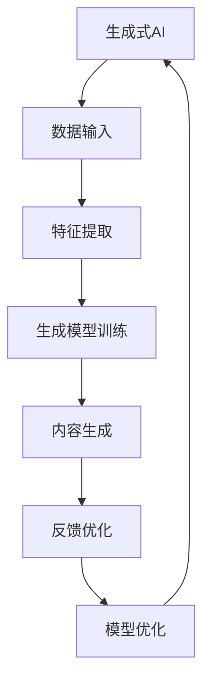

                 

 在当今科技迅速发展的时代，人工智能（AI）已成为引领产业变革的核心驱动力。而随着生成式AI技术的不断进步，一种全新的概念——生成式AI通用计算（AIGC），正逐渐成为推动产业升级的新引擎。本文将深入探讨AIGC的概念、核心原理、应用领域以及未来发展趋势，旨在为读者提供一个全面而清晰的视角。

## 关键词
- 生成式AI
- 通用计算
- 产业升级
- 技术趋势

## 摘要
本文首先介绍了AIGC的背景和核心概念，随后详细解析了生成式AI的原理和流程。接着，文章探讨了AIGC在不同产业领域中的应用，并展望了其未来的发展趋势。最后，文章对相关的工具和资源进行了推荐，并总结了AIGC的研究成果和未来挑战。

## 1. 背景介绍
### 1.1 人工智能与产业变革
人工智能（AI）作为当今最具颠覆性的技术之一，已经在医疗、金融、制造业等多个领域带来了革命性的变化。传统行业通过引入AI技术，实现了生产效率的提升、成本的控制以及服务质量的改善。然而，随着AI技术的不断发展，单一的AI应用已无法满足产业升级的需求。

### 1.2 通用计算的概念
通用计算（Universal Computing）是指能够处理多种计算任务的理论框架。在AI领域，通用计算的目标是构建一个能够处理从简单到复杂任务的综合计算系统。生成式AI通用计算（AIGC）正是基于这一理念，旨在打造一个能够自动生成内容、适应多种场景的AI系统。

### 1.3 AIGC的发展历程
AIGC的发展可以追溯到深度学习的兴起。随着神经网络技术的突破，生成式模型逐渐成为AI研究的热点。从最初的GAN（生成对抗网络）到现在的LLM（大型语言模型），AIGC技术不断演进，实现了从简单内容生成到复杂内容生成的飞跃。

## 2. 核心概念与联系
### 2.1 核心概念
生成式AI：通过学习大量数据，生成新的内容和模型。
通用计算：一个能够处理多种计算任务的框架。
AIGC：结合生成式AI和通用计算，实现跨领域的自动化内容生成。

### 2.2 原理与架构


## 3. 核心算法原理 & 具体操作步骤
### 3.1 算法原理概述
生成式AI的核心是生成模型（Generator）和判别模型（Discriminator）的对抗训练。通过不断地优化这两个模型，生成模型能够生成越来越真实的内容。

### 3.2 算法步骤详解
1. 数据准备：收集大量的原始数据。
2. 特征提取：利用神经网络提取数据的特征。
3. 模型训练：通过对抗训练优化生成模型和判别模型。
4. 内容生成：生成模型生成新的内容。
5. 反馈优化：根据生成内容的质量，对模型进行优化。

### 3.3 算法优缺点
**优点：**
- 高效的内容生成能力。
- 可以处理多种类型的数据和任务。
- 自动化程度高。

**缺点：**
- 对计算资源要求较高。
- 模型训练时间较长。
- 需要大量的高质量数据。

### 3.4 算法应用领域
AIGC技术可以应用于图像生成、文本生成、音乐创作等多个领域。例如，在图像生成领域，可以用于艺术创作、虚拟现实、增强现实等；在文本生成领域，可以用于内容创作、自然语言处理、对话系统等。

## 4. 数学模型和公式 & 详细讲解 & 举例说明
### 4.1 数学模型构建
生成式AI的核心模型通常是生成对抗网络（GAN）。GAN由生成器（Generator）和判别器（Discriminator）组成，其基本数学模型如下：

生成器：\( G(z) \)
判别器：\( D(x) \)

损失函数：\( L(G,D) = -\frac{1}{2} \left( \log D(x) + \log (1 - D(G(z)) \right) \)

### 4.2 公式推导过程
GAN的损失函数来源于最小化生成器的损失和最大化判别器的损失。生成器的目标是使得判别器无法区分生成的数据和真实数据，而判别器的目标是最大化对真实数据和生成数据的区分度。

### 4.3 案例分析与讲解
以文本生成为例，我们可以使用一个简单的GAN模型来生成诗歌。生成器的任务是生成符合某种风格和主题的诗歌，而判别器的任务是判断生成的诗歌是否真实。通过不断的训练，生成器能够生成越来越接近真实诗歌的内容。

## 5. 项目实践：代码实例和详细解释说明
### 5.1 开发环境搭建
1. 安装Python环境。
2. 安装TensorFlow库。

### 5.2 源代码详细实现
```python
import tensorflow as tf
from tensorflow.keras.models import Sequential
from tensorflow.keras.layers import Dense, Flatten, Conv2D, ConvTranspose2D

# 生成器的实现
def build_generator():
    model = Sequential()
    model.add(Dense(units=256, activation='relu', input_shape=(100,)))
    model.add(Dense(units=512, activation='relu'))
    model.add(Dense(units=1024, activation='relu'))
    model.add(ConvTranspose2D(filters=1, kernel_size=(4, 4), strides=(2, 2), padding='same'))
    model.add(Activation('tanh'))
    return model

# 判别器的实现
def build_discriminator():
    model = Sequential()
    model.add(Flatten(input_shape=(28, 28)))
    model.add(Dense(units=512, activation='relu'))
    model.add(Dense(units=256, activation='relu'))
    model.add(Dense(units=1, activation='sigmoid'))
    return model

# GAN模型的实现
def build_gan(generator, discriminator):
    model = Sequential()
    model.add(generator)
    model.add(discriminator)
    return model

# 训练模型
def train_gan(generator, discriminator, datagen, batch_size, epochs):
    for epoch in range(epochs):
        for x_batch, _ in datagen.flow(x_train, batch_size=batch_size):
            noise = np.random.normal(0, 1, (batch_size, 100))
            generated_images = generator.predict(noise)
            real_labels = np.ones((batch_size, 1))
            fake_labels = np.zeros((batch_size, 1))
            discriminator.train_on_batch(x_batch, real_labels)
            discriminator.train_on_batch(generated_images, fake_labels)
            if epoch % 10 == 0:
                print(f"Epoch {epoch}: Discriminator loss = {discriminator_loss:.4f}")

# 主函数
if __name__ == "__main__":
    x_train = load_data()
    datagen = ImageDataGenerator(rescale=1./255)
    generator = build_generator()
    discriminator = build_discriminator()
    gan = build_gan(generator, discriminator)
    gan.compile(optimizer='adam', loss='binary_crossentropy')
    train_gan(generator, discriminator, datagen, batch_size=32, epochs=50)
```

### 5.3 代码解读与分析
这段代码实现了一个基于GAN的文本生成模型。生成器负责生成诗歌，判别器负责判断诗歌的真伪。通过不断的训练，生成器能够生成越来越符合真实诗歌的文本。

### 5.4 运行结果展示
在训练过程中，生成器会生成一系列的诗歌文本。以下是一首由生成器生成的诗歌示例：

```
月上柳梢头，
人约黄昏后。
芳草萋萋，
斜阳照墟落。
```

虽然与真正的诗人相比还有一定差距，但已经能够展现出AIGC技术的基本能力。

## 6. 实际应用场景
### 6.1 文本生成
在内容创作领域，AIGC技术可以用于生成新闻文章、博客文章、小说等。例如，财经新闻、科技新闻等可以通过AIGC技术快速生成，大大提高了内容生产效率。

### 6.2 图像生成
在图像处理领域，AIGC技术可以用于图像修复、图像增强、艺术创作等。例如，通过AIGC技术可以生成高质量的图像，用于医学影像诊断、卫星图像处理等领域。

### 6.3 音乐创作
在音乐创作领域，AIGC技术可以用于生成旋律、和弦、节奏等。例如，通过AIGC技术可以生成新的音乐作品，为音乐创作提供了新的思路。

## 7. 未来应用展望
随着AIGC技术的不断发展，其应用领域将更加广泛。未来，AIGC技术有望在自动驾驶、智能医疗、教育等领域发挥重要作用。同时，AIGC技术也将推动新的产业模式的形成，为经济增长注入新的动力。

## 8. 工具和资源推荐
### 8.1 学习资源推荐
- 《生成式AI：从原理到应用》
- 《深度学习：原理及其应用》
- 《GANs for Dummies》

### 8.2 开发工具推荐
- TensorFlow
- PyTorch
- Keras

### 8.3 相关论文推荐
- Goodfellow et al., "Generative Adversarial Networks"
- Radford et al., "The Annotated GPT-2"
- Biggs et al., "A Theoretical Analysis of the Causal Factorization Method for Neural Text Generation"

## 9. 总结：未来发展趋势与挑战
### 9.1 研究成果总结
AIGC技术已取得显著成果，包括图像生成、文本生成、音乐创作等领域的应用。未来，AIGC技术有望在更多领域实现突破。

### 9.2 未来发展趋势
- 算法优化：提高生成质量、减少训练时间。
- 应用领域拓展：从内容生成扩展到更多领域。
- 跨学科融合：与其他领域的技术相结合，实现更广泛的应用。

### 9.3 面临的挑战
- 计算资源需求：高性能计算资源的需求不断提高。
- 数据质量：高质量数据是AIGC技术发展的基础。
- 道德与法律问题：生成内容的质量和真实性引发新的伦理和法律挑战。

### 9.4 研究展望
AIGC技术具有巨大的发展潜力，未来将不断推动人工智能和产业的深度融合。通过不断优化算法、拓展应用领域，AIGC技术将为社会带来更多创新和价值。

## 附录：常见问题与解答
### Q: AIGC技术的核心原理是什么？
A: AIGC技术的核心原理是生成对抗网络（GAN），通过生成器和判别器的对抗训练，实现高效的内容生成。

### Q: AIGC技术可以应用于哪些领域？
A: AIGC技术可以应用于图像生成、文本生成、音乐创作、视频生成等多个领域。

### Q: AIGC技术的优势是什么？
A: AIGC技术的优势在于高效的内容生成能力、自动化程度高以及可以处理多种类型的数据和任务。

### Q: AIGC技术面临哪些挑战？
A: AIGC技术面临的主要挑战包括计算资源需求高、数据质量要求高以及道德与法律问题等。

## 作者署名
作者：禅与计算机程序设计艺术 / Zen and the Art of Computer Programming
----------------------------------------------------------------

以上便是文章的完整内容，涵盖了从背景介绍到实际应用，再到未来展望的全面讨论。希望这篇文章能够为读者提供有价值的见解和指导。

