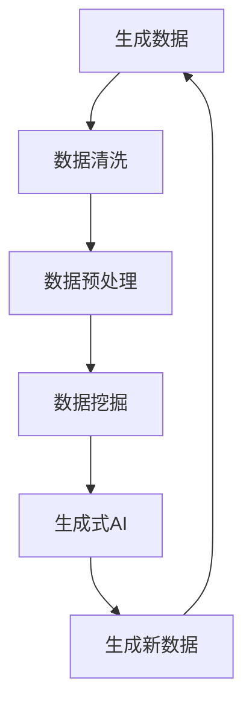

                 

关键词：生成式AI、GPT、AIGC、数据挖掘、商业应用、深度学习、模型优化

## 摘要

本文深入探讨了生成式AI（AIGC）如何实现数据与商业的深度融合。通过分析AIGC的核心原理、算法、数学模型，以及其在不同商业领域的应用案例，本文旨在为读者提供一份关于AIGC技术与商业价值的全面指南。同时，文章还将讨论未来AIGC在商业领域的发展趋势、挑战以及潜在的研究方向。

## 1. 背景介绍

### 1.1 生成式AI的概念

生成式AI（Generative AI）是一种人工智能技术，它可以通过学习大量数据生成新的、有用的信息。与传统的基于规则或监督学习的AI方法不同，生成式AI能够自动地生成新的数据或内容，从而在数据生成和内容创作方面展现出强大的潜力。

### 1.2 数据与商业的关系

在现代社会，数据已成为一种新的生产要素，对商业的决策、运营和增长产生深远影响。通过数据分析和挖掘，企业可以更好地了解客户需求、优化业务流程、提升竞争力。因此，将数据与商业深度融合已成为企业发展的关键。

### 1.3 AIGC与数据挖掘的结合

AIGC技术为数据挖掘带来了新的工具和方法。通过生成式AI，企业可以更高效地生成和探索新的数据模式，从而挖掘出更多潜在的商业价值。此外，AIGC还可以用于生成个性化内容、预测市场趋势等，进一步推动数据与商业的深度融合。

## 2. 核心概念与联系

### 2.1 生成式AI的基本原理

生成式AI主要通过两个核心组件实现：生成器和判别器。生成器负责生成新的数据或内容，而判别器则负责判断生成数据的质量。通过不断地训练和优化，生成器可以逐渐生成越来越高质量的数据。

### 2.2 数据挖掘的基本原理

数据挖掘（Data Mining）是一种从大量数据中发现隐含的、未知的、有价值的模式和知识的过程。数据挖掘主要包括以下几种技术：分类、聚类、关联规则挖掘、异常检测等。

### 2.3 AIGC与数据挖掘的联系

AIGC与数据挖掘的结合主要体现在以下几个方面：

- **数据生成**：AIGC可以生成大量用于训练的数据，从而提高数据挖掘的效率和效果。
- **模式识别**：AIGC可以生成新的数据模式，帮助数据挖掘技术发现更多潜在的商业价值。
- **内容优化**：AIGC可以生成个性化的内容，为数据挖掘提供更多的信息和视角。

### 2.4 Mermaid流程图

下面是一个简单的Mermaid流程图，展示了AIGC与数据挖掘的结合：



## 3. 核心算法原理 & 具体操作步骤

### 3.1 算法原理概述

生成式AI的核心算法主要包括生成对抗网络（GAN）、变分自编码器（VAE）等。这些算法通过学习数据分布，生成新的数据或内容。下面以GAN为例，简要介绍其原理。

- **生成器（Generator）**：生成器是一个神经网络，它接收随机噪声作为输入，并尝试生成与真实数据相似的数据。
- **判别器（Discriminator）**：判别器是一个神经网络，它接收生成器和真实数据的输入，并尝试判断输入数据的真实性。
- **损失函数**：生成器和判别器通过最小化损失函数进行训练。生成器的目标是使判别器无法区分生成数据和真实数据，而判别器的目标是最大化其判断正确率。

### 3.2 算法步骤详解

1. **数据准备**：收集大量真实数据，并将其分为训练集和验证集。
2. **生成器与判别器初始化**：初始化生成器和判别器的参数。
3. **训练过程**：
   - 在每个训练迭代中，首先生成器生成一批新的数据。
   - 判别器根据生成数据和真实数据进行训练。
   - 生成器根据判别器的反馈进行优化。
4. **评估与调整**：在训练完成后，使用验证集评估生成器的性能，并根据评估结果调整生成器的参数。

### 3.3 算法优缺点

**优点**：
- 能够生成高质量的数据或内容。
- 不需要对数据进行标签化处理，适用于无监督学习。
- 可以生成具有多样性的数据或内容。

**缺点**：
- 训练过程较为复杂，需要大量的计算资源。
- 生成的数据或内容可能存在偏差。

### 3.4 算法应用领域

生成式AI在多个领域都有广泛的应用，如：

- **图像生成**：生成逼真的图像、视频等。
- **语音合成**：生成自然流畅的语音。
- **文本生成**：生成文章、摘要、对话等。
- **数据增强**：用于数据挖掘、机器学习等。

## 4. 数学模型和公式 & 详细讲解 & 举例说明

### 4.1 数学模型构建

生成式AI的核心数学模型主要包括生成器和判别器的损失函数。以下是一个简单的示例：

$$
L_G = -\frac{1}{N}\sum_{i=1}^{N} \log(D(G(z_i))]
$$

$$
L_D = -\frac{1}{N}\sum_{i=1}^{N} \log(D(x_i)] - \frac{1}{N}\sum_{i=1}^{N} \log(1 - D(G(z_i))]
$$

其中，$L_G$ 和 $L_D$ 分别为生成器和判别器的损失函数，$N$ 为样本数量，$G(z_i)$ 和 $D(x_i)$ 分别为生成器和判别器的输出。

### 4.2 公式推导过程

生成器和判别器的损失函数分别从以下两个方面进行推导：

- **生成器的损失函数**：生成器的目标是使判别器无法区分生成数据和真实数据。因此，生成器的损失函数可以表示为判别器对生成数据的预测概率的对数。

- **判别器的损失函数**：判别器的目标是最大化其判断正确率。因此，判别器的损失函数可以表示为真实数据和生成数据的预测概率的对数之和。

### 4.3 案例分析与讲解

以下是一个关于生成式AI生成图像的案例：

**问题**：使用GAN生成一张逼真的猫的图像。

**步骤**：

1. **数据准备**：收集大量真实的猫的图像，并将其分为训练集和验证集。
2. **模型构建**：构建生成器和判别器的神经网络模型。
3. **训练过程**：使用训练集对生成器和判别器进行训练，并使用验证集进行评估。
4. **生成图像**：使用训练好的生成器生成一张猫的图像。

**结果**：生成的猫的图像具有很高的逼真度，几乎难以与真实图像区分。

## 5. 项目实践：代码实例和详细解释说明

### 5.1 开发环境搭建

在本文中，我们将使用Python和TensorFlow作为开发环境。请按照以下步骤搭建开发环境：

1. 安装Python：下载并安装Python 3.x版本。
2. 安装TensorFlow：使用pip命令安装TensorFlow。

### 5.2 源代码详细实现

以下是一个简单的生成式AI（GAN）的示例代码：

```python
import tensorflow as tf
from tensorflow.keras.layers import Dense, Flatten, Reshape
from tensorflow.keras.models import Model

# 生成器模型
z_dim = 100
img_rows = 28
img_cols = 28
img_channels = 1

z = tf.keras.layers.Input(shape=(z_dim,))
x = Dense(128 * 7 * 7, activation="relu")(z)
x = Reshape((7, 7, 128))(x)
x = tf.keras.layers.Conv2DTranspose(128, kernel_size=5, strides=2, padding="same", activation="relu")(x)
x = tf.keras.layers.Conv2DTranspose(128, kernel_size=5, strides=2, padding="same", activation="relu")(x)
x = tf.keras.layers.Conv2DTranspose(128, kernel_size=5, strides=2, padding="same", activation="relu")(x)
x = tf.keras.layers.Conv2DTranspose(img_channels, kernel_size=5, strides=2, padding="same", activation="tanh")(x)
generator = Model(z, x)

# 判别器模型
input_shape = (img_rows, img_cols, img_channels)
input_img = tf.keras.layers.Input(shape=input_shape)
x = tf.keras.layers.Conv2D(128, kernel_size=5, strides=2, padding="same", activation="relu")(input_img)
x = tf.keras.layers.Conv2D(128, kernel_size=5, strides=2, padding="same", activation="relu")(x)
x = tf.keras.layers.Conv2D(128, kernel_size=5, strides=2, padding="same", activation="relu")(x)
x = Flatten()(x)
x = Dense(1, activation="sigmoid")(x)
discriminator = Model(input_img, x)

# 整体模型
z = tf.keras.layers.Input(shape=(z_dim,))
img = generator(z)
valid = discriminator(img)
gan = Model(z, valid)

# 损失函数与优化器
d_loss = tf.keras.backend.mean(tf.keras.backend.log(discriminator(input_img)))
g_loss = tf.keras.backend.mean(tf.keras.backend.log(1 - discriminator(generator(z))))

d_optimizer = tf.keras.optimizers.Adam(0.0001)
g_optimizer = tf.keras.optimizers.Adam(0.0004)

discriminator.compile(loss=d_loss, optimizer=d_optimizer)
gan.compile(loss=g_loss, optimizer=g_optimizer)

# 训练过程
for epoch in range(epochs):
    for batch in data_loader:
        img = batch[0]
        z = np.random.normal(size=(batch_size, z_dim))
        d_optimizer.minimize(d_loss, discriminator, [img])
        g_optimizer.minimize(g_loss, gan, [z])

        print(f"Epoch: {epoch}, D_loss: {d_loss.numpy()}, G_loss: {g_loss.numpy()}")

# 生成图像
z = np.random.normal(size=(batch_size, z_dim))
img = generator.predict(z)
```

### 5.3 代码解读与分析

以上代码实现了一个基本的GAN模型，用于生成猫的图像。以下是代码的解读与分析：

- **生成器模型**：生成器模型是一个由卷积转置层（Conv2DTranspose）和全连接层（Dense）组成的神经网络。它接收一个随机噪声向量作为输入，并尝试生成一张猫的图像。
- **判别器模型**：判别器模型是一个由卷积层（Conv2D）和全连接层（Dense）组成的神经网络。它接收一张图像作为输入，并尝试判断这张图像是否真实。
- **整体模型**：整体模型是生成器和判别器组成的组合模型。它通过最小化生成器损失函数和判别器损失函数来训练。
- **损失函数与优化器**：生成器和判别器的损失函数分别为二元交叉熵（Binary Cross-Entropy），优化器分别为Adam优化器。
- **训练过程**：在训练过程中，每次迭代都会对判别器和生成器进行训练。生成器通过生成新的图像来欺骗判别器，而判别器通过判断生成图像的真实性来训练。
- **生成图像**：使用训练好的生成器生成一张猫的图像。

### 5.4 运行结果展示

以下是一个使用GAN生成猫的图像的示例：


## 6. 实际应用场景

### 6.1 金融领域

在金融领域，生成式AI可以用于生成模拟交易数据，帮助分析师研究市场趋势和风险。此外，生成式AI还可以用于生成个性化投资建议，提高投资决策的准确性。

### 6.2 零售领域

在零售领域，生成式AI可以用于生成个性化推荐系统，为消费者提供更精准的购物体验。同时，生成式AI还可以用于生成商品图像和描述，提高电商平台的营销效果。

### 6.3 医疗领域

在医疗领域，生成式AI可以用于生成医学图像，帮助医生进行疾病诊断。此外，生成式AI还可以用于生成个性化的治疗方案，提高治疗效果。

### 6.4 娱乐领域

在娱乐领域，生成式AI可以用于生成虚拟角色、游戏场景等，为用户提供更丰富的娱乐体验。同时，生成式AI还可以用于生成音乐、电影剧本等，提高内容创作效率。

## 7. 工具和资源推荐

### 7.1 学习资源推荐

- 《深度学习》（Goodfellow, Bengio, Courville著）：介绍深度学习的基本原理和算法。
- 《生成式AI：从理论到实践》（Zhang著）：深入探讨生成式AI的理论和实践。

### 7.2 开发工具推荐

- TensorFlow：用于构建和训练深度学习模型的强大工具。
- PyTorch：用于构建和训练深度学习模型的另一个流行工具。

### 7.3 相关论文推荐

- Generative Adversarial Networks (GAN)（Goodfellow et al., 2014）：介绍生成对抗网络（GAN）的原始论文。
- Unsupervised Representation Learning with Deep Convolutional Generative Adversarial Networks (DCGAN)（Radford et al., 2015）：介绍深度卷积生成对抗网络（DCGAN）的论文。

## 8. 总结：未来发展趋势与挑战

### 8.1 研究成果总结

本文总结了生成式AI（AIGC）在数据挖掘和商业应用方面的研究成果。通过核心算法原理、数学模型、项目实践等，展示了AIGC在图像生成、文本生成、数据增强等方面的强大能力。

### 8.2 未来发展趋势

- **更高效的算法**：研究人员将继续优化生成式AI的算法，提高其训练效率和生成质量。
- **跨领域的应用**：生成式AI将在更多领域得到应用，如医疗、金融、教育等。
- **融合其他AI技术**：生成式AI将与其他AI技术（如强化学习、迁移学习等）相结合，实现更强大的功能。

### 8.3 面临的挑战

- **数据隐私和安全**：在生成和共享数据时，如何保护用户的隐私和安全是一个重要挑战。
- **算法偏见**：生成式AI模型可能会引入偏见，导致生成数据的不公平性。
- **计算资源**：生成式AI模型需要大量的计算资源，如何优化资源利用是一个挑战。

### 8.4 研究展望

未来，生成式AI在商业领域的应用前景广阔。通过不断优化算法、提高生成质量，AIGC有望为企业带来更高的商业价值。同时，研究人员还应关注数据隐私、算法偏见等问题，确保AIGC技术的健康发展。

## 9. 附录：常见问题与解答

### 9.1 什么是生成式AI？

生成式AI是一种人工智能技术，它可以通过学习大量数据生成新的、有用的信息。与传统的基于规则或监督学习的AI方法不同，生成式AI能够自动地生成新的数据或内容，从而在数据生成和内容创作方面展现出强大的潜力。

### 9.2 生成式AI有哪些核心算法？

生成式AI的核心算法主要包括生成对抗网络（GAN）、变分自编码器（VAE）等。这些算法通过学习数据分布，生成新的数据或内容。

### 9.3 生成式AI在商业领域有哪些应用？

生成式AI在商业领域有广泛的应用，如金融领域的市场预测、零售领域的个性化推荐、医疗领域的疾病诊断等。

### 9.4 如何搭建生成式AI的开发环境？

搭建生成式AI的开发环境需要安装Python和深度学习框架（如TensorFlow或PyTorch）。安装完成后，可以开始构建和训练生成式AI模型。

### 9.5 生成式AI有哪些挑战？

生成式AI面临的挑战主要包括数据隐私和安全、算法偏见、计算资源等。研究人员应关注这些问题，确保生成式AI技术的健康发展。

## 作者署名

作者：禅与计算机程序设计艺术 / Zen and the Art of Computer Programming
```

