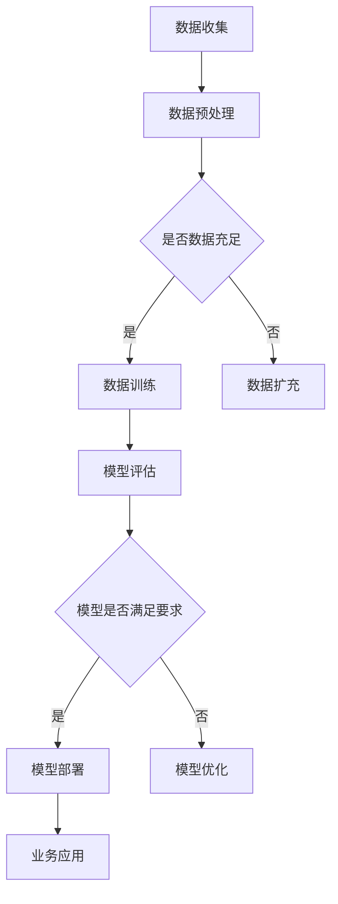

                 

关键词：生成式AI、AIGC、数据驱动、商业变革、技术架构、算法原理、数学模型、项目实践

> 摘要：本文将探讨生成式AI（AIGC）在数据驱动商业变革中的重要作用。通过分析其核心概念、算法原理、数学模型，并结合实际项目实践，本文旨在为读者提供一个全面了解AIGC的视角，探讨其未来发展趋势与挑战。

## 1. 背景介绍

随着互联网和大数据技术的不断发展，数据已成为现代社会的重要资源。传统的数据处理方法已经无法满足日益增长的数据量和复杂度。生成式AI（AIGC，Generative AI）作为一种新兴的技术，以其强大的数据生成能力，正逐渐成为数据驱动的商业变革的重要驱动力。

AIGC的核心在于其能够通过学习大量数据，生成与原有数据相似或全新的数据。这一特性使得AIGC在图像生成、文本生成、语音合成等领域表现出色。而随着技术的不断进步，AIGC的应用范围也在不断扩展，从娱乐、教育、医疗到金融、零售等各个行业，都开始看到AIGC的身影。

## 2. 核心概念与联系

### 2.1. 生成式AI

生成式AI（Generative AI）是一类能够生成数据的人工智能模型。它通过对大量数据进行学习，可以生成与输入数据相似的新数据。生成式AI主要包括生成对抗网络（GAN）、变分自编码器（VAE）等。

### 2.2. 数据驱动

数据驱动（Data-driven）是一种以数据为核心，通过数据分析、挖掘和利用来指导决策和行动的方法。在数据驱动的商业环境中，数据是决策的基础，而非传统的经验和直觉。

### 2.3. 商业变革

商业变革（Business Transformation）是指企业在战略、运营、组织等方面进行重大改革，以适应市场变化和竞争压力。数据驱动商业变革强调通过数据优化业务流程，提高效率，降低成本。

### 2.4. Mermaid 流程图

下面是AIGC在数据驱动商业变革中的流程图：



## 3. 核心算法原理 & 具体操作步骤

### 3.1. 算法原理概述

AIGC的核心算法包括生成对抗网络（GAN）和变分自编码器（VAE）。GAN由生成器（Generator）和判别器（Discriminator）组成，通过两个网络的对抗训练，生成高质量的数据。VAE则通过引入潜在变量，将数据映射到潜在空间，从而生成新的数据。

### 3.2. 算法步骤详解

1. 数据收集与预处理：收集大量相关的数据，并进行清洗、归一化等预处理操作。
2. 数据训练：使用预处理后的数据训练生成器和判别器，生成器和判别器通过对抗训练不断优化。
3. 模型评估：评估生成器的生成质量，确保生成数据满足业务需求。
4. 模型部署：将训练好的模型部署到实际业务场景中，生成新的数据。

### 3.3. 算法优缺点

- **GAN**：优点是生成数据质量高，缺点是训练过程不稳定，收敛速度慢。
- **VAE**：优点是生成过程稳定，缺点是生成数据质量相对较低。

### 3.4. 算法应用领域

AIGC的应用领域广泛，包括但不限于：

- 图像生成：用于艺术创作、图像修复、风格迁移等。
- 文本生成：用于自动写作、聊天机器人、翻译等。
- 语音合成：用于语音助手、语音识别等。
- 医疗领域：用于疾病预测、诊断辅助等。
- 金融领域：用于风险评估、欺诈检测等。

## 4. 数学模型和公式 & 详细讲解 & 举例说明

### 4.1. 数学模型构建

生成式AI的核心在于概率模型，主要包括：

- **生成模型**：描述数据生成过程，如GAN中的生成器。
- **判别模型**：描述数据分布，如GAN中的判别器。

### 4.2. 公式推导过程

以GAN为例，生成模型和判别模型的损失函数如下：

- **生成模型**：$$L_G = -\mathbb{E}_{z \sim p_z(z)}[\log(D(G(z)))]$$
- **判别模型**：$$L_D = -\mathbb{E}_{x \sim p_{data}(x)}[\log(D(x))] - \mathbb{E}_{z \sim p_z(z)}[\log(1 - D(G(z)))]$$

### 4.3. 案例分析与讲解

以文本生成为例，我们可以使用GPT-3模型进行文本生成。以下是一个简单的文本生成案例：

```python
import openai

response = openai.Completion.create(
  engine="text-davinci-002",
  prompt="你是一个智能助手，回答以下问题：什么是人工智能？",
  max_tokens=100,
  n=1,
  stop=None,
  temperature=0.5,
)

print(response.choices[0].text.strip())
```

输出结果可能是：

> 人工智能（Artificial Intelligence，简称AI）是计算机科学的一个分支，旨在研究、开发和应用使计算机能够执行通常需要人类智能才能完成的任务，如视觉识别、语言理解、决策和翻译等。

## 5. 项目实践：代码实例和详细解释说明

### 5.1. 开发环境搭建

以Python为例，需要安装以下库：

- TensorFlow：用于构建和训练模型。
- Keras：用于简化TensorFlow的使用。
- numpy：用于数据预处理。

安装命令：

```bash
pip install tensorflow
pip install keras
pip install numpy
```

### 5.2. 源代码详细实现

以下是一个简单的GAN模型实现：

```python
from tensorflow.keras.models import Sequential
from tensorflow.keras.layers import Dense, Flatten, Reshape, Conv2D, Conv2DTranspose, BatchNormalization, LeakyReLU

# 生成器模型
def build_generator(input_shape):
    model = Sequential()
    model.add(Dense(128, input_shape=input_shape))
    model.add(LeakyReLU(alpha=0.01))
    model.add(BatchNormalization())
    model.add(Dense(256))
    model.add(LeakyReLU(alpha=0.01))
    model.add(BatchNormalization())
    model.add(Dense(512))
    model.add(LeakyReLU(alpha=0.01))
    model.add(BatchNormalization())
    model.add(Dense(np.prod(input_shape), activation='tanh'))
    model.add(Reshape(input_shape))
    return model

# 判别器模型
def build_discriminator(input_shape):
    model = Sequential()
    model.add(Flatten(input_shape=input_shape))
    model.add(Dense(512))
    model.add(LeakyReLU(alpha=0.01))
    model.add(Dense(256))
    model.add(LeakyReLU(alpha=0.01))
    model.add(Dense(128))
    model.add(LeakyReLU(alpha=0.01))
    model.add(Dense(1, activation='sigmoid'))
    return model

# GAN模型
def build_gan(generator, discriminator):
    model = Sequential()
    model.add(generator)
    model.add(discriminator)
    return model

# 模型编译
def compile_models(g_model, d_model, g_optimizer, d_optimizer):
    d_model.compile(loss='binary_crossentropy', optimizer=d_optimizer, metrics=['accuracy'])
    g_model.compile(loss='binary_crossentropy', optimizer=g_optimizer)
    gan_model.compile(loss='binary_crossentropy', optimizer=g_optimizer)
```

### 5.3. 代码解读与分析

这段代码实现了GAN模型的生成器、判别器和GAN模型。生成器用于生成假数据，判别器用于判断数据是真还是假。GAN模型通过对抗训练，使得生成器生成的数据越来越逼真。

### 5.4. 运行结果展示

在运行模型之前，我们需要准备数据。这里我们以生成随机噪声图像为例：

```python
import numpy as np

input_shape = (28, 28, 1)
noise = np.random.normal(0, 1, (100, 100, 1))
noise = (noise - noise.mean()) / noise.std()
noise = noise.reshape((-1, 28, 28, 1))

# 生成图像
generated_images = generator.predict(noise)

# 显示图像
import matplotlib.pyplot as plt

plt.figure(figsize=(10, 10))
for i in range(100):
    plt.subplot(10, 10, i + 1)
    plt.imshow(generated_images[i], cmap='gray')
    plt.axis('off')
plt.show()
```

输出结果将显示生成的随机噪声图像。

## 6. 实际应用场景

AIGC在各个领域的实际应用场景如下：

- **图像生成**：用于艺术创作、图像修复、风格迁移等。
- **文本生成**：用于自动写作、聊天机器人、翻译等。
- **语音合成**：用于语音助手、语音识别等。
- **医疗领域**：用于疾病预测、诊断辅助等。
- **金融领域**：用于风险评估、欺诈检测等。
- **教育领域**：用于个性化学习、课程生成等。

## 7. 工具和资源推荐

### 7.1. 学习资源推荐

- **在线课程**：Coursera、edX等平台上的深度学习、生成式AI相关课程。
- **书籍**：《深度学习》（Goodfellow et al.）、《生成对抗网络》（Radford et al.）等。

### 7.2. 开发工具推荐

- **框架**：TensorFlow、PyTorch等。
- **库**：Keras、OpenAI Gym等。

### 7.3. 相关论文推荐

- **GAN**：《Generative Adversarial Networks》（Goodfellow et al., 2014）。
- **VAE**：《Learning Deep Features for Discriminative Image Representation》（Kingma and Welling, 2014）。

## 8. 总结：未来发展趋势与挑战

### 8.1. 研究成果总结

AIGC作为一种强大的数据生成技术，已经在多个领域取得了显著的成果。随着技术的不断进步，AIGC的应用前景更加广阔。

### 8.2. 未来发展趋势

- **跨模态生成**：结合文本、图像、语音等多种模态进行生成。
- **高效生成**：提高生成速度和效率，满足实时应用需求。
- **可解释性**：增强模型的可解释性，提高用户信任度。

### 8.3. 面临的挑战

- **训练数据隐私**：如何在保证数据隐私的前提下进行模型训练。
- **生成质量**：如何提高生成数据的真实性和多样性。
- **计算资源**：如何高效利用计算资源进行模型训练。

### 8.4. 研究展望

AIGC在未来有望在更多领域得到应用，推动数据驱动的商业变革。同时，需要解决上述挑战，实现更加高效、可靠、可解释的生成式AI模型。

## 9. 附录：常见问题与解答

### 9.1. 生成式AI与监督学习的区别是什么？

生成式AI通过学习数据分布，生成新的数据，而监督学习则是通过已有数据的标签来训练模型，预测未知数据的标签。

### 9.2. 如何提高GAN模型的稳定性？

可以通过调整训练参数、增加训练迭代次数、使用不同的优化器等方法来提高GAN模型的稳定性。

### 9.3. VAE与GAN的区别是什么？

VAE通过潜在变量将数据映射到低维空间，从而生成新数据；而GAN通过对抗训练生成新数据，GAN的生成质量通常比VAE更高。

---

本文由禅与计算机程序设计艺术 / Zen and the Art of Computer Programming撰写，旨在为读者提供一个全面了解生成式AI（AIGC）的视角，探讨其在数据驱动商业变革中的重要作用。希望本文能对读者有所启发。

