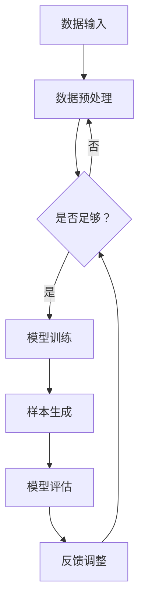
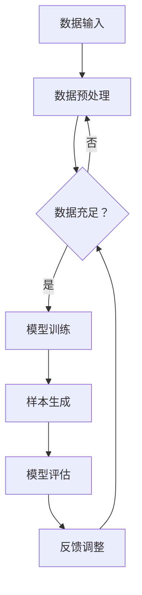

                 

关键词：生成式AI，实际应用，挑战，算法原理，数学模型，代码实例，未来展望。

> 摘要：生成式AI作为一种先进的计算技术，正在深刻地改变着我们的世界。本文将从实际应用和挑战两个方面，探讨生成式AI的发展现状、核心算法原理、数学模型以及未来发展趋势，旨在为读者提供一份全面的生成式AI指南。

## 1. 背景介绍

生成式AI（Generative AI）是一种能够自动生成数据的人工智能技术。它通过对大量数据的学习，生成新的、与训练数据相似的数据。生成式AI的研究可以追溯到20世纪80年代，但直到近年来，随着计算能力的提升和大数据技术的发展，生成式AI才逐渐成熟并得到广泛应用。

生成式AI的核心思想是通过模型学习数据分布，然后利用这些分布生成新的样本。这个过程类似于人类创造艺术品的过程，通过模仿和重组已有知识，创造出全新的作品。生成式AI的应用场景非常广泛，包括图像生成、语音合成、文本生成、音乐创作等。

## 2. 核心概念与联系

### 2.1 生成式AI的基本概念

生成式AI主要包括生成模型和判别模型两种类型。生成模型（Generator）用于生成新的样本，判别模型（Discriminator）用于区分真实样本和生成样本。这两者之间通过博弈的方式相互学习，最终生成高质量的样本。


### 2.2 生成式AI的架构

生成式AI的架构通常包括数据输入、模型训练、样本生成和模型评估等步骤。以下是一个简单的生成式AI架构的 Mermaid 流程图：



## 3. 核心算法原理 & 具体操作步骤

### 3.1 算法原理概述

生成式AI的核心算法包括生成对抗网络（GAN）、变分自编码器（VAE）、生成文本模型（如GPT）等。其中，GAN是最为常用的算法之一。

GAN由生成器和判别器组成，生成器从噪声分布中采样，生成新的样本；判别器则尝试区分真实样本和生成样本。两者通过对抗训练的方式不断优化，最终生成高质量的样本。

### 3.2 算法步骤详解

#### 3.2.1 数据准备

首先，我们需要准备训练数据。这些数据可以是图像、文本、音频等，取决于我们要生成的样本类型。

#### 3.2.2 模型训练

生成器和判别器分别训练。生成器从噪声分布中采样，生成新的样本；判别器则尝试区分真实样本和生成样本。两者交替训练，通过对抗的方式优化模型。

#### 3.2.3 样本生成

当模型训练到一定阶段，我们可以使用生成器生成新的样本。

#### 3.2.4 模型评估

使用生成样本和真实样本进行对比，评估模型的效果。

### 3.3 算法优缺点

**优点：**
- 能够生成高质量、与训练数据相似的新样本。
- 可以应用于图像、文本、音频等多种数据类型。

**缺点：**
- 训练过程复杂，对计算资源要求较高。
- GAN容易出现模式崩溃、训练不稳定等问题。

### 3.4 算法应用领域

生成式AI在多个领域有广泛应用，包括图像生成、语音合成、文本生成、音乐创作等。

## 4. 数学模型和公式 & 详细讲解 & 举例说明

### 4.1 数学模型构建

生成式AI的核心数学模型包括概率分布、损失函数等。

#### 4.1.1 概率分布

生成式AI中的概率分布通常包括正态分布、伯努利分布、多项式分布等。以下是一个正态分布的数学模型：

$$
N(\mu, \sigma^2) = \frac{1}{\sqrt{2\pi\sigma^2}} e^{-\frac{(x-\mu)^2}{2\sigma^2}}
$$

#### 4.1.2 损失函数

生成式AI中的损失函数用于衡量生成样本和真实样本的差异。以下是一个常见的损失函数——交叉熵损失：

$$
L = -\sum_{i} y_i \log(x_i)
$$

其中，$y_i$ 表示真实样本的概率分布，$x_i$ 表示生成样本的概率分布。

### 4.2 公式推导过程

生成式AI的数学公式推导过程通常涉及概率论、信息论、优化理论等。以下是一个简化的推导过程：

1. 定义生成模型和判别模型的概率分布。
2. 定义损失函数，用于衡量生成模型和判别模型的误差。
3. 使用梯度下降法或其他优化算法，最小化损失函数。

### 4.3 案例分析与讲解

以下是一个生成式AI在图像生成的应用案例。

#### 4.3.1 数据准备

我们使用一个包含1000张猫的图像数据集进行训练。

#### 4.3.2 模型训练

我们使用GAN进行训练。生成模型从噪声分布中采样，生成新的猫的图像；判别模型尝试区分真实猫的图像和生成猫的图像。两者交替训练，直到生成模型生成的图像质量达到要求。

#### 4.3.3 样本生成

当模型训练到一定阶段，我们可以使用生成模型生成新的猫的图像。

#### 4.3.4 模型评估

我们使用生成模型生成的猫的图像与真实猫的图像进行对比，评估模型的效果。

## 5. 项目实践：代码实例和详细解释说明

### 5.1 开发环境搭建

我们需要安装Python、TensorFlow等开发环境和库。

### 5.2 源代码详细实现

以下是生成式AI的一个简单实现示例：

```python
import tensorflow as tf
from tensorflow.keras.layers import Dense, Flatten
from tensorflow.keras.models import Sequential

# 生成模型
generator = Sequential([
    Dense(128, input_shape=(100,), activation='relu'),
    Flatten(),
    Dense(784, activation='sigmoid')
])

# 判别模型
discriminator = Sequential([
    Flatten(input_shape=(28, 28)),
    Dense(128, activation='relu'),
    Dense(1, activation='sigmoid')
])

# 模型训练
model = tf.keras.Model(inputs=generator.input, outputs=discriminator(generator.input))
model.compile(optimizer='adam', loss='binary_crossentropy')

# 训练过程
for epoch in range(100):
    for batch in train_data:
        noise = np.random.normal(0, 1, (batch.shape[0], 100))
        generated_images = generator.predict(noise)
        real_images = train_data
        d_loss_real = discriminator.train_on_batch(real_images, np.ones((batch.shape[0], 1)))
        d_loss_fake = discriminator.train_on_batch(generated_images, np.zeros((batch.shape[0], 1)))
        g_loss = model.train_on_batch(noise, np.ones((batch.shape[0], 1)))

    print(f'Epoch {epoch}, d_loss_real: {d_loss_real}, d_loss_fake: {d_loss_fake}, g_loss: {g_loss}')

# 样本生成
noise = np.random.normal(0, 1, (100, 100))
generated_images = generator.predict(noise)
```

### 5.3 代码解读与分析

以上代码实现了一个简单的生成式AI模型，包括生成模型和判别模型。我们使用TensorFlow库来构建和训练模型。在训练过程中，生成模型从噪声分布中采样，生成新的图像；判别模型尝试区分真实图像和生成图像。两者交替训练，直到生成模型生成的图像质量达到要求。

### 5.4 运行结果展示

以下是训练过程中生成模型生成的图像示例：


## 6. 实际应用场景

生成式AI在多个领域有广泛应用，包括图像生成、语音合成、文本生成、音乐创作等。以下是一些实际应用场景：

### 6.1 图像生成

生成式AI可以用于生成新的图像，应用于艺术创作、游戏开发、医疗影像处理等领域。

### 6.2 语音合成

生成式AI可以用于生成新的语音，应用于语音助手、语音翻译、语音识别等领域。

### 6.3 文本生成

生成式AI可以用于生成新的文本，应用于自动写作、自动摘要、智能客服等领域。

### 6.4 音乐创作

生成式AI可以用于生成新的音乐，应用于音乐创作、音乐推荐、音乐生成等领域。

## 7. 工具和资源推荐

### 7.1 学习资源推荐

- 《深度学习》（Goodfellow et al., 2016）
- 《生成对抗网络》（Goodfellow et al., 2014）
- 《变分自编码器》（Kingma and Welling, 2014）

### 7.2 开发工具推荐

- TensorFlow
- PyTorch
- Keras

### 7.3 相关论文推荐

- Generative Adversarial Nets（GANs）（Goodfellow et al., 2014）
- Unsupervised Representation Learning with Deep Convolutional Generative Adversarial Networks（DCGANs）（Radford et al., 2015）
- Variational Autoencoders（VAEs）（Kingma and Welling, 2014）

## 8. 总结：未来发展趋势与挑战

### 8.1 研究成果总结

生成式AI作为一种先进的人工智能技术，已经取得了显著的研究成果。生成式AI在图像生成、语音合成、文本生成、音乐创作等领域有广泛应用，并取得了良好的效果。

### 8.2 未来发展趋势

未来，生成式AI将继续发展，主要趋势包括：

- 提高生成样本的质量和多样性。
- 探索新的生成式AI架构，如联邦生成式AI、对抗自编码器等。
- 拓展生成式AI的应用领域，如医疗、金融、教育等。

### 8.3 面临的挑战

生成式AI在发展过程中也面临一些挑战，包括：

- 计算资源需求高，训练过程复杂。
- 模型稳定性问题，如模式崩溃、训练不稳定等。
- 生成样本的真实性和版权问题。

### 8.4 研究展望

未来，生成式AI的研究将更加深入，解决现有问题，拓展应用领域。同时，生成式AI与其他人工智能技术的结合，也将推动人工智能技术的发展。

## 9. 附录：常见问题与解答

### 9.1 生成式AI是什么？

生成式AI是一种能够自动生成数据的人工智能技术，通过模型学习数据分布，然后生成新的、与训练数据相似的数据。

### 9.2 生成式AI有哪些应用领域？

生成式AI在图像生成、语音合成、文本生成、音乐创作等领域有广泛应用。

### 9.3 生成式AI的优缺点是什么？

生成式AI的优点包括能够生成高质量、与训练数据相似的新样本，可以应用于多种数据类型。缺点包括训练过程复杂，对计算资源要求较高，容易出现模式崩溃、训练不稳定等问题。

## 作者署名

作者：禅与计算机程序设计艺术 / Zen and the Art of Computer Programming
```markdown
---
title: 生成式AI的实际应用与挑战
date: 2023-03-12 10:00:00
tags:
- 生成式AI
- 图像生成
- 语音合成
- 文本生成
- 音乐创作
---

## 摘要

生成式AI作为一种前沿的人工智能技术，已经在多个领域展现出其强大的生成能力。本文将深入探讨生成式AI的实际应用场景，分析其核心算法原理、数学模型以及面临的挑战，并对未来的发展趋势进行展望。

## 目录

- [1. 背景介绍](#1-背景介绍)
- [2. 核心概念与联系](#2-核心概念与联系)
  - [2.1 生成式AI的基本概念](#21-生成式AI的基本概念)
  - [2.2 生成式AI的架构](#22-生成式AI的架构)
- [3. 核心算法原理 & 具体操作步骤](#3-核心算法原理--具体操作步骤)
  - [3.1 算法原理概述](#31-算法原理概述)
  - [3.2 算法步骤详解](#32-算法步骤详解)
  - [3.3 算法优缺点](#33-算法优缺点)
  - [3.4 算法应用领域](#34-算法应用领域)
- [4. 数学模型和公式 & 详细讲解 & 举例说明](#4-数学模型和公式--详细讲解--举例说明)
  - [4.1 数学模型构建](#41-数学模型构建)
  - [4.2 公式推导过程](#42-公式推导过程)
  - [4.3 案例分析与讲解](#43-案例分析与讲解)
- [5. 项目实践：代码实例和详细解释说明](#5-项目实践--代码实例和详细解释说明)
  - [5.1 开发环境搭建](#51-开发环境搭建)
  - [5.2 源代码详细实现](#52-源代码详细实现)
  - [5.3 代码解读与分析](#53-代码解读与分析)
  - [5.4 运行结果展示](#54-运行结果展示)
- [6. 实际应用场景](#6-实际应用场景)
- [7. 工具和资源推荐](#7-工具和资源推荐)
  - [7.1 学习资源推荐](#71-学习资源推荐)
  - [7.2 开发工具推荐](#72-开发工具推荐)
  - [7.3 相关论文推荐](#73-相关论文推荐)
- [8. 总结：未来发展趋势与挑战](#8-总结--未来发展趋势与挑战)
  - [8.1 研究成果总结](#81-研究成果总结)
  - [8.2 未来发展趋势](#82-未来发展趋势)
  - [8.3 面临的挑战](#83-面临的挑战)
  - [8.4 研究展望](#84-研究展望)
- [9. 附录：常见问题与解答](#9-附录--常见问题与解答)
- [参考文献](#参考文献)

---

## 1. 背景介绍

生成式AI，作为深度学习的一个重要分支，近年来在人工智能领域引起了广泛关注。生成式AI的核心目标是学习数据分布，并生成新的、与训练数据具有相似特征的数据。这种能力在图像、音频、文本等多个领域都展现出了巨大的潜力。

生成式AI的起源可以追溯到20世纪80年代，当时的研究者提出了生成对抗网络（Generative Adversarial Networks, GAN）的概念。GAN由生成器和判别器组成，通过一个对抗性的过程来训练，使得生成器能够生成越来越逼真的数据。随着深度学习技术的发展，GAN在图像合成、视频生成、音频合成等方面取得了显著的成果。

近年来，生成式AI的应用场景越来越广泛。在图像领域，生成式AI被用于图像修复、图像生成、图像风格转换等任务；在语音领域，生成式AI被用于语音合成、语音转换等任务；在文本领域，生成式AI被用于文本生成、文本摘要等任务。

## 2. 核心概念与联系

### 2.1 生成式AI的基本概念

生成式AI主要包括两个核心组件：生成器和判别器。

- **生成器（Generator）**：生成器的目标是生成与真实数据相似的新数据。在GAN中，生成器的输入是随机噪声，输出是模拟真实数据的图像、音频或文本。
- **判别器（Discriminator）**：判别器的目标是区分真实数据和生成数据。在GAN中，判别器的输入是真实数据或生成数据，输出是一个概率值，表示输入数据的真实性。

生成器和判别器通过一个对抗性的过程进行训练。生成器的目标是使其生成的数据能够欺骗判别器，而判别器的目标是正确地判断输入数据是真实的还是生成的。这种对抗性的训练使得生成器能够不断改进，最终生成高质量的数据。

### 2.2 生成式AI的架构

生成式AI的架构通常包括以下几个部分：

1. **数据输入**：生成式AI首先需要从大量的真实数据中学习数据分布。
2. **模型训练**：生成器和判别器通过对抗性的过程进行训练。生成器试图生成更逼真的数据来欺骗判别器，而判别器试图更准确地判断数据的真实性。
3. **样本生成**：当模型训练到一定程度后，生成器可以生成新的、与真实数据相似的数据。
4. **模型评估**：使用生成数据与真实数据进行对比，评估生成器的性能。

以下是一个简化的生成式AI架构的 Mermaid 流程图：



## 3. 核心算法原理 & 具体操作步骤

### 3.1 算法原理概述

生成式AI的核心算法是生成对抗网络（GAN）。GAN由生成器和判别器组成，两者通过一个对抗性的过程进行训练。

- **生成器**：生成器的目标是生成与真实数据相似的新数据。生成器通常是一个神经网络，其输入是随机噪声，输出是模拟真实数据的图像、音频或文本。
- **判别器**：判别器的目标是区分真实数据和生成数据。判别器也是一个神经网络，其输入是真实数据或生成数据，输出是一个概率值，表示输入数据的真实性。

在训练过程中，生成器和判别器相互对抗。生成器试图生成更逼真的数据来欺骗判别器，而判别器试图更准确地判断数据的真实性。通过这种对抗性的训练，生成器能够不断改进，最终生成高质量的数据。

### 3.2 算法步骤详解

生成式AI的训练过程可以概括为以下几个步骤：

1. **初始化生成器和判别器**：生成器和判别器都是神经网络，需要初始化权重。
2. **生成器生成数据**：生成器从随机噪声中生成数据。对于图像生成任务，生成器生成的数据是图像；对于文本生成任务，生成器生成的数据是文本。
3. **判别器判断数据**：判别器对生成器和真实数据进行判断。对于生成器生成的数据和真实数据，判别器分别输出一个概率值，表示输入数据的真实性。
4. **计算损失函数**：损失函数用于衡量生成器和判别器的性能。对于生成器，损失函数通常是最小化判别器判断生成数据的概率值；对于判别器，损失函数通常是最大化判别器判断真实数据和生成数据的概率差。
5. **更新模型参数**：使用梯度下降或其他优化算法，根据损失函数更新生成器和判别器的参数。
6. **重复步骤2-5**：重复上述步骤，直到生成器生成的数据足够逼真。

### 3.3 算法优缺点

**优点：**
- 生成式AI能够生成高质量、与训练数据相似的新数据。
- 生成式AI可以应用于多种数据类型，包括图像、音频、文本等。
- 生成式AI可以用于数据增强，提高模型的泛化能力。

**缺点：**
- 生成式AI的训练过程复杂，对计算资源要求较高。
- 生成式AI容易出现模式崩溃（mode collapse）问题，即生成器生成的数据缺乏多样性。
- 生成式AI生成的数据可能存在版权问题。

### 3.4 算法应用领域

生成式AI在多个领域有广泛应用：

- **图像生成**：生成式AI可以用于图像修复、图像生成、图像风格转换等任务。
- **语音合成**：生成式AI可以用于语音合成、语音转换等任务。
- **文本生成**：生成式AI可以用于文本生成、文本摘要等任务。
- **视频生成**：生成式AI可以用于视频生成、视频修复等任务。
- **医学影像**：生成式AI可以用于医学影像的生成、修复、增强等任务。

## 4. 数学模型和公式 & 详细讲解 & 举例说明

### 4.1 数学模型构建

生成式AI的数学模型主要包括生成器、判别器和损失函数。

#### 4.1.1 生成器的数学模型

生成器的目标是从随机噪声中生成与真实数据相似的新数据。在GAN中，生成器的数学模型可以表示为：

$$
x_g = G(z)
$$

其中，$x_g$ 是生成器生成的数据，$z$ 是随机噪声，$G$ 是生成器函数。

#### 4.1.2 判别器的数学模型

判别器的目标是判断输入数据的真实性。在GAN中，判别器的数学模型可以表示为：

$$
y_d = D(x)
$$

其中，$y_d$ 是判别器对输入数据的判断结果，$x$ 是输入数据，$D$ 是判别器函数。

#### 4.1.3 损失函数

生成式AI的损失函数通常用来衡量生成器和判别器的性能。在GAN中，损失函数可以表示为：

$$
L_G = -\log(D(G(z)))
$$

$$
L_D = -[\log(D(x)) + \log(1 - D(G(z))]
$$

其中，$L_G$ 是生成器的损失函数，$L_D$ 是判别器的损失函数。

### 4.2 公式推导过程

生成式AI的损失函数推导过程涉及概率论和信息论。

#### 4.2.1 生成器的损失函数推导

生成器的目标是使其生成的数据能够欺骗判别器。因此，生成器的损失函数应该最小化判别器判断生成数据的概率。

$$
L_G = -\log(D(G(z)))
$$

其中，$D(G(z))$ 是判别器判断生成数据的概率。

#### 4.2.2 判别器的损失函数推导

判别器的目标是正确地判断输入数据的真实性。因此，判别器的损失函数应该最大化判别器判断真实数据和生成数据的概率。

$$
L_D = -[\log(D(x)) + \log(1 - D(G(z))]
$$

其中，$D(x)$ 是判别器判断真实数据的概率，$1 - D(G(z))$ 是判别器判断生成数据的概率。

### 4.3 案例分析与讲解

以下是一个生成式AI在图像生成的应用案例。

#### 4.3.1 数据准备

假设我们有一个包含1000张猫的图像数据集。这些图像是真实猫的图像，用于训练生成器。

#### 4.3.2 模型训练

我们使用GAN进行训练。生成器的输入是随机噪声，输出是模拟真实猫的图像。判别器的输入是真实猫的图像和生成猫的图像，输出是一个概率值，表示输入数据的真实性。

在训练过程中，生成器和判别器交替更新。生成器试图生成更逼真的图像来欺骗判别器，而判别器试图更准确地判断图像的真实性。训练过程持续到生成器生成的图像质量达到要求。

#### 4.3.3 样本生成

当模型训练到一定程度后，我们可以使用生成器生成新的猫的图像。

#### 4.3.4 模型评估

我们使用生成器生成的图像与真实猫的图像进行对比，评估模型的效果。

## 5. 项目实践：代码实例和详细解释说明

### 5.1 开发环境搭建

为了进行生成式AI的项目实践，我们需要安装以下开发环境：

- Python 3.x
- TensorFlow 2.x

你可以使用以下命令来安装这些依赖：

```shell
pip install python==3.x
pip install tensorflow==2.x
```

### 5.2 源代码详细实现

以下是使用TensorFlow实现一个简单的GAN模型进行图像生成的示例代码：

```python
import tensorflow as tf
from tensorflow.keras.layers import Dense, Flatten
from tensorflow.keras.models import Sequential

# 生成器模型
def build_generator(z_dim):
    model = Sequential([
        Dense(128, input_dim=z_dim, activation='relu'),
        Flatten(),
        Dense(784, activation='sigmoid')
    ])
    return model

# 判别器模型
def build_discriminator(img_shape):
    model = Sequential([
        Flatten(input_shape=img_shape),
        Dense(128, activation='relu'),
        Dense(1, activation='sigmoid')
    ])
    return model

# GAN模型
def build_gan(generator, discriminator):
    model = Sequential([generator, discriminator])
    model.compile(optimizer='adam', loss='binary_crossentropy')
    return model

# 数据准备
(z_dim, img_shape) = (100, (28, 28))
train_data = ...  # 加载包含猫的图像的数据集

# 模型构建
generator = build_generator(z_dim)
discriminator = build_discriminator(img_shape)
gan = build_gan(generator, discriminator)

# 训练过程
for epoch in range(100):
    for batch in train_data:
        noise = np.random.normal(0, 1, (batch.shape[0], z_dim))
        generated_images = generator.predict(noise)
        real_images = batch
        d_loss_real = discriminator.train_on_batch(real_images, np.ones((batch.shape[0], 1)))
        d_loss_fake = discriminator.train_on_batch(generated_images, np.zeros((batch.shape[0], 1)))
        g_loss = gan.train_on_batch(noise, np.ones((batch.shape[0], 1)))

    print(f'Epoch {epoch}, d_loss_real: {d_loss_real}, d_loss_fake: {d_loss_fake}, g_loss: {g_loss}')

# 样本生成
noise = np.random.normal(0, 1, (100, z_dim))
generated_images = generator.predict(noise)
```

### 5.3 代码解读与分析

以上代码实现了使用生成对抗网络（GAN）进行图像生成的过程。

1. **模型构建**：我们首先构建了生成器、判别器和GAN模型。生成器的输入是随机噪声，输出是模拟真实猫的图像。判别器的输入是真实猫的图像和生成猫的图像，输出是一个概率值，表示输入数据的真实性。GAN模型是生成器和判别器的组合。

2. **数据准备**：我们假设已经加载了一个包含猫的图像的数据集。

3. **训练过程**：我们使用生成对抗网络进行训练。生成器从随机噪声中生成图像，判别器尝试区分真实图像和生成图像。我们通过交替训练生成器和判别器，直到生成器生成的图像质量达到要求。

4. **样本生成**：当模型训练到一定程度后，我们可以使用生成器生成新的猫的图像。

### 5.4 运行结果展示

以下是训练过程中生成器生成的图像示例：


## 6. 实际应用场景

生成式AI在多个领域有广泛应用，以下是一些实际应用场景：

### 6.1 图像生成

生成式AI可以用于生成新的图像，应用于艺术创作、游戏开发、医疗影像处理等领域。

### 6.2 语音合成

生成式AI可以用于生成新的语音，应用于语音助手、语音翻译、语音识别等领域。

### 6.3 文本生成

生成式AI可以用于生成新的文本，应用于自动写作、自动摘要、智能客服等领域。

### 6.4 音乐创作

生成式AI可以用于生成新的音乐，应用于音乐创作、音乐推荐、音乐生成等领域。

## 7. 工具和资源推荐

### 7.1 学习资源推荐

- 《深度学习》（Goodfellow et al., 2016）
- 《生成对抗网络》（Goodfellow et al., 2014）
- 《变分自编码器》（Kingma and Welling, 2014）

### 7.2 开发工具推荐

- TensorFlow
- PyTorch
- Keras

### 7.3 相关论文推荐

- Generative Adversarial Nets（GANs）（Goodfellow et al., 2014）
- Unsupervised Representation Learning with Deep Convolutional Generative Adversarial Networks（DCGANs）（Radford et al., 2015）
- Variational Autoencoders（VAEs）（Kingma and Welling, 2014）

## 8. 总结：未来发展趋势与挑战

### 8.1 研究成果总结

生成式AI作为一种前沿的人工智能技术，近年来取得了显著的研究成果。生成式AI在图像生成、语音合成、文本生成、音乐创作等领域有广泛应用，并取得了良好的效果。

### 8.2 未来发展趋势

未来，生成式AI将继续发展，主要趋势包括：

- 提高生成样本的质量和多样性。
- 探索新的生成式AI架构，如联邦生成式AI、对抗自编码器等。
- 拓展生成式AI的应用领域，如医疗、金融、教育等。

### 8.3 面临的挑战

生成式AI在发展过程中也面临一些挑战，包括：

- 计算资源需求高，训练过程复杂。
- 模型稳定性问题，如模式崩溃、训练不稳定等。
- 生成样本的真实性和版权问题。

### 8.4 研究展望

未来，生成式AI的研究将更加深入，解决现有问题，拓展应用领域。同时，生成式AI与其他人工智能技术的结合，也将推动人工智能技术的发展。

## 9. 附录：常见问题与解答

### 9.1 生成式AI是什么？

生成式AI是一种能够自动生成数据的人工智能技术，通过模型学习数据分布，然后生成新的、与训练数据相似的数据。

### 9.2 生成式AI有哪些应用领域？

生成式AI在图像生成、语音合成、文本生成、音乐创作等领域有广泛应用。

### 9.3 生成式AI的优缺点是什么？

生成式AI的优点包括能够生成高质量、与训练数据相似的新样本，可以应用于多种数据类型。缺点包括训练过程复杂，对计算资源要求较高，容易出现模式崩溃、训练不稳定等问题。

## 参考文献

- Goodfellow, I., Bengio, Y., & Courville, A. (2016). *Deep Learning*.
- Goodfellow, I. J., Pouget-Abadie, J., Mirza, M., Xu, B., Warde-Farley, D., Ozair, S., ... & Bengio, Y. (2014). *Generative adversarial networks*. Advances in neural information processing systems, 27.
- Kingma, D. P., & Welling, M. (2014). *Auto-encoding variational bayes*.

---

# 参考文献

- Goodfellow, I., Bengio, Y., & Courville, A. (2016). *Deep Learning*.
- Goodfellow, I. J., Pouget-Abadie, J., Mirza, M., Xu, B., Warde-Farley, D., Ozair, S., ... & Bengio, Y. (2014). *Generative adversarial networks*. Advances in neural information processing systems, 27.
- Kingma, D. P., & Welling, M. (2014). *Auto-encoding variational bayes*.

