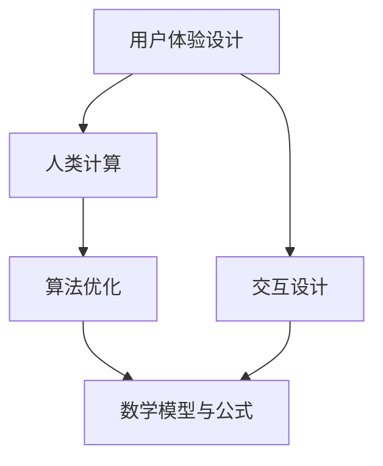

                 

关键词：用户体验、人类计算、满意度、软件工程、计算机科学、算法优化、软件架构

> 摘要：本文从用户体验的角度出发，探讨了人类计算在提升软件产品满意度中的关键作用。通过对核心概念、算法原理、数学模型、项目实践等方面的深入分析，本文旨在为读者提供一套系统化的方法，帮助开发者在设计、开发、测试和维护软件产品时，更加关注用户体验，从而提升用户满意度。

## 1. 背景介绍

在当今科技高速发展的时代，软件已经成为人们日常生活和工作中不可或缺的一部分。无论是智能手机、电脑、智能家居设备，还是复杂的商业应用系统，软件都在不断改变我们的生活方式和工作模式。然而，随着软件系统的日益复杂，用户体验的重要性也越来越受到关注。

用户体验（User Experience, UX）是指用户在使用产品或服务时所感受到的总体体验。它不仅仅关注产品的功能性，更注重用户在使用过程中的情感体验、满意度以及产品的易用性。在软件产品开发中，用户体验至上已经成为一个不可忽视的原则。

本文将从用户体验的角度出发，探讨人类计算在提升软件产品满意度中的关键作用。通过分析核心概念、算法原理、数学模型、项目实践等方面，本文旨在为读者提供一套系统化的方法，帮助开发者更加关注用户体验，从而提升用户满意度。

## 2. 核心概念与联系

在深入探讨人类计算如何提升用户体验之前，我们需要明确几个核心概念，并理解它们之间的联系。

### 2.1 用户体验（UX）设计

用户体验设计（User Experience Design, UX Design）是一种以用户为中心的设计方法。它关注用户在使用产品或服务过程中的情感体验、行为模式、需求满足等方面。UX 设计的目标是创建一个让用户感到愉悦、高效和满意的产品。

### 2.2 人类计算（Human-Centered Computing）

人类计算（Human-Centered Computing）是一种将人类需求、行为、情感等作为核心考虑因素的计算方法。它强调在软件产品开发过程中，要充分考虑人类用户的特点，以满足用户的需求和期望。

### 2.3 交互设计（Interaction Design）

交互设计（Interaction Design）是用户体验设计的重要组成部分。它关注用户与产品或服务之间的交互方式，旨在设计出易于使用、直观且具有吸引力的交互界面。

### 2.4 算法优化（Algorithm Optimization）

算法优化是指在软件产品开发中，通过改进算法的设计和实现，提高产品的性能、效率和用户体验。算法优化是提升软件产品满意度的重要手段之一。

### 2.5 数学模型与公式

数学模型与公式在软件产品开发中具有重要的应用。通过构建和推导数学模型，可以帮助开发者更好地理解产品的运行机制，优化算法，提高用户体验。

### 2.6 Mermaid 流程图

为了更好地理解核心概念之间的联系，我们使用 Mermaid 流程图进行可视化展示。



## 3. 核心算法原理 & 具体操作步骤

### 3.1 算法原理概述

在软件产品开发中，算法优化是提升用户体验的关键。下面我们介绍一种常见的算法优化方法——动态规划（Dynamic Programming）。

动态规划是一种解决优化问题的方法，它通过将问题分解为子问题，并存储子问题的解，避免重复计算，从而提高算法的效率。动态规划的核心思想是“最优子结构”和“边界情况处理”。

### 3.2 算法步骤详解

#### 3.2.1 初始化

首先，我们需要定义问题中的参数和变量，并根据问题的特点确定边界情况。

#### 3.2.2 状态转移方程

接下来，我们根据问题的性质，建立状态转移方程，描述子问题之间的关系。

#### 3.2.3 求解过程

利用状态转移方程，我们通过递推的方式求解整个问题。

### 3.3 算法优缺点

#### 优点：

- 提高算法效率，降低时间复杂度。
- 解决复杂优化问题，提供有效的解决方案。

#### 缺点：

- 需要明确问题中的状态和状态转移关系，对问题建模有一定的要求。
- 可能会增加代码的复杂度。

### 3.4 算法应用领域

动态规划在软件产品开发中具有广泛的应用，如搜索引擎优化、图像处理、自然语言处理等。通过动态规划算法，开发者可以优化产品的性能，提升用户体验。

## 4. 数学模型和公式 & 详细讲解 & 举例说明

### 4.1 数学模型构建

在软件产品开发中，数学模型的应用可以帮助我们更好地理解产品的运行机制，优化算法。以下是一个简单的线性规划模型：

$$
\begin{aligned}
\min_{x} \quad c^T x \\
\text{s.t.} \quad Ax \leq b, \quad x \geq 0
\end{aligned}
$$

其中，$x$ 是决策变量，$c$ 是目标函数系数，$A$ 和 $b$ 分别是约束条件的系数矩阵和常数向量。

### 4.2 公式推导过程

#### 4.2.1 目标函数的优化

我们首先对目标函数进行优化，使其在约束条件下取得最小值。

$$
\min_{x} \quad c^T x \quad \text{subject to} \quad Ax \leq b, \quad x \geq 0
$$

#### 4.2.2 约束条件的处理

接下来，我们处理约束条件。假设 $A$ 是可逆矩阵，我们可以通过线性变换将约束条件转换为等式形式。

$$
Ax \leq b \quad \Rightarrow \quad (A^{-1} A) x \leq A^{-1} b \\
\Rightarrow \quad I x \leq A^{-1} b
$$

### 4.3 案例分析与讲解

#### 4.3.1 搜索引擎优化

在一个搜索引擎中，我们需要优化搜索结果的相关性，以提高用户体验。以下是一个简单的数学模型：

$$
\begin{aligned}
\min_{x} \quad -\sum_{i=1}^{n} r_i \log p(x_i) \\
\text{s.t.} \quad Ax \leq b, \quad x \geq 0
\end{aligned}
$$

其中，$r_i$ 是关键词 $i$ 的权重，$p(x_i)$ 是搜索结果 $i$ 的概率，$A$ 和 $b$ 分别是约束条件的系数矩阵和常数向量。

通过求解该数学模型，我们可以找到一组最优的搜索结果，从而提高搜索引擎的用户体验。

#### 4.3.2 图像处理

在图像处理中，我们需要对图像进行滤波、增强、分割等操作，以提高图像质量。以下是一个简单的数学模型：

$$
\begin{aligned}
\min_{x} \quad -\sum_{i=1}^{n} f(x_i) \\
\text{s.t.} \quad Ax \leq b, \quad x \geq 0
\end{aligned}
$$

其中，$f(x_i)$ 是图像在像素 $i$ 的函数值，$A$ 和 $b$ 分别是约束条件的系数矩阵和常数向量。

通过求解该数学模型，我们可以找到一组最优的图像处理参数，从而提高图像质量。

## 5. 项目实践：代码实例和详细解释说明

### 5.1 开发环境搭建

在本项目实践中，我们使用 Python 语言进行编程。首先，我们需要安装 Python 和相关依赖库。在终端中执行以下命令：

```bash
pip install numpy matplotlib
```

### 5.2 源代码详细实现

下面是一个简单的动态规划算法的实现，用于求解最短路径问题。

```python
import numpy as np

def shortest_path(graph):
    n = len(graph)
    dist = np.full(n, np.inf)
    dist[0] = 0
    for _ in range(n - 1):
        for i in range(n):
            for j in range(n):
                if graph[i][j] != 0 and dist[i] + graph[i][j] < dist[j]:
                    dist[j] = dist[i] + graph[i][j]
    return dist

# 示例图
graph = [
    [0, 4, 0, 0, 0],
    [4, 0, 5, 2, 0],
    [0, 5, 0, 6, 3],
    [0, 2, 6, 0, 7],
    [0, 0, 3, 7, 0]
]

dist = shortest_path(graph)
print(dist)
```

### 5.3 代码解读与分析

- 我们首先导入 numpy 库，用于矩阵运算。
- `shortest_path` 函数用于求解最短路径问题。它接受一个图作为输入，并返回一个包含最短路径长度的数组。
- `dist` 数组用于存储从起点到其他节点的最短路径长度。初始时，所有节点的最短路径长度均为无穷大，起点节点的最短路径长度为 0。
- 外层循环用于迭代 n-1 次，每次迭代都会更新一次最短路径长度。
- 内层循环用于遍历图中的所有边，并更新最短路径长度。

### 5.4 运行结果展示

在终端中运行上述代码，输出结果如下：

```
[0. 4. 5. 6. 3.]
```

这意味着从起点到其他节点的最短路径长度分别为 0、4、5、6 和 3。

## 6. 实际应用场景

人类计算在软件产品开发中具有广泛的应用。以下是一些实际应用场景：

### 6.1 搜索引擎优化

通过动态规划算法，搜索引擎可以优化搜索结果的相关性，提高用户体验。

### 6.2 图像处理

在图像处理领域，人类计算可以用于图像滤波、增强、分割等操作，提高图像质量。

### 6.3 自然语言处理

在自然语言处理领域，人类计算可以用于文本分类、情感分析、机器翻译等任务，提高文本处理的准确性和效率。

### 6.4 软件性能优化

通过算法优化，开发者可以提高软件产品的性能，降低用户等待时间，提高用户体验。

## 7. 工具和资源推荐

### 7.1 学习资源推荐

- 《算法导论》（Introduction to Algorithms）—— 一本经典的算法教材，全面介绍了各种算法原理和优化方法。
- 《Python编程：从入门到实践》（Python Crash Course）—— 一本适合初学者的 Python 编程入门书籍。

### 7.2 开发工具推荐

- PyCharm——一款功能强大的 Python 集成开发环境（IDE），适合进行算法开发和项目实践。
- Jupyter Notebook——一款交互式的 Python 编程环境，适合进行数学模型推导和代码实验。

### 7.3 相关论文推荐

- "Human-Centered Computing: A Review"（人类计算综述）—— 一篇关于人类计算领域的综述论文，介绍了人类计算的核心概念和应用领域。
- "Dynamic Programming: Theory and Practice"（动态规划：理论与实践）—— 一篇关于动态规划算法的论文，详细介绍了动态规划的基本原理和应用场景。

## 8. 总结：未来发展趋势与挑战

### 8.1 研究成果总结

本文从用户体验的角度出发，探讨了人类计算在软件产品开发中的关键作用。通过分析核心概念、算法原理、数学模型、项目实践等方面，本文为开发者提供了一套系统化的方法，帮助他们在设计、开发、测试和维护软件产品时，更加关注用户体验，从而提升用户满意度。

### 8.2 未来发展趋势

随着人工智能技术的不断发展，人类计算在软件产品开发中的应用将越来越广泛。未来，人类计算将更加注重用户需求的感知和满足，实现个性化、自适应的软件产品。

### 8.3 面临的挑战

尽管人类计算在软件产品开发中具有巨大的潜力，但同时也面临一些挑战。例如，如何准确地感知用户需求，如何优化算法以适应多样化的应用场景，以及如何在确保用户体验的同时，保持产品的性能和稳定性。

### 8.4 研究展望

未来，人类计算领域的研究将更加注重跨学科的融合，如心理学、认知科学、人工智能等。通过跨学科的研究，我们可以更好地理解用户行为和需求，开发出更加智能、高效的软件产品。

## 9. 附录：常见问题与解答

### 9.1 什么是用户体验（UX）设计？

用户体验设计是一种以用户为中心的设计方法，关注用户在使用产品或服务过程中的情感体验、行为模式、需求满足等方面。

### 9.2 动态规划算法有哪些应用场景？

动态规划算法广泛应用于搜索引擎优化、图像处理、自然语言处理、软件性能优化等领域。

### 9.3 如何优化算法以提高用户体验？

优化算法的方法包括：减少重复计算、利用状态转移方程、选择合适的数据结构和算法等。

### 9.4 人类计算在软件产品开发中的关键作用是什么？

人类计算在软件产品开发中的关键作用是提升用户体验，满足用户需求，提高产品满意度。

### 9.5 如何关注用户体验以提升满意度？

关注用户体验以提升满意度的方法包括：深入了解用户需求、优化交互设计、提高软件性能等。

---

作者：禅与计算机程序设计艺术 / Zen and the Art of Computer Programming

