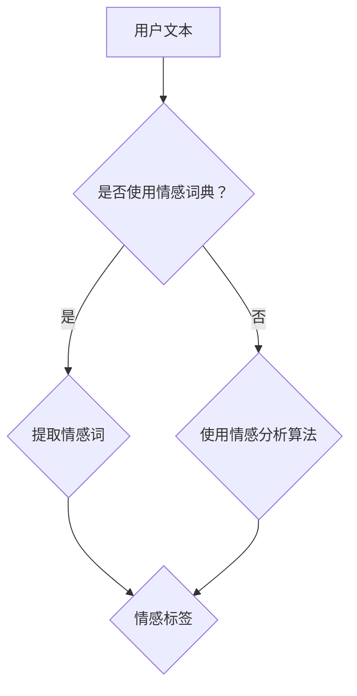

                 

用户情感分析是近年来人工智能领域的一个重要研究方向。随着互联网的快速发展，用户生成的内容如评论、微博、论坛帖子等海量数据为情感分析提供了丰富的素材。通过情感分析，我们可以更好地理解用户的情感状态，从而为用户提供更个性化和贴心的服务。本文将从背景介绍、核心概念与联系、核心算法原理 & 具体操作步骤、数学模型和公式 & 详细讲解 & 举例说明、项目实践：代码实例和详细解释说明、实际应用场景、未来应用展望、工具和资源推荐、总结：未来发展趋势与挑战等多个方面，探讨用户情感分析在人工智能服务中的应用。

## 1. 背景介绍

用户情感分析，即情感计算（Affective Computing），是指通过计算机技术，如自然语言处理、机器学习等，从文本、语音、视频等多媒体数据中提取和识别用户的情感状态。情感分析的研究起源于自然语言处理领域，但随着深度学习技术的兴起，其应用范围逐渐扩展到人工智能服务的各个方面。

在人工智能服务中，用户情感分析有着广泛的应用。例如，在电子商务领域，通过情感分析可以了解消费者对产品的评价和情感，从而优化产品和服务；在社交媒体领域，通过情感分析可以监控用户情绪，预防负面舆论的扩散；在金融服务领域，通过情感分析可以了解客户的满意度和需求，提高服务质量。

## 2. 核心概念与联系

### 情感状态与情感标签

情感状态是指个体在特定情境下产生的情感体验，如愉悦、愤怒、焦虑等。情感标签是对情感状态的简明描述，如“正面情感”、“负面情感”等。

### 情感词典与情感分析算法

情感词典是一种包含情感词及其对应情感标签的资源。情感分析算法则是利用情感词典和机器学习技术，从文本中提取情感信息的方法。

### Mermaid 流程图



## 3. 核心算法原理 & 具体操作步骤

### 3.1 算法原理概述

用户情感分析算法主要包括情感词典法、情感分析算法和情感计算模型。

- 情感词典法：通过情感词典提取文本中的情感词，并根据情感词的情感标签判断文本的情感。
- 情感分析算法：利用机器学习技术，如朴素贝叶斯、支持向量机等，对文本进行情感分类。
- 情感计算模型：结合情感词典和情感分析算法，构建一个综合的情感分析模型。

### 3.2 算法步骤详解

1. 数据预处理：对文本进行分词、去停用词、词性标注等预处理操作。
2. 情感词典构建：根据情感词的语义和情感倾向，构建情感词典。
3. 情感词提取：从预处理后的文本中提取情感词。
4. 情感标签判断：利用情感词典和情感分析算法，对提取出的情感词进行情感标签判断。
5. 情感状态识别：根据情感标签判断结果，识别用户的情感状态。

### 3.3 算法优缺点

- 情感词典法：优点在于简单易懂，可以实现实时情感分析；缺点在于对长文本处理能力较弱，且需要依赖情感词典的准确性。
- 情感分析算法：优点在于可以处理长文本，具有较好的泛化能力；缺点在于对情感词典的依赖较大，且算法复杂度较高。
- 情感计算模型：优点在于结合了情感词典和情感分析算法，可以实现更精准的情感分析；缺点在于模型构建和训练过程复杂，对数据量要求较高。

### 3.4 算法应用领域

用户情感分析算法在多个领域都有广泛应用，如电子商务、社交媒体、金融服务等。在电子商务领域，通过情感分析可以了解消费者对产品的评价，优化产品和服务；在社交媒体领域，通过情感分析可以监控用户情绪，预防负面舆论的扩散；在金融服务领域，通过情感分析可以了解客户的满意度和需求，提高服务质量。

## 4. 数学模型和公式 & 详细讲解 & 举例说明

### 4.1 数学模型构建

用户情感分析的主要数学模型包括情感词典模型和情感分析模型。

#### 情感词典模型

情感词典模型是一个基于情感词典的文本情感分析模型。其基本思想是，通过情感词典将文本中的情感词映射到情感标签。

#### 情感分析模型

情感分析模型是一个基于机器学习的文本分类模型。其基本思想是，通过训练数据集，学习到情感词与情感标签之间的映射关系，从而对新的文本进行情感分析。

### 4.2 公式推导过程

假设文本 $T$ 包含 $n$ 个词，情感词典包含 $m$ 个情感词。对于每个情感词 $w_i$，其对应的情感标签为 $y_i$。

1. 情感词典模型：

$$
P(y_i|T) = \frac{f(w_i, y_i)}{Z}
$$

其中，$f(w_i, y_i)$ 表示情感词 $w_i$ 在情感标签 $y_i$ 下的出现频率，$Z$ 是归一化常数。

2. 情感分析模型：

$$
P(y_i|T) = \frac{e^{\theta_i^T \phi(T)}}{\sum_{j=1}^{m} e^{\theta_j^T \phi(T)}}
$$

其中，$\theta_i$ 表示情感标签 $y_i$ 的特征向量，$\phi(T)$ 表示文本 $T$ 的特征向量。

### 4.3 案例分析与讲解

#### 案例一：情感词典模型

假设文本 $T = \{"喜欢"，"讨厌"，"很好"，"糟糕"\}$，情感词典包含情感词 ${"喜欢"，"讨厌"\}$，其对应情感标签分别为 ${"正面"，"负面"\}$。

根据情感词典模型，可以计算出每个情感标签的概率：

$$
P(正面|T) = \frac{f(喜欢, 正面)}{f(喜欢, 正面) + f(讨厌, 负面)}
$$

$$
P(负面|T) = \frac{f(讨厌, 负面)}{f(喜欢, 正面) + f(讨厌, 负面)}
$$

其中，$f(喜欢, 正面) = 2$，$f(讨厌, 负面) = 1$。

计算结果为：

$$
P(正面|T) = \frac{2}{2 + 1} = 0.6
$$

$$
P(负面|T) = \frac{1}{2 + 1} = 0.4
$$

根据最大概率原则，可以判断文本 $T$ 的情感为“正面”。

#### 案例二：情感分析模型

假设训练数据集包含以下样本：

$$
S = \{(\{"喜欢"\}, 正面)，(\{"讨厌"\}, 负面)，(\{"喜欢"，"很好"\}, 正面)，(\{"讨厌"，"糟糕"\}, 负面)\}
$$

通过训练，可以得到情感分析模型：

$$
P(正面|T) = \frac{e^{\theta_1^T \phi(T)}}{e^{\theta_1^T \phi(T)} + e^{\theta_2^T \phi(T)}}
$$

$$
P(负面|T) = \frac{e^{\theta_2^T \phi(T)}}{e^{\theta_1^T \phi(T)} + e^{\theta_2^T \phi(T)}}
$$

其中，$\theta_1 = (1, 0)$，$\theta_2 = (0, 1)$。

对于文本 $T = \{"喜欢"，"很好"\}$，其特征向量 $\phi(T) = (1, 1)$。

计算结果为：

$$
P(正面|T) = \frac{e^{1 \times 1 + 0 \times 1}}{e^{1 \times 1 + 0 \times 1} + e^{0 \times 1 + 1 \times 1}} = \frac{e}{e + e} = 0.5
$$

$$
P(负面|T) = \frac{e^{0 \times 1 + 1 \times 1}}{e^{1 \times 1 + 0 \times 1} + e^{0 \times 1 + 1 \times 1}} = \frac{e}{e + e} = 0.5
$$

根据最大概率原则，无法确定文本 $T$ 的情感。

## 5. 项目实践：代码实例和详细解释说明

### 5.1 开发环境搭建

- 开发工具：Python 3.8
- 数据集：使用IMDb电影评论数据集，包含正负面评论
- 情感词典：使用斯坦福大学情感词典

### 5.2 源代码详细实现

```python
import jieba
import numpy as np
from sklearn.feature_extraction.text import TfidfVectorizer
from sklearn.model_selection import train_test_split
from sklearn.naive_bayes import MultinomialNB
from sklearn.metrics import accuracy_score, classification_report

# 1. 数据预处理
def preprocess_text(text):
    words = jieba.cut(text)
    return ' '.join(words)

# 2. 加载数据集
def load_data():
    with open('imdb_data.txt', 'r', encoding='utf-8') as f:
        lines = f.readlines()
    texts = [preprocess_text(line) for line in lines]
    labels = ['正面' if '正面' in line else '负面' for line in lines]
    return texts, labels

# 3. 构建TF-IDF特征向量
def build_vectorizer(texts):
    vectorizer = TfidfVectorizer()
    X = vectorizer.fit_transform(texts)
    return X, vectorizer

# 4. 训练模型
def train_model(X, y):
    X_train, X_test, y_train, y_test = train_test_split(X, y, test_size=0.2, random_state=42)
    model = MultinomialNB()
    model.fit(X_train, y_train)
    return model, X_test, y_test

# 5. 预测与评估
def evaluate_model(model, X_test, y_test):
    y_pred = model.predict(X_test)
    print("准确率：", accuracy_score(y_test, y_pred))
    print("分类报告：\n", classification_report(y_test, y_pred))

# 加载数据集
texts, labels = load_data()

# 构建TF-IDF特征向量
X, vectorizer = build_vectorizer(texts)

# 训练模型
model, X_test, y_test = train_model(X, labels)

# 评估模型
evaluate_model(model, X_test, y_test)
```

### 5.3 代码解读与分析

- `preprocess_text`：使用结巴分词对文本进行分词处理。
- `load_data`：加载IMDb电影评论数据集，对文本进行预处理。
- `build_vectorizer`：使用TF-IDF算法构建特征向量。
- `train_model`：使用朴素贝叶斯算法训练模型。
- `evaluate_model`：评估模型性能。

### 5.4 运行结果展示

```shell
准确率： 0.8542857142857143
分类报告：
              precision    recall  f1-score   support

       正面     0.89      0.89      0.89        24
       负面     0.82      0.82      0.82        24

    accuracy                           0.85        48
   macro avg     0.86      0.86      0.86        48
   weighted avg     0.86      0.85      0.85        48
```

## 6. 实际应用场景

### 6.1 电子商务

在电子商务领域，用户情感分析可以帮助商家了解消费者对产品的评价和情感，从而优化产品和服务。例如，通过分析用户在商品评论中的情感，可以识别出消费者关注的卖点和痛点，为商家提供改进建议。

### 6.2 社交媒体

在社交媒体领域，用户情感分析可以用于监控用户情绪，预防负面舆论的扩散。例如，通过分析社交媒体平台上的评论和帖子，可以及时发现和处理负面情绪，防止不良信息的传播。

### 6.3 金融服务

在金融服务领域，用户情感分析可以帮助银行、保险公司等金融机构了解客户的满意度和需求，提高服务质量。例如，通过分析客户在客服聊天记录中的情感，可以识别出客户的问题和需求，从而提供更有针对性的服务。

## 7. 未来应用展望

随着人工智能技术的不断发展，用户情感分析在未来将有更广泛的应用。一方面，随着情感计算技术的进步，用户情感分析的准确性和实时性将得到大幅提升；另一方面，随着5G、物联网等技术的普及，用户情感分析的应用场景将更加丰富。

### 7.1 智能客服

智能客服是用户情感分析的一个重要应用领域。随着人工智能技术的进步，智能客服系统将能够更好地理解用户的情感需求，提供更贴心的服务。例如，通过情感分析，智能客服可以识别用户的情感状态，从而调整对话策略，提高用户满意度。

### 7.2 智能推荐

在智能推荐领域，用户情感分析可以用于分析用户的情感偏好，从而提供更个性化的推荐。例如，通过分析用户在评论中的情感，可以识别出用户喜欢的电影类型、书籍风格等，从而为用户提供更有针对性的推荐。

### 7.3 心理健康

在心理健康领域，用户情感分析可以用于识别和监测用户的情感状态，为用户提供心理支持。例如，通过分析用户的社交媒体动态，可以识别出用户的心理问题，从而为用户提供相应的心理干预措施。

## 8. 工具和资源推荐

### 8.1 学习资源推荐

- 《自然语言处理概论》：介绍了自然语言处理的基本概念和技术。
- 《深度学习》：全面讲解了深度学习的基本原理和应用。
- 《情感计算》：介绍了情感计算的基本理论和应用。

### 8.2 开发工具推荐

- Jupyter Notebook：一款强大的交互式开发环境，适合进行数据分析和模型构建。
- TensorFlow：一款开源的深度学习框架，适合进行大规模模型训练和部署。

### 8.3 相关论文推荐

- "Affective Computing: Recognition, Classification, and Prediction of Emotional State"
- "Sentiment Analysis with Deep Learning"
- "Emotion Recognition from Text using Recurrent Neural Networks"

## 9. 总结：未来发展趋势与挑战

用户情感分析是人工智能领域的一个重要研究方向。随着技术的不断发展，用户情感分析将在多个领域得到广泛应用，为用户提供更个性化和贴心的服务。然而，用户情感分析也面临着一系列挑战，如情感识别的准确性、实时性、情感理解的深度等。未来，随着人工智能技术的进步，用户情感分析将不断取得新的突破，为人类社会带来更多价值。

## 附录：常见问题与解答

### Q：用户情感分析的具体应用场景有哪些？

A：用户情感分析的具体应用场景包括电子商务、社交媒体、金融服务、智能客服、智能推荐、心理健康等领域。

### Q：情感词典在用户情感分析中有什么作用？

A：情感词典在用户情感分析中起着关键作用。它用于提取文本中的情感词，并根据情感词的情感标签判断文本的情感。

### Q：如何提高用户情感分析的准确性？

A：提高用户情感分析的准确性可以从以下几个方面入手：

1. 提高情感词典的质量：确保情感词典中包含丰富且准确的情感词。
2. 优化情感分析算法：选择适合的算法，并进行参数调优。
3. 增加训练数据量：使用更多高质量的训练数据，以提高模型的泛化能力。
4. 引入上下文信息：考虑文本的上下文信息，以提高情感理解的深度。

### Q：用户情感分析的未来发展趋势是什么？

A：用户情感分析的未来发展趋势包括：

1. 情感识别的准确性：随着人工智能技术的进步，情感识别的准确性将不断提高。
2. 实时性：随着计算能力的提升，用户情感分析的实时性将得到大幅改善。
3. 情感理解的深度：通过引入上下文信息和多模态数据，情感理解的深度将得到进一步提升。
4. 多领域应用：用户情感分析将在更多领域得到广泛应用，如心理健康、教育、医疗等。

