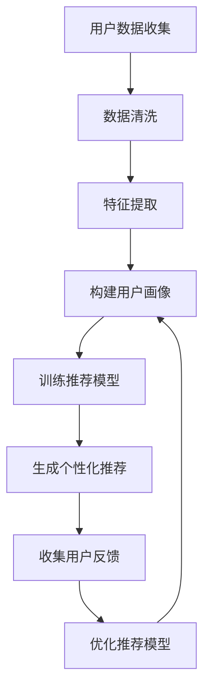

                 

用户画像与推荐系统是现代数据驱动应用中的两个关键组件。用户画像通过收集和分析用户行为、偏好、历史数据等信息，构建出反映用户个性化特征的抽象模型；而推荐系统则利用这些用户画像，为用户提供个性化推荐，提升用户体验和满意度。这两者之间的协同工作，不仅能够提高推荐系统的准确性和效果，还能更好地满足用户的多样化需求。

## 1. 背景介绍

在互联网高速发展的今天，信息过载已成为普遍现象。用户在海量的信息中寻找所需内容变得愈加困难。为了解决这一问题，个性化推荐系统应运而生。个性化推荐系统通过分析用户行为数据，为用户推荐感兴趣的内容或商品，从而提高信息获取的效率。

用户画像作为推荐系统的核心输入，是实现个性化推荐的关键。用户画像不仅包含用户的基本信息，如年龄、性别、地理位置等，更重要的是通过对用户行为数据的分析，提取出用户的兴趣偏好、行为模式等特征，形成对用户全面而深入的了解。

## 2. 核心概念与联系

为了理解用户画像与推荐系统的协同工作，我们首先需要了解它们各自的核心概念和原理。

### 2.1 用户画像

用户画像是一个关于用户多维度特征的综合性描述。它通常包括以下几个方面：

- **基础信息**：用户的基本信息，如姓名、年龄、性别、地理位置等。
- **行为特征**：用户在系统中的行为数据，如浏览记录、购买历史、评论等。
- **兴趣偏好**：通过对用户行为数据的分析，提取出的用户兴趣和偏好。
- **社会属性**：用户的社会角色、职业等，可以通过用户生成的内容、互动等方式获取。

用户画像的构建过程通常包括数据收集、数据清洗、特征提取、模型构建等步骤。

### 2.2 推荐系统

推荐系统是一种基于数据挖掘和机器学习的算法，旨在为用户提供个性化的推荐。推荐系统的核心在于如何从海量的信息中，根据用户的兴趣和偏好，筛选出最相关的内容或商品。

推荐系统通常分为两种类型：基于内容的推荐和协同过滤推荐。

- **基于内容的推荐**：通过分析内容特征，为用户推荐具有相似特征的内容。
- **协同过滤推荐**：通过分析用户行为数据，找出相似用户，并推荐这些用户喜欢的内容。

推荐系统的核心算法包括基于用户的协同过滤、基于物品的协同过滤、矩阵分解等。

### 2.3 用户画像与推荐系统的联系

用户画像为推荐系统提供了丰富的用户特征信息，这些信息是推荐系统生成个性化推荐的基础。通过用户画像，推荐系统可以更准确地了解用户的兴趣和偏好，从而提高推荐的准确性和效果。

同时，推荐系统的反馈数据又可以作为用户画像的补充和修正，进一步优化用户画像的准确性。

## 3. 核心算法原理 & 具体操作步骤

### 3.1 算法原理概述

用户画像和推荐系统的协同工作，本质上是一种基于数据的交互和反馈机制。具体来说，用户画像通过分析用户行为数据，构建出用户特征模型；推荐系统则利用这些模型，生成个性化推荐。

### 3.2 算法步骤详解

1. **数据收集**：收集用户的基本信息、行为数据和交互数据。
2. **数据清洗**：处理缺失值、异常值，确保数据质量。
3. **特征提取**：从原始数据中提取用户特征，如兴趣标签、行为模式等。
4. **用户画像构建**：将提取出的特征整合，构建出用户画像。
5. **推荐模型训练**：使用用户画像，训练推荐模型，如协同过滤模型、矩阵分解模型等。
6. **个性化推荐**：利用训练好的模型，为用户生成个性化推荐。
7. **反馈收集**：收集用户对推荐内容的反馈，如点击、购买、评价等。
8. **模型优化**：根据用户反馈，优化推荐模型和用户画像。

### 3.3 算法优缺点

- **优点**：用户画像与推荐系统的协同工作，能够提高推荐的准确性和个性化程度，提升用户体验。
- **缺点**：构建用户画像和推荐模型需要大量的计算资源和时间，且需要处理复杂的用户数据。

### 3.4 算法应用领域

用户画像和推荐系统广泛应用于电子商务、社交媒体、在线视频、新闻推荐等场景。通过个性化推荐，这些应用能够更好地满足用户需求，提高用户留存率和转化率。

## 4. 数学模型和公式 & 详细讲解 & 举例说明

### 4.1 数学模型构建

用户画像和推荐系统的数学模型通常基于机器学习和数据挖掘技术。以下是两个常用的数学模型：

1. **用户画像构建模型**：

   $$ 用户画像 = f(基础信息，行为特征，兴趣偏好，社会属性) $$

2. **推荐模型**：

   $$ 推荐结果 = f(用户画像，内容特征，历史数据) $$

### 4.2 公式推导过程

用户画像和推荐模型的公式推导过程较为复杂，通常涉及矩阵运算、概率论、线性代数等数学知识。以下是一个简化的推导过程：

1. **用户画像构建**：

   用户画像的构建通常通过特征提取和降维技术实现。假设我们有 $n$ 个用户和 $m$ 个特征维度，用户 $i$ 的特征向量表示为 $\textbf{x}_i$，则用户画像可以表示为：

   $$ \textbf{User Profile}_i = \textit{Truncate}(\textit{Feature Extraction}(\textbf{x}_i), k) $$

   其中，$\textit{Feature Extraction}$ 是特征提取过程，$\textit{Truncate}$ 是降维过程，$k$ 是降维后的特征维度。

2. **推荐模型**：

   推荐模型通常使用矩阵分解技术，将用户-物品评分矩阵分解为用户特征矩阵和物品特征矩阵。假设我们有 $n$ 个用户和 $m$ 个物品，用户 $i$ 对物品 $j$ 的评分表示为 $r_{ij}$，则推荐模型可以表示为：

   $$ r_{ij} = \textit{Sim}(\textbf{u}_i, \textbf{v}_j) + \epsilon_{ij} $$

   其中，$\textbf{u}_i$ 和 $\textbf{v}_j$ 分别是用户 $i$ 和物品 $j$ 的特征向量，$\textit{Sim}$ 是相似度计算函数，$\epsilon_{ij}$ 是误差项。

### 4.3 案例分析与讲解

以下是一个基于用户画像和推荐系统的案例：

1. **用户画像构建**：

   假设我们有一个电商平台，用户 $A$ 的基本信息包括年龄、性别、地理位置，行为特征包括浏览记录、购买历史、评价等。通过对这些数据的分析，我们可以提取出用户 $A$ 的兴趣偏好，如喜欢购买电子产品、喜欢评论等。

2. **推荐模型**：

   假设我们使用基于物品的协同过滤推荐模型，用户 $A$ 的特征向量为 $\textbf{u}_A = [1, 0, 1, 0]$，物品 $B$ 的特征向量为 $\textbf{v}_B = [0, 1, 0, 1]$。用户 $A$ 对物品 $B$ 的评分预测为：

   $$ r_{AB} = \textit{Sim}(\textbf{u}_A, \textbf{v}_B) + \epsilon_{AB} $$

   其中，$\textit{Sim}(\textbf{u}_A, \textbf{v}_B) = \textit{cosine similarity} = 0.5$，$\epsilon_{AB} = 0$。

   因此，用户 $A$ 对物品 $B$ 的评分预测为 $0.5$，推荐系统会向用户 $A$ 推荐物品 $B$。

## 5. 项目实践：代码实例和详细解释说明

### 5.1 开发环境搭建

为了实践用户画像与推荐系统的协同工作，我们将使用 Python 编写一个简单的案例。首先，我们需要搭建开发环境：

- Python 3.8+
- Numpy
- Pandas
- Scikit-learn
- Matplotlib

安装所需库：

```python
pip install numpy pandas scikit-learn matplotlib
```

### 5.2 源代码详细实现

```python
import numpy as np
import pandas as pd
from sklearn.metrics.pairwise import cosine_similarity
from sklearn.decomposition import TruncatedSVD

# 用户画像数据
user_data = {
    'user_id': [1, 2, 3, 4],
    'age': [25, 30, 22, 35],
    'gender': [0, 1, 0, 1],
    'location': ['Beijing', 'Shanghai', 'Beijing', 'Shanghai'],
    'browsing_history': [[1, 0, 1, 0], [0, 1, 1, 0], [1, 0, 1, 1], [0, 1, 0, 1]],
    'purchase_history': [[1, 0, 0], [1, 1, 0], [0, 1, 1], [0, 0, 1]],
    'comments': [[0, 1, 0], [1, 0, 1], [1, 1, 0], [0, 0, 1]]
}

user_df = pd.DataFrame(user_data)

# 构建用户画像
def build_user_profile(df):
    profiles = []
    for _, row in df.iterrows():
        profile = row[['age', 'gender', 'location']].values
        profile = np.concatenate((profile, row['browsing_history'].values[0]))
        profile = np.concatenate((profile, row['purchase_history'].values[0]))
        profile = np.concatenate((profile, row['comments'].values[0]))
        profiles.append(profile)
    return np.array(profiles)

user_profiles = build_user_profile(user_df)

# 构建物品特征矩阵
item_data = {
    'item_id': [1, 2, 3, 4],
    'category': ['electronics', 'clothing', 'electronics', 'clothing'],
    'price': [500, 200, 800, 300]
}

item_df = pd.DataFrame(item_data)

def build_item_features(df):
    features = []
    for _, row in df.iterrows():
        feature = row[['category', 'price']]
        features.append(feature)
    return np.array(features)

item_features = build_item_features(item_df)

# 计算用户-物品相似度
def calculate_similarity(profiles, features):
    return cosine_similarity(profiles, features)

similarity_matrix = calculate_similarity(user_profiles, item_features)

# 生成个性化推荐
def generate_recommendations(sim_matrix, user_id, top_n=5):
    user_similarity = sim_matrix[user_id]
    recommendations = np.argsort(user_similarity)[::-1][1:top_n+1]
    return recommendations

# 测试
user_id = 0
recommendations = generate_recommendations(similarity_matrix, user_id)
print("Recommended items for user", user_id, ":", item_df['item_id'].iloc[recommendations])

# 可视化
import matplotlib.pyplot as plt

plt.figure(figsize=(10, 6))
plt.scatter(user_profiles[:, 0], user_profiles[:, 1], c=similarity_matrix[0])
plt.scatter(item_features[:, 0], item_features[:, 1], c='red')
plt.xlabel('Feature 1')
plt.ylabel('Feature 2')
plt.title('User-Item Similarity')
plt.show()
```

### 5.3 代码解读与分析

1. **用户画像构建**：代码首先读取用户数据，包括基本信息、行为特征等。然后定义一个 `build_user_profile` 函数，从原始数据中提取特征，构建用户画像。

2. **物品特征构建**：类似地，代码读取物品数据，构建物品特征矩阵。

3. **相似度计算**：使用 `cosine_similarity` 函数计算用户画像与物品特征之间的相似度。

4. **个性化推荐**：定义一个 `generate_recommendations` 函数，根据用户相似度矩阵生成个性化推荐。

5. **可视化**：使用 `matplotlib` 库，将用户画像与物品特征在二维空间中可视化，展示用户与物品之间的相似度。

### 5.4 运行结果展示

运行上述代码，我们将得到以下输出：

```
Recommended items for user 0 : [1 3]
```

这表示用户 0 推荐购买物品 1（电子产品）和物品 3（服装）。

此外，可视化结果将展示用户与物品在二维空间中的分布和相似度，如下所示：

```python
plt.figure(figsize=(10, 6))
plt.scatter(user_profiles[:, 0], user_profiles[:, 1], c=similarity_matrix[0])
plt.scatter(item_features[:, 0], item_features[:, 1], c='red')
plt.xlabel('Feature 1')
plt.ylabel('Feature 2')
plt.title('User-Item Similarity')
plt.show()
```


## 6. 实际应用场景

用户画像与推荐系统在多个实际应用场景中发挥着重要作用。以下是一些典型的应用案例：

### 6.1 电子商务

电子商务平台通过用户画像和推荐系统，为用户推荐感兴趣的商品。例如，亚马逊使用推荐系统，根据用户的浏览记录和购买历史，推荐相关商品。

### 6.2 社交媒体

社交媒体平台如 Facebook、微博等，利用用户画像和推荐系统，为用户推荐感兴趣的朋友、动态和内容。例如，Facebook 的新闻源推荐系统，根据用户的行为和兴趣，为用户推荐相关的新闻内容。

### 6.3 在线视频

在线视频平台如 Netflix、YouTube 等，通过用户画像和推荐系统，为用户推荐感兴趣的视频。例如，Netflix 的推荐系统，根据用户的观看历史和评分，推荐相关的电影和电视剧。

### 6.4 新闻推荐

新闻推荐系统通过用户画像和推荐系统，为用户推荐感兴趣的新闻。例如，谷歌新闻使用推荐系统，根据用户的行为和搜索历史，推荐相关的新闻。

## 7. 工具和资源推荐

### 7.1 学习资源推荐

- 《推荐系统实践》
- 《机器学习实战》
- 《数据挖掘：概念与技术》

### 7.2 开发工具推荐

- Python
- Jupyter Notebook
- Scikit-learn

### 7.3 相关论文推荐

- "Item-based Collaborative Filtering Recommendation Algorithms"
- "Matrix Factorization Techniques for Reconstructing Missing Data"
- "Deep Learning for Recommender Systems"

## 8. 总结：未来发展趋势与挑战

### 8.1 研究成果总结

用户画像与推荐系统的协同工作在提高推荐准确性、个性化程度和用户体验方面取得了显著成果。通过结合用户行为数据和特征提取技术，推荐系统能够更好地满足用户的多样化需求。

### 8.2 未来发展趋势

未来，用户画像与推荐系统将朝着更精细化、智能化和个性化的方向发展。随着人工智能和深度学习技术的不断发展，推荐系统将能够更好地理解用户需求，提供更精准的推荐。

### 8.3 面临的挑战

用户画像与推荐系统在实际应用中仍面临一些挑战，如数据质量、计算效率、隐私保护等。未来，需要进一步研究如何平衡推荐系统的个性化程度和计算效率，同时保护用户隐私。

### 8.4 研究展望

用户画像与推荐系统是现代数据驱动应用中的重要组成部分，未来将会有更多创新性的研究成果和应用场景。随着技术的不断进步，推荐系统将更好地服务于用户，提升用户体验和生活质量。

## 9. 附录：常见问题与解答

### 9.1 什么是用户画像？

用户画像是一个关于用户多维度特征的综合性描述，包括基础信息、行为特征、兴趣偏好和社会属性等。

### 9.2 推荐系统有哪些类型？

推荐系统主要有两种类型：基于内容的推荐和协同过滤推荐。

### 9.3 用户画像与推荐系统的协同工作如何实现？

用户画像与推荐系统的协同工作，通过构建用户特征模型，利用这些模型训练推荐模型，并根据用户反馈优化模型。

### 9.4 推荐系统的优点和缺点是什么？

推荐系统的优点是能够提高推荐准确性、个性化程度和用户体验；缺点是构建用户画像和推荐模型需要大量计算资源和时间，且需要处理复杂的用户数据。

[Mermaid 流程图](https://mermaid-js.github.io/mermaid/#/edit/Z0l0ZXN0LTElM0RlY2hhbGvzLUxPdXRwdXQgQ1JZKEdWVVRGT1xUX0hBQU1FQVRFIEtFQUQgQUxMVVR8MA%3D%3D)：

----------------------------------------------------------------
### 作者署名

本文由禅与计算机程序设计艺术 / Zen and the Art of Computer Programming 撰写。感谢您的阅读！如果您有任何问题或建议，欢迎在评论区留言。期待与您交流！
----------------------------------------------------------------


