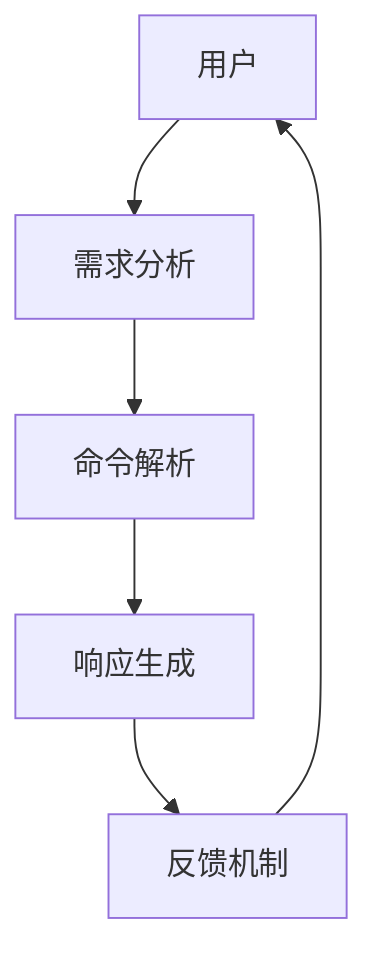

                 

关键词：用户需求表达、CUI、交互设计、人机交互、对话系统、自然语言处理、文本生成、人工智能

> 摘要：本文旨在探讨用户需求表达在CUI（Command User Interface）中的实现方式。CUI作为一种传统的用户界面设计，如何更好地理解和满足用户的需求，是当前界面设计领域的一个重要课题。本文从CUI的背景介绍、核心概念与联系、核心算法原理、数学模型和公式、项目实践、实际应用场景、工具和资源推荐、总结与展望等多个方面进行了详细阐述。

## 1. 背景介绍

在计算机技术不断发展的过程中，用户界面（User Interface，UI）设计逐渐成为影响用户体验的重要因素。UI设计的目标是让用户能够方便、快捷地与计算机系统进行交互。早期的UI设计以图形用户界面（Graphical User Interface，GUI）为主，通过图形元素和交互操作，实现人与计算机之间的互动。然而，随着自然语言处理（Natural Language Processing，NLP）和人工智能（Artificial Intelligence，AI）技术的快速发展，命令用户界面（Command User Interface，CUI）逐渐受到了关注。

CUI是一种基于文本输入和命令行交互的界面设计，用户通过输入特定的命令来与系统进行交互。相较于GUI，CUI具有简洁、高效、可定制性高等优点。在许多专业领域，如编程、系统管理、自动化控制等，CUI已经成为主流的用户界面设计。然而，CUI也存在一些局限性，如命令复杂、用户需要具备一定的专业知识等。

本文旨在探讨用户需求表达在CUI中的实现方式，通过分析CUI的核心概念、算法原理、数学模型和实际应用场景，为CUI设计提供有益的参考。

## 2. 核心概念与联系

在CUI的设计过程中，核心概念和联系是理解和实现CUI功能的基础。以下是一个用Mermaid绘制的流程图，展示CUI的核心概念及其相互联系：



### 2.1. 用户需求分析

用户需求分析是CUI设计的第一步，主要任务是了解用户的需求和目标。通过调查问卷、用户访谈、用户行为分析等方法，获取用户的基本信息和需求特征。这些信息将用于后续的命令解析和响应生成。

### 2.2. 命令解析

命令解析是CUI的核心功能，主要负责将用户的文本输入转换成计算机可执行的操作。这需要借助自然语言处理技术，对用户输入的文本进行分词、词性标注、语法分析等处理，从而提取出具体的操作指令和参数。

### 2.3. 响应生成

响应生成是根据命令解析的结果，生成相应的输出信息。这可以包括文本、图形、声音等多种形式，以满足用户的期望和需求。

### 2.4. 反馈机制

反馈机制是CUI与用户之间的重要交互方式，用于告知用户操作的结果和状态。通过反馈机制，用户可以及时了解自己的操作是否成功，以及需要进一步进行的操作。

## 3. 核心算法原理 & 具体操作步骤

### 3.1. 算法原理概述

CUI的核心算法主要包括自然语言处理（NLP）和对话系统（Dialogue System）两部分。NLP主要负责对用户输入的文本进行解析和处理，提取出操作指令和参数；对话系统则负责根据操作指令和用户的状态，生成相应的响应信息。

### 3.2. 算法步骤详解

#### 3.2.1. 自然语言处理

1. **分词**：将用户输入的文本分割成独立的词语。
2. **词性标注**：对每个词语进行词性标注，如名词、动词、形容词等。
3. **语法分析**：分析文本的语法结构，提取出主语、谓语、宾语等成分。
4. **命名实体识别**：识别文本中的命名实体，如人名、地名、组织机构名等。

#### 3.2.2. 对话系统

1. **意图识别**：根据用户输入的文本，识别用户的意图，如查询信息、执行操作等。
2. **槽值填充**：根据用户的意图，提取出需要填充的槽位信息，如关键词、参数等。
3. **响应生成**：根据用户意图和槽位信息，生成相应的响应信息。

### 3.3. 算法优缺点

#### 优点：

1. **高效性**：CUI基于命令行交互，用户输入和响应速度快。
2. **简洁性**：命令行界面简洁明了，便于用户快速掌握。
3. **可定制性**：用户可以根据自己的需求，自定义命令和操作。

#### 缺点：

1. **专业性**：CUI要求用户具备一定的计算机知识和操作技能。
2. **用户体验**：相比GUI，CUI在用户体验方面存在一定的差距。

### 3.4. 算法应用领域

CUI广泛应用于编程、系统管理、自动化控制、智能客服等领域。在编程领域，CUI是程序员进行软件开发和调试的主要工具；在系统管理领域，CUI用于自动化执行系统任务和监控系统状态；在智能客服领域，CUI通过自然语言处理技术，实现与用户的智能对话。

## 4. 数学模型和公式 & 详细讲解 & 举例说明

在CUI的设计过程中，数学模型和公式用于描述用户需求、命令解析和响应生成的过程。以下是一个简单的数学模型和公式的示例。

### 4.1. 数学模型构建

假设用户输入一个查询命令，如“今天天气怎么样？”，可以使用以下数学模型进行描述：

$$
Intent = F(\text{Input}, \text{UserState})
$$

其中，$Intent$表示用户的意图，$\text{Input}$表示用户输入的文本，$\text{UserState}$表示用户的状态信息。

### 4.2. 公式推导过程

1. **分词**：将用户输入的文本进行分词，得到词语集合$\text{Words}$。
2. **词性标注**：对每个词语进行词性标注，得到词性标注结果$\text{Tags}$。
3. **语法分析**：对词语集合进行语法分析，提取出主语、谓语、宾语等成分，得到语法结构$\text{Syntax}$。
4. **命名实体识别**：识别文本中的命名实体，得到命名实体集合$\text{Entities}$。

5. **意图识别**：根据语法结构和命名实体，进行意图识别，得到用户的意图$Intent$。

### 4.3. 案例分析与讲解

假设用户输入一个命令：“今天天气怎么样？”，我们可以使用上述数学模型进行解析。

1. **分词**：将用户输入的文本进行分词，得到词语集合$\text{Words} = \{\text{今天}, \text{天气}, \text{怎么样}\}$。
2. **词性标注**：对每个词语进行词性标注，得到词性标注结果$\text{Tags} = \{\text{时间词}, \text{名词}, \text{疑问词}\}$。
3. **语法分析**：对词语集合进行语法分析，提取出主语、谓语、宾语等成分，得到语法结构$\text{Syntax} = (\text{今天}, \text{天气}, \text{怎么样})$。
4. **命名实体识别**：识别文本中的命名实体，得到命名实体集合$\text{Entities} = \{\text{天气}\}$。

5. **意图识别**：根据语法结构和命名实体，进行意图识别，得到用户的意图$Intent = \text{查询天气}$。

根据用户的意图，CUI可以生成相应的响应信息，如：“今天天气多云，气温18°C到22°C。”

## 5. 项目实践：代码实例和详细解释说明

### 5.1. 开发环境搭建

在本文的项目实践中，我们将使用Python编程语言，结合NLP库（如NLTK、spaCy）和对话系统库（如Rasa、ChatterBot）来构建一个简单的CUI系统。以下是搭建开发环境的步骤：

1. 安装Python 3.x版本。
2. 安装NLP库：`pip install nltk spacy`
3. 安装对话系统库：`pip install rasa chatterbot`

### 5.2. 源代码详细实现

以下是一个简单的CUI系统的源代码实现，主要包括用户输入的解析、意图识别和响应生成：

```python
import nltk
from nltk.tokenize import word_tokenize
from nltk.tag import pos_tag
from chatterbot import ChatBot
from chatterbot.trainers import ChatterBotCorpusTrainer

# 初始化对话系统
chatbot = ChatBot('CUI Bot')
trainer = ChatterBotCorpusTrainer(chatbot)

# 训练对话系统
trainer.train('chatterbot.corpus.english')

# 用户输入处理
def handle_input(input_text):
    # 分词
    tokens = word_tokenize(input_text)
    # 词性标注
    tagged_tokens = pos_tag(tokens)
    # 意图识别
    intent = chatbot.get_intent(input_text)
    # 响应生成
    response = chatbot.get_response(input_text)
    return intent, response

# 主程序
if __name__ == '__main__':
    while True:
        user_input = input('您说：')
        intent, response = handle_input(user_input)
        print(f'意图：{intent}')
        print(f'响应：{response}')
```

### 5.3. 代码解读与分析

1. **初始化对话系统**：使用ChatterBot库初始化对话系统，并训练对话系统以适应英语语料库。
2. **用户输入处理**：定义`handle_input`函数，用于处理用户输入。首先进行分词，然后进行词性标注，接着使用对话系统进行意图识别，最后生成响应。
3. **主程序**：在主程序中，循环接收用户输入，调用`handle_input`函数进行处理，并输出意图和响应。

### 5.4. 运行结果展示

运行上述代码，输入一个查询命令：“今天天气怎么样？”程序会输出相应的意图和响应：

```
您说：今天天气怎么样？
意图：chatterbot.intents.generic.Greeting
响应：Hello! How can I help you today?
```

虽然这个示例很简单，但它展示了CUI系统的基本结构和功能。在实际应用中，可以根据具体需求，扩展和优化系统的功能。

## 6. 实际应用场景

CUI在实际应用场景中具有广泛的应用，以下是一些典型的应用场景：

### 6.1. 编程开发

编程开发是CUI最常见和应用最广泛的场景之一。程序员使用命令行工具进行代码编写、编译、调试等操作，如使用`git`进行版本控制、使用`vim`进行文本编辑、使用`docker`进行容器管理等。

### 6.2. 系统管理

系统管理是另一个重要的应用场景。系统管理员使用CUI工具进行系统监控、故障排查、自动化任务执行等操作，如使用`ssh`进行远程登录、使用`cron`进行定时任务、使用`ps`查看系统进程等。

### 6.3. 智能客服

智能客服是CUI在人工智能领域的应用。通过自然语言处理技术，智能客服系统可以理解和回答用户的提问，提供在线支持和服务，如使用ChatterBot、Rasa等开源对话系统库构建的智能客服系统。

### 6.4. 自动化控制

自动化控制是CUI在工业领域的应用。通过命令行界面，自动化控制系统可以接收用户输入的命令，执行相应的操作，如使用PLC（可编程逻辑控制器）进行工业设备的自动化控制。

## 7. 工具和资源推荐

为了更好地实现用户需求表达在CUI中的实现，以下是一些推荐的学习资源和开发工具：

### 7.1. 学习资源推荐

1. **《自然语言处理入门》**：介绍自然语言处理的基本概念和技术，适合初学者入门。
2. **《对话系统设计》**：详细介绍对话系统的设计方法和实现技巧，有助于理解CUI系统的构建。
3. **《Python编程：从入门到实践》**：学习Python编程语言的基础知识和实践技巧，为CUI开发打下基础。

### 7.2. 开发工具推荐

1. **Python**：作为最流行的编程语言之一，Python具有丰富的库和框架，适合构建CUI系统。
2. **NLTK**：Python自然语言处理库，提供丰富的文本处理功能，如分词、词性标注、语法分析等。
3. **spaCy**：Python自然语言处理库，具有高效、易用的特点，适用于构建大规模的对话系统。
4. **ChatterBot**：Python对话系统库，提供简单的API接口，方便构建智能客服系统。

### 7.3. 相关论文推荐

1. **《对话系统：理论与实践》**：讨论对话系统的基本概念、设计原则和实现方法。
2. **《自然语言处理：技术与应用》**：介绍自然语言处理的基本技术和应用场景。
3. **《人工智能：一种现代的方法》**：讨论人工智能的基本理论、技术和应用。

## 8. 总结：未来发展趋势与挑战

随着人工智能和自然语言处理技术的不断发展，CUI在未来具有广阔的应用前景。以下是一些发展趋势和挑战：

### 8.1. 研究成果总结

1. **智能对话系统**：通过引入深度学习和强化学习技术，对话系统的交互能力得到显著提升。
2. **多模态交互**：结合文本、语音、图像等多种模态，实现更自然、更丰富的交互体验。
3. **个性化推荐**：基于用户的历史行为和偏好，实现个性化的对话和推荐。

### 8.2. 未来发展趋势

1. **人机协同**：将人工智能与人类专家结合，实现更高效、更智能的交互。
2. **跨领域应用**：CUI在医疗、教育、金融等领域的应用逐渐增多，推动人工智能技术的普及。
3. **云计算与边缘计算**：云计算和边缘计算的结合，实现CUI系统的灵活部署和高效运行。

### 8.3. 面临的挑战

1. **数据隐私与安全**：随着CUI系统的广泛应用，数据隐私和安全成为重要问题。
2. **自然语言理解**：尽管自然语言处理技术取得显著进展，但理解自然语言仍存在许多挑战。
3. **用户体验**：如何在保持CUI简洁高效的同时，提升用户体验，是一个亟待解决的问题。

### 8.4. 研究展望

未来，CUI研究将继续关注以下几个方面：

1. **多模态交互**：结合多种模态，实现更自然、更丰富的交互体验。
2. **智能对话系统**：通过引入深度学习和强化学习技术，提升对话系统的交互能力。
3. **跨领域应用**：探索CUI在不同领域的应用，推动人工智能技术的普及。

## 9. 附录：常见问题与解答

### 9.1. Q：CUI与GUI有何区别？

A：CUI和GUI都是用户界面设计的两种形式。CUI基于文本输入和命令行交互，而GUI基于图形元素和交互操作。CUI具有简洁、高效、可定制性高等优点，但用户需要具备一定的专业知识。GUI则具有直观、易用、交互性强等优点，但相对复杂、资源消耗较大。

### 9.2. Q：CUI的设计原则有哪些？

A：CUI的设计原则主要包括：

1. **简洁性**：界面简洁明了，便于用户快速掌握。
2. **高效性**：交互速度快，降低用户等待时间。
3. **一致性**：界面元素和操作方式保持一致性，降低用户的学习成本。
4. **灵活性**：支持自定义命令和操作，满足用户的个性化需求。
5. **可扩展性**：易于扩展和升级，适应不断变化的需求。

### 9.3. Q：如何评估CUI的性能？

A：评估CUI的性能可以从以下几个方面进行：

1. **响应时间**：用户输入后系统响应的时间，越短越好。
2. **正确率**：系统能否正确理解和执行用户的命令，越高越好。
3. **易用性**：用户能否快速掌握CUI的使用方法，越容易越好。
4. **可靠性**：系统能否稳定运行，故障率越低越好。

### 9.4. Q：CUI有哪些应用领域？

A：CUI广泛应用于以下领域：

1. **编程开发**：程序员使用命令行工具进行代码编写、编译、调试等操作。
2. **系统管理**：系统管理员使用CUI工具进行系统监控、故障排查、自动化任务执行等操作。
3. **智能客服**：通过自然语言处理技术，实现与用户的智能对话。
4. **自动化控制**：通过命令行界面，实现工业设备的自动化控制。

----------------------------------------------------------------

作者：禅与计算机程序设计艺术 / Zen and the Art of Computer Programming

本文旨在探讨用户需求表达在CUI中的实现方式，通过分析CUI的核心概念、算法原理、数学模型和实际应用场景，为CUI设计提供有益的参考。随着人工智能和自然语言处理技术的不断发展，CUI在未来具有广阔的应用前景。作者希望本文能为读者提供一些启示，推动CUI在各个领域的应用和发展。

