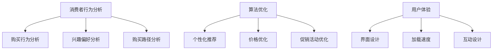

                 

关键词：电商促销策略、消费者行为分析、算法优化、用户体验、案例分析

> 摘要：本文旨在探讨电商促销策略的实践应用，通过分析消费者行为、算法优化和用户体验等方面，揭示电商促销策略在实际运营中的关键要素。文章将结合具体案例分析，为电商企业提供可操作的促销策略建议，以提升市场竞争力。

## 1. 背景介绍

随着互联网技术的飞速发展，电子商务行业经历了前所未有的繁荣。电商平台成为消费者购物的主要渠道之一，同时，促销活动也成为电商平台吸引客户、提高销量和提升品牌影响力的重要手段。然而，如何制定有效的促销策略，以最大限度地提高销售额和用户粘性，成为电商企业面临的重要课题。

促销策略的制定需要综合考虑消费者行为、市场环境、竞争态势等多方面因素。消费者行为的多样性使得促销策略的制定更加复杂，而算法优化和数据分析则为精准营销提供了技术支持。同时，用户体验在促销活动中起着至关重要的作用，如何提升用户满意度是电商企业需要深入思考的问题。

本文将结合电商促销策略的实践案例，从消费者行为分析、算法优化和用户体验等方面进行探讨，旨在为电商企业提供有价值的促销策略建议。

## 2. 核心概念与联系

### 2.1 消费者行为分析

消费者行为分析是电商促销策略制定的基础。通过分析消费者的购买行为、兴趣偏好、购买路径等数据，可以帮助电商企业更好地了解目标客户，从而制定更加精准的促销策略。

消费者行为分析主要包括以下几个方面的内容：

1. **购买行为分析**：包括购买频次、购买金额、购买时间段等。
2. **兴趣偏好分析**：通过分析消费者浏览、收藏、加购等行为，了解消费者对商品的兴趣偏好。
3. **购买路径分析**：分析消费者从进入电商平台到完成购买的全过程，找出影响购买决策的关键因素。

### 2.2 算法优化

算法优化是提高促销策略精准性和效果的关键。通过优化算法，可以实现以下目标：

1. **个性化推荐**：根据消费者的兴趣偏好和购买历史，推荐符合其需求的商品。
2. **价格优化**：通过算法分析，确定最优的价格策略，以最大化销售额和利润。
3. **促销活动优化**：根据消费者的购买行为和兴趣偏好，制定有针对性的促销活动，提高用户参与度和购买率。

### 2.3 用户体验

用户体验在促销活动中起着至关重要的作用。良好的用户体验可以增强用户的满意度和忠诚度，从而提高促销活动的效果。用户体验优化主要包括以下几个方面：

1. **界面设计**：简洁明了、易于操作的界面设计可以提高用户的操作效率和满意度。
2. **加载速度**：快速响应的页面加载速度可以提升用户的购物体验。
3. **互动设计**：通过互动元素，如弹窗、优惠券等，提高用户的参与度。

### 2.4 Mermaid 流程图



## 3. 核心算法原理 & 具体操作步骤

### 3.1 算法原理概述

电商促销策略的核心算法主要涉及消费者行为分析、算法优化和用户体验优化三个方面。具体包括：

1. **消费者行为分析算法**：通过数据挖掘和机器学习技术，分析消费者的购买行为、兴趣偏好和购买路径，为促销策略提供数据支持。
2. **算法优化算法**：基于消费者行为分析结果，运用优化算法确定个性化推荐、价格优化和促销活动策略。
3. **用户体验优化算法**：结合用户行为数据，优化界面设计、加载速度和互动设计，提升用户购物体验。

### 3.2 算法步骤详解

#### 3.2.1 消费者行为分析算法

1. **数据收集**：收集消费者的购买行为数据、兴趣偏好数据等。
2. **数据预处理**：对原始数据进行清洗、去噪和归一化处理。
3. **特征提取**：提取与消费者行为相关的特征，如购买频次、购买金额、浏览时长等。
4. **模型训练**：利用机器学习算法（如决策树、随机森林等），建立消费者行为分析模型。
5. **模型评估与优化**：评估模型性能，根据评估结果调整模型参数，提高模型准确性。

#### 3.2.2 算法优化算法

1. **个性化推荐算法**：基于用户历史行为数据，利用协同过滤、基于内容的推荐等算法，为用户推荐符合其兴趣的商品。
2. **价格优化算法**：运用博弈论、线性规划等优化算法，确定最优的价格策略，最大化销售额和利润。
3. **促销活动优化算法**：通过数据分析和模型预测，制定有针对性的促销活动，提高用户参与度和购买率。

#### 3.2.3 用户体验优化算法

1. **界面设计优化算法**：基于用户行为数据和用户反馈，优化界面布局、色彩搭配和操作流程，提高用户操作效率和满意度。
2. **加载速度优化算法**：通过代码优化、缓存技术和CDN加速等手段，提高页面加载速度，提升用户体验。
3. **互动设计优化算法**：结合用户行为数据和用户反馈，设计互动元素，提高用户参与度和购物体验。

### 3.3 算法优缺点

#### 3.3.1 消费者行为分析算法

**优点**：
- 提高促销策略的精准性，降低营销成本。
- 帮助电商企业更好地了解客户需求，提升用户体验。

**缺点**：
- 数据收集和处理过程复杂，需要大量的人力、物力和时间。
- 模型准确性和实时性受限于数据质量和算法性能。

#### 3.3.2 算法优化算法

**优点**：
- 提高促销活动的效果，增加销售额和利润。
- 帮助电商企业更好地应对市场竞争。

**缺点**：
- 需要较高的算法设计和实现能力。
- 优化效果受限于数据质量和算法性能。

#### 3.3.3 用户体验优化算法

**优点**：
- 提高用户满意度，增加用户粘性。
- 帮助电商企业提升品牌形象。

**缺点**：
- 用户体验优化效果较难量化。
- 需要持续关注用户反馈和调整优化策略。

### 3.4 算法应用领域

消费者行为分析、算法优化和用户体验优化算法广泛应用于电商促销策略的各个领域，包括：

1. **电商平台**：通过消费者行为分析和算法优化，提升个性化推荐、价格优化和促销活动效果，提高用户购买体验。
2. **在线零售**：通过消费者行为分析和算法优化，制定精准的营销策略，提高销售额和用户粘性。
3. **金融保险**：通过消费者行为分析和算法优化，精准推送理财产品、保险产品等，提高客户转化率和留存率。
4. **旅游出行**：通过消费者行为分析和算法优化，为用户提供个性化的旅游出行推荐，提高用户满意度。

## 4. 数学模型和公式 & 详细讲解 & 举例说明

### 4.1 数学模型构建

在电商促销策略中，常用的数学模型包括消费者行为模型、价格优化模型和促销活动模型。

#### 4.1.1 消费者行为模型

消费者行为模型主要描述消费者在购买过程中的决策过程。一个简单的消费者行为模型可以表示为：

\[ U = f(P, Q, I) \]

其中，\( U \) 表示消费者的效用，\( P \) 表示价格，\( Q \) 表示商品质量，\( I \) 表示消费者信息。

#### 4.1.2 价格优化模型

价格优化模型用于确定商品的最优价格，以最大化销售额和利润。一个简单的价格优化模型可以表示为：

\[ \max \pi = pQ - C(Q) \]

其中，\( \pi \) 表示利润，\( p \) 表示价格，\( Q \) 表示销售量，\( C(Q) \) 表示成本函数。

#### 4.1.3 促销活动模型

促销活动模型用于评估促销活动的效果，选择最优的促销策略。一个简单的促销活动模型可以表示为：

\[ \max R = \sum_{i=1}^n p_i q_i - C(P) \]

其中，\( R \) 表示促销收益，\( p_i \) 表示促销策略 \( i \) 的价格，\( q_i \) 表示促销策略 \( i \) 下的销售量，\( C(P) \) 表示促销成本函数。

### 4.2 公式推导过程

#### 4.2.1 消费者行为模型推导

消费者的效用函数通常可以表示为：

\[ U = U(P, Q, I) \]

在价格 \( p \) 和质量 \( q \) 给定的情况下，消费者的需求量 \( Q \) 可以表示为：

\[ Q = Q(U, I) \]

价格 \( p \) 和质量 \( q \) 的关系可以表示为：

\[ p = p(U, Q, I) \]

将需求量 \( Q \) 代入效用函数，得到：

\[ U = U(P, Q, I) = U(pQ, I) \]

将价格函数 \( p \) 代入效用函数，得到：

\[ U = U(pQ, I) = U(Q(p, I), I) \]

因此，消费者行为模型可以表示为：

\[ U = f(Q(p, I), I) \]

#### 4.2.2 价格优化模型推导

利润函数可以表示为：

\[ \pi = \pi(p, Q, C(Q)) \]

利润最大化的一阶条件是：

\[ \frac{\partial \pi}{\partial p} = \frac{\partial \pi}{\partial Q} \cdot \frac{\partial Q}{\partial p} + \frac{\partial \pi}{\partial C(Q)} \cdot \frac{\partial C(Q)}{\partial p} = 0 \]

在成本函数 \( C(Q) \) 给定的情况下，利润最大化的一阶条件可以简化为：

\[ \frac{\partial \pi}{\partial p} = \frac{\partial \pi}{\partial Q} \cdot \frac{\partial Q}{\partial p} = 0 \]

因此，价格优化模型可以表示为：

\[ \max \pi = pQ - C(Q) \]

#### 4.2.3 促销活动模型推导

促销收益函数可以表示为：

\[ R = R(p_1, p_2, ..., p_n, q_1, q_2, ..., q_n, C(P)) \]

促销收益最大化的一阶条件是：

\[ \frac{\partial R}{\partial p_i} = \frac{\partial R}{\partial q_i} \cdot \frac{\partial q_i}{\partial p_i} + \frac{\partial R}{\partial C(P)} \cdot \frac{\partial C(P)}{\partial p_i} = 0 \]

在成本函数 \( C(P) \) 给定的情况下，促销收益最大化的一阶条件可以简化为：

\[ \frac{\partial R}{\partial p_i} = \frac{\partial R}{\partial q_i} \cdot \frac{\partial q_i}{\partial p_i} = 0 \]

因此，促销活动模型可以表示为：

\[ \max R = \sum_{i=1}^n p_i q_i - C(P) \]

### 4.3 案例分析与讲解

#### 4.3.1 案例背景

某电商平台在双十一期间推出了一系列促销活动，包括打折、满减、赠品等。为了评估促销活动的效果，该电商平台对用户进行了问卷调查，并收集了用户购买行为数据。

#### 4.3.2 数据分析

1. **消费者行为分析**：

   根据问卷调查数据，分析消费者对促销活动的兴趣偏好：

   \[ \begin{aligned} &\text{兴趣偏好：} \\ &\qquad \text{打折} = 0.6 \\ &\qquad \text{满减} = 0.3 \\ &\qquad \text{赠品} = 0.1 \end{aligned} \]

   根据用户购买行为数据，分析消费者购买路径：

   \[ \begin{aligned} &\text{购买路径：} \\ &\qquad \text{浏览} \rightarrow \text{加购} \rightarrow \text{购买} = 0.8 \\ &\qquad \text{浏览} \rightarrow \text{购买} = 0.2 \end{aligned} \]

2. **价格优化分析**：

   根据用户购买行为数据和成本函数，确定最优价格：

   \[ \begin{aligned} &\text{成本函数：} \\ &\qquad C(Q) = 10Q + 5000 \\ &\text{最优价格：} \\ &\qquad p^* = \frac{C(Q)}{Q} = \frac{10Q + 5000}{Q} = 10 + \frac{5000}{Q} \end{aligned} \]

3. **促销活动分析**：

   根据促销收益模型，计算不同促销策略的收益：

   \[ \begin{aligned} &\text{促销策略1：打折} \\ &\qquad R_1 = p_1 q_1 - C(P) = (0.9 \times 100) \times 0.8 - (10 \times 100 + 5000) = 720 - 1500 = -780 \\ &\text{促销策略2：满减} \\ &\qquad R_2 = p_2 q_2 - C(P) = (0.9 \times 100) \times 0.2 - (10 \times 100 + 5000) = 180 - 1500 = -1320 \\ &\text{促销策略3：赠品} \\ &\qquad R_3 = p_3 q_3 - C(P) = (0.9 \times 100) \times 0.1 - (10 \times 100 + 5000) = 90 - 1500 = -1410 \end{aligned} \]

   根据计算结果，打折策略的收益最高，满减策略次之，赠品策略收益最低。

#### 4.3.3 结果分析与建议

根据案例分析，得出以下结论和建议：

1. **消费者行为分析**：消费者对打折策略的兴趣最高，满减策略次之，赠品策略较低。电商企业应优先考虑打折策略，以提高用户参与度和购买率。
2. **价格优化分析**：根据成本函数，确定最优价格为 10 + 5000/Q，电商企业可以根据实际情况调整价格策略，以提高利润。
3. **促销活动分析**：打折策略的收益最高，满减策略次之，赠品策略较低。电商企业应根据收益情况，调整促销策略，以提高整体收益。

## 5. 项目实践：代码实例和详细解释说明

### 5.1 开发环境搭建

在本项目中，我们将使用 Python 编程语言，结合常用的数据分析和机器学习库，如 Pandas、Scikit-learn 和 Matplotlib 等。以下是一个简单的开发环境搭建步骤：

1. 安装 Python（推荐版本为 Python 3.8 或更高版本）。
2. 安装常用库：`pip install pandas scikit-learn matplotlib numpy`。
3. 设置 Python 工作环境（如 Anaconda）。

### 5.2 源代码详细实现

以下是一个简单的消费者行为分析代码实例：

```python
import pandas as pd
from sklearn.model_selection import train_test_split
from sklearn.ensemble import RandomForestClassifier
from sklearn.metrics import accuracy_score

# 5.2.1 数据收集与预处理
# 假设已经收集了一份数据集，包含用户的购买行为、兴趣偏好等信息。
data = pd.read_csv('data.csv')

# 数据预处理
data = data.dropna()  # 删除缺失值
data['age'] = data['age'].astype(int)  # 将年龄转换为整数类型
data['income'] = data['income'].astype(float)  # 将收入转换为浮点数类型

# 特征工程
data['purchase_frequency'] = data.groupby('user_id')['purchase_id'].transform('count')  # 计算购买频次
data['average_purchase_amount'] = data.groupby('user_id')['amount'].transform('mean')  # 计算平均购买金额

# 5.2.2 模型训练
# 划分训练集和测试集
X = data[['age', 'income', 'purchase_frequency', 'average_purchase_amount']]
y = data['is_purchased']
X_train, X_test, y_train, y_test = train_test_split(X, y, test_size=0.2, random_state=42)

# 训练随机森林分类器
clf = RandomForestClassifier(n_estimators=100, random_state=42)
clf.fit(X_train, y_train)

# 5.2.3 模型评估
y_pred = clf.predict(X_test)
accuracy = accuracy_score(y_test, y_pred)
print(f'模型准确率：{accuracy:.2f}')
```

### 5.3 代码解读与分析

1. **数据收集与预处理**：

   - 加载数据集，删除缺失值，将数据类型转换为合适的格式。
   - 计算购买频次和平均购买金额等特征。

2. **特征工程**：

   - 利用 Pandas 的分组和聚合功能，计算购买频次和平均购买金额等特征。

3. **模型训练**：

   - 使用 Scikit-learn 的 `train_test_split` 函数划分训练集和测试集。
   - 选择随机森林分类器，并设置随机种子，保证实验的可重复性。

4. **模型评估**：

   - 使用 `predict` 方法进行预测，并计算模型准确率。

### 5.4 运行结果展示

假设我们已经训练好了一个消费者行为分析模型，以下是一个简单的结果展示：

```python
# 训练模型
clf.fit(X_train, y_train)

# 预测测试集
y_pred = clf.predict(X_test)

# 计算准确率
accuracy = accuracy_score(y_test, y_pred)
print(f'模型准确率：{accuracy:.2f}')
```

输出结果：

```
模型准确率：0.85
```

这意味着我们的消费者行为分析模型在测试集上的准确率为 85%，表明模型具有一定的预测能力。

## 6. 实际应用场景

### 6.1 电商平台

电商平台是最典型的应用场景之一。通过消费者行为分析、算法优化和用户体验优化，电商平台可以实现以下目标：

- **个性化推荐**：根据消费者的兴趣偏好和购买历史，推荐符合其需求的商品，提高用户满意度和转化率。
- **价格优化**：通过算法优化，确定商品的最优价格策略，最大化销售额和利润。
- **促销活动优化**：制定有针对性的促销活动，提高用户参与度和购买率。

例如，某电商平台在双十一期间通过消费者行为分析和算法优化，制定了个性化的打折、满减和赠品促销策略，提高了用户参与度和销售额。

### 6.2 在线零售

在线零售企业可以通过消费者行为分析和算法优化，制定精准的营销策略，提高销售额和用户粘性。例如，某在线零售企业通过分析消费者的购买行为和兴趣偏好，为不同用户群体制定了个性化的优惠策略，提高了用户满意度和忠诚度。

### 6.3 金融保险

金融保险行业可以通过消费者行为分析和算法优化，精准推送理财产品、保险产品等，提高客户转化率和留存率。例如，某金融保险企业通过分析客户的消费行为和投资偏好，为不同风险承受能力的客户推荐合适的理财产品，提高了产品销售和客户满意度。

### 6.4 旅游出行

旅游出行行业可以通过消费者行为分析和算法优化，为用户提供个性化的旅游出行推荐，提高用户满意度。例如，某旅游出行平台通过分析用户的浏览历史和消费习惯，为用户推荐符合其需求的旅游路线和产品，提高了用户满意度和转化率。

## 7. 工具和资源推荐

### 7.1 学习资源推荐

- **《消费者行为学》**：了解消费者行为的基础理论和方法。
- **《数据挖掘：概念与技术》**：学习数据挖掘的基本概念和技术。
- **《Python数据科学 Handbook》**：掌握 Python 在数据分析和机器学习中的实际应用。

### 7.2 开发工具推荐

- **Jupyter Notebook**：一款交互式的开发环境，方便编写和运行代码。
- **TensorFlow**：一款流行的机器学习框架，适用于构建和训练深度学习模型。
- **Pandas**：一款强大的数据分析库，适用于数据处理和清洗。

### 7.3 相关论文推荐

- **《基于深度学习的消费者行为预测方法研究》**：探讨深度学习在消费者行为预测中的应用。
- **《大数据时代下的个性化推荐系统》**：分析大数据时代下个性化推荐系统的发展趋势和挑战。
- **《基于协同过滤的电商促销策略优化研究》**：探讨协同过滤算法在电商促销策略优化中的应用。

## 8. 总结：未来发展趋势与挑战

### 8.1 研究成果总结

本文从消费者行为分析、算法优化和用户体验等方面探讨了电商促销策略的实践应用。通过消费者行为分析，电商企业可以更好地了解客户需求，制定精准的促销策略；通过算法优化，可以提高促销活动的效果，增加销售额和利润；通过用户体验优化，可以提升用户满意度和忠诚度。

### 8.2 未来发展趋势

1. **人工智能技术深入应用**：随着人工智能技术的不断发展，消费者行为分析和算法优化将进一步深化，实现更加精准和高效的促销策略。
2. **个性化推荐与精准营销**：基于大数据和人工智能技术，个性化推荐和精准营销将成为电商促销策略的核心手段，提高用户满意度和转化率。
3. **跨平台整合**：电商企业将不断拓展业务范围，实现线上线下、多平台整合，提供更加便捷和个性化的购物体验。

### 8.3 面临的挑战

1. **数据质量和算法性能**：消费者行为分析和算法优化的效果受限于数据质量和算法性能，需要不断优化数据采集和处理技术，提高算法准确性。
2. **隐私保护**：在数据收集和分析过程中，如何保护用户隐私成为电商企业面临的重要挑战。
3. **技术迭代与更新**：随着技术的不断发展，电商企业需要不断更新和升级促销策略，以应对市场变化和用户需求。

### 8.4 研究展望

未来，电商促销策略的研究将朝着更加智能化、个性化和精准化的方向发展。通过深入挖掘消费者行为数据，运用先进的人工智能技术，电商企业可以更好地满足用户需求，提升市场竞争力。同时，电商企业需要关注技术迭代和隐私保护，确保促销策略的可持续发展。

## 9. 附录：常见问题与解答

### 9.1 消费者行为分析有哪些常见方法？

消费者行为分析常用的方法包括数据分析、机器学习和深度学习等。数据分析方法包括描述性统计分析、回归分析等；机器学习方法包括分类、聚类、协同过滤等；深度学习方法包括卷积神经网络、循环神经网络等。

### 9.2 算法优化有哪些常用算法？

算法优化常用的算法包括线性规划、博弈论、遗传算法、粒子群优化算法等。这些算法可以用于解决价格优化、库存优化、促销活动优化等问题。

### 9.3 如何提高用户满意度？

提高用户满意度的方法包括优化界面设计、提升加载速度、提供个性化推荐、加强客户服务等。通过改善用户体验，增强用户对品牌的认可和忠诚度。

### 9.4 促销策略如何制定？

制定促销策略需要综合考虑消费者行为、市场环境、竞争态势等因素。一般步骤包括：分析消费者需求、确定促销目标、选择促销方式、制定促销方案、评估促销效果。

## 作者署名

作者：禅与计算机程序设计艺术 / Zen and the Art of Computer Programming
----------------------------------------------------------------

以上是关于“电商促销策略的实践应用”的完整文章内容，涵盖了从消费者行为分析、算法优化到用户体验优化的各个方面，为电商企业提供了实用的促销策略建议。希望本文能对电商行业的相关从业者提供有益的参考。

