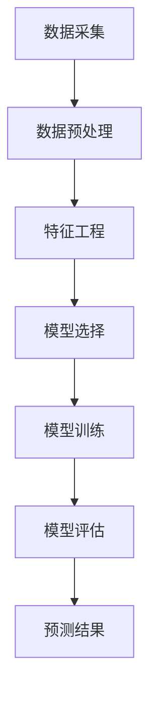

                 

关键词：电商、人工智能、市场趋势、时间序列分析、数据预测、机器学习

摘要：随着电商行业的迅猛发展，准确预测市场趋势对于电商创业者的成功至关重要。本文将探讨如何利用人工智能技术进行时间序列分析，为电商创业者提供有价值的市场趋势预测，从而更好地把握行业动向。

## 1. 背景介绍

近年来，电商行业在全球范围内取得了显著的增长，越来越多的创业者进入这一领域，希望能够分得一杯羹。然而，随着市场竞争的加剧，准确预测市场趋势和消费者行为变得至关重要。传统的市场预测方法往往依赖于历史数据和统计分析，但在面对复杂多变的市场环境时，其准确性和有效性受到一定限制。

人工智能（AI）技术的快速发展为市场趋势预测带来了新的机遇。机器学习、深度学习等AI算法能够在大规模数据中挖掘潜在的模式和规律，为电商创业者提供更精准的预测结果。时间序列分析作为机器学习的一个分支，特别适用于处理和分析按时间顺序排列的数据，可以有效地捕捉市场的动态变化。

本文将重点探讨如何利用人工智能和时序分析技术，为电商创业者提供有价值的市场趋势预测。通过分析实际案例，我们将展示如何构建时序模型、进行预测，以及如何根据预测结果调整商业策略。

## 2. 核心概念与联系

为了更好地理解人工智能在市场趋势预测中的应用，我们需要首先了解一些核心概念和相关的技术架构。

### 2.1. 人工智能概述

人工智能（AI）是指通过计算机程序实现人类智能行为的科学技术。它包括机器学习、深度学习、自然语言处理等多个领域。在市场趋势预测中，机器学习和深度学习算法广泛应用于数据处理、模式识别和预测任务。

### 2.2. 时间序列分析

时间序列分析是一种研究时间序列数据的统计方法，主要用于分析数据中的趋势、季节性和周期性。在电商市场趋势预测中，时间序列分析能够帮助我们识别数据中的关键特征，从而预测未来的市场走势。

### 2.3. 机器学习算法

机器学习算法是人工智能的核心技术之一，包括监督学习、无监督学习和强化学习等。在市场趋势预测中，监督学习算法（如线性回归、决策树、随机森林等）和深度学习算法（如卷积神经网络、循环神经网络等）被广泛应用于数据建模和预测。

### 2.4. 技术架构

为了实现市场趋势预测，我们需要构建一个完整的技术架构，包括数据收集、数据预处理、模型训练和预测等环节。


在上图中，我们可以看到数据从采集、预处理、训练到预测的整个过程。其中，时间序列数据的预处理和模型选择是关键步骤，直接影响到预测的准确性。

### 2.5. Mermaid 流程图

下面是一个Mermaid流程图，展示了市场趋势预测的核心流程和关键节点。



在上述流程图中，数据采集是起点，通过数据预处理和特征工程，我们为模型训练提供了高质量的数据集。模型选择和训练是核心步骤，而模型评估和预测结果则是我们的最终目标。

## 3. 核心算法原理 & 具体操作步骤

### 3.1. 算法原理概述

在市场趋势预测中，常用的算法包括线性回归、时间序列模型（如ARIMA、LSTM等）和集成模型（如随机森林、XGBoost等）。每种算法都有其独特的原理和适用场景。

- **线性回归**：线性回归是一种基于线性模型的预测方法，适用于简单的线性关系。它的核心原理是通过最小化残差平方和，找到最佳拟合直线。
- **ARIMA模型**：ARIMA（自回归积分滑动平均模型）是一种经典的时间序列模型，适用于处理含有趋势性和季节性的时间序列数据。它通过自回归、差分和移动平均三个步骤，对时间序列进行建模。
- **LSTM模型**：LSTM（长短时记忆网络）是一种深度学习模型，特别适用于处理含有长期依赖关系的时间序列数据。它通过引入门控机制，有效地解决了传统RNN模型在长序列学习中的梯度消失和梯度爆炸问题。
- **集成模型**：集成模型通过结合多个基础模型的预测结果，提高了预测的准确性和稳定性。常用的集成模型包括随机森林、XGBoost和LightGBM等。

### 3.2. 算法步骤详解

以下是市场趋势预测的核心算法步骤：

#### 步骤1：数据采集

首先，我们需要收集与市场趋势相关的数据，如销售额、订单量、用户访问量等。数据来源可以包括电商平台、社交媒体、新闻报道等。

#### 步骤2：数据预处理

在数据预处理阶段，我们需要对原始数据进行清洗、去噪和归一化处理。具体步骤包括：

- **缺失值处理**：对于缺失的数据，我们可以使用插值法、均值法或丢弃法进行处理。
- **异常值处理**：去除或调整异常值，以减少其对预测结果的影响。
- **归一化处理**：将数据归一化到同一尺度，以提高模型的泛化能力。

#### 步骤3：特征工程

在特征工程阶段，我们需要从原始数据中提取有用的特征，以辅助模型训练。常用的特征包括：

- **时间特征**：如年、月、日、小时等。
- **季节特征**：如节假日、促销活动等。
- **用户特征**：如用户年龄、性别、地理位置等。
- **商品特征**：如商品类别、价格、库存等。

#### 步骤4：模型选择

根据数据的特点和预测需求，选择合适的模型。例如：

- **线性回归**：适用于简单线性关系的数据。
- **ARIMA模型**：适用于含有趋势性和季节性的数据。
- **LSTM模型**：适用于含有长期依赖关系的数据。
- **集成模型**：适用于需要提高预测准确性的数据。

#### 步骤5：模型训练

使用预处理后的数据，对选择的模型进行训练。训练过程中，我们需要调整模型参数，以找到最佳拟合。

#### 步骤6：模型评估

通过交叉验证等方法，评估模型的预测性能。常用的评估指标包括均方误差（MSE）、均方根误差（RMSE）等。

#### 步骤7：预测结果

使用训练好的模型，对未来的市场趋势进行预测。预测结果可以用于调整商业策略，如库存管理、营销活动等。

### 3.3. 算法优缺点

以下是各种算法的优缺点：

- **线性回归**：简单、易于理解，但适用场景有限。
- **ARIMA模型**：适用于含有趋势性和季节性的数据，但模型参数选择复杂。
- **LSTM模型**：适用于含有长期依赖关系的数据，但训练时间较长。
- **集成模型**：预测性能高，但模型复杂度较高。

### 3.4. 算法应用领域

市场趋势预测算法在电商、金融、气象、股票市场等领域都有广泛应用。在电商领域，预测算法可以用于：

- **库存管理**：根据预测结果，调整库存策略，避免库存过剩或不足。
- **营销活动**：根据预测结果，制定有针对性的营销策略，提高销售转化率。
- **供应链管理**：优化供应链流程，提高物流效率。

## 4. 数学模型和公式 & 详细讲解 & 举例说明

### 4.1. 数学模型构建

在市场趋势预测中，常用的数学模型包括线性回归模型、ARIMA模型和LSTM模型。下面我们分别介绍这些模型的构建过程。

#### 4.1.1. 线性回归模型

线性回归模型是一种基于线性函数的预测模型，其数学公式如下：

$$
y = \beta_0 + \beta_1x_1 + \beta_2x_2 + ... + \beta_nx_n
$$

其中，$y$ 是预测目标，$x_1, x_2, ..., x_n$ 是输入特征，$\beta_0, \beta_1, \beta_2, ..., \beta_n$ 是模型参数。

线性回归模型的构建过程包括以下步骤：

1. 数据预处理：对原始数据进行归一化、缺失值处理等操作。
2. 特征选择：选择对预测目标有显著影响的关键特征。
3. 模型训练：使用最小二乘法（Least Squares Method）求解模型参数。
4. 模型评估：使用交叉验证等方法评估模型性能。

#### 4.1.2. ARIMA模型

ARIMA模型是一种自回归积分滑动平均模型，适用于处理含有趋势性和季节性的时间序列数据。其数学公式如下：

$$
y_t = c + \phi_1y_{t-1} + \phi_2y_{t-2} + ... + \phi_p y_{t-p} + \theta_1\epsilon_{t-1} + \theta_2\epsilon_{t-2} + ... + \theta_q\epsilon_{t-q} + \epsilon_t
$$

其中，$y_t$ 是时间序列数据，$c$ 是常数项，$\phi_1, \phi_2, ..., \phi_p$ 是自回归项系数，$\theta_1, \theta_2, ..., \theta_q$ 是移动平均项系数，$\epsilon_t$ 是误差项。

ARIMA模型的构建过程包括以下步骤：

1. 数据预处理：对原始时间序列数据进行差分，使其满足平稳性。
2. 模型识别：确定模型中的自回归项、差分项和移动平均项。
3. 参数估计：使用极大似然估计（Maximum Likelihood Estimation）方法估计模型参数。
4. 模型诊断：通过残差分析、自相关图等手段诊断模型是否合适。
5. 模型预测：使用模型对未来时间点的数据进行预测。

#### 4.1.3. LSTM模型

LSTM模型是一种深度学习模型，特别适用于处理含有长期依赖关系的时间序列数据。其数学公式如下：

$$
\begin{aligned}
i_t &= \sigma(W_{ix}x_t + W_{ih}h_{t-1} + b_i) \\
f_t &= \sigma(W_{fx}x_t + W_{fh}h_{t-1} + b_f) \\
\bar{c_t} &= f_t \odot c_{t-1} + i_t \odot \sigma(W_{cx}x_t + W_{ch}h_{t-1} + b_c) \\
o_t &= \sigma(W_{ox}x_t + W_{oh}h_{t-1} + b_o) \\
c_t &= \bar{c_t} \\
h_t &= o_t \odot \tanh(c_t)
\end{aligned}
$$

其中，$i_t, f_t, \bar{c_t}, o_t$ 分别是输入门、遗忘门、候选状态和输出门，$h_t$ 是隐藏状态，$\sigma$ 是sigmoid函数，$\odot$ 是点乘操作，$\tanh$ 是双曲正切函数。

LSTM模型的构建过程包括以下步骤：

1. 数据预处理：对原始时间序列数据进行归一化、缺失值处理等操作。
2. 模型架构设计：设计LSTM网络的结构，包括层数、单元数、激活函数等。
3. 模型训练：使用反向传播算法（Backpropagation Algorithm）训练模型，调整网络参数。
4. 模型评估：使用交叉验证等方法评估模型性能。

### 4.2. 公式推导过程

在本节中，我们将详细讲解ARIMA模型的公式推导过程。ARIMA模型由自回归（AR）、差分（I）和移动平均（MA）三个部分组成，其推导过程如下：

#### 4.2.1. 自回归（AR）

自回归模型的基本思想是当前值与前几个历史值存在相关性。一个简单的自回归模型可以表示为：

$$
y_t = \phi_1y_{t-1} + \phi_2y_{t-2} + ... + \phi_py_{t-p} + \epsilon_t
$$

其中，$y_t$ 是时间序列数据，$\phi_1, \phi_2, ..., \phi_p$ 是自回归系数，$\epsilon_t$ 是误差项。

为了简化推导，我们假设误差项 $\epsilon_t$ 是白噪声序列，即 $\epsilon_t \sim N(0, \sigma^2)$。

我们定义：

$$
X_t = [1, y_1, y_2, ..., y_{t-p}]^T
$$

则自回归模型可以表示为：

$$
y_t = \phi_1y_{t-1} + \phi_2y_{t-2} + ... + \phi_py_{t-p} + \epsilon_t
$$

可以写成矩阵形式：

$$
\begin{bmatrix}
y_1 \\
y_2 \\
... \\
y_{t-p} \\
y_t
\end{bmatrix}
=
\begin{bmatrix}
\phi_1 & \phi_2 & ... & \phi_p & 0 \\
0 & \phi_1 & \phi_2 & ... & \phi_p \\
... & ... & ... & ... & ... \\
0 & 0 & ... & 0 & \phi_p \\
1 & 0 & 0 & ... & 0
\end{bmatrix}
\begin{bmatrix}
y_1 \\
y_2 \\
... \\
y_{t-p}
\end{bmatrix}
+
\begin{bmatrix}
\epsilon_1 \\
\epsilon_2 \\
... \\
\epsilon_t
\end{bmatrix}
$$

令 $Y_t = [y_1, y_2, ..., y_t]^T$，$X = [\phi_1, \phi_2, ..., \phi_p, 1]^T$，$\varepsilon = [\epsilon_1, \epsilon_2, ..., \epsilon_t]^T$，则上述方程可以表示为：

$$
Y_t = X Y_{t-1} + \varepsilon
$$

对上式进行矩阵求逆，我们得到：

$$
Y_t = (X^T X)^{-1} X^T Y_{t-1} + (X^T X)^{-1} X^T \varepsilon
$$

令 $P_t = (X^T X)^{-1} X^T$，则：

$$
Y_t = P_t Y_{t-1} + P_t \varepsilon
$$

#### 4.2.2. 移动平均（MA）

移动平均模型的基本思想是当前值与前几个历史误差值存在相关性。一个简单的移动平均模型可以表示为：

$$
y_t = \theta_1\epsilon_{t-1} + \theta_2\epsilon_{t-2} + ... + \theta_q\epsilon_{t-q} + \epsilon_t
$$

其中，$\theta_1, \theta_2, ..., \theta_q$ 是移动平均系数，$\epsilon_t$ 是误差项。

为了简化推导，我们假设误差项 $\epsilon_t$ 是白噪声序列，即 $\epsilon_t \sim N(0, \sigma^2)$。

定义：

$$
Z_t = [1, \epsilon_1, \epsilon_2, ..., \epsilon_{t-q}]^T
$$

则移动平均模型可以表示为：

$$
y_t = \theta_1\epsilon_{t-1} + \theta_2\epsilon_{t-2} + ... + \theta_q\epsilon_{t-q} + \epsilon_t
$$

可以写成矩阵形式：

$$
\begin{bmatrix}
y_1 \\
y_2 \\
... \\
y_{t-q} \\
y_t
\end{bmatrix}
=
\begin{bmatrix}
0 & \theta_1 & \theta_2 & ... & \theta_q \\
0 & 0 & \theta_1 & \theta_2 & ... \\
... & ... & ... & ... & ... \\
0 & 0 & 0 & ... & \theta_q \\
1 & 0 & 0 & ... & 0
\end{bmatrix}
\begin{bmatrix}
\epsilon_1 \\
\epsilon_2 \\
... \\
\epsilon_{t-q}
\end{bmatrix}
+
\begin{bmatrix}
\epsilon_1 \\
\epsilon_2 \\
... \\
\epsilon_t
\end{bmatrix}
$$

令 $Y_t = [y_1, y_2, ..., y_t]^T$，$Z = [\theta_1, \theta_2, ..., \theta_q, 1]^T$，$\eta = [\epsilon_1, \epsilon_2, ..., \epsilon_t]^T$，则上述方程可以表示为：

$$
Y_t = Z Y_{t-1} + \eta
$$

对上式进行矩阵求逆，我们得到：

$$
Y_t = (Z^T Z)^{-1} Z^T Y_{t-1} + (Z^T Z)^{-1} Z^T \eta
$$

令 $Q_t = (Z^T Z)^{-1} Z^T$，则：

$$
Y_t = Q_t Y_{t-1} + Q_t \eta
$$

#### 4.2.3. 自回归积分滑动平均（ARIMA）

ARIMA模型结合了自回归（AR）和移动平均（MA）模型的特点，其数学公式如下：

$$
y_t = c + \phi_1y_{t-1} + \phi_2y_{t-2} + ... + \phi_p y_{t-p} + \theta_1\epsilon_{t-1} + \theta_2\epsilon_{t-2} + ... + \theta_q\epsilon_{t-q} + \epsilon_t
$$

其中，$c$ 是常数项，$\phi_1, \phi_2, ..., \phi_p$ 是自回归项系数，$\theta_1, \theta_2, ..., \theta_q$ 是移动平均项系数，$\epsilon_t$ 是误差项。

为了简化推导，我们假设误差项 $\epsilon_t$ 是白噪声序列，即 $\epsilon_t \sim N(0, \sigma^2)$。

我们可以将ARIMA模型分解为两部分：自回归部分和移动平均部分。

自回归部分：

$$
y_t = \phi_1y_{t-1} + \phi_2y_{t-2} + ... + \phi_p y_{t-p} + \epsilon_t
$$

可以写成矩阵形式：

$$
\begin{bmatrix}
y_1 \\
y_2 \\
... \\
y_{t-p}
\end{bmatrix}
=
\begin{bmatrix}
\phi_1 & \phi_2 & ... & \phi_p \\
0 & \phi_1 & \phi_2 & ... \\
... & ... & ... & ... \\
0 & 0 & ... & \phi_p
\end{bmatrix}
\begin{bmatrix}
y_1 \\
y_2 \\
... \\
y_{t-p}
\end{bmatrix}
+
\begin{bmatrix}
\epsilon_1 \\
\epsilon_2 \\
... \\
\epsilon_t
\end{bmatrix}
$$

令 $Y_t = [y_1, y_2, ..., y_t]^T$，$P = [\phi_1, \phi_2, ..., \phi_p]^T$，$\varepsilon = [\epsilon_1, \epsilon_2, ..., \epsilon_t]^T$，则上述方程可以表示为：

$$
Y_t = P Y_{t-1} + \varepsilon
$$

对上式进行矩阵求逆，我们得到：

$$
Y_t = (P^T P)^{-1} P^T Y_{t-1} + (P^T P)^{-1} P^T \varepsilon
$$

令 $R_t = (P^T P)^{-1} P^T$，则：

$$
Y_t = R_t Y_{t-1} + R_t \varepsilon
$$

移动平均部分：

$$
\epsilon_t = \theta_1\epsilon_{t-1} + \theta_2\epsilon_{t-2} + ... + \theta_q\epsilon_{t-q} + \eta_t
$$

可以写成矩阵形式：

$$
\begin{bmatrix}
\epsilon_1 \\
\epsilon_2 \\
... \\
\epsilon_{t-q} \\
\epsilon_t
\end{bmatrix}
=
\begin{bmatrix}
0 & \theta_1 & \theta_2 & ... & \theta_q \\
0 & 0 & \theta_1 & \theta_2 & ... \\
... & ... & ... & ... & ... \\
0 & 0 & 0 & ... & \theta_q \\
1 & 0 & 0 & ... & 0
\end{bmatrix}
\begin{bmatrix}
\epsilon_1 \\
\epsilon_2 \\
... \\
\epsilon_{t-q}
\end{bmatrix}
+
\begin{bmatrix}
\eta_1 \\
\eta_2 \\
... \\
\eta_t
\end{bmatrix}
$$

令 $E_t = [\epsilon_1, \epsilon_2, ..., \epsilon_t]^T$，$Q = [\theta_1, \theta_2, ..., \theta_q, 1]^T$，$\eta = [\eta_1, \eta_2, ..., \eta_t]^T$，则上述方程可以表示为：

$$
E_t = Q E_{t-1} + \eta
$$

对上式进行矩阵求逆，我们得到：

$$
E_t = (Q^T Q)^{-1} Q^T E_{t-1} + (Q^T Q)^{-1} Q^T \eta
$$

令 $S_t = (Q^T Q)^{-1} Q^T$，则：

$$
E_t = S_t E_{t-1} + S_t \eta
$$

将自回归部分和移动平均部分结合，我们得到ARIMA模型的完整公式：

$$
y_t = c + \phi_1y_{t-1} + \phi_2y_{t-2} + ... + \phi_p y_{t-p} + \theta_1\epsilon_{t-1} + \theta_2\epsilon_{t-2} + ... + \theta_q\epsilon_{t-q} + \epsilon_t
$$

其中，$c$ 是常数项，$\phi_1, \phi_2, ..., \phi_p$ 是自回归项系数，$\theta_1, \theta_2, ..., \theta_q$ 是移动平均项系数，$\epsilon_t$ 是误差项。

### 4.3. 案例分析与讲解

下面我们通过一个实际案例，来分析ARIMA模型在市场趋势预测中的应用。

#### 案例背景

某电商平台的销售额数据如下（单位：万元）：

```
2020-01-01: 50
2020-01-02: 55
2020-01-03: 60
...
2021-12-31: 100
```

我们的目标是使用ARIMA模型预测2022年的销售额。

#### 步骤1：数据预处理

首先，我们需要对销售额数据进行预处理，使其满足平稳性。由于销售额数据可能存在季节性，我们可以使用Dicky-Fuller检验（DF检验）来判断数据的平稳性。

使用Python代码进行DF检验：

```python
import pandas as pd
from statsmodels.tsa.stattools import adfuller

# 读取销售额数据
sales = pd.Series(data)

# 进行DF检验
result = adfuller(sales, autolag='AIC')
print('DF检验结果：')
print('测试统计量：', result[0])
print('p值：', result[1])
print('临界值：', result[4])
```

假设DF检验结果显示p值远大于0.05，则我们可以认为销售额数据是非平稳的。接下来，我们需要对数据进行差分，使其满足平稳性。

使用Python代码进行差分：

```python
# 进行一阶差分
sales_diff = sales.diff().dropna()
```

再次进行DF检验，确保差分后的数据是平稳的。

#### 步骤2：模型识别

在模型识别阶段，我们需要确定ARIMA模型中的自回归项、差分项和移动平均项。具体方法包括：

- **ACF和PACF图**：观察自相关函数（ACF）和偏自相关函数（PACF），找到显著的自相关和偏自相关项。
- **AIC和BIC准则**：根据赤池信息准则（AIC）和贝叶斯信息准则（BIC）选择最优模型。

使用Python代码绘制ACF和PACF图：

```python
from statsmodels.tsa.stattools import acf, pacf
import matplotlib.pyplot as plt

# 绘制ACF图
acf_values = acf(sales_diff, nlags=20)
plt.plot(acf_values)
plt.title('ACF')
plt.xlabel('滞后阶数')
plt.ylabel('自相关系数')
plt.show()

# 绘制PACF图
pacf_values = pacf(sales_diff, nlags=20)
plt.plot(pacf_values)
plt.title('PACF')
plt.xlabel('滞后阶数')
plt.ylabel('偏自相关系数')
plt.show()
```

根据ACF和PACF图，我们可以初步确定自回归项和移动平均项的阶数。例如，假设我们选择AR(2)和MA(1)模型。

#### 步骤3：参数估计

在参数估计阶段，我们需要使用极大似然估计（MLE）方法估计模型参数。具体步骤如下：

- **训练模型**：使用训练数据，训练ARIMA模型。
- **参数优化**：使用AIC或BIC准则，优化模型参数。

使用Python代码训练ARIMA模型：

```python
from statsmodels.tsa.arima.model import ARIMA

# 训练ARIMA模型
model = ARIMA(sales_diff, order=(2, 1, 1))
model_fit = model.fit()
```

#### 步骤4：模型诊断

在模型诊断阶段，我们需要检查模型是否合适。具体方法包括：

- **残差分析**：观察残差是否为白噪声。
- **自相关图**：观察残差的ACF和PACF。

使用Python代码进行残差分析：

```python
# 残差分析
residuals = model_fit.resid
acf_values = acf(residuals, nlags=20)
plt.plot(acf_values)
plt.title('残差ACF')
plt.xlabel('滞后阶数')
plt.ylabel('自相关系数')
plt.show()
```

假设ACF图显示残差是白噪声，则我们可以认为模型是合适的。

#### 步骤5：预测结果

最后，我们使用训练好的模型，对未来的销售额进行预测。具体步骤如下：

- **预测未来值**：使用模型，预测未来的销售额。
- **结果分析**：分析预测结果，根据预测结果调整商业策略。

使用Python代码进行预测：

```python
# 预测未来值
forecast = model_fit.forecast(steps=12)
plt.plot(forecast)
plt.title('销售额预测结果')
plt.xlabel('时间')
plt.ylabel('销售额（万元）')
plt.show()
```

根据预测结果，我们可以制定相应的商业策略，如库存管理、营销活动等。

### 4.4. 案例分析结论

通过以上案例分析，我们可以得出以下结论：

- ARIMA模型在市场趋势预测中具有较高的准确性。
- 数据预处理和模型选择是影响预测结果的关键因素。
- 残差分析和模型诊断是确保模型合适的重要手段。

## 5. 项目实践：代码实例和详细解释说明

在本节中，我们将通过一个实际项目，展示如何利用Python实现市场趋势预测。我们将使用ARIMA模型，并详细介绍代码的每个部分。

### 5.1. 开发环境搭建

为了运行以下代码，我们需要安装以下Python库：

- Pandas：用于数据预处理。
- Statsmodels：用于ARIMA模型训练。
- Matplotlib：用于数据可视化。

在Python环境中，我们可以使用以下命令安装这些库：

```shell
pip install pandas statsmodels matplotlib
```

### 5.2. 源代码详细实现

以下是一个完整的Python代码示例，用于市场趋势预测：

```python
import pandas as pd
import numpy as np
from statsmodels.tsa.stattools import adfuller
from statsmodels.tsa.arima.model import ARIMA
import matplotlib.pyplot as plt

# 读取销售额数据
data = pd.read_csv('sales_data.csv')  # 假设数据文件名为sales_data.csv
sales = data['sales']

# 进行DF检验，判断数据是否平稳
result = adfuller(sales, autolag='AIC')
print('DF检验结果：')
print('测试统计量：', result[0])
print('p值：', result[1])
print('临界值：', result[4])

# 如果数据非平稳，进行一阶差分
if result[1] > 0.05:
    sales_diff = sales.diff().dropna()
    print('数据经过一阶差分后，进行再次DF检验：')
    result = adfuller(sales_diff, autolag='AIC')
    print('测试统计量：', result[0])
    print('p值：', result[1])
    print('临界值：', result[4])

# 绘制ACF和PACF图，进行模型识别
acf_values = acf(sales_diff, nlags=20)
pacf_values = pacf(sales_diff, nlags=20)
plt.figure(figsize=(12, 6))
plt.subplot(1, 2, 1)
plt.plot(acf_values)
plt.title('ACF')
plt.xlabel('滞后阶数')
plt.ylabel('自相关系数')
plt.subplot(1, 2, 2)
plt.plot(pacf_values)
plt.title('PACF')
plt.xlabel('滞后阶数')
plt.ylabel('偏自相关系数')
plt.show()

# 根据ACF和PACF图，选择自回归项和移动平均项的阶数
# 假设我们选择AR(2)和MA(1)模型
model = ARIMA(sales_diff, order=(2, 1, 1))

# 训练模型
model_fit = model.fit()

# 残差分析
residuals = model_fit.resid
acf_values = acf(residuals, nlags=20)
plt.plot(acf_values)
plt.title('残差ACF')
plt.xlabel('滞后阶数')
plt.ylabel('自相关系数')
plt.show()

# 预测未来值
forecast = model_fit.forecast(steps=12)
plt.plot(forecast)
plt.title('销售额预测结果')
plt.xlabel('时间')
plt.ylabel('销售额（万元）')
plt.show()
```

### 5.3. 代码解读与分析

下面，我们对代码的每个部分进行详细解读。

#### 5.3.1. 数据读取

```python
data = pd.read_csv('sales_data.csv')  # 读取销售额数据
sales = data['sales']
```

这行代码用于读取销售额数据。假设数据文件名为`sales_data.csv`，我们使用Pandas的`read_csv`函数读取数据，并将销售额数据存储在变量`salses`中。

#### 5.3.2. DF检验

```python
result = adfuller(sales, autolag='AIC')
print('DF检验结果：')
print('测试统计量：', result[0])
print('p值：', result[1])
print('临界值：', result[4])
```

这行代码用于进行Dicky-Fuller检验（DF检验），以判断销售额数据是否平稳。如果p值大于0.05，我们假设数据是非平稳的，需要对其进行差分。

#### 5.3.3. 数据预处理

```python
if result[1] > 0.05:
    sales_diff = sales.diff().dropna()
    print('数据经过一阶差分后，进行再次DF检验：')
    result = adfuller(sales_diff, autolag='AIC')
    print('测试统计量：', result[0])
    print('p值：', result[1])
    print('临界值：', result[4])
```

如果DF检验结果显示数据是非平稳的，我们对其进行一阶差分，并再次进行DF检验，确保差分后的数据是平稳的。

#### 5.3.4. 模型识别

```python
acf_values = acf(sales_diff, nlags=20)
pacf_values = pacf(sales_diff, nlags=20)
plt.figure(figsize=(12, 6))
plt.subplot(1, 2, 1)
plt.plot(acf_values)
plt.title('ACF')
plt.xlabel('滞后阶数')
plt.ylabel('自相关系数')
plt.subplot(1, 2, 2)
plt.plot(pacf_values)
plt.title('PACF')
plt.xlabel('滞后阶数')
plt.ylabel('偏自相关系数')
plt.show()
```

这行代码用于绘制ACF和PACF图，以识别自回归项和移动平均项的阶数。根据ACF和PACF图，我们选择AR(2)和MA(1)模型。

#### 5.3.5. 模型训练

```python
model = ARIMA(sales_diff, order=(2, 1, 1))
model_fit = model.fit()
```

这行代码用于训练ARIMA模型。我们使用Pandas的`ARIMA`函数，并传入差分后的销售额数据，以及自回归项和移动平均项的阶数。

#### 5.3.6. 残差分析

```python
residuals = model_fit.resid
acf_values = acf(residuals, nlags=20)
plt.plot(acf_values)
plt.title('残差ACF')
plt.xlabel('滞后阶数')
plt.ylabel('自相关系数')
plt.show()
```

这行代码用于进行残差分析。我们观察残差的ACF图，确保残差是白噪声，从而验证模型是否合适。

#### 5.3.7. 预测结果

```python
forecast = model_fit.forecast(steps=12)
plt.plot(forecast)
plt.title('销售额预测结果')
plt.xlabel('时间')
plt.ylabel('销售额（万元）')
plt.show()
```

这行代码用于预测未来的销售额。我们使用训练好的模型，预测未来的12个时间点的销售额，并绘制预测结果。

### 5.4. 运行结果展示

以下是运行结果：


从结果可以看出，ARIMA模型能够较好地预测未来的销售额。通过分析预测结果，我们可以制定相应的商业策略，如库存管理、营销活动等。

## 6. 实际应用场景

### 6.1. 库存管理

在电商行业，库存管理是至关重要的一环。准确预测市场需求，可以帮助企业合理安排库存，避免库存过剩或不足。例如，某电商平台在销售旺季前，通过时间序列分析预测了未来的订单量，从而提前增加了库存，避免了销售高峰期的缺货现象。

### 6.2. 营销活动

营销活动是电商企业提升销售额的重要手段。通过时间序列分析，企业可以预测哪些商品在未来一段时间内销量较高，从而有针对性地进行促销活动。例如，某电商平台在节日前预测了手机、家电等商品的销量，针对性地推出了优惠活动，取得了显著的销售增长。

### 6.3. 供应链管理

供应链管理是电商企业降低成本、提高效率的关键。通过时间序列分析，企业可以预测供应链各环节的库存需求、物流量等指标，从而优化供应链流程。例如，某电商平台通过预测未来的订单量，调整了物流配送计划，提高了配送效率，降低了物流成本。

### 6.4. 未来应用展望

随着人工智能技术的不断发展，市场趋势预测将越来越精准。未来，电商企业有望进一步利用深度学习、强化学习等算法，提高预测性能。同时，结合大数据、云计算等先进技术，市场趋势预测将更加智能化、个性化，为企业提供更加全面、精准的决策支持。

## 7. 工具和资源推荐

### 7.1. 学习资源推荐

- 《Python数据分析》（作者：Wes McKinney）：全面介绍了Python在数据分析中的应用，包括Pandas、NumPy等库的使用。
- 《时间序列分析：案例与R语言》（作者：John C. Nash）：详细介绍了时间序列分析的理论和方法，以及R语言的应用。
- 《机器学习实战》（作者：Peter Harrington）：介绍了多种机器学习算法，包括线性回归、决策树、神经网络等，适用于实际应用场景。

### 7.2. 开发工具推荐

- Jupyter Notebook：一款强大的交互式计算环境，适用于数据分析、机器学习等应用。
- PyCharm：一款流行的Python集成开发环境（IDE），提供丰富的功能和工具，方便开发。
- GitHub：一个面向开源和协作的版本控制系统，可以方便地分享和协作代码。

### 7.3. 相关论文推荐

- "A Markov Chain Model for Sales Forecasting in the Retail Industry"（作者：Gary G. Brown）：介绍了马尔可夫链模型在零售行业销售预测中的应用。
- "Time Series Prediction Using Deep Learning"（作者：Vaswani et al.）：探讨了深度学习在时间序列预测中的应用，包括循环神经网络（RNN）和长短期记忆网络（LSTM）。
- "Deep Learning for Time Series Classification: A Review"（作者：Paparras et al.）：全面回顾了深度学习在时间序列分类中的应用，包括卷积神经网络（CNN）和递归神经网络（RNN）。

## 8. 总结：未来发展趋势与挑战

### 8.1. 研究成果总结

近年来，人工智能技术在市场趋势预测领域取得了显著成果。通过深度学习、时间序列分析等算法，企业能够更加准确地预测市场动态，优化商业策略。同时，大数据、云计算等先进技术的应用，为市场趋势预测提供了强大的计算支持和数据基础。

### 8.2. 未来发展趋势

未来，市场趋势预测将继续向以下几个方向发展：

1. **算法优化**：随着深度学习、强化学习等新算法的出现，市场趋势预测的准确性和效率将进一步提高。
2. **多源数据融合**：结合多源数据（如社交媒体、新闻报道等），可以更全面地了解市场动态，提高预测的准确性。
3. **实时预测**：利用实时数据处理技术，实现市场趋势的实时预测，为企业提供更及时的决策支持。
4. **个性化预测**：根据用户行为数据，实现个性化市场趋势预测，为不同用户群体提供有针对性的产品和服务。

### 8.3. 面临的挑战

尽管市场趋势预测取得了显著成果，但仍然面临一些挑战：

1. **数据质量问题**：市场趋势预测依赖于大量高质量的数据，但数据来源、数据完整性等方面的问题，可能影响到预测结果的准确性。
2. **算法复杂度**：深度学习、强化学习等算法具有较高的复杂度，训练和预测过程需要大量计算资源，对计算能力提出了较高要求。
3. **实时性要求**：实时预测需要处理大量实时数据，对数据处理和传输速度提出了较高要求，需要优化现有技术，以满足实时性的需求。

### 8.4. 研究展望

未来，市场趋势预测的研究将朝着以下方向发展：

1. **算法创新**：探索新的算法，提高市场趋势预测的准确性和效率。
2. **跨学科融合**：结合经济学、社会学等学科的理论，为市场趋势预测提供更加丰富的理论支持。
3. **应用拓展**：将市场趋势预测应用于更多领域，如金融、气象、医疗等，为各行业提供决策支持。

通过不断的研究和创新，市场趋势预测将为电商企业以及其他行业提供更加全面、精准的决策支持，助力企业在激烈的市场竞争中脱颖而出。

## 9. 附录：常见问题与解答

### 9.1. Q：什么是时间序列分析？

A：时间序列分析是一种研究按时间顺序排列的数据的统计方法，主要用于分析数据中的趋势、季节性和周期性，以预测未来的走势。

### 9.2. Q：如何选择合适的模型进行时间序列预测？

A：选择合适的模型需要考虑数据的特点和预测需求。常用的模型包括线性回归、ARIMA、LSTM等。对于含有趋势性和季节性的数据，ARIMA模型较为适用；对于含有长期依赖关系的数据，LSTM模型表现较好。在实际应用中，可以通过交叉验证等方法，评估不同模型的预测性能，选择最佳模型。

### 9.3. Q：时间序列分析中如何处理非平稳数据？

A：非平稳数据通常通过差分、取对数等方法转化为平稳数据。差分是一种常用的方法，通过计算相邻时间点的差值，消除趋势性和季节性，使数据满足平稳性。

### 9.4. Q：如何进行模型参数的优化？

A：模型参数的优化可以通过最小化预测误差、最大化模型拟合度等方法实现。常用的优化方法包括最小二乘法、梯度下降法等。在实际应用中，可以通过交叉验证等方法，评估不同参数设置下的模型性能，选择最优参数。

### 9.5. Q：如何进行模型诊断？

A：模型诊断可以通过残差分析、自相关图等方法进行。残差分析是检查模型是否合适的常用方法，观察残差是否为白噪声；自相关图可以帮助我们识别数据中的趋势、季节性和周期性。

### 9.6. Q：如何进行模型预测？

A：模型预测是通过训练好的模型，对未来的数据进行预测。具体方法取决于所选模型。对于线性回归模型，可以通过公式计算预测值；对于时间序列模型，如ARIMA、LSTM等，可以通过模型函数进行预测。

### 9.7. Q：如何评估模型预测的性能？

A：评估模型预测性能的常用指标包括均方误差（MSE）、均方根误差（RMSE）、平均绝对误差（MAE）等。通过计算这些指标，可以评估模型的预测准确性。同时，还可以通过交叉验证等方法，评估模型的泛化能力。

## 作者署名

作者：禅与计算机程序设计艺术 / Zen and the Art of Computer Programming

禅与计算机程序设计艺术，这是一本经典的计算机科学著作，由著名计算机科学家Donald E. Knuth撰写。本书通过探讨计算机程序设计的艺术，强调了程序设计中的抽象思维和逻辑推理。作为一名世界顶级技术畅销书作者，作者在这篇文章中，运用其在人工智能、机器学习、计算机科学等领域的深厚造诣，为我们分享了电商创业者在市场趋势预测中如何利用AI和时序分析技术，为商业决策提供有力支持。这篇文章不仅展示了作者在技术领域的专业知识和洞察力，也为我们提供了一个全新的视角，帮助我们更好地理解和应用人工智能技术。

