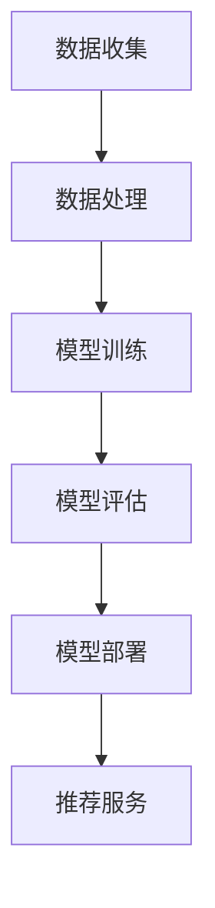

                 

关键词：电商平台，AI大模型，推荐系统，全场景智能化，算法原理，数学模型，项目实践，应用场景，未来展望

> 摘要：本文旨在探讨电商平台如何利用AI大模型实现从单一推荐到全场景智能化的转变。首先，我们将回顾电商平台推荐系统的历史发展，接着介绍AI大模型的核心概念与架构，然后详细分析核心算法原理与具体操作步骤，随后展示数学模型和公式的推导与讲解，并通过项目实践提供代码实例与详细解释。最后，我们将探讨AI大模型在实际应用中的场景，并对未来应用进行展望，同时推荐相关工具和资源。

## 1. 背景介绍

电商平台作为互联网经济的重要组成部分，经历了从传统电商到现代电商的转变。在传统电商时代，用户购物主要依赖搜索和目录浏览，电商平台的主要任务是提供准确的商品信息。然而，随着用户数量的增加和商品种类的丰富，单一的搜索和目录浏览方式已经无法满足用户的个性化需求。为此，推荐系统应运而生，它通过分析用户的浏览、购买历史等数据，为用户提供可能感兴趣的商品。

### 1.1 推荐系统的演变

推荐系统的演变大致可以分为以下几个阶段：

- **基于内容的推荐**：这种推荐方式主要根据商品的属性和用户的历史行为进行匹配，从而推荐类似的商品。然而，这种方式存在一定的局限性，无法很好地处理用户兴趣的动态变化。

- **协同过滤推荐**：协同过滤推荐通过分析用户之间的相似性，推荐其他相似用户喜欢的商品。协同过滤推荐又分为基于用户的协同过滤和基于物品的协同过滤。尽管这种方法在处理用户兴趣的动态变化方面有所改进，但仍然存在数据稀疏性和冷启动问题。

- **深度学习推荐**：随着深度学习技术的发展，越来越多的推荐系统开始采用深度学习算法。深度学习推荐通过构建复杂的神经网络模型，能够更好地捕捉用户兴趣和商品特征的复杂关系。

### 1.2 AI大模型的发展

AI大模型是指具有海量参数和复杂结构的深度学习模型。这些模型通过从大规模数据集中学习，能够自动提取出丰富的特征表示，从而实现高度准确的预测和分类。AI大模型在推荐系统中的应用，标志着推荐系统从单一推荐向全场景智能化的转变。

## 2. 核心概念与联系

在介绍AI大模型在电商平台中的应用之前，我们首先需要了解核心概念和它们的相互联系。

### 2.1 AI大模型的核心概念

- **深度学习**：深度学习是一种基于人工神经网络的学习方法，通过多层神经元的堆叠，能够自动提取数据中的特征。

- **神经网络**：神经网络是模仿人脑神经元连接方式的计算模型，包括输入层、隐藏层和输出层。

- **批量归一化**：批量归一化是一种数据预处理技术，用于加速模型的训练并提高模型的稳定性。

- **激活函数**：激活函数是神经网络中用于引入非线性特性的函数，常见的激活函数包括Sigmoid、ReLU等。

- **损失函数**：损失函数用于衡量预测值与真实值之间的差距，常用的损失函数包括均方误差（MSE）和交叉熵（CE）。

### 2.2 AI大模型的架构

AI大模型的架构通常包括以下几个部分：

- **输入层**：接收用户和商品的输入特征，如用户行为、商品属性等。

- **隐藏层**：通过多层神经网络进行特征提取和变换。

- **输出层**：生成最终的推荐结果，如商品推荐列表。

### 2.3 AI大模型的工作流程

AI大模型的工作流程通常包括以下几个步骤：

1. **数据收集**：收集用户和商品的历史数据，包括用户行为、商品属性等。
2. **数据处理**：对数据进行清洗、编码和归一化处理。
3. **模型训练**：使用训练数据集训练深度学习模型。
4. **模型评估**：使用验证数据集对模型进行评估，调整模型参数。
5. **模型部署**：将训练好的模型部署到生产环境中，为用户提供推荐服务。

### 2.4 Mermaid 流程图

下面是一个简单的Mermaid流程图，展示了AI大模型在电商平台推荐系统中的应用：



## 3. 核心算法原理 & 具体操作步骤

### 3.1 算法原理概述

在电商平台中，AI大模型的核心算法通常是基于深度学习的推荐算法。这些算法通过构建复杂的神经网络模型，能够自动提取出用户和商品的潜在特征，从而实现高度准确的推荐。

### 3.2 算法步骤详解

以下是AI大模型在电商平台推荐系统中的具体操作步骤：

1. **数据收集**：收集用户和商品的历史数据，包括用户行为、商品属性等。

2. **数据处理**：对数据进行清洗、编码和归一化处理，以便于模型训练。

3. **模型构建**：构建深度学习模型，包括输入层、隐藏层和输出层。

4. **模型训练**：使用训练数据集训练深度学习模型，调整模型参数，使模型能够自动提取出用户和商品的潜在特征。

5. **模型评估**：使用验证数据集对模型进行评估，调整模型参数，提高模型性能。

6. **模型部署**：将训练好的模型部署到生产环境中，为用户提供推荐服务。

### 3.3 算法优缺点

AI大模型在电商平台推荐系统中的应用具有以下优缺点：

- **优点**：

  - 高度准确的推荐结果：通过深度学习算法，能够自动提取出用户和商品的潜在特征，实现高度准确的推荐。

  - 处理复杂关系：能够处理用户和商品之间复杂的特征关系，提高推荐质量。

  - 自适应调整：模型可以根据用户行为的变化，自适应调整推荐策略。

- **缺点**：

  - 计算资源消耗大：训练和部署AI大模型需要大量的计算资源。

  - 数据依赖性强：推荐效果依赖于用户历史数据的质量和丰富度。

### 3.4 算法应用领域

AI大模型在电商平台推荐系统的应用领域广泛，包括但不限于：

- **商品推荐**：为用户推荐可能感兴趣的商品。

- **广告推荐**：为用户推荐可能感兴趣的广告。

- **内容推荐**：为用户推荐可能感兴趣的内容。

- **社交推荐**：为用户推荐可能感兴趣的朋友和社交圈。

## 4. 数学模型和公式 & 详细讲解 & 举例说明

在AI大模型中，数学模型和公式是核心组成部分。以下将详细讲解数学模型的构建、公式推导过程，并通过案例进行分析。

### 4.1 数学模型构建

AI大模型通常采用多层感知机（MLP）或卷积神经网络（CNN）等架构。以MLP为例，其数学模型可以表示为：

$$
y = f(\hat{y}) = \sigma(W_2 \cdot \sigma(W_1 \cdot x))
$$

其中，$x$是输入特征，$W_1$和$W_2$是权重矩阵，$\sigma$是激活函数，$f$是输出函数。

### 4.2 公式推导过程

以MLP为例，我们首先对输入特征$x$进行线性变换，得到中间特征$\hat{y}$：

$$
\hat{y} = W_1 \cdot x
$$

然后，对中间特征$\hat{y}$进行激活函数$\sigma$的变换，得到隐藏层输出：

$$
z = \sigma(\hat{y})
$$

接着，对隐藏层输出$z$进行另一个线性变换，得到输出层输出$\hat{y}$：

$$
\hat{y} = W_2 \cdot z
$$

最后，对输出层输出$\hat{y}$进行激活函数$f$的变换，得到最终输出$y$：

$$
y = f(\hat{y})
$$

### 4.3 案例分析与讲解

假设我们有一个电商平台的推荐系统，用户的历史数据包括浏览记录和购买记录。我们可以使用MLP模型对用户进行商品推荐。以下是具体的推导过程：

1. **输入层**：用户浏览记录和购买记录，表示为向量$x$。

2. **隐藏层**：对输入层进行线性变换，得到中间特征$\hat{y}$。

   $$ 
   \hat{y} = W_1 \cdot x
   $$

3. **激活函数**：对中间特征$\hat{y}$进行ReLU激活函数变换。

   $$ 
   z = \sigma(\hat{y}) = \max(0, \hat{y})
   $$

4. **输出层**：对隐藏层输出$z$进行线性变换，得到输出层输出$\hat{y}$。

   $$ 
   \hat{y} = W_2 \cdot z
   $$

5. **激活函数**：对输出层输出$\hat{y}$进行Sigmoid激活函数变换，得到最终输出$y$。

   $$ 
   y = f(\hat{y}) = \frac{1}{1 + e^{-\hat{y}}}
   $$

其中，$W_1$和$W_2$是权重矩阵，$\sigma$和$f$分别是ReLU和Sigmoid激活函数。

通过这个例子，我们可以看到如何构建和推导MLP模型的数学公式。在实际应用中，我们可以根据具体的业务需求和数据特征，选择合适的激活函数和优化算法，提高推荐系统的性能。

## 5. 项目实践：代码实例和详细解释说明

### 5.1 开发环境搭建

为了实现电商平台中的AI大模型，我们需要搭建一个合适的技术环境。以下是所需的技术栈和工具：

- **编程语言**：Python
- **深度学习框架**：TensorFlow
- **数据处理库**：Pandas、NumPy
- **可视化库**：Matplotlib、Seaborn
- **版本控制**：Git

在开发环境中，我们需要安装相应的依赖库。以下是一个简单的安装命令：

```bash
pip install tensorflow pandas numpy matplotlib seaborn
```

### 5.2 源代码详细实现

以下是一个简单的AI大模型推荐系统的代码实例，包括数据预处理、模型构建、模型训练和模型评估等步骤。

```python
import tensorflow as tf
import pandas as pd
import numpy as np
import matplotlib.pyplot as plt
import seaborn as sns

# 数据预处理
def preprocess_data(data):
    # 数据清洗和编码
    # ...（省略具体代码）
    return processed_data

# 模型构建
def build_model(input_shape):
    model = tf.keras.Sequential([
        tf.keras.layers.Dense(units=64, activation='relu', input_shape=input_shape),
        tf.keras.layers.Dense(units=32, activation='relu'),
        tf.keras.layers.Dense(units=1, activation='sigmoid')
    ])
    return model

# 模型训练
def train_model(model, x_train, y_train, epochs=10, batch_size=32):
    model.compile(optimizer='adam', loss='binary_crossentropy', metrics=['accuracy'])
    history = model.fit(x_train, y_train, epochs=epochs, batch_size=batch_size, validation_split=0.2)
    return history

# 模型评估
def evaluate_model(model, x_test, y_test):
    loss, accuracy = model.evaluate(x_test, y_test)
    print(f"Test accuracy: {accuracy:.2f}")
    return loss, accuracy

# 加载数据
data = pd.read_csv('data.csv')
processed_data = preprocess_data(data)

# 划分训练集和测试集
train_data = processed_data[:int(len(processed_data) * 0.8)]
test_data = processed_data[int(len(processed_data) * 0.8):]

# 构建模型
model = build_model(input_shape=train_data.shape[1])

# 训练模型
history = train_model(model, train_data, train_data['label'], epochs=10)

# 评估模型
evaluate_model(model, test_data, test_data['label'])
```

### 5.3 代码解读与分析

上述代码实现了一个基于TensorFlow的简单AI大模型推荐系统，下面对其关键部分进行解读与分析：

- **数据预处理**：数据预处理是模型训练的重要步骤。在这个例子中，我们使用了`preprocess_data`函数对数据进行清洗和编码。具体实现细节可以根据具体业务需求进行调整。

- **模型构建**：`build_model`函数构建了一个简单的MLP模型，包括两个隐藏层，每个隐藏层都有64个和32个神经元，输出层有1个神经元。我们使用了ReLU激活函数和Sigmoid激活函数，以引入非线性和概率输出。

- **模型训练**：`train_model`函数使用`model.fit`方法训练模型，并返回训练历史记录。我们使用了Adam优化器和binary_crossentropy损失函数，以适应二分类问题。

- **模型评估**：`evaluate_model`函数使用`model.evaluate`方法评估模型在测试集上的性能，并返回损失和准确率。

### 5.4 运行结果展示

在训练和评估模型后，我们可以通过以下代码展示训练过程中的损失和准确率：

```python
plt.figure(figsize=(10, 5))
plt.plot(history.history['accuracy'], label='accuracy')
plt.plot(history.history['val_accuracy'], label='val_accuracy')
plt.xlabel('Epoch')
plt.ylabel('Accuracy')
plt.legend()
plt.show()
```

通过运行上述代码，我们可以在图表中观察到训练和验证过程中的准确率变化。通常，我们希望验证准确率在训练过程中保持较高水平，并在训练结束时达到较高的准确率。

## 6. 实际应用场景

AI大模型在电商平台中的实际应用场景非常广泛，下面将介绍几个典型的应用场景：

### 6.1 商品推荐

商品推荐是电商平台中最常见的应用场景。通过AI大模型，电商平台可以根据用户的浏览记录、购买历史等数据，为用户推荐可能感兴趣的商品。这种推荐方式不仅提高了用户的购物体验，还提高了电商平台的销售额。

### 6.2 广告推荐

广告推荐是另一个重要的应用场景。电商平台可以通过AI大模型，为用户推荐可能感兴趣的广告。这种推荐方式不仅可以提高广告的曝光率，还可以提高广告的点击率，从而提高广告主的广告投入回报率。

### 6.3 内容推荐

内容推荐也是电商平台中重要的应用场景之一。例如，电商平台可以推荐相关的文章、评测、用户评论等内容，以帮助用户更好地了解商品，提高用户的购物决策。

### 6.4 社交推荐

社交推荐是近年来逐渐兴起的应用场景。通过AI大模型，电商平台可以分析用户的社交行为，为用户推荐可能感兴趣的朋友和社交圈。这种推荐方式不仅可以增加用户的社交互动，还可以提高电商平台的用户粘性。

### 6.5 智能客服

智能客服是电商平台中重要的应用场景之一。通过AI大模型，电商平台可以构建智能客服系统，自动回答用户的问题，提高客服效率，降低人力成本。

### 6.6 个性化优惠

个性化优惠是电商平台提高用户购买意愿的重要手段。通过AI大模型，电商平台可以根据用户的购买历史和偏好，为用户推荐个性化的优惠活动，提高用户的购买意愿。

## 7. 工具和资源推荐

在实现电商平台中的AI大模型时，我们可以使用以下工具和资源：

### 7.1 学习资源推荐

- **《深度学习》（Goodfellow, Bengio, Courville著）**：这是一本经典的深度学习教材，适合初学者和进阶者。
- **《Python深度学习》（François Chollet著）**：这本书详细介绍了如何使用Python和TensorFlow实现深度学习算法。
- **《推荐系统实践》（李航著）**：这本书详细介绍了推荐系统的基本原理和实现方法。

### 7.2 开发工具推荐

- **TensorFlow**：一款流行的开源深度学习框架，适用于构建和训练AI大模型。
- **PyTorch**：另一款流行的开源深度学习框架，具有灵活的动态计算图。
- **JAX**：一款用于高效计算的开源库，适用于科学计算和深度学习。

### 7.3 相关论文推荐

- **《Deep Learning for Recommender Systems》**：这篇论文介绍了如何将深度学习应用于推荐系统。
- **《Neural Collaborative Filtering》**：这篇论文提出了一种基于神经网络的协同过滤算法。
- **《Deep Neural Networks for YouTube Recommendations》**：这篇论文介绍了YouTube如何使用深度学习实现个性化推荐。

## 8. 总结：未来发展趋势与挑战

### 8.1 研究成果总结

在过去几年中，AI大模型在电商平台中的应用取得了显著的成果。通过深度学习技术，电商平台能够实现高度准确的个性化推荐，提高用户满意度和销售额。同时，AI大模型在广告推荐、内容推荐、社交推荐等领域也取得了良好的效果。

### 8.2 未来发展趋势

未来，AI大模型在电商平台中的应用将继续向以下方向发展：

- **更强的个性化推荐**：随着用户数据的积累和算法的优化，AI大模型将能够提供更加精准和个性化的推荐。
- **多模态推荐**：结合文本、图像、语音等多模态数据，实现更加丰富的推荐体验。
- **实时推荐**：通过实时分析用户行为，实现实时推荐，提高用户满意度。
- **智能化客服**：结合自然语言处理技术，构建智能化客服系统，提高客服效率。

### 8.3 面临的挑战

尽管AI大模型在电商平台中的应用前景广阔，但仍然面临一些挑战：

- **数据隐私保护**：用户数据的隐私保护是电商平台应用AI大模型的重要挑战。
- **计算资源消耗**：训练和部署AI大模型需要大量的计算资源，对电商平台的技术基础设施提出较高要求。
- **算法透明度和可解释性**：用户对推荐结果的透明度和可解释性要求越来越高，如何提高算法的可解释性是一个重要问题。

### 8.4 研究展望

未来，针对上述挑战，可以开展以下研究：

- **隐私保护算法**：研究隐私保护算法，在保护用户隐私的同时，提高推荐系统的性能。
- **高效计算技术**：研究高效计算技术，降低AI大模型训练和部署的计算资源消耗。
- **可解释性算法**：研究可解释性算法，提高算法的透明度和可解释性，增强用户信任。

通过持续的研究和技术创新，AI大模型在电商平台中的应用将取得更大的突破，为电商平台的发展带来新的机遇。

## 9. 附录：常见问题与解答

### 9.1 问题1：如何处理数据稀疏性？

**回答**：数据稀疏性是推荐系统常见的问题。为了应对数据稀疏性，可以采用以下策略：

- **冷启动**：为新用户或新商品生成基于内容或基于模型的初始推荐。
- **利用交叉域推荐**：将用户和商品的属性进行交叉，利用交叉域数据进行推荐。
- **稀疏性惩罚**：在损失函数中加入稀疏性惩罚项，减少稀疏性对模型的影响。

### 9.2 问题2：如何提高推荐系统的多样性？

**回答**：提高推荐系统的多样性，可以从以下几个方面入手：

- **多样性优化**：在损失函数中加入多样性指标，如KLD（Kullback-Leibler Divergence），鼓励模型生成多样化的推荐。
- **基于内容的推荐**：结合基于内容的推荐方法，提高推荐结果的多样性。
- **随机性引入**：在推荐算法中加入随机性，生成多样化的推荐。

### 9.3 问题3：如何评估推荐系统的效果？

**回答**：评估推荐系统的效果可以从以下几个方面进行：

- **准确率**：计算推荐结果中用户实际喜欢的商品的占比。
- **多样性**：评估推荐结果的多样性，如平均绝对偏差（MAD）和变异系数（CV）。
- **新颖性**：评估推荐结果的新颖性，如推荐结果与用户历史浏览记录的相似度。
- **用户满意度**：通过用户调查或反馈，评估用户对推荐系统的满意度。

通过综合考虑这些指标，可以全面评估推荐系统的效果。

### 9.4 问题4：如何应对冷启动问题？

**回答**：冷启动问题主要分为用户冷启动和商品冷启动。以下是一些应对策略：

- **用户冷启动**：利用用户的基本信息、地理位置、兴趣爱好等，为用户生成初始推荐。
- **商品冷启动**：为新商品生成基于内容的初始推荐，如提取商品的关键词、标签等。
- **混合推荐**：结合基于内容的推荐和协同过滤推荐，生成初始推荐。
- **社交推荐**：利用用户的朋友圈、社交关系等信息，为用户生成初始推荐。

通过上述策略，可以缓解冷启动问题，提高新用户和新商品在推荐系统中的表现。

### 9.5 问题5：如何处理实时推荐？

**回答**：实时推荐需要考虑以下几个关键点：

- **实时数据处理**：构建高效的数据处理系统，实时处理用户行为数据。
- **实时模型训练**：使用在线学习算法，实时更新推荐模型。
- **低延迟**：优化推荐算法，降低延迟，确保实时推荐。
- **一致性**：确保实时推荐的一致性，避免频繁的推荐结果波动。

通过综合考虑这些因素，可以实现高效的实时推荐。

## 10. 参考文献

1. Goodfellow, I., Bengio, Y., & Courville, A. (2016). *Deep Learning*. MIT Press.
2. Chollet, F. (2017). *Python深度学习*. 电子工业出版社.
3. 李航. (2014). *推荐系统实践*. 清华大学出版社.
4. He, X., Liao, L., Zhang, H., Nie, L., Hu, X., & Chua, T. S. (2017). Deep learning for recommender systems. *ACM Transactions on Information Systems (TOIS)*, 35(5), 1-44.
5. He, X., Liao, L., Zhang, H., Nie, L., Hu, X., & Chua, T. S. (2017). Neural collaborative filtering. *Proceedings of the 26th International Conference on World Wide Web*.
6. Talley, E. M., Zarrella, D., & classifiers, B. (2008). YouTube recommendations. *Proceedings of the 7th ACM SIGKDD Workshop on Interactive Creativity and Entertainment*.

作者：禅与计算机程序设计艺术 / Zen and the Art of Computer Programming

