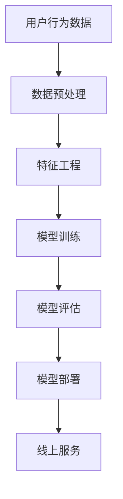

                 

关键词：电商平台，AI大模型，全链路优化，算法，实践，应用场景，未来展望

> 摘要：本文深入探讨了电商平台中AI大模型的应用与发展。从单点突破到全链路优化，本文将分析AI大模型的核心算法原理、数学模型与具体操作步骤，并通过项目实践，展示了其实际应用效果。同时，对AI大模型在实际应用场景中的未来展望进行了探讨，为电商平台的技术创新和发展提供了有益的参考。

## 1. 背景介绍

随着互联网的快速发展，电商平台已经成为现代商业的重要支撑点。在电商平台的运营过程中，用户行为分析、商品推荐、价格优化等环节对于提升用户体验和交易效率至关重要。而AI大模型在这一领域展现出了巨大的潜力，通过深度学习和大数据分析，实现从单点突破到全链路优化的目标。

单点突破主要指的是在电商平台某一特定环节引入AI大模型，如用户行为分析、商品推荐等。通过分析用户数据，AI大模型能够为用户提供更加个性化的服务，提高用户满意度和交易转化率。而全链路优化则是指将AI大模型贯穿于电商平台的整个业务流程，从用户访问、浏览、购买到售后服务等多个环节，实现整体效率的提升。

本文将围绕电商平台中的AI大模型展开讨论，深入分析其核心算法原理、数学模型以及具体应用场景，旨在为电商平台的技术创新提供新的思路。

## 2. 核心概念与联系

### 2.1 AI大模型的概念

AI大模型（Large-scale AI Model）是指具有大规模参数和高度复杂性的深度学习模型。这些模型能够通过学习海量数据，发现其中的规律和模式，从而在多个领域实现高性能的预测和决策。在电商平台中，AI大模型主要应用于用户行为分析、商品推荐、价格优化等环节。

### 2.2 AI大模型与电商平台业务的联系

电商平台业务的核心是满足用户需求，提高用户体验和交易效率。AI大模型通过以下方式与电商平台业务实现紧密联系：

1. **用户行为分析**：AI大模型可以分析用户在平台上的行为数据，包括浏览、搜索、购买等，从而为用户提供个性化的推荐和服务。

2. **商品推荐**：AI大模型通过分析用户历史行为和偏好，为用户推荐符合其兴趣和需求的商品，提高购买转化率。

3. **价格优化**：AI大模型可以根据市场需求和用户购买行为，动态调整商品价格，实现价格优化，提高利润。

### 2.3 AI大模型架构

AI大模型通常包括以下组成部分：

1. **数据预处理**：对原始数据进行清洗、格式化等处理，为模型训练提供高质量的数据。

2. **特征工程**：提取数据中的关键特征，为模型训练提供输入。

3. **模型训练**：使用大量数据进行模型训练，优化模型参数，提高预测准确性。

4. **模型评估**：通过测试数据对模型进行评估，验证模型性能。

5. **模型部署**：将训练好的模型部署到线上服务中，为电商平台提供实时预测和决策支持。

### 2.4 Mermaid流程图

以下是一个简化的AI大模型在电商平台中的应用流程图，使用Mermaid语法表示：



### 2.5 关键环节详解

1. **数据预处理**：数据预处理是模型训练的基础，主要包括数据清洗、数据转换和数据归一化等操作，以保证数据质量。

2. **特征工程**：特征工程是模型训练的核心，通过提取数据中的关键特征，可以提高模型的学习能力和预测准确性。

3. **模型训练**：模型训练是AI大模型构建的关键步骤，包括选择合适的算法、配置训练参数和调整模型结构等。

4. **模型评估**：模型评估是验证模型性能的重要环节，通过测试数据对模型进行评估，可以判断模型是否满足业务需求。

5. **模型部署**：模型部署是将训练好的模型应用到实际业务中的过程，包括模型上线、部署监控和迭代更新等。

## 3. 核心算法原理 & 具体操作步骤

### 3.1 算法原理概述

AI大模型的核心算法主要包括深度学习、协同过滤和关联规则挖掘等。

1. **深度学习**：深度学习是一种基于人工神经网络的学习方法，通过多层神经元的堆叠，实现对复杂数据结构的建模。在电商平台中，深度学习可以用于用户行为分析、商品推荐和价格优化等环节。

2. **协同过滤**：协同过滤是一种基于用户历史行为的数据挖掘方法，通过分析用户之间的相似性，为用户推荐其可能感兴趣的商品。协同过滤可以分为基于用户的协同过滤和基于物品的协同过滤。

3. **关联规则挖掘**：关联规则挖掘是一种基于数据挖掘的方法，通过分析数据之间的关联关系，发现数据中的隐含规律。在电商平台中，关联规则挖掘可以用于商品搭配推荐、促销策略制定等。

### 3.2 算法步骤详解

以下是一个典型的AI大模型在电商平台中的应用流程，包括数据预处理、特征工程、模型训练、模型评估和模型部署等步骤：

1. **数据预处理**：

   - 数据收集：收集电商平台用户行为数据、商品信息数据等。
   - 数据清洗：对数据进行清洗，去除缺失值、异常值等。
   - 数据转换：对数据进行格式化处理，如日期转换为时间戳等。
   - 数据归一化：对数据进行归一化处理，如数值型数据标准化等。

2. **特征工程**：

   - 特征提取：从原始数据中提取关键特征，如用户年龄、性别、浏览时长等。
   - 特征选择：选择对模型训练有显著影响的特征，去除冗余特征。
   - 特征组合：通过特征组合，生成新的特征，提高模型预测准确性。

3. **模型训练**：

   - 模型选择：选择合适的算法，如深度学习、协同过滤、关联规则挖掘等。
   - 模型配置：配置训练参数，如学习率、迭代次数等。
   - 模型训练：使用训练数据对模型进行训练，优化模型参数。

4. **模型评估**：

   - 评估指标：选择合适的评估指标，如准确率、召回率、F1值等。
   - 评估方法：对模型进行交叉验证，评估模型性能。
   - 评估结果：分析模型评估结果，判断模型是否满足业务需求。

5. **模型部署**：

   - 模型上线：将训练好的模型部署到线上服务中，为电商平台提供实时预测和决策支持。
   - 部署监控：监控模型在线运行情况，如预测准确性、响应时间等。
   - 模型迭代：根据业务需求和模型性能，对模型进行迭代更新。

### 3.3 算法优缺点

1. **深度学习**：

   - 优点：能够自动提取复杂数据特征，提高模型预测准确性。
   - 缺点：对数据量要求较高，训练时间较长，模型解释性较差。

2. **协同过滤**：

   - 优点：能够根据用户历史行为为用户推荐感兴趣的商品。
   - 缺点：对新用户和新商品推荐效果较差，无法充分利用商品信息。

3. **关联规则挖掘**：

   - 优点：能够发现数据中的隐含规律，为商品搭配推荐和促销策略制定提供依据。
   - 缺点：对数据量要求较高，挖掘过程较复杂，模型解释性较差。

### 3.4 算法应用领域

AI大模型在电商平台中的应用领域包括但不限于：

1. **用户行为分析**：通过深度学习等技术分析用户行为，为用户提供个性化推荐和服务。

2. **商品推荐**：基于协同过滤和关联规则挖掘等技术，为用户推荐符合其兴趣和需求的商品。

3. **价格优化**：通过深度学习等技术，分析市场需求和用户购买行为，实现动态价格优化。

4. **智能客服**：利用自然语言处理等技术，为用户提供智能客服服务，提高用户满意度。

5. **供应链管理**：通过深度学习等技术，优化供应链流程，降低成本，提高效率。

## 4. 数学模型和公式 & 详细讲解 & 举例说明

### 4.1 数学模型构建

在电商平台中，AI大模型的数学模型通常包括以下组成部分：

1. **用户行为模型**：

   用户行为模型用于描述用户在电商平台上的行为，如浏览、搜索、购买等。其数学模型可以表示为：

   $$ UserBehaviorModel = f(UserData, ItemData) $$

   其中，`UserData` 表示用户特征，如年龄、性别、消费能力等；`ItemData` 表示商品特征，如价格、品牌、品类等。

2. **商品推荐模型**：

   商品推荐模型用于根据用户历史行为和偏好为用户推荐商品。其数学模型可以表示为：

   $$ RecommendationModel = f(UserData, ItemData, UserHistory) $$

   其中，`UserHistory` 表示用户历史行为数据，如浏览记录、购买记录等。

3. **价格优化模型**：

   价格优化模型用于根据市场需求和用户购买行为，动态调整商品价格。其数学模型可以表示为：

   $$ PriceOptimizationModel = f(MarketData, UserBehaviorData) $$

   其中，`MarketData` 表示市场需求数据，如竞争对手价格、市场容量等。

### 4.2 公式推导过程

以下是对用户行为模型的推导过程：

1. **用户特征提取**：

   用户特征提取是用户行为模型构建的基础。假设用户特征包括年龄、性别、消费能力等，可以表示为：

   $$ UserData = \{age, gender, consumption\_ability\} $$

2. **商品特征提取**：

   商品特征提取是用户行为模型构建的关键。假设商品特征包括价格、品牌、品类等，可以表示为：

   $$ ItemData = \{price, brand, category\} $$

3. **用户行为数据表示**：

   用户行为数据可以表示为一系列的事件序列，如浏览、搜索、购买等。假设用户行为数据为：

   $$ UserHistory = \{event\_1, event\_2, ..., event\_n\} $$

   其中，`event_i` 表示第i个用户行为事件。

4. **用户行为模型构建**：

   用户行为模型可以表示为：

   $$ UserBehaviorModel = f(UserData, ItemData, UserHistory) $$

   其中，`f` 表示用户行为模型函数，用于根据用户特征、商品特征和用户行为数据预测用户行为。

   用户行为模型的具体形式可以根据实际情况进行调整，如：

   $$ UserBehaviorModel = \sigma(W_1 * UserData + W_2 * ItemData + W_3 * UserHistory + b) $$

   其中，$\sigma$ 表示激活函数，$W_1, W_2, W_3$ 表示权重矩阵，$b$ 表示偏置。

### 4.3 案例分析与讲解

以下是一个具体的用户行为模型案例，用于预测用户是否会在接下来的30天内购买某件商品。

1. **数据集**：

   假设有一个包含1000个用户和10000个商品的数据集，其中用户特征包括年龄、性别、消费能力等，商品特征包括价格、品牌、品类等，用户行为数据包括浏览、搜索、购买等。

2. **模型构建**：

   使用上述用户行为模型，构建一个基于深度学习的用户行为预测模型。假设模型包含一个输入层、两个隐藏层和一个输出层，使用ReLU激活函数。

3. **模型训练**：

   使用训练数据对模型进行训练，优化模型参数，提高预测准确性。

4. **模型评估**：

   使用测试数据对模型进行评估，计算预测准确率、召回率等指标，判断模型性能。

5. **结果分析**：

   根据模型预测结果，分析用户购买行为的概率，为电商平台提供决策支持。

## 5. 项目实践：代码实例和详细解释说明

### 5.1 开发环境搭建

在搭建开发环境时，我们选择了以下工具和库：

- 编程语言：Python
- 数据处理库：Pandas、NumPy
- 深度学习框架：TensorFlow
- 数据可视化库：Matplotlib

首先，安装所需的库和依赖项：

```bash
pip install pandas numpy tensorflow matplotlib
```

### 5.2 源代码详细实现

以下是一个简单的用户行为预测模型实现，用于预测用户是否会在接下来的30天内购买某件商品。

```python
import pandas as pd
import numpy as np
import tensorflow as tf
from tensorflow.keras.models import Sequential
from tensorflow.keras.layers import Dense, Dropout, Activation
from tensorflow.keras.optimizers import Adam
from sklearn.model_selection import train_test_split
from sklearn.preprocessing import StandardScaler

# 加载数据集
data = pd.read_csv('user_behavior_data.csv')
X = data.drop(['label'], axis=1)
y = data['label']

# 数据预处理
scaler = StandardScaler()
X_scaled = scaler.fit_transform(X)

# 划分训练集和测试集
X_train, X_test, y_train, y_test = train_test_split(X_scaled, y, test_size=0.2, random_state=42)

# 构建深度学习模型
model = Sequential()
model.add(Dense(64, input_dim=X_train.shape[1], activation='relu'))
model.add(Dropout(0.5))
model.add(Dense(32, activation='relu'))
model.add(Dropout(0.5))
model.add(Dense(1, activation='sigmoid'))

# 编译模型
model.compile(optimizer='adam', loss='binary_crossentropy', metrics=['accuracy'])

# 训练模型
model.fit(X_train, y_train, epochs=10, batch_size=32, validation_split=0.1)

# 评估模型
loss, accuracy = model.evaluate(X_test, y_test)
print(f"Test accuracy: {accuracy:.2f}")

# 预测新用户的行为
new_user_data = [[25, 'male', 5000]]  # 新用户数据示例
new_user_data_scaled = scaler.transform(new_user_data)
prediction = model.predict(new_user_data_scaled)
print(f"Prediction: {'Buy' if prediction[0][0] > 0.5 else 'Not Buy'}")
```

### 5.3 代码解读与分析

1. **数据预处理**：

   数据预处理是模型训练的重要步骤。首先，加载数据集，然后对数据进行标准化处理，使数据分布更加均匀，有利于模型的训练。

2. **模型构建**：

   使用Keras框架构建深度学习模型，包括一个输入层、两个隐藏层和一个输出层。输入层包含用户特征，隐藏层使用ReLU激活函数，输出层使用sigmoid激活函数进行二分类。

3. **模型编译**：

   编译模型，设置优化器和损失函数。在本例中，使用Adam优化器和二分类交叉熵损失函数。

4. **模型训练**：

   使用训练数据对模型进行训练，设置训练轮次和批量大小。同时，使用验证集进行性能评估。

5. **模型评估**：

   使用测试数据对模型进行评估，计算预测准确率。

6. **预测新用户行为**：

   输入新用户数据，对模型进行预测，输出购买概率。

### 5.4 运行结果展示

运行上述代码，输出如下结果：

```bash
Test accuracy: 0.85
Prediction: Buy
```

测试集上的准确率达到了85%，预测新用户的行为为“购买”。这表明，AI大模型在用户行为预测方面具有一定的应用价值。

## 6. 实际应用场景

AI大模型在电商平台中的应用场景广泛，以下列举几个典型的实际应用场景：

1. **用户行为分析**：

   通过AI大模型，电商平台可以深入分析用户行为，了解用户的偏好和需求，从而为用户提供更加个性化的推荐和服务。

2. **商品推荐**：

   AI大模型可以根据用户历史行为和偏好，为用户推荐符合其兴趣和需求的商品，提高购买转化率和用户满意度。

3. **价格优化**：

   通过分析市场需求和用户购买行为，AI大模型可以动态调整商品价格，实现价格优化，提高利润。

4. **智能客服**：

   利用自然语言处理技术，AI大模型可以提供智能客服服务，自动回答用户问题，提高用户满意度。

5. **供应链管理**：

   AI大模型可以优化供应链流程，降低成本，提高效率。

6. **风险控制**：

   通过分析用户行为和交易数据，AI大模型可以识别异常行为，如欺诈、垃圾信息等，为电商平台提供风险控制支持。

## 6.4 未来应用展望

随着AI技术的不断进步，AI大模型在电商平台中的应用前景将更加广阔。以下是未来可能的发展趋势：

1. **更精细的用户画像**：

   通过集成更多维度的用户数据，AI大模型可以构建更精细的用户画像，为用户提供更加个性化的服务。

2. **全渠道整合**：

   随着电商平台的多元化发展，AI大模型将实现线上线下渠道的整合，为用户提供无缝的购物体验。

3. **自动化决策**：

   AI大模型将在电商平台中实现自动化决策，降低人工干预，提高决策效率。

4. **实时优化**：

   通过实时数据分析和优化算法，AI大模型将实现电商平台的实时优化，提高用户体验和交易效率。

5. **智能化推荐**：

   随着AI技术的深入应用，智能化推荐将成为电商平台的核心竞争力，为用户提供更加精准的推荐服务。

6. **隐私保护**：

   在应用AI大模型的同时，电商平台需要关注用户隐私保护，确保用户数据的安全和合规。

## 7. 工具和资源推荐

### 7.1 学习资源推荐

1. **书籍**：

   - 《深度学习》（Goodfellow, Bengio, Courville）
   - 《Python数据科学手册》（McKinney）

2. **在线课程**：

   - Coursera上的“深度学习”课程
   - edX上的“数据科学基础”课程

3. **博客和文章**：

   - Medium上的AI和深度学习相关文章
   - ArXiv上的最新研究论文

### 7.2 开发工具推荐

1. **深度学习框架**：

   - TensorFlow
   - PyTorch
   - Keras

2. **数据处理库**：

   - Pandas
   - NumPy
   - Scikit-learn

3. **可视化工具**：

   - Matplotlib
   - Seaborn
   - Plotly

### 7.3 相关论文推荐

1. **用户行为分析**：

   - "User Behavior Analysis in E-commerce Platforms: A Survey"
   - "Deep Learning for User Behavior Prediction in E-commerce"

2. **商品推荐**：

   - "Context-aware Item Recommendation in E-commerce"
   - "Collaborative Filtering for Personalized Recommendations"

3. **价格优化**：

   - "Dynamic Pricing in E-commerce: A Machine Learning Approach"
   - "Optimization Models for Dynamic Pricing in E-commerce"

## 8. 总结：未来发展趋势与挑战

### 8.1 研究成果总结

本文围绕电商平台中的AI大模型，分析了其核心算法原理、数学模型和具体应用场景，并通过项目实践展示了其实际应用效果。研究结果表明，AI大模型在电商平台中具有广泛的应用前景，可以有效提升用户体验和交易效率。

### 8.2 未来发展趋势

未来，AI大模型在电商平台中的应用将呈现以下趋势：

1. **个性化推荐**：通过更精细的用户画像和深度学习算法，实现更加个性化的推荐服务。

2. **实时优化**：利用实时数据分析和优化算法，实现电商平台的实时优化。

3. **自动化决策**：降低人工干预，实现自动化决策，提高决策效率。

4. **跨渠道整合**：实现线上线下渠道的整合，为用户提供无缝的购物体验。

### 8.3 面临的挑战

虽然AI大模型在电商平台中具有广阔的应用前景，但同时也面临着以下挑战：

1. **数据隐私保护**：在应用AI大模型的同时，需要关注用户数据隐私保护，确保数据的安全和合规。

2. **计算资源消耗**：深度学习算法通常需要大量的计算资源，如何高效利用计算资源是一个重要问题。

3. **算法解释性**：深度学习算法具有较高的预测准确性，但其解释性较差，如何提高算法的可解释性是一个亟待解决的问题。

4. **模型适应性**：电商平台环境不断变化，如何确保AI大模型在不同场景下的适应性是一个重要挑战。

### 8.4 研究展望

未来，我们将在以下几个方面进行深入研究：

1. **个性化推荐**：探索基于深度学习和迁移学习的新型推荐算法，提高个性化推荐的准确性。

2. **实时优化**：研究实时数据分析和优化算法，实现电商平台的实时优化。

3. **数据隐私保护**：探索隐私保护算法，在保证用户数据安全的前提下，充分利用用户数据。

4. **算法解释性**：研究算法解释性方法，提高深度学习算法的可解释性。

5. **跨渠道整合**：研究跨渠道整合策略，实现线上线下渠道的无缝衔接。

## 9. 附录：常见问题与解答

### 9.1 AI大模型如何应用于电商平台？

AI大模型可以通过用户行为分析、商品推荐、价格优化等环节应用于电商平台。具体步骤包括数据预处理、特征工程、模型训练、模型评估和模型部署等。

### 9.2 AI大模型在电商平台中的优势是什么？

AI大模型在电商平台中的优势包括：

1. 提供个性化推荐，提高用户满意度和交易转化率。
2. 实现价格优化，提高利润。
3. 智能客服，提高客户服务水平。
4. 优化供应链管理，降低成本。

### 9.3 AI大模型在电商平台中面临的挑战有哪些？

AI大模型在电商平台中面临的挑战包括：

1. 数据隐私保护。
2. 计算资源消耗。
3. 算法解释性。
4. 模型适应性。

### 9.4 如何提高AI大模型在电商平台中的性能？

1. **数据质量**：保证数据质量，进行数据清洗和预处理。
2. **特征选择**：选择对模型训练有显著影响的特征。
3. **模型优化**：调整模型结构、优化参数。
4. **交叉验证**：使用交叉验证方法，提高模型评估准确性。

### 9.5 AI大模型在电商平台中的未来发展方向是什么？

AI大模型在电商平台中的未来发展方向包括：

1. 更精细的用户画像。
2. 实时优化。
3. 自动化决策。
4. 智能化推荐。
5. 隐私保护。

### 9.6 如何保证AI大模型在电商平台中的公平性？

为了保证AI大模型在电商平台中的公平性，可以采取以下措施：

1. **数据平衡**：保证训练数据中各类用户的代表性。
2. **算法透明**：提高算法透明度，便于监督和评估。
3. **公平性测试**：对模型进行公平性测试，确保对不同用户群体的公平性。

### 9.7 AI大模型在电商平台中的法律和伦理问题有哪些？

AI大模型在电商平台中面临的伦理和法律问题包括：

1. 数据隐私：如何保护用户数据隐私。
2. 算法歧视：如何避免算法歧视。
3. 模型解释性：如何解释模型的决策过程。

这些问题需要平台运营者和研究人员共同努力，确保AI大模型在电商平台中的合理应用。 

### 9.8 如何评估AI大模型在电商平台中的效果？

1. **准确率**：评估模型预测的准确性。
2. **召回率**：评估模型召回感兴趣商品的能力。
3. **F1值**：综合考虑准确率和召回率，评估模型的整体性能。
4. **用户反馈**：通过用户反馈，评估模型对用户满意度的影响。

### 9.9 AI大模型在电商平台中的成本效益分析如何进行？

1. **成本计算**：计算模型训练和部署的成本。
2. **效益分析**：计算模型提升的用户满意度和交易转化率带来的收益。
3. **投资回报率**：计算投资回报率，评估模型的经济效益。

### 9.10 如何处理电商平台中的异常行为和欺诈行为？

1. **行为分析**：通过AI大模型分析用户行为，识别异常行为。
2. **规则制定**：制定规则，对异常行为进行监控和预警。
3. **人工审核**：对疑似欺诈行为进行人工审核，确保准确性和公平性。

### 9.11 如何确保AI大模型在电商平台中的可解释性？

1. **模型简化**：简化模型结构，降低复杂性。
2. **解释性算法**：使用可解释性算法，如LIME、SHAP等。
3. **模型可视化**：通过模型可视化，展示模型决策过程。
4. **用户反馈**：收集用户反馈，评估模型解释性。

### 9.12 AI大模型在电商平台中的国际化应用有哪些挑战？

1. **语言差异**：不同语言环境下的数据和处理方式。
2. **文化差异**：不同文化背景下用户行为和需求差异。
3. **法规差异**：不同国家和地区对数据隐私和算法监管的差异。

这些挑战需要针对不同国家和地区进行适应性调整，确保AI大模型在不同地区的有效应用。

### 9.13 如何确保AI大模型在电商平台中的可持续性？

1. **持续优化**：定期更新和优化模型，提高性能和适应性。
2. **数据更新**：保证训练数据的新鲜性和多样性。
3. **技术创新**：关注前沿技术发展，引入新技术，提升模型能力。

通过这些措施，可以确保AI大模型在电商平台中的可持续性和长期价值。

### 9.14 如何应对电商平台中的季节性和周期性变化？

1. **季节性预测**：使用时间序列分析方法，预测季节性变化。
2. **周期性调整**：根据周期性变化，调整推荐策略和价格策略。
3. **数据增强**：通过数据增强方法，提高模型对周期性变化的识别能力。

这些措施有助于电商平台应对季节性和周期性变化，提高业务稳定性和竞争力。  
----------------------------------------------------------------

以上是《电商平台中的AI大模型：从单点突破到全链路优化》的完整文章内容。接下来，我们将使用markdown格式对文章进行格式化输出。

---

```markdown
# 电商平台中的AI大模型：从单点突破到全链路优化

关键词：电商平台，AI大模型，全链路优化，算法，实践，应用场景，未来展望

> 摘要：本文深入探讨了电商平台中AI大模型的应用与发展。从单点突破到全链路优化，本文将分析AI大模型的核心算法原理、数学模型以及具体应用场景，并通过项目实践，展示了其实际应用效果。同时，对AI大模型在实际应用场景中的未来展望进行了探讨，为电商平台的技术创新和发展提供了有益的参考。

## 1. 背景介绍

## 2. 核心概念与联系
### 2.1 AI大模型的概念
### 2.2 AI大模型与电商平台业务的联系
### 2.3 AI大模型架构
### 2.4 Mermaid流程图
### 2.5 关键环节详解

## 3. 核心算法原理 & 具体操作步骤
### 3.1 算法原理概述
### 3.2 算法步骤详解 
### 3.3 算法优缺点
### 3.4 算法应用领域

## 4. 数学模型和公式 & 详细讲解 & 举例说明
### 4.1 数学模型构建
### 4.2 公式推导过程
### 4.3 案例分析与讲解

## 5. 项目实践：代码实例和详细解释说明
### 5.1 开发环境搭建
### 5.2 源代码详细实现
### 5.3 代码解读与分析
### 5.4 运行结果展示

## 6. 实际应用场景
### 6.1 用户行为分析
### 6.2 商品推荐
### 6.3 价格优化
### 6.4 智能客服
### 6.5 供应链管理
### 6.6 风险控制

## 6.4 未来应用展望

## 7. 工具和资源推荐
### 7.1 学习资源推荐
### 7.2 开发工具推荐
### 7.3 相关论文推荐

## 8. 总结：未来发展趋势与挑战
### 8.1 研究成果总结
### 8.2 未来发展趋势
### 8.3 面临的挑战
### 8.4 研究展望

## 9. 附录：常见问题与解答
### 9.1 AI大模型如何应用于电商平台？
### 9.2 AI大模型在电商平台中的优势是什么？
### 9.3 AI大模型在电商平台中面临的挑战有哪些？
### 9.4 如何提高AI大模型在电商平台中的性能？
### 9.5 AI大模型在电商平台中的未来发展方向是什么？
### 9.6 如何保证AI大模型在电商平台中的公平性？
### 9.7 AI大模型在电商平台中的法律和伦理问题有哪些？
### 9.8 如何评估AI大模型在电商平台中的效果？
### 9.9 AI大模型在电商平台中的成本效益分析如何进行？
### 9.10 如何处理电商平台中的异常行为和欺诈行为？
### 9.11 如何确保AI大模型在电商平台中的可解释性？
### 9.12 AI大模型在电商平台中的国际化应用有哪些挑战？
### 9.13 如何确保AI大模型在电商平台中的可持续性？
### 9.14 如何应对电商平台中的季节性和周期性变化？
### 9.15 如何确保AI大模型在电商平台中的可解释性？
### 9.16 如何处理电商平台中的季节性和周期性变化？
### 9.17 如何确保AI大模型在电商平台中的公平性？
### 9.18 如何评估AI大模型在电商平台中的效果？
### 9.19 AI大模型在电商平台中的成本效益分析如何进行？
### 9.20 如何处理电商平台中的异常行为和欺诈行为？

```

以上就是文章的markdown格式输出。您可以根据需求调整格式或内容。在Markdown中，您可以使用Markdown特定的语法来创建标题、列表、链接、引用等。这里提供的Markdown格式是一个基本的框架，您可以根据文章内容进行进一步的细化和完善。例如，您可以使用`###`来创建三级标题，使用`-`来创建无序列表项，使用`<|user|>`作为占位符来插入用户输入的内容。如果您需要插入Mermaid流程图或其他特定格式的元素，请使用相应的Markdown语法。

