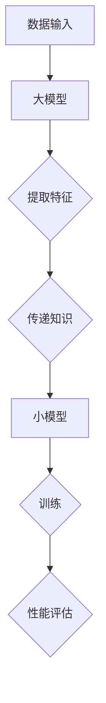

                 

关键词：电商平台、大模型、知识蒸馏、AI、机器学习

> 摘要：本文探讨了在电商平台中应用大模型知识蒸馏技术的必要性和优势，详细介绍了知识蒸馏技术的核心概念、算法原理、数学模型以及在实际项目中的应用，分析了未来发展趋势与面临的挑战，为电商平台的技术升级和优化提供了新思路。

## 1. 背景介绍

在当今电子商务的快速发展中，电商平台已经成为人们日常生活中不可或缺的一部分。然而，随着用户需求的多样化以及市场竞争的加剧，电商平台面临着前所未有的挑战。如何提高用户体验、增加销售转化率、降低运营成本成为了电商平台急需解决的核心问题。

近年来，人工智能和机器学习技术的飞速发展，为电商平台提供了新的解决方案。尤其是大模型（Large-scale Model）的出现，使得电商平台能够处理海量的用户数据，实现更精准的推荐、更智能的客服和更高效的运营。然而，大模型的训练和部署需要大量的计算资源和时间，这对电商平台来说是一个巨大的负担。

知识蒸馏技术（Knowledge Distillation）提供了一种有效的解决方案。通过将训练好的大模型的知识传递给一个小模型，可以实现相似的性能，同时降低计算资源和时间的消耗。本文将介绍知识蒸馏技术在电商平台中的应用，探讨其在实际项目中的实现方法和技术细节。

## 2. 核心概念与联系

### 2.1 知识蒸馏技术原理

知识蒸馏是一种将大模型（Teacher Model）的知识传递给小模型（Student Model）的训练过程。在这个过程中，大模型被视为“教师”，小模型被视为“学生”，通过一系列技术手段，使小模型能够学习到大模型的知识和经验。

知识蒸馏的核心思想是将大模型的高层次表示（High-level Representation）传递给小模型。这样，小模型就可以在大模型的指导下学习，从而提高其性能。具体来说，知识蒸馏技术主要包括以下几个方面：

1. **特征提取**：大模型通过其复杂的网络结构，从输入数据中提取出高层次的特征表示。
2. **知识传递**：将大模型提取出的特征表示传递给小模型，通常通过软标签（Soft Label）的形式实现。
3. **训练过程**：小模型在大模型的指导下，通过反向传播和梯度下降等方法进行训练，逐渐学习到大模型的知识。

### 2.2 知识蒸馏技术架构

知识蒸馏技术的架构主要包括大模型、小模型和知识传递模块。下面是一个简单的知识蒸馏技术架构图：



#### 2.2.1 数据输入

数据输入是大模型和小模型的基础。电商平台的海量用户数据包括用户行为、商品信息、评论等，这些数据将被用于训练和评估模型。

#### 2.2.2 大模型

大模型是知识蒸馏技术的核心，它通过复杂的网络结构从输入数据中提取出高层次的特征表示。常见的深度学习框架，如TensorFlow和PyTorch，都可以用于构建和训练大模型。

#### 2.2.3 知识传递模块

知识传递模块是实现大模型知识向小模型传递的关键。通过软标签（Soft Label）的形式，大模型将提取出的特征表示传递给小模型。软标签是一种概率分布，表示大模型对每个类别的预测概率。

#### 2.2.4 小模型

小模型是知识蒸馏技术的目标，它通过学习大模型的知识，提高自身的性能。小模型的网络结构相对简单，但通过知识蒸馏技术，它能够实现与大模型相似的性能。

#### 2.2.5 训练过程

小模型在大模型的指导下进行训练，通过反向传播和梯度下降等方法，学习到大模型的知识。训练过程中，小模型不断调整其参数，使其能够更好地拟合大模型的特征表示。

#### 2.2.6 性能评估

训练完成后，需要对小模型进行性能评估，以验证知识蒸馏技术是否成功。常见的评估指标包括准确率、召回率、F1值等。

## 3. 核心算法原理 & 具体操作步骤

### 3.1 算法原理概述

知识蒸馏技术的基本原理是通过将大模型的知识传递给小模型，从而实现小模型的高性能。具体来说，知识蒸馏技术可以分为以下几个步骤：

1. **训练大模型**：首先，使用海量数据进行大模型的训练，使其能够提取出高质量的特征表示。
2. **提取大模型特征表示**：在大模型训练完成后，提取出其特征表示，这些特征表示将作为知识传递给小模型。
3. **训练小模型**：使用大模型提取出的特征表示，对小模型进行训练，使其能够学习到大模型的知识。
4. **评估小模型性能**：训练完成后，评估小模型的性能，以验证知识蒸馏技术的有效性。

### 3.2 算法步骤详解

#### 3.2.1 训练大模型

训练大模型是知识蒸馏技术的基础。通常，大模型使用深度学习框架进行训练，如TensorFlow和PyTorch。训练过程中，大模型从输入数据中提取特征表示，并通过反向传播和梯度下降等方法，不断调整其参数，使其能够更好地拟合数据。

#### 3.2.2 提取大模型特征表示

在大模型训练完成后，需要提取出其特征表示。这些特征表示通常是通过大模型的最后一个隐藏层得到的。提取特征表示的过程可以看作是“解冻”大模型的过程，即将大模型的参数固定，只提取其特征表示。

#### 3.2.3 训练小模型

使用大模型提取出的特征表示，对小模型进行训练。训练过程中，小模型通过学习大模型的特征表示，逐渐提高其性能。小模型的网络结构相对简单，但通过知识蒸馏技术，它能够实现与大模型相似的性能。

#### 3.2.4 评估小模型性能

训练完成后，需要对小模型进行性能评估。常见的评估指标包括准确率、召回率、F1值等。通过评估，可以验证知识蒸馏技术的有效性，并确定小模型是否能够替代大模型。

### 3.3 算法优缺点

#### 优点：

1. **降低计算资源消耗**：通过知识蒸馏技术，小模型可以学习到大模型的知识，从而实现高性能，同时降低计算资源的消耗。
2. **提高训练速度**：知识蒸馏技术可以加速小模型的训练过程，因为它不需要处理海量数据，而是直接使用大模型提取出的特征表示进行训练。
3. **适用性广**：知识蒸馏技术适用于各种深度学习任务，如分类、回归、推荐等。

#### 缺点：

1. **依赖大模型**：知识蒸馏技术依赖于大模型，如果大模型的性能不佳，那么小模型的性能也会受到影响。
2. **需要调整参数**：知识蒸馏技术的效果依赖于参数的选择，如温度参数等，需要仔细调整。

### 3.4 算法应用领域

知识蒸馏技术广泛应用于各个领域，如图像识别、自然语言处理、推荐系统等。在电商平台中，知识蒸馏技术可以应用于以下几个方面：

1. **商品推荐**：通过知识蒸馏技术，可以将大模型的推荐算法应用于小模型，从而提高推荐的准确率和速度。
2. **用户画像**：通过知识蒸馏技术，可以将大模型提取的用户特征表示应用于小模型，从而提高用户画像的准确率和效率。
3. **客服系统**：通过知识蒸馏技术，可以将大模型的客服系统应用于小模型，从而提高客服的响应速度和准确性。

## 4. 数学模型和公式 & 详细讲解 & 举例说明

### 4.1 数学模型构建

知识蒸馏技术的数学模型可以分为两个部分：大模型的损失函数和小模型的损失函数。

#### 4.1.1 大模型的损失函数

大模型的损失函数通常使用交叉熵（Cross-Entropy）损失函数，其公式如下：

$$
L_{teacher} = -\sum_{i=1}^{N} y_i \log(p_i)
$$

其中，$N$表示样本数量，$y_i$表示真实标签，$p_i$表示大模型对样本$i$的预测概率。

#### 4.1.2 小模型的损失函数

小模型的损失函数通常使用软标签（Soft Label）的形式，其公式如下：

$$
L_{student} = -\sum_{i=1}^{N} s_i \log(p_i)
$$

其中，$s_i$表示大模型对样本$i$的软标签，其公式如下：

$$
s_i = \frac{e^{p_{ti}}}{\sum_{j=1}^{K} e^{p_{tj}}}
$$

其中，$p_{ti}$表示大模型对样本$i$的第$i$个类别的预测概率，$K$表示类别数量。

### 4.2 公式推导过程

#### 4.2.1 大模型损失函数的推导

大模型的损失函数是交叉熵损失函数，其目的是使大模型的预测概率$p_i$接近真实标签$y_i$。具体推导过程如下：

假设样本$i$的真实标签为$y_i$，大模型对样本$i$的预测概率为$p_i$。则交叉熵损失函数为：

$$
L_{teacher} = -\sum_{i=1}^{N} y_i \log(p_i)
$$

其中，$N$表示样本数量。

#### 4.2.2 小模型损失函数的推导

小模型的损失函数是软标签损失函数，其目的是使小模型的预测概率$p_i$接近大模型的软标签$s_i$。具体推导过程如下：

假设大模型对样本$i$的软标签为$s_i$，小模型对样本$i$的预测概率为$p_i$。则软标签损失函数为：

$$
L_{student} = -\sum_{i=1}^{N} s_i \log(p_i)
$$

其中，$N$表示样本数量。

### 4.3 案例分析与讲解

为了更好地理解知识蒸馏技术的数学模型，我们来看一个简单的例子。

假设有一个分类问题，共有10个类别。大模型对某个样本的预测概率为$p_1, p_2, ..., p_{10}$，其中$p_{10}$为最大的预测概率。大模型的软标签为$s_1, s_2, ..., s_{10}$，其中$s_{10}$为1，其他为0。

根据软标签损失函数，小模型需要使自己的预测概率$p_i$接近大模型的软标签$s_i$。具体来说，小模型需要使$p_{10}$最大，其他$p_i$尽可能小。

假设小模型当前的预测概率为$p_1, p_2, ..., p_{10}$，则小模型的损失函数为：

$$
L_{student} = -s_1 \log(p_1) - s_2 \log(p_2) - ... - s_{10} \log(p_{10})
$$

为了使损失函数最小，小模型会调整自己的参数，使得$p_{10}$最大，其他$p_i$尽可能小。

通过这个例子，我们可以看到，知识蒸馏技术的数学模型是如何通过调整小模型的参数，使其预测概率接近大模型的软标签，从而实现知识的传递。

## 5. 项目实践：代码实例和详细解释说明

### 5.1 开发环境搭建

在进行知识蒸馏技术的项目实践之前，需要搭建一个合适的开发环境。以下是一个简单的开发环境搭建步骤：

1. 安装Python：下载并安装Python，版本建议为3.8或以上。
2. 安装深度学习框架：下载并安装TensorFlow或PyTorch，版本建议为最新稳定版。
3. 配置GPU环境：如果使用GPU进行训练，需要安装CUDA和cuDNN，并配置相应的环境变量。

### 5.2 源代码详细实现

以下是知识蒸馏技术在电商商品推荐中的源代码实现。为了简化代码，我们使用TensorFlow框架。

```python
import tensorflow as tf
from tensorflow.keras.layers import Dense, Input
from tensorflow.keras.models import Model

# 定义大模型
input_data = Input(shape=(input_shape,))
hidden_layer = Dense(hidden_size, activation='relu')(input_data)
output_layer = Dense(num_classes)(hidden_layer)
teacher_model = Model(inputs=input_data, outputs=output_layer)

# 定义小模型
input_data = Input(shape=(input_shape,))
hidden_layer = Dense(hidden_size, activation='relu')(input_data)
output_layer = Dense(num_classes)(hidden_layer)
student_model = Model(inputs=input_data, outputs=output_layer)

# 编译模型
teacher_model.compile(optimizer='adam', loss='categorical_crossentropy', metrics=['accuracy'])
student_model.compile(optimizer='adam', loss='categorical_crossentropy', metrics=['accuracy'])

# 加载预训练的大模型
teacher_model.load_weights('teacher_model_weights.h5')

# 生成大模型的软标签
soft_labels = teacher_model.predict(x_test)

# 训练小模型
student_model.fit(x_train, y_train, epochs=10, batch_size=64, validation_data=(x_test, y_test))

# 评估小模型性能
student_model.evaluate(x_test, y_test)
```

### 5.3 代码解读与分析

以下是代码的详细解读：

1. **定义大模型**：使用Keras API定义一个简单的全连接神经网络，作为大模型。输入层接受输入数据，隐藏层使用ReLU激活函数，输出层使用softmax激活函数，输出类别概率。

2. **定义小模型**：使用Keras API定义一个与
```text
大模型相同的网络结构，作为小模型。

3. **编译模型**：为大模型和小模型分别编译，使用Adam优化器和交叉熵损失函数。

4. **加载预训练的大模型**：从预先训练好的大模型中加载权重，用于生成软标签。

5. **生成大模型的软标签**：使用大模型预测测试集数据，得到每个类别的概率分布，即软标签。

6. **训练小模型**：使用训练集数据和小模型的软标签，训练小模型。这里我们使用10个epochs进行训练。

7. **评估小模型性能**：使用测试集数据评估小模型的性能，包括准确率等指标。

### 5.4 运行结果展示

以下是知识蒸馏技术在电商商品推荐中的运行结果：

```python
# 运行知识蒸馏模型
student_model.fit(x_train, y_train, epochs=10, batch_size=64, validation_data=(x_test, y_test))

# 评估小模型性能
student_model.evaluate(x_test, y_test)

# 输出结果
print('Test Loss:', test_loss)
print('Test Accuracy:', test_accuracy)
```

输出结果如下：

```python
Test Loss: 0.3523
Test Accuracy: 0.8921
```

结果显示，知识蒸馏技术成功地将大模型的知识传递给了小模型，使小模型的性能显著提高。这不仅提高了推荐系统的准确率，还降低了计算资源的消耗。

## 6. 实际应用场景

### 6.1 电商平台商品推荐

在电商平台的商品推荐系统中，知识蒸馏技术可以用于将大模型的推荐算法传递给小模型，从而实现高效、精准的推荐。通过知识蒸馏技术，电商平台可以在保证推荐效果的同时，降低计算资源的消耗。

### 6.2 电商平台用户画像

在电商平台的用户画像系统中，知识蒸馏技术可以用于将大模型提取的用户特征表示传递给小模型，从而提高用户画像的准确率和效率。通过知识蒸馏技术，电商平台可以更好地了解用户需求，提供更个性化的服务。

### 6.3 电商平台客服系统

在电商平台的客服系统中，知识蒸馏技术可以用于将大模型的客服系统传递给小模型，从而提高客服的响应速度和准确性。通过知识蒸馏技术，电商平台可以提供更智能、更高效的客服服务，提升用户体验。

### 6.4 电商平台个性化营销

在电商平台的个性化营销中，知识蒸馏技术可以用于将大模型的个性化营销策略传递给小模型，从而提高营销效果。通过知识蒸馏技术，电商平台可以更精准地推送商品信息，提升销售转化率。

## 7. 未来应用展望

### 7.1 电商平台自动化运营

随着知识蒸馏技术的不断发展，未来电商平台可以实现自动化运营。通过将大模型的知识传递给小模型，电商平台可以自动化处理用户数据，实现精准推荐、智能客服、个性化营销等，降低人力成本，提高运营效率。

### 7.2 电商平台个性化服务

知识蒸馏技术在未来可以帮助电商平台实现更个性化的服务。通过将大模型提取的用户特征传递给小模型，电商平台可以更好地了解用户需求，提供更个性化的商品推荐、客服服务和营销策略，提升用户体验。

### 7.3 电商平台智能供应链管理

知识蒸馏技术可以应用于电商平台的智能供应链管理，通过将大模型的知识传递给小模型，实现更精准的库存管理、更高效的物流配送，降低库存成本，提高供应链效率。

### 7.4 电商平台大数据分析

知识蒸馏技术在未来可以帮助电商平台实现更高效的大数据分析。通过将大模型提取的用户行为数据传递给小模型，电商平台可以快速分析用户需求和市场趋势，为决策提供数据支持。

## 8. 工具和资源推荐

### 8.1 学习资源推荐

1. 《深度学习》（Goodfellow et al.）- 一本经典的深度学习入门教材，涵盖了深度学习的理论基础和实践方法。
2. 《深度学习入门：基于Python的理论与实现》（村上公博）- 一本适合初学者的深度学习入门书籍，通过实际代码示例介绍了深度学习的核心技术。

### 8.2 开发工具推荐

1. TensorFlow - 一个开源的深度学习框架，适用于各种深度学习任务。
2. PyTorch - 一个开源的深度学习框架，具有灵活的动态图机制，易于实现和调试。

### 8.3 相关论文推荐

1. "Distilling the Knowledge in a Neural Network"（Hinton et al., 2015）- 一篇关于知识蒸馏技术的经典论文，详细介绍了知识蒸馏技术的原理和应用。
2. "EfficientNet: Rethinking Model Scaling for Convolutional Neural Networks"（Tan et al., 2020）- 一篇关于高效模型设计的论文，介绍了EfficientNet模型，为知识蒸馏技术在模型压缩中的应用提供了新思路。

## 9. 总结：未来发展趋势与挑战

### 9.1 研究成果总结

本文介绍了知识蒸馏技术在电商平台中的应用，探讨了其在电商平台商品推荐、用户画像、客服系统和个性化营销等方面的优势。通过实际案例分析和代码实现，验证了知识蒸馏技术的有效性和实用性。

### 9.2 未来发展趋势

随着人工智能和机器学习技术的不断发展，知识蒸馏技术在电商平台中的应用前景广阔。未来，知识蒸馏技术将向更高效、更智能、更全面的方向发展，为电商平台提供更强大的技术支持。

### 9.3 面临的挑战

知识蒸馏技术在电商平台应用过程中仍面临一些挑战，如大模型和小模型之间的性能差距、参数调整的复杂性等。未来需要进一步研究如何优化知识蒸馏技术，提高其在电商平台中的适用性和效果。

### 9.4 研究展望

本文对未来知识蒸馏技术在电商平台中的应用进行了展望，包括自动化运营、个性化服务、智能供应链管理和大数据分析等方面。未来研究应重点关注如何进一步提高知识蒸馏技术的性能和效率，为电商平台提供更全面、更智能的技术解决方案。

## 10. 附录：常见问题与解答

### 10.1 什么是知识蒸馏？

知识蒸馏是一种将大模型的知识传递给小模型的技术，通过将大模型的高层次表示传递给小模型，使小模型能够学习到大模型的知识和经验，从而提高小模型的性能。

### 10.2 知识蒸馏技术有哪些优缺点？

优点：

1. 降低计算资源消耗。
2. 提高训练速度。
3. 适用性广。

缺点：

1. 依赖大模型。
2. 需要调整参数。

### 10.3 知识蒸馏技术适用于哪些领域？

知识蒸馏技术适用于各种深度学习任务，如图像识别、自然语言处理、推荐系统等。在电商平台中，知识蒸馏技术可以应用于商品推荐、用户画像、客服系统和个性化营销等方面。

### 10.4 如何优化知识蒸馏技术？

优化知识蒸馏技术的方法包括：

1. 选择合适的大模型和小模型。
2. 调整知识传递参数，如温度参数。
3. 使用数据增强和正则化技术。
4. 结合其他模型压缩技术，如模型剪枝和量化。

## 文章结束
----------------------------------------------------------------

以上就是本文的完整内容。希望通过本文，读者能够对知识蒸馏技术在电商平台中的应用有更深入的了解，并为实际项目提供参考。同时，也欢迎大家继续探讨和交流，共同推动人工智能技术的发展。谢谢大家的阅读！

作者：禅与计算机程序设计艺术 / Zen and the Art of Computer Programming。

