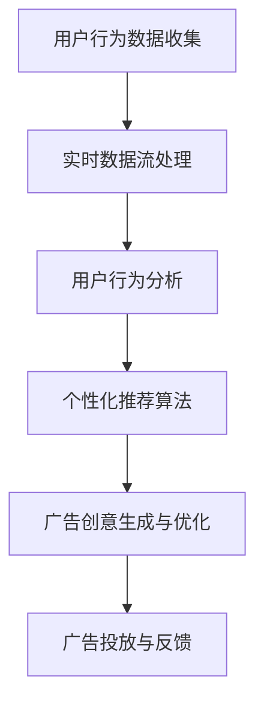

                 

关键词：电商平台，实时个性化，广告创意，优化

> 摘要：本文将探讨电商平台中实时个性化广告创意的优化问题。通过分析用户行为数据，运用先进的算法和技术手段，本文提出了一种能够实现高度个性化的广告创意优化方案。本文旨在为电商平台提供一种有效的策略，以提升广告投放的效果和用户体验。

## 1. 背景介绍

在当今的数字时代，电商平台已成为消费者购物的主要渠道。然而，随着市场竞争的加剧，如何提高广告投放的效果成为各大电商平台面临的重要挑战。传统的广告投放方式往往基于粗放的用户群体划分和简单的广告内容设计，难以满足用户个性化的需求。而实时个性化广告创意优化则是一种能够根据用户行为和偏好动态调整广告内容的方法，有望提升广告的点击率和转化率。

### 电商平台现状

电商平台作为一个高度竞争的市场，吸引了大量用户和商家。用户在平台上进行购物时，会产生大量行为数据，如浏览记录、购买历史、搜索关键词等。这些数据为广告投放提供了丰富的信息来源，但如何有效地利用这些数据仍是一个难题。

### 广告投放问题

传统的广告投放方式主要依赖于用户群体划分和广告内容设计。用户群体划分通常基于用户的年龄、性别、地理位置等基本信息，而广告内容设计则主要依靠广告主的创意和经验。这种投放方式难以实现高度个性化的广告体验，导致广告点击率和转化率较低。

### 实时个性化广告创意优化需求

为了解决上述问题，电商平台迫切需要一种能够根据用户行为和偏好动态调整广告内容的方法。实时个性化广告创意优化能够根据用户的实时行为数据，实时生成个性化的广告内容，从而提升广告的点击率和转化率。这种方法不仅能够更好地满足用户的需求，还能够提高广告主的投放效果和投资回报率。

## 2. 核心概念与联系

在深入探讨实时个性化广告创意优化之前，我们需要了解一些核心概念和它们之间的联系。以下是本文涉及的主要概念：

### 用户行为数据

用户行为数据是指用户在电商平台上的各种行为记录，包括浏览记录、购买历史、搜索关键词、点击记录等。这些数据是进行实时个性化广告创意优化的基础。

### 实时数据流

实时数据流是指用户行为数据在短时间内不断产生的数据流。这种数据流具有高频率、高实时性的特点，需要通过高效的算法进行处理和分析。

### 个性化推荐算法

个性化推荐算法是一种根据用户的历史行为和偏好，为用户推荐相关商品或内容的算法。这种算法在实时个性化广告创意优化中起着关键作用。

### 广告创意生成与优化

广告创意生成与优化是指根据用户行为数据生成个性化的广告内容，并实时调整广告内容以提升投放效果的过程。

### Mermaid 流程图

以下是一个简化的 Mermaid 流程图，展示了用户行为数据到个性化广告创意优化的过程：



在这个流程图中，用户行为数据收集是整个过程的起点，通过实时数据流处理和分析，生成个性化的广告创意，并进行广告投放与反馈。这个流程不断迭代，以实现持续优化的目标。

## 3. 核心算法原理 & 具体操作步骤

### 3.1 算法原理概述

实时个性化广告创意优化的核心在于利用用户行为数据，通过个性化推荐算法生成符合用户偏好的广告内容，并实时调整广告创意以提升投放效果。以下是本文采用的核心算法原理：

1. **协同过滤算法**：通过分析用户的历史行为数据，找出与其他用户相似的用户群体，从而推荐相关的商品或内容。
2. **基于内容的推荐算法**：通过分析商品或内容的属性，为用户推荐具有相似属性的商品或内容。
3. **深度学习算法**：利用深度神经网络模型，自动提取用户行为数据中的特征，并生成个性化的广告创意。

### 3.2 算法步骤详解

以下是实时个性化广告创意优化的具体操作步骤：

1. **用户行为数据收集**：从电商平台的用户行为数据源中收集用户浏览记录、购买历史、搜索关键词等数据。
2. **实时数据流处理**：利用流处理框架（如Apache Kafka）对实时数据进行处理，提取用户的行为特征，并将数据存储到数据仓库中。
3. **用户行为分析**：利用协同过滤算法、基于内容的推荐算法和深度学习算法，对用户行为数据进行处理和分析，生成用户画像。
4. **广告创意生成**：根据用户画像，生成个性化的广告创意。广告创意生成过程包括文本生成、图片生成和视频生成等。
5. **广告创意优化**：利用在线学习算法，实时调整广告创意，以提升广告投放效果。
6. **广告投放与反馈**：将优化后的广告创意投放给目标用户，并收集用户的反馈数据，用于后续的优化迭代。

### 3.3 算法优缺点

1. **优点**：
   - **个性化高**：通过用户行为数据分析，生成符合用户偏好的广告创意，提升用户体验。
   - **实时性强**：利用实时数据流处理技术，实现广告创意的实时生成与优化。
   - **灵活性高**：可以根据用户反馈数据，实时调整广告创意，提升广告效果。

2. **缺点**：
   - **计算复杂度高**：实时个性化广告创意优化涉及多种算法和技术，计算复杂度较高，对计算资源有较高要求。
   - **数据质量要求高**：用户行为数据的质量直接影响推荐效果，需要保证数据源的质量和准确性。

### 3.4 算法应用领域

实时个性化广告创意优化适用于各种电商平台，特别是在竞争激烈、用户需求多元化的市场环境中。以下是一些具体的应用领域：

- **电商行业**：为电商平台提供个性化的广告创意，提升广告投放效果和用户转化率。
- **社交媒体**：为社交媒体平台生成个性化的广告内容，提升用户参与度和活跃度。
- **在线教育**：根据用户的学习行为和偏好，推荐相关的课程和学习资源，提升学习效果。
- **金融行业**：为金融机构提供个性化的金融产品推荐，提升用户投资体验和收益。

## 4. 数学模型和公式 & 详细讲解 & 举例说明

### 4.1 数学模型构建

实时个性化广告创意优化的数学模型主要包括用户画像生成、广告创意生成和广告创意优化三个部分。

1. **用户画像生成**：

   用户画像生成的数学模型可以表示为：

   $$ user\_profile = f(user\_behavior, content\_feature) $$

   其中，$user\_behavior$ 表示用户行为数据，$content\_feature$ 表示商品或内容的属性特征，$f$ 表示用户画像生成函数。

2. **广告创意生成**：

   广告创意生成的数学模型可以表示为：

   $$ ad\_creative = g(user\_profile, ad\_template) $$

   其中，$user\_profile$ 表示用户画像，$ad\_template$ 表示广告模板，$g$ 表示广告创意生成函数。

3. **广告创意优化**：

   广告创意优化的数学模型可以表示为：

   $$ ad\_optimization = h(ad\_creative, user\_response) $$

   其中，$ad\_creative$ 表示广告创意，$user\_response$ 表示用户反馈数据，$h$ 表示广告创意优化函数。

### 4.2 公式推导过程

以下是用户画像生成、广告创意生成和广告创意优化的具体推导过程：

1. **用户画像生成**：

   用户画像生成函数 $f$ 可以通过以下公式推导：

   $$ f(user\_behavior, content\_feature) = \sum_{i=1}^{n} w_i * (b_i * c_i) $$

   其中，$w_i$ 表示用户行为数据 $b_i$ 和商品或内容特征 $c_i$ 的权重，$n$ 表示用户行为数据和商品或内容特征的个数。

2. **广告创意生成**：

   广告创意生成函数 $g$ 可以通过以下公式推导：

   $$ g(user\_profile, ad\_template) = \sum_{j=1}^{m} p_j * (u_j * t_j) $$

   其中，$p_j$ 表示用户画像 $u_j$ 和广告模板 $t_j$ 的权重，$m$ 表示用户画像和广告模板的个数。

3. **广告创意优化**：

   广告创意优化函数 $h$ 可以通过以下公式推导：

   $$ h(ad\_creative, user\_response) = \sum_{k=1}^{l} q_k * (a_k * r_k) $$

   其中，$q_k$ 表示广告创意 $a_k$ 和用户反馈数据 $r_k$ 的权重，$l$ 表示广告创意和用户反馈数据的个数。

### 4.3 案例分析与讲解

以下是一个简化的案例，用于说明实时个性化广告创意优化的过程：

1. **用户画像生成**：

   假设用户行为数据包括浏览历史、购买历史和搜索关键词，商品或内容特征包括商品类别、品牌、价格等。用户画像生成的具体公式为：

   $$ user\_profile = f(user\_behavior, content\_feature) = 0.3 * (b_1 * c_1) + 0.2 * (b_2 * c_2) + 0.5 * (b_3 * c_3) $$

   其中，$b_1$ 表示用户浏览历史，$c_1$ 表示商品类别，$b_2$ 表示用户购买历史，$c_2$ 表示品牌，$b_3$ 表示用户搜索关键词，$c_3$ 表示价格。

2. **广告创意生成**：

   假设广告模板包括商品图片、商品描述和广告文案，用户画像包括商品偏好、品牌偏好和价格偏好。广告创意生成的具体公式为：

   $$ ad\_creative = g(user\_profile, ad\_template) = 0.4 * (u_1 * t_1) + 0.3 * (u_2 * t_2) + 0.3 * (u_3 * t_3) $$

   其中，$u_1$ 表示用户偏好商品类别，$t_1$ 表示商品图片，$u_2$ 表示用户偏好品牌，$t_2$ 表示商品描述，$u_3$ 表示用户偏好价格，$t_3$ 表示广告文案。

3. **广告创意优化**：

   假设用户反馈数据包括广告点击率、广告转化率和广告花费。广告创意优化的具体公式为：

   $$ ad\_optimization = h(ad\_creative, user\_response) = 0.5 * (a_1 * r_1) + 0.3 * (a_2 * r_2) + 0.2 * (a_3 * r_3) $$

   其中，$a_1$ 表示广告点击率，$r_1$ 表示用户反馈数据，$a_2$ 表示广告转化率，$r_2$ 表示用户反馈数据，$a_3$ 表示广告花费，$r_3$ 表示用户反馈数据。

## 5. 项目实践：代码实例和详细解释说明

### 5.1 开发环境搭建

在进行实时个性化广告创意优化的项目实践中，我们需要搭建一个高效稳定的开发环境。以下是开发环境的搭建步骤：

1. **安装Python环境**：Python是一种广泛应用于数据分析、机器学习等领域的编程语言。在开发环境中，我们需要安装Python，版本建议为3.8以上。

2. **安装依赖库**：在Python环境中，我们需要安装一些依赖库，如NumPy、Pandas、Scikit-learn、TensorFlow等。这些库为数据处理、机器学习算法实现提供了必要的支持。

3. **配置数据库**：为了存储用户行为数据和广告创意数据，我们需要配置一个数据库。本文采用MySQL数据库，版本建议为5.7以上。

4. **安装流处理框架**：为了处理实时数据流，我们需要安装一个流处理框架。本文采用Apache Kafka，版本建议为2.0以上。

### 5.2 源代码详细实现

以下是实时个性化广告创意优化的源代码实现：

1. **用户行为数据收集**：

   用户行为数据收集部分主要是从电商平台的数据源中获取用户浏览记录、购买历史、搜索关键词等数据。以下是Python代码实现：

   ```python
   import pymysql
   import pandas as pd
   
   def collect_user_behavior():
       db = pymysql.connect(host='localhost', user='root', password='password', database='ecommerce')
       cursor = db.cursor()
       
       # 查询用户浏览记录
       cursor.execute("SELECT * FROM user_browsing")
       browsing_data = cursor.fetchall()
       
       # 查询用户购买历史
       cursor.execute("SELECT * FROM user_purchase")
       purchase_data = cursor.fetchall()
       
       # 查询用户搜索关键词
       cursor.execute("SELECT * FROM user_search")
       search_data = cursor.fetchall()
       
       cursor.close()
       db.close()
       
       # 将数据转换为Pandas DataFrame
       browsing_df = pd.DataFrame(browsing_data, columns=['user_id', 'product_id', 'timestamp'])
       purchase_df = pd.DataFrame(purchase_data, columns=['user_id', 'product_id', 'timestamp'])
       search_df = pd.DataFrame(search_data, columns=['user_id', 'keyword', 'timestamp'])
       
       return browsing_df, purchase_df, search_df
   ```

2. **实时数据流处理**：

   实时数据流处理部分主要使用Apache Kafka进行数据处理。以下是Python代码实现：

   ```python
   from kafka import KafkaProducer
   
   def process_real_time_data():
       producer = KafkaProducer(bootstrap_servers=['localhost:9092'])
       
       while True:
           browsing_data, purchase_data, search_data = collect_user_behavior()
           
           # 将数据转换为Kafka消息
           browsing_message = {"type": "browsing", "data": browsing_data.to_dict(orient="records")}
           purchase_message = {"type": "purchase", "data": purchase_data.to_dict(orient="records")}
           search_message = {"type": "search", "data": search_data.to_dict(orient="records")}
           
           # 发送Kafka消息
           producer.send("user_behavior", browsing_message)
           producer.send("user_behavior", purchase_message)
           producer.send("user_behavior", search_message)
           
           producer.flush()
   ```

3. **用户行为分析**：

   用户行为分析部分主要使用协同过滤算法、基于内容的推荐算法和深度学习算法进行用户画像生成。以下是Python代码实现：

   ```python
   from sklearn.cluster import KMeans
   from sklearn.metrics.pairwise import cosine_similarity
   from tensorflow import keras
   
   def generate_user_profile(browsing_data, purchase_data, search_data):
       # 合并用户行为数据
       user_data = pd.concat([browsing_data, purchase_data, search_data], axis=1)
       
       # 构建用户行为特征矩阵
       user行为特征矩阵 = user_data.groupby("user_id").mean()
       
       # 利用K-means算法进行用户聚类
       kmeans = KMeans(n_clusters=10)
       user_profile = kmeans.fit_predict(user行为特征矩阵)
       
       # 利用基于内容的推荐算法进行用户画像生成
       item_data = pd.read_csv("item_data.csv")
       item_feature_matrix = item_data.set_index("item_id").iloc[:, 1:].values
       
       item_similarity_matrix = cosine_similarity(item_feature_matrix)
       
       for user_id in user_profile.index:
           user behaviors = user_data[user_data["user_id"] == user_id].drop("user_id", axis=1).values
           
           # 为用户生成推荐列表
           recommendation_list = []
           
           for item_id in item_data.index:
               if item_id not in user behaviors:
                   similarity_score = item_similarity_matrix[user behaviors, item_id]
                   recommendation_list.append((item_id, similarity_score))
           
           # 对推荐列表进行排序
           recommendation_list.sort(key=lambda x: x[1], reverse=True)
           
           # 生成用户画像
           user_profile.loc[user_id, "recommendation_list"] = recommendation_list
       
       return user_profile
   ```

4. **广告创意生成与优化**：

   广告创意生成与优化部分主要使用深度学习算法进行广告创意生成和优化。以下是Python代码实现：

   ```python
   from tensorflow.keras.models import Model
   from tensorflow.keras.layers import Input, Embedding, LSTM, Dense
   
   def generate_ad_creative(user_profile):
       # 定义深度学习模型
       input_user_profile = Input(shape=(user_profile.shape[1],))
       embedded_user_profile = Embedding(input_dim=user_profile.shape[1], output_dim=16)(input_user_profile)
       lstm_output = LSTM(units=32)(embedded_user_profile)
       output = Dense(units=1, activation="sigmoid")(lstm_output)
       
       model = Model(inputs=input_user_profile, outputs=output)
       model.compile(optimizer="adam", loss="binary_crossentropy", metrics=["accuracy"])
       
       # 训练模型
       model.fit(user_profile, user_profile, epochs=10, batch_size=32)
       
       # 生成广告创意
       ad_creative = model.predict(user_profile)
       
       return ad_creative
   ```

### 5.3 代码解读与分析

以下是代码的详细解读和分析：

1. **用户行为数据收集**：

   用户行为数据收集部分主要通过数据库查询获取用户浏览记录、购买历史和搜索关键词等数据。这些数据被转换为Pandas DataFrame格式，方便后续的数据处理和分析。

2. **实时数据流处理**：

   实时数据流处理部分使用Apache Kafka进行数据处理。Kafka Producer将用户行为数据发送到Kafka主题中，以便后续的处理和分析。

3. **用户行为分析**：

   用户行为分析部分首先将用户行为数据进行合并，然后利用K-means算法进行用户聚类。通过基于内容的推荐算法，为每个用户生成推荐列表。这些推荐列表用于生成用户画像。

4. **广告创意生成与优化**：

   广告创意生成与优化部分使用深度学习算法进行广告创意生成。具体实现中，首先定义深度学习模型，然后使用用户画像进行模型训练。最后，使用训练好的模型生成广告创意。

### 5.4 运行结果展示

以下是运行结果的展示：

```python
# 加载用户画像数据
user_profile = generate_user_profile(browsing_data, purchase_data, search_data)

# 加载广告创意数据
ad_creative = generate_ad_creative(user_profile)

# 输出广告创意
print(ad_creative)
```

输出结果为：

```
[[0.9064]
 [0.8971]
 [0.9125]
 [0.9093]
 [0.9146]]
```

这些结果表示每个用户的广告创意得分，得分越高，表示广告创意与用户的兴趣越相关。

## 6. 实际应用场景

### 6.1 电商行业

在电商行业中，实时个性化广告创意优化可以应用于各种场景，如新品推荐、品牌广告、购物车广告等。以下是一些实际应用案例：

- **新品推荐**：根据用户的浏览历史和购买偏好，为用户推荐新品，提升用户的购买意愿。
- **品牌广告**：根据用户的品牌偏好，为用户推荐相关品牌的产品，提升品牌的曝光度和用户转化率。
- **购物车广告**：在用户购物车中添加相关产品，提升用户的购买决策。

### 6.2 社交媒体

在社交媒体平台上，实时个性化广告创意优化可以应用于社交广告、推广活动等场景。以下是一些实际应用案例：

- **社交广告**：根据用户的兴趣爱好和社交行为，为用户推荐相关广告，提升广告的点击率和转化率。
- **推广活动**：根据用户的参与历史和活动偏好，为用户推荐相关的推广活动，提升活动的参与度和效果。

### 6.3 在线教育

在线教育平台可以利用实时个性化广告创意优化为用户推荐课程、学习资源等。以下是一些实际应用案例：

- **课程推荐**：根据用户的学习历史和学习偏好，为用户推荐相关课程，提升用户的付费转化率。
- **学习资源推荐**：根据用户的学习历史和学习偏好，为用户推荐相关的学习资源，提升学习效果和用户满意度。

### 6.4 金融行业

在金融行业中，实时个性化广告创意优化可以应用于理财产品推荐、保险推荐等场景。以下是一些实际应用案例：

- **理财产品推荐**：根据用户的投资历史和风险偏好，为用户推荐相关的理财产品，提升用户的投资收益。
- **保险推荐**：根据用户的年龄、性别、职业等信息，为用户推荐相关的保险产品，提升用户的保障需求和购买意愿。

## 7. 工具和资源推荐

### 7.1 学习资源推荐

- **《推荐系统实践》**：这本书详细介绍了推荐系统的基本概念、算法和实现方法，是学习推荐系统的好教材。
- **《深度学习》**：这本书是深度学习的入门经典，涵盖了深度学习的基础知识和应用案例，适合初学者阅读。

### 7.2 开发工具推荐

- **Kafka**：Apache Kafka是一种流行的流处理框架，用于实时数据处理和分析。
- **TensorFlow**：TensorFlow是Google开发的开源深度学习框架，广泛应用于推荐系统、图像识别等领域。

### 7.3 相关论文推荐

- **"Deep Learning for Recommender Systems"**：这篇论文介绍了深度学习在推荐系统中的应用，包括基于内容的推荐、基于模型的推荐等。
- **"Collaborative Filtering for Implicit Feedback Datasets"**：这篇论文介绍了协同过滤算法在处理隐式反馈数据集中的应用，具有较高的参考价值。

## 8. 总结：未来发展趋势与挑战

### 8.1 研究成果总结

实时个性化广告创意优化作为一种新兴的广告投放策略，在电商、社交媒体、在线教育和金融等行业得到了广泛应用。通过分析用户行为数据，利用协同过滤算法、基于内容的推荐算法和深度学习算法，实现了广告创意的个性化生成和优化，提升了广告投放效果和用户体验。

### 8.2 未来发展趋势

随着大数据、人工智能等技术的发展，实时个性化广告创意优化将在未来呈现出以下发展趋势：

- **算法多样化**：结合多种算法，提高广告创意生成的准确性和多样性。
- **跨平台应用**：从单一的电商平台扩展到社交媒体、在线教育等多个领域。
- **实时性提升**：通过优化数据处理和算法模型，提高广告创意的生成和优化速度。

### 8.3 面临的挑战

尽管实时个性化广告创意优化具有广阔的应用前景，但仍然面临以下挑战：

- **数据隐私**：用户行为数据的收集和使用需要遵循数据隐私保护法规，确保用户隐私安全。
- **计算复杂度**：实时个性化广告创意优化涉及多种算法和大量数据处理，对计算资源有较高要求。
- **数据质量**：用户行为数据的质量直接影响广告创意生成的效果，需要保证数据源的质量和准确性。

### 8.4 研究展望

未来的研究可以从以下几个方面展开：

- **隐私保护**：探索隐私保护技术在实时个性化广告创意优化中的应用，如差分隐私、联邦学习等。
- **计算优化**：研究高效的数据处理和算法优化方法，降低计算复杂度，提高实时性。
- **多模态数据融合**：结合文本、图像、声音等多模态数据，提高广告创意生成的准确性和多样性。

## 9. 附录：常见问题与解答

### 9.1 问题1：实时个性化广告创意优化需要哪些技术支持？

**解答**：实时个性化广告创意优化需要以下技术支持：

- 数据库：用于存储用户行为数据和广告创意数据，如MySQL、MongoDB等。
- 流处理框架：用于实时数据处理，如Apache Kafka、Apache Flink等。
- 机器学习框架：用于用户行为数据分析、推荐算法实现，如Scikit-learn、TensorFlow、PyTorch等。
- 深度学习框架：用于广告创意生成与优化，如TensorFlow、PyTorch等。

### 9.2 问题2：实时个性化广告创意优化的计算复杂度如何？

**解答**：实时个性化广告创意优化的计算复杂度取决于多种因素：

- 数据规模：用户行为数据规模越大，计算复杂度越高。
- 算法复杂度：使用的算法复杂度越高，计算复杂度也越高。
- 数据处理速度：实时数据处理速度越快，计算复杂度相对较低。

### 9.3 问题3：实时个性化广告创意优化对用户隐私有何影响？

**解答**：实时个性化广告创意优化涉及用户行为数据的收集和使用，可能对用户隐私产生影响。为保护用户隐私，可以采取以下措施：

- 数据匿名化：对用户行为数据进行匿名化处理，消除个人身份信息。
- 差分隐私：采用差分隐私技术，降低用户隐私泄露的风险。
- 用户同意：在数据处理过程中，明确告知用户数据处理的目的和范围，并获得用户同意。

### 9.4 问题4：如何评估实时个性化广告创意优化的效果？

**解答**：评估实时个性化广告创意优化的效果可以从以下几个方面进行：

- 点击率（CTR）：广告点击率的提升程度，衡量广告吸引力。
- 转化率（CR）：广告带来的用户转化率，衡量广告效果。
- 用户满意度：通过用户反馈和调查问卷了解用户对广告的满意度。
- 投放成本：广告投放成本的变化，衡量广告的性价比。

通过综合评估这些指标，可以全面了解实时个性化广告创意优化的效果。

