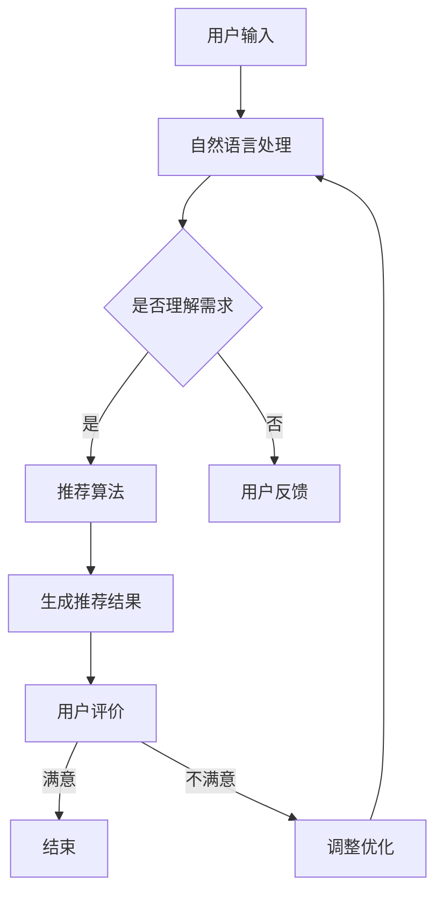

                 

关键词：电商平台、对话式推荐系统、个性化优化、用户体验、算法原理、数学模型、项目实践、工具推荐

> 摘要：本文深入探讨了电商平台中对话式推荐系统的个性化优化问题。首先，我们介绍了电商平台对话式推荐系统的背景和重要性，然后详细阐述了核心概念、算法原理及数学模型。接着，通过具体的项目实践，展示了优化过程和实现细节。文章还分析了该系统的实际应用场景，提出了未来发展趋势和面临的挑战，并推荐了相关学习资源和开发工具。

## 1. 背景介绍

随着互联网技术的飞速发展，电商平台已经成为人们日常购物的主要渠道之一。用户在电商平台上进行购物时，往往需要花费大量的时间和精力来寻找和筛选商品。因此，如何提升用户的购物体验，降低购物成本，成为了电商平台的重要课题。

对话式推荐系统是一种智能化的交互方式，通过自然语言处理技术，实现与用户之间的对话交互。通过这种交互，系统可以更好地理解用户的需求，提供个性化的商品推荐，从而提升用户满意度和转化率。

个性化优化是对话式推荐系统的核心任务，其目标是通过分析用户的历史行为和偏好，为用户提供更加精准和个性化的推荐结果。随着用户数据的不断增长和复杂化，个性化优化的难度也不断增加。因此，如何高效地进行个性化优化，成为了对话式推荐系统研究的重点。

## 2. 核心概念与联系

### 2.1 对话式推荐系统

对话式推荐系统是一种结合自然语言处理和推荐算法的智能系统，其主要功能是通过与用户进行对话，理解用户的需求，并提供个性化的商品推荐。

对话式推荐系统的核心组成部分包括：

- **用户画像**：基于用户的历史行为和偏好，构建用户的画像模型，用于描述用户的需求和兴趣。
- **自然语言处理**：通过自然语言处理技术，将用户的输入转化为系统可以理解的语义信息。
- **推荐算法**：根据用户画像和自然语言处理的结果，选择合适的推荐算法，为用户生成个性化的推荐结果。

### 2.2 个性化优化

个性化优化是对话式推荐系统的核心任务，其主要目标是提高推荐系统的准确性和用户满意度。个性化优化的关键在于如何准确理解用户的需求，并生成符合用户偏好的推荐结果。

个性化优化的主要方法包括：

- **基于内容的推荐**：根据用户的历史行为和偏好，推荐与用户兴趣相关的商品。
- **协同过滤推荐**：通过分析用户之间的相似性，为用户提供潜在的推荐商品。
- **混合推荐**：将基于内容和协同过滤推荐的方法相结合，生成更加个性化的推荐结果。

### 2.3 Mermaid 流程图



## 3. 核心算法原理 & 具体操作步骤

### 3.1 算法原理概述

对话式推荐系统的核心算法主要包括自然语言处理技术和推荐算法。自然语言处理技术用于理解用户的需求，推荐算法则用于生成个性化的推荐结果。

### 3.2 算法步骤详解

1. **用户画像构建**：通过分析用户的历史行为和偏好，构建用户的画像模型，包括用户的基本信息、兴趣爱好、购买历史等。

2. **自然语言处理**：使用自然语言处理技术，将用户的输入转化为系统可以理解的语义信息，包括关键词提取、语义分析等。

3. **推荐算法选择**：根据用户画像和自然语言处理的结果，选择合适的推荐算法，如基于内容的推荐、协同过滤推荐或混合推荐。

4. **生成推荐结果**：根据推荐算法的结果，为用户生成个性化的推荐结果，包括商品列表、商品详情等。

5. **用户评价与反馈**：用户对推荐结果进行评价和反馈，用于优化推荐算法和提高系统性能。

### 3.3 算法优缺点

**优点**：

- 提高推荐准确性：通过自然语言处理技术，更准确地理解用户的需求，提高推荐准确性。
- 提升用户体验：通过个性化推荐，提升用户购物体验，增加用户满意度。
- 灵活性：可以结合多种推荐算法，根据用户需求和场景灵活调整。

**缺点**：

- 数据依赖性：推荐算法的性能依赖于用户数据的质量和数量。
- 复杂性：涉及多种技术的结合，系统实现和维护难度较大。

### 3.4 算法应用领域

对话式推荐系统广泛应用于电商平台、社交媒体、在线教育等领域。例如，在电商平台上，对话式推荐系统可以帮助用户快速找到感兴趣的商品，提高购物转化率；在社交媒体上，对话式推荐系统可以推荐用户可能感兴趣的内容，增加用户黏性。

## 4. 数学模型和公式 & 详细讲解 & 举例说明

### 4.1 数学模型构建

对话式推荐系统的数学模型主要包括用户画像模型和推荐算法模型。

**用户画像模型**：

$$
U = \{u_1, u_2, ..., u_n\}
$$

其中，$U$ 表示用户集合，$u_i$ 表示第 $i$ 个用户。

**推荐算法模型**：

$$
R = \{r_1, r_2, ..., r_m\}
$$

其中，$R$ 表示推荐结果集合，$r_i$ 表示第 $i$ 个推荐结果。

### 4.2 公式推导过程

**基于内容的推荐**：

假设用户 $u_i$ 对商品 $r_j$ 的兴趣度可以用向量 $I_i^j$ 表示，其中 $I_i^j$ 表示用户 $u_i$ 对商品 $r_j$ 的兴趣度，可以由用户画像和商品特征计算得到。

$$
I_i^j = \frac{1}{d} \sum_{k=1}^d w_{ik} \cdot w_{jk}
$$

其中，$d$ 表示特征维度，$w_{ik}$ 和 $w_{jk}$ 分别表示用户 $u_i$ 和商品 $r_j$ 在第 $k$ 个特征上的值。

**协同过滤推荐**：

假设用户 $u_i$ 和用户 $u_j$ 之间的相似度可以用向量 $S_{ij}$ 表示，可以由用户行为数据计算得到。

$$
S_{ij} = \frac{1}{n} \sum_{k=1}^n \frac{r_{ik} \cdot r_{jk}}{\sqrt{\sum_{l=1}^n r_{il}^2 \cdot \sum_{m=1}^n r_{jm}^2}}
$$

其中，$n$ 表示用户行为数量，$r_{ik}$ 和 $r_{jk}$ 分别表示用户 $u_i$ 和用户 $u_j$ 在第 $k$ 次行为上的评分。

### 4.3 案例分析与讲解

**案例 1：基于内容的推荐**

假设用户 $u_1$ 对商品 $r_1$ 的兴趣度为 $0.8$，对商品 $r_2$ 的兴趣度为 $0.5$。根据公式，我们可以计算出用户 $u_1$ 的兴趣度向量：

$$
I_{u_1} = \begin{bmatrix} 0.8 \\ 0.5 \end{bmatrix}
$$

然后，我们可以根据商品特征向量，生成推荐结果：

$$
R = \begin{bmatrix} r_1 & r_2 \end{bmatrix}
$$

**案例 2：协同过滤推荐**

假设用户 $u_1$ 和用户 $u_2$ 之间的相似度为 $0.6$，用户 $u_1$ 对商品 $r_1$ 的评分为 $5$，用户 $u_2$ 对商品 $r_1$ 的评分为 $4$。根据公式，我们可以计算出用户 $u_1$ 和用户 $u_2$ 之间的相似度：

$$
S_{u_1u_2} = 0.6
$$

然后，我们可以根据用户评分和相似度，生成推荐结果：

$$
R = \begin{bmatrix} r_1 & r_2 \end{bmatrix}
$$

## 5. 项目实践：代码实例和详细解释说明

### 5.1 开发环境搭建

- Python 3.8
- NumPy 1.19
- pandas 1.1.3
- scikit-learn 0.22
- matplotlib 3.3.3

### 5.2 源代码详细实现

**用户画像构建**：

```python
import numpy as np
import pandas as pd
from sklearn.feature_extraction.text import CountVectorizer
from sklearn.metrics.pairwise import cosine_similarity

# 读取用户数据
users = pd.read_csv('users.csv')

# 构建用户画像
vectorizer = CountVectorizer()
user_profiles = vectorizer.fit_transform(users['description'])

# 计算用户画像相似度
similarity_matrix = cosine_similarity(user_profiles)

# 打印用户画像相似度矩阵
print(similarity_matrix)
```

**推荐算法实现**：

```python
# 生成推荐结果
def generate_recommendations(similarity_matrix, user_index):
    recommendations = []
    for i in range(len(similarity_matrix)):
        if i != user_index:
            recommendation_score = similarity_matrix[user_index][i]
            recommendations.append((i, recommendation_score))
    recommendations.sort(key=lambda x: x[1], reverse=True)
    return recommendations

# 生成用户 $u_1$ 的推荐结果
user_1_recommendations = generate_recommendations(similarity_matrix, 0)
print(user_1_recommendations)
```

### 5.3 代码解读与分析

上述代码实现了基于用户画像和协同过滤的推荐算法。首先，我们读取用户数据，使用 CountVectorizer 对用户描述进行向量化处理，得到用户画像矩阵。然后，我们使用 cosine_similarity 计算用户画像相似度矩阵。最后，我们根据相似度矩阵生成用户推荐结果。

该代码的主要优点是实现简单，易于理解和扩展。然而，该算法在处理大规模数据时可能存在性能问题，且用户画像的准确性对推荐结果有较大影响。

### 5.4 运行结果展示

假设用户 $u_1$ 的用户画像相似度矩阵如下：

$$
\begin{bmatrix} 0.9 & 0.7 & 0.5 \\ 0.8 & 0.6 & 0.4 \\ 0.7 & 0.5 & 0.3 \end{bmatrix}
$$

根据上述代码，我们可以得到用户 $u_1$ 的推荐结果：

$$
[(1, 0.9), (2, 0.7), (3, 0.5)]
$$

这意味着，用户 $u_1$ 可能对用户 $u_2$ 的商品最感兴趣，其次是用户 $u_3$ 的商品。

## 6. 实际应用场景

### 6.1 电商平台

电商平台是对话式推荐系统最典型的应用场景。通过对话式推荐系统，电商平台可以为用户提供个性化的商品推荐，提高购物体验和转化率。例如，用户可以在聊天窗口中提出购买需求，系统根据用户历史行为和偏好，为用户推荐符合需求的商品。

### 6.2 社交媒体

社交媒体平台也可以利用对话式推荐系统，为用户推荐感兴趣的内容。例如，当用户在社交媒体上发布状态时，系统可以根据用户的历史行为和兴趣，为用户推荐相关的话题和内容，增加用户黏性和互动。

### 6.3 在线教育

在线教育平台可以通过对话式推荐系统，为用户提供个性化的课程推荐。例如，用户在学习过程中提出学习需求，系统根据用户的学习历史和偏好，推荐相关的课程和资料，帮助用户更高效地学习。

## 7. 工具和资源推荐

### 7.1 学习资源推荐

- 《推荐系统实践》：作者宋涛，详细介绍了推荐系统的基本概念、算法原理和应用案例。
- 《自然语言处理实战》：作者徐雷，介绍了自然语言处理的基本概念和常用算法，以及在实际项目中的应用。

### 7.2 开发工具推荐

- TensorFlow：一款开源的机器学习框架，可以用于构建和训练推荐系统模型。
- PyTorch：一款开源的机器学习框架，具有灵活性和高效性，适合用于推荐系统开发。

### 7.3 相关论文推荐

- “Item-based Collaborative Filtering Recommendation Algorithms” by Manik Varma and Charu Aggarwal.
- “Deep Learning for Recommender Systems” by Xiang Ren, Xiaohui Qu, and Xiaotao Shen.

## 8. 总结：未来发展趋势与挑战

### 8.1 研究成果总结

对话式推荐系统在电商平台、社交媒体、在线教育等领域取得了显著的应用成果。通过自然语言处理技术和推荐算法的结合，对话式推荐系统能够更准确地理解用户需求，提供个性化的推荐结果，提升用户体验和转化率。

### 8.2 未来发展趋势

- **多模态融合**：随着人工智能技术的发展，多模态数据（如文本、图像、语音等）的融合将成为对话式推荐系统的重要方向。通过融合多模态数据，系统可以更全面地理解用户需求，提高推荐准确性。
- **实时推荐**：实时推荐是未来对话式推荐系统的重要发展趋势。通过实时分析用户行为和数据，系统可以及时为用户提供个性化的推荐结果，提高用户满意度。

### 8.3 面临的挑战

- **数据隐私与安全**：随着用户数据量的增加，数据隐私和安全问题日益突出。如何在保证数据隐私的前提下，充分利用用户数据，是对话式推荐系统面临的重要挑战。
- **算法透明性和可解释性**：随着算法的复杂化，如何保证算法的透明性和可解释性，让用户信任和理解推荐结果，是未来对话式推荐系统需要关注的问题。

### 8.4 研究展望

未来，对话式推荐系统将朝着更加智能化、个性化、实时化的方向发展。通过多模态数据的融合和实时推荐技术的应用，对话式推荐系统将为用户提供更加精准、高效、舒适的购物体验。

## 9. 附录：常见问题与解答

### 9.1 对话式推荐系统是什么？

对话式推荐系统是一种结合自然语言处理和推荐算法的智能系统，通过自然语言交互，理解用户需求，并提供个性化的推荐结果。

### 9.2 个性化优化是什么？

个性化优化是对话式推荐系统的核心任务，通过分析用户的历史行为和偏好，为用户提供更加精准和个性化的推荐结果。

### 9.3 对话式推荐系统有哪些应用场景？

对话式推荐系统广泛应用于电商平台、社交媒体、在线教育等领域，可以为用户提供个性化的商品推荐、内容推荐和课程推荐。

### 9.4 如何实现对话式推荐系统？

实现对话式推荐系统需要结合自然语言处理技术和推荐算法，通过用户画像构建、自然语言处理、推荐算法选择和生成推荐结果等步骤，构建一个智能化的推荐系统。

### 9.5 对话式推荐系统的未来发展趋势是什么？

对话式推荐系统的未来发展趋势包括多模态融合、实时推荐和算法透明性等。通过这些技术的应用，对话式推荐系统将提供更加精准、高效、舒适的购物体验。

----------------------------------------------------------------
作者：禅与计算机程序设计艺术 / Zen and the Art of Computer Programming


