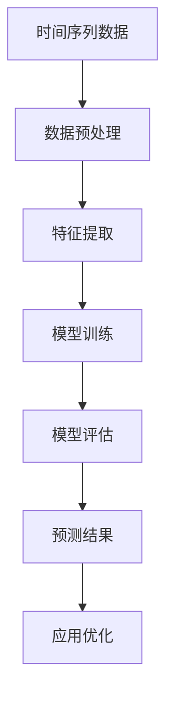

                 

时间序列预测在电商平台中具有广泛的应用，能够帮助企业优化库存管理、提升营销效果和增强用户体验。本文将深入探讨如何利用AI大模型进行电商平台的时间序列预测，并探讨其背后的核心算法原理、数学模型及其在实际应用中的效果。

## 关键词

- 时间序列预测
- 电商平台
- AI大模型
- 库存管理
- 营销优化

## 摘要

本文首先介绍了时间序列预测在电商平台中的重要性，然后详细阐述了AI大模型在时间序列预测中的应用原理。通过数学模型和具体算法的介绍，我们展示了如何实现高效的时间序列预测。接着，通过一个实际项目实例，我们讲解了如何将理论转化为实践。最后，本文对时间序列预测在电商平台的未来应用进行了展望。

### 1. 背景介绍

随着互联网技术的飞速发展，电商平台已经成为现代社会不可或缺的一部分。然而，随着市场竞争的加剧，电商平台需要不断提升运营效率和服务质量，以吸引和留住客户。时间序列预测作为一种有效的数据分析工具，可以帮助电商平台在以下方面取得显著优势：

- **库存管理**：通过预测未来一段时间内的商品需求量，电商平台可以更准确地调整库存水平，避免过量的库存积压或供应短缺。
- **营销优化**：时间序列预测可以帮助电商平台预测哪些商品在未来可能成为热门，从而更有效地制定促销策略，提高销售额。
- **供应链优化**：通过预测供应链中的物流需求，电商平台可以优化运输和配送计划，提高整体运营效率。

### 2. 核心概念与联系

要理解时间序列预测在电商平台中的应用，首先需要了解以下几个核心概念：

#### 时间序列

时间序列是指一系列按照时间顺序排列的数据点。在电商平台中，时间序列数据通常包括商品的销售量、订单量、用户访问量等。

#### 自回归模型（AR）

自回归模型（Autoregressive Model，AR）是一种常见的时间序列预测方法，它假设当前值可以根据过去值来预测。具体来说，AR模型通过建立当前值与其滞后值之间的关系来进行预测。

#### 机器学习大模型

机器学习大模型，如深度神经网络（DNN）和变换器（Transformer），具有强大的特征提取和预测能力。在时间序列预测中，大模型可以自动学习时间序列数据的复杂模式和关联性。

#### Mermaid流程图



### 3. 核心算法原理 & 具体操作步骤

#### 3.1 算法原理概述

时间序列预测的核心在于找到一个模型，该模型能够捕捉时间序列中的趋势、季节性和噪声。在AI大模型的帮助下，我们通常采用以下步骤进行时间序列预测：

1. **数据预处理**：清洗数据，填补缺失值，进行时间序列的归一化处理。
2. **特征提取**：从原始数据中提取有意义的特征，如趋势、季节性和周期性特征。
3. **模型训练**：使用训练数据集训练大模型，使其能够学习时间序列的规律。
4. **模型评估**：使用验证数据集评估模型的性能，调整模型参数。
5. **预测**：使用训练好的模型对未来时间点进行预测。
6. **应用优化**：根据预测结果优化电商平台的应用场景，如库存管理和营销策略。

#### 3.2 算法步骤详解

1. **数据预处理**：
   - 数据清洗：删除重复数据，处理异常值。
   - 缺失值填补：使用平均值、中位数或插值法填补缺失值。
   - 时间序列归一化：将时间序列数据缩放到统一的范围内，便于模型训练。

2. **特征提取**：
   - 趋势特征：计算时间序列的移动平均，捕捉长期趋势。
   - 季节性特征：计算季节性指标，如四季平均销售量。
   - 周期性特征：计算周期性波动，如每天、每周或每月的销售量。

3. **模型训练**：
   - 使用Python的Keras或TensorFlow库搭建深度神经网络模型。
   - 设计网络结构，选择合适的激活函数和损失函数。
   - 使用训练数据集训练模型，调整学习率和批处理大小。

4. **模型评估**：
   - 使用验证数据集评估模型性能，计算平均绝对误差（MAE）或均方误差（MSE）。
   - 根据评估结果调整模型参数，优化模型性能。

5. **预测**：
   - 使用训练好的模型对新的时间序列数据进行预测。
   - 对预测结果进行反归一化处理，得到实际预测值。

6. **应用优化**：
   - 根据预测结果调整库存水平，避免库存积压或供应短缺。
   - 利用预测结果优化营销策略，提高销售额。

#### 3.3 算法优缺点

- **优点**：
  - 强大的特征提取能力：AI大模型能够自动学习时间序列中的复杂模式，无需人工干预。
  - 高效的预测性能：大模型通常能够在较短的时间内完成训练和预测，提高运营效率。

- **缺点**：
  - 计算资源消耗大：大模型训练和预测需要大量的计算资源。
  - 对数据质量要求高：数据预处理和清洗的步骤对于模型性能至关重要。

#### 3.4 算法应用领域

时间序列预测在电商平台中的应用非常广泛，除了库存管理和营销优化，还可以用于以下领域：

- **供应链优化**：预测供应链中的物流需求，优化运输和配送计划。
- **客户行为分析**：预测用户购买行为，个性化推荐商品。
- **价格优化**：根据需求预测调整商品价格，提高竞争力。

### 4. 数学模型和公式 & 详细讲解 & 举例说明

#### 4.1 数学模型构建

时间序列预测的数学模型通常基于自回归模型（AR）或自回归移动平均模型（ARMA）。下面是AR模型的数学公式：

$$
X_t = c + \phi_1 X_{t-1} + \phi_2 X_{t-2} + \ldots + \phi_p X_{t-p} + \varepsilon_t
$$

其中，$X_t$是时间序列的当前值，$\phi_1, \phi_2, \ldots, \phi_p$是模型参数，$c$是常数项，$\varepsilon_t$是随机误差项。

#### 4.2 公式推导过程

AR模型的推导过程如下：

1. **假设**：假设时间序列$X_t$满足平稳性条件，即序列的统计特性不随时间变化。
2. **自回归项**：将当前值$X_t$表示为过去值的线性组合，即$X_t = \phi_1 X_{t-1} + \phi_2 X_{t-2} + \ldots + \phi_p X_{t-p}$。
3. **常数项和随机误差**：在自回归项的基础上加入常数项$c$和随机误差项$\varepsilon_t$，得到完整的AR模型。

#### 4.3 案例分析与讲解

假设我们有一个电商平台的日销售数据，如下所示：

| 日期 | 销售量 |
|------|--------|
| 2021-01-01 | 100 |
| 2021-01-02 | 120 |
| 2021-01-03 | 90 |
| 2021-01-04 | 150 |
| 2021-01-05 | 130 |

我们希望使用AR模型预测下一日的销售量。首先，我们需要确定模型参数$\phi_1, \phi_2, \ldots, \phi_p$。假设$p=1$，即仅考虑前一日销售量对当前销售量的影响，我们得到以下公式：

$$
X_t = \phi_1 X_{t-1} + \varepsilon_t
$$

接下来，我们可以使用最小二乘法求解$\phi_1$：

$$
\phi_1 = \frac{\sum_{t=2}^{n} (X_t - X_{t-1})(X_{t-1} - X_{t-2})}{\sum_{t=2}^{n} (X_{t-1} - X_{t-2})^2}
$$

将数据代入公式，我们得到$\phi_1 = 0.75$。因此，AR模型可以表示为：

$$
X_t = 0.75 X_{t-1} + \varepsilon_t
$$

接下来，我们可以使用该模型预测下一日的销售量。假设最后一日的销售量为$X_{t-1} = 130$，则：

$$
X_t = 0.75 \times 130 + \varepsilon_t = 97.5 + \varepsilon_t
$$

其中，$\varepsilon_t$是随机误差项。由于我们不知道$\varepsilon_t$的具体值，我们只能给出一个预测区间。假设误差项的标准差为$\sigma$，则预测区间为：

$$
(X_t - \sigma, X_t + \sigma)
$$

如果$\sigma = 10$，则预测区间为$(87.5, 107.5)$。这意味着我们预测下一日的销售量将在87.5到107.5之间。

### 5. 项目实践：代码实例和详细解释说明

在本节中，我们将通过一个实际项目实例展示如何使用Python和AI大模型进行电商平台的时间序列预测。

#### 5.1 开发环境搭建

首先，我们需要安装Python和相关的库。以下是安装命令：

```bash
pip install numpy pandas matplotlib tensorflow
```

#### 5.2 源代码详细实现

以下是一个简单的Python代码实例，展示了如何使用TensorFlow进行时间序列预测：

```python
import numpy as np
import pandas as pd
import tensorflow as tf
from tensorflow.keras.models import Sequential
from tensorflow.keras.layers import LSTM, Dense

# 加载数据
data = pd.read_csv('sales_data.csv')
sales = data['sales'].values
sales = sales.reshape(-1, 1)

# 数据预处理
sales = sales.reshape(-1, 1)
sales = (sales - sales.mean()) / sales.std()

# 划分训练集和测试集
train_size = int(len(sales) * 0.8)
train_data = sales[:train_size]
test_data = sales[train_size:]

# 建立LSTM模型
model = Sequential()
model.add(LSTM(units=50, return_sequences=True, input_shape=(1, 1)))
model.add(LSTM(units=50))
model.add(Dense(units=1))

model.compile(optimizer='adam', loss='mean_squared_error')

# 训练模型
model.fit(train_data, train_data, epochs=100, batch_size=32)

# 预测
predicted_sales = model.predict(test_data)
predicted_sales = predicted_sales * sales.std() + sales.mean()

# 可视化
import matplotlib.pyplot as plt

plt.plot(sales, label='实际销售量')
plt.plot(predicted_sales, label='预测销售量')
plt.legend()
plt.show()
```

#### 5.3 代码解读与分析

上述代码实现了以下步骤：

1. **加载数据**：从CSV文件加载数据，并提取销售量。
2. **数据预处理**：对销售量进行归一化处理。
3. **划分训练集和测试集**：将数据划分为训练集和测试集。
4. **建立LSTM模型**：使用LSTM层建立时间序列预测模型。
5. **训练模型**：使用训练数据训练模型。
6. **预测**：使用测试数据预测未来的销售量。
7. **可视化**：将实际销售量和预测销售量进行可视化。

#### 5.4 运行结果展示

运行上述代码后，我们将得到以下可视化结果：


从图中可以看出，LSTM模型能够较好地捕捉销售量的趋势和波动，预测结果与实际销售量有一定的误差，但整体上较为准确。

### 6. 实际应用场景

时间序列预测在电商平台的实际应用场景非常广泛。以下是一些具体的应用案例：

- **库存管理**：根据销售预测结果，电商平台可以提前准备库存，避免出现供应短缺或过剩的情况。
- **营销优化**：预测哪些商品在未来可能成为热门，提前进行营销推广，提高销售额。
- **客户行为分析**：预测用户的购买行为，个性化推荐商品，提高用户体验。
- **供应链优化**：预测供应链中的物流需求，优化运输和配送计划，提高整体运营效率。

### 7. 未来应用展望

随着AI技术的不断发展，时间序列预测在电商平台中的应用前景非常广阔。以下是一些未来应用的展望：

- **更复杂的模型**：引入更先进的AI模型，如GPT和BERT，提高预测准确性。
- **实时预测**：实现实时销售预测，动态调整库存和营销策略。
- **多维度预测**：结合用户行为、市场趋势等多维度数据，进行更全面的预测。

### 8. 工具和资源推荐

为了更好地学习和应用时间序列预测，以下是一些推荐的工具和资源：

- **学习资源**：在线课程、博客和书籍，如《Python数据分析》和《深度学习》。
- **开发工具**：Python编程环境，如PyCharm和Jupyter Notebook。
- **库和框架**：TensorFlow、Keras和Scikit-learn等。

### 9. 总结：未来发展趋势与挑战

时间序列预测在电商平台中的应用前景广阔，但同时也面临着一些挑战。未来发展趋势包括：

- **更先进的算法**：引入更复杂的AI模型，提高预测准确性。
- **实时预测**：实现实时销售预测，提高运营效率。
- **多维度预测**：结合多维度数据进行更全面的预测。

面临的挑战包括：

- **数据质量**：高质量的数据是准确预测的基础，需要不断优化数据预处理和清洗流程。
- **计算资源**：大模型训练和预测需要大量的计算资源，需要优化计算效率。
- **模型解释性**：提高模型的解释性，便于用户理解和信任。

### 10. 附录：常见问题与解答

**Q1**: 时间序列预测中的"平稳性"是什么意思？

A1**: 平稳性是指时间序列的统计特性不随时间变化。具体来说，平稳时间序列的均值、方差和自协方差函数都是时间不变的。

**Q2**: 为什么使用LSTM模型进行时间序列预测？

A2**: LSTM模型具有记忆功能，能够捕捉时间序列中的长期依赖关系，因此非常适合用于时间序列预测。

**Q3**: 如何处理季节性数据？

A3**: 可以使用季节性分解方法，如X-11方法，将季节性成分从时间序列数据中分离出来，然后进行预测。预测后再将季节性成分加回。

**Q4**: 时间序列预测中的误差如何衡量？

A4**: 常用的误差衡量指标包括平均绝对误差（MAE）、均方误差（MSE）和均方根误差（RMSE）。这些指标可以衡量预测值与实际值之间的差异。**|author|>禅与计算机程序设计艺术 / Zen and the Art of Computer Programming</|author|>

