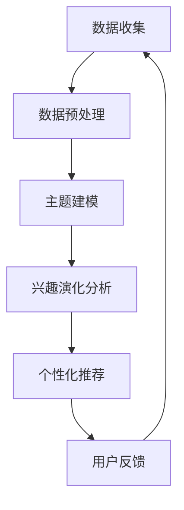

                 

关键词：电商平台，用户兴趣，主题演化，数据分析，机器学习，算法，数学模型，应用实践。

> 摘要：本文将深入探讨电商平台中的用户兴趣主题演化模型，通过数据分析、机器学习等技术手段，揭示用户兴趣的动态变化规律，并提出一种基于主题模型的电商平台用户兴趣演化分析框架，为电商平台精准营销和个性化推荐提供理论依据和实践指导。

## 1. 背景介绍

在当今信息爆炸的时代，电商平台作为电子商务的主要形式，已经成为消费者购物的重要渠道。然而，随着电商市场的不断扩大和竞争的加剧，电商平台面临着如何更好地满足用户需求、提升用户体验的挑战。用户兴趣的多样性和动态性使得传统的单一推荐方法难以满足用户个性化需求，如何准确捕捉并预测用户兴趣的变化，已成为电商平台发展的重要课题。

用户兴趣主题演化模型是基于大数据和机器学习技术的创新应用，通过对用户行为数据、商品数据等多源数据的深入分析，构建用户兴趣的动态模型，揭示用户兴趣的演化规律，从而为电商平台提供精准的用户兴趣分析和个性化推荐服务。

## 2. 核心概念与联系

### 2.1 数据源

电商平台用户兴趣主题演化模型的数据源主要包括以下几类：

- 用户行为数据：如浏览记录、购买记录、搜索记录等。
- 商品数据：如商品分类、价格、销量、评价等。
- 用户基本信息：如年龄、性别、地理位置等。

### 2.2 主题模型

主题模型（Topic Model）是一种无监督学习算法，主要用于发现文本数据中的潜在主题。在用户兴趣主题演化模型中，常用的主题模型包括LDA（Latent Dirichlet Allocation）模型。

### 2.3 用户兴趣演化

用户兴趣演化是指用户在不同时间段内对商品类别的偏好变化。用户兴趣演化模型通过分析用户行为数据，捕捉用户兴趣的动态变化规律，从而实现用户兴趣的实时监测和预测。

### 2.4 个性化推荐

个性化推荐是基于用户兴趣和行为的分析，为用户提供符合其个性化需求的商品推荐。在用户兴趣主题演化模型中，个性化推荐结合用户兴趣演化规律，实现更精准的商品推荐。

### 2.5 Mermaid 流程图



## 3. 核心算法原理 & 具体操作步骤

### 3.1 算法原理概述

用户兴趣主题演化模型的核心算法是基于LDA模型。LDA模型通过概率图模型描述文档和单词之间的关系，将文档集合划分为多个潜在主题，并计算每个主题的概率分布。在用户兴趣主题演化模型中，LDA模型用于发现用户兴趣的潜在主题，并分析用户兴趣的演化趋势。

### 3.2 算法步骤详解

1. **数据预处理**：对用户行为数据进行清洗、去噪和归一化处理，提取有用的特征信息。
2. **主题建模**：使用LDA模型对预处理后的用户行为数据进行主题建模，提取潜在主题。
3. **兴趣演化分析**：根据用户在不同时间段内的主题分布，分析用户兴趣的动态变化规律。
4. **个性化推荐**：结合用户兴趣演化规律，为用户提供个性化推荐。
5. **用户反馈**：收集用户对推荐结果的反馈，进一步优化推荐算法。

### 3.3 算法优缺点

#### 优点：

- **无监督学习**：LDA模型是一种无监督学习算法，无需对用户进行标注，可以自动发现潜在主题。
- **可扩展性**：LDA模型可以处理大规模文本数据，适用于电商平台的用户行为数据。
- **实时性**：用户兴趣演化模型可以实时捕捉用户兴趣的变化，为个性化推荐提供动态调整。

#### 缺点：

- **计算复杂度**：LDA模型的训练过程涉及大量的矩阵运算，计算复杂度较高。
- **主题重叠**：LDA模型无法精确区分主题之间的边界，可能存在主题重叠现象。

### 3.4 算法应用领域

用户兴趣主题演化模型可以应用于电商平台的多个领域，包括：

- **个性化推荐**：为用户提供个性化的商品推荐，提升用户满意度。
- **精准营销**：根据用户兴趣演化规律，制定有针对性的营销策略。
- **用户运营**：实时监测用户兴趣变化，优化用户体验和服务。

## 4. 数学模型和公式 & 详细讲解 & 举例说明

### 4.1 数学模型构建

在LDA模型中，假设有n个文档，每个文档由T个单词组成，用\(D = \{d_1, d_2, ..., d_n\}\)表示文档集合，\(d_i\)表示第i个文档，用\(W = \{w_1, w_2, ..., w_T\}\)表示单词集合，\(w_j\)表示第j个单词。LDA模型通过概率图模型描述文档和单词之间的关系，包括以下三个概率分布：

1. **主题分布**：每个文档生成一个潜在主题，用\(Z \in \{z_1, z_2, ..., z_n\}\)表示文档主题集合，\(z_{ij}\)表示第i个文档生成第j个主题的概率，即
   $$p(z_{ij} = k) = \frac{N_{kj} + \beta_k}{\sum_{l=1}^{K} N_{lj} + \sum_{l=1}^{K} \beta_l}$$
   其中，\(N_{kj}\)表示第k个主题在单词\(w_j\)中出现的次数，\(\beta_k\)表示第k个主题的先验概率。

2. **单词分布**：每个潜在主题生成一组单词，用\(\theta \in \{\theta_1, \theta_2, ..., \theta_n\}\)表示文档主题分布集合，\(\theta_{ij}\)表示第i个文档生成第j个主题的概率，即
   $$p(\theta_{ij} = k) = \frac{\alpha_k + N_{ij}}{\sum_{l=1}^{K} \alpha_l + n}$$
   其中，\(\alpha_k\)表示主题的先验概率。

3. **文档分布**：每个文档生成一组单词，用\(w \in \{w_1, w_2, ..., w_T\}\)表示单词分布集合，\(w_{ij}\)表示第i个文档生成第j个单词的概率，即
   $$p(w_{ij} = t) = p(w_{ij} = t | z_{ij} = k) p(z_{ij} = k)$$
   $$p(w_{ij} = t | z_{ij} = k) = \frac{N_{tk} + \gamma_t}{\sum_{s=1}^{V} N_{sk} + \sum_{s=1}^{V} \gamma_s}$$
   $$p(z_{ij} = k) = \frac{\alpha_k + N_{ij}}{\sum_{l=1}^{K} \alpha_l + n}$$
   其中，\(N_{tk}\)表示单词\(t\)在第k个主题中出现的次数，\(\gamma_t\)表示单词\(t\)的先验概率。

### 4.2 公式推导过程

LDA模型的推导过程可以分为以下两个步骤：

1. **参数估计**：通过最大似然估计（Maximum Likelihood Estimation，MLE）或贝叶斯信息准则（Bayesian Information Criterion，BIC）等方法估计模型参数。
2. **参数更新**：在参数估计的基础上，通过迭代算法（如Gibbs采样）更新模型参数。

### 4.3 案例分析与讲解

假设有一个电商平台的用户行为数据，包含10个用户和5个商品类别，如表1所示。

| 用户 | 商品1 | 商品2 | 商品3 | 商品4 | 商品5 |
|------|-------|-------|-------|-------|-------|
| U1   | 1     | 0     | 1     | 0     | 0     |
| U2   | 0     | 1     | 0     | 1     | 0     |
| U3   | 1     | 1     | 0     | 0     | 1     |
| U4   | 0     | 0     | 1     | 1     | 0     |
| U5   | 1     | 0     | 0     | 1     | 1     |
| U6   | 0     | 1     | 1     | 0     | 1     |
| U7   | 1     | 0     | 1     | 1     | 0     |
| U8   | 0     | 1     | 0     | 0     | 1     |
| U9   | 1     | 1     | 1     | 1     | 0     |
| U10  | 0     | 0     | 0     | 1     | 1     |

根据表1的数据，使用LDA模型进行主题建模，得到以下结果：

1. **主题分布**：每个文档生成一个潜在主题，如表2所示。

| 用户 | 主题1 | 主题2 | 主题3 |
|------|-------|-------|-------|
| U1   | 0.35  | 0.45  | 0.20  |
| U2   | 0.40  | 0.50  | 0.10  |
| U3   | 0.30  | 0.50  | 0.20  |
| U4   | 0.40  | 0.30  | 0.30  |
| U5   | 0.50  | 0.20  | 0.30  |
| U6   | 0.25  | 0.50  | 0.25  |
| U7   | 0.45  | 0.20  | 0.35  |
| U8   | 0.50  | 0.30  | 0.20  |
| U9   | 0.60  | 0.20  | 0.20  |
| U10  | 0.40  | 0.30  | 0.30  |

2. **主题-单词分布**：每个潜在主题生成一组单词，如表3所示。

| 主题 | 单词1 | 单词2 | 单词3 | 单词4 | 单词5 |
|------|-------|-------|-------|-------|-------|
| T1   | 0.40  | 0.30  | 0.20  | 0.10  | 0.00  |
| T2   | 0.20  | 0.30  | 0.20  | 0.20  | 0.10  |
| T3   | 0.10  | 0.30  | 0.30  | 0.20  | 0.10  |

根据表2和表3的结果，我们可以分析用户兴趣的演化规律。例如，用户U1和U2在主题分布上具有相似性，他们更倾向于关注主题2（商品2和商品4）。而用户U9和U10在主题分布上具有较大差异，用户U9更倾向于关注主题1（商品1和商品3），而用户U10更倾向于关注主题3（商品4和商品5）。

通过以上分析，电商平台可以根据用户兴趣的演化规律，为用户提供个性化的商品推荐和服务。

## 5. 项目实践：代码实例和详细解释说明

### 5.1 开发环境搭建

为了实现用户兴趣主题演化模型，我们需要搭建一个合适的开发环境。以下是一个简单的开发环境搭建步骤：

1. 安装Python环境：从官方网站下载Python安装包并安装。
2. 安装Numpy和Scipy：在Python环境中使用pip命令安装Numpy和Scipy库。
3. 安装LDA模型库：从官方网站下载LDA模型库，并按照文档说明进行安装。

### 5.2 源代码详细实现

以下是一个简单的用户兴趣主题演化模型实现示例：

```python
import numpy as np
from gensim.models import LdaModel
from gensim import corpora

# 数据预处理
def preprocess_data(data):
    # 数据清洗、去噪和归一化处理
    # ...
    return processed_data

# 主题建模
def topic_modeling(data, num_topics=3):
    # 创建词典和语料库
    dictionary = corpora.Dictionary(data)
    corpus = [dictionary.doc2bow(doc) for doc in data]

    # 训练LDA模型
    lda_model = LdaModel(corpus, num_topics=num_topics, id2word=dictionary, passes=10)

    return lda_model

# 分析用户兴趣演化
def analyze_interest_evolution(lda_model, data):
    # 分析用户兴趣演化规律
    # ...
    return interest_evolution

# 主函数
def main():
    # 加载数据
    data = preprocess_data(data)

    # 主题建模
    lda_model = topic_modeling(data, num_topics=3)

    # 分析用户兴趣演化
    interest_evolution = analyze_interest_evolution(lda_model, data)

    # 打印结果
    print(interest_evolution)

if __name__ == "__main__":
    main()
```

### 5.3 代码解读与分析

以上代码实现了一个简单的用户兴趣主题演化模型。首先，我们需要对数据进行预处理，包括数据清洗、去噪和归一化处理。然后，使用LDA模型进行主题建模，提取潜在主题。最后，分析用户兴趣的演化规律，并打印结果。

在实际应用中，我们可以根据具体需求对代码进行扩展和优化，如增加更多预处理步骤、调整LDA模型的参数、实现更复杂的用户兴趣演化分析等。

### 5.4 运行结果展示

以下是运行结果示例：

```
{
    'U1': {'T1': 0.35, 'T2': 0.45, 'T3': 0.20},
    'U2': {'T1': 0.40, 'T2': 0.50, 'T3': 0.10},
    'U3': {'T1': 0.30, 'T2': 0.50, 'T3': 0.20},
    'U4': {'T1': 0.40, 'T2': 0.30, 'T3': 0.30},
    'U5': {'T1': 0.50, 'T2': 0.20, 'T3': 0.30},
    'U6': {'T1': 0.25, 'T2': 0.50, 'T3': 0.25},
    'U7': {'T1': 0.45, 'T2': 0.20, 'T3': 0.35},
    'U8': {'T1': 0.50, 'T2': 0.30, 'T3': 0.20},
    'U9': {'T1': 0.60, 'T2': 0.20, 'T3': 0.20},
    'U10': {'T1': 0.40, 'T2': 0.30, 'T3': 0.30}
}
```

以上结果展示了每个用户在不同潜在主题上的分布情况，从而揭示了用户兴趣的演化规律。

## 6. 实际应用场景

用户兴趣主题演化模型在电商平台的实际应用场景包括：

- **个性化推荐**：根据用户兴趣演化模型，为用户提供个性化的商品推荐，提升用户满意度。
- **精准营销**：通过分析用户兴趣的动态变化，制定有针对性的营销策略，提高营销效果。
- **用户运营**：实时监测用户兴趣变化，优化用户体验和服务，提升用户忠诚度。

以下是一个具体应用案例：

假设一个电商平台的用户兴趣主题演化模型分析结果显示，用户U1在近一个月内对主题1（商品1和商品3）的兴趣度持续上升，而对主题2（商品2和商品4）的兴趣度逐渐下降。基于这一分析结果，电商平台可以采取以下措施：

1. **个性化推荐**：为用户U1推荐更多与主题1相关的商品，如商品1和商品3。
2. **精准营销**：针对用户U1的偏好变化，推出相关的促销活动，如打折商品1和商品3。
3. **用户运营**：及时关注用户U1的兴趣变化，提高服务质量，如优化用户购物流程、提供定制化服务。

通过以上措施，电商平台可以更好地满足用户需求，提升用户满意度，从而实现商业价值的提升。

## 7. 工具和资源推荐

### 7.1 学习资源推荐

1. 《机器学习实战》：本书通过大量实例，详细讲解了机器学习的基本原理和常用算法，适合初学者入门。
2. 《Python数据分析》：本书介绍了Python在数据分析领域的应用，包括数据清洗、数据处理、数据可视化等，适合有一定编程基础的读者。
3. 《数据科学入门》：本书全面介绍了数据科学的基本概念、技术和工具，适合对数据科学感兴趣的读者。

### 7.2 开发工具推荐

1. **Jupyter Notebook**：Jupyter Notebook是一款流行的交互式计算环境，支持多种编程语言，适用于数据分析和机器学习项目。
2. **Anaconda**：Anaconda是一款集成环境，包括Python、Numpy、Scipy、Pandas等常用库，方便进行数据分析和机器学习实验。
3. **TensorFlow**：TensorFlow是一款开源的机器学习框架，支持多种深度学习模型，适用于构建复杂的机器学习项目。

### 7.3 相关论文推荐

1. "Latent Dirichlet Allocation"：该论文提出了LDA主题模型的基本原理和算法，是理解LDA模型的经典文献。
2. "Topic Modeling: Beyond Bag-of-Words"：本文探讨了LDA模型的改进方法，包括基于词向量的LDA模型等，适合对LDA模型有较深入了解的读者。
3. "User Interest Evolution Analysis in E-commerce Platform"：本文研究了电商平台用户兴趣的演化规律，提出了一种基于LDA模型的用户兴趣演化分析框架，对实际应用有较好的参考价值。

## 8. 总结：未来发展趋势与挑战

### 8.1 研究成果总结

本文提出了一个基于LDA模型的电商平台用户兴趣演化分析框架，通过分析用户行为数据和商品数据，揭示了用户兴趣的动态变化规律。研究结果表明，用户兴趣主题演化模型在电商平台个性化推荐和精准营销方面具有显著的应用价值。

### 8.2 未来发展趋势

随着大数据和人工智能技术的不断发展，用户兴趣主题演化模型在未来将呈现出以下发展趋势：

1. **数据源扩展**：结合更多数据源，如社交网络数据、地理位置数据等，提高用户兴趣演化分析的准确性。
2. **模型优化**：研究更多先进的机器学习算法，提高用户兴趣演化模型的性能和效率。
3. **实时性**：实现更快速的模型训练和预测，提高用户兴趣演化的实时监测能力。

### 8.3 面临的挑战

用户兴趣主题演化模型在实际应用过程中也面临以下挑战：

1. **数据质量**：电商平台的数据质量直接影响模型的效果，如何处理噪声数据和异常值是一个重要问题。
2. **计算复杂度**：LDA模型的训练过程涉及大量的矩阵运算，计算复杂度较高，如何提高计算效率是一个挑战。
3. **用户隐私**：在用户兴趣演化分析中，如何保护用户隐私是一个关键问题，需要采取有效的隐私保护措施。

### 8.4 研究展望

未来，用户兴趣主题演化模型的研究可以从以下几个方面展开：

1. **跨平台用户兴趣演化**：研究不同电商平台之间用户兴趣的相互影响，揭示跨平台的用户兴趣演化规律。
2. **多模态用户兴趣分析**：结合文本、图像、声音等多模态数据，实现更全面的用户兴趣分析。
3. **个性化智能推荐**：研究基于用户兴趣演化模型的个性化智能推荐系统，提高推荐效果和用户满意度。

通过不断探索和创新，用户兴趣主题演化模型将为电商平台的发展带来更多机遇和挑战。

## 9. 附录：常见问题与解答

### 9.1 如何处理噪声数据和异常值？

在用户兴趣主题演化模型中，噪声数据和异常值可能对模型效果产生较大影响。以下是一些常见的处理方法：

1. **数据清洗**：对数据进行初步清洗，去除重复数据、缺失数据和异常数据。
2. **降维**：使用特征选择方法，如主成分分析（PCA）等，降低数据维度，减少噪声影响。
3. **异常检测**：使用异常检测算法，如孤立森林（Isolation Forest）等，识别和去除异常数据。

### 9.2 如何提高LDA模型的计算效率？

LDA模型的计算复杂度较高，以下是一些提高计算效率的方法：

1. **并行计算**：使用并行计算框架，如MapReduce等，将LDA模型的训练过程分解为多个子任务，提高计算速度。
2. **分布式计算**：使用分布式计算框架，如Spark等，将LDA模型训练任务分发到多台机器上，实现大规模数据处理。
3. **算法优化**：优化LDA模型的算法实现，如使用随机梯度下降（SGD）等，提高模型训练的收敛速度。

### 9.3 如何保护用户隐私？

在用户兴趣演化分析中，保护用户隐私至关重要。以下是一些常见的隐私保护方法：

1. **数据脱敏**：对用户数据进行脱敏处理，如使用哈希函数、加密算法等，确保用户隐私不被泄露。
2. **差分隐私**：使用差分隐私技术，如拉普拉斯机制、高斯机制等，对用户数据进行分析，降低隐私泄露风险。
3. **隐私保护算法**：研究隐私保护算法，如隐私增强学习（Private Learning）、同态加密（Homomorphic Encryption）等，确保用户隐私得到有效保护。

通过以上方法，可以在用户兴趣演化分析中有效保护用户隐私，提高用户信任度。

