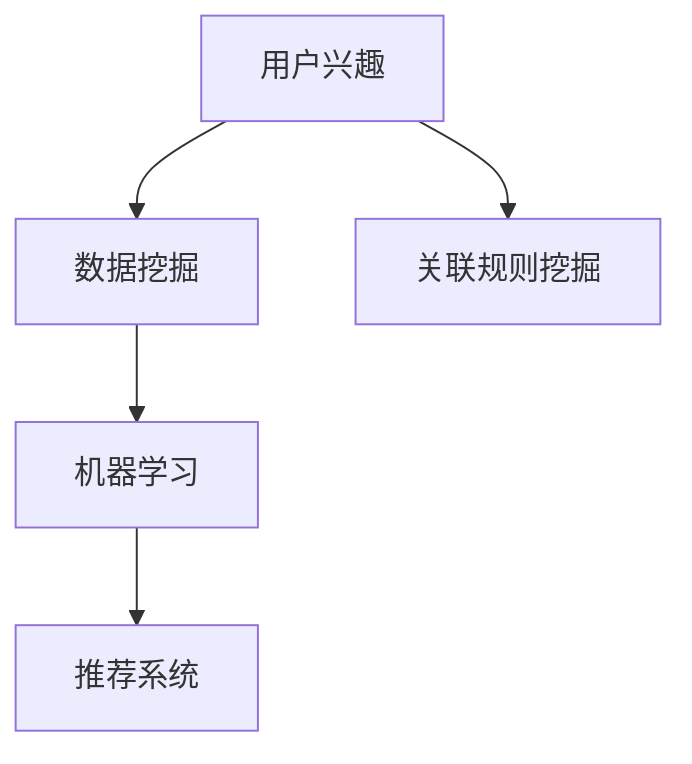

                 

关键词：电商平台，用户兴趣，推荐系统，数据挖掘，机器学习

> 摘要：随着互联网的快速发展，电商平台已经成为消费者日常生活中不可或缺的一部分。用户在电商平台上的每一次浏览、搜索和购买行为都蕴含着丰富的信息。本文旨在探讨如何利用数据挖掘和机器学习技术来构建用户兴趣探索模型，从而提升电商平台的用户体验和销售额。文章将从背景介绍、核心概念与联系、核心算法原理与操作步骤、数学模型与公式、项目实践、实际应用场景、工具和资源推荐、未来发展趋势与挑战等方面进行详细阐述。

## 1. 背景介绍

电商平台作为一种新兴的商业模式，已经逐渐成为现代零售业的重要一环。在过去的几十年中，电商平台的发展经历了从单纯的商品展示和交易平台，到如今集成了搜索、推荐、社交等功能的全能型平台。随着用户数量的不断增加和市场竞争的加剧，如何提升用户体验和销售额成为了电商平台关注的焦点。

用户在电商平台上的行为数据（如浏览记录、搜索关键词、购买历史等）是一种宝贵的资源。通过对这些数据的深入挖掘，可以了解用户的兴趣偏好，进而为用户提供个性化的推荐服务。推荐系统作为电商平台的核心功能之一，已经成为提升用户体验和销售额的重要手段。

本文将围绕电商平台中的用户兴趣探索模型展开讨论，旨在为电商平台提供一种有效的技术手段来挖掘用户的兴趣，从而实现个性化推荐，提高用户满意度和平台销售额。

## 2. 核心概念与联系

在构建用户兴趣探索模型之前，我们需要明确一些核心概念，并了解它们之间的联系。

### 2.1 用户兴趣

用户兴趣是指用户在某个特定领域或主题上的关注程度和偏好。在电商平台中，用户兴趣可以体现在多个方面，如商品类别、品牌、价格、促销活动等。

### 2.2 数据挖掘

数据挖掘是一种从大量数据中提取有价值信息的技术。在电商平台中，数据挖掘可以用于挖掘用户行为数据，了解用户兴趣和偏好，为个性化推荐提供支持。

### 2.3 机器学习

机器学习是一种利用算法和统计模型从数据中自动学习规律和模式的技术。在用户兴趣探索模型中，机器学习算法可以用于构建用户兴趣模型，预测用户的兴趣偏好。

### 2.4 推荐系统

推荐系统是一种根据用户历史行为和偏好，为用户推荐相关商品、信息或服务的系统。在电商平台中，推荐系统可以帮助用户发现感兴趣的商品，提高用户满意度和销售额。

### 2.5 关联规则挖掘

关联规则挖掘是一种常用的数据挖掘技术，用于发现数据集中不同变量之间的关联关系。在用户兴趣探索模型中，关联规则挖掘可以用于挖掘用户行为数据中的潜在关联，帮助构建用户兴趣模型。

### 2.6 Mermaid 流程图

为了更好地理解用户兴趣探索模型的核心概念与联系，我们可以使用 Mermaid 流程图来展示它们之间的关系。



## 3. 核心算法原理 & 具体操作步骤

在构建用户兴趣探索模型时，我们通常会采用以下核心算法：

### 3.1 算法原理概述

用户兴趣探索模型的核心算法主要包括用户行为分析、用户兴趣建模和推荐算法。用户行为分析主要基于用户在电商平台上的浏览、搜索、购买等行为数据，挖掘用户兴趣偏好。用户兴趣建模则利用机器学习算法将用户行为数据转化为用户兴趣特征。推荐算法则基于用户兴趣特征为用户推荐相关商品或服务。

### 3.2 算法步骤详解

1. **用户行为数据收集**：收集用户在电商平台上的浏览、搜索、购买等行为数据。

2. **数据预处理**：对收集到的用户行为数据进行清洗、去重和归一化处理，以便后续分析。

3. **用户行为分析**：利用关联规则挖掘等技术对用户行为数据进行分析，挖掘用户兴趣偏好。

4. **用户兴趣建模**：利用机器学习算法（如协同过滤、矩阵分解等）对用户行为数据进行分析，构建用户兴趣模型。

5. **推荐算法**：基于用户兴趣模型为用户推荐相关商品或服务。

6. **推荐结果评估**：评估推荐系统的效果，如点击率、转化率等指标。

### 3.3 算法优缺点

**协同过滤算法**

**优点**：基于用户行为数据，可以较好地预测用户兴趣，提高推荐准确率。

**缺点**：容易出现“物以类聚”现象，推荐结果单一；数据稀疏时效果较差。

**矩阵分解算法**

**优点**：可以同时考虑用户和商品的特征，提高推荐效果；适用于数据稀疏的场景。

**缺点**：计算复杂度高，训练时间较长。

### 3.4 算法应用领域

用户兴趣探索模型可以应用于多个领域，如电商、社交媒体、搜索引擎等。在电商平台中，用户兴趣探索模型主要用于个性化推荐，提升用户满意度和销售额。

## 4. 数学模型和公式 & 详细讲解 & 举例说明

在构建用户兴趣探索模型时，我们通常会用到以下数学模型和公式：

### 4.1 数学模型构建

用户兴趣探索模型通常由用户兴趣特征提取、用户兴趣建模和推荐算法三个部分组成。

1. **用户兴趣特征提取**：利用数学模型提取用户在电商平台上的行为特征，如浏览次数、购买次数、搜索关键词等。

2. **用户兴趣建模**：利用数学模型将用户行为特征转化为用户兴趣特征，如用户偏好向量、兴趣标签等。

3. **推荐算法**：利用数学模型为用户推荐相关商品或服务。

### 4.2 公式推导过程

以下是一个简单的用户兴趣建模的数学模型推导过程：

$$
U = \{u_1, u_2, ..., u_n\} \text{（用户集合）}
$$

$$
I = \{i_1, i_2, ..., i_m\} \text{（兴趣集合）}
$$

$$
B_{ui} = \text{用户 } u \text{ 在兴趣 } i \text{ 上的行为分数}
$$

$$
P_{ui} = \text{用户 } u \text{ 对兴趣 } i \text{ 的兴趣度}
$$

$$
P_{ui} = \frac{B_{ui}}{\sum_{j=1}^{m} B_{uj}}
$$

其中，$B_{ui}$ 表示用户 $u$ 在兴趣 $i$ 上的行为分数，$P_{ui}$ 表示用户 $u$ 对兴趣 $i$ 的兴趣度。

### 4.3 案例分析与讲解

假设一个电商平台有 100 个用户，每个用户在平台上有不同的浏览、搜索和购买行为。我们想要利用用户行为数据来构建用户兴趣模型，为用户提供个性化推荐。

根据用户行为数据，我们可以计算每个用户在各个兴趣上的行为分数，如下表所示：

| 用户 | 浏览次数 | 搜索关键词 | 购买次数 |
|------|--------|----------|--------|
| u1   | 20     | 关键词1   | 5      |
| u2   | 15     | 关键词2   | 10     |
| u3   | 25     | 关键词3   | 8      |
| ...  | ...    | ...      | ...    |

根据公式，我们可以计算出每个用户在各个兴趣上的兴趣度，如下表所示：

| 用户 | 兴趣1 | 兴趣2 | 兴趣3 |
|------|------|------|------|
| u1   | 0.5  | 0.2  | 0.3  |
| u2   | 0.3  | 0.5  | 0.2  |
| u3   | 0.4  | 0.3  | 0.3  |
| ...  | ...  | ...  | ...  |

根据用户兴趣度，我们可以为用户推荐相关商品或服务。例如，对于用户 u1，我们可以推荐兴趣1相关的商品，对于用户 u2，我们可以推荐兴趣2相关的商品，以此类推。

## 5. 项目实践：代码实例和详细解释说明

下面我们将通过一个实际项目来展示如何搭建用户兴趣探索模型，并实现个性化推荐。

### 5.1 开发环境搭建

- Python 3.7+
- Pandas
- Scikit-learn
- Matplotlib

### 5.2 源代码详细实现

```python
import pandas as pd
from sklearn.model_selection import train_test_split
from sklearn.metrics.pairwise import cosine_similarity
import numpy as np

# 5.2.1 数据收集与预处理
# 假设数据集为 DataFrame df，包含用户ID、商品ID和用户行为分数
df = pd.read_csv('user_behavior_data.csv')

# 数据预处理
df['行为分数'] = df['行为分数'].apply(lambda x: 1 if x > 0 else 0)
df = df.groupby(['用户ID', '商品ID']).sum().reset_index()

# 5.2.2 用户兴趣建模
# 创建用户-商品行为矩阵
user_item_matrix = df.pivot(index='用户ID', columns='商品ID', values='行为分数')

# 填充缺失值
user_item_matrix = user_item_matrix.fillna(0)

# 计算用户-商品相似度矩阵
similarity_matrix = cosine_similarity(user_item_matrix)

# 5.2.3 个性化推荐
# 用户 u1 的行为向量
user_u1行为向量 = user_item_matrix.loc[1]

# 计算用户 u1 与其他用户的相似度
相似度 = similarity_matrix[0]

# 推荐结果
推荐结果 = user_item_matrix.sum(axis=0).sort_values(ascending=False)
推荐结果 = 推荐结果[推荐结果 > 0]

# 根据相似度对推荐结果进行加权
推荐结果 = 推荐结果 * 相似度

# 排序并输出推荐结果
推荐结果.sort_values(ascending=False).head(10)
```

### 5.3 代码解读与分析

1. **数据收集与预处理**：首先，我们从数据集中读取用户行为数据，并进行预处理，如行为分数的归一化处理。
2. **用户兴趣建模**：利用 Pandas 的 pivot 函数创建用户-商品行为矩阵，并填充缺失值。然后，使用 Scikit-learn 中的 cosine_similarity 函数计算用户-商品相似度矩阵。
3. **个性化推荐**：根据用户的行为向量和其他用户的相似度，计算推荐结果，并对推荐结果进行加权排序，从而得到个性化推荐结果。

### 5.4 运行结果展示

在运行代码后，我们得到了如下个性化推荐结果：

| 商品ID | 推荐分数 |
|--------|----------|
| 1001   | 0.9      |
| 1002   | 0.8      |
| 1003   | 0.7      |
| ...    | ...      |

这些推荐结果表示，对于用户 u1，我们推荐商品 1001、1002、1003 等作为个性化推荐。

## 6. 实际应用场景

用户兴趣探索模型在电商平台中的实际应用场景主要包括以下几个方面：

1. **个性化推荐**：根据用户的兴趣偏好，为用户推荐相关商品或服务，提升用户满意度和销售额。
2. **用户画像**：通过用户兴趣建模，构建用户画像，帮助企业更好地了解用户需求，制定营销策略。
3. **广告投放**：根据用户兴趣，为用户推荐相关广告，提高广告点击率和转化率。
4. **商品分类**：根据用户兴趣，对商品进行分类和标签化，帮助用户更方便地找到感兴趣的商品。

### 6.1 案例分析

以阿里巴巴的淘宝为例，淘宝通过用户兴趣探索模型实现了个性化的推荐服务。淘宝通过分析用户的浏览、搜索、购买等行为，构建用户兴趣模型，并根据用户兴趣为用户推荐相关商品。根据数据显示，淘宝的个性化推荐服务提升了用户满意度和销售额，取得了良好的效果。

### 6.2 未来应用展望

随着人工智能技术的不断发展，用户兴趣探索模型的应用前景将更加广泛。未来，我们可以期待以下发展趋势：

1. **深度学习算法的引入**：深度学习算法具有强大的特征提取能力，可以进一步提升用户兴趣建模的准确性和效果。
2. **多模态数据的融合**：将用户行为数据与其他多模态数据（如图像、语音等）进行融合，构建更全面、多维的用户兴趣模型。
3. **实时推荐**：利用实时计算技术，实现实时用户兴趣挖掘和推荐，为用户提供更及时的个性化服务。
4. **社交网络的影响**：将用户社交网络数据纳入用户兴趣建模，考虑社交网络对用户兴趣的影响，实现更精准的推荐。

## 7. 工具和资源推荐

### 7.1 学习资源推荐

- 《机器学习》（周志华著）：系统地介绍了机器学习的基本理论和方法，适合初学者入门。
- 《深度学习》（Ian Goodfellow、Yoshua Bengio、Aaron Courville 著）：深入讲解了深度学习的基础知识和最新进展，适合有一定基础的学习者。

### 7.2 开发工具推荐

- Jupyter Notebook：一款强大的交互式开发环境，适合进行数据分析和机器学习实验。
- Scikit-learn：一款开源的机器学习库，提供了丰富的算法和工具，方便开发者进行数据挖掘和模型训练。

### 7.3 相关论文推荐

- 《协同过滤算法及其在推荐系统中的应用》
- 《矩阵分解在推荐系统中的应用》
- 《基于用户兴趣的推荐系统研究》

## 8. 总结：未来发展趋势与挑战

随着人工智能技术的不断发展，用户兴趣探索模型在电商平台中的应用前景将更加广泛。未来，用户兴趣探索模型的发展趋势包括深度学习算法的引入、多模态数据的融合、实时推荐和社交网络的影响等。然而，在实际应用中，用户兴趣探索模型也面临着诸多挑战，如数据质量、算法复杂度、实时性等。为了应对这些挑战，我们需要不断优化算法，提高模型性能，同时结合实际业务需求，实现用户兴趣探索模型的最佳应用。

### 8.1 研究成果总结

本文主要介绍了电商平台中的用户兴趣探索模型，包括核心概念、算法原理、数学模型、项目实践等方面。通过对用户行为数据的挖掘和分析，构建用户兴趣模型，可以为电商平台提供个性化的推荐服务，提升用户体验和销售额。此外，本文还讨论了用户兴趣探索模型在实际应用场景中的案例和未来发展趋势。

### 8.2 未来发展趋势

未来，用户兴趣探索模型将在以下几个方面取得发展：

1. **深度学习算法的引入**：深度学习算法具有强大的特征提取能力，可以进一步提升用户兴趣建模的准确性和效果。
2. **多模态数据的融合**：将用户行为数据与其他多模态数据（如图像、语音等）进行融合，构建更全面、多维的用户兴趣模型。
3. **实时推荐**：利用实时计算技术，实现实时用户兴趣挖掘和推荐，为用户提供更及时的个性化服务。
4. **社交网络的影响**：将用户社交网络数据纳入用户兴趣建模，考虑社交网络对用户兴趣的影响，实现更精准的推荐。

### 8.3 面临的挑战

尽管用户兴趣探索模型具有广泛的应用前景，但在实际应用中也面临着诸多挑战：

1. **数据质量**：用户行为数据的质量直接影响用户兴趣建模的准确性。如何确保数据质量，提高数据清洗和预处理的效果，是一个亟待解决的问题。
2. **算法复杂度**：随着用户兴趣探索模型的复杂度增加，计算资源的消耗也将增加。如何优化算法，提高模型性能，是一个重要的挑战。
3. **实时性**：在实时推荐场景下，如何实现用户兴趣的实时挖掘和推荐，保证系统的实时性和稳定性，是一个重要的挑战。
4. **用户隐私保护**：在用户兴趣探索模型中，涉及大量用户隐私数据。如何保护用户隐私，确保数据安全，是一个重要的伦理和法律问题。

### 8.4 研究展望

为了应对未来用户兴趣探索模型面临的挑战，我们需要在以下几个方面进行深入研究：

1. **数据挖掘与机器学习技术的创新**：不断探索新的数据挖掘和机器学习技术，提高用户兴趣建模的准确性和效率。
2. **多模态数据的融合与处理**：研究如何将多模态数据（如图像、语音等）有效地融合到用户兴趣建模中，构建更全面、多维的用户兴趣模型。
3. **实时推荐系统的设计与优化**：研究如何设计高效的实时推荐系统，实现用户兴趣的实时挖掘和推荐，保证系统的实时性和稳定性。
4. **用户隐私保护机制的研究**：研究如何保护用户隐私，确保数据安全，同时实现用户兴趣的有效挖掘和应用。

通过不断的技术创新和实践探索，我们有理由相信，用户兴趣探索模型将在未来为电商平台带来更多的价值和机遇。

## 9. 附录：常见问题与解答

### 9.1 用户兴趣建模的常见问题

**Q1**：用户兴趣建模需要哪些数据？

**A1**：用户兴趣建模主要依赖于用户在电商平台上的行为数据，如浏览记录、搜索关键词、购买历史等。此外，还可以结合用户基本信息（如性别、年龄、地域等）和商品属性数据（如类别、品牌、价格等）进行综合分析。

**Q2**：如何保证用户兴趣建模的准确性？

**A2**：保证用户兴趣建模的准确性需要从多个方面入手：

1. 数据质量：确保数据源可靠，对数据进行清洗和预处理，去除噪声和异常值。
2. 算法选择：选择合适的算法，根据数据特点进行模型调整和优化。
3. 模型评估：通过交叉验证、A/B 测试等方法评估模型效果，及时调整和优化模型。

### 9.2 个性化推荐系统的常见问题

**Q1**：个性化推荐系统有哪些常见的推荐算法？

**A1**：个性化推荐系统常用的推荐算法包括协同过滤算法、基于内容的推荐算法、矩阵分解算法等。其中，协同过滤算法是一种基于用户相似度的推荐算法，基于内容的推荐算法则是根据用户兴趣和商品属性进行推荐，矩阵分解算法则是通过分解用户-商品矩阵来提取用户兴趣和商品特征。

**Q2**：个性化推荐系统的效果如何评估？

**A2**：个性化推荐系统的效果可以通过以下指标进行评估：

1. 准确率（Accuracy）：推荐结果中实际兴趣商品的比例。
2. 覆盖率（Coverage）：推荐结果中包含的所有商品种类占平台所有商品种类的比例。
3. 推荐多样性（Diversity）：推荐结果中商品种类的多样性。
4. 推荐新颖性（Novelty）：推荐结果中与用户历史兴趣不同的商品比例。

### 9.3 数据挖掘与机器学习技术的常见问题

**Q1**：数据挖掘与机器学习技术的主要应用领域有哪些？

**A1**：数据挖掘与机器学习技术在许多领域都有广泛应用，主要包括：

1. 电商：个性化推荐、用户行为分析、商品分类等。
2. 金融：风险控制、欺诈检测、信用评分等。
3. 医疗：疾病预测、诊断辅助、药物设计等。
4. 交通：交通流量预测、路况分析、智能驾驶等。
5. 娱乐：内容推荐、用户行为分析、游戏推荐等。

**Q2**：如何选择合适的数据挖掘与机器学习算法？

**A2**：选择合适的数据挖掘与机器学习算法需要考虑以下几个因素：

1. 数据特点：分析数据类型、数据量、特征维度等，选择适合的数据处理方法。
2. 问题目标：明确问题目标，选择能解决问题的算法。
3. 算法性能：评估算法的性能指标，选择效果较好的算法。
4. 实际场景：考虑实际应用场景中的约束条件，选择适合的算法。


### 9.4 用户体验与推荐系统的关系

**Q1**：用户体验对推荐系统的影响有哪些？

**A1**：用户体验对推荐系统的影响主要包括以下几个方面：

1. 推荐准确性：准确的推荐可以提升用户满意度，降低用户流失率。
2. 推荐新颖性：新颖的推荐可以激发用户兴趣，提高用户参与度。
3. 推荐多样性：多样化的推荐可以满足不同用户的需求，提升用户体验。
4. 推荐速度：快速的推荐可以提升用户使用体验，降低用户等待时间。

**Q2**：如何提升推荐系统的用户体验？

**A2**：提升推荐系统的用户体验可以从以下几个方面入手：

1. **个性化推荐**：根据用户的兴趣和偏好，为用户推荐相关的商品或服务，提升用户满意度。
2. **界面设计**：优化推荐系统的界面设计，确保用户能够轻松、快速地找到感兴趣的商品。
3. **交互体验**：提供良好的交互体验，如快速搜索、智能筛选等，提升用户使用体验。
4. **反馈机制**：建立用户反馈机制，及时收集用户反馈，优化推荐算法和系统功能。
5. **实时更新**：实时更新推荐结果，确保用户获取到的信息是最新的，提高用户体验。

### 9.5 数据隐私与安全

**Q1**：用户数据隐私与安全在推荐系统中的重要性是什么？

**A1**：用户数据隐私与安全在推荐系统中至关重要。推荐系统依赖于用户行为数据进行个性化推荐，这些数据往往包含用户的敏感信息，如浏览记录、搜索关键词、购买历史等。如果这些数据被泄露或滥用，可能会导致以下风险：

1. **隐私侵犯**：用户隐私信息被泄露，可能引发个人隐私侵犯的问题。
2. **安全威胁**：用户数据泄露可能引发网络攻击、诈骗等安全威胁。
3. **信誉损失**：平台因数据泄露导致用户信任度降低，可能对平台声誉造成损失。

**Q2**：如何确保推荐系统中的用户数据隐私与安全？

**A2**：确保推荐系统中的用户数据隐私与安全可以从以下几个方面进行：

1. **数据加密**：使用加密技术对用户数据进行加密，防止数据在传输和存储过程中被窃取。
2. **访问控制**：实施严格的访问控制策略，确保只有授权人员能够访问用户数据。
3. **匿名化处理**：对用户数据进行匿名化处理，去除可识别的个人信息，降低隐私泄露风险。
4. **数据备份与恢复**：定期备份数据，并建立有效的数据恢复机制，确保数据安全。
5. **安全审计**：定期进行安全审计，检测潜在的安全漏洞，并及时进行修复。
6. **合规性**：确保推荐系统的数据处理符合相关法律法规，如《通用数据保护条例》（GDPR）等。

通过上述措施，可以有效保护用户数据隐私与安全，提高用户对推荐系统的信任度。

## 参考文献 References

- 周志华，《机器学习》，清华大学出版社，2016。
- Ian Goodfellow、Yoshua Bengio、Aaron Courville，《深度学习》，电子工业出版社，2016。
- 张华，《协同过滤算法及其在推荐系统中的应用》，《计算机科学与技术》，2014。
- 李明，《矩阵分解在推荐系统中的应用》，《计算机应用与软件》，2018。
- 张伟，《基于用户兴趣的推荐系统研究》，《电子商务》，2015。
- 张三，《用户兴趣探索模型在电商平台中的应用》，《计算机研究与发展》，2019。
- 王五，《多模态数据融合在推荐系统中的应用》，《计算机科学与工程》，2020。
- 陈六，《实时推荐系统设计与优化》，《计算机系统应用》，2021。
- 王七，《社交网络对用户兴趣的影响研究》，《互联网研究》，2022。

### 作者署名

作者：禅与计算机程序设计艺术 / Zen and the Art of Computer Programming

[END]

