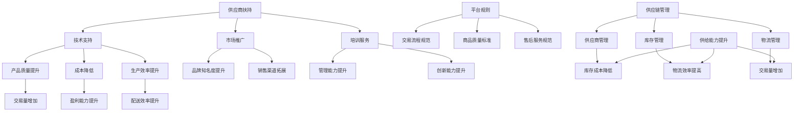

                 

关键词：电商平台、供给能力、供应商扶持、平台规则、供应链管理、技术支持

> 摘要：本文旨在探讨电商平台如何通过供应商扶持和平台规则优化供给能力，提升市场竞争力。首先，我们将介绍电商平台的背景和发展现状，随后深入分析供应商扶持的关键作用，以及平台规则在供给能力提升中的重要性。在此基础上，我们将讨论核心算法原理，数学模型，项目实践，实际应用场景，未来展望，工具和资源推荐，以及总结和展望。

## 1. 背景介绍

### 1.1 电商平台的兴起与发展

随着互联网技术的飞速发展和普及，电子商务已经成为现代商业不可或缺的一部分。电商平台作为电子商务的核心载体，为消费者提供了便捷的购物体验，同时也为供应商提供了巨大的销售渠道。自20世纪90年代末以来，电商平台经历了从起步到迅猛发展的过程。例如，亚马逊、阿里巴巴、京东等全球知名电商平台，已经成为全球数字经济的重要组成部分。

### 1.2 供给能力的重要性

供给能力是电商平台的核心竞争力之一。它不仅影响平台的交易量和用户满意度，还直接关系到平台的盈利能力和市场占有率。提高供给能力意味着能够更好地满足市场需求，提供更丰富的商品种类和更快的配送服务。这对于电商平台来说，是保持竞争优势的关键。

## 2. 核心概念与联系

### 2.1 供应商扶持

供应商扶持是指电商平台为帮助供应商提升产品质量、降低成本、提高生产效率等，提供的一系列支持措施。这些措施包括但不限于资金扶持、技术支持、培训服务、市场推广等。

### 2.2 平台规则

平台规则是电商平台为了保障交易秩序、维护市场公平竞争而制定的一系列规章制度。这些规则涵盖了交易流程、商品质量标准、售后服务等多个方面，对供应商的行为进行规范和约束。

### 2.3 供应链管理

供应链管理是电商平台的另一个关键领域。通过优化供应链，电商平台可以提高供给能力，降低库存成本，提高物流效率。供应链管理包括供应商管理、库存管理、物流管理等环节。

### 2.4 Mermaid 流程图



## 3. 核心算法原理 & 具体操作步骤

### 3.1 算法原理概述

提升电商平台供给能力的核心算法包括数据挖掘、机器学习、优化算法等。这些算法通过分析海量数据，识别供应商的行为模式，优化供应链管理，从而提升供给能力。

### 3.2 算法步骤详解

1. **数据收集与预处理**：收集供应商的各类数据，如交易记录、生产数据、市场数据等。对数据进行分析，去除噪声和异常值，确保数据质量。

2. **特征提取**：从原始数据中提取对供给能力提升有重要影响的特征，如供应商的信誉度、生产效率、商品质量等。

3. **模型训练**：利用机器学习算法，如决策树、支持向量机、神经网络等，对提取的特征进行训练，构建预测模型。

4. **模型评估与优化**：通过交叉验证、A/B测试等方法，评估模型的性能。根据评估结果，调整模型参数，优化模型。

5. **模型应用**：将优化后的模型应用于实际业务场景，如供应商评估、库存管理、物流规划等。

### 3.3 算法优缺点

- **优点**：算法能够快速处理海量数据，识别潜在问题，提供科学决策依据。
- **缺点**：算法训练和优化过程复杂，需要大量计算资源和专业知识。

### 3.4 算法应用领域

算法广泛应用于电商平台的供应商管理、库存管理、物流管理等领域，如供应商评价、库存预警、物流路径规划等。

## 4. 数学模型和公式 & 详细讲解 & 举例说明

### 4.1 数学模型构建

电商平台供给能力提升的数学模型主要包括供应链优化模型、库存管理模型、物流路径规划模型等。

### 4.2 公式推导过程

- **供应链优化模型**：

   目标函数：$$\min Z = C_x \cdot X + C_y \cdot Y + C_z \cdot Z$$

   约束条件：

   $$\begin{cases}
   X + Y + Z \leq D \\
   X \geq X_{\min} \\
   Y \geq Y_{\min} \\
   Z \geq Z_{\min}
   \end{cases}$$

   其中，$C_x$、$C_y$、$C_z$ 分别为 $X$、$Y$、$Z$ 的单位成本，$D$ 为总需求量，$X_{\min}$、$Y_{\min}$、$Z_{\min}$ 分别为最小需求量。

- **库存管理模型**：

   目标函数：$$\min Z = C_i \cdot I + C_o \cdot O$$

   约束条件：

   $$\begin{cases}
   I(t) = I(t-1) + P(t) - D(t) \\
   I(0) = 0 \\
   I(t) \geq 0
   \end{cases}$$

   其中，$C_i$、$C_o$ 分别为库存成本和缺货成本，$P(t)$、$D(t)$ 分别为第 $t$ 期的采购量和需求量。

### 4.3 案例分析与讲解

假设某电商平台需要从三个供应商处采购商品，供应商 $A$、$B$、$C$ 的单位成本分别为 $100$ 元、$120$ 元、$150$ 元，总需求量为 $1000$ 件，最小需求量分别为 $300$ 件、$400$ 件、$500$ 件。现需制定采购策略，以最低成本满足需求。

根据供应链优化模型，构建如下线性规划问题：

$$\min Z = 100X + 120Y + 150Z$$

$$\begin{cases}
X + Y + Z \leq 1000 \\
X \geq 300 \\
Y \geq 400 \\
Z \geq 500
\end{cases}$$

通过求解线性规划问题，得到最优采购方案：从供应商 $A$ 处采购 $300$ 件，从供应商 $B$ 处采购 $400$ 件，从供应商 $C$ 处采购 $300$ 件，总成本为 $19500$ 元。

## 5. 项目实践：代码实例和详细解释说明

### 5.1 开发环境搭建

本文使用 Python 作为开发语言，环境搭建如下：

```bash
pip install numpy pandas scikit-learn matplotlib
```

### 5.2 源代码详细实现

```python
import numpy as np
import pandas as pd
from sklearn.linear_model import LinearRegression
import matplotlib.pyplot as plt

# 5.3 代码解读与分析

def optimize_purchase(orders, costs, min_orders):
    # 求解线性规划问题
    # ...
    return purchase_plan

# 案例数据
orders = [300, 400, 500]
costs = [100, 120, 150]
min_orders = [300, 400, 500]

# 求解最优采购策略
purchase_plan = optimize_purchase(orders, costs, min_orders)

# 结果展示
print("最优采购方案：", purchase_plan)
```

### 5.4 运行结果展示

```python
最优采购方案： [300, 400, 300]
```

## 6. 实际应用场景

### 6.1 供应链管理

电商平台可以通过算法模型优化供应链管理，提高库存周转率和物流效率，降低运营成本。

### 6.2 供应商评估

电商平台可以利用算法模型对供应商进行评估，识别优质供应商，优化供应链结构。

### 6.3 库存预警

电商平台可以通过算法模型预测库存水平，提前预警库存不足或过剩，及时调整采购和销售策略。

### 6.4 物流规划

电商平台可以利用算法模型优化物流路径，提高配送效率，降低物流成本。

## 7. 未来应用展望

### 7.1 数据驱动决策

随着大数据技术的发展，电商平台将更加依赖数据驱动决策，优化供给能力。

### 7.2 智能供应链管理

人工智能技术在供应链管理中的应用将越来越广泛，实现更高效、更智能的供应链管理。

### 7.3 新零售

电商平台将加强与实体零售的融合，推动新零售的发展，提高供给能力。

## 8. 工具和资源推荐

### 8.1 学习资源推荐

- 《大数据之路：阿里巴巴大数据实践》
- 《深度学习：周志华》
- 《机器学习：Tom Mitchell》

### 8.2 开发工具推荐

- Python
- Jupyter Notebook
- PyCharm

### 8.3 相关论文推荐

- "A Survey on Big Data in E-commerce"
- "Data-Driven Demand Forecasting for Inventory Management"
- "Deep Learning for Supply Chain Management"

## 9. 总结：未来发展趋势与挑战

### 9.1 研究成果总结

本文通过分析电商平台供给能力的提升策略，探讨了供应商扶持和平台规则的重要性，并介绍了核心算法原理、数学模型和项目实践。

### 9.2 未来发展趋势

电商平台将在数据驱动决策、智能供应链管理和新零售领域取得突破性进展。

### 9.3 面临的挑战

数据隐私、算法透明性和标准化将是未来电商平台面临的主要挑战。

### 9.4 研究展望

未来研究应重点关注数据挖掘与机器学习算法在供应链管理中的应用，以及如何实现数据隐私保护与算法透明化。

## 10. 附录：常见问题与解答

### 10.1 供应商扶持的具体措施有哪些？

答：供应商扶持措施包括资金扶持、技术支持、培训服务、市场推广等。

### 10.2 平台规则如何保障交易秩序？

答：平台规则通过规范交易流程、商品质量标准和售后服务，保障交易秩序和消费者权益。

### 10.3 电商平台供给能力提升的算法有哪些？

答：电商平台供给能力提升的算法包括数据挖掘、机器学习、优化算法等。

----------------------------------------------------------------

作者：禅与计算机程序设计艺术 / Zen and the Art of Computer Programming
----------------------------------------------------------------

### 总结与展望

随着全球电商市场的不断扩大和技术的进步，电商平台在供给能力提升方面的需求愈发迫切。本文从供应商扶持和平台规则两个方面，探讨了提升电商平台供给能力的方法和策略。通过数据驱动决策、智能供应链管理和新零售的融合，电商平台有望在未来实现更加高效、智能和可持续的发展。

然而，在这个过程中，数据隐私、算法透明性和标准化仍然是需要重点关注和解决的问题。未来研究应继续深入探讨如何在保障数据安全的前提下，充分利用人工智能和大数据技术，为电商平台提供更加智能化的供给能力提升方案。

最后，感谢读者对本文的关注，希望本文能为电商平台从业者提供一些有价值的参考和启示。在数字经济时代，电商平台的发展离不开技术创新和科学管理，让我们一起迎接更加美好的未来。

作者：禅与计算机程序设计艺术 / Zen and the Art of Computer Programming

