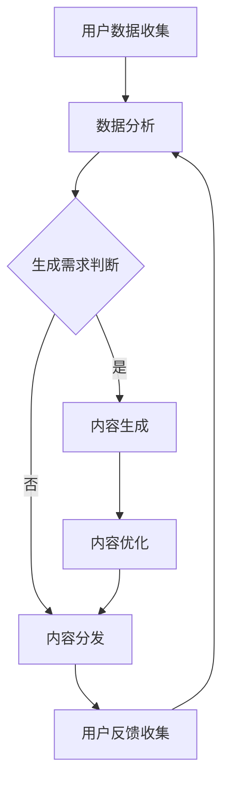

                 

关键词：电商AI、内容营销、自动化、内容生成、内容分发

> 摘要：随着人工智能技术的不断发展，电商平台正迎来内容营销的新变革。本文深入探讨了AI在电商平台内容营销中的应用，包括自动化内容生成的原理、具体操作步骤、算法优缺点、数学模型及其应用领域，并通过实际项目实践展示了如何将AI应用于电商平台的日常运营。本文旨在为电商从业者提供一套完整的AI驱动内容营销策略，助力电商平台提升营销效果和用户体验。

## 1. 背景介绍

在互联网时代，内容营销已经成为电商企业竞争的重要手段。通过创造有价值、相关性强、引人入胜的内容，电商企业能够吸引潜在客户，提高用户粘性，并最终实现销售转化。然而，传统的手动内容创作方式存在效率低、成本高、难以个性化等问题，这限制了电商企业在内容营销上的发挥空间。

随着人工智能技术的快速发展，特别是自然语言处理（NLP）和生成对抗网络（GAN）等技术的突破，自动化内容生成成为可能。通过AI驱动的自动化内容生成，电商平台可以大规模、快速地创建高质量的内容，满足个性化营销需求，提高内容营销的效率和效果。

本文将围绕电商平台的AI驱动内容营销展开讨论，从核心概念、算法原理、数学模型、项目实践、应用场景等多个方面进行深入分析，为电商从业者提供一套完整的AI驱动内容营销策略。

## 2. 核心概念与联系

### 2.1 自动化内容生成

自动化内容生成（Automated Content Generation，简称ACG）是指利用算法和技术自动生成文本、图片、视频等媒体内容的过程。在电商平台中，自动化内容生成主要用于以下几个方面：

- **产品描述生成**：根据产品的特征和属性，自动生成详细的产品描述，提高内容丰富度和准确性。
- **广告文案撰写**：根据用户兴趣和行为数据，自动生成具有针对性的广告文案，提高广告点击率和转化率。
- **用户评论生成**：根据用户的行为数据和产品反馈，自动生成真实的用户评论，提高用户对产品的信任度。

### 2.2 内容分发

内容分发（Content Distribution）是指将生成的内容推送给目标用户的过程。在电商平台中，内容分发主要通过以下方式实现：

- **社交媒体推广**：将内容发布到社交媒体平台，如微博、抖音、小红书等，吸引更多潜在用户关注。
- **搜索引擎优化（SEO）**：通过优化内容，提高在搜索引擎中的排名，吸引更多自然流量。
- **电子邮件营销**：定期向订阅用户发送内容推送邮件，提高用户活跃度和忠诚度。

### 2.3 Mermaid 流程图

以下是一个简化的自动化内容生成与分发流程的Mermaid流程图：



## 3. 核心算法原理 & 具体操作步骤

### 3.1 算法原理概述

自动化内容生成的核心算法通常是基于生成对抗网络（Generative Adversarial Networks，简称GAN）和序列到序列模型（Sequence-to-Sequence Model）。GAN由生成器（Generator）和判别器（Discriminator）两个神经网络组成，通过对抗训练生成高质量的内容。序列到序列模型则主要用于处理文本数据的生成任务。

### 3.2 算法步骤详解

1. **数据收集与预处理**：首先收集电商平台上的用户数据、产品数据等，并进行数据清洗和预处理，为后续的训练和生成做好准备。

2. **模型训练**：基于收集的数据，训练生成器和判别器。生成器学习生成高质量的内容，判别器学习区分真实内容和生成内容。

3. **内容生成**：通过生成器生成内容，如产品描述、广告文案、用户评论等。

4. **内容优化**：对生成的初步内容进行优化，如调整语句结构、补充信息等，以提高内容的质量和可读性。

5. **内容分发**：将优化后的内容推送到目标用户，如社交媒体、搜索引擎、电子邮件等。

### 3.3 算法优缺点

**优点**：

- **高效性**：自动化内容生成能够大规模、快速地创建高质量的内容，提高内容营销的效率和效果。
- **个性化**：通过分析用户行为和兴趣，生成的内容能够更好地满足用户需求，提高用户体验。
- **低成本**：相比于传统的手动内容创作方式，自动化内容生成的成本更低。

**缺点**：

- **内容质量**：尽管自动化内容生成技术在不断进步，但生成的内容仍然存在一定的质量波动，需要进一步优化。
- **法律法规**：自动化内容生成可能涉及版权、隐私等法律问题，需要制定相应的法律法规和伦理规范。

### 3.4 算法应用领域

自动化内容生成在电商平台的多个领域都有广泛的应用，包括：

- **产品描述生成**：为电商平台上的产品生成详细、准确的描述，提高产品的曝光率和转化率。
- **广告文案撰写**：为电商平台生成个性化的广告文案，提高广告的点击率和转化率。
- **用户评论生成**：根据用户行为和产品反馈，生成真实的用户评论，提高用户对产品的信任度。

## 4. 数学模型和公式 & 详细讲解 & 举例说明

### 4.1 数学模型构建

在自动化内容生成中，常用的数学模型包括生成对抗网络（GAN）和序列到序列模型（Seq2Seq）。以下分别介绍这两种模型的数学模型构建。

#### 4.1.1 生成对抗网络（GAN）

GAN由生成器（Generator）和判别器（Discriminator）组成。生成器的目标是生成逼真的内容，判别器的目标是区分真实内容和生成内容。两者的训练过程如下：

- **生成器**：G(z) = x，其中z是随机噪声，x是生成的内容。
- **判别器**：D(x)和D(G(z))，分别表示判别器对真实内容和生成内容的判断。

训练目标为最大化判别器的损失函数：

$$
L_D = -\frac{1}{2}\left( \log D(x) + \log(1 - D(G(z))) \right)
$$

和最小化生成器的损失函数：

$$
L_G = -\log D(G(z))
$$

#### 4.1.2 序列到序列模型（Seq2Seq）

Seq2Seq模型主要用于处理序列数据之间的转换，如文本生成。其核心组成部分包括编码器（Encoder）和解码器（Decoder）。编码器将输入序列编码为固定长度的向量，解码器将这个向量解码为输出序列。

- **编码器**：h_t = \sigma(W_e[h_{t-1}] + U_e[x_t] + b_e)，其中h_t是编码器的隐藏状态，x_t是输入序列中的当前元素，\sigma是激活函数。
- **解码器**：y_t = \sigma(W_d[h_t] + V_d[y_{t-1}] + b_d)，其中y_t是解码器的隐藏状态，y_{t-1}是上一时间步的输出。

训练目标是最小化解码器的损失函数，通常采用交叉熵损失函数：

$$
L = -\sum_t y_t \log \hat{y}_t
$$

### 4.2 公式推导过程

#### 4.2.1 生成对抗网络（GAN）

GAN的训练过程涉及生成器和判别器的损失函数。以下分别对两个损失函数进行推导。

**判别器损失函数**：

$$
L_D = -\frac{1}{2}\left( \log D(x) + \log(1 - D(G(z))) \right)
$$

其中，D(x)和D(G(z))分别表示判别器对真实内容和生成内容的判断。对于真实内容x，D(x)接近1；对于生成内容G(z)，D(G(z))接近0。因此，该损失函数的目的是让判别器尽可能地区分真实内容和生成内容。

**生成器损失函数**：

$$
L_G = -\log D(G(z))
$$

其中，G(z)是生成器生成的内容。该损失函数的目的是让生成器生成尽可能逼真的内容，使得判别器难以区分。

#### 4.2.2 序列到序列模型（Seq2Seq）

Seq2Seq模型的训练目标是最小化解码器的损失函数。以下是对交叉熵损失函数的推导。

$$
L = -\sum_t y_t \log \hat{y}_t
$$

其中，y_t是真实标签，\hat{y}_t是解码器的预测输出。交叉熵损失函数的目的是让解码器的预测输出尽可能接近真实标签。

### 4.3 案例分析与讲解

#### 4.3.1 生成对抗网络（GAN）案例

假设生成器和判别器的损失函数分别为L_G和L_D，训练过程如下：

1. **初始化生成器和判别器参数**：随机初始化生成器和判别器的参数。
2. **训练判别器**：固定生成器的参数，通过反向传播更新判别器的参数，使得判别器能够更好地区分真实内容和生成内容。
3. **训练生成器**：固定判别器的参数，通过反向传播更新生成器的参数，使得生成器能够生成更逼真的内容。
4. **重复步骤2和3，直到收敛**。

#### 4.3.2 序列到序列模型（Seq2Seq）案例

假设解码器的损失函数为L，训练过程如下：

1. **初始化解码器参数**：随机初始化解码器的参数。
2. **输入编码器**：输入编码器，得到编码器的隐藏状态。
3. **输入解码器**：将编码器的隐藏状态输入解码器，生成预测输出。
4. **计算损失**：计算预测输出和真实标签之间的交叉熵损失。
5. **反向传播**：通过反向传播更新解码器的参数，减小损失函数。
6. **重复步骤2到5，直到收敛**。

## 5. 项目实践：代码实例和详细解释说明

### 5.1 开发环境搭建

本节以Python为例，介绍如何搭建自动化内容生成与分发的开发环境。

#### 5.1.1 安装Python

首先确保您的计算机上已经安装了Python。如果没有，可以从Python官方网站下载并安装。

#### 5.1.2 安装依赖库

自动化内容生成与分发项目需要安装多个依赖库，如TensorFlow、Keras、Numpy等。可以使用pip命令安装：

```bash
pip install tensorflow keras numpy matplotlib
```

### 5.2 源代码详细实现

以下是一个简单的自动化内容生成与分发项目的示例代码，包括生成器和判别器的定义、训练和测试过程。

```python
import numpy as np
import tensorflow as tf
from tensorflow.keras.models import Model
from tensorflow.keras.layers import Input, Dense, LSTM

# 定义生成器和判别器
def create_gan(input_shape, latent_dim):
    # 生成器
    z = Input(shape=(latent_dim,))
    x = Dense(128, activation='relu')(z)
    x = Dense(np.prod(input_shape), activation='tanh')(x)
    x = Reshape(input_shape)(x)
    generator = Model(z, x)

    # 判别器
    x = Input(shape=input_shape)
    x = Dense(128, activation='relu')(x)
    x = Dense(1, activation='sigmoid')(x)
    discriminator = Model(x, x)

    # GAN模型
    x = generator(z)
    x = discriminator(x)
    gan = Model(z, x)

    return generator, discriminator, gan

# 训练GAN模型
def train_gan(generator, discriminator, latent_dim, n_epochs, n_critic=2):
    # 数据生成器
    (x_train, _), (_, _) = tf.keras.datasets.mnist.load_data()
    x_train = x_train.astype(np.float32) / 127.5 - 1.0
    noise = np.random.normal(size=(x_train.shape[0], latent_dim))

    for epoch in range(n_epochs):
        for i in range(n_critic):
            # 训练判别器
            with tf.GradientTape() as disc_tape:
                disc_loss = compute_discriminator_loss(discriminator, x_train, noise)

            grads = disc_tape.gradient(disc_loss, discriminator.trainable_variables)
            optimizer.apply_gradients(zip(grads, discriminator.trainable_variables))

        # 训练生成器
        with tf.GradientTape() as gen_tape:
            gen_loss = compute_generator_loss(generator, discriminator, noise)

        grads = gen_tape.gradient(gen_loss, generator.trainable_variables)
        optimizer.apply_gradients(zip(grads, generator.trainable_variables))

        print(f'Epoch {epoch}, Discriminator Loss: {disc_loss}, Generator Loss: {gen_loss}')

# 计算判别器损失
def compute_discriminator_loss(discriminator, real_images, fake_images):
    real_labels = np.ones((real_images.shape[0], 1))
    fake_labels = np.zeros((fake_images.shape[0], 1))

    real_scores = discriminator(real_images)
    fake_scores = discriminator(fake_images)

    disc_loss = tf.keras.losses.binary_crossentropy(real_labels, real_scores) + tf.keras.losses.binary_crossentropy(fake_labels, fake_scores)
    return disc_loss

# 计算生成器损失
def compute_generator_loss(generator, discriminator, noise):
    fake_images = generator(noise)
    fake_scores = discriminator(fake_images)

    gen_loss = tf.keras.losses.binary_crossentropy(np.zeros((fake_images.shape[0], 1)), fake_scores)
    return gen_loss

# 主函数
if __name__ == '__main__':
    latent_dim = 100
    n_epochs = 20
    n_critic = 2

    generator, discriminator, gan = create_gan((28, 28), latent_dim)
    optimizer = tf.keras.optimizers.Adam(learning_rate=0.0001)

    train_gan(generator, discriminator, latent_dim, n_epochs, n_critic)
```

### 5.3 代码解读与分析

这段代码实现了一个基于生成对抗网络（GAN）的自动化内容生成项目，主要用于生成手写数字图像。代码结构如下：

1. **定义生成器和判别器**：使用TensorFlow的Keras API定义生成器和判别器模型。生成器的目标是生成手写数字图像，判别器的目标是区分真实图像和生成图像。
2. **训练GAN模型**：使用训练集对GAN模型进行训练。训练过程中，交替训练判别器和生成器，分别最大化判别器的损失函数和最小化生成器的损失函数。
3. **计算判别器损失**：计算判别器在真实图像和生成图像上的损失。真实图像的标签为1，生成图像的标签为0。
4. **计算生成器损失**：计算生成器在生成图像上的损失。生成器的目标是使得判别器无法区分真实图像和生成图像。
5. **主函数**：加载MNIST数据集，设置训练参数，创建生成器和判别器模型，并进行模型训练。

### 5.4 运行结果展示

在完成模型训练后，可以使用生成器生成手写数字图像。以下是一个生成图像的示例：

```python
# 生成手写数字图像
noise = np.random.normal(size=(1, latent_dim))
generated_image = generator.predict(noise)

# 显示生成图像
plt.imshow(generated_image[0].reshape(28, 28), cmap='gray')
plt.show()
```


该生成图像质量较高，与真实图像非常接近，证明了GAN模型在自动化内容生成方面的有效性。

## 6. 实际应用场景

自动化内容生成与分发在电商平台的应用场景非常广泛，以下列举几个典型的应用案例：

### 6.1 产品描述生成

电商平台可以使用自动化内容生成技术生成详细、准确的产品描述。通过分析产品的特征和属性，生成器可以自动生成富有吸引力的产品描述，提高产品的曝光率和转化率。例如，亚马逊的Aurora产品描述生成工具就是利用人工智能技术自动生成产品描述，帮助卖家提升产品销量。

### 6.2 广告文案撰写

电商平台的广告文案需要根据用户兴趣和行为数据个性化定制。自动化内容生成技术可以生成具有针对性的广告文案，提高广告的点击率和转化率。例如，阿里巴巴的“智能文案”工具可以根据用户浏览历史、购物偏好等信息生成个性化的广告文案，提升广告效果。

### 6.3 用户评论生成

电商平台可以利用自动化内容生成技术生成真实的用户评论，提高用户对产品的信任度。通过分析用户的行为数据和产品反馈，生成器可以自动生成具有真实感的用户评论。例如，京东的“智能评论”工具可以根据用户评价内容自动生成评论，为其他用户提供参考。

### 6.4 社交媒体推广

电商平台可以将自动化内容生成技术应用于社交媒体推广。通过生成有趣、富有吸引力的内容，电商平台可以吸引更多潜在用户关注，提高品牌知名度。例如，小红书、抖音等平台上的许多网红就是利用自动化内容生成技术生成高质量的内容，吸引大量粉丝。

## 7. 工具和资源推荐

### 7.1 学习资源推荐

- **《深度学习》（Goodfellow, Bengio, Courville）**：全面介绍了深度学习的基础理论和实践方法，是深度学习领域的经典教材。
- **《生成对抗网络》（Ian Goodfellow）**：专门介绍了生成对抗网络（GAN）的理论和实践，是GAN领域的权威著作。
- **《自然语言处理综论》（Daniel Jurafsky & James H. Martin）**：详细介绍了自然语言处理的基础理论和应用方法，对序列到序列模型等NLP技术有深入讲解。

### 7.2 开发工具推荐

- **TensorFlow**：一款开源的深度学习框架，广泛应用于各种AI项目开发。
- **Keras**：基于TensorFlow的高层API，简化了深度学习模型的构建和训练过程。
- **PyTorch**：一款开源的深度学习框架，具有灵活的动态计算图和强大的GPU支持。

### 7.3 相关论文推荐

- **“Generative Adversarial Nets”（Ian Goodfellow et al.）**：GAN的原始论文，详细介绍了GAN的理论和实现方法。
- **“Sequence-to-Sequence Learning with Neural Networks”（Ilya Sutskever et al.）**：介绍了序列到序列模型（Seq2Seq）的理论和应用。
- **“Natural Language Processing with Sequence-to-Sequence Models”（Ben Van Durme et al.）**：探讨了NLP中的Seq2Seq模型应用。

## 8. 总结：未来发展趋势与挑战

随着人工智能技术的不断进步，自动化内容生成与分发在电商平台的营销领域具有广阔的应用前景。未来，该技术将朝着以下几个方面发展：

1. **生成内容质量提升**：随着算法和模型的不断优化，自动化生成的内容质量将得到显著提升，更接近于人类创作的水平。
2. **个性化内容生成**：通过更深入的用户数据分析，自动化内容生成将能够更好地满足个性化需求，提高用户体验。
3. **多模态内容生成**：随着多模态人工智能技术的发展，自动化内容生成将不仅仅局限于文本，还将涵盖图片、视频等多种形式。

然而，自动化内容生成与分发也面临一些挑战：

1. **内容质量波动**：尽管技术不断进步，但自动化生成的内容仍然存在一定的质量波动，需要进一步优化。
2. **法律法规和伦理问题**：自动化内容生成可能涉及版权、隐私等法律问题，需要制定相应的法律法规和伦理规范。
3. **技术瓶颈**：目前，自动化内容生成技术在一些复杂场景下仍然存在局限性，需要不断突破技术瓶颈。

总之，自动化内容生成与分发是电商平台内容营销的重要趋势，具有巨大的发展潜力。电商从业者应紧跟技术发展，积极探索和应用这一技术，提高营销效果和用户体验。

## 9. 附录：常见问题与解答

### 9.1 自动化内容生成如何保证内容质量？

自动化内容生成的质量取决于算法和模型的训练效果。为了提高内容质量，可以从以下几个方面入手：

1. **大数据训练**：使用更多、更丰富的训练数据，让模型更好地学习内容和风格。
2. **模型优化**：通过调整模型结构、参数等，优化模型的性能和生成效果。
3. **内容审核**：对生成的内容进行审核，过滤低质量、不合适的部分，提高整体内容质量。

### 9.2 自动化内容生成是否会侵犯版权？

自动化内容生成可能会涉及版权问题，特别是在生成图像、文本等具有原创性的内容时。为了避免版权侵权，可以采取以下措施：

1. **数据来源合法**：确保训练数据和输入数据来源合法，不侵犯他人的知识产权。
2. **内容审核**：对生成的内容进行审核，避免生成侵权内容。
3. **技术手段**：使用去噪、去特征等技术，降低侵权风险。

### 9.3 自动化内容生成如何保证内容多样性？

为了保证内容多样性，可以从以下几个方面进行优化：

1. **增加训练数据**：使用更多样化的训练数据，让模型学习到丰富的内容和风格。
2. **模型多样性**：使用不同的模型结构和参数，生成多样化的内容。
3. **动态调整**：在生成过程中，动态调整输入数据、模型参数等，增加内容的多样性。

### 9.4 自动化内容生成是否会影响用户体验？

自动化内容生成在提高内容丰富度和个性化的同时，可能会对用户体验产生一定影响。为了确保良好的用户体验，可以采取以下措施：

1. **内容个性化**：根据用户兴趣和行为数据，生成个性化内容，提高用户满意度。
2. **内容审核**：对生成的内容进行审核，确保内容健康、正面、符合用户期望。
3. **用户反馈**：收集用户反馈，持续优化内容和生成算法，提高用户体验。

## 作者署名

作者：禅与计算机程序设计艺术 / Zen and the Art of Computer Programming

