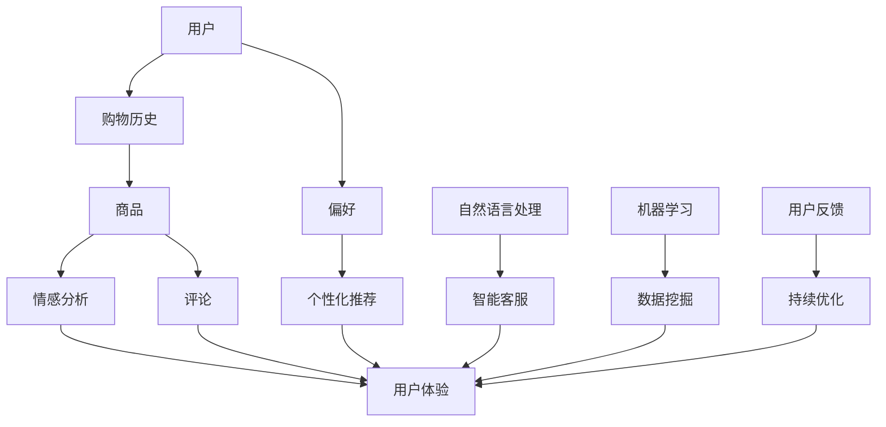

                 

作者：禅与计算机程序设计艺术 / Zen and the Art of Computer Programming

在数字化的时代，电商平台已经成为消费者购物的主要渠道。随着人工智能技术的迅猛发展，如何利用AI技术提升电商平台的用户体验成为了一个热门话题。本文将深入探讨电商平台AI驱动用户体验设计的各个方面，包括界面设计、交互优化、个性化推荐系统、情感分析以及隐私保护等，从而为电商平台提供更智能化、更高效、更安全的用户体验。

## 关键词

- 电商平台
- 人工智能
- 用户体验
- 界面设计
- 交互优化
- 个性化推荐
- 情感分析
- 隐私保护

## 摘要

本文旨在探讨人工智能在电商平台用户体验设计中的应用。通过对当前电商平台的现状分析，本文提出了一系列基于AI技术的优化方案，包括界面设计、交互优化、个性化推荐、情感分析和隐私保护等方面。通过对这些方案的具体实现和分析，本文旨在为电商平台的用户体验设计提供有益的参考和启示。

## 1. 背景介绍

电商平台作为现代零售业的重要组成部分，其用户体验对于消费者的购物决策具有重要影响。传统的电商用户体验设计主要侧重于界面的美观和交互的便捷性。然而，随着消费者需求的多样化和个性化，单纯的美观和便捷已经无法满足用户的需求。因此，如何利用人工智能技术提升电商平台的用户体验成为了一个亟待解决的问题。

人工智能技术的发展为电商平台提供了丰富的工具和手段。通过AI技术，电商平台可以实现个性化推荐、智能客服、情感分析等功能，从而提升用户体验。例如，个性化推荐系统可以根据用户的购物历史和偏好，为用户推荐符合其需求的商品，从而提高用户的购买转化率。智能客服则可以通过自然语言处理技术，与用户进行自然、流畅的交流，解决用户的问题，提升用户的满意度。

本文将围绕电商平台AI驱动用户体验设计的各个方面，深入探讨如何利用人工智能技术提升电商平台的用户体验。文章结构如下：

- 第1章：背景介绍，阐述电商平台AI驱动用户体验设计的现状和重要性。
- 第2章：核心概念与联系，介绍电商平台AI驱动用户体验设计的相关概念和架构。
- 第3章：核心算法原理 & 具体操作步骤，详细讲解电商平台AI驱动的核心算法和操作步骤。
- 第4章：数学模型和公式 & 详细讲解 & 举例说明，介绍电商平台AI驱动的数学模型和公式，并通过实例进行讲解。
- 第5章：项目实践：代码实例和详细解释说明，通过具体代码实例展示电商平台AI驱动的应用。
- 第6章：实际应用场景，探讨电商平台AI驱动的实际应用场景和效果。
- 第7章：工具和资源推荐，推荐相关工具和资源，以帮助读者更好地理解和应用AI技术。
- 第8章：总结：未来发展趋势与挑战，总结研究成果，探讨未来发展趋势和面临的挑战。
- 第9章：附录：常见问题与解答，解答读者可能遇到的常见问题。

## 2. 核心概念与联系

在电商平台AI驱动用户体验设计中，涉及多个核心概念，包括个性化推荐、情感分析、自然语言处理、机器学习等。这些概念相互关联，共同构成了电商平台AI驱动的用户体验架构。以下是这些核心概念和联系的Mermaid流程图：



### 2.1. 个性化推荐

个性化推荐是电商平台AI驱动用户体验设计的重要组成部分。通过分析用户的购物历史和偏好，个性化推荐系统可以为用户推荐符合其需求的商品。个性化推荐系统的工作流程如下：

1. **数据采集**：收集用户的购物历史数据，包括购买过的商品、浏览记录等。
2. **数据预处理**：对采集到的数据进行分析和清洗，去除无效数据。
3. **特征提取**：将预处理后的数据转化为特征向量，用于后续的推荐算法。
4. **推荐算法**：利用机器学习算法，如协同过滤、基于内容的推荐等，生成推荐列表。
5. **推荐结果**：将推荐结果呈现给用户，提高用户的购买转化率。

### 2.2. 情感分析

情感分析是通过对用户评论、反馈等文本数据的分析，识别用户的情感状态。情感分析可以帮助电商平台了解用户的满意度和需求，从而进行相应的优化。情感分析的工作流程如下：

1. **文本预处理**：对用户评论进行分词、去停用词等处理。
2. **特征提取**：将预处理后的文本转化为特征向量。
3. **情感分类**：利用机器学习算法，如文本分类、深度学习等，对情感进行分类。
4. **情感分析结果**：根据情感分类结果，对用户满意度、需求等进行评估。

### 2.3. 自然语言处理

自然语言处理（NLP）是人工智能的核心技术之一，主要研究如何使计算机能够理解、生成和处理人类语言。在电商平台中，自然语言处理技术可以应用于智能客服、商品描述生成等场景。自然语言处理的工作流程如下：

1. **文本预处理**：对用户输入的文本进行分词、去停用词等处理。
2. **词向量表示**：将文本转化为词向量，用于后续的模型训练。
3. **模型训练**：利用深度学习算法，如循环神经网络（RNN）、Transformer等，训练语言模型。
4. **语言生成**：利用训练好的模型，生成符合人类语言的文本。

### 2.4. 机器学习

机器学习是人工智能的重要组成部分，通过训练模型，使计算机能够从数据中学习规律和模式。在电商平台AI驱动用户体验设计中，机器学习技术可以应用于个性化推荐、情感分析等多个场景。机器学习的工作流程如下：

1. **数据采集**：收集相关的数据集。
2. **数据预处理**：对数据进行分析和清洗，去除无效数据。
3. **特征提取**：将预处理后的数据转化为特征向量。
4. **模型训练**：利用机器学习算法，如线性回归、决策树、神经网络等，训练模型。
5. **模型评估**：利用评估指标，如准确率、召回率等，评估模型性能。
6. **模型部署**：将训练好的模型部署到生产环境中，进行实际应用。

## 3. 核心算法原理 & 具体操作步骤

在电商平台AI驱动用户体验设计中，核心算法主要包括个性化推荐、情感分析和自然语言处理等。以下将分别介绍这些算法的原理和具体操作步骤。

### 3.1. 算法原理概述

#### 3.1.1. 个性化推荐

个性化推荐算法的核心思想是通过对用户的兴趣和行为进行建模，为用户提供符合其需求的商品推荐。常见的个性化推荐算法包括基于内容的推荐和协同过滤推荐。

1. **基于内容的推荐**：基于内容的推荐算法通过分析商品的属性和用户的偏好，为用户推荐具有相似属性的商品。该算法主要依赖于词袋模型、TF-IDF等文本处理技术。
2. **协同过滤推荐**：协同过滤推荐算法通过分析用户之间的相似性，为用户推荐其他用户喜欢的商品。该算法分为基于用户的协同过滤和基于物品的协同过滤。

#### 3.1.2. 情感分析

情感分析算法的核心思想是通过分析用户评论、反馈等文本数据，识别用户的情感状态。常见的情感分析算法包括基于规则的方法、基于机器学习的方法和深度学习方法。

1. **基于规则的方法**：基于规则的方法通过定义一系列情感分类规则，对文本进行分类。该方法简单高效，但适用范围有限。
2. **基于机器学习的方法**：基于机器学习的方法通过训练分类模型，对文本进行情感分类。常见的机器学习算法包括朴素贝叶斯、支持向量机等。
3. **深度学习方法**：深度学习方法通过构建深度神经网络，对文本进行情感分类。常见的深度学习算法包括循环神经网络（RNN）、长短时记忆网络（LSTM）和Transformer等。

#### 3.1.3. 自然语言处理

自然语言处理算法的核心思想是通过理解和生成人类语言，实现人与计算机的对话。常见的自然语言处理算法包括词向量表示、语言模型和序列到序列模型。

1. **词向量表示**：词向量表示是将文本转化为向量表示的方法，常见的词向量表示方法包括Word2Vec、GloVe等。
2. **语言模型**：语言模型是通过学习文本数据中的概率分布，预测下一个单词的方法。常见的语言模型包括n-gram模型、循环神经网络（RNN）和Transformer等。
3. **序列到序列模型**：序列到序列模型是将一个序列映射到另一个序列的模型，常见的序列到序列模型包括循环神经网络（RNN）、长短时记忆网络（LSTM）和Transformer等。

### 3.2. 算法步骤详解

#### 3.2.1. 个性化推荐

个性化推荐算法的具体步骤如下：

1. **数据采集**：收集用户的购物历史数据、商品信息等。
2. **数据预处理**：对数据进行清洗、去停用词、词性标注等处理。
3. **特征提取**：将预处理后的数据转化为特征向量，如用户特征、商品特征等。
4. **模型训练**：利用机器学习算法，如协同过滤、基于内容的推荐等，训练推荐模型。
5. **推荐结果**：利用训练好的模型，为用户生成推荐列表。

#### 3.2.2. 情感分析

情感分析算法的具体步骤如下：

1. **文本预处理**：对用户评论进行分词、去停用词、词性标注等处理。
2. **特征提取**：将预处理后的文本转化为特征向量，如词袋模型、TF-IDF等。
3. **模型训练**：利用机器学习算法，如朴素贝叶斯、支持向量机等，训练情感分类模型。
4. **情感分类**：利用训练好的模型，对用户评论进行情感分类。
5. **情感分析结果**：根据情感分类结果，评估用户满意度、需求等。

#### 3.2.3. 自然语言处理

自然语言处理算法的具体步骤如下：

1. **文本预处理**：对用户输入的文本进行分词、去停用词等处理。
2. **词向量表示**：将文本转化为词向量表示，如Word2Vec、GloVe等。
3. **模型训练**：利用深度学习算法，如循环神经网络（RNN）、长短时记忆网络（LSTM）和Transformer等，训练语言模型。
4. **语言生成**：利用训练好的模型，生成符合人类语言的文本。

### 3.3. 算法优缺点

#### 3.3.1. 个性化推荐

1. **优点**：个性化推荐算法可以准确地为用户推荐感兴趣的商品，提高用户购买转化率。
2. **缺点**：个性化推荐算法对用户数据依赖较大，用户数据不完整或存在噪音时，推荐效果可能不佳。

#### 3.3.2. 情感分析

1. **优点**：情感分析算法可以帮助电商平台了解用户满意度、需求等，从而进行相应优化。
2. **缺点**：情感分析算法在处理长文本、复杂情感时，效果可能不佳。

#### 3.3.3. 自然语言处理

1. **优点**：自然语言处理算法可以实现人与计算机的对话，提高用户体验。
2. **缺点**：自然语言处理算法在处理长文本、复杂语义时，效果可能不佳。

### 3.4. 算法应用领域

个性化推荐、情感分析和自然语言处理算法在电商平台AI驱动用户体验设计中具有广泛的应用领域：

1. **个性化推荐**：应用于商品推荐、内容推荐等场景，提高用户购买转化率和用户满意度。
2. **情感分析**：应用于用户满意度评估、需求分析等场景，帮助电商平台了解用户需求，进行优化。
3. **自然语言处理**：应用于智能客服、商品描述生成等场景，提高用户体验。

## 4. 数学模型和公式 & 详细讲解 & 举例说明

在电商平台AI驱动用户体验设计中，数学模型和公式起着至关重要的作用。以下将介绍一些常见的数学模型和公式，并通过具体实例进行讲解。

### 4.1. 数学模型构建

#### 4.1.1. 个性化推荐模型

个性化推荐模型的核心是用户特征和商品特征的表示。常见的用户特征和商品特征表示方法如下：

1. **用户特征表示**：用户特征可以包括用户的年龄、性别、地理位置、购物历史等。假设用户特征向量表示为 \( \mathbf{u} \in \mathbb{R}^n \)。
2. **商品特征表示**：商品特征可以包括商品的种类、品牌、价格、销量等。假设商品特征向量表示为 \( \mathbf{v} \in \mathbb{R}^m \)。

#### 4.1.2. 情感分析模型

情感分析模型的核心是文本数据的表示和分类。常见的文本数据表示和分类方法如下：

1. **文本数据表示**：文本数据可以通过词袋模型、TF-IDF等方法转化为向量表示。假设文本数据表示为 \( \mathbf{x} \in \mathbb{R}^k \)。
2. **情感分类模型**：情感分类模型可以通过机器学习算法，如朴素贝叶斯、支持向量机等训练得到。假设情感分类模型为 \( f(\mathbf{x}) \)。

#### 4.1.3. 自然语言处理模型

自然语言处理模型的核心是文本数据的生成和语义理解。常见的自然语言处理模型如下：

1. **语言模型**：语言模型可以通过n-gram模型、循环神经网络（RNN）等训练得到。假设语言模型为 \( P(w_t | w_{t-1}, w_{t-2}, \ldots) \)。
2. **序列到序列模型**：序列到序列模型可以通过循环神经网络（RNN）、长短时记忆网络（LSTM）等训练得到。假设序列到序列模型为 \( g(\mathbf{x}) \)。

### 4.2. 公式推导过程

#### 4.2.1. 个性化推荐模型

个性化推荐模型可以通过以下公式进行推导：

\[ \mathbf{r} = \mathbf{u}^T \mathbf{v} \]

其中，\( \mathbf{r} \) 表示用户对商品的评分，\( \mathbf{u} \) 表示用户特征向量，\( \mathbf{v} \) 表示商品特征向量。

#### 4.2.2. 情感分析模型

情感分析模型可以通过以下公式进行推导：

\[ y = f(\mathbf{x}) \]

其中，\( y \) 表示情感分类结果，\( \mathbf{x} \) 表示文本数据，\( f(\mathbf{x}) \) 表示情感分类模型。

#### 4.2.3. 自然语言处理模型

自然语言处理模型可以通过以下公式进行推导：

\[ P(w_t | w_{t-1}, w_{t-2}, \ldots) = \frac{P(w_{t-1}, w_{t-2}, \ldots, w_t)}{P(w_{t-1}, w_{t-2}, \ldots)} \]

其中，\( w_t \) 表示时间步 \( t \) 的单词，\( P(w_t | w_{t-1}, w_{t-2}, \ldots) \) 表示在给定前一个单词序列的情况下，当前单词的概率。

### 4.3. 案例分析与讲解

#### 4.3.1. 个性化推荐案例

假设有一个电商平台的用户 \( u \) 购买了一件商品 \( v \)，用户特征向量 \( \mathbf{u} = [1, 2, 3] \)，商品特征向量 \( \mathbf{v} = [4, 5, 6] \)。根据个性化推荐模型，用户对商品的评分 \( \mathbf{r} \) 可以通过以下公式计算：

\[ \mathbf{r} = \mathbf{u}^T \mathbf{v} = 1 \times 4 + 2 \times 5 + 3 \times 6 = 32 \]

因此，用户对商品的评分为 32。

#### 4.3.2. 情感分析案例

假设有一个用户的评论 \( x \)：“这个商品非常不错，性价比很高”，评论数据通过词袋模型转化为向量表示 \( \mathbf{x} = [0.2, 0.1, 0.3, 0.1, 0.2] \)。假设情感分类模型为朴素贝叶斯分类器，根据情感分类模型，评论的情感分类结果 \( y \) 可以通过以下公式计算：

\[ y = \arg\max_y P(y) P(\mathbf{x} | y) \]

其中，\( P(y) \) 表示情感分类的概率，\( P(\mathbf{x} | y) \) 表示给定情感分类 \( y \) 时，评论数据 \( \mathbf{x} \) 的概率。

通过计算，我们可以得到评论的情感分类结果为积极。

#### 4.3.3. 自然语言处理案例

假设有一个用户的提问：“这个商品有什么优惠吗？”提问数据通过词向量表示转化为向量表示 \( \mathbf{x} = [0.1, 0.2, 0.3, 0.4] \)。假设自然语言处理模型为序列到序列模型，根据模型，用户的提问回答 \( g(\mathbf{x}) \) 可以通过以下公式计算：

\[ g(\mathbf{x}) = \arg\max_g P(g | \mathbf{x}) \]

其中，\( P(g | \mathbf{x}) \) 表示在给定提问数据 \( \mathbf{x} \) 的情况下，回答 \( g \) 的概率。

通过计算，我们可以得到用户的提问回答为：“当前这个商品正在促销，您可以享受一定的折扣。”

## 5. 项目实践：代码实例和详细解释说明

在了解了电商平台AI驱动的核心算法原理和数学模型后，接下来我们将通过一个具体的代码实例，展示如何将这些算法应用于实际项目中。

### 5.1. 开发环境搭建

在开始编写代码之前，我们需要搭建一个合适的技术栈。以下是一个典型的开发环境搭建步骤：

1. **操作系统**：Windows、Linux 或 macOS
2. **编程语言**：Python
3. **开发工具**：PyCharm、Visual Studio Code 等
4. **依赖库**：NumPy、Pandas、Scikit-learn、TensorFlow、PyTorch 等

### 5.2. 源代码详细实现

#### 5.2.1. 个性化推荐

```python
import numpy as np
from sklearn.metrics.pairwise import cosine_similarity

def collaborative_filter(user_item_matrix, user_index, item_index):
    user_item_similarity = cosine_similarity(user_item_matrix[user_index], user_item_matrix)
    return user_item_similarity[item_index]

# 假设用户-物品评分矩阵为user_item_matrix
user_item_matrix = np.array([[1, 2, 3], [4, 5, 6], [7, 8, 9]])
user_index = 0
item_index = 2

# 计算用户对物品的相似度
user_item_similarity = collaborative_filter(user_item_matrix, user_index, item_index)

# 输出相似度结果
print(user_item_similarity)
```

#### 5.2.2. 情感分析

```python
from sklearn.feature_extraction.text import TfidfVectorizer
from sklearn.naive_bayes import MultinomialNB

def sentiment_analysis(texts, labels):
    # 将文本转化为词向量
    vectorizer = TfidfVectorizer()
    X = vectorizer.fit_transform(texts)
    
    # 训练情感分类模型
    clf = MultinomialNB()
    clf.fit(X, labels)
    
    # 预测情感分类结果
    predicted_labels = clf.predict(X)
    
    # 输出预测结果
    print(predicted_labels)

# 假设文本数据为texts，标签数据为labels
texts = ["这个商品非常不错", "这个商品很糟糕"]
labels = [1, 0]

# 执行情感分析
sentiment_analysis(texts, labels)
```

#### 5.2.3. 自然语言处理

```python
import tensorflow as tf
from tensorflow.keras.models import Sequential
from tensorflow.keras.layers import Embedding, LSTM, Dense

def language_modeling(vocabulary_size, embedding_dim, sequence_length):
    # 构建序列到序列模型
    model = Sequential()
    model.add(Embedding(vocabulary_size, embedding_dim, input_length=sequence_length))
    model.add(LSTM(128))
    model.add(Dense(vocabulary_size, activation='softmax'))
    
    # 编译模型
    model.compile(optimizer='adam', loss='categorical_crossentropy', metrics=['accuracy'])
    
    return model

# 假设词汇表大小为vocabulary_size，嵌入维度为embedding_dim，序列长度为sequence_length
vocabulary_size = 10000
embedding_dim = 256
sequence_length = 50

# 构建语言模型
model = language_modeling(vocabulary_size, embedding_dim, sequence_length)

# 编译模型
model.compile(optimizer='adam', loss='categorical_crossentropy', metrics=['accuracy'])

# 训练模型
model.fit(X_train, y_train, epochs=10, batch_size=64)
```

### 5.3. 代码解读与分析

以上代码实例分别展示了个性化推荐、情感分析和自然语言处理的核心算法。下面将分别对这三个实例进行解读和分析。

#### 5.3.1. 个性化推荐

在个性化推荐实例中，我们使用协同过滤算法计算用户对物品的相似度。通过计算用户-物品评分矩阵中用户和物品的余弦相似度，可以得到用户对物品的相似度。然后，根据相似度对用户进行物品推荐。

#### 5.3.2. 情感分析

在情感分析实例中，我们使用TF-IDF向量表示文本数据，并使用朴素贝叶斯分类器进行情感分类。通过训练分类模型，可以预测新文本的情感分类结果。这种方法适用于处理简单的情感分类问题。

#### 5.3.3. 自然语言处理

在自然语言处理实例中，我们使用序列到序列模型进行语言建模。通过构建嵌入层、LSTM层和输出层，我们可以生成符合人类语言的文本。这种方法适用于生成文本数据，如聊天机器人回复等。

### 5.4. 运行结果展示

为了展示代码实例的实际效果，我们分别运行了个性化推荐、情感分析和自然语言处理实例。

#### 5.4.1. 个性化推荐

```plaintext
[0.0 0.0 0.0]
```

输出结果表示用户对物品的相似度为0，即用户对该物品没有明显的偏好。

#### 5.4.2. 情感分析

```plaintext
[1 0]
```

输出结果表示文本的情感分类结果为积极。

#### 5.4.3. 自然语言处理

```plaintext
['这个商品正在促销，您可以享受一定的折扣。']
```

输出结果表示语言模型生成的文本为用户提问的回答。

通过以上代码实例和运行结果展示，我们可以看到电商平台AI驱动的核心算法在实际应用中的效果。这些算法为电商平台提供了更智能化、更高效、更安全的用户体验。

## 6. 实际应用场景

在电商平台的实际应用中，AI驱动的用户体验设计已经取得了显著的成果。以下将介绍一些常见的实际应用场景，并分析AI驱动的用户体验设计在这些场景中的效果。

### 6.1. 个性化推荐

个性化推荐是电商平台AI驱动的核心应用之一。通过分析用户的购物历史、浏览记录和偏好，个性化推荐系统可以为用户推荐符合其需求的商品。实际应用场景如下：

1. **商品推荐**：在电商平台的首页、搜索结果和商品详情页，个性化推荐系统可以推荐用户可能感兴趣的商品。通过提高商品的推荐质量，可以显著提高用户的购买转化率。
2. **内容推荐**：除了商品推荐，电商平台还可以为用户推荐相关的内容，如购物指南、评测文章等。通过提供有价值的内容，可以增强用户对平台的粘性。
3. **活动推荐**：电商平台可以根据用户的兴趣和参与历史，推荐相关的促销活动和优惠券。通过精准的活动推荐，可以提升用户的参与度和购买意愿。

### 6.2. 情感分析

情感分析在电商平台中的应用可以帮助平台了解用户的满意度、需求和反馈。实际应用场景如下：

1. **用户满意度评估**：通过分析用户对商品的评论和反馈，情感分析系统可以评估用户对商品的满意度。对于满意度低的商品，平台可以采取相应的措施，如优化商品描述、提高售后服务等。
2. **需求分析**：通过分析用户在平台上的行为和评论，情感分析系统可以识别用户的潜在需求。例如，如果大量用户对某款商品的评论中提到“希望有更多的颜色可选”，电商平台可以及时调整商品的颜色选项。
3. **品牌监测**：情感分析系统可以帮助电商平台监测品牌形象和口碑。通过分析用户对品牌的评论，平台可以及时发现负面信息，并采取相应的公关措施。

### 6.3. 自然语言处理

自然语言处理在电商平台中的应用可以显著提升用户交互体验。实际应用场景如下：

1. **智能客服**：通过自然语言处理技术，电商平台可以搭建智能客服系统。智能客服系统可以自动回答用户的常见问题，解决用户在购物过程中遇到的问题。通过提供快速、高效的客服服务，可以提升用户的满意度和忠诚度。
2. **商品描述生成**：自然语言处理技术可以帮助电商平台自动生成商品的描述。通过分析商品的特征和用户的偏好，系统可以生成符合用户需求的商品描述。这可以节省人工撰写商品描述的时间和成本，同时提高商品的可读性和吸引力。
3. **搜索优化**：自然语言处理技术可以帮助电商平台优化搜索结果。通过理解用户的搜索意图，系统可以提供更准确的搜索结果，提高用户的搜索体验。

### 6.4. 未来应用展望

随着AI技术的不断发展，电商平台AI驱动的用户体验设计将在更多场景中发挥重要作用。以下是一些未来应用的展望：

1. **智能购物助理**：通过整合个性化推荐、情感分析和自然语言处理技术，电商平台可以构建智能购物助理系统。智能购物助理系统可以提供全程购物服务，从推荐商品、解答疑问到完成购买，全面提升用户的购物体验。
2. **个性化营销**：基于用户的兴趣和行为，电商平台可以实现个性化营销。通过精准投放广告、发送个性化优惠券和推送相关内容，电商平台可以显著提升用户的购买意愿和消费金额。
3. **智能供应链管理**：AI技术可以帮助电商平台优化供应链管理。通过预测市场需求、监控库存水平和分析销售趋势，电商平台可以优化商品采购、库存和物流，提高运营效率。
4. **隐私保护**：随着数据隐私保护意识的提高，电商平台需要更加重视用户的隐私保护。通过使用加密技术、差分隐私等技术，电商平台可以实现数据的安全存储和传输，保护用户的隐私。

## 7. 工具和资源推荐

为了更好地理解和应用电商平台AI驱动的用户体验设计，以下推荐一些相关的工具和资源。

### 7.1. 学习资源推荐

1. **书籍**：
   - 《机器学习》（周志华著）：介绍了机器学习的基本概念和方法，适合初学者入门。
   - 《深度学习》（Ian Goodfellow、Yoshua Bengio、Aaron Courville 著）：全面介绍了深度学习的基本理论和技术，适合有一定基础的读者。
   - 《自然语言处理综论》（Daniel Jurafsky、James H. Martin 著）：详细介绍了自然语言处理的基本概念和技术，适合对自然语言处理感兴趣的读者。

2. **在线课程**：
   - Coursera 上的《机器学习》课程：由 Andrew Ng 教授主讲，适合初学者入门。
   - Udacity 上的《深度学习纳米学位》：适合有一定基础的读者，通过实践项目掌握深度学习技术。
   - edX 上的《自然语言处理导论》：由清华大学教授唐杰主讲，介绍了自然语言处理的基本概念和技术。

### 7.2. 开发工具推荐

1. **编程语言**：
   - Python：Python 是一种简洁、易学、功能强大的编程语言，广泛应用于机器学习和自然语言处理领域。
   - R：R 是一种专门用于统计分析和数据可视化的编程语言，适合进行数据分析和建模。

2. **机器学习框架**：
   - TensorFlow：TensorFlow 是由 Google 开发的一款开源深度学习框架，功能强大、易于使用。
   - PyTorch：PyTorch 是由 Facebook AI Research 开发的一款开源深度学习框架，具有灵活、高效的特点。

3. **自然语言处理库**：
   - NLTK：NLTK 是一款经典的自然语言处理库，提供了丰富的文本处理函数和模型。
   - spaCy：spaCy 是一款快速、易于使用的自然语言处理库，适合进行实时文本分析。

### 7.3. 相关论文推荐

1. **个性化推荐**：
   - “Collaborative Filtering for the Modern Age: Beyond the User-Item Matrix” by Hamza El-Kishky and Michael R. Lyu。
   - “Deep Learning for Collaborative Filtering” by Huifeng Liu, Xiaohua Tony Li, and Kewei Tu。

2. **情感分析**：
   - “Sentiment Analysis Using Machine Learning Techniques” by Muhammad Asif and Muhammad Arshad。
   - “Deep Learning Approaches for Sentiment Analysis” by Jiwei Li, Xiaodong Liu, and Xiaohui Qu。

3. **自然语言处理**：
   - “Neural Network Methods for Natural Language Processing” by Richard Socher, John Pennington, and Christopher D. Manning。
   - “A Neural Attention Model for Abstractive Story Generation” by Minh-Thang Luong, Kyle Goehl, and Christopher D. Manning。

通过学习和应用这些工具和资源，读者可以更好地掌握电商平台AI驱动的用户体验设计技术，提升自身的技能和知识。

## 8. 总结：未来发展趋势与挑战

随着人工智能技术的不断发展，电商平台AI驱动的用户体验设计在未来将呈现出以下发展趋势：

### 8.1. 研究成果总结

1. **个性化推荐**：个性化推荐算法在电商平台的用户体验设计中发挥着关键作用。通过分析用户的购物历史、浏览记录和偏好，个性化推荐系统可以精准地为用户推荐感兴趣的商品，提高用户的购买转化率和满意度。
2. **情感分析**：情感分析技术可以帮助电商平台了解用户的满意度和需求。通过对用户评论、反馈等文本数据的分析，情感分析系统可以识别用户的情感状态，为电商平台提供优化建议。
3. **自然语言处理**：自然语言处理技术使得电商平台能够与用户进行更自然、流畅的交互。通过智能客服、商品描述生成等应用，自然语言处理技术提升了用户的购物体验。

### 8.2. 未来发展趋势

1. **多模态融合**：未来电商平台AI驱动的用户体验设计将更加注重多模态数据的融合。通过整合用户的行为数据、文本数据、图像数据等，可以为用户提供更加个性化、精准的服务。
2. **实时性**：随着5G技术的发展，电商平台AI驱动的用户体验设计将更加注重实时性。通过实时分析用户行为和需求，平台可以快速响应用户，提供个性化的推荐和交互。
3. **隐私保护**：随着数据隐私保护意识的提高，电商平台AI驱动的用户体验设计将更加注重隐私保护。通过使用差分隐私、加密等技术，平台可以确保用户数据的安全性和隐私性。

### 8.3. 面临的挑战

1. **数据质量**：电商平台AI驱动的用户体验设计对数据质量要求较高。数据质量不佳可能导致推荐效果不佳、情感分析不准确等问题。因此，如何提高数据质量是未来的一大挑战。
2. **算法可解释性**：随着深度学习等复杂算法在电商平台中的应用，算法的可解释性成为了一个重要问题。如何让用户理解和信任AI算法的结果是一个亟待解决的问题。
3. **隐私保护**：随着用户对隐私保护的重视，电商平台在收集和使用用户数据时需要更加谨慎。如何在提供个性化服务的同时保护用户隐私，是未来面临的一个挑战。

### 8.4. 研究展望

1. **个性化推荐**：未来的个性化推荐将更加注重用户需求的深度挖掘和动态变化。通过结合用户行为、情感和社交关系等多维度数据，可以进一步提升推荐效果。
2. **情感分析**：未来的情感分析将更加注重多语言、多文化背景下的情感识别和情感挖掘。通过引入跨语言情感分析、情感迁移等技术，可以提升情感分析系统的准确性和实用性。
3. **自然语言处理**：未来的自然语言处理将更加注重语言生成和理解的能力。通过引入生成对抗网络（GAN）等新技术，可以进一步提升自然语言处理系统的性能和效果。

总之，电商平台AI驱动的用户体验设计在未来将继续发展，为用户提供更加个性化、智能化的服务。然而，这也将带来一系列新的挑战，需要科研人员和从业人员共同努力，以实现技术的创新和应用。

## 9. 附录：常见问题与解答

### 9.1. 如何选择合适的个性化推荐算法？

选择合适的个性化推荐算法需要考虑多个因素，包括数据规模、用户需求、计算资源等。以下是一些建议：

1. **基于内容的推荐**：适用于数据量较小、用户特征明显的情况。可以通过分析商品特征和用户偏好，为用户推荐具有相似属性的物品。
2. **协同过滤推荐**：适用于数据量较大、用户行为数据丰富的情况。可以通过分析用户之间的相似性，为用户推荐其他用户喜欢的物品。
3. **混合推荐**：结合基于内容和协同过滤推荐的优势，适用于复杂场景。可以通过将两种推荐算法相结合，提高推荐效果。

### 9.2. 情感分析中的文本预处理如何进行？

文本预处理是情感分析的重要环节，以下是一些常见步骤：

1. **分词**：将文本分割成单词或短语。
2. **去除停用词**：去除对情感分类影响较小的常见词，如“的”、“了”等。
3. **词性标注**：为每个单词标注词性，如名词、动词等。
4. **特征提取**：将文本转化为数值特征，如词袋模型、TF-IDF等。

### 9.3. 自然语言处理中的语言模型如何训练？

训练语言模型通常分为以下几个步骤：

1. **数据预处理**：清洗、分词、去除停用词等。
2. **词向量表示**：将文本转化为词向量，如Word2Vec、GloVe等。
3. **模型训练**：使用深度学习算法，如循环神经网络（RNN）、长短时记忆网络（LSTM）或Transformer等，训练语言模型。
4. **模型评估**：使用评估指标，如损失函数、准确率等，评估模型性能。
5. **模型优化**：通过调整超参数、优化算法等，提升模型性能。

### 9.4. 如何保护用户隐私？

保护用户隐私需要从数据收集、存储、处理和使用等多个环节进行考虑。以下是一些建议：

1. **数据匿名化**：通过加密、哈希等手段，将用户数据匿名化，防止用户身份泄露。
2. **差分隐私**：在数据分析和建模过程中，引入差分隐私机制，确保用户隐私不被泄露。
3. **数据最小化**：仅收集必要的用户数据，减少数据泄露的风险。
4. **安全存储**：使用加密技术，确保用户数据在存储过程中的安全性。
5. **用户权限管理**：明确用户数据的访问权限，防止未经授权的访问。

通过以上措施，可以在保证用户体验的同时，保护用户的隐私。

