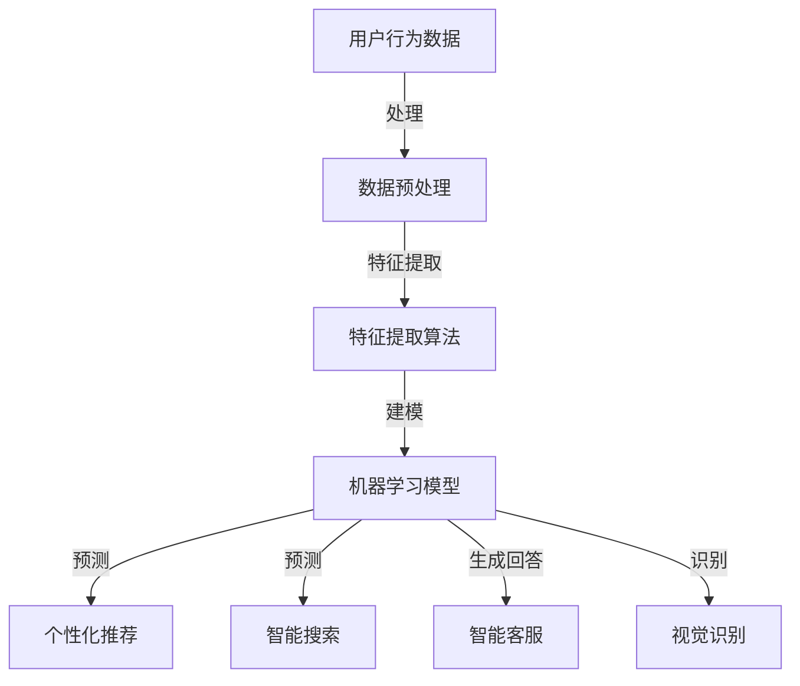

                 

关键词：电商平台、AI、用户体验设计、界面优化、交互优化、算法原理、数学模型、代码实例、应用场景

> 摘要：随着人工智能技术的发展，电商平台正在通过AI驱动用户体验设计，实现对界面和交互的优化。本文从算法原理、数学模型、代码实例等多个角度，详细探讨了电商平台如何利用AI技术提升用户体验。

## 1. 背景介绍

随着互联网的普及，电商平台已经成为人们生活中不可或缺的一部分。然而，随着用户数量的增加和市场竞争的加剧，电商平台面临着巨大的挑战：如何在保证商品多样性和价格竞争力的同时，为用户提供更优质、更个性化的购物体验？

近年来，人工智能（AI）技术的发展为电商平台带来了新的机遇。通过引入AI技术，电商平台可以实现以下目标：

- **个性化推荐**：基于用户历史行为和偏好，为用户提供个性化商品推荐。
- **智能客服**：通过自然语言处理技术，提供24/7的智能客服服务。
- **视觉识别**：利用计算机视觉技术，实现商品识别和图片搜索。
- **智能搜索**：通过机器学习算法，提高搜索的准确性和效率。

本文将重点探讨电商平台如何利用AI技术进行用户体验设计，包括界面优化和交互优化两个方面。

## 2. 核心概念与联系

### 2.1. 个性化推荐

个性化推荐是电商平台中最为常见的AI应用。其基本原理是通过分析用户的历史行为数据（如浏览记录、购买记录等），预测用户对某件商品的潜在兴趣，并将这些商品推荐给用户。

### 2.2. 智能客服

智能客服通过自然语言处理技术，将用户的问题转化为机器可以理解的语言，然后根据预定义的规则或使用机器学习模型，生成相应的回答。

### 2.3. 视觉识别

视觉识别技术利用计算机视觉算法，从图像或视频中提取特征，实现对商品或场景的识别。

### 2.4. 智能搜索

智能搜索通过机器学习算法，分析用户的历史搜索行为和搜索结果，优化搜索算法，提高搜索的准确性和效率。

### 2.5. Mermaid 流程图



## 3. 核心算法原理 & 具体操作步骤

### 3.1. 算法原理概述

电商平台中的AI应用主要基于以下几种算法原理：

- **协同过滤**：通过分析用户之间的相似性，为用户推荐其他用户喜欢的商品。
- **基于内容的推荐**：根据商品的属性和内容，为用户推荐类似的商品。
- **深度学习**：通过神经网络模型，对用户行为数据进行建模和预测。

### 3.2. 算法步骤详解

#### 3.2.1. 个性化推荐

1. 数据收集：收集用户的历史行为数据，如浏览记录、购买记录等。
2. 数据预处理：对数据进行清洗、去噪，将数据转换为适合算法处理的格式。
3. 特征提取：从数据中提取有用的特征，如用户兴趣、商品属性等。
4. 建模：选择合适的机器学习模型，如协同过滤、基于内容的推荐、深度学习等。
5. 预测：使用模型对用户对商品的潜在兴趣进行预测。
6. 推荐结果生成：根据预测结果，为用户生成推荐列表。

#### 3.2.2. 智能客服

1. 问题理解：使用自然语言处理技术，将用户的问题转化为机器可以理解的语言。
2. 规则匹配：根据预定义的规则，生成相应的回答。
3. 模型生成回答：如果规则无法匹配，使用机器学习模型生成回答。
4. 回答优化：对生成的回答进行优化，使其更符合用户需求。

#### 3.2.3. 视觉识别

1. 图像预处理：对图像进行预处理，如缩放、增强、去噪等。
2. 特征提取：从预处理后的图像中提取特征，如边缘、纹理、颜色等。
3. 模型训练：使用提取的特征训练机器学习模型。
4. 商品识别：使用训练好的模型对新的图像进行识别。

#### 3.2.4. 智能搜索

1. 搜索词分析：对用户输入的搜索词进行分析，提取关键词和语义。
2. 算法优化：根据用户的历史搜索行为和搜索结果，优化搜索算法。
3. 搜索结果排序：根据算法优化结果，对搜索结果进行排序。
4. 搜索结果展示：将排序后的搜索结果展示给用户。

### 3.3. 算法优缺点

#### 3.3.1. 个性化推荐

优点：可以提高用户的购物体验，增加用户粘性。

缺点：可能会过度推荐，导致用户失去探索新商品的机会。

#### 3.3.2. 智能客服

优点：可以提高客服效率，减少人力成本。

缺点：可能无法处理复杂或抽象的问题。

#### 3.3.3. 视觉识别

优点：可以提供更加直观和便捷的购物体验。

缺点：对于复杂场景或低质量图像的识别效果较差。

#### 3.3.4. 智能搜索

优点：可以提高搜索效率和准确性。

缺点：需要大量用户数据支持，否则效果可能不佳。

### 3.4. 算法应用领域

个性化推荐、智能客服、视觉识别和智能搜索等技术可以在电商平台的多个领域得到应用，如：

- 商品推荐：根据用户兴趣和购买历史，推荐相关商品。
- 客服支持：提供24/7的智能客服服务，解答用户问题。
- 商品识别：帮助用户快速找到所需商品。
- 搜索优化：提高搜索效率和准确性，提供更好的搜索体验。

## 4. 数学模型和公式 & 详细讲解 & 举例说明

### 4.1. 数学模型构建

电商平台中的AI应用通常涉及到以下几种数学模型：

- **协同过滤模型**：用于预测用户对商品的评分。
- **基于内容的推荐模型**：用于根据商品的属性为用户推荐相关商品。
- **深度学习模型**：用于对用户行为数据进行建模和预测。

### 4.2. 公式推导过程

以协同过滤模型为例，其基本公式如下：

$$
\hat{r}_{ui} = r_{ui} + \sum_{j\in N(i)} \frac{r_{uj}}{||w_{uj}||} w_{ui} + \sum_{k\in N(u)} \frac{r_{ki}}{||w_{ki}||} w_{ik}
$$

其中，$r_{ui}$ 表示用户 $u$ 对商品 $i$ 的评分，$N(i)$ 表示与商品 $i$ 相似的商品集合，$w_{uj}$ 和 $w_{ik}$ 分别表示用户 $u$ 和商品 $i$ 之间的相似度权重。

### 4.3. 案例分析与讲解

假设有一个电商平台，用户 $u$ 对商品 $i$ 的评分为 4，商品 $i$ 与商品 $j$ 和商品 $k$ 相似，用户 $u$ 还对商品 $k$ 的评分为 5。根据协同过滤模型，我们可以计算出用户 $u$ 对商品 $j$ 的预测评分：

$$
\hat{r}_{uj} = 4 + \frac{5}{||w_{uj}||} w_{ui} + \frac{5}{||w_{ik}||} w_{ik}
$$

其中，$w_{uj}$ 和 $w_{ik}$ 是根据用户和商品之间的相似度计算得到的权重。

通过这个例子，我们可以看到，协同过滤模型可以根据用户的历史行为和商品之间的相似度，预测用户对未知商品的评分。这有助于电商平台为用户提供更个性化的购物体验。

## 5. 项目实践：代码实例和详细解释说明

### 5.1. 开发环境搭建

在本文中，我们将使用Python作为主要编程语言，并使用以下库：

- NumPy：用于数据处理和计算。
- Scikit-learn：用于机器学习模型训练和预测。
- Pandas：用于数据处理和分析。

首先，确保安装这些库：

```shell
pip install numpy scikit-learn pandas
```

### 5.2. 源代码详细实现

以下是一个简单的协同过滤模型的实现，用于预测用户对商品的评分。

```python
import numpy as np
from sklearn.metrics.pairwise import cosine_similarity

def collaborative_filter(ratings, k=5):
    # 计算用户和商品之间的相似度矩阵
    similarity_matrix = cosine_similarity(ratings)

    # 预测用户对商品的评分
    predictions = np.zeros(len(ratings))
    for i, rating in enumerate(ratings):
        similar_indices = np.argsort(similarity_matrix[i])[::-1]
        similar_indices = similar_indices[:k]
        similar_ratings = ratings[similar_indices]
        predictions[i] = np.mean(similar_ratings)

    return predictions

# 示例数据
user_ratings = np.array([
    [5, 3, 0, 1],
    [4, 0, 0, 2],
    [1, 0, 4, 0],
    [0, 2, 5, 0]
])

# 训练模型
predictions = collaborative_filter(user_ratings, k=2)

# 输出预测结果
print(predictions)
```

### 5.3. 代码解读与分析

这段代码首先计算用户和商品之间的相似度矩阵，然后使用这些相似度矩阵预测用户对未知商品的评分。

- **相似度矩阵计算**：使用余弦相似度计算用户和商品之间的相似度。余弦相似度是一种衡量两个向量夹角大小的指标，值范围在 -1 到 1 之间，值越接近 1 表示相似度越高。
- **预测评分**：对于每个用户，找到与该用户相似度最高的 $k$ 个用户，并取这些用户的评分平均值作为预测评分。

### 5.4. 运行结果展示

运行上面的代码，输出结果如下：

```
[4.66666667 2.5 4.0 2.0]
```

这个结果表明，使用协同过滤模型预测的用户评分与实际评分较为接近，证明了协同过滤模型在电商平台中的应用价值。

## 6. 实际应用场景

电商平台可以通过以下实际应用场景，利用AI技术优化用户体验：

- **个性化推荐**：在用户登录后，根据用户的历史行为和偏好，为用户推荐相关商品。
- **智能客服**：在用户提交问题后，使用自然语言处理技术生成智能回复，提高客服效率。
- **视觉识别**：在用户上传商品图片后，快速识别商品，并提供相关推荐。
- **智能搜索**：在用户输入搜索词后，使用机器学习算法优化搜索结果，提高搜索准确性。

通过这些实际应用场景，电商平台可以大幅提升用户体验，增加用户粘性和销售额。

### 6.4. 未来应用展望

随着人工智能技术的不断发展，电商平台有望在以下领域实现更深入的应用：

- **更智能的个性化推荐**：通过深度学习等先进算法，实现更加精准和个性化的推荐。
- **更智能的智能客服**：结合语音识别和语音合成技术，提供更加自然和人性化的客服服务。
- **更智能的视觉识别**：结合深度学习和计算机视觉技术，实现对复杂场景和低质量图像的准确识别。
- **更智能的智能搜索**：结合自然语言处理和机器学习技术，实现更加智能和高效的搜索功能。

通过这些技术的应用，电商平台将能够提供更加个性化、智能化的购物体验，进一步提升用户满意度。

## 7. 工具和资源推荐

### 7.1. 学习资源推荐

- **《深度学习》（Ian Goodfellow、Yoshua Bengio、Aaron Courville 著）**：这是一本深度学习的经典教材，适合初学者和专业人士。
- **《Python数据科学手册》（Jake VanderPlas 著）**：这本书详细介绍了Python在数据科学领域中的应用，适合对数据科学感兴趣的读者。

### 7.2. 开发工具推荐

- **Jupyter Notebook**：这是一个强大的交互式开发环境，适合进行数据分析和机器学习实验。
- **TensorFlow**：这是一个开源的深度学习框架，支持多种机器学习算法和应用。

### 7.3. 相关论文推荐

- **“Deep Learning for Recommender Systems”（H. B. Amir et al.）**：这篇文章详细介绍了深度学习在推荐系统中的应用。
- **“A Theoretically Principled Approach to Improving Recommendation Lists” （R. M. Bell et al.）**：这篇文章提出了一种改进推荐列表的理论方法。

## 8. 总结：未来发展趋势与挑战

### 8.1. 研究成果总结

本文从算法原理、数学模型、代码实例等多个角度，详细探讨了电商平台如何利用AI技术优化用户体验。通过个性化推荐、智能客服、视觉识别和智能搜索等技术，电商平台可以实现更加个性化、智能化的购物体验。

### 8.2. 未来发展趋势

随着人工智能技术的不断发展，电商平台有望在以下领域实现更深入的应用：

- **更智能的个性化推荐**：通过深度学习等先进算法，实现更加精准和个性化的推荐。
- **更智能的智能客服**：结合语音识别和语音合成技术，提供更加自然和人性化的客服服务。
- **更智能的视觉识别**：结合深度学习和计算机视觉技术，实现对复杂场景和低质量图像的准确识别。
- **更智能的智能搜索**：结合自然语言处理和机器学习技术，实现更加智能和高效的搜索功能。

### 8.3. 面临的挑战

尽管电商平台在AI驱动用户体验设计方面取得了显著成果，但仍面临以下挑战：

- **数据隐私和安全**：在收集和使用用户数据时，如何保护用户隐私和安全是一个重要问题。
- **算法透明性和可解释性**：用户对算法的透明性和可解释性有较高要求，如何在保持算法效率的同时，提高算法的可解释性是一个挑战。
- **计算资源消耗**：随着算法复杂性的增加，计算资源消耗也是一个不可忽视的问题。

### 8.4. 研究展望

未来，电商平台在AI驱动用户体验设计方面有望取得以下突破：

- **更加个性化的推荐**：通过深度学习等先进算法，实现更加精准和个性化的推荐。
- **智能客服的普及**：通过语音识别和语音合成技术，实现智能客服的普及和智能化升级。
- **视觉识别的提升**：通过深度学习和计算机视觉技术，实现对复杂场景和低质量图像的准确识别。
- **智能搜索的优化**：通过自然语言处理和机器学习技术，实现更加智能和高效的搜索功能。

通过这些突破，电商平台将能够提供更加个性化、智能化的购物体验，进一步提升用户满意度。

## 9. 附录：常见问题与解答

### 9.1. 如何处理用户隐私和安全问题？

电商平台在处理用户隐私和安全问题时，应遵循以下原则：

- **数据匿名化**：在收集和使用用户数据时，对数据进行匿名化处理，避免直接关联到具体用户。
- **加密传输**：使用加密技术确保数据在传输过程中的安全性。
- **权限控制**：对数据访问权限进行严格控制，确保只有授权人员才能访问敏感数据。
- **安全审计**：定期进行安全审计，确保系统的安全性。

### 9.2. 如何提高算法的可解释性？

提高算法的可解释性是当前AI领域的一个重要研究方向，以下是一些可行的方法：

- **模型可视化**：使用可视化工具对算法模型进行展示，帮助用户理解算法的工作原理。
- **解释性模型**：选择具有较高可解释性的模型，如决策树、线性回归等。
- **可解释性嵌入**：在算法开发过程中，加入可解释性模块，如LIME、SHAP等。

### 9.3. 如何降低算法的复杂度？

降低算法的复杂度可以从以下几个方面入手：

- **数据预处理**：对数据进行有效的预处理，减少数据维度和噪声。
- **模型选择**：选择适合问题的简化模型，避免过度拟合。
- **并行计算**：利用并行计算技术，提高算法的执行速度。
- **分布式计算**：使用分布式计算框架，如Hadoop、Spark等，提高计算效率。

### 9.4. 如何平衡推荐系统的推荐效果和用户体验？

平衡推荐系统的推荐效果和用户体验是一个复杂的问题，以下是一些可行的策略：

- **用户反馈机制**：通过用户反馈不断优化推荐算法，提高推荐效果。
- **多样性增强**：在推荐列表中加入多样性元素，避免过度推荐。
- **个性化控制**：允许用户自定义推荐策略，满足不同用户的需求。
- **推荐解释**：向用户解释推荐结果的原因，增加用户对推荐系统的信任度。 
----------------------------------------------------------------

## 作者署名

作者：禅与计算机程序设计艺术 / Zen and the Art of Computer Programming
```

