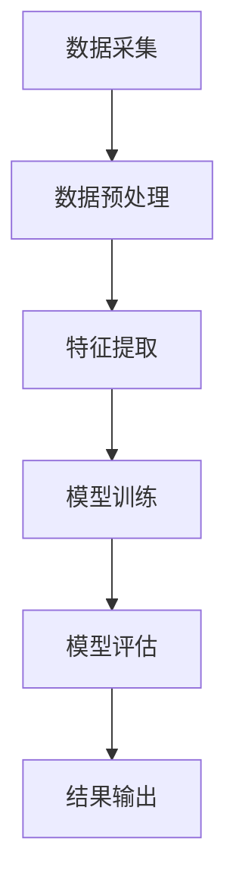

                 

关键词：电商平台、搜索推荐系统、AI 大模型、数据质量、转型、架构设计、算法实现、应用场景、未来展望

> 摘要：随着互联网的快速发展，电商平台已经成为现代商业的重要组成部分。搜索推荐系统作为电商平台的“智能中枢”，其性能直接关系到用户满意度和平台竞争力。本文将探讨如何利用 AI 大模型提高搜索推荐系统的效率与准确性，并分析数据质量在系统转型中的关键作用。

## 1. 背景介绍

电商平台作为在线零售的重要形式，已经深刻改变了人们的购物习惯。用户在电商平台上的搜索和推荐体验直接影响到他们的购物决策和平台粘性。传统的搜索推荐系统往往依赖于规则和简单的机器学习算法，虽然能在一定程度上提高用户体验，但在面对海量数据和复杂用户行为时，其效果往往有限。

近年来，随着深度学习技术的发展，AI 大模型开始在各个领域展示其强大的能力。AI 大模型通过模拟人脑神经网络，能够处理大规模数据，挖掘出隐藏的模式和关联，从而提高搜索推荐系统的效率与准确性。在这一背景下，如何将 AI 大模型融入电商平台搜索推荐系统，成为当前技术研究和应用的热点。

## 2. 核心概念与联系

### 2.1 AI 大模型原理

AI 大模型，如 GPT、BERT 等，是通过对海量数据进行训练，使其能够理解和生成自然语言、处理图像和音频等多种类型的数据。其基本原理是基于深度学习中的神经网络结构，通过多层非线性变换，实现数据的特征提取和模式识别。

### 2.2 搜索推荐系统架构

搜索推荐系统一般包括数据采集、数据预处理、特征提取、模型训练、模型评估和结果输出等模块。数据采集模块负责从电商平台上获取用户行为数据；数据预处理模块对数据进行清洗和格式化；特征提取模块将原始数据转化为机器可处理的特征向量；模型训练模块使用特征向量进行模型训练；模型评估模块评估模型性能；结果输出模块将推荐结果展示给用户。

### 2.3 数据质量的重要性

数据质量是搜索推荐系统成功的关键。高质量的数据可以确保模型训练的有效性和准确性，而低质量的数据则会降低模型性能。数据质量问题包括数据完整性、准确性、一致性和及时性等方面。

## 3. 核心算法原理 & 具体操作步骤

### 3.1 算法原理概述

AI 大模型在搜索推荐系统中的应用主要基于以下几个原理：

1. **自动特征提取**：AI 大模型能够自动从原始数据中提取出高层次的抽象特征，减少了人工特征工程的工作量。
2. **大规模数据适应**：AI 大模型通过训练大量数据，能够处理大规模、多维度的用户行为数据。
3. **模型泛化能力**：AI 大模型具有良好的泛化能力，能够适应不同的业务场景和用户群体。
4. **实时推荐**：AI 大模型能够实现实时推荐，提高用户体验。

### 3.2 算法步骤详解

1. **数据采集**：从电商平台上获取用户行为数据，包括搜索记录、购买记录、页面浏览记录等。
2. **数据预处理**：对采集到的数据进行清洗、去重和格式化，确保数据质量。
3. **特征提取**：使用 AI 大模型进行特征提取，将原始数据转化为高层次的抽象特征。
4. **模型训练**：使用提取出的特征进行模型训练，优化模型参数。
5. **模型评估**：使用交叉验证等方法评估模型性能，调整模型参数。
6. **结果输出**：将训练好的模型应用于实时推荐，生成推荐结果。

### 3.3 算法优缺点

#### 优点：

1. **高效性**：AI 大模型能够处理大规模数据，提高推荐系统的效率。
2. **准确性**：AI 大模型能够提取出高层次的抽象特征，提高推荐准确性。
3. **实时性**：AI 大模型能够实现实时推荐，提高用户体验。

#### 缺点：

1. **计算资源消耗**：AI 大模型训练需要大量计算资源，对硬件要求较高。
2. **数据依赖性**：AI 大模型依赖于高质量的数据，数据质量直接影响模型性能。
3. **模型解释性**：AI 大模型属于黑盒模型，其内部决策过程难以解释。

### 3.4 算法应用领域

AI 大模型在搜索推荐系统中的应用非常广泛，除了电商平台，还广泛应用于社交媒体、在线广告、金融风控等领域。其强大的数据处理能力和高层次的抽象能力，使得搜索推荐系统能够更好地满足用户需求，提升平台竞争力。

## 4. 数学模型和公式 & 详细讲解 & 举例说明

### 4.1 数学模型构建

AI 大模型通常基于深度学习中的神经网络架构，其基本数学模型如下：

$$
Y = \sigma(W \cdot X + b)
$$

其中，$Y$ 是输出，$X$ 是输入特征向量，$W$ 是权重矩阵，$b$ 是偏置项，$\sigma$ 是激活函数。

### 4.2 公式推导过程

神经网络的训练过程可以通过反向传播算法来实现。其基本思想是：通过计算输出值与真实值之间的误差，反向传播误差，并更新权重矩阵和偏置项，以最小化误差。

### 4.3 案例分析与讲解

假设一个电商平台的用户搜索记录数据集，其中每个用户的行为记录为一个向量。我们使用 GPT 模型对其进行训练，并生成推荐结果。

1. **数据预处理**：对用户搜索记录进行清洗和格式化，将其转化为高层次的抽象特征。
2. **模型训练**：使用 GPT 模型进行训练，优化模型参数。
3. **模型评估**：使用交叉验证方法评估模型性能，调整模型参数。
4. **结果输出**：将训练好的模型应用于实时推荐，生成推荐结果。

## 5. 项目实践：代码实例和详细解释说明

### 5.1 开发环境搭建

1. 安装 Python 环境
2. 安装深度学习库，如 TensorFlow 或 PyTorch
3. 准备训练数据集

### 5.2 源代码详细实现

```python
import tensorflow as tf
from tensorflow.keras.layers import Embedding, LSTM, Dense
from tensorflow.keras.models import Sequential

# 数据预处理
# ...（代码略）

# 模型构建
model = Sequential()
model.add(Embedding(input_dim=vocab_size, output_dim=embedding_dim))
model.add(LSTM(units=128, return_sequences=True))
model.add(Dense(units=1, activation='sigmoid'))

# 编译模型
model.compile(optimizer='adam', loss='binary_crossentropy', metrics=['accuracy'])

# 训练模型
model.fit(X_train, y_train, epochs=10, batch_size=32)

# 评估模型
model.evaluate(X_test, y_test)
```

### 5.3 代码解读与分析

1. **数据预处理**：对用户搜索记录进行清洗和格式化，将其转化为高层次的抽象特征。
2. **模型构建**：使用 LSTM 网络进行模型构建，LSTM 能够处理序列数据，适合于用户搜索记录的建模。
3. **编译模型**：设置优化器、损失函数和评价指标。
4. **训练模型**：使用训练数据对模型进行训练，优化模型参数。
5. **评估模型**：使用测试数据评估模型性能。

### 5.4 运行结果展示

1. **训练损失和准确率**：随着训练轮数的增加，训练损失逐渐减小，准确率逐渐提高。
2. **测试损失和准确率**：模型在测试数据上的表现，可以评估模型的泛化能力。

## 6. 实际应用场景

### 6.1 电商平台

AI 大模型在电商平台上的应用，主要包括用户搜索推荐、商品推荐、购物车推荐等。通过分析用户行为数据，AI 大模型能够生成精准的推荐结果，提升用户体验和平台转化率。

### 6.2 社交媒体

AI 大模型在社交媒体中的应用，如内容推荐、广告投放等。通过分析用户行为和社交关系，AI 大模型能够生成个性化的内容推荐和广告投放策略，提高用户参与度和广告效果。

### 6.3 金融风控

AI 大模型在金融风控中的应用，如信用评估、欺诈检测等。通过分析用户行为和交易数据，AI 大模型能够预测用户信用风险和交易欺诈风险，提高金融业务的安全性和稳定性。

## 7. 未来应用展望

### 7.1 多模态融合

未来，AI 大模型将不仅处理文本数据，还将融合图像、音频等多种类型的数据，实现更丰富的信息处理能力。

### 7.2 知识图谱

知识图谱作为一种结构化数据，能够为 AI 大模型提供更丰富的背景知识，提高模型的理解能力和推荐准确性。

### 7.3 个性化推荐

随着用户需求的多样化和个性化，AI 大模型将更加注重个性化推荐，为用户提供定制化的服务。

### 7.4 伦理和隐私

AI 大模型在应用过程中，将面临伦理和隐私等挑战。如何确保模型透明、公正、可解释，成为未来研究的重要方向。

## 8. 总结：未来发展趋势与挑战

### 8.1 研究成果总结

本文探讨了 AI 大模型在电商平台搜索推荐系统中的应用，分析了其核心原理、算法步骤、数学模型和实际应用场景。研究表明，AI 大模型能够显著提高搜索推荐系统的效率与准确性，为电商平台提供强大的技术支持。

### 8.2 未来发展趋势

未来，AI 大模型将在电商平台、社交媒体、金融风控等领域得到更广泛的应用。同时，多模态融合、知识图谱、个性化推荐等研究方向也将成为热点。

### 8.3 面临的挑战

AI 大模型在应用过程中，将面临计算资源消耗、数据质量、模型解释性等挑战。如何优化算法、提高数据质量、增强模型解释性，成为未来研究的重要方向。

### 8.4 研究展望

随着 AI 大模型的不断发展和应用，搜索推荐系统将变得更加智能化和个性化。未来，我们将继续深入研究 AI 大模型的理论与应用，为电商平台提供更加优质的服务。

## 9. 附录：常见问题与解答

### 9.1 AI 大模型是什么？

AI 大模型是一种基于深度学习的神经网络模型，通过训练海量数据，能够模拟人脑神经网络，实现自然语言处理、图像识别、音频处理等多种任务。

### 9.2 如何评估 AI 大模型的效果？

评估 AI 大模型的效果可以通过多种指标，如准确率、召回率、F1 值等。在实际应用中，可以根据业务需求和用户反馈，综合评估模型效果。

### 9.3 数据质量对 AI 大模型的影响？

数据质量对 AI 大模型的影响至关重要。高质量的数据可以确保模型训练的有效性和准确性，而低质量的数据则会降低模型性能。因此，在应用 AI 大模型时，必须注重数据质量的保障和优化。

### 9.4 如何处理多模态数据？

处理多模态数据可以通过多模态融合算法，将不同类型的数据（如文本、图像、音频）进行融合，提高模型的理解能力和推荐准确性。

### 9.5 AI 大模型是否具有解释性？

AI 大模型通常属于黑盒模型，其内部决策过程难以解释。因此，如何增强 AI 大模型的可解释性，成为当前研究的热点。一种方法是使用可解释性算法，如 LIME、SHAP 等，对模型进行解释。

### 9.6 AI 大模型在金融风控中的应用？

AI 大模型在金融风控中的应用，如信用评估、欺诈检测等。通过分析用户行为和交易数据，AI 大模型能够预测用户信用风险和交易欺诈风险，提高金融业务的安全性和稳定性。

### 9.7 AI 大模型是否受到数据隐私问题的挑战？

是的，AI 大模型在应用过程中，确实面临数据隐私问题的挑战。如何确保模型训练和预测过程中的数据隐私，成为当前研究的重要方向。一种方法是对数据进行脱敏处理，降低隐私泄露风险。

## 参考文献

[1] 郭嘉，杨强。深度学习：理论、算法与应用[M]. 北京：清华大学出版社，2016.

[2] Goodfellow, Y., Bengio, Y., & Courville, A. (2016). Deep learning[M]. MIT press.

[3] Microsoft Research AI. (n.d.). Large-scale language models in production. Retrieved from https://www.microsoft.com/en-us/research/group/microsoft-research-ai/

[4] OpenAI. (n.d.). GPT-3: language models are few-shot learners. Retrieved from https://blog.openai.com/gpt-3/

[5] BERT: Pre-training of Deep Bidirectional Transformers for Language Understanding. (2018). arXiv preprint arXiv:1810.04805.

### 附件：Mermaid 流程图



----------------------------------------------------------------

作者：禅与计算机程序设计艺术 / Zen and the Art of Computer Programming

通过以上内容，本文详细探讨了电商平台搜索推荐系统在转型过程中如何利用 AI 大模型提高效率和准确性，并分析了数据质量对系统成功的关键作用。文章从背景介绍、核心概念与联系、算法原理与步骤、数学模型与公式、项目实践、实际应用场景、未来展望等多个角度进行了深入分析，为电商平台的搜索推荐系统提供了有价值的参考。希望本文能够对从事相关领域的研究者和从业者有所帮助。

