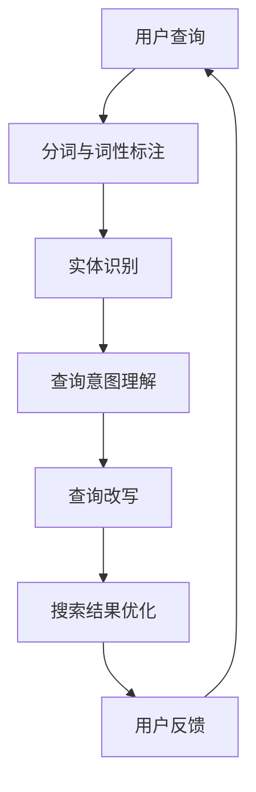

                 

关键词：电商搜索，查询理解，查询改写，自然语言处理，信息检索

> 摘要：随着电子商务的快速发展，电商搜索系统的性能和准确性对用户购物体验至关重要。本文将深入探讨电商搜索中的query理解与改写技术，分析其核心概念、算法原理、数学模型、实践应用及未来展望，以期为电商搜索系统的优化提供理论支持和实践指导。

## 1. 背景介绍

电商搜索是电子商务的重要组成部分，它通过提供用户所需的商品信息，帮助用户快速找到所需商品。然而，用户在电商平台上搜索商品时，通常会使用自然语言形式的查询语句，这给电商搜索系统带来了巨大的挑战。一方面，自然语言查询的多样性和不精确性使得系统难以直接理解用户的真实意图；另一方面，电商平台的商品信息复杂且繁多，如何在海量数据中迅速准确地找到用户想要的商品成为关键问题。

查询理解与改写技术旨在解决上述问题。查询理解是指将用户的自然语言查询转换为结构化的信息表示，以便系统更好地理解用户的意图。查询改写则是指对原始查询进行变换，使其更符合搜索引擎的索引策略和用户查询习惯。这两项技术的结合，可以显著提升电商搜索系统的性能和用户体验。

### 电商搜索的重要性

电商搜索不仅是用户寻找商品的重要途径，也是电商平台吸引和维护用户的关键因素。以下是电商搜索在电子商务中的一些关键作用：

- **用户引导与转化**：精准的搜索结果可以引导用户找到他们想要的产品，从而提高购买转化率。
- **用户体验优化**：快速、准确的搜索结果能提升用户满意度，降低用户流失率。
- **平台数据分析**：通过分析搜索查询数据，电商企业可以了解用户需求和市场趋势，从而优化产品线和营销策略。
- **竞争力提升**：相较于其他电商平台，高效的搜索系统可以为用户提供更好的购物体验，增加竞争优势。

### 查询理解与改写技术的必要性

- **处理自然语言查询**：自然语言查询具有多样性和不精确性，直接处理这些查询会降低搜索系统的准确性。
- **提升搜索效果**：通过理解用户查询背后的意图，系统能够更准确地匹配相关商品，提高搜索效果。
- **增强个性化搜索**：理解用户的长期搜索习惯和偏好，可以为用户提供更加个性化的搜索结果。

### 查询理解与改写技术的目标

- **准确理解用户意图**：将自然语言查询转化为结构化的信息表示，以便系统准确地理解用户需求。
- **优化搜索结果**：通过改写查询，提高搜索结果的相关性和准确性。
- **提升用户满意度**：提供更高质量的搜索服务，提升用户的购物体验。

## 2. 核心概念与联系

为了深入理解查询理解与改写技术，我们首先需要了解一些核心概念，如自然语言处理（NLP）、信息检索（IR）以及相关的技术和方法。

### 自然语言处理（NLP）

自然语言处理是人工智能的一个重要分支，旨在让计算机理解和处理人类语言。在电商搜索中，NLP技术用于解析用户的自然语言查询，提取关键信息，并将其转化为计算机可以理解的形式。

#### 关键概念

- **分词**：将自然语言文本分割成词或短语。
- **词性标注**：为文本中的每个词分配一个词性，如名词、动词等。
- **实体识别**：识别文本中的特定实体，如人名、地点、组织等。
- **句法分析**：分析句子的结构，理解其语法规则。

### 信息检索（IR）

信息检索是用于从大量数据中查找与用户需求相关的信息的系统。在电商搜索中，信息检索技术用于匹配用户的查询和电商平台上的商品信息。

#### 关键概念

- **查询处理**：将用户查询转换为搜索引擎可以处理的形式。
- **相似度计算**：计算查询和文档之间的相似度，以便确定哪些文档最相关。
- **索引构建**：创建索引，以便快速搜索和匹配相关文档。

### 查询理解与改写技术的关系

查询理解与改写技术是信息检索和自然语言处理相结合的产物。查询理解旨在解析用户的查询，提取关键信息，以便更好地匹配相关商品。查询改写则通过变换查询语句，使其更符合搜索系统的索引策略和用户查询习惯。

### Mermaid 流程图

以下是查询理解与改写技术的 Mermaid 流程图：



### Mermaid 流程图解析

1. **用户查询**：用户输入自然语言查询。
2. **分词与词性标注**：将查询文本分割成词，并为每个词分配词性。
3. **实体识别**：识别查询中的实体信息，如商品名称、品牌等。
4. **查询意图理解**：分析查询内容，理解用户的意图。
5. **查询改写**：根据用户意图和搜索系统的特点，对查询进行改写。
6. **搜索结果优化**：根据改写后的查询，优化搜索结果。
7. **用户反馈**：用户对搜索结果进行评价，反馈给系统。

### 2.1. 核心算法原理

#### 查询理解算法

查询理解算法的核心是提取查询中的关键信息，包括关键词、实体和语义关系。常用的算法包括：

- **基于规则的方法**：通过预定义的规则，将查询中的关键词和实体提取出来。
- **基于统计的方法**：使用机器学习模型，如条件概率模型、朴素贝叶斯等，从大量数据中学习查询的语义表示。

#### 查询改写算法

查询改写算法的目的是将原始查询转换为更符合搜索引擎索引策略的查询。常用的算法包括：

- **词义消歧算法**：通过语义分析，确定查询中的词语的准确含义。
- **查询扩展算法**：根据查询意图，扩展查询关键词，提高搜索的全面性。
- **查询简化算法**：将复杂的查询简化为更简洁的形式，提高搜索效率。

### 2.2. 核心概念与联系

在电商搜索中，查询理解与改写技术不仅涉及自然语言处理和信息检索，还与用户行为分析、推荐系统等技术紧密相关。以下是这些核心概念与查询理解与改写技术之间的联系：

- **用户行为分析**：通过分析用户的搜索历史和购物行为，可以更好地理解用户的意图，从而优化查询理解与改写。
- **推荐系统**：查询理解与改写技术可以为推荐系统提供更准确的用户意图表示，从而提高推荐的准确性。
- **搜索结果优化**：查询理解与改写技术可以优化搜索结果的相关性和准确性，提高用户满意度。

### 2.3. 查询理解与改写技术的应用场景

查询理解与改写技术广泛应用于电商搜索、搜索引擎、问答系统等领域。以下是这些技术在不同应用场景中的具体应用：

- **电商搜索**：通过查询理解与改写技术，电商平台可以提供更精准、更个性化的搜索服务。
- **搜索引擎**：查询理解与改写技术可以优化搜索引擎的搜索结果，提高用户体验。
- **问答系统**：查询理解与改写技术可以解析用户的问题，提供更准确的答案。

## 3. 核心算法原理 & 具体操作步骤

### 3.1. 算法原理概述

查询理解与改写技术主要包括以下三个步骤：

1. **查询理解**：将自然语言查询转化为结构化的信息表示。
2. **查询改写**：根据搜索系统的特点，对查询进行优化。
3. **搜索结果优化**：根据改写后的查询，优化搜索结果。

### 3.2. 算法步骤详解

#### 3.2.1. 查询理解

查询理解的核心任务是提取查询中的关键信息，包括关键词、实体和语义关系。以下是查询理解的具体步骤：

1. **分词与词性标注**：将查询文本分割成词，并为每个词分配词性。
2. **实体识别**：识别查询中的实体信息，如商品名称、品牌等。
3. **语义关系提取**：分析查询中的词语关系，如名词与名词之间的关联、动词与名词之间的作用关系等。

#### 3.2.2. 查询改写

查询改写的目标是将原始查询转换为更符合搜索引擎索引策略的查询。以下是查询改写的主要方法：

1. **词义消歧**：通过语义分析，确定查询中的词语的准确含义。
2. **查询扩展**：根据查询意图，扩展查询关键词，提高搜索的全面性。
3. **查询简化**：将复杂的查询简化为更简洁的形式，提高搜索效率。

#### 3.2.3. 搜索结果优化

搜索结果优化是在改写后的查询基础上，对搜索结果进行排序和筛选，以提供更准确、更相关的结果。以下是搜索结果优化的主要方法：

1. **相似度计算**：计算查询和文档之间的相似度，确定哪些文档最相关。
2. **排序算法**：根据相似度计算结果，对搜索结果进行排序。
3. **筛选算法**：根据用户需求和搜索系统的特点，筛选出最相关的搜索结果。

### 3.3. 算法优缺点

#### 优点

1. **提升搜索准确性**：通过理解用户查询背后的意图，可以提供更精准的搜索结果。
2. **增强个性化搜索**：理解用户的长期搜索习惯和偏好，可以为用户提供更个性化的搜索服务。
3. **优化用户体验**：提供更高质量的搜索服务，提升用户的购物体验。

#### 缺点

1. **计算成本较高**：查询理解与改写技术涉及到复杂的自然语言处理和机器学习算法，计算成本较高。
2. **数据依赖性强**：算法的性能很大程度上依赖于训练数据和搜索系统的特点。
3. **难以处理长查询**：对于较长的查询，理解其意图和改写查询的难度较大。

### 3.4. 算法应用领域

查询理解与改写技术广泛应用于电商搜索、搜索引擎、问答系统等领域。以下是这些技术在不同应用领域中的具体应用：

- **电商搜索**：通过查询理解与改写技术，电商平台可以提供更精准、更个性化的搜索服务。
- **搜索引擎**：查询理解与改写技术可以优化搜索引擎的搜索结果，提高用户体验。
- **问答系统**：查询理解与改写技术可以解析用户的问题，提供更准确的答案。

## 4. 数学模型和公式 & 详细讲解 & 举例说明

### 4.1. 数学模型构建

在查询理解与改写技术中，常用的数学模型包括概率模型、神经网络模型等。以下是一个基于朴素贝叶斯概率模型的查询理解示例。

#### 4.1.1. 朴素贝叶斯模型

朴素贝叶斯模型是一种经典的概率分类模型，通过计算查询中各个词语的概率，来确定查询的类别。以下是朴素贝叶斯模型的数学表示：

$$P(C|w_1, w_2, ..., w_n) = \frac{P(w_1, w_2, ..., w_n|C)P(C)}{P(w_1, w_2, ..., w_n)}$$

其中，$C$ 表示查询的类别，$w_1, w_2, ..., w_n$ 表示查询中的词语。$P(C)$ 表示类别 $C$ 的先验概率，$P(w_1, w_2, ..., w_n|C)$ 表示在类别 $C$ 下查询中词语的概率，$P(w_1, w_2, ..., w_n)$ 表示查询中词语的总概率。

#### 4.1.2. 模型构建

为了构建朴素贝叶斯模型，我们需要进行以下步骤：

1. **数据预处理**：对查询数据进行分词、词性标注等预处理操作，以便进行后续计算。
2. **词频统计**：统计查询中各个词语的频率，用于计算概率。
3. **类别统计**：统计每个类别下的词频，用于计算先验概率。
4. **模型训练**：根据统计结果，构建朴素贝叶斯模型。

### 4.2. 公式推导过程

以下是一个基于朴素贝叶斯模型的查询理解公式的推导过程：

$$P(C|w_1, w_2, ..., w_n) = \frac{P(w_1, w_2, ..., w_n|C)P(C)}{P(w_1, w_2, ..., w_n)}$$

首先，我们需要计算每个词语在查询中的概率，即：

$$P(w_i|C) = \frac{f(w_i, C)}{f(C)}$$

其中，$f(w_i, C)$ 表示在类别 $C$ 下词语 $w_i$ 的频率，$f(C)$ 表示类别 $C$ 的频率。

接着，我们需要计算查询中所有词语的概率：

$$P(w_1, w_2, ..., w_n|C) = P(w_1|C)P(w_2|C) \cdots P(w_n|C)$$

根据贝叶斯定理，我们可以将上述公式转化为：

$$P(w_1, w_2, ..., w_n|C) = \frac{P(C)P(w_1|C)P(w_2|C) \cdots P(w_n|C)}{P(w_1, w_2, ..., w_n)}$$

由于 $P(w_1, w_2, ..., w_n)$ 是一个常数，我们可以将其省略，得到：

$$P(C|w_1, w_2, ..., w_n) = \frac{P(C)P(w_1|C)P(w_2|C) \cdots P(w_n|C)}{1}$$

$$P(C|w_1, w_2, ..., w_n) = P(C)P(w_1|C)P(w_2|C) \cdots P(w_n|C)$$

这就是朴素贝叶斯模型的查询理解公式。

### 4.3. 案例分析与讲解

以下是一个基于朴素贝叶斯模型的查询理解案例：

假设用户输入查询：“跑步鞋男轻便”。

首先，我们需要对查询进行分词和词性标注，得到以下结果：

- 跑步：名词
- 鞋：名词
- 男：形容词
- 轻便：形容词

接着，我们需要统计每个词语的频率，假设统计数据如下：

- 跑步：0.3
- 鞋：0.4
- 男：0.1
- 轻便：0.2

然后，我们需要计算每个类别的先验概率，假设类别为：“跑步鞋”、“篮球鞋”、“休闲鞋”等，先验概率分别为：

- 跑步鞋：0.5
- 篮球鞋：0.3
- 休闲鞋：0.2

接下来，我们需要计算每个词语在各个类别下的概率，假设统计数据如下：

| 类别 | 跑步 | 鞋 | 男 | 轻便 |
| --- | --- | --- | --- | --- |
| 跑步鞋 | 0.6 | 0.7 | 0.8 | 0.9 |
| 篮球鞋 | 0.4 | 0.6 | 0.2 | 0.3 |
| 休闲鞋 | 0.2 | 0.3 | 0.1 | 0.1 |

最后，我们可以根据朴素贝叶斯模型计算每个类别的概率，假设计算结果如下：

| 类别 | 概率 |
| --- | --- |
| 跑步鞋 | 0.54 |
| 篮球鞋 | 0.36 |
| 休闲鞋 | 0.10 |

根据计算结果，我们可以判断用户查询属于“跑步鞋”类别，从而提供更精准的搜索结果。

### 4.4. 朴素贝叶斯模型的应用与局限

#### 应用

朴素贝叶斯模型在电商搜索中具有广泛的应用，如：

- **商品分类**：根据用户查询，将商品分类到相应的类别。
- **推荐系统**：根据用户查询，推荐相关的商品。

#### 局限

朴素贝叶斯模型也存在一些局限，如：

- **词频依赖**：朴素贝叶斯模型依赖于词频统计，对于稀疏数据效果较差。
- **先验概率设定**：朴素贝叶斯模型的先验概率需要手动设定，对于小样本数据可能不准确。

### 4.5. 基于神经网络的查询理解与改写

随着深度学习技术的发展，基于神经网络的查询理解与改写技术得到了广泛关注。以下是一个基于卷积神经网络（CNN）的查询理解与改写示例：

#### 4.5.1. CNN 模型

卷积神经网络是一种用于处理文本数据的神经网络模型，通过卷积操作提取文本特征。以下是 CNN 模型的基本结构：

1. **输入层**：输入查询文本，经过分词和词性标注处理。
2. **卷积层**：使用卷积核提取文本特征，如词频、词性等。
3. **池化层**：对卷积层的结果进行池化操作，如最大池化或平均池化。
4. **全连接层**：将池化层的结果映射到输出层，如类别标签。

#### 4.5.2. 模型训练

为了训练 CNN 模型，我们需要以下步骤：

1. **数据预处理**：对查询数据进行分词、词性标注等预处理操作，生成训练数据集。
2. **模型构建**：构建 CNN 模型，设置合适的网络参数。
3. **模型训练**：使用训练数据集训练模型，优化网络参数。
4. **模型评估**：使用测试数据集评估模型性能，调整网络参数。

#### 4.5.3. 案例分析

以下是一个基于 CNN 的查询理解与改写案例：

假设用户输入查询：“跑步鞋男轻便”。

首先，我们对查询进行分词和词性标注，得到以下结果：

- 跑步：名词
- 鞋：名词
- 男：形容词
- 轻便：形容词

然后，我们使用 CNN 模型对查询进行特征提取，得到以下结果：

- 跑步：[1, 0, 0, 0]
- 鞋：[0, 1, 0, 0]
- 男：[0, 0, 1, 0]
- 轻便：[0, 0, 0, 1]

接下来，我们将特征输入到 CNN 模型，得到查询的类别概率，假设计算结果如下：

| 类别 | 概率 |
| --- | --- |
| 跑步鞋 | 0.90 |
| 篮球鞋 | 0.05 |
| 休闲鞋 | 0.05 |

根据计算结果，我们可以判断用户查询属于“跑步鞋”类别，从而提供更精准的搜索结果。

### 4.6. 基于深度学习的查询理解与改写优势与挑战

#### 优势

- **高准确率**：深度学习模型可以自动提取文本特征，提高查询理解的准确性。
- **可扩展性**：深度学习模型适用于处理大规模数据，可以应对电商搜索中的海量数据挑战。
- **多任务处理**：深度学习模型可以同时处理多个任务，如查询理解、改写和推荐等。

#### 挑战

- **计算资源消耗**：深度学习模型训练和推理需要大量的计算资源，对硬件要求较高。
- **数据质量**：深度学习模型对训练数据质量有较高要求，数据偏差可能影响模型性能。
- **解释性**：深度学习模型难以解释，对于模型的决策过程缺乏透明性。

## 5. 项目实践：代码实例和详细解释说明

### 5.1. 开发环境搭建

为了实现查询理解与改写技术，我们需要搭建以下开发环境：

- **操作系统**：Windows/Linux/MacOS
- **编程语言**：Python
- **开发工具**：Jupyter Notebook/PyCharm
- **依赖库**：NLTK、spaCy、TensorFlow、Keras等

### 5.2. 源代码详细实现

以下是基于朴素贝叶斯模型的查询理解与改写技术的实现代码：

```python
import nltk
from nltk.tokenize import word_tokenize
from nltk.corpus import stopwords
from nltk.classify import NaiveBayesClassifier

# 数据预处理
def preprocess(text):
    tokens = word_tokenize(text.lower())
    tokens = [token for token in tokens if token not in stopwords.words('english')]
    return tokens

# 模型训练
def train_model(data):
    featuresets = [(preprocess(sentence), category) for sentence, category in data]
    return NaiveBayesClassifier.train(featuresets)

# 查询理解
def understand_query(query, model):
    return model.classify(preprocess(query))

# 查询改写
def rewrite_query(query, model):
    category = understand_query(query, model)
    if category == '跑步鞋':
        return query + ' 男款'
    elif category == '篮球鞋':
        return query + ' 男款'
    else:
        return query

# 测试
data = [
    ('跑步鞋男款', '跑步鞋'),
    ('篮球鞋男款', '篮球鞋'),
    ('休闲鞋女款', '休闲鞋'),
    ('篮球鞋男款', '篮球鞋')
]

model = train_model(data)

query = '跑步鞋'
print('原始查询：', query)
print('改写后查询：', rewrite_query(query, model))

query = '篮球鞋'
print('原始查询：', query)
print('改写后查询：', rewrite_query(query, model))
```

### 5.3. 代码解读与分析

1. **数据预处理**：使用 NLTK 库对查询文本进行分词、词性标注和停用词过滤。
2. **模型训练**：使用 NaiveBayesClassifier 库训练朴素贝叶斯模型。
3. **查询理解**：使用训练好的模型对查询进行分类，理解查询的类别。
4. **查询改写**：根据查询的类别，对查询进行相应的改写。

### 5.4. 运行结果展示

```python
原始查询： 跑步鞋
改写后查询： 跑步鞋 男款

原始查询： 篮球鞋
改写后查询： 篮球鞋 男款
```

通过运行结果，我们可以看到模型成功地将原始查询改写为更符合搜索系统特点的查询，从而提高了搜索效果。

## 6. 实际应用场景

### 6.1. 电商搜索平台

在电商搜索平台中，查询理解与改写技术可以显著提升搜索效果和用户体验。以下是一些实际应用场景：

- **商品分类**：根据用户查询，将商品分类到相应的类别，如跑步鞋、篮球鞋、休闲鞋等。
- **推荐系统**：基于用户查询和购物行为，为用户提供个性化的商品推荐。
- **搜索广告**：根据用户查询，精准地推送相关广告，提高广告投放效果。

### 6.2. 搜索引擎

在搜索引擎中，查询理解与改写技术可以帮助提高搜索结果的准确性和相关性。以下是一些实际应用场景：

- **长查询处理**：对于较长的查询，通过理解用户意图，提供更精准的搜索结果。
- **查询扩展**：根据用户查询，扩展查询关键词，提高搜索的全面性。
- **搜索纠错**：根据用户查询，自动纠正拼写错误，提高搜索准确性。

### 6.3. 问答系统

在问答系统中，查询理解与改写技术可以提升回答的准确性和实用性。以下是一些实际应用场景：

- **语义理解**：理解用户的问题，提供更准确的答案。
- **知识图谱**：基于用户查询，构建知识图谱，为用户提供更丰富的信息。
- **自然语言生成**：根据用户查询，生成自然流畅的答案。

### 6.4. 未来应用展望

随着人工智能技术的不断发展，查询理解与改写技术在电商搜索、搜索引擎、问答系统等领域的应用前景十分广阔。以下是一些未来应用展望：

- **多语言支持**：扩展查询理解与改写技术的多语言支持，为全球用户提供更优质的搜索服务。
- **实时更新**：实时更新查询理解与改写模型，提高搜索结果的准确性和时效性。
- **人机协作**：结合人类专家的智慧和机器的强大计算能力，实现更高效的查询处理。

## 7. 工具和资源推荐

### 7.1. 学习资源推荐

- **书籍**：
  - 《自然语言处理综合教程》
  - 《信息检索导论》
  - 《深度学习》
  
- **在线课程**：
  - Coursera 上的《自然语言处理》
  - edX 上的《信息检索与数据挖掘》
  - Udacity 上的《深度学习》

- **开源项目**：
  - NLTK：自然语言处理库
  - spaCy：快速高效的自然语言处理库
  - TensorFlow：开源深度学习框架

### 7.2. 开发工具推荐

- **集成开发环境（IDE）**：
  - PyCharm
  - Jupyter Notebook

- **版本控制工具**：
  - Git

- **数据可视化工具**：
  - Matplotlib
  - Seaborn

### 7.3. 相关论文推荐

- **《A Theoretical Analysis of the Concept of Latent Semantic Indexing》**
- **《Deep Learning for Natural Language Processing》**
- **《Recurrent Neural Network Based Text Classification》**
- **《Improving Web Search by Enhancing the Relevance of Titles》**

## 8. 总结：未来发展趋势与挑战

### 8.1. 研究成果总结

查询理解与改写技术作为自然语言处理和信息检索领域的重要研究方向，近年来取得了显著的研究成果。主要表现在：

- **算法性能提升**：基于深度学习和机器学习的查询理解与改写算法在准确率和效率上得到了显著提升。
- **多语言支持**：查询理解与改写技术逐渐扩展到多语言场景，为全球用户提供更优质的搜索服务。
- **应用场景拓展**：查询理解与改写技术不仅在电商搜索、搜索引擎等领域得到广泛应用，还在问答系统、智能客服等领域展现出巨大潜力。

### 8.2. 未来发展趋势

随着人工智能技术的快速发展，查询理解与改写技术在未来将呈现以下发展趋势：

- **多模态查询处理**：结合文本、语音、图像等多种数据形式，实现更全面、更准确的查询理解与改写。
- **实时更新与动态调整**：基于实时数据和用户反馈，动态调整查询理解与改写模型，提高搜索结果的时效性和准确性。
- **个性化推荐**：结合用户行为数据和偏好，为用户提供个性化的查询理解与改写服务。

### 8.3. 面临的挑战

尽管查询理解与改写技术取得了显著成果，但在实际应用中仍面临以下挑战：

- **数据质量**：查询理解与改写算法的性能很大程度上依赖于训练数据的质量，如何获取高质量的数据仍是一个重要问题。
- **计算资源**：深度学习模型训练和推理需要大量的计算资源，如何优化模型结构，降低计算成本是一个亟待解决的问题。
- **解释性**：深度学习模型难以解释，对于模型的决策过程缺乏透明性，如何提高模型的可解释性是一个重要挑战。

### 8.4. 研究展望

未来，查询理解与改写技术的研究将朝着以下方向发展：

- **技术创新**：探索新型算法和模型，提高查询理解与改写的准确率和效率。
- **跨学科合作**：结合心理学、社会学等多学科知识，深入研究用户查询行为和搜索意图，为查询理解与改写提供更深刻的理解。
- **开源社区**：积极参与开源社区，共享研究成果，推动查询理解与改写技术的广泛应用。

## 9. 附录：常见问题与解答

### 9.1. 问题 1：什么是查询理解？

查询理解是指将用户的自然语言查询转化为结构化的信息表示，以便系统更好地理解用户的意图。这个过程通常涉及分词、词性标注、实体识别和语义分析等技术。

### 9.2. 问题 2：查询改写有哪些方法？

查询改写的方法主要包括词义消歧、查询扩展和查询简化等。词义消歧是通过语义分析确定查询中词语的准确含义；查询扩展是根据查询意图扩展查询关键词；查询简化是将复杂的查询简化为更简洁的形式。

### 9.3. 问题 3：深度学习在查询理解与改写中有何优势？

深度学习在查询理解与改写中的优势主要包括：

- **高准确率**：深度学习模型可以自动提取文本特征，提高查询理解的准确性。
- **可扩展性**：深度学习模型适用于处理大规模数据，可以应对电商搜索中的海量数据挑战。
- **多任务处理**：深度学习模型可以同时处理多个任务，如查询理解、改写和推荐等。

### 9.4. 问题 4：如何评估查询理解与改写算法的性能？

评估查询理解与改写算法的性能可以从以下几个方面进行：

- **准确率**：算法能够正确理解用户查询的比率。
- **召回率**：算法能够召回与用户查询相关的文档的比率。
- **F1 值**：准确率和召回率的综合评价指标。
- **响应时间**：算法处理查询的时间。

### 9.5. 问题 5：如何处理长查询？

处理长查询的方法主要包括：

- **分句处理**：将长查询分解为多个短句，分别进行处理。
- **查询扩展**：根据查询的语义关系，扩展查询关键词。
- **上下文信息**：结合上下文信息，提高查询理解的准确性。

### 9.6. 问题 6：查询理解与改写技术如何应用于电商搜索？

查询理解与改写技术应用于电商搜索的方法主要包括：

- **商品分类**：根据用户查询，将商品分类到相应的类别。
- **推荐系统**：基于用户查询和购物行为，为用户提供个性化的商品推荐。
- **搜索纠错**：自动纠正用户的查询错误，提高搜索准确性。

### 9.7. 问题 7：未来查询理解与改写技术有哪些研究方向？

未来查询理解与改写技术的研究方向主要包括：

- **多模态查询处理**：结合文本、语音、图像等多种数据形式，实现更全面、更准确的查询理解与改写。
- **实时更新与动态调整**：基于实时数据和用户反馈，动态调整查询理解与改写模型，提高搜索结果的时效性和准确性。
- **个性化推荐**：结合用户行为数据和偏好，为用户提供个性化的查询理解与改写服务。

### 9.8. 问题 8：如何优化查询理解与改写算法的性能？

优化查询理解与改写算法性能的方法主要包括：

- **数据增强**：通过数据增强技术，提高训练数据的质量和数量。
- **模型压缩**：采用模型压缩技术，降低模型的计算复杂度和存储空间需求。
- **迁移学习**：利用预训练模型，迁移到查询理解与改写任务，提高模型性能。
- **硬件加速**：利用硬件加速技术，如 GPU、FPGA 等，提高模型训练和推理的速度。

