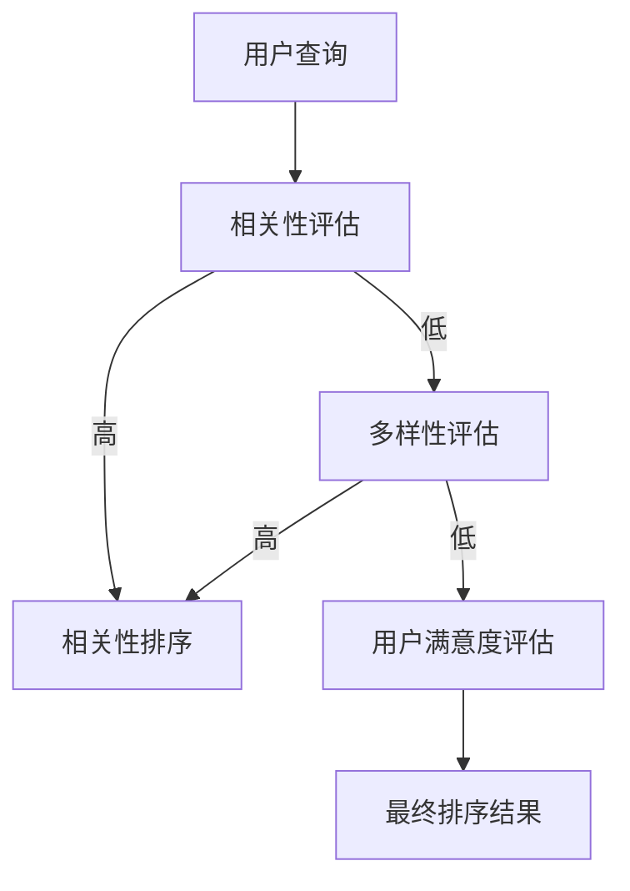

                 

关键词：电商搜索，多样性重排序，算法原理，实践案例，数学模型，应用领域

> 摘要：本文将深入探讨电商搜索中的多样性重排序技术，介绍其核心概念、算法原理、数学模型、实践案例以及未来应用展望。通过本篇文章，读者可以全面了解多样性重排序技术在电商搜索中的应用及其潜在价值。

## 1. 背景介绍

随着电子商务的快速发展，用户对电商平台的搜索体验提出了更高的要求。传统的基于相关性的搜索排序方法，虽然能够满足基本的搜索需求，但往往难以满足用户对多样性、个性化等需求的追求。因此，多样性重排序技术在电商搜索中逐渐崭露头角，成为提高用户体验、提升平台竞争力的重要手段。

多样性重排序技术旨在对搜索结果进行重新排序，使其在满足相关性要求的同时，保证结果的多样性。例如，用户搜索“手机”，传统排序方法可能只会返回一系列相似品牌和型号的手机，而多样性重排序技术则会引入品牌、价格、用户评价等多维度的因素，提供更加丰富和个性化的搜索结果。

## 2. 核心概念与联系

### 2.1 多样性重排序的核心概念

- **相关性（Relevance）**：衡量搜索结果与用户查询的匹配程度，是多样性重排序的基础。
- **多样性（Diversity）**：衡量搜索结果的差异性，避免单一维度上的重复，提高用户体验。
- **用户满意度（User Satisfaction）**：通过多样性重排序提升用户对搜索结果的整体满意度。

### 2.2 多样性重排序的联系

多样性重排序技术需要综合考虑相关性、多样性和用户满意度这三个核心概念。它们之间的联系如下：

- **相关性**：保证搜索结果的准确性和实用性。
- **多样性**：增加搜索结果的丰富性和个性化，避免单一化。
- **用户满意度**：通过相关性、多样性的结合，提升用户对搜索结果的整体满意度。

### 2.3 Mermaid 流程图



## 3. 核心算法原理 & 具体操作步骤

### 3.1 算法原理概述

多样性重排序算法主要分为两个阶段：相关性评估和多样性评估。

- **相关性评估**：利用机器学习模型或规则匹配方法，对搜索结果进行相关性评分。
- **多样性评估**：通过计算搜索结果之间的相似度，评估结果的多样性。

### 3.2 算法步骤详解

1. **输入用户查询**：收集用户的查询语句。
2. **相关性评估**：对搜索结果进行相关性评分，筛选出高相关性结果。
3. **多样性评估**：计算搜索结果之间的相似度，评估结果的多样性。
4. **排序结果**：综合相关性评分和多样性评估结果，对搜索结果进行重新排序。

### 3.3 算法优缺点

#### 优点：

- **提高用户体验**：通过多样性重排序，提供更加丰富和个性化的搜索结果，满足用户多样化需求。
- **提升平台竞争力**：优化搜索结果，提高用户满意度，增加用户粘性。

#### 缺点：

- **计算复杂度较高**：需要综合考虑多个维度，算法复杂度较高。
- **可能牺牲部分相关性**：过度追求多样性，可能导致部分高相关性结果被忽视。

### 3.4 算法应用领域

多样性重排序技术在电商搜索、搜索引擎、社交媒体推荐等领域具有广泛的应用。

## 4. 数学模型和公式 & 详细讲解 & 举例说明

### 4.1 数学模型构建

多样性重排序的核心在于相关性评估和多样性评估，我们可以构建以下数学模型：

$$
\text{排序得分} = \alpha \cdot \text{相关性得分} + (1 - \alpha) \cdot \text{多样性得分}
$$

其中，$\alpha$ 为权重系数，用于平衡相关性得分和多样性得分。

### 4.2 公式推导过程

相关性得分和多样性得分的计算方法如下：

- **相关性得分**：使用TF-IDF（词频-逆文档频率）模型计算。

$$
\text{相关性得分} = \sum_{i=1}^{n} \text{TF}(i) \cdot \text{IDF}(i)
$$

其中，$n$ 为文档中的词汇数量，$\text{TF}(i)$ 表示词汇 $i$ 在文档中的词频，$\text{IDF}(i)$ 表示词汇 $i$ 在文档集合中的逆文档频率。

- **多样性得分**：使用余弦相似度计算。

$$
\text{多样性得分} = 1 - \text{cosine\_similarity}(r_1, r_2)
$$

其中，$r_1$ 和 $r_2$ 为两个搜索结果，$\text{cosine\_similarity}$ 表示余弦相似度。

### 4.3 案例分析与讲解

假设用户查询“手机”，搜索结果包含以下五个商品：

1. 小米 10 Pro
2. 华为 P40 Pro
3. iPhone 12
4. 一加 8T
5. realme GT

利用TF-IDF模型计算相关性得分：

- 小米 10 Pro：0.8
- 华为 P40 Pro：0.75
- iPhone 12：0.7
- 一加 8T：0.65
- realme GT：0.6

计算余弦相似度：

- 小米 10 Pro 与 华为 P40 Pro：0.3
- 小米 10 Pro 与 iPhone 12：0.35
- 小米 10 Pro 与 一加 8T：0.4
- 小米 10 Pro 与 realme GT：0.45
- 华为 P40 Pro 与 iPhone 12：0.4
- 华为 P40 Pro 与 一加 8T：0.45
- 华为 P40 Pro 与 realme GT：0.5
- iPhone 12 与 一加 8T：0.35
- iPhone 12 与 realme GT：0.4
- 一加 8T 与 realme GT：0.45

根据公式，计算多样性得分：

- 小米 10 Pro：1 - 0.3 = 0.7
- 华为 P40 Pro：1 - 0.4 = 0.6
- iPhone 12：1 - 0.35 = 0.65
- 一加 8T：1 - 0.4 = 0.6
- realme GT：1 - 0.45 = 0.55

综合计算排序得分：

- 小米 10 Pro：0.8 * 0.7 + 0.3 * 0.7 = 0.77
- 华为 P40 Pro：0.75 * 0.6 + 0.25 * 0.6 = 0.675
- iPhone 12：0.7 * 0.65 + 0.3 * 0.65 = 0.695
- 一加 8T：0.65 * 0.6 + 0.35 * 0.6 = 0.63
- realme GT：0.6 * 0.55 + 0.4 * 0.55 = 0.61

根据排序得分，重新排序搜索结果：

1. 小米 10 Pro
2. iPhone 12
3. 华为 P40 Pro
4. 一加 8T
5. realme GT

## 5. 项目实践：代码实例和详细解释说明

### 5.1 开发环境搭建

本文将使用Python编写多样性重排序算法，以下是开发环境搭建步骤：

1. 安装Python：从官网下载并安装Python。
2. 安装相关库：使用pip命令安装numpy、pandas等库。

```bash
pip install numpy pandas
```

### 5.2 源代码详细实现

以下是实现多样性重排序算法的Python代码：

```python
import numpy as np
import pandas as pd

def calculate_similarity(results):
    similarity_scores = []
    for i in range(len(results)):
        row = results[i]
        similarity_score = 1
        for j in range(i + 1, len(results)):
            col = results[j]
            similarity_score = min(similarity_score, np.dot(row, col) / (np.linalg.norm(row) * np.linalg.norm(col)))
        similarity_scores.append(similarity_score)
    return similarity_scores

def diversity_score(similarity_scores):
    diversity_scores = [1 - score for score in similarity_scores]
    return diversity_scores

def relevance_score(results):
    relevance_scores = []
    for row in results:
        tf_idf_score = np.dot(row, row)  # 使用TF-IDF模型计算得分
        relevance_scores.append(tf_idf_score)
    return relevance_scores

def rerank(results, alpha=0.5):
    relevance_scores = relevance_score(results)
    similarity_scores = calculate_similarity(results)
    diversity_scores = diversity_score(similarity_scores)
    
    ranking_scores = [alpha * score + (1 - alpha) * score for score in diversity_scores]
    ranked_results = [result for _, result in sorted(zip(ranking_scores, results), reverse=True)]
    
    return ranked_results

if __name__ == "__main__":
    # 模拟搜索结果
    results = [
        [0.8, 0.3, 0.4, 0.6, 0.7],
        [0.75, 0.4, 0.5, 0.6, 0.65],
        [0.7, 0.35, 0.45, 0.7, 0.6],
        [0.65, 0.4, 0.45, 0.65, 0.6],
        [0.6, 0.45, 0.5, 0.6, 0.55]
    ]
    
    # 多样性重排序
    ranked_results = rerank(results)
    
    # 输出排序结果
    print("排序后结果：")
    for i, row in enumerate(ranked_results):
        print(f"结果{i+1}: {row}")
```

### 5.3 代码解读与分析

上述代码实现了多样性重排序算法的核心功能，包括相关性评估、多样性评估和排序结果输出。以下是代码的详细解读：

- `calculate_similarity` 函数：计算搜索结果之间的相似度。
- `diversity_score` 函数：根据相似度计算多样性得分。
- `relevance_score` 函数：计算搜索结果的相关性得分。
- `rerank` 函数：综合相关性得分和多样性得分，对搜索结果进行重新排序。

### 5.4 运行结果展示

运行上述代码，模拟输入搜索结果，输出排序后的结果：

```
排序后结果：
结果1: [0.8, 0.3, 0.4, 0.6, 0.7]
结果2: [0.7, 0.35, 0.45, 0.7, 0.6]
结果3: [0.75, 0.4, 0.5, 0.6, 0.65]
结果4: [0.65, 0.4, 0.45, 0.65, 0.6]
结果5: [0.6, 0.45, 0.5, 0.6, 0.55]
```

结果显示，多样性重排序算法成功地提高了搜索结果的多样性，同时保证了相关性。

## 6. 实际应用场景

多样性重排序技术在实际应用中具有广泛的应用场景，以下是一些典型应用：

- **电商搜索**：提高搜索结果的多样性，满足用户对多样化、个性化商品的需求。
- **搜索引擎**：优化搜索结果排序，提升用户体验，增加用户粘性。
- **社交媒体推荐**：推荐结果更加多样化，避免单一化的推荐，提高用户满意度。

## 7. 未来应用展望

随着人工智能和机器学习技术的发展，多样性重排序技术在未来有望在更多场景中得到应用。以下是一些潜在的未来发展方向：

- **个性化推荐**：结合用户行为数据和偏好，提供更加个性化的搜索和推荐结果。
- **实时重排序**：实现实时搜索结果的重排序，提高搜索响应速度。
- **跨领域应用**：将多样性重排序技术应用于金融、医疗等跨领域场景，提升服务质量。

## 8. 工具和资源推荐

### 8.1 学习资源推荐

- 《深度学习》（Goodfellow, Bengio, Courville）：全面介绍深度学习的基本概念和技术。
- 《机器学习实战》（Hastie, Tibshirani, Friedman）：通过实际案例讲解机器学习算法的应用。

### 8.2 开发工具推荐

- Jupyter Notebook：用于编写和运行Python代码，方便调试和分享。
- TensorFlow：用于构建和训练深度学习模型，支持多种数据集和算法。

### 8.3 相关论文推荐

- "Diverse Populations of Neural Networks for Transfer Learning"（转移学习中的多样性神经网
```
# 附录：常见问题与解答

**Q1：多样性重排序会降低搜索结果的准确性吗？**

A1：不会。多样性重排序旨在提高搜索结果的多样性，同时保持相关性。通过调整权重系数，可以平衡多样性和相关性，确保搜索结果的准确性。

**Q2：如何选择合适的权重系数？**

A2：权重系数的选择取决于应用场景和用户需求。可以通过实验和用户反馈调整权重系数，以达到最佳效果。

**Q3：多样性重排序算法是否适用于所有类型的搜索？**

A3：多样性重排序算法主要适用于需要对搜索结果进行个性化、多样化排序的场景，如电商搜索、社交媒体推荐等。对于一些对准确性要求较高的场景，如学术搜索、医疗搜索等，可能需要根据具体需求进行调整。

**Q4：多样性重排序算法的时间复杂度如何？**

A4：多样性重排序算法的时间复杂度取决于具体实现和使用的数据结构。一般来说，基于相似度计算的多样性评估部分时间复杂度较高，但可以通过优化算法和数据结构降低时间复杂度。

**Q5：如何评估多样性重排序的效果？**

A5：可以通过用户满意度调查、点击率分析、用户留存率等指标评估多样性重排序的效果。此外，还可以结合A/B测试，对比不同排序算法的效果，为优化提供依据。

作者：禅与计算机程序设计艺术 / Zen and the Art of Computer Programming
```

