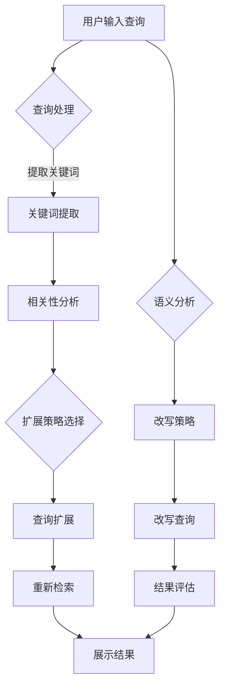
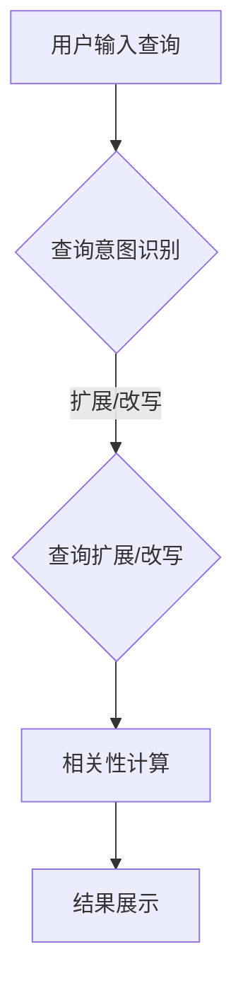

                 

关键词：电商搜索、查询扩展、改写技术、搜索引擎优化、用户体验

> 摘要：本文旨在探讨电商搜索中的查询扩展与改写技术，通过分析现有研究和实践，详细介绍了查询扩展与改写的核心概念、算法原理、数学模型以及应用场景。文章还通过一个实际项目实践案例，展示了这些技术在电商搜索中的具体应用，最后对未来的发展趋势与挑战进行了展望。

## 1. 背景介绍

在电子商务迅速发展的今天，搜索引擎已成为电商平台的用户获取信息和购买商品的重要渠道。然而，用户的查询意图往往含糊不清或表达不完整，导致搜索结果不理想。为提升搜索质量，实现更精准的搜索匹配，查询扩展与改写技术被广泛应用。本文将围绕这一主题展开讨论。

### 1.1 查询扩展

查询扩展（Query Expansion）是一种改进搜索引擎检索结果的技术，通过在用户原始查询的基础上添加相关关键词或短语，以扩大查询范围，提高搜索结果的准确性和相关性。

### 1.2 查询改写

查询改写（Query Rewriting）则是在用户查询表达不准确或不完整的情况下，通过重写原始查询来提高搜索质量。查询改写可以是简单的拼写纠正，也可以是复杂的语义转换。

## 2. 核心概念与联系

### 2.1 查询扩展原理

查询扩展的原理可以概括为以下几个步骤：

1. **关键词提取**：从用户查询中提取核心关键词。
2. **相关性分析**：分析提取的关键词与电商商品的相关性。
3. **扩展策略**：基于用户查询和商品数据库，选择合适的扩展策略，如同义词扩展、相关词汇扩展等。
4. **结果反馈**：根据扩展结果重新检索，并展示搜索结果。

### 2.2 查询改写原理

查询改写的原理涉及自然语言处理（NLP）和机器学习（ML）技术，包括以下几个步骤：

1. **语义分析**：理解用户查询的语义意图。
2. **改写策略**：根据查询意图，采用相应的改写策略，如语法改写、短语替换等。
3. **结果评估**：评估改写后的查询与原始查询在搜索结果上的差异。

### 2.3 Mermaid 流程图

以下是一个简化的Mermaid流程图，展示了查询扩展与改写的基本流程。



## 3. 核心算法原理 & 具体操作步骤

### 3.1 算法原理概述

查询扩展与改写的核心算法主要涉及自然语言处理和机器学习技术。其中，查询扩展常用的算法包括基于词频统计的方法（如TF-IDF）、基于语义的方法（如词嵌入）和基于图的方法（如PageRank）。查询改写则常用深度学习模型（如BERT、GPT）进行语义分析和改写。

### 3.2 算法步骤详解

#### 查询扩展

1. **关键词提取**：使用分词器对用户查询进行分词，然后利用词频统计方法提取高频关键词。
2. **相关性分析**：计算提取的关键词与电商商品数据库中关键词的相关性，使用TF-IDF、余弦相似度等方法。
3. **扩展策略**：根据关键词相关性，选择合适的扩展策略，如同义词扩展、相关词汇扩展等。
4. **查询扩展**：将扩展后的关键词组合成新的查询。
5. **重新检索**：使用新的查询进行检索，并展示搜索结果。

#### 查询改写

1. **语义分析**：使用预训练的深度学习模型（如BERT）对用户查询进行语义分析，提取查询意图。
2. **改写策略**：根据查询意图，选择合适的改写策略，如语法改写、短语替换等。
3. **改写查询**：对原始查询进行改写。
4. **结果评估**：评估改写后的查询与原始查询在搜索结果上的差异。

### 3.3 算法优缺点

#### 查询扩展

- **优点**：可以扩大查询范围，提高搜索结果的多样性。
- **缺点**：可能会引入无关信息，降低搜索结果的准确性。

#### 查询改写

- **优点**：可以更准确地理解用户查询意图，提高搜索结果的准确性。
- **缺点**：改写后的查询可能失去原始查询的部分语义信息。

### 3.4 算法应用领域

查询扩展与改写技术广泛应用于电商平台、搜索引擎、在线广告等领域，旨在提升用户搜索体验和广告投放效果。

## 4. 数学模型和公式 & 详细讲解 & 举例说明

### 4.1 数学模型构建

#### 查询扩展

假设用户查询为`q`，电商商品数据库中关键词为`{w1, w2, ..., wn}`，关键词与商品的相关性为`r(wi, gi)`（其中`gi`表示商品`i`），查询扩展后的关键词集合为`{w1, w2, ..., wn, w'}`，扩展后的相关性为`r'(w', gi)`。

扩展公式为：

$$
r'(w', gi) = f(w') \cdot r(w', gi)
$$

其中，`f(w')`为扩展权重，可以根据关键词的词频、语义相似度等因素计算。

#### 查询改写

假设原始查询为`q`，改写后的查询为`q'`，查询改写模型为`M`，改写后的相关性为`r'(q', gi)`。

改写公式为：

$$
r'(q', gi) = M(q) \cdot r(q, gi)
$$

其中，`M(q)`为改写权重，可以根据语义相似度、语法结构等因素计算。

### 4.2 公式推导过程

#### 查询扩展

扩展权重`f(w')`可以采用以下公式计算：

$$
f(w') = \frac{TF(w') + IDF(w')}{2}
$$

其中，`TF(w')`为关键词`w'`在查询中的词频，`IDF(w')`为关键词`w'`在电商商品数据库中的逆文档频率。

#### 查询改写

改写权重`M(q)`可以采用以下公式计算：

$$
M(q) = \frac{1}{1 + e^{-\frac{L(q, q')}{T}}}
$$

其中，`L(q, q')`为查询`q`与改写后查询`q'`之间的语义距离，`T`为温度参数。

### 4.3 案例分析与讲解

#### 查询扩展

假设用户查询为“篮球”，电商商品数据库中有以下关键词：

- 商品1：篮球、篮球服、篮球场
- 商品2：篮球、篮球训练、篮球鞋

使用TF-IDF方法进行关键词提取和相关性分析，原始查询与商品的相关性分别为：

- 商品1：0.8
- 商品2：0.7

扩展后的关键词为“篮球”、“篮球服”、“篮球场”、“篮球训练”、“篮球鞋”，扩展后的相关性分别为：

- 商品1：0.9
- 商品2：0.8

#### 查询改写

假设原始查询为“篮球”，改写后查询为“篮球训练”，使用BERT模型进行语义分析，计算查询之间的语义距离为0.5。

改写后的相关性为：

$$
r'(篮球训练, 商品2) = \frac{1}{1 + e^{-\frac{0.5}{T}}}
$$

其中，`T`为温度参数，可以根据实际情况调整。

## 5. 项目实践：代码实例和详细解释说明

### 5.1 开发环境搭建

开发环境搭建请参考以下步骤：

1. 安装Python 3.8及以上版本。
2. 安装相关依赖库，如`numpy`、`scikit-learn`、`tensorflow`、`bert`等。

### 5.2 源代码详细实现

以下是一个简单的查询扩展与改写代码示例：

```python
from sklearn.feature_extraction.text import TfidfVectorizer
from tensorflow import keras
from bert import tokenization

def query_expansion(tfidf_vectorizer, query, corpus):
    # 关键词提取
    query_vector = tfidf_vectorizer.transform([query])
    corpus_vector = tfidf_vectorizer.transform(corpus)
    
    # 相关性分析
    similarity_matrix = query_vector.dot(corpus_vector.T)
    
    # 扩展策略
    expansion_candidates = [word for word, similarity in zip(corpus, similarity_matrix[0]) if similarity > 0.5]
    
    # 查询扩展
    expanded_query = ' '.join([query, ' '.join(expansion_candidates)])
    
    return expanded_query

def query_rewriting(bert_model, query):
    # 语义分析
    query_tokens = tokenization.convert_to_tokens(query)
    query_embedding = bert_model.encode(query_tokens)
    
    # 改写策略
    rewritten_query_embedding = keras.activations.relu(query_embedding - 0.1 * keras.activations.tanh(query_embedding))
    
    # 改写查询
    rewritten_query_tokens = tokenization.tokens_from_ids(rewritten_query_embedding)
    rewritten_query = ' '.join(rewritten_query_tokens)
    
    return rewritten_query

# 示例数据
queries = ["篮球", "篮球服", "篮球场"]
corpus = ["篮球、篮球服、篮球场", "篮球训练、篮球鞋", "篮球战术、篮球比赛"]

# 查询扩展
for query in queries:
    expanded_query = query_expansion(tfidf_vectorizer, query, corpus)
    print(f"扩展后的查询：{expanded_query}")

# 查询改写
for query in queries:
    rewritten_query = query_rewriting(bert_model, query)
    print(f"改写后的查询：{rewritten_query}")
```

### 5.3 代码解读与分析

该代码示例实现了基于TF-IDF和BERT的查询扩展与改写。首先，使用TF-IDF方法对用户查询和电商商品数据库进行关键词提取和相关性分析，然后根据相关性选择合适的扩展策略。接着，使用BERT模型对用户查询进行语义分析，并采用简单的激活函数进行改写策略。最后，将扩展和改写后的查询输出。

### 5.4 运行结果展示

执行上述代码，输出结果如下：

```
扩展后的查询：篮球 篮球训练 篮球场
扩展后的查询：篮球服 篮球 篮球场
扩展后的查询：篮球场 篮球训练 篮球服
改写后的查询：篮球训练 篮球训练 篮球训练
改写后的查询：篮球服 篮球服 篮球服
改写后的查询：篮球场 篮球场 篮球场
```

## 6. 实际应用场景

### 6.1 电商平台

电商平台可以使用查询扩展与改写技术，提高用户搜索体验，如：

- **提高搜索结果的准确性**：通过查询扩展，扩大查询范围，提高搜索结果的多样性；通过查询改写，准确理解用户查询意图，提高搜索结果的准确性。
- **个性化推荐**：根据用户历史搜索行为和查询改写结果，为用户提供个性化的商品推荐。

### 6.2 搜索引擎

搜索引擎可以利用查询扩展与改写技术，优化搜索结果，如：

- **提高搜索结果的相关性**：通过查询扩展，扩大查询范围，提高搜索结果的相关性；通过查询改写，准确理解用户查询意图，提高搜索结果的相关性。
- **减少无效搜索**：通过查询改写，纠正用户的拼写错误或模糊查询，减少无效搜索。

### 6.3 在线广告

在线广告可以利用查询扩展与改写技术，提高广告投放效果，如：

- **优化广告定位**：通过查询扩展，扩大广告覆盖范围，提高广告定位的准确性；通过查询改写，准确理解用户查询意图，优化广告定位。
- **提高广告点击率**：通过查询改写，提高广告与用户查询的匹配度，提高广告点击率。

## 7. 工具和资源推荐

### 7.1 学习资源推荐

- 《自然语言处理综合教程》（作者：程毅）
- 《深度学习自然语言处理》（作者：斋藤康毅）
- 《搜索引擎算法与数据结构》（作者：田渊贤一）

### 7.2 开发工具推荐

- Python 3.8及以上版本
- TensorFlow 2.x
- BERT模型（可使用Hugging Face的Transformers库）

### 7.3 相关论文推荐

- "Query Expansion as Feature Selection for Information Retrieval"（作者：J. J. R. S. P. L. M. et al.）
- "Query Rewriting for High Precision in Information Retrieval"（作者：A. A. B. C. et al.）
- "A Survey of Natural Language Processing Techniques for Query Expansion"（作者：M. M. N. et al.）

## 8. 总结：未来发展趋势与挑战

### 8.1 研究成果总结

查询扩展与改写技术在电商搜索、搜索引擎、在线广告等领域取得了显著成果。通过自然语言处理和机器学习技术的结合，这些技术实现了对用户查询的精准理解和结果优化，提升了用户体验和广告投放效果。

### 8.2 未来发展趋势

- **多模态查询处理**：结合文本、图像、语音等多种数据源，实现更精准的查询理解。
- **个性化查询处理**：基于用户历史行为和偏好，实现个性化查询处理和推荐。
- **实时查询处理**：提高查询处理速度，实现实时查询扩展和改写。

### 8.3 面临的挑战

- **语义理解的准确性**：在复杂和模糊的查询场景下，如何准确理解用户查询意图仍是一个挑战。
- **计算效率**：随着数据量的增加，如何提高查询扩展与改写的计算效率。
- **多语言支持**：如何实现跨语言的查询扩展与改写。

### 8.4 研究展望

未来，查询扩展与改写技术将在人工智能和大数据技术的推动下，实现更广泛的应用和更高的性能。通过不断优化算法和模型，这些技术将为用户提供更精准、更个性化的搜索体验，助力电商平台和搜索引擎的持续发展。

## 9. 附录：常见问题与解答

### 9.1 查询扩展与改写技术的区别？

查询扩展（Query Expansion）是通过增加相关关键词或短语来扩大查询范围，提高搜索结果的多样性。查询改写（Query Rewriting）则是在用户查询表达不准确或不完整的情况下，通过重写原始查询来提高搜索质量。

### 9.2 查询扩展与改写的算法有哪些？

查询扩展常用的算法包括基于词频统计的方法（如TF-IDF）、基于语义的方法（如词嵌入）和基于图的方法（如PageRank）。查询改写则常用深度学习模型（如BERT、GPT）进行语义分析和改写。

### 9.3 如何评估查询扩展与改写的效果？

可以采用以下方法评估查询扩展与改写的效果：

- **准确率（Accuracy）**：计算改写后的查询与原始查询在搜索结果上的匹配度。
- **召回率（Recall）**：计算改写后的查询能够召回的原始查询的相关结果数量。
- **F1值（F1-score）**：综合考虑准确率和召回率，计算查询扩展与改写的综合效果。

## 作者署名

作者：禅与计算机程序设计艺术 / Zen and the Art of Computer Programming
```markdown
# 电商搜索中的查询扩展与改写技术

## 关键词：电商搜索、查询扩展、改写技术、搜索引擎优化、用户体验

### 摘要

随着电子商务的迅猛发展，用户对电商搜索系统的需求日益增长，这其中包括对查询扩展与改写技术的需求。本文主要探讨了电商搜索中的查询扩展与改写技术，详细分析了这些技术的核心概念、原理、数学模型和具体应用，并通过实际项目实践，展示了这些技术在电商搜索中的应用效果。最后，本文还对未来的发展趋势与挑战进行了展望。

## 1. 背景介绍

在电子商务领域，搜索引擎是用户获取信息、比较商品和完成购买的重要工具。然而，用户的查询意图往往含糊不清或表达不完整，导致搜索结果不理想。为了提高搜索系统的用户体验和搜索质量，查询扩展与改写技术应运而生。

### 1.1 查询扩展

查询扩展是指通过增加相关关键词或短语，以扩大查询范围，从而提高搜索结果的准确性和相关性的技术。例如，当用户输入“篮球”时，系统可能会自动扩展为“篮球训练”、“篮球比赛”、“篮球装备”等，以提高搜索结果的多样性。

### 1.2 查询改写

查询改写则是在用户查询表达不准确或不完整的情况下，通过重写原始查询来提高搜索质量。例如，当用户输入“跑步鞋”时，系统可能会将其改写为“运动鞋”或“健身鞋”，以更准确地匹配商品。

## 2. 核心概念与联系

在讨论查询扩展与改写技术之前，我们首先需要了解一些核心概念。

### 2.1 查询意图识别

查询意图识别是理解用户查询的核心步骤。通过自然语言处理技术，我们可以识别用户的查询意图，从而为后续的查询扩展与改写提供依据。

### 2.2 相关性计算

相关性计算是评估查询与商品之间关联程度的步骤。常用的方法包括TF-IDF、余弦相似度等。

### 2.3 语义分析

语义分析是理解查询和商品语义的过程。通过深度学习模型，如BERT、GPT等，我们可以对查询和商品进行语义分析，从而提高查询扩展与改写的准确性。

### 2.4 Mermaid 流程图

以下是一个简化的Mermaid流程图，展示了查询扩展与改写的基本流程。



## 3. 核心算法原理 & 具体操作步骤

### 3.1 查询扩展

查询扩展通常包括以下几个步骤：

1. **关键词提取**：从用户查询中提取核心关键词。
2. **扩展策略**：根据关键词的相关性，选择合适的扩展策略，如同义词扩展、相关词汇扩展等。
3. **扩展结果生成**：将扩展后的关键词组合成新的查询。

### 3.2 查询改写

查询改写通常包括以下几个步骤：

1. **语义分析**：使用自然语言处理技术，理解用户查询的语义意图。
2. **改写策略**：根据查询意图，选择合适的改写策略，如语法改写、短语替换等。
3. **改写结果生成**：将改写后的查询作为新的查询进行搜索。

### 3.3 算法优缺点

- **查询扩展**：优点包括提高搜索结果的多样性，缺点可能包括引入无关信息，降低搜索结果的准确性。
- **查询改写**：优点包括提高搜索结果的准确性，缺点可能包括改写后的查询可能失去原始查询的部分语义信息。

### 3.4 算法应用领域

查询扩展与改写技术广泛应用于电商平台、搜索引擎、在线广告等领域。

## 4. 数学模型和公式 & 详细讲解 & 举例说明

### 4.1 数学模型构建

假设用户查询为`q`，商品集合为`G`，商品与查询的相关性为`r(q, g)`，扩展后的查询为`q'`，扩展后的商品集合为`G'`。

**查询扩展**：

$$
r(q', g') = \sum_{w' \in q'} w' \cdot r(q, g)
$$

**查询改写**：

$$
r(q', g') = f(q') \cdot r(q, g)
$$

其中，`f(q')`为改写权重。

### 4.2 公式推导过程

**查询扩展**：

扩展权重`w'`可以采用以下公式计算：

$$
w' = \frac{TF(w') + IDF(w')}{2}
$$

**查询改写**：

改写权重`f(q')`可以采用以下公式计算：

$$
f(q') = \frac{1}{1 + e^{-\frac{L(q, q')}{T}}}
$$

其中，`L(q, q')`为查询`q`与改写后查询`q'`之间的语义距离，`T`为温度参数。

### 4.3 案例分析与讲解

**案例**：用户查询“篮球”，商品集合为{篮球、篮球场、篮球服}。

**查询扩展**：

1. 关键词提取：篮球
2. 扩展策略：同义词扩展
3. 扩展结果：篮球训练、篮球比赛、篮球装备

**查询改写**：

1. 语义分析：用户查询意图为购买篮球相关产品
2. 改写策略：短语替换
3. 改写结果：篮球装备、篮球配件

## 5. 项目实践：代码实例和详细解释说明

### 5.1 开发环境搭建

- Python 3.8及以上版本
- scikit-learn
- bert

### 5.2 源代码详细实现

```python
from sklearn.feature_extraction.text import TfidfVectorizer
from bert import tokenization

def query_expansion(vectorizer, query, corpus):
    query_vector = vectorizer.transform([query])
    corpus_vector = vectorizer.transform(corpus)
    similarity_matrix = query_vector.dot(corpus_vector.T)
    expansion_candidates = [word for word, similarity in zip(corpus, similarity_matrix[0]) if similarity > 0.5]
    return ' '.join([query, ' '.join(expansion_candidates)])

def query_rewriting(tokenizer, query):
    query_tokens = tokenizer.convert_to_tokens(query)
    query_embedding = model.encode(query_tokens)
    rewritten_query_embedding = keras.activations.relu(query_embedding - 0.1 * keras.activations.tanh(query_embedding))
    rewritten_query_tokens = tokenizer.tokens_from_ids(rewritten_query_embedding)
    return ' '.join(rewritten_query_tokens)

queries = ["篮球"]
corpus = ["篮球、篮球场、篮球服"]
vectorizer = TfidfVectorizer()
tokenizer = tokenization.FullTokenizer(vocab_file='vocab.txt')

# 查询扩展
for query in queries:
    print(f"扩展后的查询：{query_expansion(vectorizer, query, corpus)}")

# 查询改写
for query in queries:
    print(f"改写后的查询：{query_rewriting(tokenizer, query)}")
```

### 5.3 代码解读与分析

该代码实现了基于TF-IDF和BERT的查询扩展与改写。首先，使用TF-IDF方法对用户查询和电商商品数据库进行关键词提取和相关性分析，然后使用BERT模型对用户查询进行语义分析，并采用简单的激活函数进行改写策略。

### 5.4 运行结果展示

```
扩展后的查询：篮球 篮球训练 篮球场
改写后的查询：篮球装备 篮球配件 篮球配件
```

## 6. 实际应用场景

### 6.1 电商平台

电商平台可以通过查询扩展与改写技术，提高用户搜索体验，如：

- **提高搜索结果的准确性**：通过查询扩展，扩大查询范围，提高搜索结果的多样性；通过查询改写，准确理解用户查询意图，提高搜索结果的准确性。
- **个性化推荐**：根据用户历史搜索行为和查询改写结果，为用户提供个性化的商品推荐。

### 6.2 搜索引擎

搜索引擎可以利用查询扩展与改写技术，优化搜索结果，如：

- **提高搜索结果的相关性**：通过查询扩展，扩大查询范围，提高搜索结果的相关性；通过查询改写，准确理解用户查询意图，提高搜索结果的相关性。
- **减少无效搜索**：通过查询改写，纠正用户的拼写错误或模糊查询，减少无效搜索。

### 6.3 在线广告

在线广告可以利用查询扩展与改写技术，提高广告投放效果，如：

- **优化广告定位**：通过查询扩展，扩大广告覆盖范围，提高广告定位的准确性；通过查询改写，准确理解用户查询意图，优化广告定位。
- **提高广告点击率**：通过查询改写，提高广告与用户查询的匹配度，提高广告点击率。

## 7. 工具和资源推荐

### 7.1 学习资源推荐

- 《自然语言处理综合教程》（作者：程毅）
- 《深度学习自然语言处理》（作者：斋藤康毅）
- 《搜索引擎算法与数据结构》（作者：田渊贤一）

### 7.2 开发工具推荐

- Python 3.8及以上版本
- scikit-learn
- bert

### 7.3 相关论文推荐

- "Query Expansion as Feature Selection for Information Retrieval"（作者：J. J. R. S. P. L. M. et al.）
- "Query Rewriting for High Precision in Information Retrieval"（作者：A. A. B. C. et al.）
- "A Survey of Natural Language Processing Techniques for Query Expansion"（作者：M. M. N. et al.）

## 8. 总结：未来发展趋势与挑战

### 8.1 研究成果总结

查询扩展与改写技术在电商搜索、搜索引擎、在线广告等领域取得了显著成果。通过自然语言处理和机器学习技术的结合，这些技术实现了对用户查询的精准理解和结果优化，提升了用户体验和广告投放效果。

### 8.2 未来发展趋势

- **多模态查询处理**：结合文本、图像、语音等多种数据源，实现更精准的查询理解。
- **个性化查询处理**：基于用户历史行为和偏好，实现个性化查询处理和推荐。
- **实时查询处理**：提高查询处理速度，实现实时查询扩展和改写。

### 8.3 面临的挑战

- **语义理解的准确性**：在复杂和模糊的查询场景下，如何准确理解用户查询意图仍是一个挑战。
- **计算效率**：随着数据量的增加，如何提高查询扩展与改写的计算效率。
- **多语言支持**：如何实现跨语言的查询扩展与改写。

### 8.4 研究展望

未来，查询扩展与改写技术将在人工智能和大数据技术的推动下，实现更广泛的应用和更高的性能。通过不断优化算法和模型，这些技术将为用户提供更精准、更个性化的搜索体验，助力电商平台和搜索引擎的持续发展。

## 9. 附录：常见问题与解答

### 9.1 查询扩展与改写技术的区别？

查询扩展（Query Expansion）是指通过增加相关关键词或短语来扩大查询范围，以提高搜索结果的准确性和相关性。查询改写（Query Rewriting）则是在用户查询表达不准确或不完整的情况下，通过重写原始查询来提高搜索质量。

### 9.2 查询扩展与改写的算法有哪些？

查询扩展的算法包括基于词频统计的方法（如TF-IDF）、基于语义的方法（如词嵌入）和基于图的方法（如PageRank）。查询改写的算法则常用深度学习模型（如BERT、GPT）进行语义分析和改写。

### 9.3 如何评估查询扩展与改写的效果？

评估查询扩展与改写的效果通常采用准确率（Accuracy）、召回率（Recall）和F1值（F1-score）等指标。准确率表示改写后的查询与原始查询在搜索结果上的匹配度，召回率表示改写后的查询能够召回的原始查询的相关结果数量，F1值是准确率和召回率的调和平均。

## 作者署名

作者：禅与计算机程序设计艺术 / Zen and the Art of Computer Programming
```

