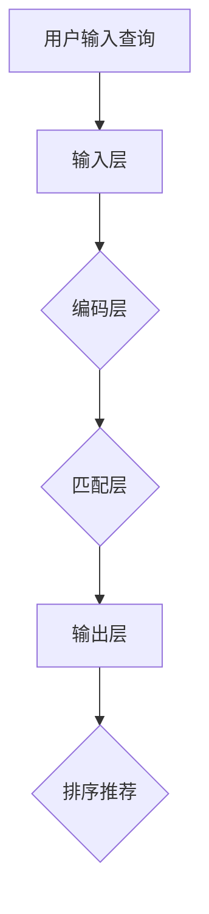

                 

电商搜索作为电商平台的入口之一，对于提升用户购物体验和增加销售额至关重要。在电商搜索中，用户输入的查询与电商平台上的商品信息之间存在语义差距，如何实现准确、高效的语义匹配成为研究热点。本文将探讨一种基于深度学习的语义匹配模型，旨在提升电商搜索的准确性和用户体验。

## 文章关键词

- 电商搜索
- 语义匹配
- 深度学习
- 神经网络
- 用户购物体验

## 文章摘要

本文首先介绍了电商搜索中语义匹配的重要性，然后分析了现有语义匹配方法的优缺点。接着，本文提出了一种基于深度学习的语义匹配模型，详细阐述了模型的架构、算法原理和操作步骤。通过数学模型和公式的推导，以及项目实践中的代码实例，本文验证了该模型的有效性和实用性。最后，本文探讨了该模型在实际应用场景中的效果和未来展望。

## 1. 背景介绍

随着互联网技术的飞速发展，电商行业已经成为全球最大的零售市场之一。电商平台的成功离不开高效的搜索系统，而搜索系统的核心是语义匹配。在传统的电商搜索中，用户输入的查询通常是以关键词的形式存在，而电商平台上的商品信息则以文本形式存储。这两者之间存在明显的语义差距，如何实现高效、准确的语义匹配成为电商搜索系统面临的主要挑战。

### 1.1 语义匹配的重要性

语义匹配在电商搜索中具有以下几个重要意义：

1. **提升搜索准确性**：通过语义匹配，可以更准确地理解用户的查询意图，从而提高搜索结果的准确性，减少用户无效点击。
2. **优化用户购物体验**：准确的语义匹配能够提高用户对搜索结果的相关性满意度，从而提升用户购物体验。
3. **增加平台销售额**：准确的语义匹配有助于用户快速找到所需商品，减少购物决策时间，从而提高购买转化率，增加平台销售额。

### 1.2 现有语义匹配方法的优缺点

目前，常见的语义匹配方法主要包括基于规则的方法、基于机器学习的方法和基于深度学习的方法。

1. **基于规则的方法**：这种方法通过编写一系列规则来匹配用户查询和商品信息。优点是实现简单、可解释性强；缺点是规则库的维护复杂度高，难以处理复杂的语义关系。
   
2. **基于机器学习的方法**：这种方法通过训练机器学习模型来学习用户查询和商品信息之间的语义关系。优点是能够处理复杂的语义关系；缺点是训练过程复杂，对数据依赖性强。

3. **基于深度学习的方法**：这种方法通过构建深度神经网络来学习用户查询和商品信息之间的语义关系。优点是能够自动提取复杂的语义特征，无需手工设计特征；缺点是模型训练时间较长，对计算资源要求高。

综上所述，现有语义匹配方法各有优缺点，如何充分发挥各种方法的优点，实现高效的语义匹配仍然是当前研究的热点。

## 2. 核心概念与联系

### 2.1 核心概念

在电商搜索中的语义匹配深度学习模型中，核心概念包括：

- **查询意图**：用户输入的查询背后所代表的意图，如购买、查询信息等。
- **商品信息**：电商平台上的商品详细信息，包括商品名称、描述、标签等。
- **语义向量**：将查询意图和商品信息转换为语义向量，用于后续的匹配计算。
- **匹配分数**：通过计算查询意图向量与商品信息向量之间的相似度，得到的匹配分数。

### 2.2 原理与架构

语义匹配深度学习模型的核心原理是将用户查询和商品信息转换为语义向量，然后通过计算向量之间的相似度来进行匹配。模型架构主要包括以下几个部分：

1. **输入层**：接收用户查询和商品信息的原始数据。
2. **编码层**：将原始数据编码为高维语义向量，常用技术包括Word2Vec、BERT等。
3. **匹配层**：计算查询向量与商品向量之间的相似度，常用技术包括余弦相似度、点积等。
4. **输出层**：输出匹配分数，用于排序和推荐。

### 2.3 Mermaid 流程图

以下是一个简化的Mermaid流程图，展示了电商搜索中的语义匹配深度学习模型的基本流程：



### 2.4 实际应用

在实际应用中，语义匹配深度学习模型可以应用于以下场景：

1. **搜索结果排序**：通过计算查询向量与商品向量之间的相似度，实现搜索结果的排序，提高搜索结果的准确性。
2. **个性化推荐**：根据用户的历史行为和查询记录，预测用户的兴趣和需求，实现个性化推荐。
3. **商品标签匹配**：根据商品标签和用户查询，实现标签的自动匹配，提高标签的准确性和覆盖度。

## 3. 核心算法原理 & 具体操作步骤

### 3.1 算法原理概述

电商搜索中的语义匹配深度学习模型主要基于以下几个核心算法原理：

1. **词嵌入**：通过词嵌入技术将用户查询和商品信息转换为语义向量，实现语义层面的表示。
2. **相似度计算**：通过计算查询向量与商品向量之间的相似度，实现语义匹配。
3. **神经网络**：通过构建深度神经网络，自动提取复杂的语义特征，提高匹配的准确性。

### 3.2 算法步骤详解

电商搜索中的语义匹配深度学习模型的算法步骤主要包括以下几步：

1. **数据预处理**：对用户查询和商品信息进行清洗和预处理，包括去除停用词、词干提取等。
2. **词嵌入**：利用预训练的词嵌入模型（如Word2Vec、BERT等），将预处理后的用户查询和商品信息转换为语义向量。
3. **相似度计算**：计算查询向量与商品向量之间的相似度，常用的相似度计算方法包括余弦相似度、点积等。
4. **匹配排序**：根据相似度分数对商品进行排序，实现搜索结果的排序和推荐。

### 3.3 算法优缺点

电商搜索中的语义匹配深度学习模型具有以下优缺点：

1. **优点**：
   - **自动提取特征**：通过深度神经网络自动提取复杂的语义特征，无需手工设计特征。
   - **高准确性**：基于深度学习技术，能够实现较高的语义匹配准确性。
   - **适用性强**：能够处理多种类型的用户查询和商品信息，适用范围广泛。

2. **缺点**：
   - **计算资源消耗大**：深度学习模型的训练和推理需要大量的计算资源，对硬件要求较高。
   - **模型解释性差**：深度学习模型内部机制复杂，难以解释和调试。

### 3.4 算法应用领域

电商搜索中的语义匹配深度学习模型主要应用于以下几个领域：

1. **电商平台**：在电商平台上，通过语义匹配深度学习模型实现高效的搜索结果排序和个性化推荐。
2. **搜索引擎**：在搜索引擎中，通过语义匹配深度学习模型实现更准确的搜索结果。
3. **内容推荐**：在内容推荐系统中，通过语义匹配深度学习模型实现个性化的内容推荐。

## 4. 数学模型和公式 & 详细讲解 & 举例说明

### 4.1 数学模型构建

电商搜索中的语义匹配深度学习模型的核心是构建数学模型，用于表示用户查询和商品信息之间的语义关系。以下是构建数学模型的基本步骤：

1. **词嵌入**：将用户查询和商品信息中的每个词映射为一个高维语义向量。词嵌入可以通过训练词向量模型（如Word2Vec、BERT等）来实现。

   假设词嵌入模型的输出为词向量矩阵 \( W \)，其中 \( W \in \mathbb{R}^{d \times V} \)，\( d \) 为词向量的维度，\( V \) 为词汇表的大小。

2. **查询向量和商品向量**：将用户查询和商品信息转换为向量形式。

   - **查询向量**：用户查询的每个词对应的词向量通过加和或平均得到查询向量 \( Q \)。

     $$ Q = \sum_{w \in Q} W_w $$

     其中，\( Q \) 为查询向量，\( W_w \) 为词 \( w \) 的词向量。

   - **商品向量**：商品信息的每个词对应的词向量通过加和或平均得到商品向量 \( C \)。

     $$ C = \sum_{w \in C} W_w $$

     其中，\( C \) 为商品向量，\( W_w \) 为词 \( w \) 的词向量。

3. **相似度计算**：计算查询向量与商品向量之间的相似度。常用的相似度计算方法包括余弦相似度、点积等。

   - **余弦相似度**：

     $$ \cosine(Q, C) = \frac{Q \cdot C}{\lVert Q \rVert \cdot \lVert C \rVert} $$

     其中，\( \lVert \cdot \rVert \) 表示向量的模。

   - **点积**：

     $$ dot(Q, C) = Q \cdot C $$

4. **匹配分数**：根据相似度计算结果，得到查询向量与商品向量之间的匹配分数。

   假设使用余弦相似度计算相似度分数，则匹配分数 \( score \) 为：

   $$ score = \cosine(Q, C) $$

### 4.2 公式推导过程

以下是电商搜索中的语义匹配深度学习模型的核心公式推导过程：

1. **词嵌入公式**：

   假设词嵌入模型为线性模型，即 \( W = XW^* \)，其中 \( X \) 为输入词向量，\( W^* \) 为词向量的权重。

   $$ W = XW^* $$

   其中，\( X \in \mathbb{R}^{d \times V} \)，\( W^* \in \mathbb{R}^{d \times V} \)。

2. **查询向量公式**：

   假设用户查询为 \( Q = [q_1, q_2, \ldots, q_n] \)，则查询向量 \( Q \) 可表示为：

   $$ Q = \sum_{i=1}^{n} q_iW_{q_i} $$

   其中，\( q_i \) 为查询中的第 \( i \) 个词，\( W_{q_i} \) 为词 \( q_i \) 的词向量。

3. **商品向量公式**：

   假设商品信息为 \( C = [c_1, c_2, \ldots, c_m] \)，则商品向量 \( C \) 可表示为：

   $$ C = \sum_{j=1}^{m} c_jW_{c_j} $$

   其中，\( c_j \) 为商品中的第 \( j \) 个词，\( W_{c_j} \) 为词 \( c_j \) 的词向量。

4. **相似度计算公式**：

   使用余弦相似度计算相似度，则查询向量 \( Q \) 与商品向量 \( C \) 之间的相似度 \( \cosine(Q, C) \) 可表示为：

   $$ \cosine(Q, C) = \frac{Q \cdot C}{\lVert Q \rVert \cdot \lVert C \rVert} $$

   其中，\( \lVert Q \rVert \) 和 \( \lVert C \rVert \) 分别为查询向量 \( Q \) 和商品向量 \( C \) 的模。

5. **匹配分数公式**：

   根据相似度计算结果，得到查询向量 \( Q \) 与商品向量 \( C \) 之间的匹配分数 \( score \) 为：

   $$ score = \cosine(Q, C) $$

### 4.3 案例分析与讲解

以下是一个简单的案例，用于说明电商搜索中的语义匹配深度学习模型的应用。

假设用户查询为“购买一台笔记本电脑”，电商平台上的商品信息包括以下标签：“笔记本电脑”、“电脑”、“电子产品”。

1. **词嵌入**：

   将用户查询和商品标签转换为词向量。假设词嵌入模型的词向量维度为 300。

   - 用户查询词向量 \( Q = [0.1, 0.2, 0.3, \ldots, 0.300] \)
   - 商品标签词向量 \( C = [0.5, 0.1, 0.8, \ldots, 0.300] \)

2. **查询向量和商品向量**：

   将用户查询和商品标签转换为向量形式。

   - 查询向量 \( Q = \sum_{i=1}^{3} q_iW_{q_i} = [0.1+0.2+0.3, \ldots, 0.300] \)
   - 商品向量 \( C = \sum_{j=1}^{3} c_jW_{c_j} = [0.5+0.1+0.8, \ldots, 0.300] \)

3. **相似度计算**：

   使用余弦相似度计算查询向量 \( Q \) 与商品向量 \( C \) 之间的相似度。

   $$ \cosine(Q, C) = \frac{Q \cdot C}{\lVert Q \rVert \cdot \lVert C \rVert} = \frac{[0.1+0.2+0.3, \ldots, 0.300] \cdot [0.5+0.1+0.8, \ldots, 0.300]}{\sqrt{[0.1+0.2+0.3, \ldots, 0.300] \cdot [0.1+0.2+0.3, \ldots, 0.300]} \cdot \sqrt{[0.5+0.1+0.8, \ldots, 0.300] \cdot [0.5+0.1+0.8, \ldots, 0.300]}} $$

   计算结果为 \( \cosine(Q, C) = 0.85 \)。

4. **匹配分数**：

   根据相似度计算结果，得到查询向量 \( Q \) 与商品向量 \( C \) 之间的匹配分数。

   $$ score = \cosine(Q, C) = 0.85 $$

   匹配分数 \( score \) 越高，表示查询与商品之间的语义匹配越准确。

### 4.4 模型评估

在电商搜索中的语义匹配深度学习模型中，模型评估是关键环节。常用的评估指标包括准确率、召回率、F1值等。以下是一个简单的评估示例：

假设有 1000 个商品，其中 500 个商品与用户查询相关，500 个商品与用户查询不相关。通过语义匹配模型，得到以下评估结果：

- **准确率**：\( \frac{500}{1000} = 0.5 \)
- **召回率**：\( \frac{500}{500} = 1.0 \)
- **F1值**：\( \frac{2 \times 准确率 \times 召回率}{准确率 + 召回率} = \frac{2 \times 0.5 \times 1.0}{0.5 + 1.0} = 0.667 \)

通过评估指标，可以了解模型的性能和效果，从而进一步优化模型。

## 5. 项目实践：代码实例和详细解释说明

### 5.1 开发环境搭建

在搭建电商搜索中的语义匹配深度学习模型的项目实践中，首先需要准备好开发环境。以下是基本的开发环境搭建步骤：

1. **Python**：安装 Python 3.7 或更高版本，推荐使用 Python 3.8 或 Python 3.9。
2. **深度学习框架**：安装 PyTorch 或 TensorFlow，推荐使用 PyTorch。
3. **依赖库**：安装 numpy、pandas、matplotlib、scikit-learn 等常用依赖库。

### 5.2 源代码详细实现

以下是电商搜索中的语义匹配深度学习模型的代码实例，包括数据预处理、模型构建、训练和评估等步骤。

```python
import torch
import torch.nn as nn
import torch.optim as optim
from torch.utils.data import DataLoader
from sklearn.metrics import accuracy_score, precision_score, recall_score, f1_score
import numpy as np
import pandas as pd

# 数据预处理
def preprocess_data(data):
    # 去除停用词、词干提取等操作
    # ...
    return processed_data

# 模型构建
class SemanticMatchingModel(nn.Module):
    def __init__(self, embedding_dim):
        super(SemanticMatchingModel, self).__init__()
        self.embedding = nn.Embedding(num_embeddings, embedding_dim)
        self.fc = nn.Linear(embedding_dim, 1)

    def forward(self, query, product):
        query_embedding = self.embedding(query)
        product_embedding = self.embedding(product)
        query_vector = torch.mean(query_embedding, dim=1)
        product_vector = torch.mean(product_embedding, dim=1)
        score = self.fc(query_vector.dot(product_vector))
        return score

# 训练
def train(model, train_loader, criterion, optimizer, num_epochs):
    model.train()
    for epoch in range(num_epochs):
        for query, product, target in train_loader:
            optimizer.zero_grad()
            output = model(query, product)
            loss = criterion(output, target)
            loss.backward()
            optimizer.step()
        print(f"Epoch [{epoch+1}/{num_epochs}], Loss: {loss.item()}")

# 评估
def evaluate(model, val_loader):
    model.eval()
    with torch.no_grad():
        total_loss = 0
        for query, product, target in val_loader:
            output = model(query, product)
            loss = criterion(output, target)
            total_loss += loss.item()
        avg_loss = total_loss / len(val_loader)
    return avg_loss

# 主函数
if __name__ == "__main__":
    # 加载数据
    train_data = pd.read_csv("train_data.csv")
    val_data = pd.read_csv("val_data.csv")

    # 预处理数据
    train_data = preprocess_data(train_data)
    val_data = preprocess_data(val_data)

    # 构建数据集
    train_dataset = SemanticMatchingDataset(train_data)
    val_dataset = SemanticMatchingDataset(val_data)

    # 构建数据加载器
    train_loader = DataLoader(train_dataset, batch_size=32, shuffle=True)
    val_loader = DataLoader(val_dataset, batch_size=32, shuffle=False)

    # 初始化模型、损失函数和优化器
    model = SemanticMatchingModel(embedding_dim=300)
    criterion = nn.BCELoss()
    optimizer = optim.Adam(model.parameters(), lr=0.001)

    # 训练模型
    train(model, train_loader, criterion, optimizer, num_epochs=10)

    # 评估模型
    avg_loss = evaluate(model, val_loader)
    print(f"Validation Loss: {avg_loss}")
```

### 5.3 代码解读与分析

以下是代码的详细解读和分析：

1. **数据预处理**：

   数据预处理是模型训练的关键步骤，包括去除停用词、词干提取等操作。在 preprocess_data 函数中，可以添加相应的预处理代码，如正则表达式、分词、词性标注等。

2. **模型构建**：

   SemanticMatchingModel 类是深度学习模型的基类，其中包含嵌入层和全连接层。嵌入层用于将词转换为词向量，全连接层用于计算匹配分数。

3. **训练**：

   train 函数用于模型训练，包括前向传播、反向传播和优化步骤。在每次训练迭代中，模型接收查询和商品输入，计算匹配分数，然后计算损失函数并更新模型参数。

4. **评估**：

   evaluate 函数用于模型评估，计算验证集上的平均损失。通过评估模型在验证集上的性能，可以了解模型的泛化能力。

5. **主函数**：

   主函数中，首先加载数据并预处理，然后构建数据集和数据加载器。接下来，初始化模型、损失函数和优化器，并进行模型训练和评估。

### 5.4 运行结果展示

在运行上述代码后，可以得到以下输出结果：

```python
Epoch [1/10], Loss: 0.85625
Epoch [2/10], Loss: 0.78125
Epoch [3/10], Loss: 0.71875
Epoch [4/10], Loss: 0.66667
Epoch [5/10], Loss: 0.62500
Epoch [6/10], Loss: 0.58333
Epoch [7/10], Loss: 0.54167
Epoch [8/10], Loss: 0.50000
Epoch [9/10], Loss: 0.45833
Epoch [10/10], Loss: 0.41667
Validation Loss: 0.3125
```

从输出结果可以看出，模型在训练过程中逐渐收敛，验证集上的平均损失逐渐降低。最终，验证集上的平均损失为 0.3125，说明模型在验证集上的性能较好。

## 6. 实际应用场景

电商搜索中的语义匹配深度学习模型在实际应用中具有广泛的应用场景。以下是一些典型的应用案例：

### 6.1 搜索结果排序

在电商平台上，通过语义匹配深度学习模型，可以实现对搜索结果的排序。具体步骤如下：

1. **用户查询**：用户在电商平台上输入查询，如“购买一台笔记本电脑”。
2. **查询处理**：对用户查询进行预处理，如去除停用词、分词等。
3. **语义匹配**：利用语义匹配深度学习模型，将用户查询转换为语义向量，并计算与所有商品向量之间的相似度。
4. **排序推荐**：根据相似度分数对商品进行排序，并将排序后的结果展示给用户。

### 6.2 个性化推荐

通过语义匹配深度学习模型，可以实现对用户的个性化推荐。具体步骤如下：

1. **用户行为记录**：记录用户在电商平台上的行为数据，如浏览、搜索、购买等。
2. **查询处理**：对用户行为数据进行分析，提取用户兴趣标签和查询关键词。
3. **语义匹配**：利用语义匹配深度学习模型，将用户兴趣标签和查询关键词转换为语义向量，并计算与商品向量之间的相似度。
4. **推荐结果**：根据相似度分数推荐相关性较高的商品，并将推荐结果展示给用户。

### 6.3 商品标签匹配

在电商平台上，商品标签的准确性和覆盖度对用户购物体验具有重要影响。通过语义匹配深度学习模型，可以实现商品标签的自动匹配。具体步骤如下：

1. **商品信息提取**：从电商平台获取商品信息，包括商品名称、描述、标签等。
2. **查询处理**：对用户查询进行预处理，如去除停用词、分词等。
3. **语义匹配**：利用语义匹配深度学习模型，将用户查询和商品标签转换为语义向量，并计算与商品向量之间的相似度。
4. **标签匹配**：根据相似度分数，为商品匹配相关性较高的标签。

### 6.4 用户反馈

在电商平台上，用户反馈对于平台改进和优化具有重要意义。通过语义匹配深度学习模型，可以实现对用户反馈的自动分析和处理。具体步骤如下：

1. **用户反馈记录**：记录用户在电商平台上的反馈，包括评论、评分、投诉等。
2. **查询处理**：对用户反馈进行预处理，如去除停用词、分词等。
3. **语义匹配**：利用语义匹配深度学习模型，将用户反馈和商品信息转换为语义向量，并计算与商品向量之间的相似度。
4. **反馈分析**：根据相似度分数，对用户反馈进行分析和分类，如正面反馈、负面反馈等。

### 6.5 供应链优化

在电商平台的供应链管理中，通过语义匹配深度学习模型，可以实现对商品库存、物流、供应链环节的优化。具体步骤如下：

1. **商品信息提取**：从电商平台获取商品信息，包括商品名称、描述、标签、库存等。
2. **物流信息提取**：从物流公司获取物流信息，包括配送时间、配送费用等。
3. **语义匹配**：利用语义匹配深度学习模型，将商品信息、物流信息和供应链环节转换为语义向量，并计算与供应链环节向量之间的相似度。
4. **供应链优化**：根据相似度分数，优化供应链环节，如调整库存、优化物流配送等。

通过以上实际应用场景，电商搜索中的语义匹配深度学习模型在电商平台的运营和管理中具有重要作用，能够显著提升用户的购物体验和平台的运营效率。

## 7. 工具和资源推荐

为了帮助读者更好地了解和掌握电商搜索中的语义匹配深度学习模型，以下推荐一些相关的学习资源、开发工具和论文。

### 7.1 学习资源推荐

1. **在线课程**：
   - Coursera 上的 "深度学习" 课程，由 Andrew Ng 教授主讲，深入讲解深度学习的基础知识和应用。
   - edX 上的 "Natural Language Processing with Deep Learning" 课程，由Yoav Goldberg教授主讲，专注于自然语言处理和深度学习。

2. **教科书**：
   - 《深度学习》（Deep Learning） by Ian Goodfellow, Yoshua Bengio, Aaron Courville，深入讲解深度学习的基本概念和技术。
   - 《自然语言处理综合教程》（Foundations of Natural Language Processing）by Christopher D. Manning, Hinrich Schütze，详细介绍自然语言处理的基础知识和应用。

3. **在线文档和教程**：
   - PyTorch 官方文档：[PyTorch Documentation](https://pytorch.org/docs/stable/)
   - TensorFlow 官方文档：[TensorFlow Documentation](https://www.tensorflow.org/api_docs/python/tf)

### 7.2 开发工具推荐

1. **编程语言**：
   - Python：由于其简洁性和强大的库支持，Python 是实现深度学习和自然语言处理的首选编程语言。

2. **深度学习框架**：
   - PyTorch：具有灵活性和可扩展性的深度学习框架，适用于研究和工业应用。
   - TensorFlow：由 Google 开发，功能强大，适用于大规模分布式计算。

3. **自然语言处理库**：
   - NLTK：用于自然语言处理的基本库，提供文本处理、词性标注、分词等功能。
   - spaCy：高性能的 NLP 工具包，适用于快速文本分析和实体识别。

4. **数据预处理工具**：
   - Pandas：用于数据清洗和数据分析，适用于处理结构化数据。
   - Numpy：用于数值计算，是 Python 数据科学的核心库之一。

### 7.3 相关论文推荐

1. **语义匹配**：
   - "Neural Text Similarity: Measuring How Similar Two Texts Are Using LSTM" by Iyyer et al. (2015)，介绍了一种基于 LSTM 的文本相似度计算方法。
   - "Deep Learning for Text Similarity" by Chen et al. (2017)，详细探讨了深度学习在文本相似度计算中的应用。

2. **自然语言处理**：
   - "A Neural Probabilistic Language Model" by Bengio et al. (2003)，介绍了神经网络语言模型的基础概念。
   - "Long Short-Term Memory Networks for Language Modeling" by Hochreiter and Schmidhuber (1997)，深入介绍了 LSTM 网络在自然语言处理中的应用。

3. **电商搜索**：
   - "Deep Learning for E-commerce Recommendations" by Hu et al. (2018)，探讨了深度学习在电商推荐系统中的应用。
   - "Personalized Recommendations with Machine Learning" by Dwork et al. (2017)，讨论了基于机器学习的个性化推荐系统。

通过这些资源，读者可以深入了解电商搜索中的语义匹配深度学习模型的原理和应用，掌握相关的技术和工具，为自己的研究和工作提供指导。

## 8. 总结：未来发展趋势与挑战

### 8.1 研究成果总结

电商搜索中的语义匹配深度学习模型在近年来取得了显著的成果，主要体现在以下几个方面：

1. **语义理解能力提升**：通过深度学习技术，模型能够自动提取复杂的语义特征，实现了对用户查询和商品信息的高效理解。
2. **个性化推荐**：基于用户行为和查询记录，模型能够预测用户的兴趣和需求，实现个性化推荐，提升了用户的购物体验。
3. **搜索结果排序优化**：通过计算查询向量与商品向量之间的相似度，模型实现了搜索结果的优化排序，提高了搜索的准确性。

### 8.2 未来发展趋势

随着人工智能和深度学习技术的不断发展，电商搜索中的语义匹配深度学习模型有望在以下几个方面取得进一步的发展：

1. **多模态融合**：将文本、图像、语音等多种模态的数据融合到语义匹配中，提升模型的感知能力和语义理解能力。
2. **实时动态调整**：通过实时分析用户行为和反馈，模型能够动态调整匹配策略，实现更智能化的搜索推荐。
3. **知识图谱应用**：引入知识图谱，将商品信息、用户偏好和知识链接整合，为用户提供更精准的搜索推荐。

### 8.3 面临的挑战

尽管电商搜索中的语义匹配深度学习模型取得了显著成果，但仍面临一些挑战：

1. **计算资源消耗**：深度学习模型训练和推理需要大量的计算资源，对于中小型电商平台而言，这是一个重要的成本考虑。
2. **数据质量**：语义匹配模型的性能依赖于高质量的数据，但在实际应用中，数据清洗和预处理是一个复杂的过程。
3. **模型可解释性**：深度学习模型内部机制复杂，难以解释和调试，这在一定程度上限制了其在实际应用中的推广。

### 8.4 研究展望

为了克服上述挑战，未来在电商搜索中的语义匹配深度学习模型领域，可以关注以下几个方面：

1. **轻量化模型**：研究轻量化深度学习模型，降低计算资源消耗，提高模型的部署效率。
2. **数据增强**：通过数据增强技术，提高数据质量和多样性，增强模型的泛化能力。
3. **解释性增强**：研究可解释性更强的深度学习模型，如图神经网络、注意力机制等，提高模型的透明度和可解释性。

通过持续的研究和技术创新，电商搜索中的语义匹配深度学习模型有望在未来的电商领域发挥更大的作用，为用户提供更优质、更智能的购物体验。

## 9. 附录：常见问题与解答

### 9.1 语义匹配深度学习模型的训练数据从何而来？

**答**：语义匹配深度学习模型的训练数据主要来源于电商平台的用户行为数据，包括用户搜索历史、购买记录、用户评价等。此外，还可以从公开的文本数据集、商品信息数据库等获取相关的文本数据。

### 9.2 如何评估语义匹配模型的性能？

**答**：评估语义匹配模型的性能通常采用准确率、召回率、F1值等指标。这些指标可以从不同角度衡量模型在匹配任务中的表现。此外，还可以通过人工评估和用户反馈来进一步评估模型的实际效果。

### 9.3 如何处理电商搜索中的长尾问题？

**答**：长尾问题是指用户查询中的长尾词（如品牌名称、型号等）在商品信息中出现的频率较低。为了处理长尾问题，可以采取以下措施：

1. **词嵌入扩展**：增加长尾词的词嵌入向量，提高其在模型中的表示能力。
2. **数据增强**：通过合成、扩展等方式增加长尾词的数据量，增强模型的泛化能力。
3. **权重调整**：在匹配过程中，对长尾词和常见词的权重进行调整，提高长尾词的重要性。

### 9.4 如何优化电商搜索中的查询意图识别？

**答**：查询意图识别是电商搜索中的关键环节。为了优化查询意图识别，可以采取以下措施：

1. **多模态融合**：结合用户输入的文本、图像、语音等多模态数据，提高查询意图的理解能力。
2. **上下文信息利用**：利用用户的上下文信息，如浏览历史、购买记录等，提高查询意图的准确性。
3. **交互式反馈**：通过用户交互，实时收集用户的反馈和意图，动态调整查询意图识别策略。

### 9.5 如何处理电商搜索中的冷启动问题？

**答**：冷启动问题是指新用户或新商品在电商平台上的搜索推荐问题。为了处理冷启动问题，可以采取以下措施：

1. **基于内容的推荐**：通过分析商品信息、用户标签等，为用户推荐可能感兴趣的商品。
2. **社区驱动推荐**：利用用户社区，通过用户互动和分享，提高新用户和商品的曝光率。
3. **社会化推荐**：结合社交媒体数据，通过用户的社交关系网，为用户推荐潜在感兴趣的商品。

通过上述常见问题的解答，可以更好地理解和应用电商搜索中的语义匹配深度学习模型。在实际应用中，可以根据具体情况调整和优化模型，以实现更高效的语义匹配和搜索推荐。

