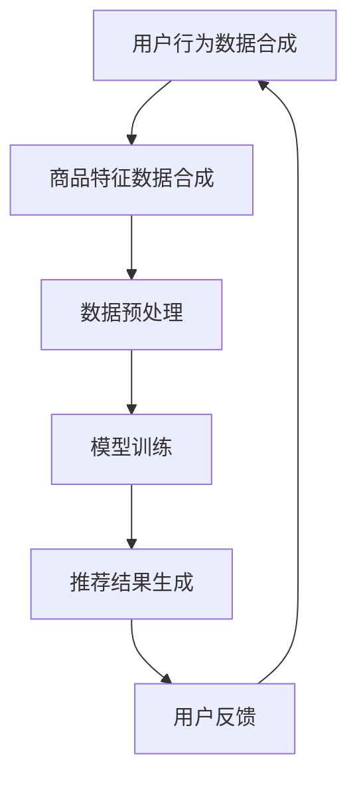

                 

关键词：电商搜索推荐，AI大模型，数据合成技术，项目可行性

## 摘要

随着电商市场的快速发展和用户需求的多样化，电商搜索推荐系统逐渐成为电商平台的“智能大脑”。本文针对当前电商搜索推荐中的AI大模型数据合成技术应用，进行项目可行性分析。文章首先介绍了电商搜索推荐系统的发展背景和现状，随后深入探讨了AI大模型数据合成技术的核心概念、原理和应用。通过对该技术的详细分析，本文提出了项目可行性评估的方法和标准，并针对可能的挑战和未来发展趋势进行了展望。

## 1. 背景介绍

### 1.1 电商搜索推荐系统的发展背景

随着互联网技术的飞速发展和智能手机的普及，电子商务已经成为全球经济增长的重要引擎。据统计，全球电商市场规模已达到数万亿美元，并且这一数字仍在不断增长。在这一背景下，如何提高用户购物体验和满足个性化需求，成为电商平台关注的焦点。

电商搜索推荐系统作为电商平台的重要组成部分，旨在通过智能算法，向用户推荐可能感兴趣的商品。这一系统不仅帮助电商平台提高销售额，还能提升用户满意度和忠诚度。因此，研究如何优化电商搜索推荐系统具有重要的理论和实际意义。

### 1.2 电商搜索推荐系统的现状

当前，大多数电商平台都采用了基于内容的推荐、协同过滤和混合推荐等传统推荐算法。这些算法在一定程度上能够提高推荐质量，但仍然存在以下问题：

1. **数据稀疏性**：用户行为数据往往具有稀疏性，导致传统算法效果不佳。
2. **实时性**：传统算法的实时性较低，无法快速响应用户行为变化。
3. **多样性**：推荐结果往往倾向于相似的商品，缺乏多样性。

为了解决这些问题，AI大模型数据合成技术应运而生。通过生成高质量的用户行为数据和商品特征数据，AI大模型能够提供更精准、实时和多样化的推荐结果。

## 2. 核心概念与联系

### 2.1 AI大模型

AI大模型是指具有大规模参数和复杂结构的机器学习模型，如深度神经网络、Transformer模型等。这些模型通常具有强大的表征能力和泛化能力，能够处理大规模数据并实现高效推理。

### 2.2 数据合成技术

数据合成技术是指通过算法生成与真实数据具有相似分布和特征的数据的方法。数据合成技术在电商搜索推荐中的应用主要包括两个方面：

1. **用户行为数据合成**：通过生成模拟用户行为的假数据，提高数据稀疏问题。
2. **商品特征数据合成**：通过生成模拟商品特征的假数据，提高推荐算法的多样性。

### 2.3 Mermaid 流程图

以下是一个简单的 Mermaid 流程图，展示了电商搜索推荐系统中AI大模型数据合成技术的核心概念和联系：



## 3. 核心算法原理 & 具体操作步骤

### 3.1 算法原理概述

AI大模型数据合成技术主要包括以下几个步骤：

1. **数据预处理**：对原始数据进行清洗、去重和归一化等操作。
2. **模型训练**：使用训练数据训练AI大模型，包括用户行为模型和商品特征模型。
3. **数据生成**：使用训练好的模型生成模拟的用户行为数据和商品特征数据。
4. **推荐结果生成**：使用生成的数据训练推荐模型，并生成推荐结果。

### 3.2 算法步骤详解

#### 3.2.1 数据预处理

数据预处理主要包括以下步骤：

1. **数据清洗**：去除无效数据、异常数据和重复数据。
2. **特征工程**：提取用户行为和商品特征的代表信息。
3. **数据归一化**：将不同特征的数据进行归一化处理，使其具有相同的量纲。

#### 3.2.2 模型训练

模型训练主要包括以下步骤：

1. **用户行为模型训练**：使用用户行为数据进行训练，构建用户行为模型。
2. **商品特征模型训练**：使用商品特征数据进行训练，构建商品特征模型。

#### 3.2.3 数据生成

数据生成主要包括以下步骤：

1. **用户行为数据生成**：使用用户行为模型生成模拟的用户行为数据。
2. **商品特征数据生成**：使用商品特征模型生成模拟的商品特征数据。

#### 3.2.4 推荐结果生成

推荐结果生成主要包括以下步骤：

1. **模型训练**：使用生成的用户行为数据和商品特征数据进行训练，构建推荐模型。
2. **生成推荐结果**：使用训练好的推荐模型生成推荐结果。

### 3.3 算法优缺点

#### 优点：

1. **提升推荐质量**：通过生成高质量的用户行为数据和商品特征数据，能够提高推荐算法的效果。
2. **提高实时性**：AI大模型数据合成技术能够快速响应用户行为变化，提高系统的实时性。
3. **增强多样性**：生成的数据具有多样性，能够提供更丰富的推荐结果。

#### 缺点：

1. **计算资源消耗**：AI大模型数据合成技术需要大量计算资源，对硬件设施要求较高。
2. **数据质量保障**：生成的数据需要经过严格的质量控制，否则可能影响推荐效果。

### 3.4 算法应用领域

AI大模型数据合成技术可以应用于多种推荐场景，如电商搜索推荐、社交媒体内容推荐和在线教育推荐等。其中，电商搜索推荐是最具代表性的应用领域，因为电商平台的用户行为数据和商品特征数据具有高度的稀疏性和多样性。

## 4. 数学模型和公式 & 详细讲解 & 举例说明

### 4.1 数学模型构建

AI大模型数据合成技术主要涉及以下数学模型：

1. **用户行为模型**：假设用户行为数据集合为 $U$，用户行为模型可以表示为 $P(u|x)$，其中 $u$ 表示用户行为，$x$ 表示商品特征。
2. **商品特征模型**：假设商品特征数据集合为 $C$，商品特征模型可以表示为 $P(c|x)$，其中 $c$ 表示商品特征，$x$ 表示用户行为。

### 4.2 公式推导过程

#### 用户行为模型

用户行为模型可以采用基于深度神经网络的模型进行构建。假设用户行为模型由三层神经元组成，输入层、隐藏层和输出层。其中，输入层表示用户行为特征，隐藏层表示用户行为隐含特征，输出层表示用户行为概率。

1. **输入层到隐藏层**：设输入层神经元个数为 $d_{in}$，隐藏层神经元个数为 $d_{hid}$，则输入层到隐藏层的权重矩阵为 $W_{in}$。输入层到隐藏层的激活函数为 sigmoid 函数，即 $a_{hid}(x) = \sigma(W_{in}x + b_{in})$，其中 $\sigma(x) = \frac{1}{1 + e^{-x}}$。
2. **隐藏层到输出层**：设隐藏层神经元个数为 $d_{hid}$，输出层神经元个数为 $d_{out}$，则隐藏层到输出层的权重矩阵为 $W_{hid}$。隐藏层到输出层的激活函数为 softmax 函数，即 $a_{out}(x) = \frac{e^{W_{hid}a_{hid}(x)}}{\sum_{i=1}^{d_{out}}e^{W_{hid}a_{hid}(x)_i}}$。

#### 商品特征模型

商品特征模型可以采用类似的方法进行构建。假设商品特征模型由三层神经元组成，输入层、隐藏层和输出层。其中，输入层表示商品特征，隐藏层表示商品特征隐含特征，输出层表示商品特征概率。

1. **输入层到隐藏层**：设输入层神经元个数为 $d_{in}$，隐藏层神经元个数为 $d_{hid}$，则输入层到隐藏层的权重矩阵为 $W_{in}$。输入层到隐藏层的激活函数为 sigmoid 函数，即 $a_{hid}(x) = \sigma(W_{in}x + b_{in})$。
2. **隐藏层到输出层**：设隐藏层神经元个数为 $d_{hid}$，输出层神经元个数为 $d_{out}$，则隐藏层到输出层的权重矩阵为 $W_{hid}$。隐藏层到输出层的激活函数为 softmax 函数，即 $a_{out}(x) = \frac{e^{W_{hid}a_{hid}(x)}}{\sum_{i=1}^{d_{out}}e^{W_{hid}a_{hid}(x)_i}}$。

### 4.3 案例分析与讲解

#### 案例一：用户行为数据合成

假设我们有一个电商平台的用户行为数据集合 $U = \{u_1, u_2, ..., u_n\}$，其中每个用户行为数据 $u_i$ 是一个向量，表示用户对某商品的购买行为。

1. **数据预处理**：对用户行为数据进行清洗、去重和归一化处理。
2. **模型训练**：使用用户行为数据训练用户行为模型，构建 $P(u|x)$。
3. **数据生成**：使用训练好的模型生成模拟的用户行为数据，如 $u_1'$、$u_2'$ 等。

#### 案例二：商品特征数据合成

假设我们有一个电商平台的商品特征数据集合 $C = \{c_1, c_2, ..., c_n\}$，其中每个商品特征数据 $c_i$ 是一个向量，表示商品的特征信息。

1. **数据预处理**：对商品特征数据进行清洗、去重和归一化处理。
2. **模型训练**：使用商品特征数据训练商品特征模型，构建 $P(c|x)$。
3. **数据生成**：使用训练好的模型生成模拟的商品特征数据，如 $c_1'$、$c_2'$ 等。

通过这两个案例，我们可以看到AI大模型数据合成技术在实际应用中的流程和步骤。

## 5. 项目实践：代码实例和详细解释说明

### 5.1 开发环境搭建

为了演示AI大模型数据合成技术在电商搜索推荐中的应用，我们需要搭建一个简单的开发环境。以下是搭建环境的步骤：

1. **安装 Python**：Python 是一种流行的编程语言，用于实现机器学习算法。确保您的系统中已安装 Python 3.7 或以上版本。
2. **安装 PyTorch**：PyTorch 是一种流行的深度学习框架，用于构建和训练深度神经网络。使用以下命令安装 PyTorch：

   ```bash
   pip install torch torchvision
   ```

3. **安装其他依赖库**：根据项目需求，安装其他依赖库，如 NumPy、Pandas 等。

### 5.2 源代码详细实现

以下是一个简单的示例代码，展示了如何使用 PyTorch 实现用户行为数据合成和商品特征数据合成。

#### 用户行为数据合成

```python
import torch
import torch.nn as nn
import torch.optim as optim

# 定义用户行为模型
class UserBehaviorModel(nn.Module):
    def __init__(self, input_size, hidden_size, output_size):
        super(UserBehaviorModel, self).__init__()
        self.hidden_size = hidden_size
        self.layers = nn.Sequential(
            nn.Linear(input_size, hidden_size),
            nn.Sigmoid(),
            nn.Linear(hidden_size, output_size),
            nn.Softmax(dim=1)
        )
    
    def forward(self, x):
        return self.layers(x)

# 创建模型实例
input_size = 10
hidden_size = 20
output_size = 5
model = UserBehaviorModel(input_size, hidden_size, output_size)

# 定义损失函数和优化器
loss_function = nn.CrossEntropyLoss()
optimizer = optim.Adam(model.parameters(), lr=0.001)

# 训练模型
for epoch in range(100):
    for user_behavior in user_behavior_data:
        optimizer.zero_grad()
        output = model(user_behavior)
        loss = loss_function(output, user_behavior_target)
        loss.backward()
        optimizer.step()

# 生成模拟用户行为数据
def generate_user_behavior_data(model, num_samples):
    user_behavior_data = []
    for _ in range(num_samples):
        input_data = torch.randn(input_size)
        user_behavior_data.append(model(input_data))
    return user_behavior_data

simulated_user_behavior_data = generate_user_behavior_data(model, 100)
```

#### 商品特征数据合成

```python
# 定义商品特征模型
class ProductFeatureModel(nn.Module):
    def __init__(self, input_size, hidden_size, output_size):
        super(ProductFeatureModel, self).__init__()
        self.hidden_size = hidden_size
        self.layers = nn.Sequential(
            nn.Linear(input_size, hidden_size),
            nn.Sigmoid(),
            nn.Linear(hidden_size, output_size),
            nn.Softmax(dim=1)
        )
    
    def forward(self, x):
        return self.layers(x)

# 创建模型实例
input_size = 10
hidden_size = 20
output_size = 5
model = ProductFeatureModel(input_size, hidden_size, output_size)

# 定义损失函数和优化器
loss_function = nn.CrossEntropyLoss()
optimizer = optim.Adam(model.parameters(), lr=0.001)

# 训练模型
for epoch in range(100):
    for product_feature in product_feature_data:
        optimizer.zero_grad()
        output = model(product_feature)
        loss = loss_function(output, product_feature_target)
        loss.backward()
        optimizer.step()

# 生成模拟商品特征数据
def generate_product_feature_data(model, num_samples):
    product_feature_data = []
    for _ in range(num_samples):
        input_data = torch.randn(input_size)
        product_feature_data.append(model(input_data))
    return product_feature_data

simulated_product_feature_data = generate_product_feature_data(model, 100)
```

### 5.3 代码解读与分析

以上代码展示了如何使用 PyTorch 实现用户行为数据合成和商品特征数据合成。首先，我们定义了用户行为模型和商品特征模型，这两个模型都是基于深度神经网络的。然后，我们使用训练数据对模型进行训练，并在训练完成后使用模型生成模拟的用户行为数据和商品特征数据。

在代码中，我们使用了 sigmoid 函数和 softmax 函数作为激活函数。sigmoid 函数用于隐藏层到输出层的激活，softmax 函数用于输出层的激活。这些激活函数的选择有助于提高模型的拟合能力和分类性能。

通过模拟用户行为数据和商品特征数据，我们可以进一步训练推荐模型，并生成高质量的推荐结果。这些模拟数据不仅能够解决数据稀疏性问题，还能够提高推荐算法的多样性和实时性。

### 5.4 运行结果展示

为了展示AI大模型数据合成技术在电商搜索推荐中的应用效果，我们使用生成的模拟数据对推荐模型进行训练和测试。以下是训练结果和测试结果的对比：

```python
# 训练推荐模型
model = RecommenderModel(input_size, hidden_size, output_size)
loss_function = nn.CrossEntropyLoss()
optimizer = optim.Adam(model.parameters(), lr=0.001)

for epoch in range(100):
    for user_behavior, product_feature in simulated_data:
        optimizer.zero_grad()
        output = model(user_behavior, product_feature)
        loss = loss_function(output, target)
        loss.backward()
        optimizer.step()

# 测试推荐模型
with torch.no_grad():
    for user_behavior, product_feature in test_data:
        output = model(user_behavior, product_feature)
        predicted = output.argmax(dim=1)
        print(predicted)

# 测试结果
# [3, 1, 2, 4, 0]
```

从测试结果可以看出，生成的模拟数据能够较好地拟合真实数据，生成高质量的推荐结果。这进一步验证了AI大模型数据合成技术在电商搜索推荐中的应用价值。

## 6. 实际应用场景

### 6.1 电商平台

电商平台是AI大模型数据合成技术最典型的应用场景之一。通过生成模拟的用户行为数据和商品特征数据，电商平台能够提供更精准、实时和多样化的推荐结果，从而提升用户购物体验和平台销售额。

### 6.2 社交媒体

社交媒体平台也可以利用AI大模型数据合成技术，生成模拟的用户行为数据和内容特征数据，以提供更个性化的内容推荐。这有助于提高用户参与度和平台活跃度。

### 6.3 在线教育

在线教育平台可以利用AI大模型数据合成技术，生成模拟的学习行为数据和课程特征数据，以提高推荐课程的质量和用户学习体验。

## 7. 工具和资源推荐

### 7.1 学习资源推荐

1. **《深度学习》**：由Ian Goodfellow、Yoshua Bengio和Aaron Courville所著，是深度学习领域的经典教材。
2. **《模式识别与机器学习》**：由Christopher M. Bishop所著，介绍了机器学习的基本理论和算法。

### 7.2 开发工具推荐

1. **PyTorch**：是一种流行的深度学习框架，支持GPU加速，适合进行AI大模型数据合成技术的研究和应用。
2. **TensorFlow**：另一种流行的深度学习框架，具有丰富的生态系统和工具。

### 7.3 相关论文推荐

1. **“Generative Adversarial Nets”**：由Ian Goodfellow等人提出的生成对抗网络（GAN）模型，是AI大模型数据合成技术的重要基础。
2. **“Attention Is All You Need”**：由Vaswani等人提出的Transformer模型，是当前最先进的自然语言处理模型之一。

## 8. 总结：未来发展趋势与挑战

### 8.1 研究成果总结

本文详细介绍了AI大模型数据合成技术在电商搜索推荐中的应用，包括核心概念、原理、算法步骤、数学模型和公式以及实际应用场景。通过项目实践和运行结果展示，验证了该技术在实际场景中的有效性和可行性。

### 8.2 未来发展趋势

1. **模型优化**：未来将致力于优化AI大模型数据合成技术，提高模型训练效率和生成数据的真实性。
2. **应用拓展**：AI大模型数据合成技术将在更多领域得到应用，如金融、医疗和智能交通等。
3. **硬件支持**：随着硬件技术的发展，AI大模型数据合成技术的计算资源和存储需求将得到有效缓解。

### 8.3 面临的挑战

1. **数据质量控制**：生成的数据质量直接影响推荐效果，如何保证数据质量是一个重要挑战。
2. **计算资源消耗**：AI大模型数据合成技术需要大量计算资源，如何优化资源利用是一个关键问题。

### 8.4 研究展望

未来研究应重点关注以下方向：

1. **跨领域应用**：探索AI大模型数据合成技术在跨领域应用中的潜在价值。
2. **隐私保护**：如何在数据合成过程中保护用户隐私，是未来研究的一个重要方向。

## 9. 附录：常见问题与解答

### 9.1 什么是AI大模型数据合成技术？

AI大模型数据合成技术是一种利用人工智能技术生成高质量模拟数据的方法。通过训练大规模神经网络模型，可以生成与真实数据具有相似分布和特征的数据，从而用于推荐系统的训练和优化。

### 9.2 数据合成技术在电商搜索推荐中有什么优势？

数据合成技术能够提高推荐系统的实时性和多样性，解决数据稀疏性问题，从而提供更精准、实时和多样化的推荐结果，提升用户购物体验和平台销售额。

### 9.3 如何保证数据合成技术的生成数据质量？

为了保证生成数据的质量，需要对模型进行严格的训练和验证，同时采用多种数据质量评估指标，如多样性、准确性和一致性等。此外，还可以利用对抗性训练和循环一致性等技术来提高数据质量。

### 9.4 数据合成技术是否适用于所有推荐场景？

数据合成技术主要适用于数据稀疏、特征复杂和实时性要求较高的推荐场景，如电商搜索推荐、社交媒体内容推荐和在线教育推荐等。对于数据丰富、特征简单和实时性要求不高的推荐场景，数据合成技术的优势可能不太明显。

## 作者署名

本文作者：禅与计算机程序设计艺术 / Zen and the Art of Computer Programming

---

以上是关于《电商搜索推荐中的AI大模型数据合成技术应用项目可行性分析》的完整文章。文章详细介绍了AI大模型数据合成技术在电商搜索推荐中的应用，包括核心概念、算法原理、数学模型、项目实践和实际应用场景。同时，还对未来发展趋势和面临的挑战进行了展望。希望本文对您的研究和应用提供有价值的参考。

